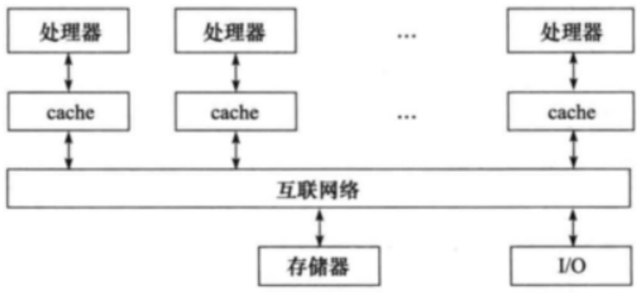
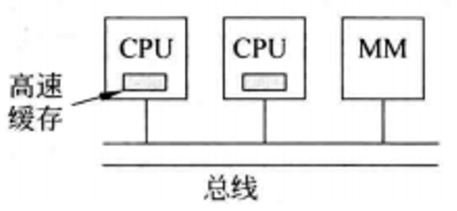
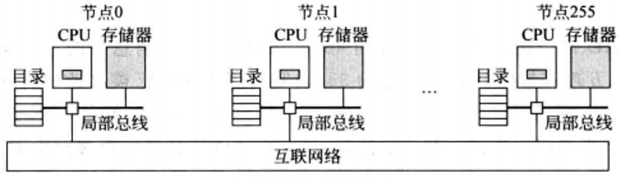

# 并行系统
随着信息技术的飞速发展,人们对计算机系统处理能力的要求越来越高。气象、生物、医药、天文等领域的高性能计算,互联网以及移动通信应用领域的海量“大数据”处理, 银行、保险、证券等大型数据库系统开发, 游戏、航空模拟等各种媒体处理软件方面的开发, 都需要计算机系统具有极其快速的处理能力。采用传统的单处理器系统中的串行计算方式,远远不能满足现代社会实际应用问题对计算能力的需求。

为了追求更高的计算性能,出现了各种不同的并行处理系统。通过采用多个功能部件或多个处理核或多个CPU或多台计算机的互连,使得一个系统中可同时进行多条指令或多个数据或多个线程或多个任务的处理,从而实现计算速度和计算能力的大幅提升。

在计算机科学中, 尤其是多处理器和并行计算领域, 通过简单地增加处理器的数量, 就能线性地提升系统的整体性能, 同时保持系统的可扩展性和高效性, 是一个我们长期追求的理想状态。也就是说, 在并行计算和分布式系统领域的一个重要趋势就是——利用**多处理器**(或称多核)架构来提高计算性能和效率。然而, 在实际应用中, 达到这种理想状态面临着诸多挑战。

## 多处理器(Multiprocessor)系统的挑战
---

1. 可伸缩性(Scalability): 又称可扩展性,是指通过扩展系统规模来提高性能,来处理更大数量的用户和通过扩展系统规模来提高系统的容错能力等。

2. 功耗问题: 多处理器系统需要更有效地管理功耗, 以避免过热和能源浪费。采用小型高性能处理器可以在功耗上有所优化, 但也需要更精细的功耗管理技术, 如动态电压和频率调整(DVFS)、功耗感知的任务调度等。

3. 同步与通信: 多处理器系统中的进程或线程之间需要频繁通信和同步, 这可能导致瓶颈和延迟。
设计高效的通信机制和同步原语对于提升系统性能至关重要。

4. 编程复杂性: 编写能够充分利用多处理器资源的程序比编写单线程程序要复杂得多。程序员需要熟悉并行编程模型、并发控制、数据一致性等概念。

## 容错或高可用性系统
---
容错性(Fault Tolerance)是指系统在出现故障时仍能继续提供服务的能力。在多处理器系统中, 即使某个处理器发生故障, 其他处理器仍然可以继续执行任务, 从而保证了系统的稳定运行。

高可用性(High Availability, HA)通常指的是系统能够在预定的服务时间内提供不间断的服务。这通常涉及冗余组件、故障检测和自动恢复机制等技术

技术支持: 处理器冗余, 动态负载平衡, 高可用性设计, 热插拔和在线维护, 故障检测和隔离。

## 任务级并行和进程级并行
---
**任务级并行**
- 定义: 任务级并行是指将多个独立的任务分发到不同的处理器上执行的一种并行方式。每个任务都是一个独立的单线程应用程序, 它们之间没有直接的数据依赖关系。
- 应用场景: 适用于可以分解成许多独立子任务的应用场景, 例如批处理作业、图像处理、科学计算中的蒙特卡罗模拟等。
- 优势: 易于实现, 因为任务之间不需要频繁的数据交互, 减少了通信开销。
- 示例: 在图像处理中, 可以将一张大图像分割成多个小块, 然后分别在不同的处理器上进行处理。

**进程级并行**
- 定义: 进程级并行类似于任务级并行, 但它更侧重于将多个独立的进程分发到不同的处理器上执行。每个进程可以是一个完整的应用程序, 具有自己的地址空间。
- 应用场景: 适用于需要运行多个独立应用程序的情况, 例如在服务器集群中同时运行多个Web服务实例。
- 优势: 每个进程都可以独立运行, 简化了并行编程的复杂度。
- 示例: 在Web服务器集群中, 可以启动多个Web服务实例, 每个实例运行在一个不同的处理器上。

## 并行处理程序
---
并行处理程序是指能够同时在多个处理器上运行的单一程序。也就是说, 一个单一的程序, 与任务级并行不同, 并行处理程序内部包含了并行执行的部分, 它可以被拆分成多个部分并在不同的处理器上同时执行。这些部分之间可能需要进行数据交换和同步操作。

并行处理程序通常使用并行算法和数据结构来优化性能。它们通过并行执行多个子任务来减少总体执行时间, 并通过共享内存或消息传递等方式来协调子任务之间的数据交换和同步。

比如, 在科学计算中, 一个复杂的物理模拟程序可能需要将模拟区域划分为多个子域, 每个子域由不同的处理器负责计算, 并在必要时交换边界数据。

## 集群
---
在科学领域, 随着计算需求的不断增加, 传统的单机计算已经无法满足一些复杂问题对计算资源的需求。因此, 集群计算应运而生, 它将多个独立的服务器或计算节点通过网络连接起来, 形成一个强大的计算资源池。

这种分布式计算环境能够同时处理大量数据, 加速复杂计算过程, 从而极大地推动了天文学、生物学、物理学、化学、气候科学等多个领域的研究进展。

例如, 在天文学中, 模拟宇宙大爆炸后的演化过程需要巨大的计算量; 在生物学中, 基因测序和蛋白质结构预测也离不开高性能计算的支持。这些任务都可以通过集群计算来加速完成, 为科学家们提供更为准确和全面的研究结果。

除了科学研究外, 集群计算还在商业和互联网服务中发挥着重要作用。如搜索引擎、Web服务器、电子邮件服务器和数据库等, 都是集群计算的重要应用场景。

## 核心: 多核微处理器
---
传统的提高处理器性能的方法, 如增加主频(CPU时钟频率)和改进CPI(每条指令的时钟周期数), 虽然在一定程度上能够提升性能, 但同时也带来了显著的功耗增加。这种功耗的增加不仅限制了处理器在移动设备等能源受限环境中的应用, 还对环境产生了不利影响。因此, **多核微处理器作为一种有效的解决方案应运而生, 它通过在同一芯片上集成多个处理器核心来并行处理任务, 从而在保持较低功耗的同时提高整体性能**。

多核处理器通过在同一芯片上集成多个处理器核心来实现并行计算, 从而提高整体性能, 而不是仅仅依靠提高单个核心的主频。这种方法可以有效分散功耗, 并利用并行处理能力来提高性能。在多核处理器中, 每个处理器单元被称为一个“核心”。

多核微处理器通常采用共享内存架构, 即所有核心共享同一个物理地址空间。这种架构简化了内存访问和数据共享的过程, 使得核心之间的通信更加高效。然而, 共享内存也带来了一些挑战, 如缓存一致性问题和内存带宽限制等。因此, 在设计多核微处理器时, 需要综合考虑这些因素, 以优化整体性能和功耗。

## 创建并行处理程序的难点
---
构建易于编写且能高效执行的并行程序软硬件系统是当前业界面临的巨大挑战。这要求软件设计要充分考虑并行性, 提供直观、高效的并行编程模型和工具; 同时, 硬件设计也需要支持高效的线程间通信、同步和数据共享机制, 以减少并行开销并优化性能。此外, 随着单芯片内核数量的不断增加, 如何确保性能和功耗能够随着内核数量的增加而相应调整, 也是一个亟待解决的问题。

另一个难点是如何让并发程序在多处理器上随处理器数量增加而提高性能。

**并行编程的挑战**
- 任务划分: 确定哪些部分可以并行执行, 哪些部分必须保持串行是并行编程的一个挑战。
- 数据依赖性: 处理并行执行时的数据依赖性, 确保正确的数据一致性和同步是非常重要的。
- 负载均衡: 确保所有核心都被合理利用, 避免某些核心过载而其他核心空闲的情况。
- 通信开销: 在多核环境下, 核心之间的数据交换会产生额外的开销, 需要优化数据传输策略以减少这种开销。
- 调试与验证: 并行程序的调试和验证比串行程序更复杂, 因为并发错误可能难以重现。

---

1. 任务划分: 负载均衡 + 数据依赖

2. 调度算法

3. 同步: 同步开销 + 死锁和活锁

4. 通信: 通信开销 + 数据局部性

5. 可扩展性: Amdahl 定律

6. 软件工程问题: 调试和测试 + 可维护性

7. 技术因素: 硬件特性

---

并行处理系统面临各种技术问题的挑战,为此,人们提出了各种并行处理解决方案, 对这些解决方案,又有不同的并行处理技术分类, 在20世纪60年代, 提出了一种并行硬件的分类方法, 该方法基于**指令流的数量和数据流的数量**来对计算机体系结构进行分类。这种方法至今仍然被广泛使用。

常规的单处理器具有单一的指令流和单一的数据流, 而常规的多处理器具有多个指令流和多个数据流。 这两种称之为`SISD(单指令流单数据流)`和`MIMD(多指令流多数据流)`。

## SISD (单指令流单数据流)
---
- 定义: SISD是一种传统的串行计算机结构, 其中只有一个处理器和一个存储器。处理器在一段时间内仅执行一条指令, 并且按照指令流规定的顺序串行执行指令流中的多条指令。
- 特点: 
    - 单一指令流: 在同一时刻, 只有一个指令被处理。
    - 单一数据流: 数据流与指令流同步, 每次只有一个数据项被处理。
    - 串行执行: 指令和数据都是顺序处理的。
- 应用: 尽管现代计算机设计常常包含并行元素, 但许多基本编程任务和算法教学仍然以SISD模型为基础。

## MIMD (多指令流多数据流)
---
- 定义: MIMD是指多个处理器各自提取自己的指令, 并对自己的数据进行操作的一种并行系统。每个处理器都可以独立地执行不同的指令流, 并对不同的数据流进行操作。
- 特点: 
    - 多指令流: 系统中同时存在多个指令流, 每个处理器执行不同的指令序列。
    - 多数据流: 每个处理器处理不同的数据集合, 数据流与指令流相对应。
    - 高并行性: 系统能够同时处理多个任务和多个数据集, 从而显著提高计算性能。
- 应用: MIMD系统广泛应用于高性能计算、数据中心、云计算等领域, 其中多个处理器共同协作以完成大规模计算任务。

## SPMD (单程序多数据)
---
在MIMD(多指令流多数据流)计算机上, 虽然理论上可以编写完全独立的程序并在不同的处理器上运行, 但在实践中, 为了管理和维护的便捷性, 编程人员更倾向于采用一种称为"单程序多数据"(SPMD,Single Program Multiple Data)的编程风格。

SPMD是一种并行编程模型, 其中单个程序被设计来在多个处理器上同时运行, 但每个处理器实例处理不同的数据集。这种模型允许程序员编写一个统一的程序, 然后通过不同的输入数据或配置参数来控制每个处理器实例的行为。由于所有处理器都在执行相同的程序代码, 因此SPMD模型简化了程序的编写和维护过程。

在SPMD模型中, 程序员通常会在程序中嵌入条件控制语句或利用并行编程框架提供的同步和通信机制来确保不同的处理器能够协同工作, 完成共同的大型目标。这些机制可能包括共享内存、消息传递、锁、信号量等, 具体取决于所使用的并行编程环境和硬件平台。

SPMD模型在高性能计算(HPC)和分布式计算领域非常常见, 特别是在处理大规模数据集和复杂计算任务时。它允许程序员充分利用多处理器系统的并行处理能力, 同时保持代码的清晰和可维护性。

然而, SPMD模型并不是MIMD计算机编程的唯一方式。在某些情况下, 根据具体的应用需求和并行编程框架的能力, 程序员可能会选择编写完全独立的程序并在多个处理器上运行, 或者采用其他并行编程模型(如主从模型、数据并行模型等)来更好地适应特定的计算任务。

## SIMD (单指令流多数据流)
---
SIMD架构允许单一指令控制多个数据元素的处理。这种架构非常适合于数据并行的应用程序, 如图形处理和科学计算。

特点:
- 单一指令可以同时应用于多个数据点。
- 并行处理能力来自于数据级并行。
- 适用于数据密集型任务, 如图像处理、信号处理等。
- 通常出现在图形处理单元(GPU)和向量处理器中。

优点: 
- 同步性: 所有并行执行单元都是同步的, 它们都对源自同一程序计数器(PC)的同一指令作出响应。
- 接近SISD: 从程序员的角度来看, SIMD架构非常接近于已经熟悉的SISD架构。尽管每个单元都执行相同的指令, 但是每个执行单元都有自己的地址寄存器, 这样每个单元都有不同的数据地址。
- 控制单元成本分摊: SIMD架构的初衷是在几十个执行单元之间均摊控制单元的成本, 从而降低了每个执行单元的成本。
- 降低指令宽度和空间: SIMD只需要同时执行代码的一个副本, 而消息传递的MIMD可能需要在每个处理器都有一份副本, 共享存储器MIMD可能需要多个指令缓存。这有助于减少内存占用和提高效率。

SIMD的应用场景
- for循环: SIMD在使用for循环语句处理数组时最为有效。在这种情况下, 需要有大量相同结构的数据, 通常称之为数据级并行(data-level parallelism)。
- case或switch语句: SIMD在使用case或switch语句时效率最低, 此时每个执行单元必须根据不同的数据执行不同的操作。带有错误数据的执行单元必须被摒弃, 而带有正确数据的执行单元将继续执行。如果有几个case, SIMD处理器可能会以最高1/n的性能运行, 其中n是case的数量。

> 可以看看: [四、从汇编角度看编译器优化](../../../../002-程序语言/001-C++/003-现代C++/002-高性能并行编程与优化/004-四、从汇编角度看编译器优化/index.md)

## 向量机
---

SIMD架构的一个具体实现形式, 就是我们的向量体系结构。向量体系结构是一种并行计算模型, 它允许单一指令控制多个数据元素的处理。这种架构非常适合于数据并行的应用程序, 如科学计算和图形处理。

向量体系结构是一种并行计算模型, 它允许单一指令控制多个数据元素的处理。这种架构非常适合于数据并行的应用程序, 如科学计算和图形处理。

向量体系结构的特点是允许同时对一组数据执行相同的操作, 这组数据通常被称为向量。每个向量通常包含多个数据元素, 这些元素可以是整数、浮点数或其他类型的数值。向量体系结构通常具有流水线化的执行单元, 这意味着可以在一个时钟周期内处理多个数据元素。

向量体系结构的关键特征: 
- 向量寄存器, 流水线化的执行单元, 数据收集与存储

向量体系结构的优点: 
- 高性能, 低成本, 数据级并行

- 向量与标量(常规的指令集体系结构)的区别
    - 减少取指和译码带宽需求: 

    - 简化数据相关性检查: 

    - 促进高效代码编写: 

    - 降低能耗: 

    - 优化内存访问: 

    - 消除控制相关: 

    - 提升性能: 

## 硬件多线程
---
硬件多线程是一种并行计算技术, 它允许多个线程以重叠的方式共享一个处理器的功能单元, 从而有效地利用硬件资源。与传统的单线程处理器相比, 硬件多线程处理器可以在同一时间处理多个线程, 从而提高处理器的利用率。

从程序员的角度来看, 硬件多线程(Hardware Multithreading, HMT)是一个与多指令多数据(MIMD)架构紧密相关的概念。硬件多线程旨在通过允许多个线程在单个处理器的核心上并行执行, 从而提高处理器的资源利用率和整体性能。这种技术尤其适用于那些能够并行处理多个独立任务或数据流的应用程序

特点: 
- 资源共享与状态独立, 高效线程切换, 虚拟存储器支持, 编程模型与同步。

优势: 
- 提高处理器利用率, 增强应用程序性能, 降低功耗。

### 细粒度多线程
---
特点: 
- 在每条指令执行后都进行线程切换。
- 线程切换非常频繁, 以循环方式在每个时钟周期进行。
- 能够在每个时钟周期跳过处于阻塞状态的线程, 执行其他线程的指令。

优点: 
- 能够有效隐藏由短阻塞和长阻塞引起的吞吐量损失。
- 提高了系统的整体资源利用率, 因为当一个线程阻塞时, 其他线程可以继续执行。

缺点: 
- 降低了单个线程的执行速度, 因为就绪状态的线程可能会因为其他线程的切换而延迟执行。
- 增加了线程管理的复杂性, 因为需要频繁地切换线程上下文。

适用场景: 
- 适用于线程间切换开销较低且线程阻塞频繁的场景。
- 在需要大量并行处理以充分利用处理器资源的应用中表现良好。

### 粗粒度多线程
---
特点: 
- 仅在遇到高开销阻塞事件(如最后一级缓存缺失)时才进行线程切换。
- 线程切换频率较低, 减少了线程管理的开销。

优点: 
- 几乎不会降低单个线程的执行速度, 因为线程切换只在必要时进行。
- 减少了线程管理的复杂性, 因为线程切换不频繁。

缺点: 
- 在隐藏短阻塞引起的吞吐量损失方面能力有限, 因为短阻塞不足以触发线程切换。
- 流水线启动开销可能较大, 特别是在从阻塞状态恢复时。

适用场景: 
- 适用于线程间切换开销较高且阻塞事件较少的场景。
- 特别适用于处理高开销阻塞事件, 如缓存缺失或长延迟I/O操作, 以最小化这些事件对性能的影响。

### 同时多线程
---
同时多线程(Simultaneous Multithreading, SMT)是硬件多线程技术的一种重要形式, 它旨在通过利用多发射动态调度流水线处理器的资源来挖掘线程级并行, 并同时保持指令级并行。

SMT技术允许一个处理器在单个时钟周期内同时处理来自多个线程的指令。这种技术通过复制处理器上的结构状态, 让同一个处理器上的多个线程同步执行并共享处理器的执行资源, 从而最大限度地实现宽发射、乱序的超标量处理, 提高处理器运算部件的利用率。

当存在多个可执行线程时, SMT处理器中同时处于发射就绪状态的指令可以来自不同的线程, 处理器中的控制逻辑从中选择能够在同一个周期中执行的指令分配到多个功能部件流水线同时执行。

SMT的关键特征: 
- 多发射动态调度, 指令级并行, 利用未充分利用的资源。

SMT的优势: 
- 提高处理器利用率,  提升系统性能, 成本效益高。

SMT的不足: 
- 设计复杂度增加, 缓存压力增大, 单个线程性能下降。

## 共享内存多存储器架构
---

| ##container## |
|:--:|
||

共享内存多处理器(SMP, Shared Memory Multiprocessor)架构, 是现代高性能计算系统中常见的一种设计。这种架构通过提供跨越所有处理器的单一物理地址空间, 极大地简化了并行编程的复杂性, 使得程序员可以更容易地利用多核处理器的计算能力。

共享内存多处理器(SMP)的关键特点:

1. **单一物理地址空间**: 所有处理器共享同一个物理内存地址空间, 这意味着任何一个处理器都可以直接访问内存中的任何位置, 无需进行复杂的地址转换或数据迁移。这种设计简化了数据共享和通信的过程。

2. **缓存一致性**: 由于多个处理器可能同时访问同一块内存区域, 因此必须由硬件来维护缓存的一致性。这通常通过缓存一致性协议(如MESI协议)来实现, 以确保每个处理器看到的内存数据都是最新的。

3. **并行执行**: SMP架构允许程序中的多个线程或进程在不同的处理器上并行执行, 从而显著提高计算效率。程序员可以通过编写并行代码来利用这种并行性, 但无需过多关注数据在物理内存中的具体位置。

4. **虚拟地址空间**: 尽管SMP系统共享同一个物理地址空间, 但每个处理器(或更准确地说是每个操作系统进程)都可以在自己的虚拟地址空间中运行程序。这是通过操作系统的内存管理功能(如分页和分段)来实现的, 它提供了额外的安全性和灵活性。

统一存储访问 (UMA) 多处理器:
- 在UMA架构中, 所有处理器访问主存中的任何位置时, 其访问时间都是相同的, 不依赖于是哪个处理器发起的访问或访问的是哪个特定的内存位置。这种架构简化了内存访问的复杂性, 因为它消除了内存访问的延迟差异, 从而简化了编程模型和同步机制的设计。然而, 随着处理器数量的增加, UMA架构可能会面临扩展性问题, 因为所有的处理器都竞争访问同一个物理内存总线。

定义:
- UMA多处理器是一种多处理器架构, 其中所有处理器对内存的访问时间是相同的, 不论是哪个处理器提出访存请求, 也不论要访问哪个内存位置。

特点:
- 访存时间是统一的。
- 适合于规模较小的系统。
- 简化了编程模型。

| ##container## |
|:--:|
||

非统一存储访问 (NUMA) 多处理器:
- 与UMA不同, NUMA架构中的主存被划分为多个内存节点, 每个节点由一组处理器和/或内存控制器共享。处理器访问其本地内存节点(即与处理器物理位置接近的内存)的速度通常比访问远程节点(与其他处理器共享的内存)的速度要快。这种架构支持更好的扩展性, 因为可以独立地增加处理器和内存的数量。然而, NUMA架构增加了编程的复杂性, 因为开发者需要考虑内存访问的局部性, 以优化性能和降低延迟。

定义:
- NUMA多处理器是一种多处理器架构, 其中一些访存请求会比其他的快, 这取决于哪个处理器访问哪个内存位置。这是因为主存被分割并分配给了同一个芯片上的不同的处理器或内存控制器。

特点:
- 访存时间不是统一的。
- 适合于规模较大的系统。
- 编程难度相对较高, 但可以扩展到更大的规模。
- 当访问附近的存储器时具有较低的延迟。

| ##container## |
|:--:|
||

## 图形处理单元: GPU
---
GPU与CPU之间的关键差异:
1. 设计目标和任务类型

    GPU: 最初设计用于处理图形渲染任务, 如视频游戏、3D图形渲染等。随着技术的发展, GPU也被用于通用计算(GPGPU), 执行如深度学习、科学计算等大规模并行计算任务。

2. 处理能力和任务规模

    GPU: 拥有大量的处理单元(如CUDA核心、流处理器等), 能够同时处理成百上千个简单的并行任务, 非常适合处理大规模数据集(如几百MB到GB)。然而, 对于非并行或逻辑复杂的任务, GPU的效率可能不如CPU。

3. 内存架构

    GPU: 虽然GPU的内存容量相对较小(通常几GB), 但其内存带宽非常高, 专为并行处理设计。GPU不依赖多级缓存来隐藏内存访问延迟, 而是通过硬件多线程和大量的并行处理器来隐藏这种延迟。

4. 并行处理能力

    GPU: GPU的并行处理能力极强, 拥有成百上千个处理单元, 可以同时执行大量简单的并行任务。这种能力使得GPU在处理大规模并行计算任务时非常高效。

5. 协处理器角色

    在一个同时具有GPU和CPU的系统中, GPU通常作为协处理器存在, 与CPU协同工作。CPU负责处理逻辑复杂或顺序性强的任务, 而GPU则专注于大规模并行计算任务。这种协同工作可以显著提高系统的整体性能。

### 并行执行单元: CUDA
---
CUDA的基本概念
- CUDA线程(CUDA Thread): CUDA将GPU上的所有并行计算单元都抽象为CUDA线程。这些线程是CUDA编程中最基本的并行执行单元。

- 线程块(Thread Block): 为了更有效地管理和调度这些线程, CUDA将它们组织成线程块。每个线程块通常包含几十到几百个线程, 具体数量取决于GPU的架构和配置。在您的描述中, 提到线程块通常以32个线程为一组一起执行, 这是NVIDIA GPU中一个常见的配置, 因为这样可以优化内存访问和指令分发。

- 流多处理器(Streaming Multiprocessor, SM): GPU内部包含多个流多处理器, 它们是执行线程块的硬件单元。每个SM可以并行处理多个线程块, 从而进一步增加并行度。不同型号的GPU可能包含不同数量的SM, 从几个到几十个不等。

> CUDA 的编程模型
> - 线程和线程块: CUDA程序由多个线程组成, 这些线程被组织成线程块。每个线程块中的线程可以协同执行, 共享某些资源。
> - 网格: 线程块又被进一步组织成网格(Grid), 网格中的每个线程块可以独立执行。
> - 并行执行: GPU可以同时执行多个线程块, 每个线程块中的线程也可以并行执行。
> - 资源管理: CUDA提供了不同的内存区域, 包括全局内存、共享内存、常量内存和寄存器等, 用于管理和优化数据的存储和访问。

## 集群
---
集群是由多台计算机通过高速局域网络连接而成的系统, 这些计算机通常位于同一地理位置(如数据中心)。集群中的计算机通过消息传递机制进行通信, 这种通信方式通常比直接访问共享内存要慢, 但由于采用了高速网络, 因此整体性能仍然相当高。集群系统通常用于需要高计算能力和高可用性的应用, 如大数据分析、科学计算和Web服务等。

集群的主要类型:
- 高可用性集群 (High Availability Cluster): 这种类型的集群主要关注的是系统的可靠性, 确保即使某个节点出现故障, 其他节点也能接管其工作, 从而保证服务的不间断运行。

- 负载均衡集群 (Load Balancing Cluster): 通过在多个节点之间分配负载来优化资源使用、最大化吞吐量、最小化响应时间, 并避免任何单一节点过载。

- 高性能计算集群 (High Performance Computing Cluster): 主要用于执行大规模并行计算任务, 如科学计算、工程模拟等, 通常需要大量的计算资源和快速的数据交换。

- 分布式文件系统集群 (Distributed File System Cluster): 用于存储和管理大量数据, 如HadoopHDFS, 能够处理PB级别的数据量。

集群的特点: 
- 可扩展性: 集群的性能不局限于单一的服务实体, 新的服务实体可以动态地添加到集群中, 从而增强集群的整体性能。
- 高可用性: 集群通过节点间的冗余和故障转移机制, 确保在部分节点出现故障时, 其他节点能够接管其任务, 保证服务的连续性。
- 负载均衡: 集群能够将任务均匀地分布到各个节点上, 以提高系统的吞吐量和响应速度。
- 错误恢复: 在集群中, 如果某一台服务器由于故障或维护需要无法使用, 资源和应用程序将自动转移到其他可用的集群节点上, 确保任务的连续性。

集群的关键组件: 
- 节点 (Nodes): 构成集群的基本单元, 通常是具有相同配置的物理服务器或虚拟机。
- 网络 (Network): 节点之间的通信渠道, 可以是局域网、高速互连网络等。
- 集群管理软件 (Cluster Management Software): 用于管理和监控集群中的各个节点, 实现自动化的故障检测与恢复等功能。
- 负载均衡器 (Load Balancer): 在不同节点间分发请求或任务, 确保每个节点的工作负载大致相等

## 网格
---
网格则是一种更为松散耦合的多计算机系统, 是一种分布式计算模型, 它通常通过广域网络(如互联网)连接地理位置分散的计算机资源。网格计算的目标是在不同的机构之间共享资源, 以解决需要大规模计算能力的问题。网格系统中的计算机可以是各种不同类型的设备, 包括个人电脑、工作站、服务器等。网格计算利用这些分散的资源, 通过特定的软件中间件来协调和管理它们, 以实现大规模的分布式计算任务。网格计算特别适用于需要处理海量数据或需要高度可扩展性的应用, 如天气预报、基因序列分析和全球模拟等。

特征: 
- 异构性: 网格可以连接不同类型的资源, 这些资源可能来自不同的操作系统、编程环境和硬件平台。
- 地理分布: 网格资源通常分布在不同的地理位置上, 甚至跨越国界。
- 动态性: 网格资源的可用性可能会随时间变化, 因为它们通常属于不同的组织和个人。
- 资源共享: 网格计算鼓励资源的共享, 使得用户可以利用不属于他们自己的计算资源。
- 安全性: 网格需要确保只有授权用户才能访问特定的资源。

网格计算的关键组件: 
- 资源提供者 (Resource Providers): 提供计算资源的组织或个人。
- 网格中间件 (Grid Middleware): 用于管理网格资源、调度任务、提供安全性和认证等功能的软件层。
- 网格门户 (Grid Portals): 用户与网格交互的界面, 可以是一个网站或桌面应用程序。
- 网格服务 (Grid Services): 为网格用户提供特定功能的服务, 例如数据存储服务、计算服务等。

网格计算的关键技术: 
- 资源发现 (Resource Discovery): 自动发现可用资源及其位置。
- 任务调度 (Task Scheduling): 将计算任务分配给最合适的资源。
- 数据管理 (Data Management): 管理数据的存储、传输和访问。
- 身份认证与授权 (Authentication and Authorization): 确保只有授权用户可以访问资源。
- 安全性 (Security): 保护网格中的数据和资源不被未经授权的访问。

随着云计算的兴起, 网格计算的一些概念和技术也被整合到云服务中。现代云平台提供了类似于网格的功能, 但通常具有更高级别的自动化和管理特性。尽管如此, 网格计算在特定领域仍然有着不可替代的作用, 特别是在那些需要跨组织协作和资源共享的科研项目中。
