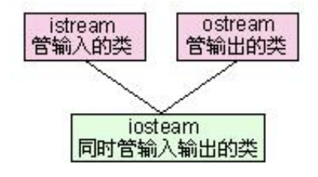
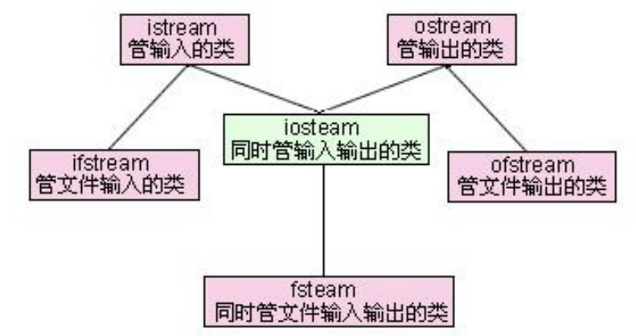

# C++ 文件流
## C++文件流学习的必要性
疑问:
> 我已经学习了c的文件读写,那么C++的文件读写还有学习的必要吗,有什么区别/不同/或者优势吗C++的

```GPT-3.5
当你已经掌握了C中的文件读写，学习C++的文件读写也是有必要的。
虽然C和C++在文件读写方面有很多相似之处，但C++提供了一些额外的特性和优势。

C++标准库提供了更加方便的文件读写工具，
例如<fstream>头文件中的ifstream、ofstream和fstream类，
它们提供了面向对象的方式来处理文件输入输出，使得代码更具可读性和可维护性。

此外，C++的文件读写功能还支持面向对象的特性，能够更好地与其他C++特性结合，
比如类、继承、多态等。这使得C++在处理复杂文件操作时更加灵活和强大。

另外，C++的文件读写还支持异常处理机制，能够更好地处理文件操作中的异常情况，
保证程序的稳定性和健壮性。

总的来说，学习C++的文件读写可以让你
更好地利用C++的高级特性和标准库，编写更加现代化、灵活和健壮的文件操作代码。
```

<p style="color: red">行! 那开始学习吧~</p>

---
# 数据流的概念
**数据流(data stream)** 是一组有序，有起点和终点的字节的数据序列。包括输入流和输出流.

C++通过一种称为流（stream）的机制提供了更为精良的输入和输出方法。流是一种灵活且`面向对象`的`I/O方法`。根据操作对象不同分为**文件流、字符串流、控制台流**.

## 控制台流
C++输入输出操作分别是由istream(输入流)和ostream(输出流)这两个类提供的，为了允许双向的输入／输出，由istream和ostream派生出了iostream类

如图所示, 为类的继承关系


|函数|功能|应用|
|---|---|---|
|cin|输入(standard input)的istream对象|从设备读入数据|
|cout|输入(standard output)的ostream对象|从设备输出或者写数据|
|cerr|标准错误(standard error)的ostream对象|屏幕设备写数据|

上面的`<<`和`>>`操作符，是因为`iostream.h`头文件中，`ostream`类对应每个基本数据类型都有其友元函数对左移操作符进行了友元函数的重载

> 注: 实际上scanf与printf的读写数据速度比 cin cout 快, 因为他们需要和printf的输入输出绑定同步, 所以时间比较长; 所以竞赛一般使用 <stdio.h> 来读写, 不然就是快读与快写了.

## 文件流
文件流的输入输出类在fstream头文件被定义，和控制台流继承关系为：


# 文件读写
## 实例化对象
注: 要在 C++ 中进行文件处理，必须在 C++ 源代码文件中包含头文件 `<iostream>` 和 `<fstream>`

|数据类型|描述|
|---|---|
|ofstream|该数据类型表示输出文件流，用于创建文件并向文件写入信息。|
|ifstream|该数据类型表示输入文件流，用于从文件读取信息。|
|fstream|该数据类型通常表示文件流，且同时具有 ofstream 和 ifstream 两种功能，这意味着它可以创建文件，向文件写入信息，从文件读取信息。|

使用时, 需要 将类的实例化 为 `对象`, 才可以进行操作.

```C++
fstream file_in_and_out; // 可以读写文件
ifstream file_in;        // 只能读取文件
ofstream file_out;       // 只能写入文件
```
## 打开文件

函数原型

```C++
void open(const char *filename, ios::openmode mode);
```
`filename`参数 是 打开的文件的路径, 可以是绝对路径或者相对路径, *相对路径是以`main`函数所在文件为参考系的.*

`mode`参数 是 **文件被打开的模式**

| 模式标志  | 描述                                       |
|---------|--------------------------------------------|
| ios::app   | 追加模式。所有写入都追加到文件末尾。      |
| ios::ate   | 文件打开后定位到文件末尾。                  |
| ios::in    | 打开文件用于读取。                         |
| ios::out   | 打开文件用于写入。                         |
| ios::trunc | 如果该文件已经存在，其内容将在打开文件之前被截断，即把文件长度设为 0。 |

可以把以上两种或两种以上的模式结合使用.

举例:
```C++
ofstream outfile;
outfile.open("file.dat", ios::out | ios::trunc ); // w
```

```C++
ifstream  afile;
afile.open("file.dat", ios::out | ios::in );      // r+
```

### 对于不同类的实例化, 它的默认读写方式是不同的
|数据类型|默认读写方式|
|---|---|
|ofstream|ios::out | ios::trunc|
|ifstream|ios::in|
|fstream|ios::in | ios::out|

## 文件读写
### 写
对于`ofstream`或`fstream`的实例化对象, 则可以这样写入: (同cout)

```C++
ofstream obj_name;
obj_name.open("文件名");
obj_name << "内容, 或者char *, 或者 string容器" << endl;
```

### 读
对于`ifstream`或`fstream`的实例化对象, 则可以这样读取: (同cin)

> <sub>注意, 遇到空格或者换行就结束读取了,</sub>当然, 文件指针写一样会移动的.

```C++
char str[128]; // string容器也可以

ifstream obj_naem;
obj_name.open("文件名");
obj_name >> str;
```
#### 其他的读取方法

这个是大体相同的.
```C++
fstream f;
f.open("file.txt", ios::in);

// 判断是否打开
if (!f.is_open())
{
    cout << "文件打开失败!" << endl;
    return;
}
```

```C++
// 方法一: 效率低, 不建议使用
// 学习过 B-树, B+树的都知道, cpu与文件io时间成本高, 你还一个字符一个字符读取...
char c;
while ((c = f.get()) != EOF)
{
    cout << c;
}
```


```C++
// 方法二: 
char buf[1024];
while (f >> buf)
{
    cout << buf << endl;
}
```

```C++
// 方法三:
char buf[1024];
while (f.getline(buf, sizeof(buf)))
{
    cout << buf << endl;
}
```


```C++
// 方法四:
string string_obj;              // 需要 string 容器
while (getline(f, string_obj))  // getline 需要<string>
{
    cout << string_obj << endl;
}
```
## 关闭文件

`并不会因为析构函数而自动帮你刷新流`

当 C++ 程序终止时，它会自动关闭刷新所有流，释放所有分配的内存，并关闭所有打开的文件。但程序员应该养成一个好习惯，在程序终止前关闭所有打开的文件。

下面是 close() 函数的标准语法，close() 函数是 fstream、ifstream 和 ofstream 对象的一个成员。


```C++
void close();
```
## 二进制读写文件
### 写
二进制写文件主要利用流对象调用成员函数`write()`;


```C++
ostream& write(const char *buffer,int len);
```
> `buffer`: 指向要写入输出流的字符数组的指针。
> 
> `len`: 要写入的字节数。
> 
> > 返回值是一个 ostream 对象的引用, 可以用于链式调用;

### 读
二进制读文件主要利用流对象调用成员函数`read()`.

```C++
istream& read(char *buffer, int len);
```
> `buffer`: 指向要存储读取数据的字符数组的指针, 将该数据存储到文件中;
>
> `len`: 要读取的字节数;
>
> > 返回值是 一个 istream 对象的引用, 可以用于链式调用;

**案例:**

```C++
ifstream bif;
bif.open("student.txt", ios::in | ios::binary);
if (!bif.is_open())
{
    cout << "文件打开失败" << endl;
    return 0;
}

Student s2;
bif.read((char*)&s2, sizeof(Student));
cout << s2.name << " " << s2.age << endl;

bif.close()
```

## 文件指针
### 移动文件指针
`istream` 和 `ostream` 都提供了用于重新定位文件位置指针的成员函数。这些成员函数包括关于 `istream` 的 **seekg**（"seek get"）和关于 `ostream` 的 **seekp**（"seek put"）。

> C++的文件定位分为读位置和写位置的定位，对应的成员函数分别为seekg()和seekp()。
> 
> seekg()函数设置 $读$ 位置，seekp()设置 $写$ 位置。

seekg 和 seekp 的参数通常是一个长整型。第二个参数可以用于指定查找方向。

`查找方向` 可以是 `ios::beg`（默认的，从流的开头开始定位），<br>
也可以是 `ios::cur`（从流的当前位置开始定位），<br>
也可以是 `ios::end`（从流的末尾开始定位）。

文件位置指针是一个整数值，指定了从文件的起始位置到指针所在位置的字节数。

#### 移动失败问题

如果没有 f.clear(), 是不能移动文件指针的, (当 (c = f.get()) == EPF 后)
```C++
while ((c = f.get()) != EOF)
{
    cout << c;
}

f.clear(); // 清除 eof 标记的 true

// 文件指针: 定位到 f 的开头
f.seekg(0, ios::beg);
```

>  seekg(0, ios::end)不是end of file.
>
> > ##red##
> > end of file的时候， seek是无效的， 必须先clear.

学习参考:

[1][实战中遇到的C++流文件重置的一个大陷阱： 为什么ifstream的seekg函数无效？](https://blog.csdn.net/stpeace/article/details/40693951)

[2][seekg(0,ios::beg)不起作用的原因和解决方法](https://blog.csdn.net/u010236463/article/details/42739129)

### 获取当前文件指针位置

与上面相同的, 

- `tellg()` 获取 读位置 指针的位置
- `tellp()` 获取 写位置 指针的位置

#### 获取文件大小

可以通过`seekg()和tellg()`或者`seekp()和tellp()`函数结合的方式使用.

示例:

```C++
inFile.seekg(0, ios::end);        // 读文件指针移动到文件末尾
streampos ipos = inFile.tellg();  // 返回当前指针的位置，也就是文件的大小，单位是字节
                                  // 注意返回的类型
```
