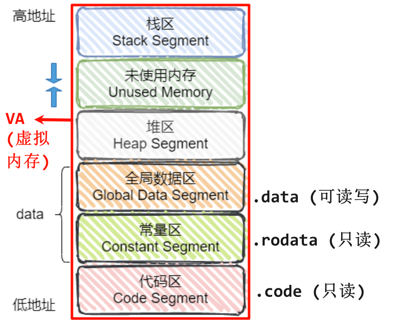

# C++程序的内存分区/内存模型
内存分区，分别是堆、栈、自由存储区、全局/静态存储区、常量存储区和代码区。如下图所示:

| ##container## |
|:--:|
||

- **栈**: 在执行函数时，函数内局部变量的存储单元都可以在栈上创建，函数执行结束时这些存储单元自动被释放。栈内存分配运算内置于处理器的指令集中，效率很高，但是分配的内存容量有限.

- **堆**: 就是那些由`new`分配的内存块，他们的释放编译器不去管，由我们的应用程序去控制，一般一个`new`就要对应一个`delete`。如果程序员没有释放掉，那么在程序结束后，操作系统会自动回收.

- **自由存储区**: 如果说堆是操作系统维护的一块内存，那么自由存储区就是C++中通过`new`和`delete`动态分配和释放对象的抽象概念。需要注意的是，自由存储区和堆比较像，但不等价。[[关于C/C++有哪几个分区以及自由存储区和堆的区别](https://blog.csdn.net/m0_37433111/article/details/107362179)]

- **全局/静态存储区**: 全局变量和静态变量被分配到同一块内存中，在以前的C语言中，全局变量和静态变量又分为初始化的和未初始化的，在C++里面没有这个区分了，它们共同占用同一块内存区，在该区定义的变量若没有初始化，则会被自动初始化，例如`int`型变量自动初始为`0`.

- **常量存储区**: 这是一块比较特殊的存储区，这里面存放的是常量，不允许修改.

- **代码区**: 存放函数体的二进制代码.

不同的变量，默认定义在不同的段内:
- 函数代码: 代码段.text段
- 字符串、常量值: 只读数据段.rodata段
- 全局的变量: 数据段.data段
- 堆段: malloc申请的，必须通过free释放
- 栈段: 函数的局部变量，函数返回后，出栈释放
- static的变量: 静态数据段.data段

## 相关链接
- 参考链接:
    1. [C++内存管理 | 阿秀的学习笔记](https://interviewguide.cn/notes/03-hunting_job/02-interview/01-02-01-memory.html)
    2. [讲一下程序的内存分区/内存模型? | InterviewGuide](https://top.interviewguide.cn/issue/388)

- 拓展阅读:
    1. [linux下，程序各个部分对应的段位置，图说 bss段 text段 data段 rodata段 栈 堆](https://blog.csdn.net/acdefghb/article/details/106209103)
    2. [程序的 text段、data段、bss段与rodata段](https://www.cnblogs.com/zhcpku/p/14437940.html)