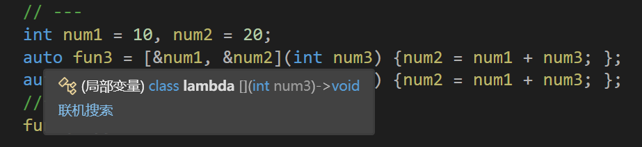

# Lambda表达式
## 介绍
lambda表达式实际上是一个匿名函数，在编译时会将表达式转换为匿名函数。

语法

```C++
[capture-list] (parameters) mutable -> return-type {statement};
[捕获列表](参数)->返回值{ 函数体 };
```
① `[capture-list]`: 捕捉列表，该列表总是出现在lambda函数的开始位置，编译器根据[]来判断接下来的代码是否为lambda函数，捕捉列表能够捕捉上下文中的变量供lambda函数使用。（不能省略）

② `(parameters)`: 参数列表。与普通函数的参数列表一致，如果不需要参数传递，则可以连同()一起省略（没有参数可以省略）

③ `mutable`：默认情况下，lambda函数总是一个const函数，mutable可以取消其常量性。使用该修饰符时，参数列表不可省略(即使参数为空)。mutable放在参数列表和返回值之间<sup>[1]</sup>

④ `->returntype`：返回值类型。用追踪返回类型形式声明函数的返回值类型，没有返回值时此部分可省略。返回值类型明确情况下，也可省略，由编译器对返回类型进行推导。（又没有返回值都可以省略）

⑤ `{statement}`：函数体。在该函数体内，除了可以使用其参数外，还可以使用所有捕获到的变量。（不能省略）

### 捕获列表说明
捕捉列表描述了上下文中那些数据可以被lambda使用，以及使用的方式传值还是传引用.

① `[a,&b]` 其中 a 以复制捕获而 b 以引用捕获。

② `[this]` 以引用捕获当前对象（ \*this ），通常用于在成员函数中使用Lambda表达式。*(只能用在非静态成员函数内部)*

③ `[&]` 以引用捕获所有用于 lambda 体内的自动变量，并以引用捕获当前对象，(若存在), 这样, 在Lambda表达式内部就可以访问并修改外部作用域中的变量。

④ `[=]` 以复制捕获所有用于 lambda 体内的自动变量，并以引用捕获当前对象，(若存在), 这样, 在Lambda表达式内部就可以访问外部作用域中的变量的副本。

⑤ `[]` 不捕获(大部分情况下不捕获就可以) 表示不捕获任何外部变量。这种情况下，Lambda表达式只能使用自己的内部变量，无法访问外部作用域中的变量。

⑥ `[*this]`: [[C++17] Lambda表达式捕获 *this](../019-Lambda表达式捕获类成员变量的副本/index.md)

### 最简单的Lambda表达式
在lambda函数定义中，`参数列表`和`返回值类型`都是`可选`部分，而`捕捉列表`和`函数体`可以为**空**。

C++11中最简单的lambda函数为

```C++
[]{};
```

当然你也可以写点废话(上下是等价的).

```C++
[](void) -> void {return; };
```

### 代码示例

```C++
#include<iostream>
using namespace std;

void (*FP)(); // 函数指针

int main()
{
    // 最简单的lambda表达式, 该lambda表达式没有任何意义
    [] {};

    // 省略参数列表和返回值类型，返回值类型由编译器推导为int
    int num1 = 3, num2 = 4;
    // 省略了返回值类型，无返回值类型
    auto fun1 = [&num1, &num2](int num3) {num2 = num1 + num3; };
    fun1(100);
    cout << num1 << " " << num2 << endl;

    // 捕捉列表可以是lambda表达式
    auto fun = [fun1] {cout << "great" << endl; };
    fun();

    // 各部分都很完善的lambda函数
    auto fun2 = [&, &num2](int num3) -> int {return num2 += num1 + num3; };
    cout << fun2(10) << endl;
  
	// 复制捕捉x
    int x = 10;
    auto add_x = [x](int a) mutable { x *= 2; return a + x; };
    cout << add_x(10) << endl;

    // 编译失败--->提示找不到operator=() (没有与之匹配的运算符)
    //auto fun3 = [&num1,&num2](int num3) {num2 = num1 + num3;};
    //fun1 = fun3;

    // 允许使用一个lambda表达式拷贝构造一个新的副本
    auto fun3(fun);
    fun();

    // 可以将lambda表达式赋值给相同类型的函数指针
    auto f2 = [] {};
    FP = f2;
    FP();

    return 0;
}

```

## 函数对象与lambda表达式
函数对象，又称为仿函数，即可以想函数一样使用的对象，就是在类中重载了operator()运算符的类对象

从使用方式上来看，函数对象与lambda表达式完全一样:

```C++
#include <iostream>
using namespace std;

class Rate {
public:
    Rate(double rate) : _rate(rate) {}
    double operator()(double money, int year) {
        return money * _rate * year;
    }
private:
    double _rate;
};

int main() {
    // 函数对象
    double rate = 0.6;
    Rate r1(rate);
    double rd = r1(20000, 2);
    cout << rd << endl;

    // lambda
    auto r2 = [=](double monty, int year) -> double { return monty * rate * year; };
    double rd2 = r2(20000, 2);
    cout << rd2 << endl;

    return 0;
}
```

在`C++98`中，对一个数据集合中的元素进行排序，可以使用sort方法:


```C++
#include <iostream>
#include <algorithm>
#include <functional>
using namespace std;

int main()
{
    int array[] = { 3,6,9,5,4,7,0,8,2,1 };
    // 默认按照小于比较，排出来结果是升序
    sort(array, array + sizeof(array) / sizeof(array[0]));
    // 如果需要降序，需要改变元素的比较规则
    sort(array, array + sizeof(array) / sizeof(array[0]), greater<int>());
    return 0;
}
```

如果待排序元素为自定义类型，需要用户定义排序时的比较规则:

```C++
#include <iostream>
#include <algorithm>
#include <functional>
using namespace std;

struct Goods {
    string name;
    double price;
};

struct Compare {
    bool operator()(const Goods& gl, const Goods& gr) {
        return gl.price <= gr.price;
    }
};

int main() {
    Goods gds[] = { 
        { "苹果", 5.1 }, 
        { "橙子", 9.2 }, 
        { "香蕉", 3.6 }, 
        { "菠萝", 9.6 } 
    };
    
    sort(gds, gds + sizeof(gds) / sizeof(gds[0]), Compare());
    
    for (int i = 0; i < 4; i++) {
        cout << gds[i].name << " " << gds[i].price << endl;
    }
    
    return 0;
}
```

有了 Lambda表达式，代码就可以写成如下:

```C++
#include <iostream>
#include <algorithm>
#include <functional>
using namespace std;

struct Goods {
    string name;
    double price;
};

int main() {
    Goods gds[] = { 
        { "苹果", 5.1 }, 
        { "橙子", 9.2 }, 
        { "香蕉", 3.6 }, 
        { "菠萝", 9.6 } 
    };
    
    sort(gds, gds + sizeof(gds) / sizeof(gds[0]), [](const Goods& l, const Goods& r) -> bool {
        return l.price < r.price;
    });
    
    for (int i = 0; i < 4; i++) {
        cout << gds[i].name << " " << gds[i].price << endl;
    }
    
    return 0;
}
```

## Lambda表达式的本质
> 本内容是拓展, 正巧想到了, 但是网络上好像没有什么回答. 所以`自己实验 + GPT-3.5`了, 不能保证完全正确和有可移植性(编译器VS2022 C++14)

### Lambda 是匿名函数 还是一个仿函数?



> 本来还觉得它是一个函数指针, 然后指向了一个匿名的函数地址
>
> 不过也显然, 这样是不行的...


> ##purple##
> 🟣 <span style="color:yellow">到头来, 就是一个编译器帮我们实现的一个`仿函数`啊, 相当于大大滴语法糖...</span>
>
> <p align="center" style="color:red"><b>那么既然是类, 就务必会执行构造函数与析构函数!</b></p>


### Lambda 如何捕获变量?
答: 通过`构造函数`会把需要的变量, 变为`匿名类`的`成员变量`

$捕获列表为[=], 构造函数传参是采用 拷贝赋值的形式$

所以会产生以下问题: (当Lambda表达式声明后, 即便原本关联的值变化了, 成员变量也不会改变!)

```C++
int num1 = 10;
auto lbd = [=]() {cout << num1 << endl; };
num1 = 2
lbd();		// 10
num1 = 20;
lbd();		// 10
```

区别:
```C++
int num1 = 10;
auto lbd = [&]() {cout << num1 << endl; };
num1 = 2
lbd();		// 2
num1 = 20;
lbd()		// 20
```

> ##purple##
> 🟣 <span style="color:yellow">所以不用担心多次使用Lambd表达式会多次使用构造函数与析构函数<sup>[2]</sup>.</span>

## 注解
### [1]

```C++
int n = 10;
[=](){
    ++n; // 报错
		 // 可以视作 实际上传入了 const int n;
}();
cout << n << endl; // 10
```

```C++
int n = 10;
[=]() mutable {
    ++n; // 可以进行
		 // 一份完全的 n 的拷贝, n是同名的变量, 作用域在该匿名函数内, 不会影响外部
}();
cout << n << endl; // 10
```

参考文献: [lambda表达式中的mutable](https://blog.csdn.net/Dasis/article/details/121370885#:~:text=C%2B%2B%E6%96%B0%E7%89%B9%E6%80%A711,%E4%B8%80%E6%97%A0%E4%BA%8C%E7%9A%84%E6%8B%B7%E8%B4%9D%E5%80%BC%EF%BC%89)

如果你熟悉`仿函数`, 那么就和下面类似(只是对) `mutable` 讨论!

```C++
static class my_Class
{
public:
	// [=]() {}; 的情况
	void operator() (int n) const
	{
		++n; // 报错的
	}
};
```
```C++
static class my_Class
{
public:
	// [=]() mutable {}; 的情况
	void operator() (int n)
	{
		++n;
	}
};
```

区别: [C++中的mutable关键字](https://www.cnblogs.com/yongdaimi/p/9565996.html)

### [2]

> 此处展示Lambda表达式其被底层替换后的结果.

考虑以下代码:
```C++
void text(void)
{
    int num1 = 10;
    auto lbd = [=]() {cout << num1 << endl; };
    num1 = 2
    lbd();		// 10
    num1 = 20;
    lbd();		// 10
}
```

有:<sup>[3]{此处假设编译器将其转化为`局部类`}</sup>

```C++
void text(void)
{
	class Lambda
	{
	public:
		Lambda(int num1)
		{
			this->num1 = num1;
		}

		void operator() (void) const
		{
			cout << this->num1 << endl;
		}

	private:
		int num1;
	};

	int num1 = 10;
	Lambda lambda(num1);
	auto lbd = lambda;
	num1 = 2;
	lbd();
	num1 = 20;
	lbd();
}
```

### [3]

由于以下代码是合法的, 所以我们似乎无法判断它是否是局部类

// 原本是为了防止 Lambda 表达式作为函数返回值逃离`局部类的作用域`.

// 但是没想到, 这个是合法的...

```C++
auto new_cpp11_004(void)
{
    class Text
    {
    public:
        Text(int a)
        {
            this->a = a;
        }
    public:
        int a;
    };
	
    return Text(123);
}

int main()
{
	auto x = new_cpp11_004();
    cout << x.a << endl;	// 123
	return 0;
}
```
