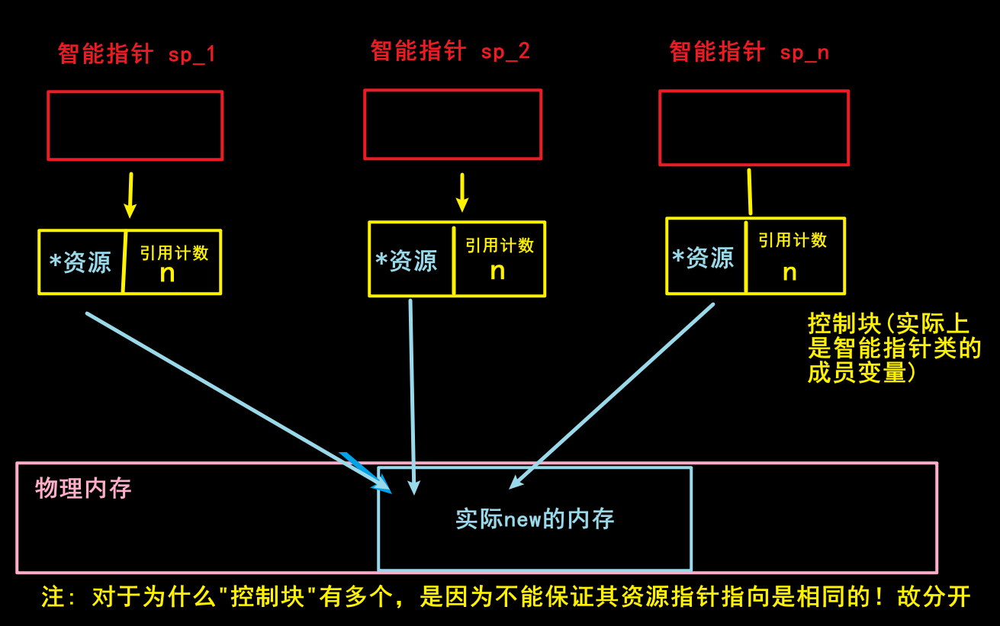
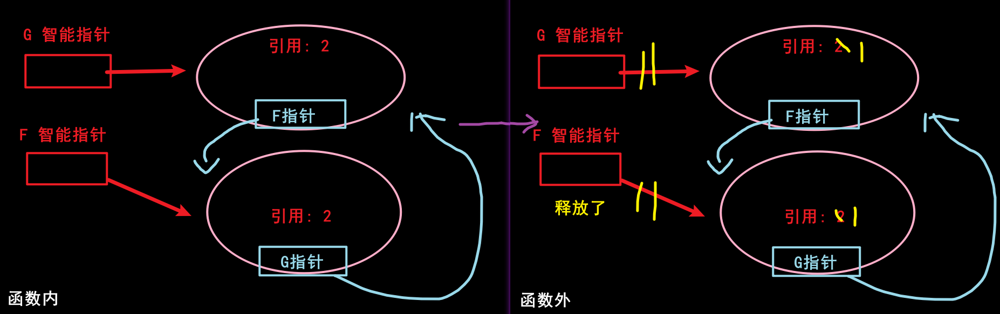

# 智能指针
## 概述
智能指针是一种用于管理动态内存的工具，其主要作用是自动化内存资源的申请和释放。智能指针可以避免常见的内存管理问题，如`内存泄漏`、`二次释放`等。

垃圾回收机制已经大行其道，得到了诸多编程语言的支持，例如 Java、Python、C#、PHP 等。而 C++ 虽然从来没有公开得支持过垃圾回收机制，但 C++98/03标准中，支持使用 `auto_ptr` 智能指针来实现堆内存的自动回收；C++11 新标准在废弃 auto_ptr 的同时，增添了 `unique_ptr`、`shared_ptr` 以及 `weak_ptr` 这 3 个智能指针来实现堆内存的自动回收。

所谓智能指针，可以从字面上理解为“智能”的指针。具体来讲，智能指针和普通指针的用法是相似的，不同之处在于，智能指针可以在适当时机自动释放分配的内存。

也就是说，使用智能指针可以很好地避免“忘记释放内存而导致内存泄漏”问题出现。由此可见，C++ 也逐渐开始支持垃圾回收机制了。

## 实现原理

> 如何自动释放?
>
> > 答: 利用 对象 出作用域会执行析构函数, 所以把 new 的数据放到 指针类的成员, 然后出作用域自动析构.
>
> "当智能指针对象超出其作用域时，析构函数会被自动调用" 那这个变量不就相当于局部变量? 作用域同智能指针?
>
> > 是的, 智能指针的作用是管理资源的生命周期，在离开其作用域时自动释放资源，避免了手动释放资源的繁琐和可能遗漏的问题.
> 
> 那如果我 return 一个智能指针呢?
>
> > 如果你在函数中返回一个智能指针，那么通常情况下会发生智能指针的**所有权转移（ownership transfer）**。具体来说，当你返回一个`std::shared_ptr`或者`std::unique_ptr`时，编译器会调用**移动语义（move semantics）** 来实现所有权的转移。
> >
> > 对于`std::unique_ptr`来说，它是独占所有权的智能指针，因此在返回时会发生所有权的转移。原来的`std::unique_ptr`对象会失去对资源的控制权，而返回的`std::unique_ptr`对象会获得资源的控制权。这样可以确保资源的所有权在程序中正确地传递和管理。
> >
> > 对于`std::shared_ptr`来说，由于它使用引用计数来管理资源，返回时会增加资源的引用计数。即使返回的`std::shared_ptr`对象离开了函数作用域，资源也不会被立即释放，直到所有共享资源的`std::shared_ptr`对象都离开了其作用域。
> >
> > 总之，在返回智能指针的情况下，智能指针的所有权会根据具体的智能指针类型以及编译器的优化策略来进行合适的处理。这些处理通常是通过移动语义来实现的，确保资源的正确管理和所有权的正确转移。
>
> 所以希望拓展智能指针的作用域, 比如 一个函数返回多个智能指针, 就只能 通过引用的方式把外部指针移动进来, 然后移动语义?
>
> > 是的, 需要注意的是，对于`std::unique_ptr`对象而言，其所有权是独占的，因此在返回时需要使用移动语义来转移所有权。**而对于`std::shared_ptr`对象而言，其所有权是共享的，因此在返回时会增加资源的引用计数，不需要使用移动语义<sup>[5]</sup>**。

## 使用方法

智能指针都是以`类模板`的方式实现的. (可以类比 STL容器)

需要导入头文件, 和命名空间

```C++
#include <memory>
using namespace std;
```
## 智能指针分类

```markmap ##h300##
# 智能指针
## C++ 98/03
### auto_ptr
## C++ 11
### unique_ptr
### shared_ptr
### weak_ptr
```

0. `std::auto_ptr<T>`: 不建议使用。<sup>[2]</sup>
1. `std::unique_ptr<T>`：独占资源所有权的指针。
2. `std::shared_ptr<T>`：共享资源所有权的指针。
3. `std::weak_ptr<T>`：共享资源的观察者，需要和 std::shared_ptr 一起使用，不影响资源的生命周期
---
## auto_ptr
> 不建议使用, 但是其类方法是和 `unique_ptr`, `shared_ptr` 是没有差别的.

使用方法:

```C++
// 智能指针
auto_ptr<类型> 变量名(new 类型);

// 普通指针
类型 *变量名 = new 类型;

// ---- 举例 ----
auto<int> ap(new int(6));

int *p = new int(6); // (6) 的意思是是初始化为6, 不是数组哦
```

**运用可以像普通指针一样**<sup>[3]{如何实现}</sup>

```C++
// * 取地址
cout << *ap << endl;
cout << *p << endl;

// -> 指针取成员, 也是一样的
// 此处无法演示(需要为 结构体/类 才可以)
```

因为智能指针自身是`类`, 所以也有类方法

### 常用类方法
#### get()

**`get()` 获取智能指针托管的指针地址**


```C++
// 定义智能指针
auto_ptr<Test> test(new Test);

Test *tmp = test.get();		// 获取指针返回
cout << "tmp->show：" << tmp->show() << endl;
```
*一般不会这样使用，因为都可以直接使用智能指针去操作，除非有一些特殊情况*

#### release()
**`release()` 取消智能指针对动态内存的托管**

```C++
// 定义智能指针
auto_ptr<Test> test(new Test);

Test *tmp2 = test.release(); // 取消智能指针对动态内存的托管
delete tmp2;                 // 之前分配的内存需要自己手动释放
```
即 *智能指针不再对该指针进行管理，改由**程序员**管理！*

#### reset()
**`reset()` 重置智能指针托管的内存地址，如果地址不一致，原来的会被析构掉**

```C++
// 定义智能指针
auto_ptr<Test> test(new Test);

test.reset();           // 释放掉智能指针托管的指针内存，并将其置NULL

test.reset(new Test());	// 释放掉智能指针托管的指针内存，并将参数指针取代之
```

*reset函数会将参数的指针(不指定则为NULL)，与托管的指针比较，如果地址不一致，则析构掉原来托管的指针，然后使用参数的指针替代之。之后智能指针就会托管参数的那个指针了 (与赋值的差别: 赋值不会把原来的那个给析构(`shared_ptr`), `auto_ptr`会(实际上容易二次释放, 因为设计缺陷, 你不用去细致了解 ~~(八嘎你都看?!)~~), `unique_ptr`需要使用`std::move() 移动语义`才可以赋值)。*

## unique_ptr

auto_ptr是用于C++11之前的智能指针。由于 auto_ptr 基于排他所有权模式：两个指针不能指向同一个资源，复制或赋值都会改变资源的所有权。

auto_ptr 主要有三大问题：<sup>[2]</sup>

1. 复制和赋值会改变资源的所有权，不符合人的直觉。
2. 在 STL 容器中使用auto_ptr存在重大风险，因为容器内的元素必需支持可复制（copy constructable）和可赋值（assignable）。
3. 不支持对象数组的操作

**特性:**
> 1. 基于排他所有权模式：两个指针不能指向同一个资源
> 
> 2. 无法进行左值unique_ptr复制构造，也无法进行左值复制赋值操作，但允许临时右值赋值构造和赋值
> 
> 3. 保存指向某个对象的指针，当它本身离开作用域时会自动释放它指向的对象。
> 
> 4. 在容器中保存指针是安全的

A. 无法进行左值复制赋值操作，但允许临时右值赋值构造和赋值

```C++
unique_ptr<string> p1(new string("I'm Li Ming!"));
unique_ptr<string> p2(new string("I'm age 22."));
	
cout << "p1：" << p1.get() << endl; // %x1
cout << "p2：" << p2.get() << endl; // %x2

p1 = p2;                     // 禁止左值赋值
unique_ptr<string> p3(p2);   // 禁止左值赋值构造

unique_ptr<string> p3(std::move(p1));
p1 = std::move(p2);	// 使用move把左值转成右值就可以赋值了，效果和auto_ptr赋值一样

cout << "p1 = p2 赋值后：" << endl;
cout << "p1：" << p1.get() << endl; // %x2
cout << "p2：" << p2.get() << endl; // NULL
```
B. 在 STL 容器中使用unique_ptr，不允许直接赋值

```C++
vector<unique_ptr<string>> vec;
unique_ptr<string> p3(new string("I'm P3"));
unique_ptr<string> p4(new string("I'm P4"));

vec.push_back(std::move(p3));
vec.push_back(std::move(p4));

cout << "vec.at(0)：" << *vec.at(0) << endl;
cout << "vec[1]：" << *vec[1] << endl;

vec[0] = vec[1];            /* 不允许直接赋值 */
vec[0] = std::move(vec[1]); // 需要使用move修饰，使得程序员知道后果

cout << "vec.at(0)：" << *vec.at(0) << endl;
cout << "vec[1]：" << *vec[1] << endl; // 实际上这个是报错的, 因为 vec[1] == NULL 了
```

C. 支持对象数组的内存管理

```C++
// 会自动调用delete [] 函数去释放内存
unique_ptr<int[]> array(new int[5]);	// 支持这样定义
```

除了上面ABC三项外，unique_ptr的其余用法都与auto_ptr用法一致.

但, 特别注意: `赋值`

```C++
unique_ptr<Test> t7(new Test);
unique_ptr<Test> t8(new Test);
t7 = std::move(t8);	// 必须使用移动语义，结果，t7的内存释放，t8的内存交给t7管理
t7->show();
```
### 陷阱

**`auto_ptr` 与 `unique_ptr`智能指针的内存管理陷阱**:

```C++
unique_ptr<string> p1;
string* str = new string("智能指针的内存管理陷阱");

p1.reset(str);      // p1托管str指针
{
    unique_ptr<string> p2;
    p2.reset(str);  // p2接管str指针时，会先取消p1的托管，然后再对str的托管
}

// 此时p1已经没有托管内容指针了，为NULL，在使用它就会内存报错！
cout << "str:" << *p1 << endl;
```

这是由于`auto_ptr` 与 `unique_ptr`的排他性所导致的！

所以才有了 **共享资源所有权的指针** 的 `shared_ptr` 的出现!

## shared_ptr

> 这个应该是比较常用的智能指针

当我们使用智能指针时，通常需要在多个指针之间共享同一块内存。为了确保在所有指针都不再需要该内存时，能够自动地释放该内存，引用计数技术被广泛地应用于智能指针的实现中。

引用计数是一种跟踪某个资源被引用次数的技术。在智能指针中，每个指针对象都维护着一个引用计数，该计数记录了有多少个指针对象正在引用该内存块。当一个新的指针对象指向该内存块时，该内存块的引用计数将增加1；而当一个指针对象被销毁时，该内存块的引用计数将减少1。只有当引用计数减少到0时，才会自动地释放该内存块。

多个智能指针可以指向同一个内存块，但是这些指针并不直接指向该内存块，而是分别指向一个包含内存块地址和引用计数的控制块。当一个新的智能指针指向该内存块时，其对应的控制块的引用计数会增加1，而所有指向该内存块的智能指针共享同一个控制块，以便跟踪该内存块的引用计数。只有当所有指向该内存块的智能指针都被销毁时，其对应的控制块才会被销毁，从而自动释放该内存块。

总的来说，引用计数是一种实现智能指针的重要技术，它可以确保多个指针对象可以共享同一个内存块，并在不再需要该内存块时自动地释放该内存块。但需要注意的是，引用计数技术并不能解决所有内存管理问题，比如循环引用等问题。因此，在使用智能指针时，还需要注意避免出现循环引用等问题。

**即**<sup>[1]:2{有更详细的解释}</sup>



简单的说, 每一个 对象 在执行析构的时候, 都可以看做这样: ~~(伪代码, 只提供思路)~~


```C++
~spared_ptr()
{
	if (this->引用次数)
    {
		// 此处主要是判断是否析构后引用次数就是零
		// 如果是, 那么要释放 实际的资源
    	--this->引用次数;
		if (!this->引用次数)
        {
			释放 this->实际资源;
        }
    }
	// 类的其他资源的释放...(如果有)
}
```

特别注意, **不传参 / 空指针 的 构造函数, 其创建的对象(智能指针)的引用次数是 0**.

### 使用操作与常用方法
#### use_count 获取引用次数

调用use_count函数可以获得当前托管指针的引用计数.

```C++
shared_ptr<Person> sp1;

shared_ptr<Person> sp2(new Person(2));

// 获取智能指针管控的共享指针的数量	use_count()：引用计数
cout << "sp1	use_count() = " << sp1.use_count() << endl;
cout << "sp2	use_count() = " << sp2.use_count() << endl << endl;

// 共享
sp1 = sp2;

cout << "sp1	use_count() = " << sp1.use_count() << endl;
cout << "sp2	use_count() = " << sp2.use_count() << endl << endl;

shared_ptr<Person> sp3(sp1);
cout << "sp1	use_count() = " << sp1.use_count() << endl;
cout << "sp2	use_count() = " << sp2.use_count() << endl;
cout << "sp2	use_count() = " << sp3.use_count() << endl << endl;

/* 结果 
0
1

2
2

3
3
3
*/
```
#### 构造函数
1. shared_ptr< T > sp1; 空的shared_ptr，可以指向类型为T的对象

```C++
shared_ptr<Person> sp1;
Person *person1 = new Person(1);
sp1.reset(person1);	// 托管person1
```

2. shared_ptr< T > sp2(new T()); 定义shared_ptr,同时指向类型为T的对象

```C++
shared_ptr<Person> sp2(new Person(2));
shared_ptr<Person> sp3(sp1);
```

3. shared_ptr<T[]> sp4; 空的shared_ptr / 或者对象数组，可以指向类型为T[]的数组对象 **`C++17后支持`**

```C++
shared_ptr<Person[]> sp4;
shared_ptr<Person[]> sp5(new Person[5] { 3, 4, 5, 6, 7 });
```

4. shared_ptr< T > sp6(NULL, D()); 空的shared_ptr / 具体对象 / 二维数组 / N维数组，接受一个D类型的删除器(仿函数/Lambda)，使用D释放内存

```C++
shared_ptr<Person> sp6(NULL, DestructPerson());
shared_ptr<Person> sp7(new Person(8), DestructPerson());
```
#### 初始化
方式一：构造函数<sup>[4]</sup>

```C++
shared_ptr<int> up1(new int(10));  // int(10) 的引用计数为1
shared_ptr<int> up2(up1);  // 使用智能指针up1构造up2, 此时int(10) 引用计数为2
```
方式二：使用make_shared 初始化对象，分配内存效率更高(推荐使用)

make_shared函数的主要功能是在动态内存中分配一个对象并初始化它，返回指向此对象的shared_ptr; 

用法：make_shared<类型>(构造类型对象需要的参数列表);


```C++
shared_ptr<int> up3 = make_shared<int>(2); // 多个参数以逗号','隔开，最多接受十个
shared_ptr<string> up4 = make_shared<string>("字符串");
shared_ptr<Person> up5 = make_shared<Person>(9);
```

#### 赋值

```C++
shared_ptrr<int> up1(new int(10)); // int(10) 的引用计数为1
shared_ptr<int> up2(new int(11));  // int(11) 的引用计数为1
up1 = up2;                         // int(10) 的引用计数减1, 计数归零内存释放; up2共享int(11)给up1, int(11)的引用计数为2
```

#### 主动释放对象

```C++
shared_ptrr<int> up1(new int(10));
up1 = nullptr ; // int(10) 的引用计数减1,计数归零内存释放 
// 或
up1 = NULL;     // 作用同上 
```

#### 重置

```C++
p.reset();     // 将p重置为空指针，所管理对象引用计数 减1
p.reset(p1);   // 将p重置为p1（的值）,p 管控的对象计数减1，p接管对p1指针的管控
p.reset(p1,d); // 将p重置为p1（的值），p 管控的对象计数减1并使用d作为删除器

// 注: p1是一个指针！
```

#### 交换

```C++
std::swap(p1,p2); // 交换p1 和p2 管理的对象，原对象的引用计数不变
p1.swap(p2);      // 交换p1 和p2 管理的对象，原对象的引用计数不变

// p1 与 p2 是智能指针, 并且类型相同
```

### 陷阱

> <swan style="color:red">shared_ptr作为被管控的对象的成员时，小心因循环引用造成无法释放资源!</swan>

例如:


```C++
#include <iostream>
#include <string>
#include <memory>

using namespace std;

class Girl;

class Boy {
public:
	Boy() {
		cout << "Boy 构造函数" << endl;
	}

	~Boy() {
		cout << "~Boy 析构函数" << endl;
	}

	void setGirlFriend(shared_ptr<Girl> _girlFriend) {
		this->girlFriend = _girlFriend;
	}

private:
	shared_ptr<Girl> girlFriend;
};

class Girl {
public:
	Girl() {
		cout << "Girl 构造函数" << endl;
	}

	~Girl() {
		cout << "~Girl 析构函数" << endl;
	}

	void setBoyFriend(shared_ptr<Boy> _boyFriend) {
		this->boyFriend = _boyFriend;
	}

private:
	shared_ptr<Boy> boyFriend;
};


void useTrap() {
	shared_ptr<Boy> spBoy(new Boy());
	shared_ptr<Girl> spGirl(new Girl());

	// 陷阱用法
	spBoy->setGirlFriend(spGirl);
	spGirl->setBoyFriend(spBoy);
	// 此时boy和girl的引用计数都是2
}


int main(void) {
	useTrap();

	system("pause");
	return 0;
}
```

`循环引用`产生原因:



*所以在使用shared_ptr智能指针时，要注意避免对象交叉使用智能指针的情况！ 否则会导致内存泄露！*

`因此就出现了 weak_ptr 弱指针.`

针对上面的情况，还讲一下另一种情况。如果是`单方`获得管理对方的共享指针，那么这样着是可以正常释放掉的！

```C++
void useTrap() {
	shared_ptr<Boy> spBoy(new Boy());
	shared_ptr<Girl> spGirl(new Girl());

	// 单方获得管理
	//spBoy->setGirlFriend(spGirl);
	spGirl->setBoyFriend(spBoy);

	// 反之也是一样的
}
```

## weak_ptr

weak_ptr 设计的目的是为配合 `shared_ptr` 而引入的一种智能指针来协助 shared_ptr 工作, 它**只可以从一个 shared_ptr 或另一个 weak_ptr 对象构造, 它的构造和析构`不会引起 引用记数 的增加或减少`**。 同时weak_ptr 没有重载*和->, 但可以使用 `lock` 获得一个可用的 shared_ptr 对象。

### 使用方法


```C++
shared_ptr<Boy> spBoy(new Boy());
shared_ptr<Girl> spGirl(new Girl());

// 弱指针的使用
weak_ptr<Girl> wpGirl_1;         // 定义空的弱指针
weak_ptr<Girl> wpGirl_2(spGirl); // 使用共享指针构造
wpGirl_1 = spGirl;               // 允许共享指针赋值给弱指针

cout << "spGirl \t use_count = " << spGirl.use_count() << endl;
cout << "wpGirl_1 \t use_count = " << wpGirl_1.use_count() << endl;

	
// 弱指针不支持 * 和 -> 对指针的访问
/*
wpGirl_1->setBoyFriend(spBoy);
(*wpGirl_1).setBoyFriend(spBoy);
*/

// 在必要的使用可以转换成共享指针
shared_ptr<Girl> sp_girl;
sp_girl = wpGirl_1.lock();

cout << sp_girl.use_count() << endl;
// 使用完之后，再将共享指针置NULL即可
sp_girl = NULL;
```

### 示例

此处代码同上面 shared_ptr 的, 所以请看 **Boy 类**
```C++
#include <iostream>
#include <string>
#include <memory>

using namespace std;

class Girl;

class Boy {
public:
	Boy() {
		cout << "Boy 构造函数" << endl;
	}

	~Boy() {
		cout << "~Boy 析构函数" << endl;
	}

	void setGirlFriend(shared_ptr<Girl> _girlFriend) {
		this->girlFriend = _girlFriend;


		// 在必要的使用可以转换成共享指针
		shared_ptr<Girl> sp_girl;
		sp_girl = this->girlFriend.lock();

		cout << sp_girl.use_count() << endl;
		// 使用完之后，再将共享指针置NULL即可
		sp_girl = NULL;
	}

private:
	weak_ptr<Girl> girlFriend;
};

class Girl {
public:
	Girl() {
		cout << "Girl 构造函数" << endl;
	}

	~Girl() {
		cout << "~Girl 析构函数" << endl;
	}

	void setBoyFriend(shared_ptr<Boy> _boyFriend) {
		this->boyFriend = _boyFriend;
	}

private:
	shared_ptr<Boy> boyFriend;
};


void useTrap() {
	shared_ptr<Boy> spBoy(new Boy());
	shared_ptr<Girl> spGirl(new Girl());

	spBoy->setGirlFriend(spGirl);
	spGirl->setBoyFriend(spBoy);
}


int main(void) {
	useTrap();

	system("pause");
	return 0;
}
```

> <p style="color:red"><b>在类中使用弱指针接管共享指针，在需要使用时就转换成共享指针去使用即可！</b></p>

### expired函数的用法

expired：判断当前weak_ptr智能指针是否还有托管的对象，有则返回false，无则返回true

如果返回true，等价于 use_count() == 0，即已经没有托管的对象了；当然，可能还有析构函数进行释放内存，但此对象的析构已经临近（或可能已发生）。


```C++
#include <iostream>
#include <memory>

std::weak_ptr<int> gw;

void f() {

	// expired：判断当前智能指针是否还有托管的对象，有则返回false，无则返回true
	if (!gw.expired()) {
		std::cout << "gw is valid\n";	// 有效的，还有托管的指针
	} else {
		std::cout << "gw is expired\n";	// 过期的，没有托管的指针
	}
}

int main() {
	{
		auto sp = std::make_shared<int>(42);
		gw = sp;

		f();
	}

	// 当{ }体中的指针生命周期结束后，再来判断其是否还有托管的指针
	f();

	return 0;
}
```

## 智能指针的使用陷阱

1. 不要把一个原生指针给多个智能指针管理:
```C++
int *x = new int(10);
unique_ptr< int > up1(x);
unique_ptr< int > up2(x);
// 警告! 以上代码使up1 up2指向同一个内存,非常危险
// 或以下形式：
up1.reset(x);
up2.reset(x);
```
2. 记得使用u.release()的返回值:

在调用u.release()时是不会释放u所指的内存的，这时返回值就是对这块内存的唯一索引，如果**没有使用这个返回值释放内存或是保存起来，这块内存就泄漏了**.

4. 禁止delete 智能指针get 函数返回的指针:

如果我们主动释放掉get 函数获得的指针，那么**智能指针内部的指针就变成野指针了**，析构时造成重复释放，带来严重后果!

5. 禁止用任何类型智能指针get 函数返回的指针去初始化另外一个智能指针！<sup>[4]</sup>
```C++
shared_ptr< int > sp1(new int(10));
// 一个典型的错误用法 shared_ptr< int > sp4(sp1.get());
```

## 参考文献与注解
### [1]
本文参考了:

1. [C++ 智能指针 - 全部用法详解](https://blog.csdn.net/cpp_learner/article/details/118912592)
2. [现代 C++：一文读懂智能指针](https://zhuanlan.zhihu.com/p/150555165) (这个有点复杂, ~~看不懂思密达~~)

### [2]
对于 `std::auto_ptr<T>`, 为什么被废弃可以看 `[1]:1`

1). 复制或者赋值都会改变资源的所有权

2). 在STL容器中使用auto_ptr存在着重大风险，因为容器内的元素必须支持可复制和可赋值

3). 不支持对象数组的内存管理

### [3]

智能指针类重载了 `*`, `->` 运算符!

### [4]

见下面代码注释:
```C++
shared_ptr<int> sp1(new int(10));
shared_ptr<int> sp2(sp1);         // 此处使用的是拷贝构造函数

// 此处使用的是普通的构造函数, 是会新建一个控制块, 控制块会指向一个 已经被指向的内存
// 区别: shared_ptr<int> sp3(sp1.get());
```

`控制块` 是 和 上面图标识的一致.

### [5]

`std::shared_ptr`对象而言，其所有权是共享的，因此在返回时会增加资源的引用计数，不需要使用移动语义 ?

是的, 例如:
```C++
#include <memory>
#include <iostream>

std::shared_ptr<int> get_shared_ptr() {
    std::shared_ptr<int> p(new int(42));
    return p;
}

int main() {
    std::shared_ptr<int> p = get_shared_ptr();
    std::cout << *p << std::endl; // 输出：42
    return 0;
}
```

当然, 也可以这样:
```C++
#include <memory>
#include <iostream>

std::shared_ptr<int> get_shared_ptr() {
    return std::make_shared<int>(42);
}

int main() {
    std::shared_ptr<int> p = get_shared_ptr();
    std::cout << *p << std::endl; // 输出：42
    return 0;
}
```

> 可是如果使用移动语义不就可以保证 返回的时候不用而外进行构造和析构临时对象?

是的，果采用移动语义，可以避免对资源的拷贝，并且不会增加资源的引用计数:

```C++
#include <memory>
#include <iostream>

std::shared_ptr<int> get_shared_ptr() {
    std::shared_ptr<int> p(new int(42));
    return std::move(p);
}

int main() {
    std::shared_ptr<int> p = get_shared_ptr();
    std::cout << *p << std::endl; // 输出：42
    return 0;
}
```

*需要注意的是，使用移动语义需要小心，确保***不会在移动后继续使用被移动的对象** *，以避免悬空指针的问题。在上述示例中，p 在转移所有权后就变为空指针了，不能再对其进行解引用操作。*