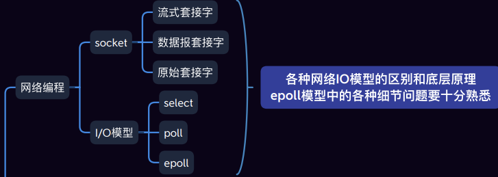

# 大纲

| ##container## |
|:--:|
||

这三种都是套接字（Socket）的类型，用于在计算机网络中进行数据传输。它们之间的主要区别在于传输数据的方式和提供的服务质量。

- **流式套接字（Stream Socket）**：使用TCP协议，提供可靠的、面向连接的数据传输服务。数据在发送和接收时保持顺序，并且可以检测到丢失或重复的数据包。流式套接字适用于需要保证数据完整性和顺序的场景，如文件传输、视频流传输等。

- **数据报套接字（Datagram Socket）**：使用UDP协议，提供无连接的、不可靠的数据传输服务。数据以数据包（Datagram）的形式发送和接收，每个数据包都是独立的，没有任何顺序或重复检测的保证。数据报套接字适用于对数据实时性要求高、但对数据完整性和顺序要求不高的场景，如语音通信、在线游戏等。

- **原始套接字（Raw Socket）**：提供对较低层次的网络协议的直接访问，如IP、ICMP等。使用原始套接字可以构造和发送自定义的网络数据包，也可以接收并解析网络数据包。原始套接字适用于网络安全、网络嗅探、网络测试等领域。

总的来说，流式套接字和数据报套接字是应用层和传输层之间的接口，而原始套接字则提供了更底层的网络访问权限。不同的套接字类型适用于不同的场景，在选择时需要根据具体情况进行权衡和选择。

一般情况下在工作和面试中使用流式套接字更为常见。TCP协议提供了可靠的、面向连接的数据传输服务，适用于大多数网络应用。许多常见的应用程序，如网页浏览器、电子邮件客户端、文件传输协议（FTP）等都是基于TCP协议实现的，因此使用流式套接字来进行数据传输是很常见的。

在面试中，流式套接字的理解和使用也是一个重要的考点。面试官可能会询问有关套接字编程的问题，并期望你能够展示对TCP协议和流式套接字的理解以及如何使用它们进行网络通信。

然而，在某些特定的场景下，例如实时性较高但对数据完整性和顺序要求不高的应用，可以选择使用数据报套接字进行数据传输。这种情况下，理解和熟悉数据报套接字也是有益的。

综上所述，流式套接字是最常见和广泛使用的套接字类型，但对数据报套接字和原始套接字也应该有一定的了解。

By GPT-3.5