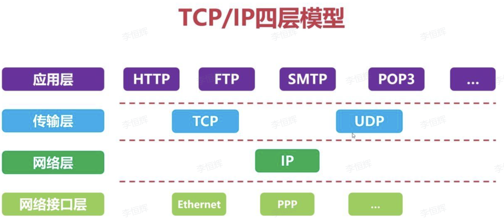
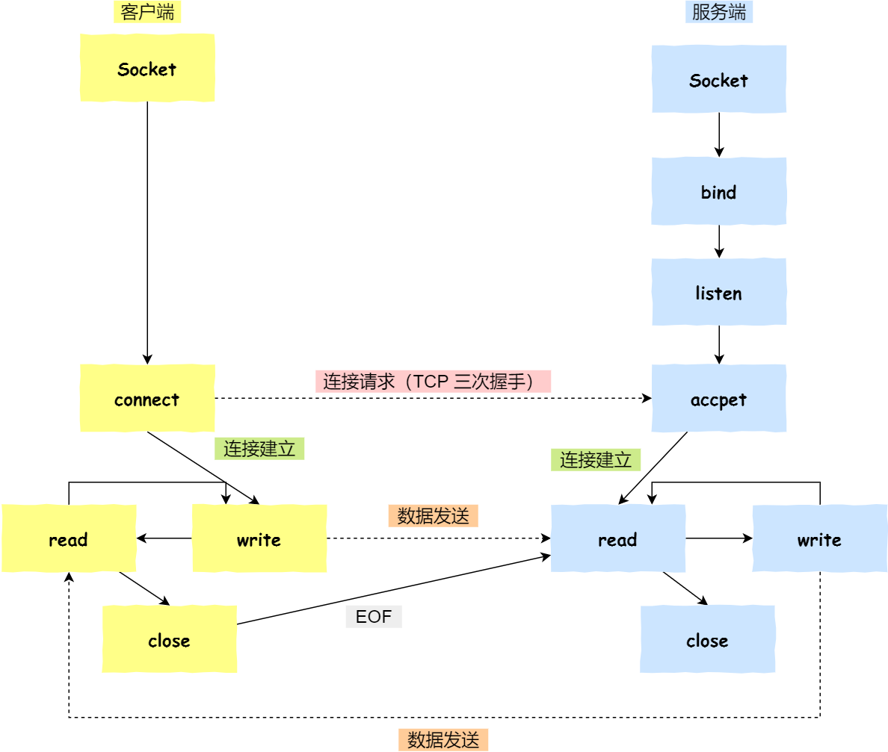

# 高级篇 -- 网络编程基础
## 网络协议: TCP/IP

| ##container## |
|:--:|
||

1. 应用层：主要负责为用户提供网络服务。应用层协议包括HTTP、FTP、SMTP等。
2. 传输层：主要负责在网络中建立端到端的连接，提供可靠的数据传输。传输层协议包括TCP和UDP。(C++主要实践这里)
3. 网络层：主要负责网络地址的分配和路由选择，例如 IP 协议。
4. 数据链路层：主要负责传输数据帧，例如以太网、ATM 和 PPP 等协议。

参考资料:

[TCPIP协议四层模型解析](https://zhuanlan.zhihu.com/p/620485741)

## 进程间通信: IPC
1. 管道：pipe
2. 信号：signal
3. 信号量：semaphore
4. 消息队列：message
5. 共享内存：share memory
6. 套接字：socket (不同于以上5点, 套接字不仅可以在本地通信, 也可以在网络上通信)

参考资料:

[进程间通信](https://zhuanlan.zhihu.com/p/502627174)

## 套接字：socket

| ##container## |
|:--:|
||

1. 服务端和客户端初始化Socket，得到文件描述符
2. 服务端调用bind，绑定IP和端口
3. 服务端调用listen，进行监听
4. 服务端调用accept，等待客户端连接
5. 客户端调用connect，向服务端发起连接请求。（TCP三次握手）
6. 服务端调用accept返回用于传输的Socket的文件描述符（和第一点得到的Socket不同）
7. 客户端使用write写入数据，服务端调用read读取数据
8. 客户端断开连接时会调用close，服务端也会调用close（TCP四次挥手）

参考资料:

[进程间的通信方式（六种）](https://blog.csdn.net/OYMNCHR/article/details/124728256)