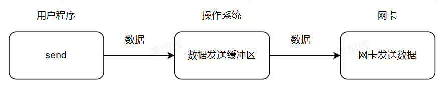
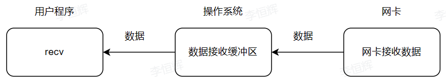

# 套接字常用属性
[C/C++ socket函数详解<sup>[参考]</sup>](https://www.cnblogs.com/liedElxa/p/10795398.html)

[最好的教程! 在此之前一切将没有意义!<sup>[过长警告]</sup>](https://zhuanlan.zhihu.com/p/405416697)

## 阻塞 IO
当用户线程发出IO请求之后，内核会去查看数据是否就绪，如果没有就绪就会等待数据就绪，而用户线程就会处于阻塞状态，用户线程交出CPU。当数据就绪之后，内核会将数据拷贝到用户线程，并返回结果给用户线程，用户线程才解除阻塞状态。

```C++
// 没有代码, 因为默认就是阻塞状态
```

## 非阻塞 IO
当用户线程发起read操作后，并不需要等待，而是马上得到结果。如果结果是一个error时，它就知道数据还没有准备好，于是它可以再次发起read操作。如果内核中的数据准备好了，它就将数据拷贝到用户线程。

在非阻塞IO模型中，用户线程需要不断地轮询内核数据是否就绪，也就是说非阻塞IO不会交出CPU，而会一直占用CPU。

```C++
bool HXServer::set_non_blocking() // 设置为非阻塞
{
    int flags = fcntl(this->s_sockfd, F_GETFL, 0); // 获取属性 (宏: F_GETFL)
    if (flags < 0)
    {
        printf("ERROR: socket set_non_blocking error: errno = %d, errmsg = %s", errno, strerror(errno));
        return false;
    }

    flags |= O_NONBLOCK; // 添加一个属性
    if (fcntl(this->s_sockfd, F_SETFL, flags) < 0)
    {
        printf("ERROR: socket fcntl error: errno = %d, errmsg = %s", errno, strerror(errno));
        return false;
    }
    return true;
}
```

## 发送缓冲区
| ##container## |
|:--:|
||

socket 没法直接将数据发送到网卡，所以只能先将数据发送到操作系统数据发送缓冲区。然后网卡从数据发送缓冲区中获取数据，再发送到接收方。

如果用户程序发送数据的速度比网卡读取的速度快，那么发送缓冲区将会很快被写满，这个时候 send 会被阻塞，也就是写入发生阻塞。

```C++
bool HXServer::set_send_buffer(int size) // 设置发送缓冲区大小
{
    int buff_size = size;
    if (setsockopt(this->s_sockfd, SOL_SOCKET, SO_SNDBUF, &buff_size, sizeof(buff_size)) < 0)
    {
        printf("ERROR: socket set_send_buffer error: errno = %d, errmsg = %s", errno, strerror(errno));
        return false;
    }
    return true;
}
```

## 接收缓冲区
| ##container## |
|:--:|
||

首先接收方机器网卡接收到发送方的数据后，先将数据保存到操作系统接收缓冲区。用户程序感知到操作系统缓冲区的数据后，主动调用接收数据的方法来获取数据。

如果数据接收缓冲区为空，这个时候 recv 会被阻塞，也就是读取发生阻塞。

注意：发送缓冲区和接收缓冲区这两个区域是每一个socket连接都有的。本质上而言，就是内核中的两块内存空间，socket创建完成后，这两块内存空间就开辟出来了。

```C++
bool HXServer::set_recv_buffer(int size) // 设置接收缓冲区大小
{
    int buff_size = size;
    if (setsockopt(this->s_sockfd, SOL_SOCKET, SO_RCVBUF, &buff_size, sizeof(buff_size)) < 0)
    {
        printf("ERROR: socket set_recv_buffer error: errno = %d, errmsg = %s", errno, strerror(errno));
        return false;
    }
    return true;
}

```

## SO_LINGER
设置函数close()关闭TCP连接时的行为。缺省close()的行为是，如果有数据残留在socket发送缓冲区中则系统将继续发送这些数据给对方，等待被确认，然后返回。

参考资料：
https://blog.csdn.net/u012635648/article/details/80279338

```C++
bool HXServer::set_linger(bool active, int seconds) // 设置 SO_LINGER
{
    struct linger l;
    std::memset(&l, 0, sizeof(l));
    l.l_onoff = active ? 1 : 0;
    l.l_linger = seconds;
    if (setsockopt(this->s_sockfd, SOL_SOCKET, SO_LINGER, &l, sizeof(l)) < 0)
    {
        printf("ERROR: socket set_linger error: errno = %d, errmsg = %s", errno, strerror(errno));
        return false;
    }
    return true;
}
```

## SO_KEEPALIVE
不论是服务端还是客户端，一方开启 KeepAlive 功能后，就会自动在规定时间内向对方发送心跳包， 而另一方在收到心跳包后就会自动回复，以告诉对方我仍然在线。

参考资料：
https://www.cnblogs.com/1119reya/p/10382276.html

```C++
bool HXServer::set_keepalive() // 启用 SO_KEEPALIVE
{
    int flag = 1;
    if (setsockopt(this->s_sockfd, SOL_SOCKET, SO_KEEPALIVE, &flag, sizeof(flag)) < 0)
    {
        printf("ERROR: socket set_keepalive error: errno = %d, errmsg = %s", errno, strerror(errno));
        return false;
    }
    return true;
}
```

## SO_REUSEADDR
SO_REUSEADDR是一个很有用的选项，一般服务器的监听socket都应该打开它。它的大意是允许服务器绑定一个地址，即使这个地址当前已经存在已建立的连接

参考资料：
https://zhuanlan.zhihu.com/p/79999012

```C++
bool HXServer::set_reuseaddr() // 启用 SO_REUSEADDR
{
    int flag = 1;
    if (setsockopt(this->s_sockfd, SOL_SOCKET, SO_KEEPALIVE, &flag, sizeof(flag)) < 0)
    {
        printf("ERROR: socket set_keepalive error: errno = %d, errmsg = %s", errno, strerror(errno));
        return false;
    }
    return true;
}
```