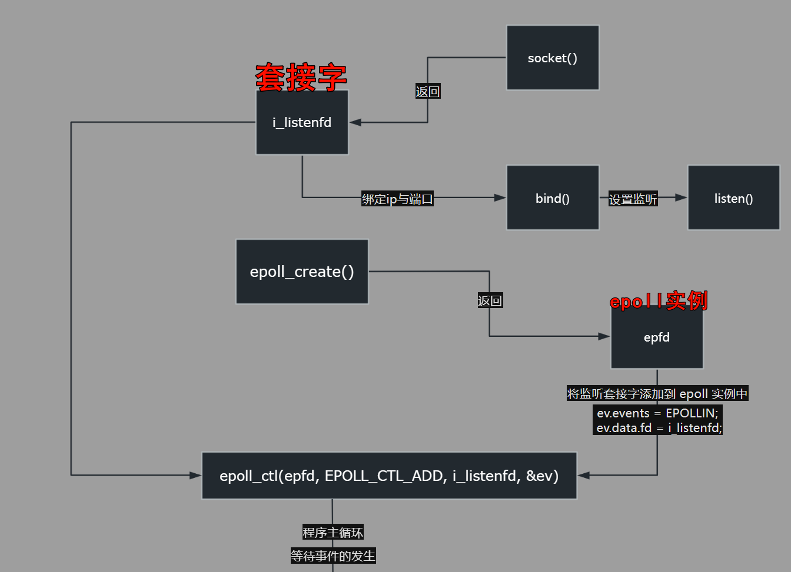
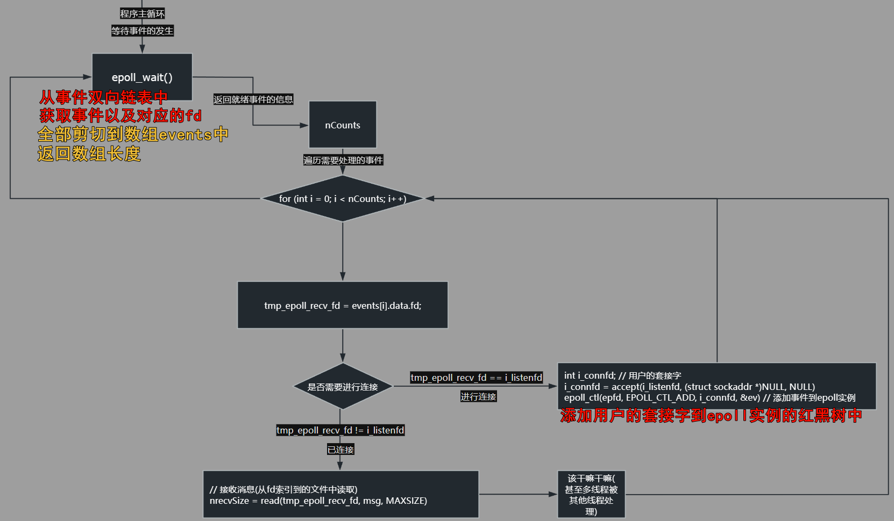

# 网络编程——C++实现socket通信(TCP)高并发之epoll模式

## epoll技术简介
【epoll概述】

- `I/O多路复用`：epoll就是一种典型的I/O多路复用技术: epoll技术的最大特点是 $支持高并发$ 。

    - 传统多路复用技术select，poll，在并发量达到1000-2000，性能就会明显下降

    - epoll，从linux内核2.6引入的，2.6之前是没有的

- epoll和kqueue(freebsd)技术类似：单独一台计算机支撑少则数万，多则数十上百万并发连接的核心技术。

    - epoll技术完全没有这种性能会随着并发量提高而出现明显下降的问题。但是并发没增加一个，必定要消耗一定的内存去保存这个连接相关的数据。

    - 并发量总还是有限制的，不可能是无限的

    - 10万个连接同一时刻，可能只有几十上百个客户端给你发送数据，epoll只处理这几十上百个客户端

- 很多服务器程序用多进程，每一个进程对应一个连接也有用多线程做的，每一个线程对应 一个连接。

    - **epoll事件驱动机制，在单独的进程或者单独的线程里运行，收集/处理事件没有进程/线程之间切换的消耗**，高效。

- 适合高并发，融合epoll技术到项目中，写小demo非常简单，难度小，但是要把epoll技术融合到商业的环境中，那么难度就会骤然增加。

## 使用的大致框架

服务端

| ##container## |
|:--:|
||
||


```C++
创建 socket 套接字
绑定 IP 和端口用于监听
监听客户端连接请求
创建 epoll 实例
将监听套接字添加到 epoll 实例中
whiel (1) {
    循环等待客户端连接和接收客户端发送过来的消息
}
关闭监听套接字和 epoll 实例
```

其中`while`的细节

```C++
epoll_create() 是创建实例(只需要调用一次)
while(1) {
    epoll_wait() 是监听信息 是阻塞的
    当该函数结束, 会有数据返回到 数组 events中, 以及有效数据长度
    通过 for 遍历上面数组的有效部分,
    如果 是 连接,  accept() 函数接受连接，并将新的连接套接字 i_connfd 添加到 epoll 实例中，以便后续监听该连接的消息
    如果 已连接 那么就是消息 则进行处理, 出现异常(nrecvSize == 0) 就是客户端已断开, 则  epoll_ctl 将其删除, 并且close掉
}
```

## 函数介绍

### epoll_create()

```C++
/**
 * 创建一个 epoll 实例
 *
 * @param size 用于指定内核为这个实例所维护的事件数目的一个建议值。
 *             (原则上大于0即可 (一般设置为1))不必是一个准确的值，只是一个提示。实际上，内核会根据需要动态调整大小。
 * @return 返回实例的文件描述符。如果出错，则返回 -1 并设置 errno 错误码。
 */
int epoll_create(int size);
```

**功能**: 创建一个epoll对象，返回该对象的描述符【文件描述符】<sup>[2][5]</sup>，这个描述符就代表这个epoll对象<sup>[3][4]</sup>，后续会用到。


### epoll_ctl()

```C++
/**
 * 控制 epoll 实例中的事件
 *
 * @param efpd       epoll 实例的文件描述符
 * @param op         操作类型，可选值为 EPOLL_CTL_ADD、EPOLL_CTL_MOD 或 EPOLL_CTL_DEL
 * @param sockid     要操作的文件描述符(套接字)
 * @param event      指向 epoll_event 结构体的指针，用于指定事件类型和数据
 * @return           成功时返回 0；失败时返回 -1，并设置 errno 错误码
 */
int epoll_ctl(int efpd, int op, int sockid, struct epoll_event *event);
```

### epoll_wait()

```C++
/**
 * 等待事件的发生，并返回就绪事件的信息
 *
 * @param efpd    epoll 实例的文件描述符
 * @param events  指向 epoll_event 数组的指针，用于存储就绪事件的信息
 * @param maxev   用于指定 events 数组中可以存储的最大事件数目。
 *                如果没有可用的事件，该函数将阻塞，直到有事件发生或者超时。
 * @param timeout 阻塞等待的时间（以毫秒为单位），如果为 -1，则表示永久等待，直到有事件发生。
 * @return 返回就绪事件的数目。时间到则返回0, 如果出错，则返回 -1 并设置 errno 错误码。
 */
int epoll_wait(int efpd, struct epoll_event *events, int maxev, int timeout);
```

## 结构体

### struct epoll_event

`struct epoll_event` 是 `epoll` 事件的数据结构，用于描述注册在 `epoll` 实例中的文件描述符所关心的事件。该结构体包含以下成员:

```C++
typedef union epoll_data {
    void    *ptr;        // 指针类型的用户数据
    int      fd;         // 文件描述符类型的用户数据
    uint32_t u32;        // 32 位整数类型的用户数据
    uint64_t u64;        // 64 位整数类型的用户数据
} epoll_data_t;

struct epoll_event {
    uint32_t      events;  // 关心的事件类型
    epoll_data_t  data;    // 用户数据，用于标识与事件相关的信息
};
```

其中，`events` 字段是一个按位或运算符组合的事件类型值，表示注册的文件描述符所关心的事件类型:

- `EPOLLIN`：有数据可读
- `EPOLLOUT`：可写入数据
- `EPOLLRDHUP`：TCP 连接被对方关闭，或者对方关闭了写操作
- `EPOLLHUP`：发生挂起事件，如管道读端被关闭、socket 发生错误等
- `EPOLLERR`：发生错误事件，如 TCP 连接被重置、socket 发生错误等

data 字段是一个共用体，用于存储与事件相关的用户数据。根据不同的使用场景，可以使用其中的一个字段来存储用户数据。

在使用 `epoll_ctl()` 函数向 `epoll` 实例中添加或修改文件描述符时，需要将一个 `struct epoll_event` 结构体作为参数传递给该函数，用于指定事件类型和用户数据。在使用 `epoll_wait()` 函数获取就绪事件时，内核会将就绪事件的信息存储到一个用户提供的 `struct epoll_event` 数组中，用于标识哪些文件描述符已经准备好进行 I/O 操作。

### struct sockaddr_in

`struct sockaddr_in` 是一个用于存储 IPv4 地址和端口号的结构体，其定义如下:

```C++
struct sockaddr_in {
    sa_family_t sin_family;  // 地址族（Address Family），一般为 AF_INET
    in_port_t sin_port;      // 端口号，网络字节序
    struct in_addr sin_addr; // IPv4 地址，网络字节序
    char sin_zero[8];        // 填充字段，使 struct sockaddr_in 和 struct sockaddr 在大小上保持一致
};
```

其中，`sa_family_t` 是一个类型定义，用于表示地址族（即协议族）。在 `struct sockaddr_in` 中，它通常被设置为 `AF_INET`，表示 IPv4 地址族。`in_port_t` 和 `struct in_addr` 分别表示端口号和 IPv4 地址。

`sin_port` 和 `sin_addr` 成员变量均采用了**网络字节序（也叫大端字节序）** 进行存储，这是因为在网络传输中需要使用网络字节序来保证通信的正确性。在实际编程中，可以使用`htons()`和`htonl()`等函数将主机字节序转换为网络字节序，或者使用`ntohs()`和`ntohl()`等函数将网络字节序转换为主机字节序。

总之，`struct sockaddr_in` 是一个用于表示 IPv4 地址和端口号的结构体，在网络编程中经常使用。它可以用于表示服务器监听的地址、客户端连接的地址等。

### struct sockaddr

`struct sockaddr` 是一个通用的套接字地址结构体，用于存储各种类型的套接字地址信息。它的定义如下:

```C++
struct sockaddr {
    sa_family_t sa_family;  // 地址族（Address Family）
    char sa_data[14];       // 地址数据，包括地址值和其他协议特定信息
};
```

`sa_family_t` 是一个类型定义，用于表示 **地址族（即协议族）**。`sa_data` 是一个字符数组，用于存储地址数据。具体的地址数据格式和长度取决于地址族的不同。

在实际使用中，`struct sockaddr` 通常会被强制转换为更具体的地址结构体，如 `struct sockaddr_in`（IPv4 地址结构体）或 `struct sockaddr_in6`（IPv6 地址结构体）。这样可以根据套接字的地址类型来正确解析和处理地址信息。

`struct sockaddr` 被设计为通用的套接字地址结构体，使得可以处理多种类型的套接字地址，从而提高了套接字编程的灵活性和可扩展性。

需要注意的是，`struct sockaddr` 中的 `sa_data` 字段并没有固定的格式，具体的值和含义取决于不同的地址族和协议。因此，在实际使用时，需要根据具体的协议族和地址类型来正确解释和操作地址数据。

## 代码
### 服务端

```C++
#include <stdio.h>
#include <sys/types.h>
#include <sys/socket.h>
#include <errno.h>
#include <string.h>
#include <stdlib.h>
#include <unistd.h>
#include <netinet/in.h>
#include <ctype.h>
#include <sys/epoll.h> //epoll头文件

#define MAXSIZE 1024
#define IP_ADDR "127.0.0.1"
#define IP_PORT 8888

int main()
{
    int i_listenfd;                 // 声明 服务器套接字
    struct sockaddr_in st_sersock;  // 声明 IPv4 地址结构体
    char msg[MAXSIZE];              // 声明 存放接收的消息的字符数组
    int nrecvSize = 0;              // 声明 当前有操作数

    struct epoll_event ev, events[MAXSIZE];
    int epfd, nCounts; // epfd: epoll实例句柄(套接字), nCounts: epoll_wait返回值

    if ((i_listenfd = socket(AF_INET, SOCK_STREAM, 0)) < 0) // 建立socket套接字
    {
        printf("socket Error: %s (errno: %d)\n", strerror(errno), errno);
        exit(0);
    }

    // 初始化服务器的网络配置
    memset(&st_sersock, 0, sizeof(st_sersock));
    st_sersock.sin_family = AF_INET;                // IPv4协议
    st_sersock.sin_addr.s_addr = htonl(INADDR_ANY); // INADDR_ANY转换过来就是0.0.0.0，泛指本机的意思，也就是表示本机的所有IP，因为有些机子不止一块网卡，多网卡的情况下，这个就表示所有网卡ip地址的意思。
    st_sersock.sin_port = htons(IP_PORT);

    // 绑定
    if (bind(i_listenfd, (struct sockaddr *)&st_sersock, sizeof(st_sersock)) < 0) // 将套接字绑定IP和端口用于监听
    {
        printf("bind Error: %s (errno: %d)\n", strerror(errno), errno);
        exit(0);
    }

    // 设置监听: 设定可同时排队的客户端最大连接个数
    if (listen(i_listenfd, 20) < 0)
    {
        printf("listen Error: %s (errno: %d)\n", strerror(errno), errno);
        exit(0);
    }

    // ---[创建epoll实例]---
    if ((epfd = epoll_create(MAXSIZE)) < 0)
    {
        printf("epoll_create Error: %s (errno: %d)\n", strerror(errno), errno);
        exit(-1);
    }

    // --- 将监听套接字添加到 epoll 实例中 ---
    ev.events = EPOLLIN;
    ev.data.fd = i_listenfd;
    if (epoll_ctl(epfd, EPOLL_CTL_ADD, i_listenfd, &ev) < 0)
    {
        printf("epoll_ctl Error: %s (errno: %d)\n", strerror(errno), errno);
        exit(-1);
    }
    printf("======waiting for client's request======\n");

    // 准备接受客户端连接
    while (1)
    {
        if ((nCounts = epoll_wait(epfd, events, MAXSIZE, -1)) < 0) // 等待事件的发生，并返回就绪事件的信息
        {
            printf("epoll_ctl Error: %s (errno: %d)\n", strerror(errno), errno);
            exit(-1);
        }
        else if (nCounts == 0)
        {
            printf("time out, No data!\n");
        }
        else
        {
            for (int i = 0; i < nCounts; i++)
            {
                int tmp_epoll_recv_fd = events[i].data.fd;
                if (tmp_epoll_recv_fd == i_listenfd) // 有客户端连接请求
                {
                    int i_connfd; // 用户的套接字
                    if ((i_connfd = accept(i_listenfd, (struct sockaddr *)NULL, NULL)) < 0) // 阻塞等待客户端连接
                    {
                        printf("accept Error: %s (errno: %d)\n", strerror(errno), errno);
                    }
                    else
                    {
                        printf("Client[%d], welcome!\n", i_connfd);
                    }

                    // 重新设置, 以确保事件类型和关联的文件描述符是最新
                    ev.events = EPOLLIN;
                    ev.data.fd = i_connfd;
                    if (epoll_ctl(epfd, EPOLL_CTL_ADD, i_connfd, &ev) < 0)
                    {
                        printf("epoll_ctl Error: %s (errno: %d)\n", strerror(errno), errno);
                        exit(-1);
                    }
                }
                else // 若是已连接的客户端发来数据请求
                {
                    // 接受客户端发来的消息并作处理(小写转大写)后回写给客户端
                    memset(msg, 0, sizeof(msg));
                    if ((nrecvSize = read(tmp_epoll_recv_fd, msg, MAXSIZE)) < 0)
                    {
                        printf("read Error: %s (errno: %d)\n", strerror(errno), errno);
                        continue;
                    }
                    else if (nrecvSize == 0) // read返回0代表对方已close断开连接。
                    {
                        printf("client has disconnected!\n");
                        epoll_ctl(epfd, EPOLL_CTL_DEL, tmp_epoll_recv_fd, NULL);
                        close(tmp_epoll_recv_fd); //

                        continue;
                    }
                    else
                    {
                        printf("recvMsg:%s", msg);
                        for (int i = 0; msg[i] != '\0'; i++)
                        {
                            msg[i] = toupper(msg[i]);
                        }
                        if (write(tmp_epoll_recv_fd, msg, strlen(msg) + 1) < 0)
                        {
                            printf("write Error: %s (errno: %d)\n", strerror(errno), errno);
                        }
                    }
                }
            }
        }
    } // while
    close(i_listenfd);
    close(epfd);
    return 0;
}
```

### 客户端

```C++
#include <stdio.h>
#include <sys/types.h>
#include <sys/socket.h>
#include <errno.h>
#include <string.h>
#include <stdlib.h>
#include <unistd.h>
#include <netinet/in.h>
#include <signal.h>
#include <arpa/inet.h>

#define MAXSIZE 1024
#define IP_ADDR "127.0.0.1"
#define IP_PORT 8888

int i_sockfd = -1;

void SigCatch(int sigNum) // 信号捕捉函数(捕获Ctrl+C)
{
    if (i_sockfd != -1)
    {
        close(i_sockfd);
    }
    printf("Bye~! Will Exit...\n");
    exit(0);
}

int main()
{
    struct sockaddr_in st_clnsock;
    char msg[1024];
    int nrecvSize = 0;

    signal(SIGINT, SigCatch); // 注册信号捕获函数

    if ((i_sockfd = socket(AF_INET, SOCK_STREAM, 0)) < 0) // 建立套接字
    {
        printf("socket Error: %s (errno: %d)\n", strerror(errno), errno);
        exit(0);
    }

    memset(&st_clnsock, 0, sizeof(st_clnsock));
    st_clnsock.sin_family = AF_INET; // IPv4协议
    // IP地址转换(直接可以从物理字节序的点分十进制 转换成网络字节序)
    if (inet_pton(AF_INET, IP_ADDR, &st_clnsock.sin_addr) <= 0)
    {
        printf("inet_pton Error: %s (errno: %d)\n", strerror(errno), errno);
        exit(0);
    }
    st_clnsock.sin_port = htons(IP_PORT); // 端口转换(物理字节序到网络字节序)

    if (connect(i_sockfd, (struct sockaddr *)&st_clnsock, sizeof(st_clnsock)) < 0) // 主动向设置的IP和端口号的服务端发出连接
    {
        printf("connect Error: %s (errno: %d)\n", strerror(errno), errno);
        exit(0);
    }

    printf("======connect to server, sent data======\n");

    while (1) // 循环输入，向服务端发送数据并接受服务端返回的数据
    {
        fgets(msg, MAXSIZE, stdin);
        printf("will send: %s", msg);
        if (write(i_sockfd, msg, MAXSIZE) < 0) // 发送数据
        {
            printf("write Error: %s (errno: %d)\n", strerror(errno), errno);
            exit(0);
        }

        memset(msg, 0, sizeof(msg));
        if ((nrecvSize = read(i_sockfd, msg, MAXSIZE)) < 0) // 接受数据
        {
            printf("read Error: %s (errno: %d)\n", strerror(errno), errno);
        }
        else if (nrecvSize == 0)
        {
            printf("Service Close!\n");
        }
        else
        {
            printf("Server return: %s\n", msg);
        }
    }
    return 0;
}
```

## 注解
### [1]
本文的参考:

[CSDN: (C++通讯架构学习笔记)epoll介绍及原理详解](https://blog.csdn.net/baidu_41388533/article/details/110134366)

[CSDN: 网络编程——C++实现socket通信(TCP)高并发之epoll模式](https://blog.csdn.net/buknow/article/details/107018954)

[知乎: 深入了解epoll模型 (特别详细)](https://zhuanlan.zhihu.com/p/427512269)

[CSDN: Socket编程实践(11) --epoll原理与封装](https://blog.csdn.net/zjf280441589/article/details/44206383)

<硬核>[oschina: 从 linux 源码看 epoll](https://my.oschina.net/alchemystar/blog/3008840)

### [2]

**文件描述符（file descriptor）** 是操作系统中用于标识`已打开`文件的整数值，包括套接字、管道、文件等。在 Linux 系统中，所有打开的文件都有一个`唯一`的文件描述符。因此，在网络编程中，套接字的文件描述符也是一个整数值。

由于文件描述符是整数值，因此在程序中通常使用 int 类型来表示，例如 int sockfd 表示一个套接字文件描述符。

在 `epoll_ctl()` 函数中，需要传入一个套接字的文件描述符来操作 epoll 实例，例如添加、删除、修改等。因此，`epoll_ctl()` 函数的第三个参数需要传入一个整数类型的套接字文件描述符。

### [3]

> 指定的 epoll实例(int) 是怎么对应到 它对应的数据结构的?

在 `Linux` 中，每个文件描述符都会有一个相关联的 `epoll` 实例。当调用 `epoll_create()` 创建一个新的 `epoll` 实例时，内核会为该实例分配一块内存，并返回一个与之对应的文件描述符。

这个文件描述符是一个整数值，可以用于后续操作该 `epoll` 实例。实际上，这个文件描述符只是一个标识符，它在内核中被用作索引来查找和操作相应的数据结构。

内核会维护一个类似哈希表的数据结构，将文件描述符映射到相应的 `epoll` 实例。当我们对 `epoll` 实例进行操作时，内核会根据文件描述符查找到对应的数据结构，并进行相应的处理。

具体而言，在 `epoll` 的实现中，内核会维护一个 `eventpoll` 结构体数组，其中每个元素表示一个 `epoll` 实例。这个数组的索引就是文件描述符，通过将文件描述符作为索引，可以快速找到对应的 `eventpoll` 结构体，从而进行事件管理和处理。

因此，我们可以通过文件描述符来操作和访问相应的 `epoll` 实例对应的数据结构。这种映射关系是由内核进行维护的，我们只需要通过文件描述符来标识和操作特定的 `epoll` 实例即可。

By GPT-3.5

### [4] epoll_create返回的fd是什么？

这个模块在内核初始化时（操作系统启动）注册了一个新的文件系统，叫"eventpollfs"（在`eventpoll_fs_type`结构里），然后挂载此文件系统。另外还创建两个内核cache（在内核编程中，如果需要频繁分配小块内存，应该创建kmem_cahe来做“内存池”）,分别用于存放`struct epitem`和`eppoll_entry`。这个内核高速cache区，就是建立连续的物理内存页，就是物理上分配好你想要的size的内存对象，每次使用时都是使用空闲的已分配好的内存。

现在想想`epoll_create`为什么会返回一个新的fd？

因为它就是在这个叫做"eventpollfs"的文件系统里创建了一个新文件！返回的就是这个文件的fd索引。**完美地遵行了Linux一切皆文件的特色**。

### [5] 文件描述符 可以当做套接字吗?

是的，文件描述符可以用于表示套接字。在许多操作系统中，包括类Unix系统，套接字被视为一种特殊类型的文件，因此可以使用文件描述符来引用它们。

文件描述符是一个非负整数，由操作系统分配和管理。它作为一个索引或句柄，用于标识进程打开的文件或套接字。当打开一个文件或套接字时，操作系统会分配一个文件描述符，并将其返回给应用程序。

在许多编程语言和操作系统API中，使用文件描述符来进行对文件或套接字的读取、写入和其他操作。例如，在C语言中，可以使用`open()`或`socket()`函数打开文件或套接字，这些函数会返回一个文件描述符。然后，可以使用`read()`、`write()`等函数来使用该文件描述符进行读写操作。

需要注意的是，虽然文件描述符可以用于表示套接字，但套接字具有与普通文件不同的属性和行为。套接字提供了网络通信功能，可以进行网络连接的建立、数据的传输等操作。因此，在使用文件描述符表示套接字时，需要使用相应的套接字相关的API函数进行操作，而不是仅仅当作普通文件来处理。

### [6] 如何实现广播?

如果我们需要向已连接的客户端广播全部消息，怎么办?

答: `使用一个容器把客户端的套接字存储, 然后广播的时候对容器进行遍历即可(注意: 当某个客户端断开连接要记得从容器中移除)`