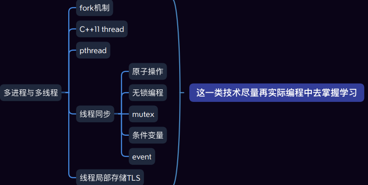

# 多进程与多线程 序章: 线程概述

| ##container## |
|:--:|
|<h2>大纲思维导图</h2>|
||

## 线程概述

线程是轻量级的**进程（LWP：light weight process）**，在Linux环境下线程的本质仍是进程。在计算机上运行的程序是一组指令及指令参数的组合，指令按照既定的逻辑控制计算机运行。操作系统会以进程为单位，分配系统资源，可以这样理解，<b style="color:red">进程是资源分配的最小单位，线程是操作系统调度执行的最小单位</b>。

先从概念上了解一下线程和进程之间的区别:

- 进程有自己独立的地址空间, 多个线程共用同一个地址空间

    - 线程更加节省系统资源, 效率不仅可以保持的, 而且能够更高
    - 在一个地址空间中多个线程独享: 每个线程都有属于自己的栈区, 寄存器(内核中管理的)
    - 在一个地址空间中多个线程共享: 代码段, 堆区, 全局数据区, 打开的文件(文件描述符表)都是线程共享的

- 线程是程序的最小执行单位, 进程是操作系统中最小的资源分配单位

    - 每个进程对应一个虚拟地址空间，一个进程只能抢一个CPU时间片
    - 一个地址空间中可以划分出多个线程, 在有效的资源基础上, 能够抢更多的CPU时间片

- CPU的调度和切换: 线程的上下文切换比进程要快的多
    - 上下文切换：进程/线程分时复用CPU时间片，在切换之前会将上一个任务的状态进行保存, 下次切换回这个任务的时候, 加载这个状态继续运行，**任务从保存到再次加载这个过程就是一次上下文切换**。
- 线程更加廉价, 启动速度更快, 退出也快, 对系统资源的冲击小。

**在处理多任务程序的时候使用多线程比使用多进程要更有优势，但是线程并不是越多越好**，如何控制线程的个数呢？

- `文件IO操作`：文件IO对CPU是使用率不高, 因此可以分时复用CPU时间片, 线程的个数 = 2 * CPU核心数 (效率最高)

- 处理复杂的算法(主要是`CPU进行运算`, 压力大)，线程的个数 = CPU的核心数 (效率最高)