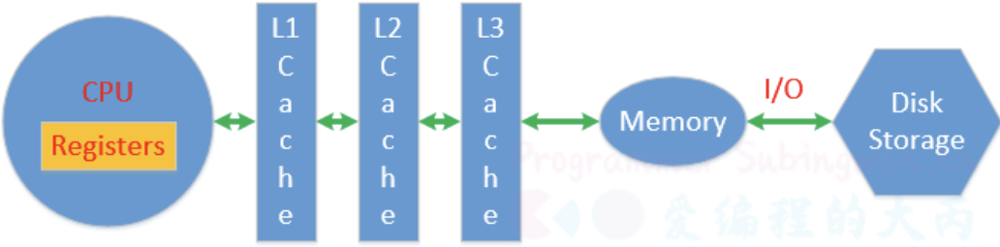
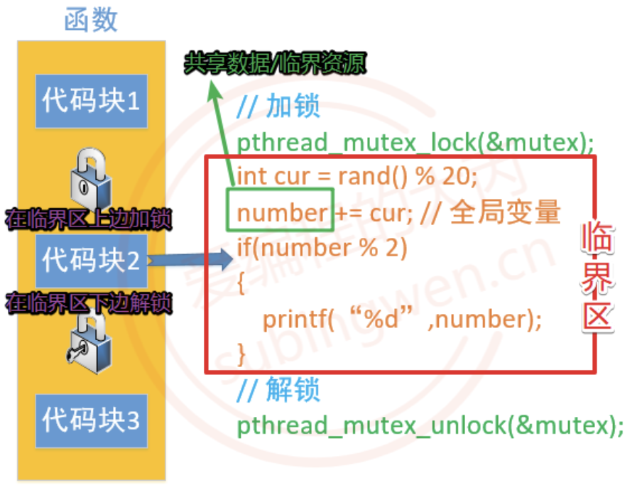

# 线程同步: 序言
## 概念
假设有4个线程A、B、C、D，当前一个线程A对内存中的<b style="color:red">共享资源</b>进行访问的时候，其他线程B, C, D都不可以对这块内存进行操作，直到线程A对这块内存访问完毕为止，B，C，D中的一个才能访问这块内存，剩余的两个需要继续阻塞等待，以此类推，直至所有的线程都对这块内存操作完毕。 线程对内存的这种访问方式就称之为线程同步，通过对概念的介绍，我们可以了解到<b style="color:red">所谓的同步并不是多个线程同时对内存进行访问，而是按照先后顺序依次进行的</b>。

## 为什么要同步

> 在研究线程同步之前，先来看一个两个线程交替数数（每个线程数50个数，交替数到100）的例子:

```C++
#include <stdio.h>
#include <unistd.h>
#include <stdlib.h>
#include <sys/types.h>
#include <sys/stat.h>
#include <string.h>
#include <pthread.h>

#define MAX 50
// 全局变量
int number;

// 线程处理函数
void* funcA_num(void* arg)
{
    for(int i=0; i<MAX; ++i)
    {
        int cur = number;
        cur++;
        usleep(10);
        number = cur;
        printf("Thread A, id = %lu, number = %d\n", pthread_self(), number);
    }

    return NULL;
}

void* funcB_num(void* arg)
{
    for(int i=0; i<MAX; ++i)
    {
        int cur = number;
        cur++;
        number = cur;
        printf("Thread B, id = %lu, number = %d\n", pthread_self(), number);
        usleep(5);
    }

    return NULL;
}

int main(int argc, const char* argv[])
{
    pthread_t p1, p2;

    // 创建两个子线程
    pthread_create(&p1, NULL, funcA_num, NULL);
    pthread_create(&p2, NULL, funcB_num, NULL);

    // 阻塞，资源回收
    pthread_join(p1, NULL);
    pthread_join(p2, NULL);

    return 0;
}
```

理论上应该输出: 50 + 50 == 100 的, 但是:

```Shell
[root@localhost hx_thread]# ./app
Thread B, id = 139910015084288, number = 1
Thread A, id = 139910023476992, number = 1
Thread B, id = 139910015084288, number = 2
Thread A, id = 139910023476992, number = 2
Thread B, id = 139910015084288, number = 3
Thread A, id = 139910023476992, number = 3
Thread B, id = 139910015084288, number = 4
Thread A, id = 139910023476992, number = 4
Thread B, id = 139910015084288, number = 5
Thread A, id = 139910023476992, number = 5
Thread B, id = 139910015084288, number = 6
Thread A, id = 139910023476992, number = 6
Thread B, id = 139910015084288, number = 7
Thread A, id = 139910023476992, number = 7
Thread B, id = 139910015084288, number = 8
Thread A, id = 139910023476992, number = 9
Thread B, id = 139910015084288, number = 10
Thread A, id = 139910023476992, number = 10
Thread A, id = 139910023476992, number = 11
Thread B, id = 139910015084288, number = 12
Thread A, id = 139910023476992, number = 12
Thread B, id = 139910015084288, number = 13
Thread A, id = 139910023476992, number = 13
Thread B, id = 139910015084288, number = 14
Thread A, id = 139910023476992, number = 14
Thread B, id = 139910015084288, number = 15
Thread A, id = 139910023476992, number = 15
Thread B, id = 139910015084288, number = 16
Thread A, id = 139910023476992, number = 16
Thread B, id = 139910015084288, number = 17
Thread A, id = 139910023476992, number = 17
Thread B, id = 139910015084288, number = 18
Thread B, id = 139910015084288, number = 19
Thread B, id = 139910015084288, number = 20
Thread A, id = 139910023476992, number = 19
Thread B, id = 139910015084288, number = 21
Thread A, id = 139910023476992, number = 21
Thread B, id = 139910015084288, number = 22
Thread B, id = 139910015084288, number = 23
Thread A, id = 139910023476992, number = 23
Thread B, id = 139910015084288, number = 24
Thread A, id = 139910023476992, number = 24
Thread B, id = 139910015084288, number = 25
Thread A, id = 139910023476992, number = 25
Thread B, id = 139910015084288, number = 26
Thread A, id = 139910023476992, number = 26
Thread B, id = 139910015084288, number = 27
Thread A, id = 139910023476992, number = 27
Thread B, id = 139910015084288, number = 28
Thread A, id = 139910023476992, number = 28
Thread B, id = 139910015084288, number = 29
Thread A, id = 139910023476992, number = 29
Thread B, id = 139910015084288, number = 30
Thread A, id = 139910023476992, number = 30
Thread B, id = 139910015084288, number = 31
Thread A, id = 139910023476992, number = 31
Thread B, id = 139910015084288, number = 32
Thread A, id = 139910023476992, number = 32
Thread B, id = 139910015084288, number = 33
Thread A, id = 139910023476992, number = 33
Thread B, id = 139910015084288, number = 34
Thread A, id = 139910023476992, number = 34
Thread A, id = 139910023476992, number = 35
Thread B, id = 139910015084288, number = 36
Thread A, id = 139910023476992, number = 37
Thread B, id = 139910015084288, number = 38
Thread A, id = 139910023476992, number = 38
Thread B, id = 139910015084288, number = 39
Thread A, id = 139910023476992, number = 39
Thread B, id = 139910015084288, number = 40
Thread A, id = 139910023476992, number = 40
Thread B, id = 139910015084288, number = 41
Thread A, id = 139910023476992, number = 41
Thread B, id = 139910015084288, number = 42
Thread A, id = 139910023476992, number = 42
Thread B, id = 139910015084288, number = 43
Thread A, id = 139910023476992, number = 43
Thread B, id = 139910015084288, number = 44
Thread A, id = 139910023476992, number = 44
Thread B, id = 139910015084288, number = 45
Thread A, id = 139910023476992, number = 45
Thread B, id = 139910015084288, number = 46
Thread A, id = 139910023476992, number = 47
Thread B, id = 139910015084288, number = 48
Thread A, id = 139910023476992, number = 48
Thread B, id = 139910015084288, number = 49
Thread A, id = 139910023476992, number = 49
Thread B, id = 139910015084288, number = 50
Thread A, id = 139910023476992, number = 50
Thread B, id = 139910015084288, number = 51
Thread A, id = 139910023476992, number = 51
Thread B, id = 139910015084288, number = 52
Thread A, id = 139910023476992, number = 52
Thread B, id = 139910015084288, number = 53
Thread A, id = 139910023476992, number = 53
Thread B, id = 139910015084288, number = 54
Thread A, id = 139910023476992, number = 54
Thread B, id = 139910015084288, number = 55
Thread A, id = 139910023476992, number = 55
Thread A, id = 139910023476992, number = 56
```
通过对上面例子的测试，可以看出虽然每个线程内部循环了50次每次数一个数，但是最终没有数到100，通过输出的结果可以看到，有些数字被重复数了多次，其原因就是没有对线程进行同步处理，造成了数据的混乱。

两个线程在数数的时候需要分时复用CPU时间片，并且测试程序中调用了`sleep()`导致线程的CPU时间片没用完就被迫挂起了，这样就能让CPU的上下文切换（保存当前状态, 下一次继续运行的时候需要加载保存的状态）更加频繁，更容易再现数据混乱的这个现象。

| ##container## |
|:--:|
||

CPU对应寄存器、一级缓存、二级缓存、三级缓存是独占的，用于存储处理的数据和线程的状态信息，数据被CPU处理完成需要再次被写入到物理内存中，物理内存数据也可以通过文件IO操作写入到磁盘中。

在测试程序中两个线程共用全局变量`number`当线程变成运行态之后开始数数，从物理内存加载数据，让后将数据放到CPU进行运算，最后将结果更新到物理内存中。如果数数的两个线程都可以顺利完成这个流程，那么得到的结果肯定是正确的。

如果线程A执行这个过程期间就失去了CPU时间片，线程A被挂起了最新的数据没能更新到物理内存。线程B变成运行态之后从物理内存读数据，很显然它没有拿到最新数据，只能基于旧的数据往后数，然后失去CPU时间片挂起。线程A得到CPU时间片变成运行态，第一件事儿就是将上次没更新到内存的数据更新到内存，但是这样会导致线程B已经更新到内存的数据被覆盖，活儿白干了，最终导致有些数据会被重复数很多次。

## 同步方式
对于多个线程访问共享资源出现数据混乱的问题，需要进行线程同步。常用的线程同步方式有四种：**互斥锁、读写锁、条件变量、信号量**。所谓的共享资源就是多个线程共同访问的变量，这些变量通常为全局数据区变量或者堆区变量，这些变量对应的共享资源也被称之为临界资源。

| ##container## |
|:--:|
||

找到临界资源之后，再找和临界资源相关的上下文代码，这样就得到了一个代码块，这个代码块可以称之为临界区。确定好临界区（临界区越小越好）之后，就可以进行线程同步了，线程同步的大致处理思路是这样的:
- 在临界区代码的上边，添加加锁函数，对临界区加锁。
    - 哪个线程调用这句代码，就会把这把锁锁上，其他线程就只能阻塞在锁上了。
      
- 在临界区代码的下边，添加解锁函数，对临界区解锁。
    - 出临界区的线程会将锁定的那把锁打开，其他抢到锁的线程就可以进入到临界区了。
      
- 通过锁机制能保证临界区代码最多只能同时有一个线程访问，这样并行访问就变为串行访问了。

## 参考链接
[爱编程的大丙-线程同步](https://subingwen.cn/linux/thread-sync/#1-1-%E4%B8%BA%E4%BB%80%E4%B9%88%E8%A6%81%E5%90%8C%E6%AD%A5)