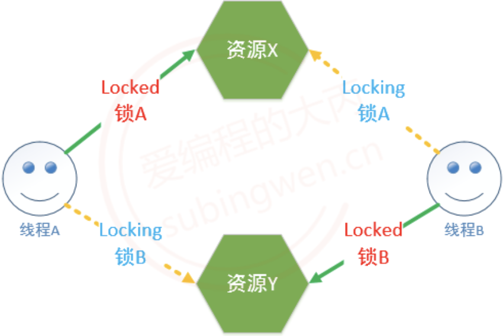

# 死锁
当多个线程访问共享资源, 需要加锁, 如果锁使用不当, 就会造成死锁这种现象。如果线程死锁造成的后果是：所有的线程都被阻塞，并且线程的阻塞是无法解开的（因为可以解锁的线程也被阻塞了）。

造成死锁的场景有如下几种：
## 加锁之后忘记解锁

```C++
// 场景1
void func()
{
    for(int i = 0; i < 6; ++i)
    {
        // 当前线程A加锁成功, 当前循环完毕没有解锁, 在下一轮循环的时候自己被阻塞了
        // 其余的线程也被阻塞
        pthread_mutex_lock(&mutex);
        ....
        .....
        // 忘记解锁
    }
}

// 场景2
void func()
{
    for(int i = 0; i < 6; ++i)
    {
        // 当前线程A加锁成功
        // 其余的线程被阻塞
        pthread_mutex_lock(&mutex);
        ....
        .....
        if(xxx)
        {
            // 函数退出, 没有解锁（解锁函数无法被执行了）
            return ;
        }
        
        pthread_mutex_lock(&mutex);
    }
}
```

## 重复加锁, 造成死锁

它不会因为当前线程id == 上锁者线程id, 就让你上锁(或者 上上锁)!; 反之, 你还是需要锁是解开的状态才行, 不然就会把自己阻塞!

```C++
void func()
{
    for(int i = 0; i < 6; ++i)
    {
        // 当前线程A加锁成功
        // 其余的线程阻塞
        pthread_mutex_lock(&mutex);
        // 锁被锁住了, A线程阻塞
        pthread_mutex_lock(&mutex);
        ....
        .....
        pthread_mutex_unlock(&mutex);
    }
}

// 隐藏的比较深的情况
void funcA()
{
    for(int i = 0; i < 6; ++i)
    {
        // 当前线程A加锁成功
        // 其余的线程阻塞
        pthread_mutex_lock(&mutex);
        ....
        .....
        pthread_mutex_unlock(&mutex);
    }
}

void funcB()
{
    for(int i = 0; i < 6; ++i)
    {
        // 当前线程A加锁成功
        // 其余的线程阻塞
        pthread_mutex_lock(&mutex);
        funcA();        // 重复加锁
        ....
        .....
        pthread_mutex_unlock(&mutex);
    }
}
```

## 多把锁，随意加锁，导致相互被阻塞

在程序中有多个共享资源, 因此有很多把锁，随意加锁，导致相互被阻塞

```Text
场景描述:
  1. 有两个共享资源:X, Y，X对应锁A, Y对应锁B
     - 线程A访问资源X, 加锁A
     - 线程B访问资源Y, 加锁B
  2. 线程A要访问资源Y, 线程B要访问资源X，因为资源X和Y已经被对应的锁锁住了，因此这个两个线程被阻塞
     - 线程A被锁B阻塞了, 无法打开A锁
     - 线程B被锁A阻塞了, 无法打开B锁
```

| ##container## |
|:--:|
||
|*弹幕戏称: 在厕所的没纸, 有只的没有坑位.*|

- 在使用多线程编程的时候，如何避免死锁呢？

    - 避免多次锁定, 多检查

    - 对共享资源访问完毕之后, 一定要解锁，或者在加锁的使用 `trylock`

    - 如果程序中有多把锁, 可以控制对锁的访问顺序(顺序访问共享资源，但在有些情况下是做不到的)，另外也可以在对其他互斥锁做加锁操作之前，先释放当前线程拥有的互斥锁。

    - 项目程序中可以引入一些专门用于死锁检测的模块

## 参考链接
[爱编程的大丙-死锁](https://subingwen.cn/linux/thread-sync/#1-1-%E4%B8%BA%E4%BB%80%E4%B9%88%E8%A6%81%E5%90%8C%E6%AD%A5)