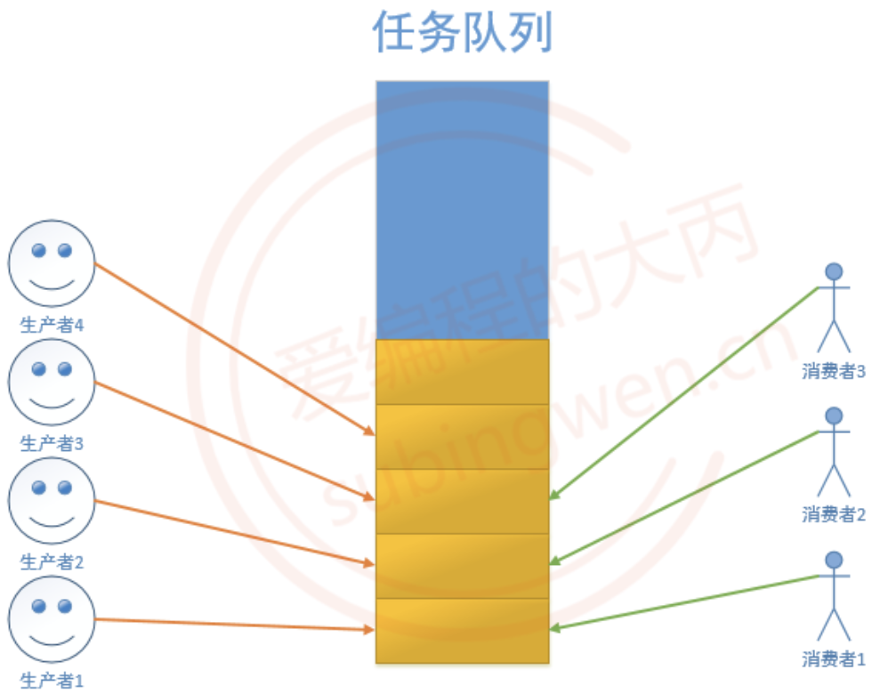

# 条件变量
## 条件变量函数
严格意义上来说，条件变量的主要作用不是处理线程同步, <span style="color:red">而是进行线程的阻塞</span>。如果在多线程程序中只使用条件变量无法实现线程的同步, 必须要配合互斥锁来使用。虽然条件变量和互斥锁都能阻塞线程，但是二者的效果是不一样的，二者的区别如下：

- 假设有A-Z 26个线程，这26个线程共同访问同一把互斥锁，如果线程A加锁成功，那么其余B-Z线程访问互斥锁都阻塞，所有的线程只能顺序访问临界区
- 条件变量只有在满足指定条件下才会阻塞线程，如果条件不满足，多个线程可以同时进入临界区，同时读写临界资源，这种情况下还是会出现共享资源中数据的混乱。

### 定义
一般情况下条件变量用于处理生产者和消费者模型，并且和互斥锁配合使用。条件变量类型对应的类型为`pthread_cond_t`，这样就可以定义一个条件变量类型的变量了：

```C++
pthread_cond_t cond;
```

被条件变量阻塞的线程的线程信息会被记录到这个变量中，以便在解除阻塞的时候使用。

### 初始化与释放
> 条件变量操作函数函数原型如下：

```C++
#include <pthread.h>
pthread_cond_t cond;
// 初始化
int pthread_cond_init(pthread_cond_t *restrict cond,
      const pthread_condattr_t *restrict attr);
// 销毁释放资源        
int pthread_cond_destroy(pthread_cond_t *cond);
```

**参数**:

- `cond`: 条件变量的地址

- `attr`: 条件变量属性, 一般使用默认属性, 指定为`NULL`

### 线程阻塞函数
#### pthread_cond_wait()

```C++
// 线程阻塞函数, 哪个线程调用这个函数, 哪个线程就会被阻塞
int pthread_cond_wait(pthread_cond_t *restrict cond, pthread_mutex_t *restrict mutex);
```

**参数**:

- `cond`: 条件变量

- `mutex`: 互斥锁(对应该线程相关的)

通过函数原型可以看出，该函数在阻塞线程的时候，需要一个`互斥锁`参数，这个互斥锁主要功能是进行线程同步，让线程顺序进入临界区，避免出现数共享资源的数据混乱。该函数会对这个互斥锁做以下几件事情：

1. 在阻塞线程时候，如果线程已经对互斥锁`mutex`上锁，那么会将这把锁打开，这样做是为了**避免死锁**
2. 当线程解除阻塞的时候，函数内部会帮助这个线程再次将这个`mutex`互斥锁锁上，继续向下访问临界区

#### pthread_cond_timedwait()
```C++
// 表示的时间是从1970.1.1到某个时间点的时间, 总长度使用秒/纳秒表示
struct timespec {
    time_t tv_sec;      /* Seconds */
    long   tv_nsec;     /* Nanoseconds [0 .. 999999999] */
};
// 将线程阻塞一定的时间长度, 时间到达之后, 线程就解除阻塞了
int pthread_cond_timedwait(pthread_cond_t *restrict cond,
           pthread_mutex_t *restrict mutex, const struct timespec *restrict abstime);
```

这个函数的前两个参数和`pthread_cond_wait`函数是一样的，第三个参数表示线程阻塞的时长，但是需要额外注意一点：`struct timespec`这个结构体中记录的时间是从`1970.1.1`到某个时间点的时间，总长度使用`秒/纳秒`表示。因此赋值方式相对要麻烦一点：

```C++
time_t mytim = time(NULL);    // 1970.1.1 0:0:0 到当前的总秒数
struct timespec tmsp;
tmsp.tv_nsec = 0;
tmsp.tv_sec = time(NULL) + 100;    // 线程阻塞100s
```

### 唤醒被阻塞的线程
#### pthread_cond_signal()
#### pthread_cond_broadcast()
```C++
// 唤醒阻塞在条件变量上的线程, 至少有一个被解除阻塞
int pthread_cond_signal(pthread_cond_t *cond);
// 唤醒阻塞在条件变量上的线程, 被阻塞的线程全部解除阻塞
int pthread_cond_broadcast(pthread_cond_t *cond);
```
调用上面两个函数中的任意一个，都可以换线被`pthread_cond_wait`或者`pthread_cond_timedwait`阻塞的线程，区别就在于`pthread_cond_signal`是唤醒**至少一个**被阻塞的线程（总个数不定），`pthread_cond_broadcast`是唤醒**所有**被阻塞的线程。

## 生产者和消费者
生产者和消费者模型的组成：

1. 生产者线程 -> 若干个
    - 生产商品或者任务放入到任务队列中
    - **任务队列满了就阻塞**, 不满的时候就工作
    - 通过一个生产者的条件变量控制生产者线程阻塞和非阻塞
2. 消费者线程 -> 若干个
    - 读任务队列, 将任务或者数据取出
    - 任务队列中有数据就消费，**没有数据就阻塞**
    - 通过一个消费者的条件变量控制消费者线程阻塞和非阻塞
3. 队列 -> 存储任务/数据，对应一块内存，为了读写访问可以通过一个数据结构维护这块内存
    - 可以是数组、链表，也可以使用stl容器：queue / stack / list / vector

| ##container## |
|:--:|
||

> 场景描述：使用条件变量实现生产者和消费者模型，生产者有5个，往链表头部添加节点，消费者也有5个，删除链表头部的节点。

```C++
#include <stdio.h>
#include <stdlib.h>
#include <unistd.h>
#include <pthread.h>

typedef struct _node
{
    int number;
    struct _node *next;
} Node;

// 定义互斥锁与条件变量
pthread_mutex_t mutrx;
pthread_cond_t cond;

// 定义一个头插链表
Node *head = NULL;

void *th_do_fun(void *arg)
{
    // 生产者
    while (1)
    {
        pthread_mutex_lock(&mutrx);
        Node *p = (Node *)malloc(sizeof(Node));
        p->number = rand() % 100;
        p->next = head;
        head = p;
        printf("[%ld]: do [%d] OK!\n", pthread_self(), head->number);
        pthread_mutex_unlock(&mutrx);
        pthread_cond_broadcast(&cond); // pthread_cond_signal(&cond); (也不是不行)
        sleep(rand() % 3);
    }

    return NULL;
}

void *th_fk_fun(void *arg)
{
    while (1)
    {
        pthread_mutex_lock(&mutrx);
        // if(head == NULL)   // 这样写有bug
/*
为什么在上面使用if 有bug:
    当任务队列为空, 所有的消费者线程都会被这个函数阻塞 pthread_cond_wait(&cond, &mutex);
    也就是阻塞在代码的第9行
    
    当生产者生产了1个节点, 调用 pthread_cond_broadcast(&cond); 唤醒了所有阻塞的线程
      - 有一个消费者线程通过 pthread_cond_wait()加锁成功, 其余没有加锁成功的线程继续阻塞
      - 加锁成功的线程向下运行, 并成功删除一个节点, 然后解锁
      - 没有加锁成功的线程解除阻塞继续抢这把锁, 另外一个子线程加锁成功
      - 但是这个线程删除链表节点的时候链表已经为空了, 后边访问这个空节点的时候就会出现段错误
    解决方案:
      - 需要循环的对链表是否为空进行判断, 需要将if 该成 while
*/
        while (!head)
        {
            // 条件变量: 阻塞线程 (因为没有了, 需要生产者生产!)
            printf("阻塞(len == 0)\n");
            // 任务队列, 也就是链表中已经没有节点可以消费了
            // 消费者线程需要阻塞
            // 线程加互斥锁成功, 但是线程阻塞在这行代码上, 锁还没解开
            // 其他线程在访问这把锁的时候也会阻塞, 生产者也会阻塞 ==> 死锁
            // 这函数会自动将线程拥有的锁解开
            pthread_cond_wait(&cond, &mutrx);
            // 当消费者线程解除阻塞之后, 会自动将这把锁锁上
            // 这时候当前这个线程又重新拥有了这把互斥锁
        }
        Node *p = head;
        head = head->next;
        printf("[%ld]: fk [%d] OK!\n", pthread_self(), p->number);
        free(p);
        pthread_mutex_unlock(&mutrx);
        sleep(rand() % 2);
    }

    return NULL;
}

int main()
{
    // 初始化
    pthread_mutex_init(&mutrx, NULL);
    pthread_cond_init(&cond, NULL);

    // 定义生产者(do)与消费者(fk)线程
    pthread_t do_arr[5], fk_arr[5];
    for (int i = 0; i < 5; ++i)
    {
        pthread_create(&do_arr[i], NULL, th_do_fun, NULL);
        printf("The do Man (%ld) Go !\n", do_arr[i]);
    }

    for (int i = 0; i < 5; ++i)
    {
        pthread_create(&fk_arr[i], NULL, th_fk_fun, NULL);
        printf("The fk Man (%ld) Go !\n", fk_arr[i]);
    }

    // 释放
    while (head)
    {
        Node *tmp = head;
        head = head->next;
        free(tmp);
    }

    for (int i = 0; i < 5; ++i)
    {
        pthread_join(do_arr[i], NULL);
        pthread_join(fk_arr[i], NULL);
    }

    pthread_mutex_destroy(&mutrx);
    pthread_cond_destroy(&cond);
    return 0;
}
```

注意: 以上代码只实现了消费者的阻塞(没有食物); 但没有实现生产者的阻塞(最大链表长度). 这样想要说明的是, **如果要再限制链表长度, 那么需要添加一个新的条件变量, 而不是继续使用原来的!**

## 参考链接

[爱编程的大丙-条件变量](https://subingwen.cn/linux/thread-sync/#1-1-%E4%B8%BA%E4%BB%80%E4%B9%88%E8%A6%81%E5%90%8C%E6%AD%A5)