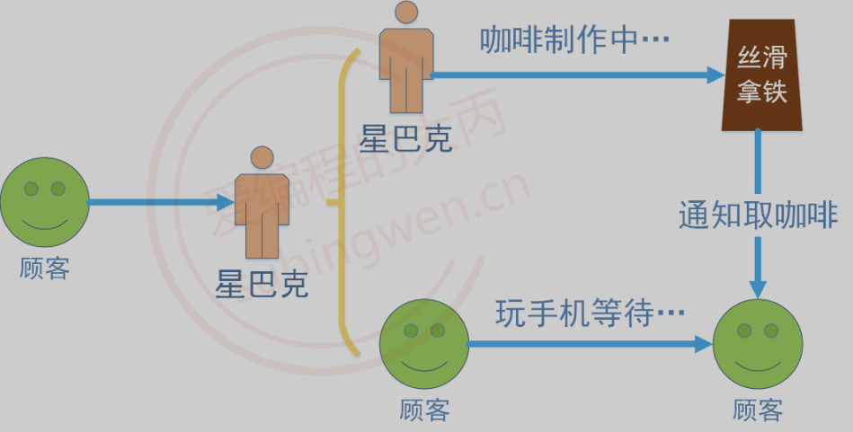

# 多线程异步操作
## std::future
`C++11`中增加的线程类，使得我们能够非常方便的创建和使用线程，但有时会有些不方便，比如需要获取线程返回的结果，就不能通过`join()`得到结果，只能通过一些额外手段获得，比如：定义一个全局变量，在子线程中赋值，在主线程中读这个变量的值，整个过程比较繁琐。C++提供的线程库中提供了一些类用于访问异步操作的结果。

那么，什么叫做异步呢？

| ##container## |
|:--:|
||

我们去星巴克买咖啡，因为都是现磨的，所以需要等待，但是我们付完账后不会站在柜台前死等，而是去找个座位坐下来玩玩手机打发一下时间，当店员把咖啡磨好之后，就会**通知**我们过去取，这就叫做**异步**。

- 顾客（主线程）发起一个任务（子线程磨咖啡），磨咖啡的过程中顾客去做别的事情了，有两条时间线（异步）
- 顾客（主线程）发起一个任务（子线程磨咖啡），磨咖啡的过程中顾客没去做别的事情而是死等，这时就只有一条时间线（同步），此时效率相对较低。

因此多线程程序中的任务大都是异步的，主线程和子线程分别执行不同的任务，如果想要在主线中得到某个子线程任务函数返回的结果可以使用`C++11`提供的`std:future`类，这个类需要和其他类或函数搭配使用，先来介绍一下这个类的API函数：

### 类的定义

通过类的定义可以得知，`future`是一个模板类，也就是这个类可以存储任意指定类型的数据。

```C++
// 定义于头文件 <future>
template< class T > class future;
template< class T > class future<T&>;
template<>          class future<void>;
```

### 构造函数

```C++
// ①
future() noexcept;
// ②
future( future&& other ) noexcept;
// ③
future( const future& other ) = delete;
```

- 构造函数①：默认无参构造函数
- 构造函数②：移动构造函数，转移资源的所有权
- 构造函数③：使用`=delete`显示删除拷贝构造函数, 不允许进行对象之间的拷贝

### 常用成员函数（public)
#### operator=
一般情况下使用`=`进行赋值操作就进行对象的拷贝，但是`future`对象不可用复制，因此会根据实际情况进行处理：

如果`other`是右值，那么转移资源的所有权
如果`other`是非右值，不允许进行对象之间的拷贝（该函数被显示删除禁止使用）

```C++
future& operator=( future&& other ) noexcept;
future& operator=( const future& other ) = delete;
```

#### get()

取出`future`对象内部保存的数据，其中`void get()`是为`future<void>`准备的，此时对象内部类型就是`void`，该函数是一个**阻塞函数**，当**子线程**的数据就绪后解除阻塞就能得到传出的数值了。

```C++
T get();
T& get();
void get();
```

#### wait()

因为`future`对象内部存储的是异步线程任务执行完毕后的结果，是在调用之后的将来得到的，因此可以通过调用`wait()`方法，阻塞当前线程，等待这个子线程的任务执行完毕，任务执行完毕当前线程的阻塞也就解除了。

```C++
void wait() const;
```

#### wait_for() 和 wait_until()

如果当前线程`wait()`方法就会死等，直到子线程任务执行完毕将返回值写入到future对象中，调用`wait_for()`只会让线程阻塞一定的时长，但是这样并不能保证对应的那个子线程中的任务已经执行完毕了。

`wait_until()`和`wait_for()`函数功能是差不多，前者是**阻塞到**某一指定的时间点，后者是阻塞一定的**时长**。

```C++
template< class Rep, class Period >
std::future_status wait_for( const std::chrono::duration<Rep,Period>& timeout_duration ) const;

template< class Clock, class Duration >
std::future_status wait_until( const std::chrono::time_point<Clock,Duration>& timeout_time ) const;
```

当`wait_until()`和`wait_for()`函数返回之后，并不能确定子线程当前的状态，因此我们需要判断函数的返回值，这样就能知道子线程当前的状态了：

|常量|解释|
|:-|:-|
|future_status::deferred|子线程中的任务函仍未启动|
|future_status::ready|子线程中的任务已经执行完毕，结果已就绪|
|future_status::timeout|子线程中的任务正在执行中，指定等待时长已用完|

## std::promise
`std::promise`是一个协助线程赋值的类，它能够将数据和`future`对象绑定起来，为获取线程函数中的某个值提供便利。
### 类成员函数
#### 类定义
通过`std::promise`类的定义可以得知，这也是一个模板类，我们要在线程中传递什么类型的数据，模板参数就指定为什么类型。

```C++
// 定义于头文件 <future>
template< class R > class promise;
template< class R > class promise<R&>;
template<>          class promise<void>;
```

#### 构造函数

```C++
// ①
promise();
// ②
promise( promise&& other ) noexcept;
// ③
promise( const promise& other ) = delete;
```
- 构造函数①：默认构造函数，得到一个空对象
- 构造函数②：移动构造函数
- 构造函数③：使用`=delete`显示删除拷贝构造函数, 不允许进行对象之间的拷贝
公共成员函数

#### get_future()
在`std::promise类`内部管理着一个`future`类对象，调用`get_future()`就可以得到这个`future`对象了

```C++
std::future<T> get_future();
```

#### set_value()
存储要传出的`value`值，并立即让状态就绪，这样数据被传出其它线程就可以得到这个数据了。重载的第四个函数是为`promise<void>`类型的对象准备的。

```C++
void set_value( const R& value );
void set_value( R&& value );
void set_value( R& value );
void set_value();
```

#### set_value_at_thread_exit()

存储要传出的`value`值，但是不立即令状态就绪。在当前线程退出时，子线程资源被销毁，再令状态就绪。

```C++
void set_value_at_thread_exit( const R& value );
void set_value_at_thread_exit( R&& value );
void set_value_at_thread_exit( R& value );
void set_value_at_thread_exit();
```

### promise的使用
通过promise传递数据的过程一共分为5步：

1. 在主线程中创建std::promise对象
2. 将这个std::promise对象通过引用的方式传递给子线程的任务函数
3. 在子线程任务函数中给std::promise对象赋值
4. 在主线程中通过std::promise对象取出绑定的future实例对象
5. 通过得到的future对象取出子线程任务函数中返回的值。

#### 子线程任务函数执行期间，让状态就绪

```C++
#include <iostream>
#include <thread>
#include <future>
using namespace std;

int main()
{
    promise<int> pr;
    thread t1([](promise<int> &p) {
        p.set_value(100);
        this_thread::sleep_for(chrono::seconds(3));
        cout << "睡醒了...." << endl;
    }, ref(pr));

    future<int> f = pr.get_future();
    int value = f.get();
    cout << "value: " << value << endl;

    t1.join();
    return 0;
}
```

输出:

```C++
value: 100
睡醒了....
```

示例程序的中子线程的任务函数指定的是一个匿名函数，在这个匿名的任务函数执行期间通过`p.set_value(100);`传出了数据并且激活了状态，数据就绪后，外部主线程中的`int value = f.get();`解除阻塞，并将得到的数据打印出来，5秒钟之后子线程休眠结束，匿名的任务函数执行完毕。

#### 子线程任务函数执行结束，让状态就绪

```C++
#include <iostream>
#include <thread>
#include <future>
using namespace std;

int main()
{
    promise<int> pr;
    thread t1([](promise<int> &p) {
        p.set_value_at_thread_exit(100);
        this_thread::sleep_for(chrono::seconds(3));
        cout << "睡醒了...." << endl;
    }, ref(pr));

    future<int> f = pr.get_future();
    int value = f.get();
    cout << "value: " << value << endl;

    t1.join();
    return 0;
}
```

输出:

```C++
睡醒了....
value: 100
```
在示例程序中，子线程的这个匿名的任务函数中通过`p.set_value_at_thread_exit(100);`在执行完毕并**退出之后**才会传出数据并激活状态，数据就绪后，外部主线程中的`int value = f.get();`解除阻塞，并将得到的数据打印出来，因此子线程在休眠5秒钟之后主线程中才能得到传出的数据。

另外，在这两个实例程序中有一个知识点需要强调，在外部主线程中创建的`promise`对象**必须要通过引用的方式传递到子线程的任务函数**中，<span style="color:red">在实例化子线程对象的时候，如果任务函数的参数是`引用类型`，那么实参一定要放到`std::ref()`函数中，表示要传递这个实参的引用到任务函数中。</span>

## std::packaged_task
`std::packaged_task`类包装了一个`可调用对象包装器`类对象（可调用对象包装器包装的是可调用对象，**可调用对象都可以作为函数来使用**），恶补一下: [可调用对象和可调用对象包装器](https://subingwen.cn/cpp/bind/#1-%E5%8F%AF%E8%B0%83%E7%94%A8%E5%AF%B9%E8%B1%A1)

这个类可以将内部包装的函数和`future`类绑定到一起，以便进行后续的异步调用，它和`std::promise`有点类似，`std::promise`内部保存一个共享状态的值，而`std::packaged_task`保存的是一个函数。

### 类成员函数
#### 类的定义

通过类的定义可以看到这也是一个模板类，模板类型和要在线程中传出的数据类型是一致的。

```C++
// 定义于头文件 <future>
template< class > class packaged_task;
template< class R, class ...Args >
class packaged_task<R(Args...)>;
```

#### 构造函数

```C++
// ①
packaged_task() noexcept;
// ②
template <class F>
explicit packaged_task( F&& f );
// ③
packaged_task( const packaged_task& ) = delete;
// ④
packaged_task( packaged_task&& rhs ) noexcept;
```

- 构造函数①：无参构造，构造一个无任务的空对象
- 构造函数②：通过一个可调用对象，构造一个任务对象
- 构造函数③：显示删除，不允许通过拷贝构造函数进行对象的拷贝
- 构造函数④：移动构造函数

#### 常用公共成员函数
##### get_future()
通过调用任务对象内部的`get_future()`方法就可以得到一个`future`对象，基于这个对象就可以得到传出的数据了。

```C++
std::future<R> get_future();
```

### packaged_task的使用
`packaged_task`其实就是对子线程要执行的任务函数进行了包装，和可调用对象包装器的使用方法相同，包装完毕之后直接将包装得到的任务对象传递给线程对象就可以了。

```C++
#include <iostream>
#include <thread>
#include <future>
using namespace std;

int main()
{
    packaged_task<int(int)> task([](int x) {
        return x += 100;
    });

    thread t1(ref(task), 100);

    future<int> f = task.get_future();
    int value = f.get();
    cout << "value: " << value << endl;

    t1.join();
    return 0;
}
```
在上面的示例代码中，通过`packaged_task`类包装了一个匿名函数作为子线程的任务函数，最终的得到的这个任务对象需要通过**引用**的方式传递到子线程内部，这样才能在主线程的最后通过任务对象得到`future`对象，再通过这个`future`对象取出子线程通过返回值传递出的数据。

## std::async
`std::async`函数比前面提到的`std::promise`和`packaged_task`更高级一些，因为通过这函数可以直接启动一个子线程并在这个子线程中执行对应的任务函数，异步任务执行完成返回的结果也是存储到一个`future`对象中，当需要获取异步任务的结果时，只需要调用`future`类的`get()`方法即可，如果不关注异步任务的结果，只是简单地等待任务完成的话，可以调用`future`类的`wait()`或者`wait_for()`方法。该函数的函数原型如下：

```C++
// 定义于头文件 <future>
// ①
template< class Function, class... Args>
std::future<std::result_of_t<std::decay_t<Function>(std::decay_t<Args>...)>>
    async( Function&& f, Args&&... args );

// ②
template< class Function, class... Args >
std::future<std::result_of_t<std::decay_t<Function>(std::decay_t<Args>...)>>
    async( std::launch policy, Function&& f, Args&&... args );
```

可以看到这是一个模板函数，在`C++11`中这个函数有两种调用方式：

- 函数①：直接调用传递到函数体内部的可调用对象，返回一个future对象
- 函数②：通过指定的策略调用传递到函数内部的可调用对象，返回一个future对象

**函数参数:**
- `f`：可调用对象，这个对象在子线程中被作为任务函数使用
- `Args`：传递给 `f` 的参数（实参）
- `policy`：可调用对象`f`的执行策略

|策略|说明|
|:-|:-|
|std::launch::async|调用`async`函数时创建新的线程执行任务函数|
|std::launch::deferred|调用`async`函数时不执行任务函数，直到调用了`future`的`get()`或者`wait()`时才执行任务（这种方式不会创建新的线程）|

关于`std::async()`函数的使用，对应的示例代码如下：

### 方式1
调用`async()`函数直接创建线程执行任务

```C++
#include <iostream>
#include <thread>
#include <future>
using namespace std;

int main()
{
    cout << "主线程ID: " << this_thread::get_id() << endl;
    // 调用函数直接创建线程执行任务
    future<int> f = async([](int x) {
        cout << "子线程ID: " << this_thread::get_id() << endl;
        this_thread::sleep_for(chrono::seconds(5));
        return x += 100;
    }, 100);

    future_status status;
    do {
        status = f.wait_for(chrono::seconds(1));
        if (status == future_status::deferred)
        {
            cout << "线程还没有执行..." << endl;
            f.wait();
        }
        else if (status == future_status::ready)
        {
            cout << "子线程返回值: " << f.get() << endl;
        }
        else if (status == future_status::timeout)
        {
            cout << "任务还未执行完毕, 继续等待..." << endl;
        }
    } while (status != future_status::ready);

    return 0;
}
```

输出:

```C++
主线程ID: 8904
子线程ID: 25036
任务还未执行完毕, 继续等待...
任务还未执行完毕, 继续等待...
任务还未执行完毕, 继续等待...
任务还未执行完毕, 继续等待...
任务还未执行完毕, 继续等待...
子线程返回值: 200
```

调用`async()`函数时不指定策略就是直接创建线程并执行任务，示例代码的主线程中做了如下操作`status = f.wait_for(chrono::seconds(1));`其实直接调用`f.get()`就能得到子线程的返回值。这里为了给大家演示`wait_for()`的使用，所以写的复杂了些。

### 方式2
调用`async()`函数不创建线程执行任务

```C++
#include <iostream>
#include <thread>
#include <future>
using namespace std;

int main()
{
    cout << "主线程ID: " << this_thread::get_id() << endl;
    // 调用函数直接创建线程执行任务
    future<int> f = async(launch::deferred, [](int x) {
        cout << "子线程ID: " << this_thread::get_id() << endl;
        return x += 100;
    }, 100);

    this_thread::sleep_for(chrono::seconds(5));
    cout << f.get();

    return 0;
}
```

输出:

```C++
主线程ID: 24760
/* 主线程开始休眠5秒... */
子线程ID: 24760
200
```

由于指定了`launch::deferred`策略，因此调用`async()`函数并不会创建新的线程执行任务，当使用`future`类对象调用了`get()`或者`wait()`方法后才开始执行任务（此处一定要注意调用`wait_for()`函数是不行的）。

通过测试程序输出的结果可以看到，两次输出的线程ID是相同的，任务函数是在主线程中被延迟（主线程休眠了5秒）调用了。

## 最终总结

1. 使用`async()`函数，是多线程操作中最简单的一种方式，不需要自己创建线程对象，并且可以得到子线程函数的返回值。
2. 使用`std::promise`类，在子线程中可以传出返回值也可以传出其他数据，并且可选择在什么时机将数据从子线程中传递出来，使用起来更灵活。
3. 使用`std::packaged_task`类，可以将子线程的任务函数进行包装，并且可以得到子线程的返回值。

~~我的评价: 还是自己在主线程传指针/引用参进去好了~~

## 注解
### [1]
本文学习: [爱编程的大丙-多线程异步操作](https://subingwen.cn/cpp/async/)