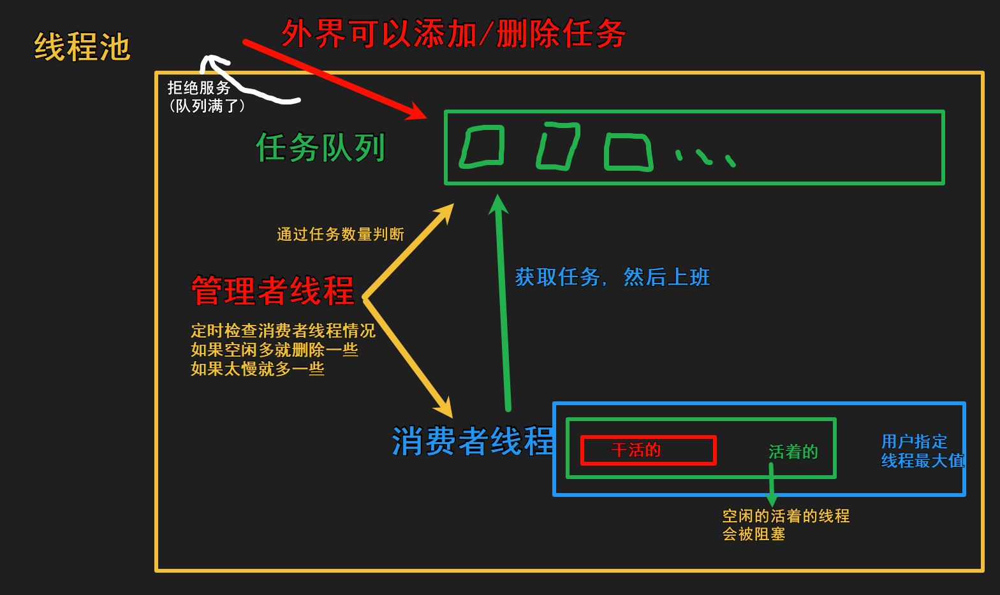

# 线程池原理
我们使用线程的时候就去创建一个线程，这样实现起来非常简便，但是就会有一个问题：如果并发的线程数量很多，并且每个线程都是执行一个时间很短的任务就结束了，这样频繁创建线程就会大大降低系统的效率，因为频繁创建线程和销毁线程需要时间。

那么有没有一种办法使得**线程可以复用，就是执行完一个任务，并不被销毁，而是可以继续执行其他的任务**呢？

线程池是一种多线程处理形式，处理过程中将任务添加到队列，然后在创建线程后自动启动这些任务。线程池线程都是后台线程。每个线程都使用默认的堆栈大小，以默认的优先级运行，并处于多线程单元中。如果某个线程在托管代码中空闲（如正在等待某个事件）,则线程池将插入另一个辅助线程来使所有处理器保持繁忙。如果所有线程池线程都始终保持繁忙，但队列中包含挂起的工作，则线程池将在一段时间后创建另一个辅助线程但线程的数目永远不会超过最大值。超过最大值的线程可以排队，但他们要等到其他线程完成后才启动。

在各个编程语言的语种中都有线程池的概念，并且很多语言中直接提供了线程池，作为程序猿直接使用就可以了，下面给大家介绍一下线程池的实现原理：

线程池的组成主要分为3个部分，这三部分配合工作就可以得到一个完整的线程池：

- 任务队列，存储需要处理的任务，由工作的线程来处理这些任务
    - 通过线程池提供的API函数，将一个待处理的任务添加到任务队列，或者从任务队列中删除
    - 已处理的任务会被从任务队列中删除
    - 线程池的使用者，也就是调用线程池函数往任务队列中添加任务的线程就是生产者线程
- 工作的线程（任务队列任务的消费者），N个
    - 线程池中维护了一定数量的工作线程, 他们的作用是是不停的读任务队列, 从里边取出任务并处理
    - 工作的线程相当于是任务队列的消费者角色，
    - 如果任务队列为空, 工作的线程将会被阻塞 (使用条件变量/信号量阻塞)
    - 如果阻塞之后有了新的任务, 由生产者将阻塞解除, 工作线程开始工作
- 管理者线程（不处理任务队列中的任务），1个
    - 它的任务是周期性的对任务队列中的任务数量以及处于忙状态的工作线程个数进行检测
    - 当任务过多的时候, 可以适当的创建一些新的工作线程
    - 当任务过少的时候, 可以适当的销毁一些工作的线程

| ##container## |
|:--:|
||
|注意, 任务队列满了不一定是拒绝服务, 也有可能阻塞等待任务队列|

