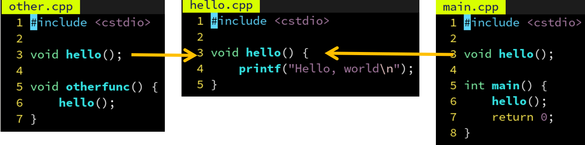
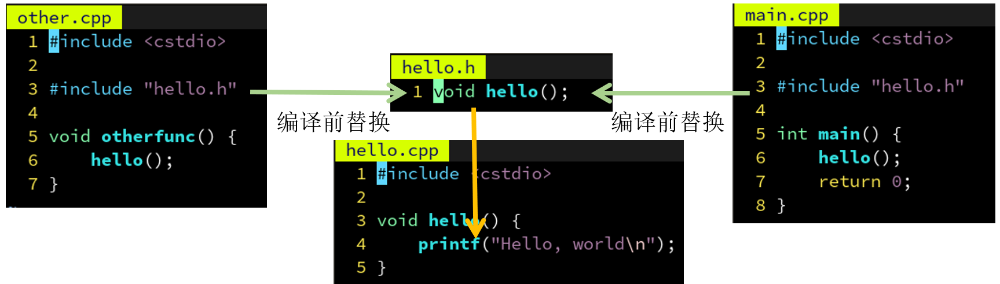
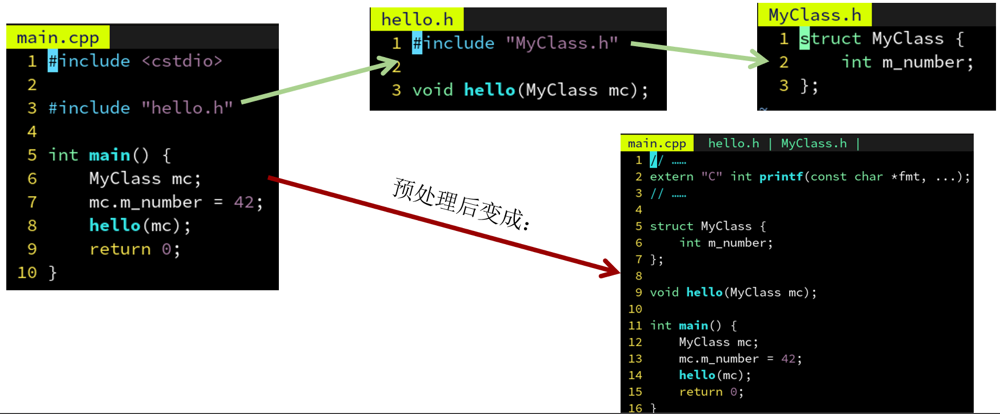
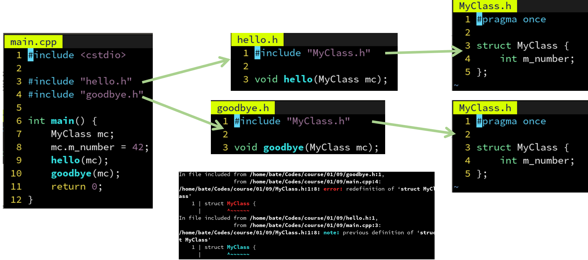
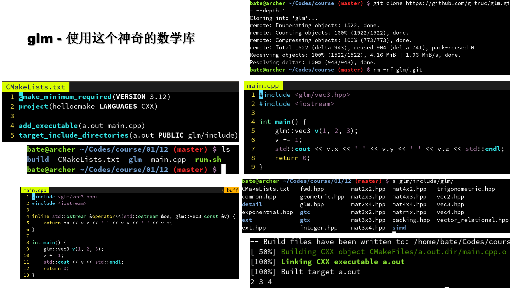
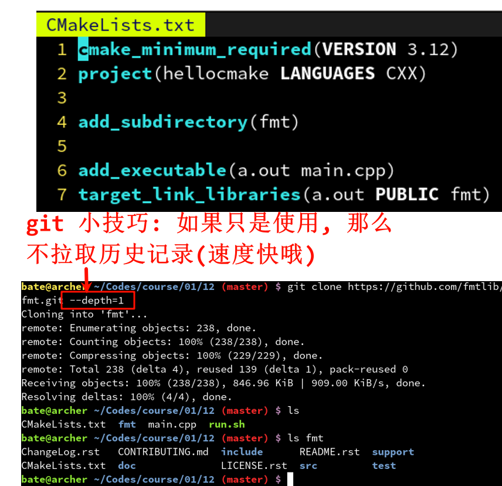
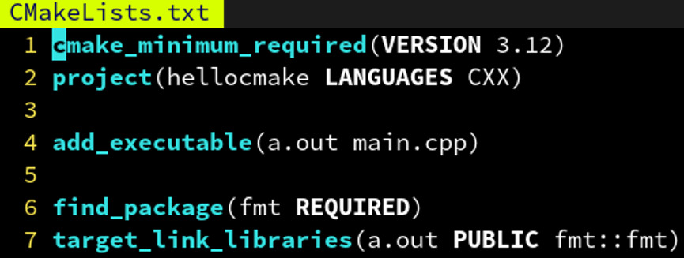

# 一、学C++从CMake学起
## 1.1 什么是编译器

> 编译器，是一个根据**源代码**生成**机器码**的程序。

|厂商|C|C++|Fortra|
|:-:|:-:|:-:|:-:|
GNU|gcc|g++|gfortr|
LLVM|clang|clang+|flang|

## 1.2 多文件编译与链接
单文件编译虽然方便，但也有如下缺点：
1. 所有的代码都堆在一起，不利于模块化和理解。
2. 工程变大时，编译时间变得很长，改动一个地方就得全部重新编译。

因此，我们提出多文件编译的概念，文件之间通过**符号声明**相互引用。

```sh
g++ -c hello.cpp -o hello.o
g++ -c main.cpp -o main.o
# 其中使用 -c 选项指定生成临时的对象文件 main.o，
# 之后再根据一系列对象文件进行链接，得到最终的a.out：
g++ hello.o main.o -o a.out
```

## 1.3 为什么需要构建系统 (Makefile)

文件越来越多时，一个个调用g++编译链接会变得很麻烦。

于是，发明了 make 这个程序，你只需写出不同文件之间的依赖关系，和生成各文件的规则。

```sh
make a.out
```

敲下这个命令，就可以构建出 a.out 这个可执行文件了。

和直接用一个脚本写出完整的构建过程相比，make 指明依赖关系的好处：

- 当更新了`hello.cpp`时只会重新编译`hello.o`，而不需要把`main.o`也重新编译一遍。
- 能够自动并行地发起对`hello.cpp`和`main.cpp`的编译，加快编译速度（make -j）。
- 用通配符批量生成构建规则，避免针对每个`.cpp`和`.o`重复写 g++ 命令（%.o: %.cpp）。

但坏处也很明显：
- make 在 Unix 类系统上是通用的，但在 Windows 则不然。
- 需要准确地指明每个项目之间的依赖关系，有头文件时特别头疼。
- make 的语法非常简单，不像 shell 或 python 可以做很多判断等。
- 不同的编译器有不同的 flag 规则，为 g++ 准备的参数可能对 MSVC 不适用。

```Makefile
a.out: hello.o main.o
    g++ hello.o main.o -o a.out

hello.o: hello.cpp
    g++ -c hello.cpp -o hello.o

main.o: main.cpp
    g++ -c main.cpp -o main.o
```

## 1.4 构建系统的构建系统 (CMake)

为了解决 make 的以上问题，跨平台的 CMake 应运而生！

- ~~make 在 Unix 类系统上是通用的，但在 Windows 则不然。~~
    - 只需要写一份 CMakeLists.txt，他就能够在调用时生成当前系统所支持的构建系统。

- ~~需要准确地指明每个项目之间的依赖关系，有头文件时特别头疼。~~
    - CMake 可以自动检测源文件和头文件之间的依赖关系，导出到 Makefile 里。

- ~~make 的语法非常简单，不像 shell 或 python 可以做很多判断等。~~
    - CMake 具有相对高级的语法，内置的函数能够处理 configure，install 等常见需求。

- ~~不同的编译器有不同的 flag 规则，为 g++ 准备的参数可能对 MSVC 不适用。~~
    - CMake 可以自动检测当前的编译器，需要添加哪些 flag。比如 OpenMP，只需要在 CMakeLists.txt 中指明 target_link_libraries(a.out OpenMP::OpenMP_CXX) 即可。


## 1.5 为什么需要库 (library)

| ##container## |
|:--:|
||

有时候我们会有多个可执行文件，他们之间用到的某些功能是相同的，我们想把这些共用的功能做成一个库，方便大家一起共享。

库中的函数可以被可执行文件调用，也可以被其他库文件调用。

库文件又分为静态库文件和动态库文件。

其中静态库相当于直接把代码插入到生成的可执行文件中，会导致体积变大，但是只需要一个文件即可运行。

而动态库则只在生成的可执行文件中生成“插桩”函数，当可执行文件被加载时会读取指定目录中的.dll文件，加载到内存中空闲的位置，并且替换相应的“插桩”指向的地址为加载后的地址，这个过程称为重定向。这样以后函数被调用就会跳转到动态加载的地址去。

```
Windows：可执行文件同目录，其次是环境变量%PATH%
Linux：ELF格式可执行文件的RPATH，其次是/usr/lib等
```

## 1.6 CMake 中的静态库与动态库

- [CMake制作静态/动态库](../../../004-CMake/005-C++静态库与动态库/002-CMake制作静态/001-动态库/index.md)

## 1.7 为什么 C++ 需要声明
在多文件编译章中，说到了需要在 main.cpp 声明 hello() 才能引用。为什么？

因为需要知道函数的参数和返回值类型：这样才能支持重载，隐式类型转换等特性。例如 show(3)，如果声明了 void show(float x)，那么编译器知道把 3 转换成 3.0f 才能调用。

让编译器知道 hello 这个名字是一个函数，不是一个变量或者类的名字：这样当我写下 hello() 的时候，他知道我是想调用 hello 这个函数，而不是创建一个叫 hello 的类的对象。

其实，C++ 是一种强烈依赖上下文信息的编程语言，举个例子：
```cpp
vector < MyClass > a;   // 声明一个由 MyClass 组成的数组
```
如果编译器不知道 vector 是个模板类，那他完全可以把 vector 看做一个变量名，把 < 解释为小于号，从而理解成判断‘vector’这个变量的值是否小于‘MyClass’这个变量的值。

正因如此，我们常常可以在 C++ 代码中看见这样的写法：
```cpp
typename decay<T>::type
```
因为 T 是不确定的，导致编译器无法确定`decay<T>`的 type 是一个类型，还是一个值。因此用 typename 修饰来让编译器确信这是一个类型名...

## 1.8 为什么需要头文件
- 为了使用 hello 这个函数，我们刚才在 main.cpp 里声明了 void hello() 。
- 但是如果另一个文件 other.cpp 也需要用 hello 这个函数呢？也在里面声明一遍？
- 如果能够只写一遍，然后自动插入到需要用 hello 的那些 .cpp 里就好了

| ##container## |
|:--:|
||

## 1.9 头文件 - 批量插入几行代码的硬核方式

没错，C 语言的前辈们也想到了，他们说，既然每个 .cpp 文件的这个部分是一模一样的，不如我把 hello() 的声明放到单独一个文件 hello.h 里，然后在需要用到 hello() 这个声明的地方，打上一个记号，#include “hello.h” 。然后用一个小程序，自动在编译前把引号内的文件名 hello.h 的内容插入到记号所在的位置，这样不就只用编辑 hello.h 一次了嘛~

> 后来，这个编译前替换的步骤逐渐变成编译器的了一部分，称为**预处理阶段**，`#define`定义的宏也是这个阶段处理的。
>
> 此外，在实现的文件 hello.cpp 中导入声明的文件 hello.h 是个好习惯，可以保证当 hello.cpp 被修改时，比如改成 hello(int)，编译器能够发现 hello.h 声明的 hello() 和定义的 hello(int) 不一样，避免“沉默的错误”。

实际上`cstdio`也无非是提供了`printf`等一系列函数声明的头文件而已，实际的实现是在`libc.so`这个动态库里。

- 其中`<cstdio>`这种形式表示**不要**在当前目录下搜索，**只在系统目录里搜索**，

- `"hello.h"`这种形式则**优先搜索当前目录**下有没有这个文件，找不到**再搜索系统目录**。

| ##container## |
|:--:|
||

## 1.10 头文件进阶 - 递归地使用头文件

在 C++ 中常常用到很多的类，和函数一样，类的声明也会被放到头文件中。

有时候我们的函数声明需要使用到某些类，就需要用到声明了该类的头文件，像这样递归地`#include`即可:

| ##container## |
|:--:|
||

## 1.11 头文件进阶 - 小心菱形include

但是这样造成一个问题，就是如果多个头文件都引用了 MyClass.h，那么 MyClass 会被重复定义两遍:

| ##container## |
|:--:|
||

解决方案: 在头文件前面加上一行: `#pragma once`

这样当预处理器第二次读到同一个文件时，就会自动跳过

通常头文件都不想被重复导入，因此建议在每个头文件前加上这句话

(这个是一个非常保险的头文件模版)
```C++
#pragma once
#ifndef _HX_FILE_NAME_H_
#define _HX_FILE_NAME_H_

#endif // !_HX_FILE_NAME_H_
```

## 1.12 CMake 中的子模块

- [嵌套的CMake](../../../004-CMake/009-嵌套的CMake/index.md)

## 1.13 子模块的头文件如何处理
因为 hello.h 被移到了 hellolib 子文件夹里，因此 main.cpp 里也要改成:

```C++
#include <cstdio>

#include "hellolib/hello.h"

int main() {
    hello();
    return 0;
}
```

如果要避免修改代码，我们可以通过`target_include_directories`指定

a.out 的头文件搜索目录: (其中第一个 hellolib 是库名，第二个是目录)

```cmake
cmake_minimum_required(VERSION 3.12)
project(hellocmake LANGUAGES CXX)

add_subdirectory(hellolib)

add_executable(a.out main.cpp)
target_link_libraries(a.out PUBLIC hellolib)
```

这样甚至可以用`<hello.h>`来引用这个头文件了，因为通过`target_include_directories`指定的路径会被视为与系统路径等价.

但是这样如果另一个 b.out 也需要用 hellolib 这个库，难道也得再指定一遍搜索路径吗？

不需要，其实我们只需要定义 hellolib 的头文件搜索路径，引用他的可执行文件 CMake 会自动添加这个路径:

```cmake
# ./hellolib/CMakeLists.txt
add_library(hellolib STATIC hello.cpp)
target_include_directories(hellolib PUBLIC .)
```

这里用了`.`表示当前路径，因为子目录里的路径是相对路径，类似还有`..`表示上一层目录。

此外，如果不希望让引用 hellolib 的可执行文件自动添加这个路径，把`PUBLIC`改成`PRIVATE`即可。这就是他们的用途: 决定一个属性要不要在被`link`的时候传播。

```cmake
# 除了头文件搜索目录以外，还有这些选项，PUBLIC 和 PRIVATE 对他们同理:
target_include_directories(myapp PUBLIC /usr/include/eigen3) # 添加头文件搜索目录
target_link_libraries(myapp PUBLIC hellolib)                 # 添加要链接的库
target_add_definitions(myapp PUBLIC MY_MACRO=1)              # 添加一个宏定义
target_add_definitions(myapp PUBLIC -DMY_MACRO=1)            # 与 MY_MACRO=1 等价
target_compile_options(myapp PUBLIC -fopenmp                 # 添加编译器命令行选项
target_sources(myapp PUBLIC hello.cpp other.cpp)             # 添加要编译的源文件

# 以及可以通过下列指令（不推荐使用），把选项加到所有接下来的目标去:
include_directories(/opt/cuda/include) # 添加头文件搜索目录
link_directories(/opt/cuda)            # 添加库文件的搜索路径
add_definitions(MY_MACRO=1)            # 添加一个宏定义
add_compile_options(-fopenmp)          # 添加编译器命令行选项
```

## 1.14 第三方库 - 作为纯头文件引入

有时候我们不满足于 C++ 标准库的功能，难免会用到一些第三方库。

最友好的一类库莫过于纯头文件库了，这里是一些好用的 header-only 库：

- `nothings/stb`- 大名鼎鼎的 stb_image 系列，涵盖图像，声音，字体等，只需单头文件！
- `Neargye/magic_enum`- 枚举类型的反射，如枚举转字符串等（实现方式很巧妙）
- `g-truc/glm`- 模仿 GLSL 语法的数学矢量/矩阵库（附带一些常用函数，随机数生成等）
- `Tencent/rapidjson`- 单纯的 JSON 库，甚至没依赖 STL（可定制性高，工程美学经典）
- `ericniebler/range-v3`- C++20 ranges 库就是受到他启发（完全是头文件组成）
- `fmtlib/fmt`- 格式化库，提供 std::format 的替代品（需要 -DFMT_HEADER_ONLY）
- `gabime/spdlog`- 能适配控制台，安卓等多后端的日志库（和 fmt 冲突！）

只需要把他们的 include 目录或头文件下载下来，然后`include_directories(spdlog/include)`即可。

- 缺点: 函数直接实现在头文件里，没有提前编译，从而需要重复编译同样内容，**编译时间长**。

示例:

| ##container## |
|:--:|
||

## 1.15 第三方库 - 作为子模块引入
第二友好的方式则是作为 CMake 子模块引入，也就是通过`add_subdirectory`。

方法就是把那个项目（以fmt为例）的源码放到你工程的根目录：

| ##container## |
|:--:|
||

这些库能够很好地支持作为子模块引入：
- `fmtlib/fmt`- 格式化库，提供 std::format 的替代品
- `gabime/spdlog`- 能适配控制台，安卓等多后端的日志库
- `ericniebler/range-v3`- C++20 ranges 库就是受到他启发
- `g-truc/glm`- 模仿 GLSL 语法的数学矢量/矩阵库
- `abseil/abseil-cpp`- 旨在补充标准库没有的常用功能
- `bombela/backward-cpp`- 实现了 C++ 的堆栈回溯便于调试
- `google/googletest`- 谷歌单元测试框架
- `google/benchmark`- 谷歌性能评估框架
- `glfw/glfw`- OpenGL 窗口和上下文管理
- `libigl/libigl`- 各种图形学算法大合集

## 1.16 CMake - 引用系统中预安装的第三方库
- 可以通过 find_package 命令寻找系统中的包/库:
    - find_package(fmt REQUIRED)
    - target_link_libraries(myexec PUBLIC fmt::fmt)

| ##container## |
|:--:|
||

- 为什么是`fmt::fmt`而不是简单的 fmt？
- 现代 CMake 认为一个**包 (package)** 可以提供多个库，又称**组件 (components)**，比如 TBB 这个包，就包含了 tbb, tbbmalloc, tbbmalloc_proxy 这三个组件。
- 因此为避免冲突，每个包都享有一个独立的名字空间，以`::`的分割（和 C++ 还挺像的）。
- 你可以指定要用哪几个组件：
    - find_package(TBB REQUIRED COMPONENTS tbb tbbmalloc REQUIRED)
    - target_link_libraries(myexec PUBLIC TBB::tbb TBB::tbbmalloc)

## 1.17 第三方库 - 常用 package 列表
- fmt::fmt
- spdlog::spdlog
- range-v3::range-v3
- TBB::tbb
- OpenVDB::openvdb
- Boost::iostreams
- Eigen3::Eigen
- OpenMP::OpenMP_CXX

不同的包之间常常有着依赖关系，而包管理器的作者为`find_package`编写的脚本（例如`/usr/lib/cmake/TBB/TBBConfig.cmake`）能够自动查找所有依赖，并利用刚刚提到的`PUBLIC`/`PRIVATE`正确处理依赖项，比如如果你引用了`OpenVDB::openvdb`那么`TBB::tbb`也会被自动引用。

其他包的引用格式和文档参考: https://cmake.org/cmake/help/latest/module/FindBLAS.html

## 1.18 安装第三方库 - 包管理器
Linux 可以用系统自带的包管理器（如 apt）安装 C++ 包。

```sh
pacman -S fmt
```

Windows 则没有自带的包管理器。因此可以用跨平台的 vcpkg: https://github.com/microsoft/vcpkg

使用方法: 下载 vcpkg 的源码，放到你的项目根目录，像这样:

```cmd
cd vcpkg
.\bootstrap-vcpkg.bat
.\vcpkg integrate install
.\vcpkg install fmt:x64-windows
cd ..
cmake -B build -DCMAKE_TOOLCHAIN_FILE="%CD%/vcpkg/scripts/buildsystems/vcpkg.cmake"
```
