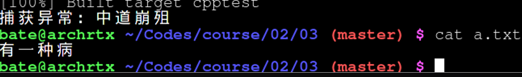
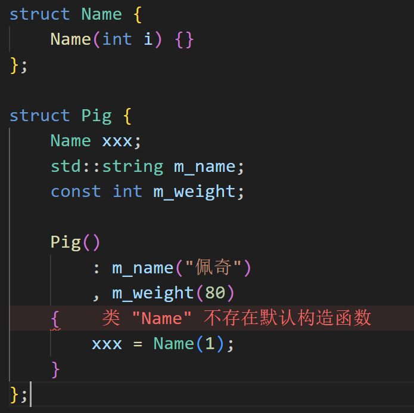
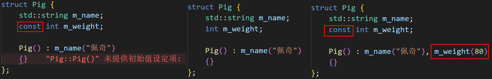
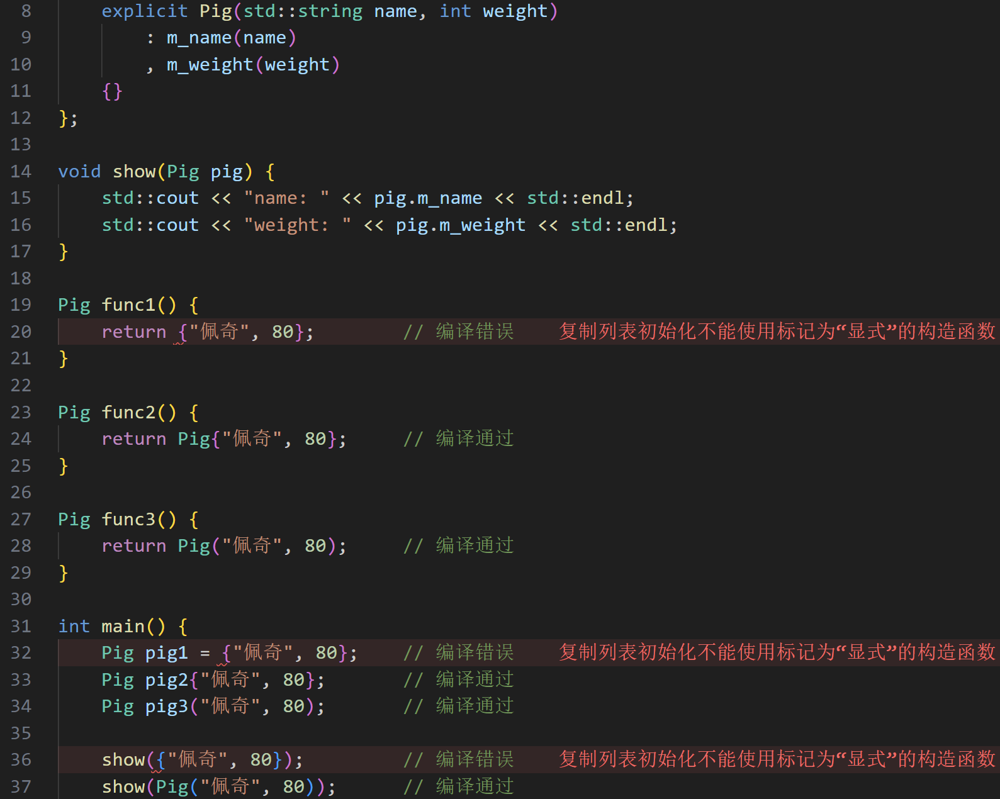
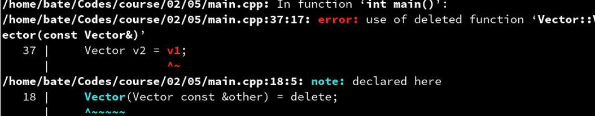
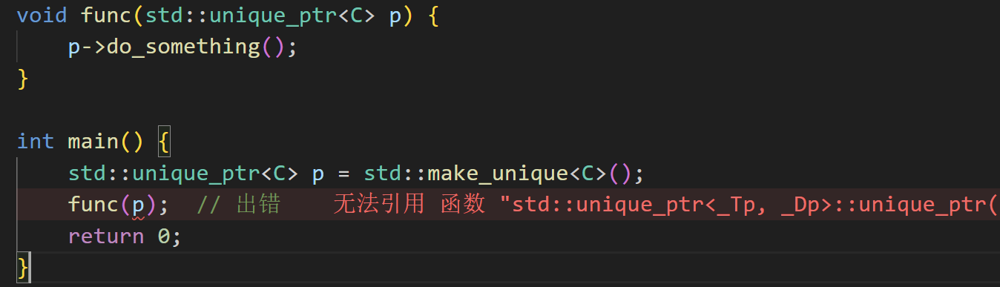
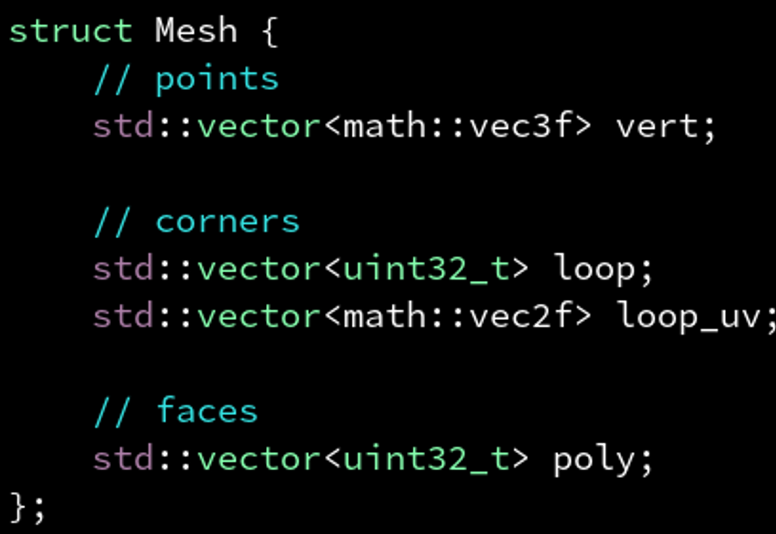
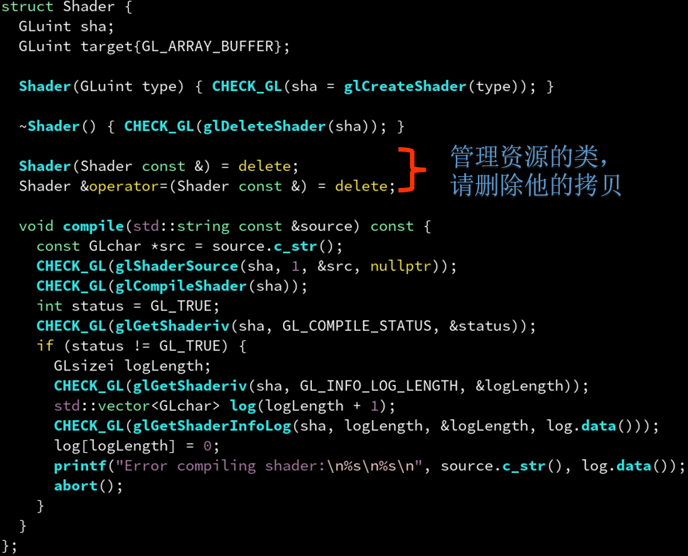

# 二、RAII与智能指针

(2021-12-18 の教程了, 时间应该推移一下, C++23才是未来了)

## 2.1 从一个案例看 C++ 的历史
求一个列表中所有数的和:

```py
a =  [1, 1, 4, 5, 1, 4]
print(sum(a))
```

### 2.1.1 古代: C语言

```C
#include <stdlib.h>
#include <stdio.h>

int main() {
    size_t nv = 4;
    int *v = (int *)malloc(nv * sizeof(int));
    v[0] = 4;
    v[1] = 3;
    v[2] = 2;
    v[3] = 1;

    int sum = 0;
    for (size_t i = 0; i < nv; i++) {
        sum += v[i];
    }

    printf("%d\n", sum);

    free(v);
    return 0;
}
```

### 2.1.2 近代: C++98 

- 引入 STL 容器库

```C++
#include <vector>
#include <iostream>

int main() {
    std::vector<int> v(4);
    v[0] = 4;
    v[1] = 3;
    v[2] = 2;
    v[3] = 1;

    int sum = 0;
    for (size_t i = 0; i < v.size(); i++) {
        sum += v[i];
    }

    std::cout << sum << std::endl;
    return 0;
}
```

### 2.1.3 近现代: C++11

- 引入了 {} 初始化表达式

```C++
#include <vector>
#include <iostream>

int main() {
    std::vector<int> v = {4, 3, 2, 1};

    int sum = 0;
    for (size_t i = 0; i < v.size(); i++) {
        sum += v[i];
    }

    std::cout << sum << std::endl;
    return 0;
}
```

- 引入了 range-based for-loop

```C++
#include <vector>
#include <iostream>

int main() {
    std::vector<int> v = {4, 3, 2, 1};

    int sum = 0;
    for (int vi: v) {
        sum += vi;
    }

    std::cout << sum << std::endl;
    return 0;
}
```

如果想使用`for_each`这个算法模板呢?

```C++
#include <vector>
#include <iostream>
#include <algorithm>

int sum = 0;

void func(int vi) {
    sum += vi;
}

int main() {
    std::vector<int> v = {4, 3, 2, 1};

    std::for_each(v.begin(), v.end(), func);

    std::cout << sum << std::endl;
    return 0;
}
```

- 引入了 lambda 表达式

```C++
#include <vector>
#include <iostream>
#include <algorithm>

int main() {
    std::vector<int> v = {4, 3, 2, 1};

    int sum = 0;
    std::for_each(v.begin(), v.end(), [&] (auto vi) {
        sum += vi;
    });

    std::cout << sum << std::endl;
    return 0;
}
```

### 2.1.4 现代: C++14

- lambda 允许用 auto 自动推断类型

```C++
#include <vector>
#include <iostream>
#include <algorithm>

int main() {
    std::vector v = {4, 3, 2, 1};

    int sum = 0;
    std::for_each(v.begin(), v.end(), [&] (auto vi) {
        sum += vi;
    });

    std::cout << sum << std::endl;
    return 0;
}
```

### 2.1.5 当代：C++17

- CTAD / compile-time argument deduction / 编译期参数推断

```C++
#include <vector>
#include <iostream>
#include <numeric>

int main() {
    std::vector v = {4, 3, 2, 1};

    int sum = std::reduce(v.begin(), v.end(), 0, [] (int x, int y) {
        return x + y;
    });

    std::cout << sum << std::endl;
    return 0;
}
```

- 引入常用数值算法

```C++
#include <vector>
#include <iostream>
#include <numeric>

int main() {
    std::vector v = {4, 3, 2, 1};

    int sum = std::reduce(v.begin(), v.end());
    // int sum = std::reduce(v.begin(), v.end(), 0, std::plus{});

    std::cout << sum << std::endl;
    return 0;
}
```

### 2.1.6 未来: C++20

- 引入区间 (ranges)

更多请了解: https://zhuanlan.zhihu.com/p/350136757

```C++
#include <vector>
#include <iostream>
#include <numeric>
#include <ranges>
#include <cmath>

int main() {
    std::vector v = {4, 3, 2, 1, 0, -1, -2};

    for (auto &&vi: v
         | std::views::filter([] (auto &&x) { return x >= 0; })
         | std::views::transform([] (auto &&x) { return sqrtf(x); })
         ) {
        std::cout << vi << std::endl;
    }

    return 0;
}
```

- C++20 引入模块（module）

```C++
import <vector>;
import <iostream>;
import <numeric>;
import <ranges>;
import <cmath>;

int main() {
    std::vector v = {4, 3, 2, 1, 0, -1, -2};

    for (auto &&vi: v
         | std::views::filter([] (auto &&x) { return x >= 0; })
         | std::views::transform([] (auto &&x) { return sqrtf(x); })
         ) {
        std::cout << vi << std::endl;
    }

    return 0;
}
```

- 允许函数参数为自动推断 (auto)

```C++
import <vector>;
import <iostream>;
import <numeric>;
import <ranges>;
import <cmath>;

void myfunc(auto &&v) {
    for (auto &&vi: v
         | std::views::filter([] (auto &&x) { return x >= 0; })
         | std::views::transform([] (auto &&x) { return sqrtf(x); })
         ) {
        std::cout << vi << std::endl;
    }
}

int main() {
    std::vector v = {4, 3, 2, 1, 0, -1, -2};
    myfunc(v);
    return 0;
}
```

- 引入协程 (coroutine) 和生成器 (generator)

```C++
import <vector>;
import <iostream>;
import <numeric>;
import <ranges>;
import <cmath>;
import <generator>;

std::generator<int> myfunc(auto &&v) {
    for (auto &&vi: v
         | std::views::filter([] (auto &&x) { return x >= 0; })
         | std::views::transform([] (auto &&x) { return sqrtf(x); })
         ) {
        co_yield vi;
    }
}

int main() {
    std::vector v = {4, 3, 2, 1, 0, -1, -2};
    for (auto &&vi: myfunc(v)) {
        std::cout << vi << std::endl;
    }
    return 0;
}
```

- C++20 标准库加入 format 支持

```C++
import <vector>;
import <iostream>;
import <numeric>;
import <ranges>;
import <cmath>;
import <generator>;
import <format>;

std::generator<int> myfunc(auto &&v) {
    for (auto &&vi: v
         | std::views::filter([] (auto &&x) { return x >= 0; })
         | std::views::transform([] (auto &&x) { return sqrtf(x); })
         ) {
        co_yield vi;
    }
}

int main() {
    std::vector v = {4, 3, 2, 1, 0, -1, -2};
    for (auto &&vi: myfunc(v)) {
        std::format_to(std::cout, "number is {}\n", vi);
    }
    return 0;
}
```

## 2.2 C++有哪些面向对象思想?
### 2.2.1 C++思想: 封装

将多个逻辑上相关的变量包装成一个类

> 比如要表达一个数组，需要: 起始地址指针v，数组大小nv
>
> 因此 C++ 的 vector 将他俩打包起来，避免程序员犯错
>
>```C++
>// C
>size_t nv = 4;
>int *v = (int *)malloc(nv * sizeof(int));
>
>// C++
>vector<int> v(4);
>```

#### 2.2.1.1 封装: 不变性

常遇到: 当需要修改一个成员时，其他也成员需要被修改，否则出错
- 这种情况出现时，就意味着你需要把成员变量的读写封装为成员函数

> 比如当我要设置数组大小为 4 时，不能只`nv = 4`
> 
> 还要重新分配数组内存，从而修改数组起始地址`v`
> 
> ```C++
> // C
> nv = 4;
> int *v = (int *)realloc(nv * sizeof(int));
> 
> // C++
> v.resize(4);
> ```

#### 2.2.1.2 不变性: 请勿滥用封装
仅当出现<span style="color:red">“修改一个成员时，其他也成员要被修改，否则出错”</span>的现象时，才需要`getter/setter`封装。

各个成员之间相互正交，比如数学矢量类 Vec3，就没必要去搞封装，只会让程序员变得痛苦，同时还有一定**性能损失**: 特别是如果`getter/setter`函数分离了声明和定义，实现在另一个文件时！

```C++
struct Vec3 { // good
    float x, y, z;
}

class Vec3 {  // bad
private:
    float x, y, z;
public:
    float getX() const { return x; }
    void setX(folat _x) { x = _x; }
    // ...
}
```

### 2.2.2 C++思想: RAII (Resource Acquisition Is Initialization)
资源获取视为初始化，反之，资源释放视为销毁

C++ 除了用于初始化的**构造函数 (constructor)**,还包括了用于销毁的**解构(析构)函数 (destructor)**

```C++
// C
{
    size_t nv = 4;
    int *v = (int *)malloc(nv * sizeof(int));
    // ...
    free(v); // 需要手动释放
    v = NULL
}
// C++
{
    vector<int> v(4);
    // ...
}   // 不用手动释放, 离开作用域{}自动释放(析构)
```

如果没有解构函数，则每个带有返回的分支都要手动释放所有之前的资源:
```C++
#include <fstream>
#include <vector>
#include <cstdio>

int main() {
    std::ifstream f1("1.txt");
    if (checkFileContent(f1)) {
        printf("bad file 1!\n");
        f1.close();
        return 1;
    }

    std::ifstream f2("2.txt");
    if (checkFileContent(f2)) {
        printf("bad file 2!\n");
        f1.close();
        f2.close();
        return 1;
    }

    std::vector<std::ifstream> files;
    files.push_back(std::ifstream("3.txt"));
    files.push_back(std::ifstream("4.txt"));
    files.push_back(std::ifstream("5.txt"));

    for (auto &file: files)
        file.close();

    f1.close();
    f2.close();
    return 0;
}

```

与 Java，Python 等垃圾回收语言不同，C++ 的解构函数是显式的，离开作用域自动销毁，毫不含糊（有好处也有坏处，对高性能计算而言利大于弊）

```C++
#include <fstream>
#include <vector>
#include <cstdio>

int main() {
    std::ifstream f1("1.txt");
    if (checkFileContent(f1)) {
        printf("bad file 1!\n");
        return 1;   // 自动释放 f1
    }

    std::ifstream f2("2.txt");
    if (checkFileContent(f2)) {
        printf("bad file 2!\n");
        return 1;   // 自动释放 f1, f2
    }

    vector<std::ifstream> files;
    files.push_back(std::ifstream("3.txt"));
    files.push_back(std::ifstream("4.txt"));
    files.push_back(std::ifstream("5.txt"));

    // files.clear();  // 提前释放 files（如果需要）

    return 0;   // 自动释放 f1, f2, files
}

```

#### 2.2.2.1 RAII: 异常安全 (exception-safe)
C++ 标准保证**当异常发生时**，**会调用已创建对象的解构函数**。

因此 C++ 中没有（也不需要）`finally`语句。

```java
Connection c = driver.getConnection();
try {
    ...
} catch (SQLException e) {
    ...
} finally {
    c.close();
}
```

如果此处不关闭，则可等待稍后垃圾回收时关闭。

虽然最后还是关了，但如果对时序有要求或对性能有要求就不能依靠 GC。

比如`mutex`忘记`unlock`造成死锁等等...

```C++
#include <fstream>
#include <iostream>
#include <stdexcept>

void test() {
    std::ofstream fout("a.txt");
    fout << "有一种病\n";
    throw std::runtime_error("中道崩殂");
    fout << "叫 JavaBean\n";
}

int main() {
    try {
        test();
    } catch (std::exception const &e) {
        std::cout << "捕获异常：" << e.what() << std::endl;
    }
    return 0;
}
```

可以看到是执行了析构的: (不然不会写入文件)

| ##container## |
|:--:|
||

## 2.3 RAII: 离不开构造函数
如题，那么如何定义构造函数呢?

### 2.3.1 自定义构造函数: 无参数

```C++
#include <iostream>
#include <string>

struct Pig {
    std::string m_name;
    int m_weight;

    Pig() {
        m_name = "佩奇";
        m_weight = 80;
    }
};

int main() {
    Pig pig;

    std::cout << "name: " << pig.m_name << std::endl;
    std::cout << "weight: " << pig.m_weight << std::endl;

    return 0;
}
```

### 2.3.2 自定义构造函数: 无参数(使用初始化表达式)
为什么需要初始化表达式？
1. 假如类成员为 const 和引用
2. 假如类成员没有无参构造函数
3. 避免重复初始化，更高效
    - 平常在构造函数体里面进行的初始化, 实际上是在初始化后再初始化了, 即编译器先对成员使用无参构造初始化了, 你再进行赋值的初始化.

| ##container## |
|:--:|
||


```C++
struct Pig {
    std::string m_name;
    int m_weight;

    Pig() : m_name("佩奇"), m_weight(80)
    {}
};
```

| ##container## |
|:--:|
||

### 2.3.3 自定义构造函数: 多个参数

```C++
struct Pig {
    std::string m_name;
    int m_weight;

    Pig(std::string name, int weight) : m_name(name), m_weight(weight)
    {}
};
```

### 2.3.4 自定义构造函数: 单个参数

```C++
struct Pig {
    std::string m_name;
    int m_weight;

    Pig(int weight)
        : m_name("一只重达" + std::to_string(weight) + "kg的猪")
        , m_weight(weight)
    {}
};
```

### 2.3.5 自定义构造函数：单个参数 (避免陷阱)

```C++
struct Pig {
    std::string m_name;
    int m_weight;

    explicit Pig(int weight)
        : m_name("一只重达" + std::to_string(weight) + "kg的猪")
        , m_weight(weight)
    {}
};

void show(Pig pig) {
    std::cout << "name: " << pig.m_name << std::endl;
    std::cout << "weight: " << pig.m_weight << std::endl;
}

int main() {
    // Pig pig = 80;  // 编译错误
    Pig pig(80);      // 编译通过

    // show(80);    // 编译错误
    show(Pig(80));  // 编译通过
  
    std::cout << "name: " << pig.m_name << std::endl;
    std::cout << "weight: " << pig.m_weight << std::endl;

    return 0;
}
```

- 避免陷阱体现在哪里?
  - 加了`explicit`表示必须用`()`强制转换。
  - 否则`show(80)`也能编译通过！
  - 所以，如果你不希望这种隐式转换，
  - 请给单参数的构造函数加上`explicit`。
  - 比如`std::vector`的构造函数`vector(size_t n)`也是`explicit`的。

**explicit 对多个参数也起作用!!!**

| ##container## |
|:--:|
||

- 多个参数时，`explicit`的作用体现在禁止从一个`{}`表达式初始化。
- 如果你希望在一个返回`Pig`的函数里用:
```Cpp
return {“佩奇”, 80};
```
- 的话，就不要加`explicit`。
- 顺便一提，上一个例子中`show(80)`和`show({80})`等价。

### 2.3.6 使用 {} 和 () 调用构造函数，有什么区别?
- `int(3.14f)`不会出错，但是`int{3.14f}`会出错，因为`{}`是**非强制**转换。

- `Pig(“佩奇”, 3.14f)`不会出错，但是`Pig{“佩奇”, 3.14f}`会出错，原因同上，更安全。

- 可读性: `Pig(1, 2)`则`Pig`有可能是个函数，`Pig{1, 2}`看起来更明确。

其实谷歌在其`Code Style`中也明确提出别再通过`()`调用构造函数，需要类型转换时应该用:

- `static_cast<int>(3.14f)`而不是`int(3.14f)`
- `reinterpret_cast<void *>(0xb8000)`而不是`(void *)0xb8000`

更加明确用的哪一种类型转换（cast），从而避免一些像是`static_cast<int>(ptr)`的错误。

### 2.3.7 编译器默认生成的构造函数: 无参数 (小心 POD 陷阱!)
> 除了我们自定义的构造函数外，编译器还会自动生成一些构造函数。

当一个类没有定义任何构造函数，且**所有成员都有无参构造函数时**，编译器会自动生成一个无参构造函数`Pig()`，他会调用每个成员的**无参构造函数**。

但是请注意，这些类型不会被初始化为 0:
- int, float, double 等基础类型
- void *, Object * 等指针类型
- 完全由这些类型组成的类

这些类型被称为 POD (plain-old-data)。

POD 的存在是出于兼容性和性能的考虑。

```C++
struct Pig {
    std::string m_name;
    int m_weight;
};

void show(Pig pig) {
    std::cout << "name: " << pig.m_name << std::endl;     // ""
    std::cout << "weight: " << pig.m_weight << std::endl; // 随机值
}

int main() {
    Pig pig;

    show(pig);
    return 0;
}
```

#### 2.3.7.1 POD 陷阱解决方案

不过我们可以**手动**指定初始化`weight`为`0`。

通过`{}`语法指定的初始化值，会在编译器自动生成的构造函数里执行。


```C++
struct Pig {
    std::string m_name;
    int m_weight{0};
};
```

通过 {} 语法指定的初始化值，不仅会在编译器自动生成的构造函数里执行，也会**用户自定义构造函数**里执行!

```C++
struct Pig {
    std::string m_name;
    int m_weight{0};

    Pig(std::string name) : m_name(name)
    {}
};
```

### 2.3.8 编译器默认生成的构造函数: 无参数 (类成员初始化很方便)

类成员的 {} 中还可以有多个参数，甚至能用`=`。

- 除了不能用 () 之外，和函数局部变量的定义方式基本等价。

顺便一提:
```C++
int x{};
void *p{};
// 与
int x{0};
void *p{nullptr};
// 等价，都会零初始化。但是你不写那个空括号就会变成内存中随机的值。
```
再比如:

```C++
std::cout << int{}; // 会打印出 0
```

```C++
struct Demo {
    explicit Demo(std::string a, std::string b) {
        std::cout << "Demo(" << a << ',' << b << ')' << std::endl;
    }
};

struct Pig {
    std::string m_name{"佩奇"};
    int m_weight = 80;
    Demo m_demo{"Hello", "world"};        // 编译通过
    // Demo m_demo = {"Hello", "world"};  // 编译出错 因为 explicit
};
```

### 2.3.9 编译器默认生成的构造函数: 初始化列表 (感谢 C++11)

当一个类（和他的基类）**没有定义任何构造函数**，这时编译器会自动生成一个参数个数和成员一样的构造函数。

他会将`{}`内的内容，会按**顺序**赋值给对象的每一个成员。

目的是为了方便程序员不必手写冗长的构造函数一个个赋值给成员。

不过初始化列表的构造函数只支持通过 {} 或 = {} 来构造，不支持通过 () 构造。其实是为了向下兼容`C++98`

```C++
struct Pig {
    std::string m_name;
    int m_weight;
};

void show(Pig pig) {
    std::cout << "name: " << pig.m_name << std::endl;
    std::cout << "weight: " << pig.m_weight << std::endl;
}

int main() {
    Pig pig1 = {"佩奇", 80};   // 编译通过
    Pig pig2{"佩奇", 80};      // 编译通过
    // Pig pig3("佩奇", 80);   // 编译错误！

    show(pig1);
    return 0;
}
```

### 2.3.10 编译器默认生成的构造函数: 初始化列表 
#### 2.3.10.1 初始化一部分，剩余的为默认值
这个编译器自动生成的初始化列表构造函数，除了可以指定全部成员来构造以外，还可以指定部分的成员，剩余没指定的保持默认。

不过你得保证那个没指定的有在类成员定义里写明 {} 初始化，否则有可能会变成内存里的随机值。

```C++
struct Pig {
    std::string m_name;
    int m_weight{0};
};

Pig pig{"佩奇"};  // m_weight 没指定，使用 {0} 指定的默认值
```

顺便一提，C++20中还可以通过指定名称来跳顺序:

```C++
Pig pig { .m_weight = 80 };
```

#### 2.3.10.2 妙用，解决函数多返回值

典型的例子包括，图形学某知名应用中，可以简化函数具有多个返回值的处理。

```C++
struct HitRes {
    bool hit;
    Vec3 pos;
    Vec3 normal;
    float depth;
};

HitRes intersect(Ray r) {
    // ...
    return {true, r.origin, r.direction, 233.0f};
}

int main() {
    Ray r;
    auto hit = intersect(r);
    if (hit.hit) {
        r.origin = hit.pos;
        r.direction = hit.normal;
        // ...
    }
}
```

和`std::tuple`相比，最大的好处是每个属性都有名字，不容易搞错。举个例子：

```C++
auto [hit, pos, ...] = intersect(...);
// 每增加一个属性都要全部改一次代码。
```

更加fancy的写法:

```C++
struct {
    bool hit;
    Vec3 pos;
    Vec3 normal;
    float depth;
} intersect(Ray r) {
    // ...
    return {true, r.origin, r.direction, 233.0f};
}

int main() {
    Ray r;
    auto hit = intersect(r);
    if (hit.hit) {
        r.origin = hit.pos;
        r.direction = hit.normal;
        // ...
    }
}
```

#### 2.3.10.3 妙用，处理函数的复杂类型参数
还有，函数的参数，如果是很复杂的类型，你不想把类型名重复写一遍，也可以利用 {} 初始化列表来简化:

*`zeno`的节点定义函数`defNodeClass`中就大量用到了这种简化。*

```C++
void func(std::tuple<int, float, std::string> arg, std::vector<int> arr) {
    ...
}

int main() {
    func({1, 3.14f, "佩奇"}, {1, 4, 2, 8, 5, 7});
    // 等价于：
    func(std::tuple<int, float, std::string>(1, 3.14f, "佩奇"),
         std::vector<int>({1, 4, 2, 8, 5, 7}));
    // (C++17起) 等价于:
    func(std::tuple(1, 3.14f, "佩奇"), std::vector({1, 4, 2, 8, 5, 7}));
}
```

### 2.3.11 有自定义构造函数时仍想用默认构造函数: `= default`
一旦我们定义了自己的构造函数，编译器就不会再生成默认的无参构造函数。

```C++
struct Pig {
    std::string m_name;
    int m_weight{0};

    // 如果还想让编译器自动生成默认的无参构造函数，可以用 C++11 新增的这个语法
    Pig() = default;

    Pig(std::string name, int weight)
        : m_name(name), m_weight(weight)
    {}
};

void show(Pig pig) {
    std::cout << "name: " << pig.m_name << std::endl;
    std::cout << "weight: " << pig.m_weight << std::endl;
}

int main() {
    Pig pig;
    return 0;
}
```

不过，据UP(archibate)所知，初始化列表的那个构造函数就没办法通过`= default`语法恢复; ~~弹幕: 因为这个可能会与已有的构造函数冲突...~~

### 2.3.12 编译器默认生成的构造函数: 拷贝构造函数
除了无参和初始化列表构造函数外，编译器默认还会生成这样一个特殊的构造函数：

```C++
Pig(Pig const &other);
```
可见他的参数是一个 Pig 类型，他的功能就是拷贝 Pig 对象，故称为**拷贝构造函数**。

调用方式如下:

```C++
Pig pig2 = pig;    // 调用 Pig(Pig const &)
// Pig pig2(pig);  // 与上一种方式等价
```

### 2.3.13 拷贝构造函数: 用户自定义
除了编译器可以自动生成拷贝构造函数外，如果有需要，用户也可以自定义拷贝构造函数。

比如:

```C++
struct Pig {
    std::string m_name;
    int m_weight{0};

    Pig(Pig const &other)
        : m_name(other.m_name)
        , m_weight(other.m_weight)
    {}
};
```

### 2.3.14 不想要编译器自动生成拷贝构造函数怎么办: `= delete`
如果想要让编译器不要自动生成拷贝构造函数，可以用`= delete`语法删除:

```C++
Pig(Pigconst &）= delete；// 禁止拷贝构造Pig 对象
Pig &operator=（Pigconst&）= delete；// 禁止拷贝赋值
```

注: `= delete`和`= default`是一对。如果你不确定某个函数有没有被编译器默认生成，可以都用这两个显式地声明一下。

### 2.3.15 编译器默认生成的特殊函数: 拷贝赋值函数

除了拷贝构造函数外，编译器默认还会生成这样一个重载`=`这个运算符的函数:
```C++
Pig &operator=(Pig const &other);
```

拷贝构造函数的作用是在Pig尚未初始化时，将另一个Pig拷贝进来，以初始化当前Pig。
```C++
Pig pig = pig2; // 拷贝构造
```
拷贝赋值函数的作用是在Pig已经初始化时，将当前Pig销毁，同时将另一个Pig拷贝进来。
```C++
Pig pig;    // 无参构造
pig = pig2; // 拷贝赋值
```
追求性能时推荐用拷贝构造，因为可以避免一次无参构造，拷贝赋值是出于需要临时修改对象的灵活性需要。

这个函数同样可以由`= delete`和`= default`控制是否默认生成。

注: `return *this`是为了支持连等号`a = b = c;`

### 2.3.16 编译器自动生成的函数: 全家桶

其实，除了拷贝构造和拷贝赋值，编译器会自动生成的特殊函数还有这些:
```C++
struct C {
    C();                       // 默认构造函数

    C(C const &c);             // 拷贝构造函数
    C(C &&c);                  // 移动构造函数（C++11 引入）
    C &operator=(C const &c);  // 拷贝赋值函数
    C &operator=(C &&c);       // 移动赋值函数（C++11 引入）

    ~C();                      // 解构函数
};
```
这在其他面向对象语言中是看不到的。他们分别是什么作用? (稍后揭晓)

#### 2.3.16.1 全家桶: 这些函数默认情况下是怎么样的

编译器自动生成的这些函数等价于这样:

```C++
struct Pig {
    std::string m_name;
    int m_weight{0};

    Pig(std::string name, int weight)
        : m_name(name), m_weight(weight)
    {}

    Pig()
    {}

    Pig(Pig const &other)
        : m_name(other.m_name)
        , m_weight(other.m_weight)
    {}

    Pig &operator=(Pig const &other) {
        m_name = other.m_name;
        m_weight = other.m_weight;
        return *this;
    }

    Pig(Pig &&other)
        : m_name(std::move(other.m_name))
        , m_weight(std::move(other.m_weight))
    {}

    Pig &operator=(Pig &&other) {
        m_name = std::move(other.m_name);
        m_weight = std::move(other.m_weight);
        return *this;
    }

    ~Pig() {}
};
```

`std::move`是什么意思？稍后揭晓。

顺便一提，如果其中一个成员（比如`m_name`）不支持拷贝构造函数，那么 Pig 类的拷贝构造函数将**不会被编译器自动生成。其他函数同理**。

<p style="text-align:center; font-size: 30px">恭喜：你已经基本学废构造函数</p> 

## 2.4 编写我们自己的 vector 类

看来 vector 也不过如此！让我们自己实现一个 Vector 类试试看吧

```C++
#include <cstdlib>
#include <iostream>

struct Vector {
    size_t m_size;
    int *m_data;

    Vector(size_t n) {    // 构造函数 - 对象初始化时调用
        m_size = n;
        m_data = (int *)malloc(n * sizeof(int));
    }

    ~Vector() {           // 解构函数 - 对象销毁时调用
        free(m_data);
    }

    size_t size() {
        return m_size;
    }

    void resize(size_t size) {
        m_size = size;
        m_data = (int *)realloc(m_data, m_size);
    }

    int &operator[](size_t index) {  // 当 v[index] 时调用
        return m_data[index];
    }
};

int main() {
    Vector v(2);

    v[0] = 4;
    v[1] = 3;

    v.resize(4);

    v[2] = 2;
    v[3] = 1;

    int sum = 0;
    for (size_t i = 0; i < v.size(); i++) {
        sum += v[i];
    }

    std::cout << sum << std::endl;
}
```
这个Vector类有哪些问题？

## 2.5 三五法则: 规则类怪谈
1. 如果一个类定义了**解构函数**，那么您必须同时定义或删除**拷贝构造函数**和**拷贝赋值函数**，否则出错。

2. 如果一个类定义了**拷贝构造函数**，那么您必须同时定义或删除**拷贝赋值函数**，否则出错，删除可导致低效。

3. 如果一个类定义了**移动构造函数**，那么您必须同时定义或删除**移动赋值函数**，否则出错，删除可导致低效。

4. 如果一个类定义了**拷贝构造函数**或**拷贝赋值函数**，那么您必须最好同时定义**移动构造函数**或**移动赋值函数**，否则低效。

> 更多这样的前人经验可以参考：https://github.com/isocpp/CppCoreGuidelines

三五法则是前人总结的，避免犯错的经验。

只告诉做什么，不告诉为什么，是不深入的。

让我们通过撞南墙的方式来深入理解一下。

### 2.5.1 三五法则: 拷贝构造函数
在 = 时，默认是会拷贝的。比如下边这样:

```C++
int main() {
    Vector v1(32);

    Vector v2 = v1;
    // Vector v2(v1);  // 与上一种等价

    return 0;    // 自动释放 v1, v2
}
```

但是这样对我们当前 Vector 的实现造成一个很大的问题。其`m_data`指针是按地址值浅拷贝的，而不深拷贝其指向的数组!

这就是说，在退出 main 函数作用域的时候，`v1.m_data`会被释放两次！更危险的则是`v1`被解构而`v2`仍在被使用的情况。

这就是为什么“如果一个类定义了**解构函数**，那么您必须同时**定义**或**删除拷贝构造函数**和**拷贝赋值函数**，否则出错。”

#### 2.5.1.1 解决方案: 要么删除
最简单的办法是，直接禁止用户拷贝这个类的对象，在 C++11 中可以用`= delete`表示这个函数被删除，让编译器不要自动生成一个默认的（会导致指针浅拷贝的）拷贝构造函数了。

```C++
Vector(Vector const &other) = delete;
```

这样就可以在编译期提前发现错误:

| ##container## |
|:--:|
||

#### 2.5.1.2 解决方案: 要么定义
如果需要允许用户拷贝你的 Vector 类对象，我们还是需要实现一下的。

> [!TIP]
> 发现了吗？其实不管是`size/resize`这样的`get/set`模式也好；自定义的拷贝构造函数也好；RAII 保证异常安全也好；都是在为面向对象思想的“封装: 不变性”服务。
>
> 即: 保证任何单个操作前后，对象都是处于正确的状态，从而避免程序读到错误数据（如空悬指针）的情况。

### 2.5.2 三五法则: 拷贝赋值函数
区分两种拷贝可以提高性能。
```C++
int x = 1;   // 拷贝构造函数
x = 2;       // 拷贝赋值函数
```

$拷贝赋值函数≈解构函数+拷贝构造函数$

- 拷贝构造: 直接未初始化的内存上构造 2
- 拷贝赋值: 先销毁现有的 1，再重新构造 2

因此若对提高性能不感兴趣，可以这样写:

```C++
Vector &operator=(Vector const &other) {
    this->~Vector();             // 先销毁现有的
    new (this) Vector(other);    // 再重新构造（placement new）
    return *this;                // 支持连等号: v1 = v2 = v3
}
```

#### 2.5.2.1 拷贝赋值函数: 提高性能
区分两种拷贝可以提高性能。

内存的销毁重新分配可以通过`realloc`，从而**就地利用**当前现有的`m_data`，避免重新分配。

因此拷贝赋值函数还是自定义下比较好:

```C++
Vector &operator=(Vector const &other) {
    m_size = other.m_size;
    m_data = (int *)realloc(m_data, m_size * sizeof(int));
    memcpy(m_data, other.m_data, m_size * sizeof(int));
    return *this;
}
```

这解释了“如果一个类**定义**或**删除了拷贝构造函数**，那么您必须同时**定义**或**删除拷贝赋值函数**，否则出错。”

## 2.6 C++11: 为什么区分拷贝和移动
有时候，我们需要把一个对象 v2 移动到 v1 上。而不需要涉及实际数据的拷贝。

时间复杂度: 移动是 $O(1)$，拷贝是 $O(n)$。

我们可以用`std::move`实现移动。

v2 被移动到 v1 后，原来的 v2 会被清空，因此仅当 v2 再也用不到时才用移动。

```C++
void test_copy() {
    std::vector<int> v1(10);
    std::vector<int> v2(200);

    v1 = v2;                  // 拷贝赋值 O(n)

    std::cout << "after copy:" << std::endl;
    std::cout << "v1 length " << v1.size() << std::endl;  // 200
    std::cout << "v2 length " << v2.size() << std::endl;  // 200
}

void test_move() {
    std::vector<int> v1(10);
    std::vector<int> v2(200);

    v1 = std::move(v2);      // 移动赋值 O(1)

    std::cout << "after move:" << std::endl;
    std::cout << "v1 length " << v1.size() << std::endl;  // 200
    std::cout << "v2 length " << v2.size() << std::endl;  // 0
}
```

### 2.6.1 移动进阶: 交换两者的值
除了`std::move`可以把 v2 移动到 v1 外，

还可以通过`std::swap`交换 v1 和 v2。

`swap`在高性能计算中可以用来实现**双缓存(ping-pong buffer)**。

```C++
void test_swap() {
    std::vector<int> v1(10);
    std::vector<int> v2(200);

    std::swap(v1, v2);      // 交换两者 O(1)

    std::cout << "after swap:" << std::endl;
    std::cout << "v1 length " << v1.size() << std::endl;  // 200
    std::cout << "v2 length " << v2.size() << std::endl;  // 10
}
```

> std::move可能的实现是:

```C++
template<typename T>
void swap(T& t1, T& t2) {
    T tmp = std::move(t2);
    t2 = std::move(t1);
    t1 = std::move(tmp);
}
```

### 2.6.2 还有哪些情况会触发“移动”?
这些情况下编译器会调用移动:
```C++
return v2                  // v2 作返回值
v1 = std::vector<int>(200) // 就地构造的 v2
v1 = std::move(v2)         // 显式地移动
```
这些情况下编译器会调用拷贝:
```C++
return std::as_const(v2) // 显式地拷贝
v1 = v2                  // 默认拷贝
```
注意，以下语句没有任何作用:
```C++
std::move(v2)     // 不会清空 v2，需要清空可以用 v2 = {} 或 v2.clear()
std::as_const(v2) // 不会拷贝 v2，需要拷贝可以用 { auto _ = v2; }
```

这两个函数只是负责转换类型，实际产生`移动/拷贝效果的是在类的构造/赋值函数`里:

```C++
std::move(t)     // 相当于 (T &&)t
std::as_const(t) // 相当于 (T const &)t
```

### 2.6.3 移动构造函数: 缺省实现

```C++
Vector(Vector &&other) {
    m_size = other.m_size;
    other.m_size = 0;
    m_data = other.m_data;
    other.m_data = nullptr;
}

Vector &operator=(Vector &&other) {
    this->~Vector();
    new (this) Vector(std::move(other));
    return *this;
}
```

同样，如果对降低时间复杂度不感兴趣:

$移动构造≈拷贝构造+他解构+他默认构造$

$移动赋值≈拷贝赋值+他解构+他默认构造$

只要不定义移动构造和移动赋值，编译器会自动这样做。虽然低效，但至少可以保证不出错。

若自定义了移动构造，对提高性能不感兴趣:

$移动赋值≈解构+移动构造$

### 2.6.4 小技巧: 如果有移动赋值函数，可以删除拷贝赋值函数
其实: 如果你的类已经实现了移动赋值函数，那么为了省力你可以删除拷贝赋值函数。

```C++
Vector(Vector const &other) {
    // ...
}

Vector &operator=(Vector const &) = delete; // 可以删除

Vector &operator=(Vector &&) { // 会转而调用这个
    // ...
}
```

这样当用户调用:

```C++
v2 = v1;
```

时，因为拷贝赋值被删除，编译器会尝试:

```C++
v2 = List(v1)
```
  
从而先调用拷贝构造函数，然后因为`List(v1)`相当于就地构造的对象，从而变成了移动语义，从而进一步调用移动赋值函数。

## 2.7 构造函数全家桶: 总结
> 限于篇幅，其实构造函数还完全没讲完
>
> 下一讲继续完善我们刚才发明的 Vector 类！
>
> 也会详解 && 到底有哪些意思

```C++
struct C {
    C();                       // 默认构造函数

    C(C const &c);             // 拷贝构造函数
    C(C &&c);                  // 移动构造函数（C++11 引入）
    C &operator=(C const &c);  // 拷贝赋值函数
    C &operator=(C &&c);       // 移动赋值函数（C++11 引入）

    ~C();                      // 解构函数
};
```

```C++
C c1 = c2;               // 拷贝构造函数
C c1 = std::move(c2);    // 移动构造函数

c1 = c2;                 // 拷贝赋值函数
c1 = std::move(c2);      // 移动赋值函数

C c1 = C();              // 移动构造函数
c1 = C();                // 移动赋值函数
return c2;               // 移动赋值函数
```

---

<p style="text-align:center; font-size: 30px">来学智能指针压压惊~</p> 

如果构造函数全家桶搞得你晕头转向了，那让我们来点（相对）简单的作为饭后甜点吧！

## 2.8 C++98: 令人头疼的内存管理
在没有智能指针的 C++ 中，我们只能手动去`new`和`delete`指针。这非常容易出错，一旦马虎的程序员忘记释放指针，就会导致内存泄露等情况，更可能被黑客利用空悬指针篡改系统内存从而盗取重要数据等。

```C++
#include <cstdio>
#include <cstdlib>

struct C {
    C() {
        printf("分配内存!\n");
    }

    ~C() {
        printf("释放内存!\n");
    }
};

int main() {
    C *p = new C;

    if (rand() != 0) {
        printf("出了点小状况……\n");
        // delete p;   // 程序员粗心忘记释放指针
        return 1;
    }

    delete p;
    return 0;
}
```

## 2.9 RAII 解决内存管理的问题: unique_ptr
似曾相识的情形...是的，和我们刚刚提到的 RAII 思想不谋而合！

因此，C++11 引入了`unique_ptr`容器，他的解构函数中会调用`delete p`，因此不会有马虎犯错的问题。

这里`make_unique<C>(...)`可以理解为和之前的`new C(...)`等价，括号里也可以有其他构造函数的参数。

```C++
#include <cstdio>
#include <memory>

struct C {
    C() {
        printf("分配内存!\n");
    }

    ~C() {
        printf("释放内存!\n");
    }
};

int main() {
    std::unique_ptr<C> p = std::make_unique<C>();

    if (1 + 1 == 2) {
        printf("出了点小状况……\n");
        return 1;  // 自动释放 p
    }

    return 0;  // 自动释放 p
}
```

### 2.9.1 unique_ptr: 封装的智慧
在旧时代 C++ 里，常常听到这样的说法:
> “释放一个指针后，必须把这个指针设为 NULL，防止空悬指针！”

```C++
delete p;
p = nullptr;
```

unique_ptr 则把他们封装成一个操作: 只需要

```C++
p = nullptr; // 等价于: p.reset() | 就是重载了 = 号了嘛~
```

即可。也不会保留着一个空悬指针，体现了面向对象“封装: 不变性”的思想。

```C++
int main() {
    std::unique_ptr<C> p = std::make_unique<C>();

    printf("提前释放……\n");
    p = nullptr;
    printf("……释放成功\n");

    return 0;  // p 不会再释放一遍
}
```

### 2.9.2 unique_ptr: 禁止拷贝
初学 unique_ptr 的人常常会碰到这个问题:
> “老师，我想给函数传一个指针作为参数，出了这个错误怎么办啊！”

这是因为`unique_ptr`删除了`拷贝构造函数`导致的。为什么他要删除拷贝构造函数？

原因还是三五法则，如果拷贝了指针，那么就会出现之前 Vector 那样重复释放（double free）的问题。

| ##container## |
|:--:|
||

#### 2.9.2.1 解决方案1: 获取原始指针 (C * 这种类型的指针)
解决这个问题需要分两种情况讨论。

第一种是，你的`func()`实际上并不需要“夺走”资源的占有权（ownership）。比如刚才这个例子，`func()`只是调用了`p`的某个成员函数而已，**并没有接过掌管对象生命周期的大权**。

```C++
void func(C *p) {
    p->do_something();
}

int main() {
    std::unique_ptr<C> p = std::make_unique<C>();
    func(p.get());
    return 0;
}
```

#### 2.9.2.2 解决方案2: unique_ptr 不能拷贝，但可以移动
第二种是，你的`func()`需要“夺走”资源的占有权。比如右边这个例子，`func`把指针放到一个全局的列表里，`p`的生命周期将会变得和`objlist`一样长。因此需要接过掌管对象生命周期的大权。

请根据你的具体情况，决定要选用哪一种解决方案。

```C++
std::vector<std::unique_ptr<C>> objlist;

void func(std::unique_ptr<C> p) {
    objlist.push_back(std::move(p)); // 进一步移动到 objlist
}

int main() {
    std::unique_ptr<C> p = std::make_unique<C>();
    printf("移交前: %p\n", p.get());  // 不为 null
    func(std::move(p));              // 通过移动构造函数，转移指针控制权
    printf("移交后: %p\n", p.get());  // null，因为移动会清除原对象
    return 0;
}
```

#### 2.9.2.2.1 移交控制权后仍希望访问到 p 指向的对象
`解决方案2`中，有时候我们会遇到移交控制权后，仍希望访问到对象的需求。

如果还是用 p 去访问的话，因为被移动构造函数转移了，p 已经变成空指针，从而出错。

### 2.9.3 解决方案: 提前获取原始指针
最简单的办法是，在移交控制权给`func`前，提前通过`p.get()`获取原始指针:

```C++
int main() {
    std::unique_ptr<C> p = std::make_unique<C>();

    C *raw_p = p.get();
    func(std::move(p));

    raw_p->do_something(); // 正常执行，raw_p 保留了转移前的指针

    return 0;
}
```

不过你得保证`raw_p`的存在时间不超过`p`的生命周期，否则会出现危险的空悬指针。比如右边这样:

```C++
int main() {
    std::unique_ptr<C> p = std::make_unique<C>();

    C *raw_p = p.get();
    func(std::move(p));

    raw_p->do_something();  // 正常执行，raw_p 保留了转移前的指针

    objlist.clear();        // 刚刚 p 移交给 func 的生命周期结束了！

    raw_p->do_something();  // 错误！raw_p 指向的对象已经被释放！

    return 0;
}
```

## 2.10 更智能的指针: shared_ptr
使用起来很困难的原因，在于`unique_ptr`解决重复释放的方式是禁止拷贝，这样虽然有效率高的优势，但导致使用困难，容易犯错等。

相比之下， 牺牲效率换来自由度的`shared_ptr`则允许拷贝，他解决重复释放的方式是通过**引用计数**:
1. 当一个`shared_ptr`初始化时，将计数器设为1。
2. 当一个`shared_ptr`被拷贝时，计数器加1。
3. 当一个`shared_ptr`被解构时，计数器减1。减到0时，则自动销毁他指向的对象。

从而可以保证，只要还有存在哪怕一个指针指向该对象，就不会被解构。

```C++
int main() {
    std::shared_ptr<C> p = std::make_shared<C>(); // 引用计数初始化为1

    func(p);  // shared_ptr 允许拷贝！和当前指针共享所有权，引用计数加1
    func(p);  // 多次也没问题~ 多个 shared_ptr 会共享所有权，引用计数加1

    p->do_something();  // 正常执行，p 指向的地址本来就没有改变

    objlist.clear();    // 刚刚 p 移交给 func 的生命周期结束了！引用计数减2

    p->do_something();  // 正常执行，因为引用计数还剩1，不会被释放

    return 0;  // 到这里最后一个引用 p 也被释放，p 指向的对象才终于释放
}
```

我们可以使用`p.use_count()`来**获取当前指针的引用计数**，看看他是不是在智能地增减引用计数器。

```C++
std::vector<std::shared_ptr<C>> objlist;

void func(std::shared_ptr<C> p) {
    objlist.push_back(std::move(p));  // 这里用移动可以更高效，但不必须
}

int main() {
    std::shared_ptr<C> p = std::make_shared<C>(); // 引用计数初始化为1

    printf("use count = %ld\n", p.use_count());   // 1

    func(p);  // shared_ptr 允许拷贝！和当前指针共享所有权，引用计数加1

    printf("use count = %ld\n", p.use_count());   // 2

    func(p);  // 多次也没问题~ 多个 shared_ptr 会共享所有权，引用计数加1

    printf("use count = %ld\n", p.use_count());   // 3

    p->do_something();  // 正常执行，p 指向的地址本来就没有改变

    objlist.clear();    // 刚刚 p 移交给 func 的生命周期结束了！引用计数减2

    printf("use count = %ld\n", p.use_count());   // 1

    p->do_something();  // 正常执行，因为引用计数还剩1，不会被释放

    return 0;  // 到这里最后一个引用 p 也被释放，p 指向的对象才终于释放
}
```

- 注意`p.func()`是`shared_ptr`类型本身的成员函数，而`p->func()`是`p`指向对象（也就是 C）的成员函数，不要混淆。

## 2.11 不影响 shared_ptr 计数: 弱引用 weak_ptr

> [!TIP]
> - 可以把`C *`理解为`unique_ptr`的弱引用。
> - `weak_ptr`理解为`shared_ptr`的弱引用。
> - 但`weak_ptr`能提供失效检测，更安全。

有时候我们希望维护一个`shared_ptr`的弱引用`weak_ptr`，即: 弱引用的拷贝与解构不影响其引用计数器。

之后有需要时，可以通过`lock()`随时产生一个新的`shared_ptr`作为强引用。但不`lock`的时候不影响计数。

如果失效（计数器归零）则`expired()`会返回`false`，且`lock()`也会返回`nullptr`。

```C++
std::vector<std::shared_ptr<C>> objlist;

void func(std::shared_ptr<C> p) {
    objlist.push_back(std::move(p));  // 这里用移动可以更高效，但不必须
}

int main() {
    std::shared_ptr<C> p = std::make_shared<C>(); // 引用计数初始化为1

    printf("use count = %ld\n", p.use_count());   // 1

    std::weak_ptr<C> weak_p = p;        // 创建一个不影响计数器的弱引用

    printf("use count = %ld\n", p.use_count());   // 1

    func(std::move(p));  // 控制权转移，p 变为 null，引用计数加不变

    if (weak_p.expired())
        printf("错误：弱引用已失效！");
    else
        weak_p.lock()->do_something();  // 正常执行，p 的生命周期仍被 objlist 延续着

    objlist.clear();    // 刚刚 p 移交给 func 的生命周期结束了！引用计数减1，变成0了

    if (weak_p.expired())              // 因为 shared_ptr 指向的对象已释放，弱引用会失效
        printf("错误：弱引用已失效！");
    else
        weak_p.lock()->do_something();  // 不会执行

    return 0;  // 到这里最后一个弱引用 weak_p 也被释放，他指向的“管理块”被释放
}
```

## 2.12 智能指针: 作为类的成员变量

> [!TIP]
> `shared_ptr`管理的对象生命周期，取决于所有引用中，最长寿的那一个。
>
> `unique_ptr`管理的对象生命周期长度，取决于他所属的唯一一个引用的寿命。

可以在类中使用智能指针作为成员变量。需要根据实际情况（主要是看所有权），判断要用哪一种智能指针:
1. unique_ptr: 当该对象仅仅属于我时。
    - 比如：父窗口中指向子窗口的指针。

2. 原始指针: 当该对象不属于我，但他释放前我必然被释放时。有一定风险。
    - 比如: 子窗口中指向父窗口的指针。

3. shared_ptr: 当该对象由多个对象共享时，或虽然该对象仅仅属于我，但有使用 weak_ptr 的需要。

4. weak_ptr: 当该对象不属于我，且他释放后我仍可能不被释放时。
    - 比如: 指向窗口中上一次被点击的元素。

初学者可以多用 shared_ptr 和 weak_ptr 的组合，更安全。

```C++
struct C {
    // 当一个类具有 unique_ptr 作为成员变量时:
    std::unique_ptr<D> m_pD;

    // 拷贝构造/赋值函数会被隐式地删除:
    // C(C const &) = delete;
    // C &operator=(C const &) = delete;

    // 移动构造/赋值函数不受影响:
    // C(C &&) = default;
    // C &operator=(C &&) = default;
};
```

## 2.13 那是不是只要 shared_ptr 就行，不用 unique_ptr 了?
可以适当使用减轻初学者的压力，因为他的行为和 Python 等 GC 语言的引用计数机制很像。但从长远来看是不行的，因为:

1. `shared_ptr`需要维护一个`atomic`的引用计数器，效率低，需要额外的一块管理内存，访问实际对象需要二级指针，而且`deleter`使用了类型擦除技术。

2. 全部用`shared_ptr`，可能出现**循环引用**之类的问题，导致内存泄露，依然需要使用不影响计数的原始指针或者`weak_ptr`来避免。比如右边这个例子:

```C++
#include <memory>

struct C {
    std::shared_ptr<C> m_child;
    std::shared_ptr<C> m_parent;
};

int main() {
    auto parent = std::make_shared<C>();
    auto child = std::make_shared<C>();

    // 建立相互引用:
    parent->m_child = child;
    child->m_parent = parent;

    parent = nullptr;  // parent 不会被释放！因为 child 还指向他！
    child = nullptr;   // child 也不会被释放！因为 parent 还指向他！

    return 0;
}
```

### 2.13.1 循环引用: 解决方案1
如何解决？**只需要把其中逻辑上“不具有所属权”的那一个改成 weak_ptr 即可**:

- 因为父窗口“拥有”子窗口是天经地义的，而子窗口并不“拥有”父窗口。

- 其实主要是一个父窗口可以有多个子窗口，只有规定子窗口从属于父窗口才能解决引用计数的问题...

```C++
#include <memory>

struct C {
    std::shared_ptr<C> m_child;
    std::weak_ptr<C> m_parent;
};

int main() {
    auto parent = std::make_shared<C>();
    auto child = std::make_shared<C>();

    // 建立相互引用:
    parent->m_child = child;
    child->m_parent = parent;

    parent = nullptr;  // parent 会被释放。因为 child 指向他的是 **弱引用**
    child = nullptr;   // child 会被释放。因为指向 child 的 parent 已经释放了

    return 0;
}
```

### 2.13.2 循环引用: 解决方案2
还有一种更适应“父子窗口”这一场景的解决方案。刚才提到原始指针的应用场景是 **“当该对象不属于我，但他释放前我必然被释放时”** 。这里我们可以发现父窗口的释放必然导致子窗口的释放。因此我们完全可以把`m_parent`变成原始指针。

- 这样也不需要`weak_ptr`判断是否`expired()`了。

```C++
#include <memory>

struct C {
    std::shared_ptr<C> m_child;
    C *m_parent;
};

int main() {
    auto parent = std::make_shared<C>();
    auto child = std::make_shared<C>();

    // 建立相互引用:
    parent->m_child = child;
    child->m_parent = parent.get();

    parent = nullptr;  // parent 会被释放。因为 child 指向他的是原始指针
    child = nullptr;   // child 会被释放。因为指向 child 的 parent 已经释放了

    return 0;
}
```

还可以更好！刚才提到`unique_ptr`的应用场景是 **“当该对象仅仅属于我时”** 。既然都用了原始指针（假定他释放前我必然被释放）。因为因此我们完全可以把`m_child`变成一个标志这“完全所有权”的`unique_ptr`。

- 这样也不需要`shared_ptr`维护一个原子计数器的开销了。

```C++
#include <memory>

struct C {
    std::unique_ptr<C> m_child;
    C *m_parent;
};

int main() {
    auto parent = std::make_unique<C>();
    auto child = std::make_unique<C>();

    // 建立相互引用:
    child->m_parent = parent.get();
    parent->m_child = std::move(child);  // 移交 child 的所属权给 parent

    parent = nullptr;  // parent 会被释放。因为 child 指向他的是原始指针
    // 此时 child 也已经被释放了，因为 child 完全隶属于 parent

    return 0;
}
```

接下来你会发现，在智能指针的管理下，某些类型的对象并不是总是需要用到拷贝和移动。

## 2.14 三五法则: 什么时候需要担心
一般来说，可以认为符合三五法则的类型是安全的。

以下类型是安全的:
```C++
int id;                        // 基础类型
std::vector<int> arr;          // STL 容器
std::shared_ptr<Object> child; // 智能指针
Object *parent;                // 原始指针，如果是从智能指针里 .get() 出来的
```

以下对象是不安全的:
```C++
char *ptr;                  // 原始指针，如果是通过 malloc/free 或 new/delete 分配的
GLint tex;                  // 是基础类型 int，但是对应着某种资源
std::vector<Object *> objs; // STL 容器，但存了不安全的对象
```

### 2.14.1 成员都是安全的类型: 五大函数，一个也不用声明
如果你的类所有成员，都是安全的类型，那么五大函数都无需声明（或声明为`= default`），你的类自动就是安全的。

最好的判断方式是: 如果你**不需要**自定义的解构函数，那么这个类就**不需要**担心。

因为如果用到了**自定义解构函数**，往往意味着你的类成员中，包含有不安全的类型。

一般无外乎两种情况:
- 你的类管理着资源。
- 你的类是数据结构。

| ##container## |
|:--:|
||

### 2.14.2 管理着资源: 删除拷贝函数，然后统一用智能指针管理
这个类管理着某种资源，资源往往不能被“复制”。比如一个 OpenGL 的着色器，或是一个 Qt 的窗口。

如果你允许`GLShader`拷贝，就相当于把`glCreateShader`返回的`int`拷贝两遍，解构时就会出现 **重复释放(double free)** 错误。

你会想“那我是不是可以在`GLShader`里加一个引用计数器呢，这样就可以算拷贝次数避免重复释放了！”

可以，但是既然标准库已经提供了`shared_ptr`，还不如用`shared_ptr<GLShader>`来管理，省的每个类实现一遍原子引用计数器。

| ##container## |
|:--:|
||

### 2.14.3 是数据结构: 如果可以，定义拷贝和移动
这个类是你精心设计的数据结构，包括我们刚刚发明的 Vector，还有链表，红黑树等。

如果这些数据结构是可以支持拷贝的（比如 Vector 就可以），你可能需要自己一个个定义。如果不支持，那就删除（= delete）。

### 2.14.4 函数参数: 如何避免不必要的拷贝
注意到，如果函数的参数声明为值类型，很可能会造成一次不必要的拷贝。

```C++
struct Pig {
    std::string m_name;
    int m_weight;

    Pig(std::string name, int weight)
        : m_name(name)
        , m_weight(weight)
    {}

    Pig(Pig const &other)
        : m_name(other.m_name)
        , m_weight(other.m_weight)
    {
        std::cout << "拷贝了一只猪！" << std::endl;
    }
};

void show(Pig pig) {
    std::cout << "name: " << pig.m_name << std::endl;
    std::cout << "weight: " << pig.m_weight << std::endl;
}

int main() {
    Pig pig{"佩奇", 80};
    show(pig); // 输出: 拷贝了一只猪！
    return 0;
}
```

#### 2.14.4.1 常引用
因此，可以把函数的参数类型声明为:
```C++
Pig const &pig
```
这样传递的就是 pig 对象的常引用，从而实际只传递了一个指针，避免了拷贝。

常见的有`std::vector<int> const &arr`等。

注: 有的教材喜欢这样: `const Pig &pig`，仅仅是个人喜好不同，没有实际区别。

#### 2.14.4.2 参数类型优化规则: 按引用还是按值

```C++
// 如果是基础类型（比如 int，float）则按值传递:
float squareRoot(float val);

// 如果是原始指针（比如 int *，Object *）则按值传递:
void doSomethingWith(Object *ptr);

// 如果是数据容器类型（比如 vector，string）则按常引用传递:
int sumArray(std::vector<int> const &arr);

// 如果数据容器不大（比如 tuple<int, int>），则其实可以按值传递:
glm::vec3 calculateGravityAt(glm::vec3 pos);

// 如果是智能指针（比如 shared_ptr），且需要生命周期控制权，则按值传递:
void addObject(std::shared_ptr<Object> obj);

// 如果是智能指针，但不需要生命周期，则通过 .get() 获取原始指针后，按值传递:
void modifyObject(Object *obj);
```

### 2.14.5 小贴士: 如何避免不经意的隐式拷贝
我们可以将拷贝构造函数声明为`explicit`的，这样隐式的拷贝就会出错，从而发现因为疏忽大意造成的不必要拷贝。而当的确需要拷贝时，也可以改成`Pig(pig)`语法来强制拷贝。

```C++
struct Pig {
    std::string m_name;
    int m_weight;

    Pig(std::string name, int weight)
        : m_name(name)
        , m_weight(weight)
    {}

    explicit Pig(Pig const &other) = default;
};

void show(Pig pig) {
    std::cout << "name: " << pig.m_name << std::endl;
    std::cout << "weight: " << pig.m_weight << std::endl;
}

int main() {
    Pig pig{"佩奇", 80};
    show(pig);       // 编译错误
    show(Pig{pig});  // 编译通过
    return 0;
}
```

## 2.15 为什么很多面向对象语言，比如 Java，都没有构造函数全家桶这些概念?
- 因为他们的业务需求大多是: 打开数据库，增删改查学生数据，打开一个窗口，写入一个文件，正则匹配是不是电邮地址，应答 HTTP 请求等。

- 这些业务往往都是在和资源打交道，从而基本都是刚刚说的要删除拷贝函数的那一类，解决这种需求，几乎总是在用`shared_ptr<GLShader>`的模式，于是 Java 和 Python 干脆简化: 一切非基础类型的对象都是浅拷贝，引用计数由垃圾回收机制自动管理。

- 因此，以系统级编程、算法数据结构、高性能计算为主要业务的 C++，才发展出了这些思想，并将`拷贝/移动/指针/可变性/多线程`等概念作为语言基本元素存在。这些在我们的业务里面是非常重要的，所以不可替代。~~（试图升华文章中心主旨）~~

## 2.16 扩展阅读关键字
限于篇幅，此处放出一些扩展知识供学有余力的同学研究:
1. P-IMPL 模式
2. 虚函数与纯虚函数
3. 拷贝如何作为虚函数
4. std::unique_ptr::release()
5. std::enable_shared_from_this
6. dynamic_cast
7. std::dynamic_pointer_cast
8. 运算符重载
9. 右值引用 &&
10. std::shared_ptr<void>和  std::any

## 2.17 回家作业

```C++
/* 基于智能指针实现双向链表 */
#include <cstdio>
#include <memory>

struct Node {
    // 这两个指针会造成什么问题？请修复
    std::shared_ptr<Node> next;
    std::shared_ptr<Node> prev;
    // 如果能改成 unique_ptr 就更好了!

    int value;

    // 这个构造函数有什么可以改进的？
    Node(int val) {
        value = val;
    }

    void insert(int val) {
        auto node = std::make_shared<Node>(val);
        node->next = next;
        node->prev = prev;
        if (prev)
            prev->next = node;
        if (next)
            next->prev = node;
    }

    void erase() {
        if (prev)
            prev->next = next;
        if (next)
            next->prev = prev;
    }

    ~Node() {
        printf("~Node()\n");   // 应输出多少次？为什么少了？
    }
};

struct List {
    std::shared_ptr<Node> head;

    List() = default;

    List(List const &other) {
        printf("List 被拷贝！\n");
        head = other.head;  // 这是浅拷贝！
        // 请实现拷贝构造函数为 **深拷贝**
    }

    List &operator=(List const &) = delete;  // 为什么删除拷贝赋值函数也不出错？

    List(List &&) = default;
    List &operator=(List &&) = default;

    Node *front() const {
        return head.get();
    }

    int pop_front() {
        int ret = head->value;
        head = head->next;
        return ret;
    }

    void push_front(int value) {
        auto node = std::make_shared<Node>(value);
        node->next = head;
        if (head)
            head->prev = node;
        head = node;
    }

    Node *at(size_t index) const {
        auto curr = front();
        for (size_t i = 0; i < index; i++) {
            curr = curr->next.get();
        }
        return curr;
    }
};

void print(List lst) {  // 有什么值得改进的？
    printf("[");
    for (auto curr = lst.front(); curr; curr = curr->next.get()) {
        printf(" %d", curr->value);
    }
    printf(" ]\n");
}

int main() {
    List a;

    a.push_front(7);
    a.push_front(5);
    a.push_front(8);
    a.push_front(2);
    a.push_front(9);
    a.push_front(4);
    a.push_front(1);

    print(a);   // [ 1 4 9 2 8 5 7 ]

    a.at(2)->erase();

    print(a);   // [ 1 4 2 8 5 7 ]

    List b = a;

    a.at(3)->erase();

    print(a);   // [ 1 4 2 5 7 ]
    print(b);   // [ 1 4 2 8 5 7 ]

    b = {};
    a = {};

    return 0;
}
```

初级解答:

```C++
/* 基于智能指针实现双向链表 */
#include <cstdio>
#include <memory>

struct Node {
    // 这两个指针会造成什么问题？循环引用
    // 请修复
    std::shared_ptr<Node> next;
    std::weak_ptr<Node> prev;
    // 如果能改成 unique_ptr 就更好了!

    int value;

    // 这个构造函数有什么可以改进的？y
    Node(int val) : value(val)
    {}

    void insert(int val) {
        auto node = std::make_shared<Node>(val);
        node->next = next;
        node->prev = prev;
        if (!prev.expired())
            prev.lock()->next = node;
        if (next)
            next->prev = node;
    }

    void erase() {
        if (!prev.expired())
            prev.lock()->next = next;
        if (next)
            next->prev = prev;
    }

    ~Node() {
        printf("~Node()\n");   // 应输出多少次？为什么少了？
    }
};

struct List {
    std::shared_ptr<Node> head;

    List() = default;

    List(List const &other) : List() {
        printf("List 被拷贝！\n");
        // head = other.head;  // 这是浅拷贝！
        // 请实现拷贝构造函数为 **深拷贝**
        auto curr = other.front();
        if (!curr)
            return;
        for (; curr->next; curr = curr->next.get())
            ;
        for (; curr; curr = curr->prev.lock().get())
            push_front(curr->value);
    }

    List &operator=(List const &) = delete;  // 为什么删除拷贝赋值函数也不出错？

    List(List &&) = default;
    List &operator=(List &&) = default; // <--因为会调用这个: b = move(List(a)) // 拷贝构造 + 移动赋值

    Node *front() const {
        return head.get();
    }

    int pop_front() {
        int ret = head->value;
        head = head->next;
        return ret;
    }

    void push_front(int value) {
        auto node = std::make_shared<Node>(value);
        node->next = head;
        if (head)
            head->prev = node;
        head = node;
    }

    Node *at(size_t index) const {
        auto curr = front();
        for (size_t i = 0; i < index; i++) {
            curr = curr->next.get();
        }
        return curr;
    }
};

void print(const List& lst) {  // 有什么值得改进的？
    printf("[");
    for (auto curr = lst.front(); curr; curr = curr->next.get()) {
        printf(" %d", curr->value);
    }
    printf(" ]\n");
}

int main() {
    List a;

    a.push_front(7);
    a.push_front(5);
    a.push_front(8);
    a.push_front(2);
    a.push_front(9);
    a.push_front(4);
    a.push_front(1);

    print(a);   // [ 1 4 9 2 8 5 7 ]

    a.at(2)->erase();

    print(a);   // [ 1 4 2 8 5 7 ]

    List b = a;

    a.at(3)->erase();

    print(a);   // [ 1 4 2 5 7 ]
    print(b);   // [ 1 4 2 8 5 7 ]

    b = {};
    a = {};

    return 0;
}
```

答案:

```C++
/* 基于智能指针实现双向链表 */
#include <cstdio>
#include <memory>

struct Node {
    // 这两个指针会造成什么问题？循环引用
    // 请修复
    std::unique_ptr<Node> next;
    Node* prev;
    // 如果能改成 unique_ptr 就更好了!

    int value;

    // 这个构造函数有什么可以改进的？y
    explicit Node(int val) : value(val)
    {}

    void insert(int val) {
        auto node = std::make_unique<Node>(val);
        node->next = std::move(next);
        node->prev = prev;
        if (next)
            next->prev = node.get();
        if (prev)
            prev->next = std::move(node);
    }

    void erase() {
        if (next)
            next->prev = prev;
        if (prev)
            prev->next = std::move(next);
    }

    ~Node() {
        printf("~Node()\n");   // 应输出多少次？为什么少了？
    }
};

struct List {
    std::unique_ptr<Node> head;

    List() = default;

    List(List const &other) : List() {
        printf("List 被拷贝！\n");
        // head = other.head;  // 这是浅拷贝！
        // 请实现拷贝构造函数为 **深拷贝**
        if (!other.head)
            return;
        head = std::make_unique<Node>(other.head->value);
        Node* ptr_new = head.get();
        Node* ptr_pre = other.head.get();

        while (ptr_pre->next) {
            ptr_new->next = std::make_unique<Node>(ptr_pre->next->value);
            ptr_new->next->prev = ptr_new;

            ptr_new = ptr_new->next.get();
            ptr_pre = ptr_pre->next.get();
        }
    }

    List &operator=(List const &) = delete;  // 为什么删除拷贝赋值函数也不出错？

    List(List &&) = default;
    List &operator=(List &&) = default; // <--因为会调用这个: b = move(List(a)) // 拷贝构造 + 移动赋值

    Node *front() const {
        return head.get();
    }

    int pop_front() {
        int ret = head->value;
        head = std::move(head->next);
        return ret;
    }

    void push_front(int value) {
        auto node = std::make_unique<Node>(value);
        if (head)
            head->prev = node.get();
        node->next = std::move(head);
        head = std::move(node);
    }

    Node *at(size_t index) const {
        auto curr = front();
        for (size_t i = 0; i < index; i++) {
            curr = curr->next.get();
        }
        return curr;
    }
};

void print(const List& lst) {  // 有什么值得改进的？
    printf("[");
    for (auto curr = lst.front(); curr; curr = curr->next.get()) {
        printf(" %d", curr->value);
    }
    printf(" ]\n");
}

int main() {
    List a;

    a.push_front(7);
    a.push_front(5);
    a.push_front(8);
    a.push_front(2);
    a.push_front(9);
    a.push_front(4);
    a.push_front(1);

    print(a);   // [ 1 4 9 2 8 5 7 ]

    a.at(2)->erase();

    print(a);   // [ 1 4 2 8 5 7 ]

    List b = a;

    a.at(3)->erase();

    print(a);   // [ 1 4 2 5 7 ]
    print(b);   // [ 1 4 2 8 5 7 ]

    b = {};
    a = {};

    return 0;
}
```

不知道你有没有看晕`std::move`与`std::unique_ptr`?, 我稍微总结了一下, 你可以这样理解.

```C++
// 现在有成员:
std::unique_ptr<Node> head;

// 有以下函数:
auto fun(int value) -> void {
    auto node = std::make_unique<Node>(value); // 新建一个节点
    
    node->next = std::move(head); // 移动后, 看做: head = nullptr
    
    head = std::move(node); // 同理, 可以看做: node 变量 = nullptr, 但是 head 变量的值 是 之前的 node 了
}
```

即`std::move`后, 可以把被移动赋值的变量看做是无用的, 空的(nullptr), 而不是仍然当做是一个实体在那里思考...