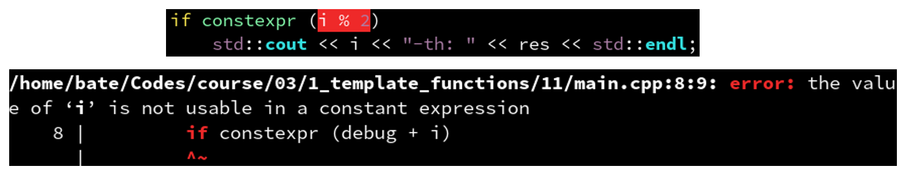
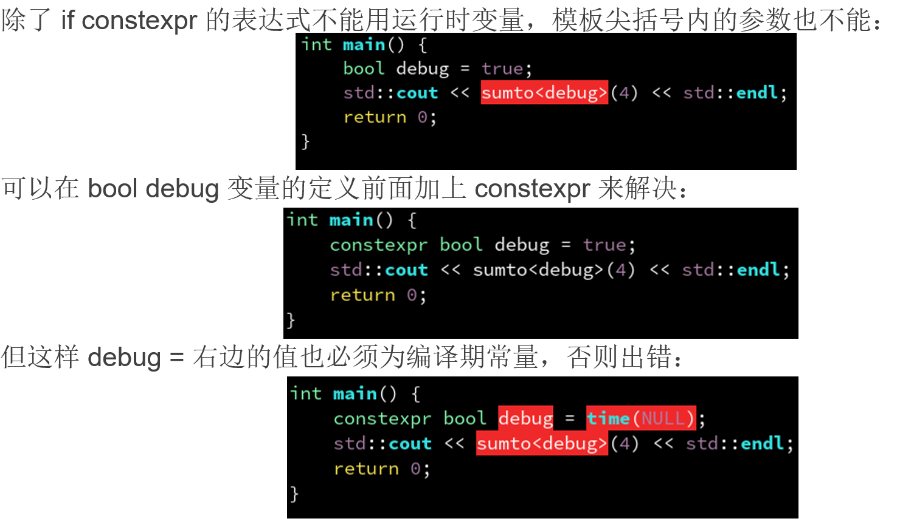
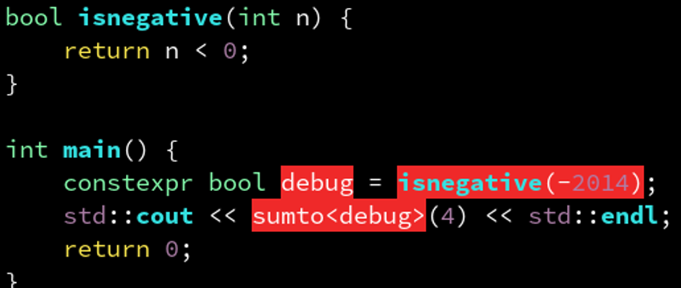
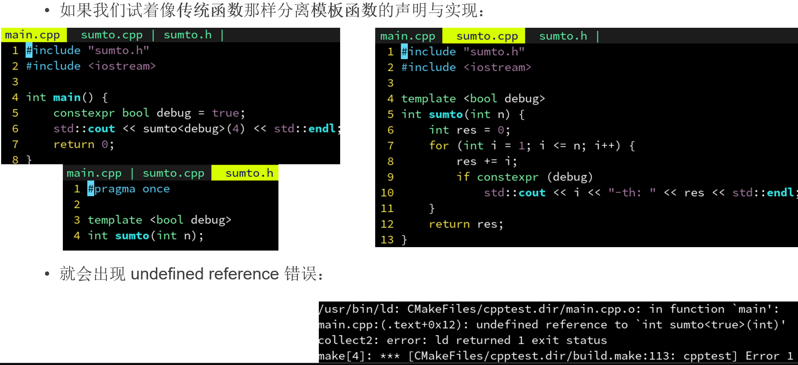

# 三、模版元编程与函数式
## 3.1 template
### 3.1.1 为什么需要模板函数 (template)
答: 避免重复写代码。

比如，利用重载实现“将一个数乘以2”这个功能，需要:

```C++
int twice(int t) {
    return t * 2;
}

float twice(float t) {
    return t * 2;
}

double twice(double t) {
    return t * 2;
}

int main() {
    std::cout << twice(21) << std::endl;
    std::cout << twice(3.14f) << std::endl;
    std::cout << twice(2.718) << std::endl;
}
```

为什么面向对象在HPC(高性能计算)不如函数式和元编程香了？

这个例子要是按传统的面向对象思想，可能是这样:

- 令 Int, Float, Double 继承 Numeric 接口类并实现，其中`multiply(int)`作为虚函数。然后定义:

```C++
Numeric *twice(Numeric *t) {
    return t->multiply(2);
}
```
且不说这样的性能问题，你忍得住寂寞去重复定义好几个，然后每个运算符都要声明一个纯虚函数吗？

而且,`Float`的乘法应该是`multiply(float)`, 你也去定义好几个重载吗？

定义为`multiply(Numeric *)`的话依然会违背你们的`开闭原则`:

- 比如`3.14f * 3`, 两端是不同的类型, 怎么处理所有可能类型的排列组合？

不如放弃类和方法的概念，欣然接受全局函数和重载。

### 3.1.2 模板函数: 定义
使用`template <class T>`其中 T 可以变成任意类型。

调用时`twice<int>`即可将 T 替换为 int。

```C++
template <class T>
T twice(T t) {
    return t * 2;
}

int main() {
    std::cout << twice<int>(21) << std::endl;
    std::cout << twice<float>(3.14f) << std::endl;
    std::cout << twice<double>(2.718) << std::endl;
}
```

注意有的教材上写做: `template <typename T>`是完全等价的，只是个人喜好不同。

### 3.1.3 模板函数: 自动推导参数类型

那这样需要手动写`<int>`, `<float>`用起来还不如重载方便了？

别担心，C++ 规定:
- 当模板类型参数 T 作为函数参数时，则可以省略该模板参数。自动根据调用者的参数判断。


```C++
template <class T>
T twice(T t) {
    return t * 2;
}

int main() {
    std::cout << twice(21) << std::endl;
    std::cout << twice(3.14f) << std::endl;
    std::cout << twice(2.718) << std::endl;
}
```

### 3.1.4 模板函数: 特化的重载
有时候，一个统一的实现（比如 t * 2）满足不了某些特殊情况。比如`std::string`就不能用乘法来重复，这时候我们需要用 t + t 来替代，怎么办呢？

没关系，只需添加一个`twice(std::string)`即可，他会自动和已有的模板`twice<T>(T)`之间相互重载。

```C++
template <class T>
T twice(T t) {
    return t * 2;
}

std::string twice(std::string t) {
    return t + t;
}

int main() {
    std::cout << twice(21) << std::endl;
    std::cout << twice(3.14f) << std::endl;
    std::cout << twice(2.718) << std::endl;
    std::cout << twice("hello") << std::endl;
}
```

但是这样也有一个问题，那就是如果我用`twice(“hello”)`这样去调用，他不会自动隐式转换到`std::string`并调用那个特化函数，而是会去调用模板函数`twice<char *>(“hello”)`, 从而出错。

可能的解决方案: SFINAE。

### 3.1.5 模板函数: 默认参数类型
但是如果模板类型参数 T 没有出现在函数的参数中，那么编译器就无法推断，就不得不手动指定了。

但是，可以通过:
```C++
template <class T = int>
```
表示调用者没有指定时，T 默认为 int。

```C++
template <class T = int>
T two() {
    return 2;
}

int main() {
    std::cout << two<int>() << std::endl;
    std::cout << two<float>() << std::endl;
    std::cout << two<double>() << std::endl;
    std::cout << two() << std::endl;  // 等价于 two<int>()
}
```

### 3.1.6 模板参数: 整数也可以作为参数
```C++
template <class T>
```
可以声明类型 T 作为模板尖括号里的参数。除了类型，任意整数也可以作为模板参数:

```C++
template <int N>
```

来声明一个整数 N 作为模板参数。

不过模板参数只支持整数类型（包括 enum）。

浮点类型、指针类型，不能声明为模板参数。自定义类型也不可以，比如:

```C++
template <float F, glm::vec3 V>  // 错误！
```

示例: 
```C++
template <int N>
void show_times(std::string msg) {
    for (int i = 0; i < N; i++) {
        std::cout << msg << std::endl;
    }
}

int main() {
    show_times<1>("one");
    show_times<3>("three");
    show_times<4>("four");
}
```

### 3.1.7 模板参数: 多个模板参数
`int N`和`class T`可以一起使用。

你只需要指定其中一部分参数即可，会自动根据参数类型(`T msg`)、默认值(`int N = 1`)，<span style="color:red">推断尖括号里没有指定的那些参数</span>。

```C++
template <int N = 1, class T>
void show_times(T msg) {
    for (int i = 0; i < N; i++) {
        std::cout << msg << std::endl;
    }
}

int main() {
    show_times("one"); // 打印 1 个 "one"
    show_times<3>(42); // 打印 3 个 42
    show_times<4>('%');// 打印 4 个 '%'
}
```

### 3.1.8 模板参数: 参数部分特化
1. `func(T t)`完全让参数类型取决于调用者。

2. `func(vector<T> t)`这样则可以限定仅仅为`vector`类型的参数。

这里用了`const &`避免不必要的的拷贝。

```C++
template <class T>
T sum(std::vector<T> const &arr) {
    T res = 0;
    for (int i = 0; i < arr.size(); i++) {
        res += arr[i];
    }
    return res;
}

int main() {
    std::vector<int> a = {4, 3, 2, 1};
    std::cout << sum(a) << std::endl;
    std::vector<float> b = {3.14f, 2.718f};
    std::cout << sum(b) << std::endl;
}
```

不过，这种部分特化也**不支持**隐式转换。

### 3.1.9 为什么要支持整数作为模板参数: 因为是编译期常量
- 你可能会想，模板只需要支持`class T`不就行了？
    - 反正`int N`可以作为函数的参数传入，模板还不支持浮点。

```C++
template <int N>
void func();
// 和
void func(int N);
```
一个是模板参数，一个是函数参数，有什么区别？有很大区别！

`template <int N>`传入的 N，是一个编译期常量，每个不同的 N，编译器都会单独生成一份代码，从而可以对他做<span style="color:red">单独的优化</span>。

而`func(int N)`，则变成**运行期常量**，编译器无法自动优化，只能运行时根据被调用参数 N 的不同。

比如`show_times<0>()`编译器就可以自动优化为一个空函数。因此**模板元编程对高性能编程很重要**。

通常来说，<span style="color:yellow">模板的内部实现需要被暴露出来，除非使用特殊的手段，否则，定义和实现都必须放在头文件里</span>。

但也正因如此，如果过度使用模板，会导致生成的二进制文件大小剧增，编译变得很慢等。(~~boost 编译慢的原因找到了...因为他们用了大量的模板。~~)

## 3.2 constexpr
### 3.2.1 模板的应用: 编译期优化案例
在右边这个案例中，我们声明了一个`sumto`函数，作用是求出从 1 到 n 所有数字的和。

用一个`debug`参数控制是否输出调试信息。

```C++
int sumto(int n, bool debug) {
    int res = 0;
    for (int i = 1; i <= n; i++) {
        res += i;
        if (debug)
            std::cout << i << "-th: " << res << std::endl;
    }
    return res;
}

int main() {
    std::cout << sumto(4, true) << std::endl;
    std::cout << sumto(4, false) << std::endl;
    return 0;
}
```

但是这样`debug`是运行时判断，这样即使是`debug`为`false`也会浪费 CPU 时间。

- 因此可以把`debug`改成模板参数，这样就是编译期常量。编译器会生成两份函数`sumto<true>`和`sumto<false>`。前者保留了调试用的打印语句，后者则完全为性能优化而可以去掉打印语句。

后者其实在编译器看来就是 `if (false) std::cout << ...` 这样显然是会被他自动优化掉的。(但是如果是远古的垃圾编译器可能不会, 因此:)

### 3.2.2 模板的应用: 编译期分支

更进一步，可以用`C++17`的`if constexpr`语法([编译期if表达式](../../../002-tmp丶C++丶memo/003-C++新特性/002-C++17常用新特性/002-编译期if表达式/index.md))，保证是**编译期**确定的分支:

```C++
template <bool debug>
int sumto(int n) {
    int res = 0;
    for (int i = 1; i <= n; i++) {
        res += i;
        if constexpr (debug) {
            std::cout << i << "-th: " << res << std::endl;
        }
    }
    return res;
}

int main() {
    std::cout << sumto<true>(4) << std::endl;
    std::cout << sumto<false>(4) << std::endl;
    return 0;
}
```

### 3.2.3 模板的难题: 编译期常量的限制
编译期常量的限制就在于他**不能**通过运行时变量组成的表达式来指定。比如:

| ##container## |
|:--:|
||

这里在`if constexpr`的表达式里用到了运行时变量，从而无法作为编译期分支的条件。

| ##container## |
|:--:|
||

### 3.2.4 模板的难题: 编译期常函数
编译期 constexpr 的表达式，一般是无法调用其他函数的:

| ##container## |
|:--:|
||

解决: 如果能保证`isnegative`里都可以在编译期求值，将他前面也标上`constexpr`即可:

```C++
template <bool debug>
int sumto(int n) {
    int res = 0;
    for (int i = 1; i <= n; i++) {
        res += i;
        if constexpr (debug) {
            std::cout << i << "-th: " << res << std::endl;
        }
    }
    return res;
}

constexpr bool isnegative(int n) {
    return n < 0;
}

int main() {
    constexpr bool debug = isnegative(-2014);
    std::cout << sumto<debug>(4) << std::endl;
    return 0;
}
```
注意: `constexpr`函数不能调用`non-constexpr`函数。而且`constexpr`函数必须是内联(`inline`)的，不能分离声明和定义在另一个文件里。标准库的很多函数如`std::min`也是`constexpr`函数，可以放心大胆在模板尖括号内使用。

### 3.2.5 模板的难题: 移到另一个文件中定义
> [!TIP]
> 一般来说，我会建议模板不要分离声明和定义，直接写在头文件里即可。如果分离还要罗列出所有模板参数的排列组合，违背了`开闭原则`。

| ##container## |
|:--:|
||

这是因为编译器对模板的编译是惰性的，即只有当前`.cpp`文件用到了这个模板，该模板里的函数才会被定义。而我们的`sumto.cpp`中没有用到`sumto<>`函数的任何一份定义，所以`main.cpp`里只看到`sumto<>`函数的两份声明，从而出错。

解决:
- 在看得见`sumto<>`定义的`sumto.cpp`里，增加两个显式编译模板的声明:

```C++
template <bool debug>
int sumto(int n) {
    int res = 0;
    for (int i = 1; i <= n; i++) {
        res += i;
        if constexpr (debug)
            std::cout << i << "-th: " << res << std::endl;
    }
    return res;
}

template int sumto<true>(int n);
template int sumto<false>(int n);
```

### 3.2.6 模板的惰性: 延迟编译
要证明模板的惰性，只需看这个例子:

```C++
template <class T = void>
void func_that_never_pass_compile() {
    "字符串" = 2333;
}

int main() {
    return 0;
}
```
要是编译器哪怕细看了一眼: 字符串怎么可能被写入呢？肯定是会出错的。

但是却没有出错，这是因为模板没有被调用，所以不会被实际编译！

而只有当`main`调用了这个函数，才会被编译，才会报错！

*用一个假模板实现延迟编译的技术，可以加快编译的速度，用于`代理模式`等。*

### 3.2.7 模板函数: 一个例子

```C++
template <class T>
void print(std::vector<T> const &a) {
    std::cout << "{";
    for (size_t i = 0; i < a.size(); i++) {
        std::cout << a[i];
        if (i != a.size() - 1)
            std::cout << ", ";
    }
    std::cout << "}" << std::endl;
}

int main() {
    std::vector<int> a = {1, 4, 2, 8, 5, 7};
    print(a);
    std::vector<double> b = {3.14, 2.718, 0.618};
    print(b);
    return 0;
}
```

### 3.2.8 模板函数: 配合运算符重载

```C++
template <class T>
std::ostream &operator<<(std::ostream &os, std::vector<T> const &a) {
    os << "{";
    for (size_t i = 0; i < a.size(); i++) {
        os << a[i];
        if (i != a.size() - 1)
            os << ", ";
    }
    os << "}";
    return os;
}

int main() {
    std::vector<int> a = {1, 4, 2, 8, 5, 7};
    std::cout << a << std::endl;
    std::vector<double> b = {3.14, 2.718, 0.618};
    std::cout << b << std::endl;
    return 0;
}
```

### 3.2.9 小结
模板函数: 大家学废了吗?

1. 类型作为参数: `template <class T>`

2. 整数值作为参数: `template <int N>`

3. 定义默认参数: `template <int N = 0, class T = int>`

4. 使用模板函数: `myfunc<T, N>(...)`

5. 模板函数可以自动推断类型，从而参与重载

6. 模板具有惰性、多次编译的特点

## 3.3 auto
### 3.3.1 为什么需要自动类型推导 (auto)
没有 auto 的话，需要声明一个变量，必须重复一遍他的类型，非常麻烦:

```C++
struct MyClassWithVeryLongName {
};

int main() {
    std::shared_ptr<MyClassWithVeryLongName> p = std::make_shared<MyClassWithVeryLongName>();
}
```

### 3.3.2 自动类型推导: 定义变量
因此 C++11 引入了 auto，使用 auto 定义的变量，其类型会自动根据等号右边的值来确定:

```C++
struct MyClassWithVeryLongName {
};

int main() {
    auto p = std::make_shared<MyClassWithVeryLongName>();
}
```

### 3.3.3 自动类型推导: 一些局限性
不过 auto 也并非万能，他也有很多限制。

因为需要等号右边的类型信息，所以没有 = 单独声明一个 auto 变量是不行的:

```C++
auto p; // 错误的
p = ...;
```

而且，类成员也不可以定义为 auto:

```C++
struct MyClassWithVeryLongName {
    auto x = std::make_shared<int>(); // 错误的
};
```

### 3.3.4 自动类型推导: 函数返回值
除了可以用于定义变量，还可以用作函数的返回类型:

```C++
auto func() {
    return std::make_shared<MyClassWithVeryLongName>();
}

// 同上
std::shared_ptr<MyClassWithVeryLongName> func() {
    return std::make_shared<MyClassWithVeryLongName>();
}
```

使用 auto 以后，会自动被推导为 return 右边的类型。

不过也有三点注意事项：
1. 当函数有多条 return 语句时，所有语句的返回类型必须一致，否则 auto 会报错。

2. 当函数没有 return 语句时，auto 会被推导为 void。

3. 如果声明和实现分离了，则不能声明为 auto。比如:

```C++
auto func(); // 错误
```

### 3.3.5 C++特性: 引用 (int &)
众所周知，C++ 中有一种特殊的类型，叫做引用。只需要在原类型后面加一个 & 即可。

引用的本质无非是指针，当我们试图修改一个引用时，实际上是修改了原来的对象:

```C++
int main() {
    int x = 233;
    int &ref = x;
    ref = 42;
    printf("%d\n", x);    // 42
    x = 1024;
    printf("%d\n", ref);  // 1024
}
```

等价于

```C++
int main() {
    int x = 233;
    int *ref = &x;
    *ref = 42;
    printf("%d\n", x);    // 42
    x = 1024;
    printf("%d\n", *ref); // 1024
}
```
可见，和C语言的`int *`相比无非是减少了`&`和`*`的麻烦而已。

### 3.3.6 C++特性: 常引用 (int const & / const int &)
如果说`int &`相当于`int *`，那么`int const &`就相当于`int const *`。

```C++
// 注意区分:
int a = 114514; // 整数int
int* p = &a;    // int指针

const int* cip = &a;    // const int 指针, 是指向 常量int 的指针
int const * icp = &a;   // 同上为 const int 指针

int * const ipc = &a;   // 指针常量 (* const), 是常量, 不可变: 指的是指针的值, 即指向的地址不能变, 但是地址对应的值是可以变的
const int * const = &a; // 常量指针常量 (什么都不能变)

///////////////////////
int & const iac = a; // 突发奇想, 以此类推?! 残念! 没有这个!
```

`const`修饰符的存在，使得`ref`不能被写入（赋值）。

这样的好处是更加安全（编译器也能够放心大胆地做自动优化）:

```C++
int main() {
    int x = 233;
    int const &ref = x;
    // ref = 42;  // 会出错！
    printf("%d\n", x);    // 233
    x = 1024;
    printf("%d\n", ref);  // 1024
}
```

### 3.3.7 自动类型推导: 定义引用 (auto &)
当然，auto 也可以用来定义引用，只需要改成`auto &`即可:

```C++
int main() {
    int x = 233;
    auto &ref = x;
    ref = 42;
    printf("%d\n", x);    // 42
    x = 1024;
    printf("%d\n", ref);  // 1024
}
```

### 3.3.8 自动类型推导: 定义常引用 (auto const &)
同理，`auto const &`可以定义常引用:

```C++
int main() {
    int x = 233;
    auto const &ref = x;
    // ref = 42;  // 会出错！
    printf("%d\n", x);    // 233
    x = 1024;
    printf("%d\n", ref);  // 1024
}
```

### 3.3.9 自动类型推导: 函数返回引用

当然，函数的返回类型也可以是`auto &`或者`auto const &`。比如懒汉[单例模式](../../../../../001-计佬常識/002-设计模式/007-创建型模式/004-单例模式/index.md):

```C++
auto &product_table() {
    static std::map<std::string, int> instance;
    return instance;
}

int main() {
    product_table().emplace("佩奇", 80);
    product_table().emplace("妈妈", 100);
}
```

### 3.3.10 理解右值: 即将消失的，不长时间存在于内存中的值
引用又称为左值（l-value）。左值通常对应着一个长时间存在于内存中的变量。

除了左值之外，还有右值（r-value）。右值通常是一个表达式，代表计算过程中临时生成的中间变量。因此有的教材又称之为消亡引用。

得名原因: 左值常常位于等号的左边，而右值只能位于等号右边。如: a = 1;

已知: `int a; int *p;`
- 左值类型：int &，int const &
- 左值例子：a, *p, p[a]
- 右值类型：int &&
- 右值例子：1, a + 1, *p + 1

```C++
#include <cstdio>

void test(int &) {
    printf("int &\n");
}

void test(int const &) {
    printf("int const &\n");
}

void test(int &&) {
    printf("int &&\n");
}

int main() {
    int a = 0;
    int *p = &a;
    test(a);      // int &
    test(*p);     // int &
    test(p[a]);   // int &
    test(1);      // int &&
    test(a + 1);  // int &&
    test(*p + 1); // int &&

    const int b = 3;
    test(b);      // int const &
    test(b + 1);  // int &&
}
```

~~不理解右值和右值引用？没关系，老师也不理解，跳过即可！~~

### 3.3.11 理解 const: 常值修饰符
与 & 修饰符不同，`int const`和`int`可以看做两个不同的类型。不过`int const`是不可写入的。

因此`int const &`无非是另一个类型`int const`的引用罢了。这个引用不可写入。

唯一特殊之处，就在于 C++ 规定`int &&`能自动转换成`int const &`，但不能转换成`int &`。

例如，尽管`3`是右值`int &&`，但却能传到类型为`int const &`的参数上:

```C++
void func(const int& i);
func(3);
```
而`int &`的参数:

```C++
void func(int& i);
func(3);
```
就会报错。

### 3.3.12 小彭老师发明: 一个方便查看类型名的小工具

```C++
#include <iostream>
#include <cstdlib>
#include <string>
#if defined(__GNUC__) || defined(__clang__)
#include <cxxabi.h>
#endif

template <class T>
std::string cpp_type_name() {
    const char *name = typeid(T).name();
#if defined(__GNUC__) || defined(__clang__)
    int status;
    char *p = abi::__cxa_demangle(name, 0, 0, &status);
    std::string s = p;
    std::free(p);
#else
    std::string s = name;
#endif
    if (std::is_const_v<std::remove_reference_t<T>>)
        s += " const";
    if (std::is_volatile_v<std::remove_reference_t<T>>)
        s += " volatile";
    if (std::is_lvalue_reference_v<T>)
        s += " &";
    if (std::is_rvalue_reference_v<T>)
        s += " &&";
    return s;
}

#define SHOW(T) std::cout << cpp_type_name<T>() << std::endl;

int main() {
    SHOW(int);
    SHOW(const int &);
    typedef const float *const &MyType;
    SHOW(MyType); // float const* const &
}
```

### 3.3.13 获取变量的类型: decltype
可以通过 decltype(变量名) 获取变量定义时候的类型。

```C++
int main() {
    int a;
    auto &c = a;
    auto const &b = a;
    SHOW(decltype(a)); // int
    SHOW(decltype(b)); // int &
    SHOW(decltype(c)); // int const &
}
```

### 3.3.14 获取表达式的类型: decltype
可以通过`decltype(表达式)`获取表达式的类型。
> [!TIP]
> 注意`decltype(变量名)`和`decltype(表达式)`是不同的。

可以通过`decltype((a))`来强制编译器使用后者，从而得到`int &`。

```C++
int main() {
    int a, *p;
    SHOW(decltype(3.14f + a));
    SHOW(decltype(42));
    SHOW(decltype(&a));
    SHOW(decltype(p[0]));
    SHOW(decltype('a'));

    SHOW(decltype(a));    // int
    SHOW(decltype((a)));  // int &
    // 后者由于额外套了层括号，所以变成了 decltype(表达式)
}
```

### 3.3.15 自动类型推导: 万能推导 (`decltype(auto)`)
如果一个表达式，我不知道他是个可变引用（int &），常引用（int const &），右值引用（int &&），还是一个普通的值（int）。

但我就是想要<span style="color:red">定义一个和表达式返回类型一样的变量</span>，这时候可以用:
```C++
decltype(auto) p = func(); // 会自动推导为 func() 的返回类型。

// 和下面这种方式等价:
decltype(func()) p = func();
```

在`代理模式`中，用于完美转发函数返回值。比如:
```C++
decltype(auto) at(size_t i) const {
    return m_internal_class.at(i);
}
```

示例:
```C++
int t;

int const &func_ref() {
    return t;
}

int const &func_cref() {
    return t;
}

int func_val() {
    return t;
}

int main() {
    decltype(auto) a = func_cref();  // int const &a
    decltype(auto) b = func_ref();   // int &b
    decltype(auto) c = func_val();   // int c
}
```

### 3.3.16 using: 创建类型别名
除了 typedef 外，还可以用 using 创建类型别名:

```C++
typedef std::vector<int> VecInt;
using VecInt = std::vector<int>;
// 以上是等价的。
typedef int (*PFunc)(int);
using PFunc = int(*)(int);
// 以上是等价的。
```

### 3.3.17 decltype: 一个例子

这是一个实现将两个不同类型 vector 逐元素相加的函数。

用`decltype(T1{} * T2{})`算出`T1`和`T2`类型相加以后的结果，并做为返回的`vector`容器中的数据类型。 

```C++
template <class T1, class T2>
auto add(std::vector<T1> const &a, std::vector<T2> const &b) {
    using T0 = decltype(T1{} + T2{});
    std::vector<T0> ret;
    for (size_t i = 0; i < std::min(a.size(), b.size()); i++) {
        ret.push_back(a[i] + b[i]);
    }
    return ret;
}

int main() {
    std::vector<int> a = {2, 3, 4};
    std::vector<float> b = {0.5f, 1.0f, 2.0f};
    auto c = add(a, b);
    for (size_t i = 0; i < c.size(); i++) {
        std::cout << c[i] << std::endl;
    }
    return 0;
}
```

- 恭喜！你已经基本学废了自动类型推导！
    - 《基本鞋废》
    - 怎么样，是不是非常方便呢？
    - 如果不理解，跳过即可！

## 3.4 lambda
### 3.4.1 函数也是对象: 函数式编程
你知道吗? 函数可以作为另一个函数的参数! (C++中, 可以不用像C语言那样写一个函数指针)

```C++
void say_hello() {
    printf("Hello!\n");
}

void call_twice(void func()) {
    func();
    func();
}

int main() {
    call_twice(say_hello);
    return 0;
}
```

而且，这个作为参数的函数也可以有参数:

```C++
void print_number(int n) {
    printf("Number %d\n", n);
}

void call_twice(void func(int)) {
    func(0);
    func(1);
}
```

### 3.4.2 函数式编程: 函数作为模板类型
甚至可以直接将`func`的类型作为一个模板参数，从而不需要写`void(int)`。

这样还会允许函数的参数类型为其他类型，比如`void(float)`。

这样`call_twice`会自动对每个不同的`func`类型编译一遍，从而允许编译器更好地进行自动适配与优化。

```C++
void print_float(float n) {
    printf("Float %f\n", n);
}

void print_int(int n) {
    printf("Int %d\n", n);
}

template <class Func>
void call_twice(Func func) {
    func(0);
    func(1);
}

int main() {
    call_twice(print_float);
    call_twice(print_int);
    return 0;
}
```

### 3.4.3 函数式编程: lambda表达式
C++11 引入的 lambda 表达式允许我们在函数体内创建一个函数，大大地方便了函数式编程。

语法就是先一个空的 []，然后是参数列表，然后是 {} 包裹的函数体。

再也不用被迫添加一个全局函数了:

```C++
template <class Func>
void call_twice(Func func) {
    func(0);
    func(1);
}

int main() {
    auto myfunc = [] (int n) {
        printf("Number %d\n", n);
    };
    call_twice(myfunc);
    return 0;
}
```

有关比较基础的, 我已经在C++新特性: [Lambda表达式](../../../002-tmp丶C++丶memo/003-C++新特性/001-C++11常用新特性/006-Lambda表达式/index.md)|[Lambda表达式捕获类成员变量的副本](../../../002-tmp丶C++丶memo/003-C++新特性/002-C++17常用新特性/008-Lambda表达式捕获类成员变量的副本/index.md) 中有写, 这里就不再概述基础了!

### 3.4.4 lambda表达式: 传常引用避免拷贝开销

此外，最好把模板参数的 Func 声明为`Func const &`以避免不必要的拷贝:

```C++
template <class Func>
void call_twice(Func const &func) {
    std::cout << func(0) << std::endl;
    std::cout << func(1) << std::endl;
    std::cout << "Func 的大小: " << sizeof(Func) << std::endl; // 16
}

int main() {
    int fac = 2;
    int counter = 0;
    auto twice = [&] (int n) {
        counter++;
        return n * fac;
    };
    call_twice(twice);
    std::cout << "调用了 " << counter << " 次" << std::endl;
    return 0;
}
```

> 请爱思考的同学想想看，为什么 Func 的大小是 16 字节？
>
> 提示: 一个指针大小为 8 字节，捕获了 2 个变量。

### 3.4.5 lambda表达式: 作为返回值
既然函数可以作为参数，当然也可以作为返回值！

由于 lambda 表达式永远是个匿名类型，我们需要将 make_twice 的返回类型声明为 auto 让他自动推导。

```C++
template <class Func>
void call_twice(Func const &func) {
    std::cout << func(0) << std::endl;
    std::cout << func(1) << std::endl;
    std::cout << "Func 大小: " << sizeof(Func) << std::endl;
}

auto make_twice() {
    return [] (int n) {
        return n * 2;
    };
}

int main() {
    auto twice = make_twice();
    call_twice(twice);
    return 0;
}
```

### 3.4.6 作为返回值: 出问题了

然而当我们试图用 [&] 捕获参数 fac 时，却出了问题:

- fac 似乎变成 32764 了？

这是因为 [&] 捕获的是引用，是`fac`的地址，而`make_twice`已经返回了，导致`fac`的引用变成了内存中一块已经**失效的**地址。

总之，如果用 [&]，<span style="color:red">请保证 lambda 对象的生命周期不超过他捕获的所有引用的寿命</span>。

```C++
template <class Func>
void call_twice(Func const &func) {
    std::cout << func(0) << std::endl;
    std::cout << func(1) << std::endl;
    std::cout << "Func 大小: " << sizeof(Func) << std::endl;
}

auto make_twice(int fac) {
    return [&] (int n) {
        return n * fac;
    };
}

int main() {
    auto twice = make_twice(2);
    call_twice(twice);
    return 0;
}
```

### 3.4.7 作为返回值: 解决问题
这时，我们可以用 [=] 来捕获，他会捕获 fac 的值而不是引用。

```C++
auto make_twice(int fac) {
    return [=] (int n) {
        return n * fac;
    };
}
```

[=] 会给每一个引用了的变量做一份拷贝，放在 Func 类型中。

不过他会造成对引用变量的拷贝，性能可能会不如 [&]。

> 爱思考: 为什么这里 Func 为 4 字节？
>
> 提示: 拷贝了一个`fac`, 是int, 故大小是4字节

### 3.4.8 lambda表达式: 如何避免用模板参数
虽然`<class Func>`这样可以让编译器对每个不同的 lambda 生成一次，有助于优化。

但是有时候我们希望通过头文件的方式分离声明和实现，或者想加快编译，这时如果再用`template class`作为参数就不行了。

为了灵活性，可以用`std::function`容器。

只需在后面尖括号里写函数的返回类型和参数列表即可，比如:

```C++
std::function<int(float, char *)>;
```

示例:
```C++
void call_twice(std::function<int(int)> const &func) {
    std::cout << func(0) << std::endl;
    std::cout << func(1) << std::endl;
    std::cout << "Func 大小: " << sizeof(func) << std::endl;
}

std::function<int(int)> make_twice(int fac) {
    return [=] (int n) {
        return n * fac;
    };
}
```

- 但是使用function会有性能损耗, 其内部好像是使用虚函数重载实现的

### 3.4.9 如何避免用模板参数2: 无捕获的 lambda 可以传为函数指针
另外，如果你的 lambda 没有捕获任何局部变量，也就是 []，那么不需要用`std::function<int(int)>`，直接用函数指针的类型`int(int)`或者`int(*)(int)`即可。

函数指针效率更高一些，但是 [] 就没办法捕获局部变量了（全局变量还是可以的）。

最大的好处是可以伺候一些只接受函数指针的 C 语言的 API 比如`pthread`和`atexit`。

```C++
void call_twice(int func(int)) {
    std::cout << func(0) << std::endl;
    std::cout << func(1) << std::endl;
    std::cout << "Func 大小: " << sizeof(func) << std::endl;
}

int main() {
    call_twice([] (int n) {
        return n * 2;
    });
    return 0;
}
```

### 3.4.10 lambda + 模板: 双倍快乐
可以将 lambda 表达式的参数声明为 auto，声明为 auto 的参数会自动根据调用者给的参数推导类型，基本上和`template <class T>`等价。

`auto const &`也是同理，等价于模板函数的`T const &`。

带 auto 参数的 lambda 表达式，和模板函数一样，同样会有惰性、多次编译的特性。

```C++
void call_twice(int func(int)) {
    std::cout << func(0) << std::endl;
    std::cout << func(1) << std::endl;
    std::cout << "Func 大小: " << sizeof(func) << std::endl;
}

int main() {
    call_twice([] (auto n) {
        return n * 2;
    });
    return 0;
}
```

### 3.4.11 C++20前瞻: 函数也可以 auto，lambda 也可以`<class T>`
如右图，两者的用法可以互换，更方便了。

```C++
void call_twice(auto const &func) {
    std::cout << func(3.14f) << std::endl;
    std::cout << func(21) << std::endl;
}

int main() {
    auto twice = [] <class T> (T n) {
        return n * 2;
    };
    call_twice(twice);
    return 0;
}

/* 等价于：
auto twice(auto n) {
    return n * 2;
}
*/
```

```C++
auto wrap(auto f) {
    return [=] (auto ...args) {
        return f(f, args...);
    };
}
```

### 3.4.12 lambda 用途举例: yield模式
这里用了`type_traits`来获取 x 的类型。
```C++
decay_t<int const &> = int
is_same_v<int, int> = true
is_same_v<float, int> = false
```
更多这类模板请搜索 c++ type traits。

```C++
template <class Func>
void fetch_data(Func const &func) {
    for (int i = 0; i < 32; i++) {
        func(i);
        func(i + 0.5f);
    }
}

int main() {
    std::vector<int> res_i;
    std::vector<float> res_f;
    fetch_data([&] (auto const &x) {
        using T = std::decay_t<decltype(x)>;
        if constexpr (std::is_same_v<T, int>) {
            res_i.push_back(x);
        } else if constexpr (std::is_same_v<T, float>) {
            res_f.push_back(x);
        }
    });
    std::cout << res_i.size() << std::endl;
    std::cout << res_f.size() << std::endl;
    return 0;
}
```

### 3.4.13 lambda 用途举例: 立即求值

```C++
int main() {
    std::vector<int> arr = {1, 4, 2, 8, 5, 7};
    int tofind = 5;
    int index = [&] { // 再也不需要烦人的 flag 变量
        for (int i = 0; i < arr.size(); i++)
            if (arr[i] == tofind)
                return i;
        return -1;
    }();
    std::cout << index << std::endl;
    return 0;
}
```

### 3.4.14 lambda 用途举例: 局部实现递归

搜索关键字: 匿名递归

```C++
int main() {
    std::vector<int> arr = {1, 4, 2, 8, 5, 7, 1, 4};
    std::set<int> visited;
    auto dfs = [&] (auto const &dfs, int index) -> void { // 需要写明返回值
        if (visited.find(index) == visited.end()) {
            visited.insert(index);
            std::cout << index << std::endl;
            int next = arr[index];
            dfs(dfs, next);
        }
    };
    dfs(dfs, 0);
    return 0;
}
```

比使用`function`实现的递归快!

### 3.4.15 小结

恭喜！你已经基本学废了 lambda 表达式！

总结:
- lambda 作为参数: 用`template <class Func>`然后`Func const &`做类型。
- lambda 作为返回值: 用 auto 做类型。
- 牺牲性能但存储方便: `std::function`容器。
- lambda 作为参数: 通常用 [&] 存储引用。
- lambda 作为返回值: 总是用 [=] 存储值。

其实 lambda 还有更多语法，比如`mutable`，`[p = std::move(p)]`等...

## 3.5 常用容器: tuple
### 3.5.1 tuple 与 get
`std::tuple<...>`可以将多个不同类型的值打包成一个。尖括号里填各个元素的类型。

之后可以用`std::get<0>`获取第0个元素，`std::get<1>`获取第1个元素，以此类推（从0开始数数）。

```C++
#include <tuple>

int main() {
    auto tup = std::tuple<int, float, char>(3, 3.14f, 'h');

    int first = std::get<0>(tup);
    float second = std::get<1>(tup);
    char third = std::get<2>(tup);

    std::cout << first << std::endl;
    std::cout << second << std::endl;
    std::cout << third << std::endl;
    return 0;
}
```

### 3.5.2 tuple: 如何化简
当用于构造函数时，`std::tuple<...>`尖括号里的类型可以省略，这是 C++17 的新特性: CTAD。

通过 auto 自动推导 get 的返回类型。

```C++
int main() {
    auto tup = std::tuple(3, 3.14f, 'h');

    auto first = std::get<0>(tup);
    auto second = std::get<1>(tup);
    auto third = std::get<2>(tup);

    std::cout << first << std::endl;
    std::cout << second << std::endl;
    std::cout << third << std::endl;
    return 0;
}
```

### 3.5.3 tuple: 结构化绑定
可是需要一个个去 get 还是好麻烦。

没关系，可以用C++17[结构化绑定](../../../002-tmp丶C++丶memo/003-C++新特性/002-C++17常用新特性/005-结构化绑定/index.md)的语法:

```C++
auto [x, y, ...] = tup;
```
利用一个方括号，里面是变量名列表，即可解包一个 tuple。里面的数据会按顺序赋值给每个变量，非常方便。

```C++
int main() {
    auto tup = std::tuple(3, 3.14f, 'h');

    auto [first, second, third] = tup;

    std::cout << first << std::endl;
    std::cout << second << std::endl;
    std::cout << third << std::endl;
    return 0;
}
```

注: C++11就需要使用`std::tie(...)`了:

```C++
int first;
float second;
char third; 
// 需要先声明, 十分麻烦...
tie(first, second, third) = tup;
```


### 3.5.4 tuple: 结构化绑定为引用
结构化绑定也支持绑定为引用:
```C++
auto &[x, y, ...] = tup;
```
这样相当于解包出来的 x, y, ... 都是 auto & 推导出来的引用类型。对引用的修改可以影响到原 tuple 内的值。

同理，通过`auto const &`绑定为常引用:
```C++
auto const &[x, y, ...] = tup;
```
常引用虽然不能修改，但是可以避免一次不必要拷贝。

### 3.5.5 tuple: 结构化绑定为万能推导
不过要注意一下万能推导的`decltype(auto)`，由于历史原因，他对应的结构化绑定是`auto &&`:
```C++
auto &&[x, y, ...] = tup;         // 正确！
decltype(auto) [x, y, ...] = tup; // 错误！
```
对的，是两个与号 &&。

```C++
int main() {
    auto tup = std::tuple(3, 3.14f, 'h');

    auto &&[first, second, third] = tup;

    std::cout << std::get<0>(tup) << std::endl;
    first = 42;
    std::cout << std::get<0>(tup) << std::endl;

    return 0;
}
```

### 3.5.6 结构化绑定: 还可以是任意自定义类
其实，结构化绑定不仅可以解包`std::tuple`，还可以解包任意用户自定义类:

```C++
struct MyClass {
    int x;
    float y;
};

int main() {
    MyClass mc = {42, 3.14f};

    auto [x, y] = mc;

    std::cout << x << ", " << y << std::endl;
    return 0;
}
```

配合打包的 {} 初始化表达式，真是太便利了！

可惜`std::get`并不支持自定义类。

### 3.5.7 tuple: 用于函数多个返回值
`std::tuple`可以用于有多个返回值的函数。

如上一讲中所说，当函数返回值确定时，return 可以用 {} 表达式初始化，不必重复写前面的类名`std::tuple`。

```C++
std::tuple<bool, float> mysqrt(float x) {
    if (x >= 0.f) {
        return {true, std::sqrt(x)};
    } else {
        return {false, 0.0f};
    }
}

int main() {
    auto [success, value] = mysqrt(3.f);
    if (success) {
        printf("成功！结果为：%f\n", value);
    } else {
        printf("失败！找不到平方根！\n");
    }
    return 0;
}
```

## 3.6 常用容器: optional
### 3.6.1 optional: has_value() 查询是否有值
有些函数，本来要返回 T 类型，但是有可能会失败！

上个例子中用`std::tuple<bool, T>`，其中第一个`bool`表示成功与否。但是这样尽管失败了还是需要指定一个值`0.0f`，非常麻烦。

这种情况推荐用`std::optional<T>`。

成功时，直接返回 T。失败时，只需返回`std::nullopt`即可。

```C++
#include <iostream>
#include <optional>
#include <cmath>

std::optional<float> mysqrt(float x) {
    if (x >= 0.f) {
        return std::sqrt(x);
    } else {
        return std::nullopt;
    }
}

int main() {
    auto ret = mysqrt(-3.14f);
    if (ret.has_value()) {
        printf("成功！结果为：%f\n", *ret);
    } else {
        printf("失败！找不到平方根！\n");
    }
    return 0;
}
```

### 3.6.2 optional: value_or() 方便地指定一个缺省值
`ret.value_or(3)`等价于:

```C++
ret.has_value() ? ret.value() : 3
```

### 3.6.3 optional: value() 会检测是否为空，空则抛出异常
当 ret 没有值时（即 nullopt），`ret.value()`会抛出一个异常，类型为`std::bad_optional_access`。

```C++
std::optional<float> mysqrt(float x) {
    if (x >= 0.f) {
        return std::sqrt(x);
    } else {
        return std::nullopt;
    }
}

int main() {
    auto ret = mysqrt(-3.14f);
    printf("成功！结果为：%f\n", ret.value()); // 抛出异常
    return 0;
}
```

### 3.6.4 optional: operator*() 不检测是否为空，不会抛出异常
除了 ret.value() 之外还可以用 *ret 获取 optional 容器中的值，不过他不会去检测是否 has_value()，也不会抛出异常，更加高效，但是要注意安全。

请确保在 has_value() 的分支内使用 *ret，否则就是不安全的。

如果 optional 里的类型是结构体，则也可以用 ret->xxx 来访问该结构体的属性。

```C++
int main() {
    auto ret = mysqrt(-3.14f);
    if (ret.has_value()) {
        printf("成功！结果为：%f\n", *ret);
    } else {
        printf("失败！找不到平方根！\n");
    }
    return 0;
}
```

### 3.6.5 optional: operator bool() 和 has_value() 等价
在 if 的条件表达式中，其实可以直接写`if (ret)`，他和`if (ret.has_value())`等价。

没错，这样看来 optional 是在模仿指针，nullopt 则模仿 nullptr。但是他更安全，且符合 RAII 思想，当设为 nullopt 时会自动释放内部的对象。

利用这一点可以实现 RAII 容器的提前释放。和 unique_ptr 的区别在于他的对象**存储在栈上**，效率更高。

```C++
int main() {
    auto ret = mysqrt(-3.14f);
    if (ret) {
        printf("成功！结果为：%f\n", *ret);
    } else {
        printf("失败！找不到平方根！\n");
    }
    return 0;
}
```

## 3.7 variant
### 3.7.1 variant: 安全的 union，存储多个不同类型的值
有时候需要一个类型“要么存储 int，要么存储 float”，这时候就可以用`std::variant<int, float>`。

和 union 相比，variant 符合 RAII 思想，更加安全易用。

给 variant 赋值只需用普通的 = 即可。

variant 的特点是只存储其中一种类型。

tuple 的特点是每个类型都有存储。

请区分，根据实际情况选用适当的容器。

~~(`std::variant`相当于 Rust 的`Either`)~~

### 3.7.2 variant: 获取容器中的数据用 std::get
要获取某个类型的值，比如要获取 int 用`std::get<int>`。如果当前`variant`里不是这个类型，就会抛出异常: `std::bad_variant_access`。

此外，还可以通过`std::get<0>`获取 variant 列表中第 0 个类型，这个例子中和`std::get<int>`是等价的。

```C++
#include <variant>

int main() {
    std::variant<int, float> v = 3;

    std::cout << std::get<int>(v) << std::endl;   // 3
    std::cout << std::get<0>(v) << std::endl;     // 3

    v = 3.14f;

    std::cout << std::get<float>(v) << std::endl; // 3.14f
    std::cout << std::get<int>(v) << std::endl;   // 运行时错误

    return 0;
}
```

### 3.7.3 variant: 判断当前是哪个类型用 std::holds_alternative
可以用`std::holds_alternative<int>`判断当前里面存储的是不是 int。

```C++
void print(std::variant<int, float> const &v) {
    if (std::holds_alternative<int>(v)) {
        std::cout << std::get<int>(v) << std::endl;
    } else if (std::holds_alternative<float>(v)) {
        std::cout << std::get<float>(v) << std::endl;
    }
}

int main() {
    std::variant<int, float> v = 3;
    print(v);
    v = 3.14f;
    print(v);
    return 0;
}
```

### 3.7.4 variant: 判断当前是哪个类型用 v.index()
除了这个之外，还可以用成员方法`index()`**获取当前是参数列表中的第几个类型**。这样也可以实现判断。

```C++
void print(std::variant<int, float> const &v) {
    if (v.index() == 0) {
        std::cout << std::get<0>(v) << std::endl;
    } else if (v.index() == 1) {
        std::cout << std::get<1>(v) << std::endl;
    }
}

int main() {
    std::variant<int, float> v = 3;
    print(v);
    v = 3.14f;
    print(v);
    return 0;
}
```

### 3.7.5 variant: 批量匹配 std::visit
> [!TIP]
> 用 variant 不用 visit，就像看四大名著不看红楼梦，后面我忘了，总之就是只能度过一个相对失败的人生 :)

如果你的`if-else`每个分支长得都差不多（除了`std::get<>`的类型不一样以外），可以考虑用`std::visit`，他会自动用相应的类型，调用你的 lambda，lambda 中往往是个重载函数。

这里用到了带 auto 的 lambda，利用了他具有**多次编译**的特性，实现编译多个分支的效果。

`std::visit`、`std::variant`的这种模式称为**静态多态**，和虚函数、抽象类的动态多态相对。

静态多态的优点是:
- 性能开销小，存储大小固定。

缺点是:
- 类型固定，不能运行时扩充。

```C++
#include <variant>

void print(std::variant<int, float> const &v) {
    std::visit([&] (auto const &t) {
        std::cout << t << std::endl;
    }, v);
}

int main() {
    std::variant<int, float> v = 3;
    print(v);
    v = 3.14f;
    print(v);
    return 0;
}
```

### 3.7.6 std::visit: 还支持多个参数
其实还可以有多个 variant 作为参数。

相应地 lambda 的参数数量要与之匹配。

`std::visit`会自动罗列出所有的排列组合！

所以如果 variant 有 n 个类型，那 lambda 就要被编译 $n^2$ 次，编译可能会变慢。

但是标准库能保证运行时是 $O(1)$ 的（他们用函数指针实现分支，不是暴力`if-else`）。

```C++
void print(std::variant<int, float> const &v) {
    std::visit([&] (auto const &t) {
        std::cout << t << std::endl;
    }, v);
}

auto add(std::variant<int, float> const &v1,
         std::variant<int, float> const &v2) {
    std::variant<int, float> ret;
    std::visit([&] (auto const &t1, auto const &t2) {
        ret = t1 + t2;
    }, v1, v2);
    return ret;
}

int main() {
    std::variant<int, float> v = 3;
    print(add(v, 3.14f));
    return 0;
}
```

### 3.7.7 std::visit: 可以有返回值
`std::visit`里面的 lambda 可以有返回值，不过都得同样类型。

利用这一点进一步优化:

```C++
auto add(std::variant<int, float> const &v1,
         std::variant<int, float> const &v2) {
    return std::visit([&] (auto const &t1, auto const &t2)
               -> std::variant<int, float> {
        return t1 + t2;
    }, v1, v2);
}
```

## 3.8 回家作业
- 题目:
 
```C++
#include <iostream>
#include <vector>
#include <variant>

// 请修复这个函数的定义：10 分
std::ostream &operator<<(std::ostream &os, std::vector<T> const &a) {
    os << "{";
    for (size_t i = 0; i < a.size(); i++) {
        os << a[i];
        if (i != a.size() - 1)
            os << ", ";
    }
    os << "}";
    return os;
}

// 请修复这个函数的定义：10 分
template <class T1, class T2>
std::vector<T0> operator+(std::vector<T1> const &a, std::vector<T2> const &b) {
    // 请实现列表的逐元素加法！10 分
    // 例如 {1, 2} + {3, 4} = {4, 6}
}

template <class T1, class T2>
std::variant<T1, T2> operator+(std::variant<T1, T2> const &a, std::variant<T1, T2> const &b) {
    // 请实现自动匹配容器中具体类型的加法！10 分
}

template <class T1, class T2>
std::ostream &operator<<(std::ostream &os, std::variant<T1, T2> const &a) {
    // 请实现自动匹配容器中具体类型的打印！10 分
}

int main() {
    std::vector<int> a = {1, 4, 2, 8, 5, 7};
    std::cout << a << std::endl;
    std::vector<double> b = {3.14, 2.718, 0.618};
    std::cout << b << std::endl;
    auto c = a + b;

    // 应该输出 1
    std::cout << std::is_same_v<decltype(c), std::vector<double>> << std::endl;

    // 应该输出 {4.14, 6.718, 2.618}
    std::cout << c << std::endl;

    std::variant<std::vector<int>, std::vector<double>> d = c;
    std::variant<std::vector<int>, std::vector<double>> e = a;
    d = d + c + e;

    // 应该输出 {9.28, 17.436, 7.236}
    std::cout << d << std::endl;

    return 0;
}
```

- 我的作答:
  
```C++
#include <iostream>
#include <vector>
#include <variant>

// 请修复这个函数的定义：10 分
template<class T>
std::ostream &operator<<(std::ostream &os, std::vector<T> const &a) {
    os << "{";
    for (size_t i = 0; i < a.size(); ++i) {
        os << a[i];
        if (i != a.size() - 1)
            os << ", ";
    }
    os << "}";
    return os;
}

// 请修复这个函数的定义：10 分
template <class T1, class T2, class T0 = decltype(T1{} + T2{})>
std::vector<T0> operator+(std::vector<T1> const &a, std::vector<T2> const &b) {
    // 请实现列表的逐元素加法！10 分
    // 例如 {1, 2} + {3, 4} = {4, 6}
    std::vector<T0> res;
    for (size_t i = 0; i < std::min(a.size(), b.size()); ++i)
        res.push_back(a[i] + b[i]);
    return res;
}

template <class T1, class T2>
std::variant<T1, T2> operator+(std::variant<T1, T2> const &a, std::variant<T1, T2> const &b) {
    // 请实现自动匹配容器中具体类型的加法！10 分
    return std::visit([&] (const auto& a, const auto& b) -> std::variant<T1, T2> {
        return a + b;
    }, a, b);
}

template <class T1, class T2>
std::ostream &operator<<(std::ostream &os, std::variant<T1, T2> const &a) {
    // 请实现自动匹配容器中具体类型的打印！10 分
    std::visit([&] (const auto& a) -> void {
        std::cout << a;
    }, a);
}

int main() {
    std::vector<int> a = {1, 4, 2, 8, 5, 7};
    std::cout << a << std::endl;
    std::vector<double> b = {3.14, 2.718, 0.618};
    std::cout << b << std::endl;
    auto c = a + b;

    // 应该输出 1
    std::cout << std::is_same_v<decltype(c), std::vector<double>> << std::endl;

    // 应该输出 {4.14, 6.718, 2.618}
    std::cout << c << std::endl;

    std::variant<std::vector<int>, std::vector<double>> d = c;
    std::variant<std::vector<int>, std::vector<double>> e = a;
    d = d + (std::variant<std::vector<int>, std::vector<double>>)c + e; // variant + (variant)vector + variant

    // 应该输出 {9.28, 17.436, 7.236}
    std::cout << d << std::endl;

    return 0;
}
```
