# 四、从汇编角度看编译器优化

> 本课内容杂, 请前往: [从汇编角度看编译器优化 | ppt](https://github.com/parallel101/course/blob/master/04/slides.pptx) 查看, 以及这位博主的文章: [循环优化：将事情掌握在自己手中](https://johnysswlab.com/loop-optimizations-taking-matters-into-your-hands/) | 甚至实际上就是: [编译优化 | oiwiki](https://oi-wiki.org/lang/optimizations/), 但是本课会从汇编层面上分析.
>
> 推荐在线C++转汇编网站: [godbolt](https://godbolt.org/)
>
> 本课内容的实际效果还是需要看实际的测试才可以断言!

- 我也不复制粘贴了, 就把重点写一下. 具体还是看 [【公开课】编译器优化与SIMD指令集（#4）](https://www.bilibili.com/video/BV12S4y1K721/) 吧

## 4.0 第0章: 汇编语言
### 4.0.1 AT&T 汇编语言
GCC 编译器所生成的汇编语言就属于这种

### 4.0.2 整数加常数乘整数: 都可以被优化成 leal
因为这种线性变换在地址索引中很常见，所以被 x86 做成了单独一个指令。这里尽管不是地址，但同样可以利用 lea 指令简化生成的代码大小。

| ##container## |
|:--:|
|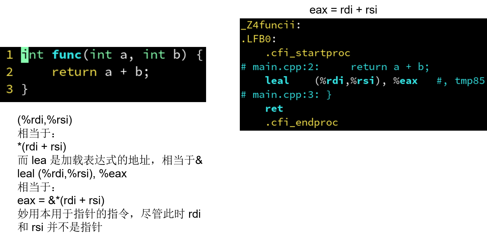|
|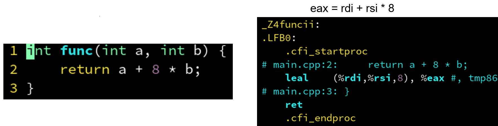|


### 4.0.3 指针的索引: 尽量用 size_t
- size_t 在 64 位系统上相当于 uint64_t
- size_t 在 32 位系统上相当于 uint32_t

从而不需要用`movslq`从 32 位符号扩展到 64 位，更高效。而且也能处理数组大小超过`INT_MAX`的情况，推荐始终用`size_t`表示数组大小和索引。

| ##container## |
|:--:|
|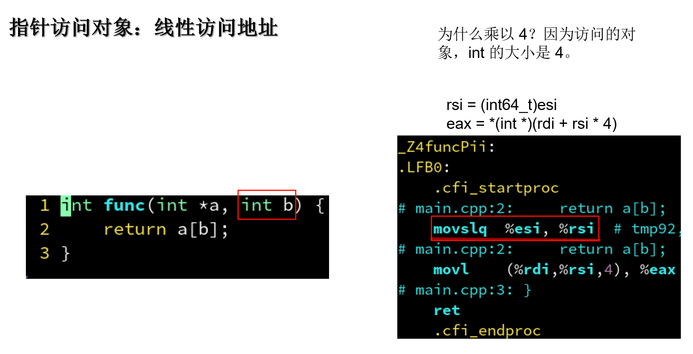|
|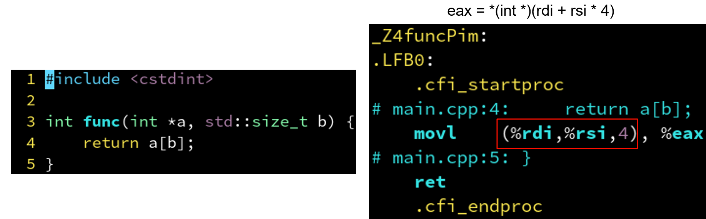|

### 4.0.4 为什么需要 SIMD? 单个指令处理四个数据

| ##container## |
|:--:|
|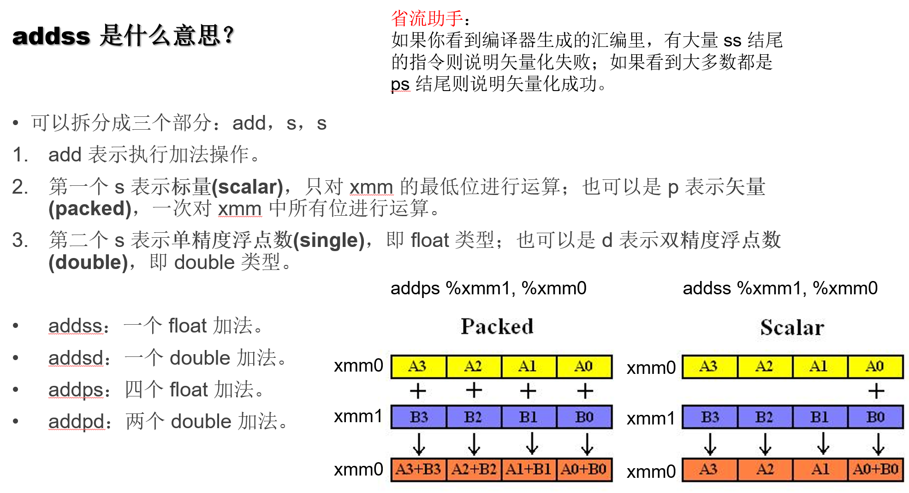|

这种单个指令处理多个数据的技术称为 **SIMD（single-instruction multiple-data）**。

他可以大大增加计算密集型程序的吞吐量。

因为 SIMD 把 4 个 float 打包到一个 xmm 寄存器里同时运算，很像数学中矢量的逐元素加法。因此 SIMD 又被称为矢量，而原始的一次只能处理 1 个 float 的方式，则称为标量。

在一定条件下，编译器能够把一个处理标量 float 的代码，转换成一个利用 SIMD 指令的，处理矢量 float 的代码，从而增强你程序的吞吐能力！

通常认为利用同时处理 4 个 float 的 SIMD 指令可以加速 4 倍。但是如果你的算法不适合 SIMD，则可能加速达不到 4 倍；也有因为 SIMD 让访问内存更有规律，节约了指令解码和指令缓存的压力等原因，出现加速超过 4 倍的情况。

## 4.1 第1章: 化简
### 4.1.1 编译器优化: 代数化简

```C++
int func(int a, int b) {
    int c = a + b;
    int d = a - b;
    return (c + d) / 2; // 会被优化成 a
}
```

### 4.1.2 编译器优化: 常量折叠

| ##container## |
|:--:|
|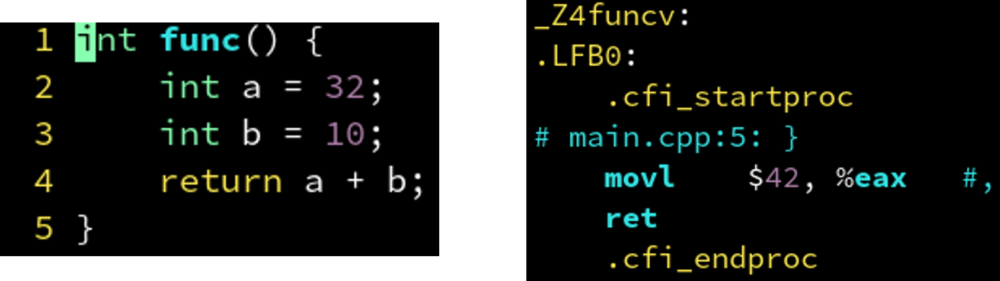|

### 4.1.3 编译器优化: 举个例子

| ##container## |
|:--:|
|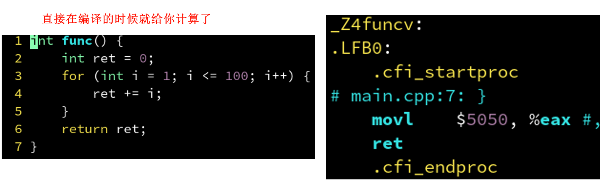|

### 4.1.4 编译器优化: 我毕竟不是万能的

| ##container## |
|:--:|
|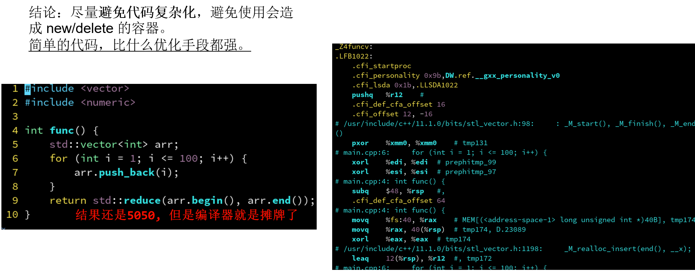|

### 4.1.5 造成 new/delete 的容器: 我是说，内存分配在堆上的容器
存储在堆上（妨碍优化）:
- vector, map, set, string, function, any
- unique_ptr, shared_ptr, weak_ptr

存储在栈上（利于优化）:
- array, bitset, glm::vec, string_view
- pair, tuple, optional, variant

存储在栈上无法动态扩充大小，这就是为什么 vector 这种数据结构要存在堆上，而固定长度的 array 可以存在栈上 (话说C++20的vector好像可以)

具体怎么看? 可以直接`sizeof`, 如果存储的数据量和大小不相关, 那就是堆上.

### 4.1.6 涉及的语句数量过多时，编译器会放弃优化

- 结论: 代码过于复杂，涉及的语句数量过多时，编译器会放弃优化！

简单的代码，比什么优化手段都强。

### 4.1.7 constexpr: 强迫编译器在编译期求值
结论: 如果发现编译器放弃了自动优化，可以用 constexpr 函数迫使编译器进行常量折叠！

不过，constexpr 函数中无法使用非 constexpr 的容器: vector, map, set, string 等...

## 4.2 第2章: 内联
### 4.2.1 调用外部函数: call 指令

`@PLT`是`Procedure Linkage Table`的缩写，即函数链接表。链接器会查找其他`.o`文件中是否定义了`_Z5otheri`这个符号，如果定义了则把这个`@PLT`替换为他的地址。

| ##container## |
|:--:|
|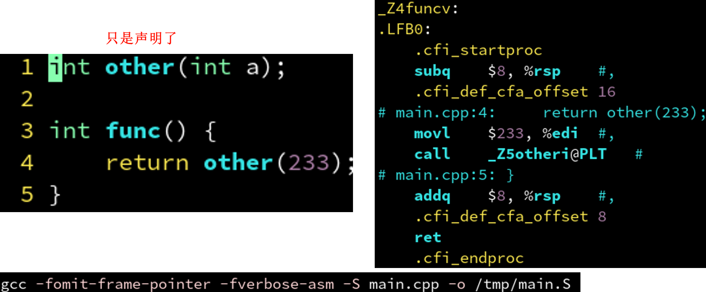|

对 PLT 感兴趣?
- 看 [深入了解GOT,PLT和动态链接](https://www.cnblogs.com/pannengzhi/p/2018-04-09-about-got-plt.html)

### 4.2.2 编译器优化: call 变 jmp

开启`O3`优化后:

| ##container## |
|:--:|
|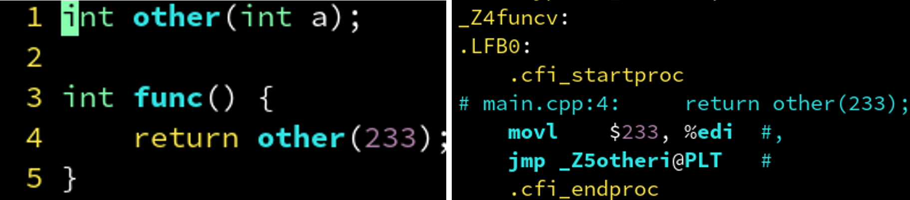|

### 4.2.3 多个函数定义在同一个文件中
如果 _Z5otheri 定义在同一个文件中，编译器会直接调用，没有 @PLT 表示未定义对象。减轻了链接器的负担。

### 4.2.4 编译器优化: 内联化
只有定义在同一个文件的函数可以被内联！否则编译器看不见函数体里的内容怎么内联呢？

为了效率我们可以尽量把常用函数定义在头文件里，然后声明为`static`。这样调用他们的时候编译器看得到他们的函数体，从而有机会内联。

| ##container## |
|:--:|
|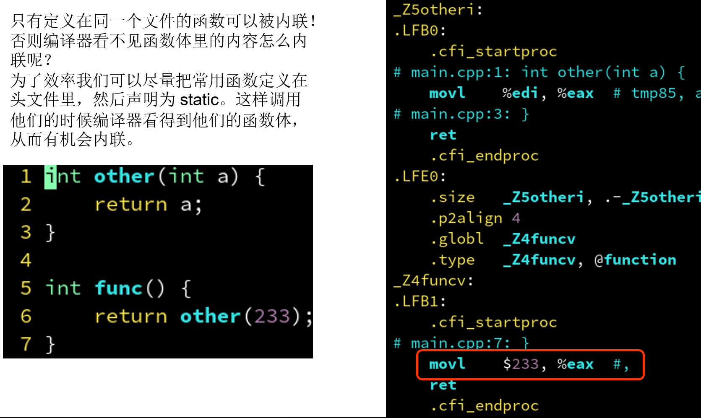|

- 内联: 当编译器看得到被调用函数（other）实现的时候，会直接把函数实现贴到调用他的函数（func）里。

### 4.2.5 局部可见函数: static
因为 static 声明表示不会暴露 other 给其他文件，而且 func 也已经内联了 other，所以编译器干脆不定义 other 了。

### 4.2.6 inline 关键字? 不需要

| ##container## |
|:--:|
|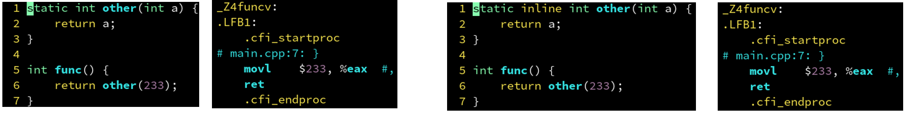|

编译的结果完全一致？
- 结论: 在现代编译器的高强度优化下，加不加`inline`无所谓

编译器不是傻子，只要他看得见`other`的函数体定义，就会自动内联

内联与否和`inline`没关系，**内联与否只取决于是否在同文件，且函数体够小**

要性能的，定义在头文件声明为`static`即可，没必要加`inline`的

`static`纯粹是为了避免多个`.cpp`引用同一个头文件造成冲突，并不是必须`static`才内联

如果你不确定某修改是否能提升性能，那你最好实际测一下，不要脑内模拟

`inline`在现代 C++ 中有其他含义，但和内联没有关系，他是一个迷惑性的名字

### 4.2.7 “大厂面试官”笑话
同样沦为笑柄的还有 register 关键字，号称: 可以让一个变量使用寄存器存储，更高效。

都能把等差数列求和优化成 5050 的编译器笑着看着你，说道: 还要你提醒吗？

> 计算机编程又不是量子物理广义相对论，我们每个人都有电脑，做一下实验很容易，可总有所谓的“老师”就不肯动动手敲几行命令（写doc文件倒挺勤的），在那里传播假知识。
>
> >在线做编译器实验推荐这个网站: https://godbolt.org/
> >
> >可以实时看源代码编译的结果，还能选不同的编译器版本和 flag。
>
> 不要脑内模拟！你误以为某更改对性能有帮助，然而实际测一下时间有一定可能反而变慢。

## 4.3 第3章: 指针
### 4.3.1 告诉编译器别怕指针别名: `__restrict`关键字

| ##container## |
|:--:|
|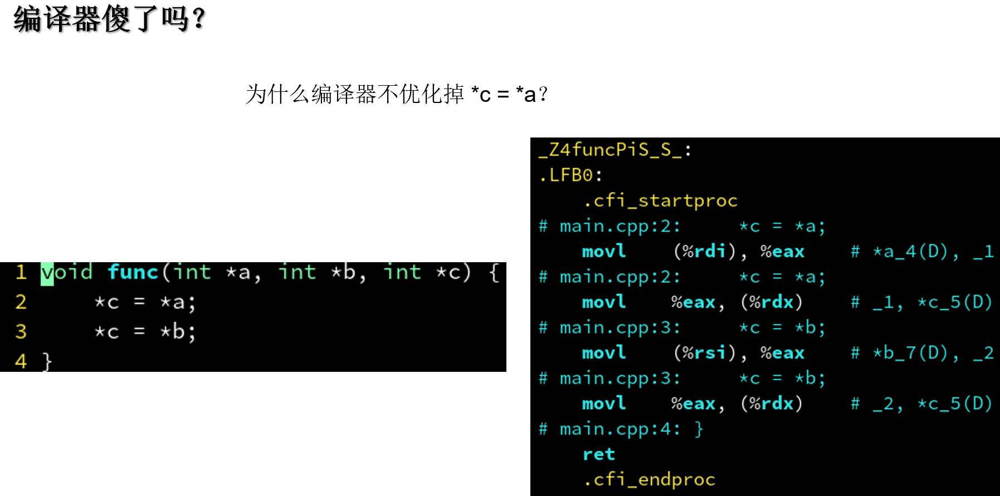|
|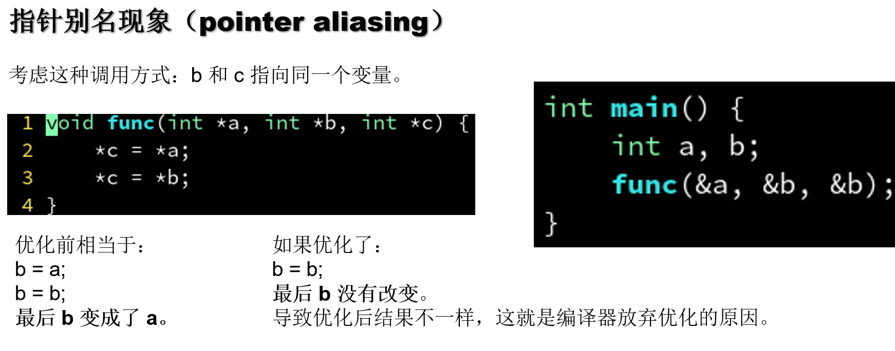|
|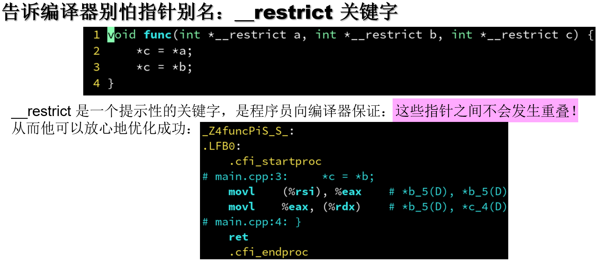|

### 4.3.2 `__restrict`关键字: 只需加在非 const 的即可

| ##container## |
|:--:|
|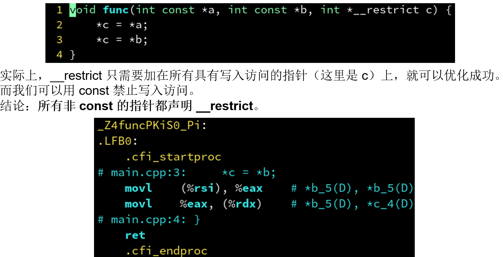|

### 4.3.3 禁止优化: volatile

| ##container## |
|:--:|
|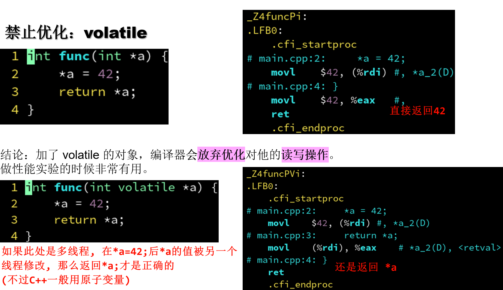|

### 4.3.4 注意一下区别`__restrict`&`volatile`
1. `volatile int *a`或`int volatile *a`
2. `int *__restrict a`

- 语法上区别: volatile 在 * 前面, 而 __restrict 在 * 后面。
- 功能上区别: volatile 是禁用优化, __restrict 是帮助优化。

- 是否属于标准上区别:
    - volatile 和 const 一样是 C++ 标准的一部分。
    - restrict 是 C99 标准关键字，但不是 C++ 标准的关键字。
    - __restrict 其实是编译器的“私货”，好在大多数主流编译器都支持。

~~所以无耻的 C艹标准委员会什么时候肯把他加入标准呢？看看人家 C 语言。~~

### 4.3.5 编译器优化: 合并写入 の 不能跳跃

| ##container## |
|:--:|
|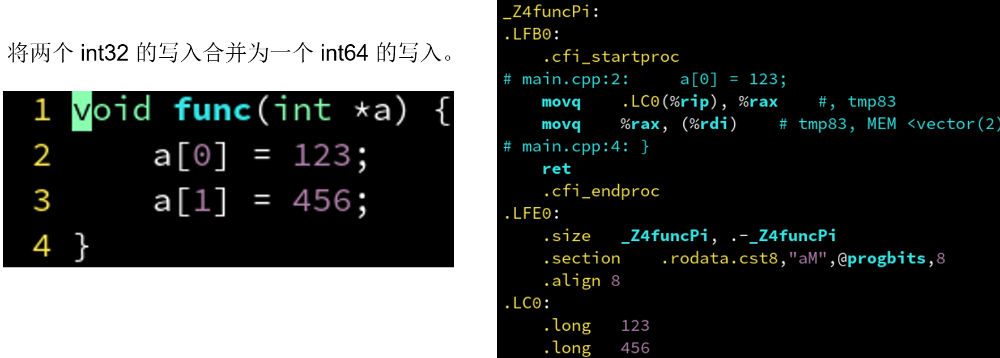|
|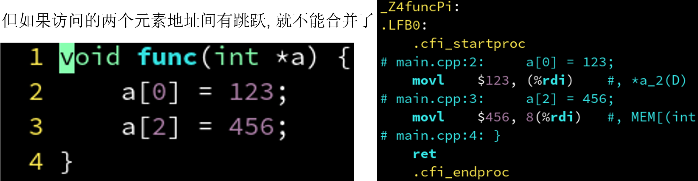|

## 4.4 第4章: 矢量化
### 4.4.1 更宽的合并写入: 矢量化指令 (SIMD)

| ##container## |
|:--:|
|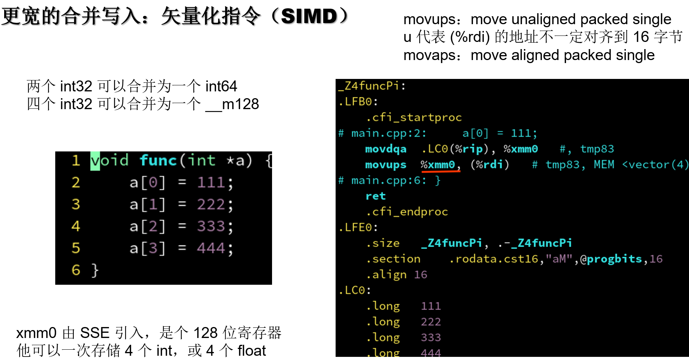|

### 4.4.2 SIMD 指令: 敢不敢再宽一点?

| ##container## |
|:--:|
|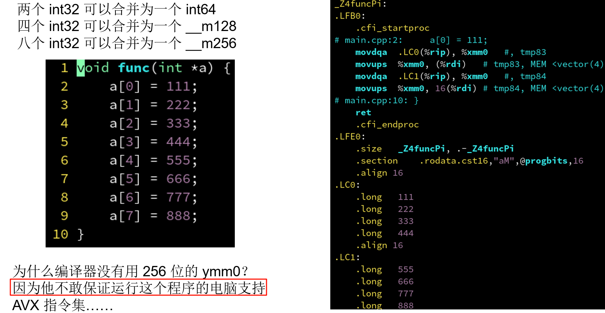|

### 4.4.3 让编译器自动检测当前硬件支持的指令集

> [!TIP]
> 这样就不太具有可移植性了

```C++
gcc -march=native -O3
```

### 4.4.4 数组清零: 自动调用标准库的 memset

| ##container## |
|:--:|
|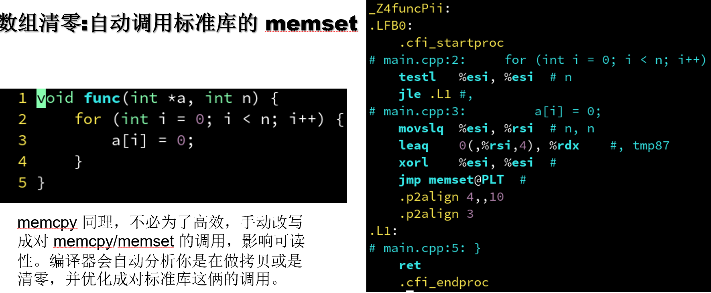|

### 4.4.5 从 0 到 1024 填充: SIMD 加速

```C++
void func(int *a) {
    for (int i = 0; i < 1024; ++i) {
        a[i] = i;
    }
}
```

优化成: // 伪代码

```C++
void func(int *a) {
    __m128i curr = {0, 1, 2, 3};
    __m128i delta = {4, 4, 4, 4};
    for (int i = 0; i < 1024; i += 4) {
        a[i : i + 4] = curr;
        curr += delta;
    }
}
```
一次写入 4 个 int，一次计算 4 个 int 的加法，从而更加高效

但这样有个缺点，那就是数组的大小必须为 4 的整数倍, 否则就会写入越界的地址

### 4.4.6 如果不是 4 的倍数? 边界特判法

| ##container## |
|:--:|
|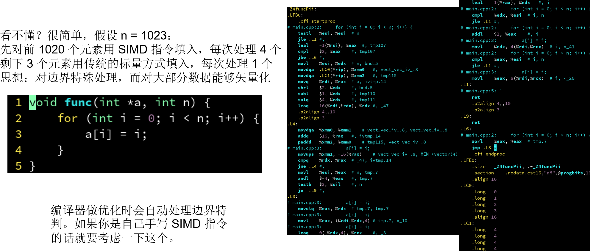|

### 4.4.7 n 总是 4 的倍数? 避免边界特判
如果你能保证 n 总是 4 的倍数，也可以这样写:

```C++
void func(int *a, int n) {
    n = n / 4 * 4;
    for (int i = 0; i < n; ++i) {
        a[i] = i;
    }
}
```

编译器会发现 n % 4 = 0，从而不会生成边界特判的分支。

### 4.4.8 假定指针是 16 字节对齐的: assume_aligned

| ##container## |
|:--:|
|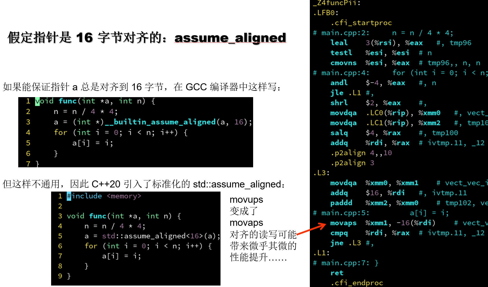|

### 4.4.9 数组求和: reduction 的优化

| ##container## |
|:--:|
|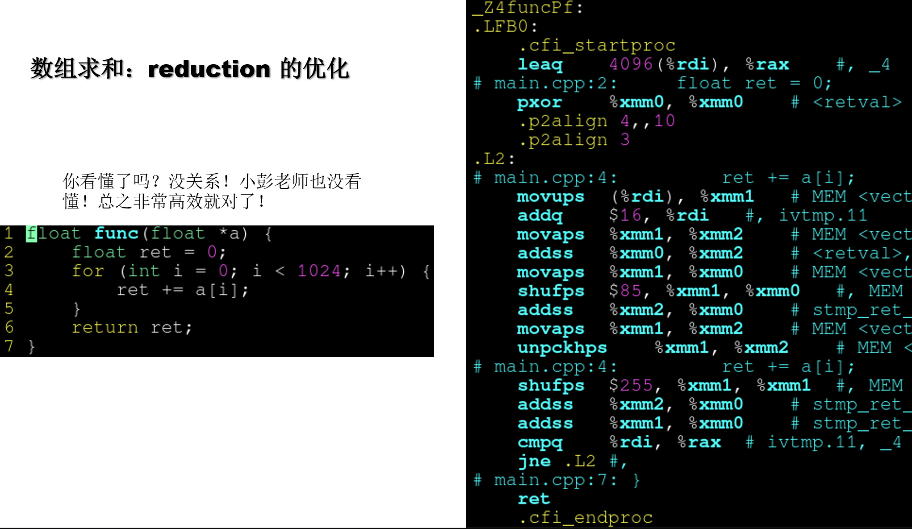|

## 4.5 第5章: 循环
> [!TIP]
> 相比于执行一遍的代码, 根据从计组中学到的`加大概率事件`的原则, 我们更倾向优化`循环`中的代码, 因为他们的执行次数很多, 也称为热代码...

### 4.5.1 循环中的矢量化: 还在伺候指针别名

| ##container## |
|:--:|
|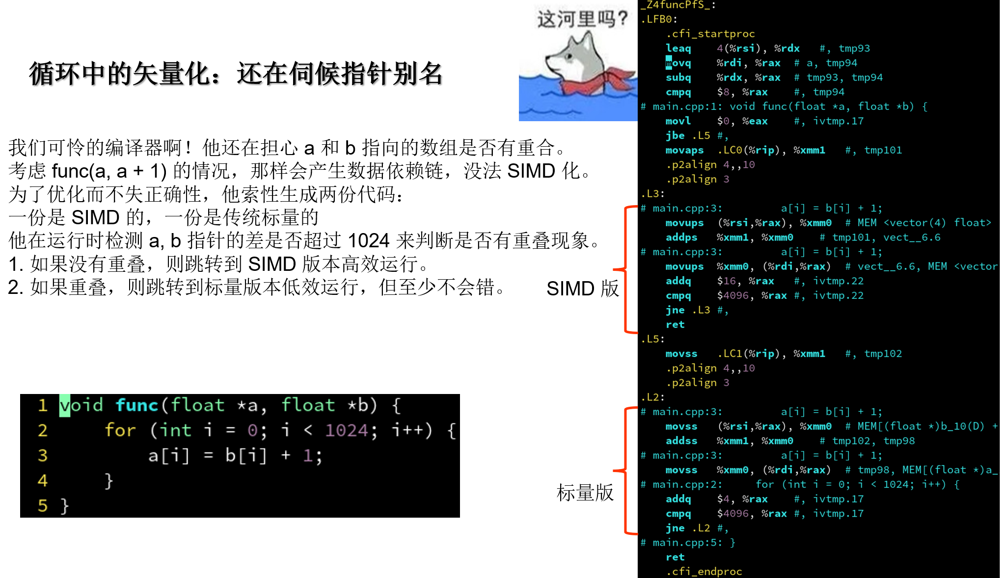|

### 4.5.2 循环中的矢量化: 解决指针别名

| ##container## |
|:--:|
|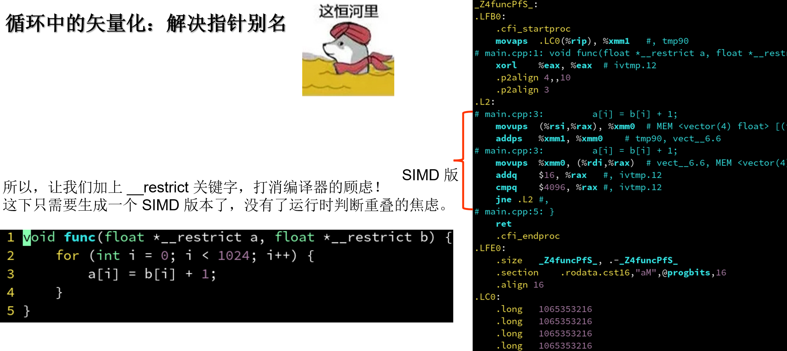|

### 4.5.3 循环中的矢量化: OpenMP 强制矢量化

| ##container## |
|:--:|
|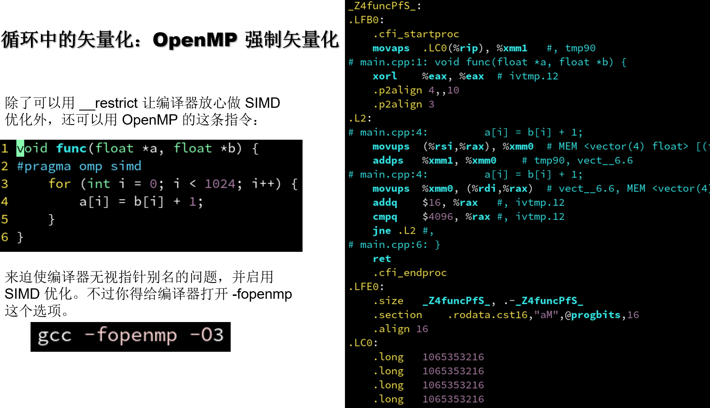|

### 4.5.4 循环中的矢量化: 编译器提示忽略指针别名
除了可以用`__restrict`，`#pragma omp simd`外，对于 GCC 编译器还可以用:

```C++
#pragma GCC ivdep
```
表示忽视下方 for 循环内可能的指针别名现象。

不同的编译器这个 pragma 指令不同，这里只是拿 GCC 举例，其他编译器请自行查找资料。

### 4.5.5 循环中的 if 语句: 挪到外面来

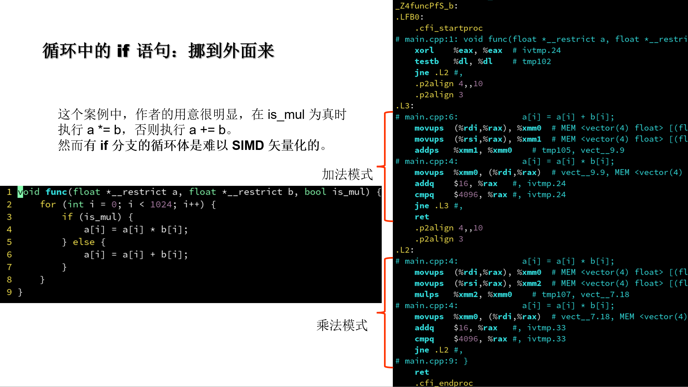

### 4.5.6 循环中的不变量: 挪到外面来

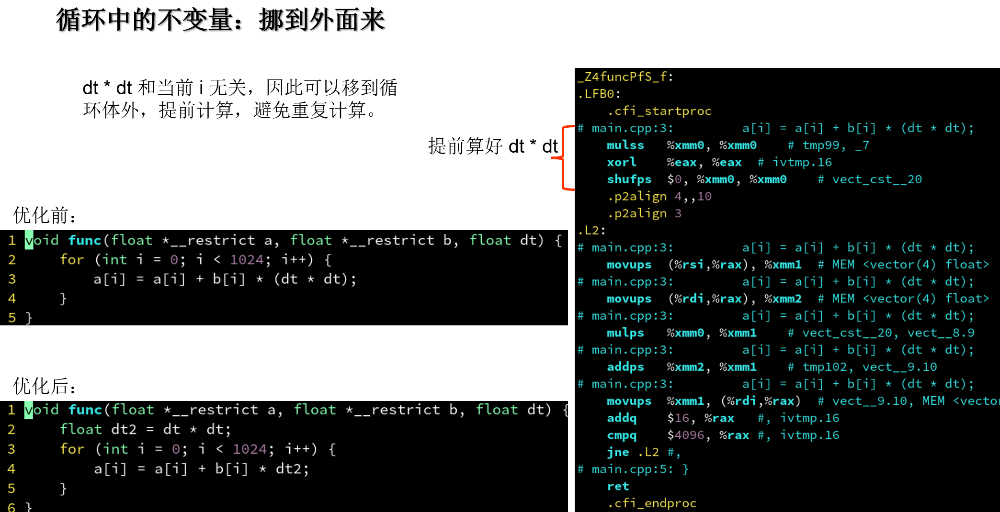

### 4.5.7 挪到外面来: 优化失败

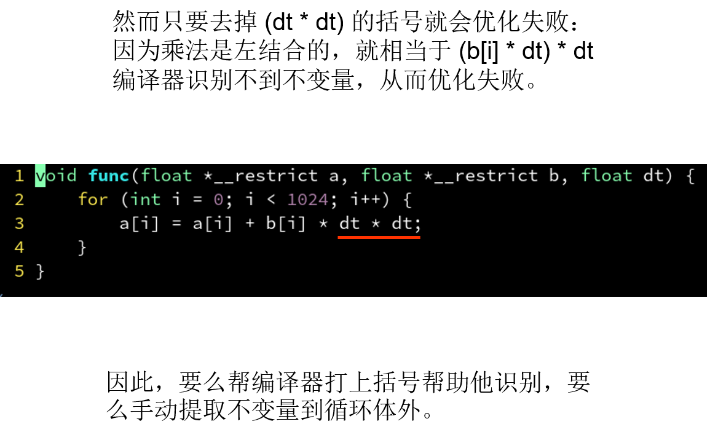

注: 实际上, `dt*dt`不加括号不作优化，是由于浮点运算不满足结合律，因为浮点不能精确表示实数。

### 4.5.8 调用不在另一个文件的函数: SIMD 优化失败
因为编译器看不到那个文件的 other 函数里是什么，哪怕 other 在定义他的文件里是个空函数，他也不敢优化掉。

```C++
void other();

float func(float *a) {
    float ret = 0;
    for (int i = 0; i < 1024; i++) {
        ret += a[i];
        other();
    }
    return ret;
}
```

- 解决方案: 放在同一个文件里

- 结论: 避免在 for 循环体里调用外部函数，把他们移到同一个文件里，或者放在头文件声明为`static`函数。

- 将 other 放到 和 func 同一个 .cpp 文件里，这样编译器看得到 other 的函数体，就可以内联化该函数

### 4.5.9 循环中的下标: 随机访问

- 矢量化失败!

```C++
void func(float *a, int *b) {
    for (int i = 0; i < 1024; i++) {
        a[b[i]] += 1;
    }
}
```

### 4.5.10 循环中的下标: 跳跃访问

- 矢量化部分成功，但是非常艰难

```C++
void func(float *a) {
    for (int i = 0; i < 1024; i++) {
        a[i * 2] += 1;
    }
}
```

### 4.5.11 循环中的下标: 连续访问

- 矢量化大成功!

```C++
void func(float *a) {
    for (int i = 0; i < 1024; i++) {
        a[i] += 1;
    }
}
```

- 结论: 不管是编译器还是 CPU，都喜欢顺序的**连续访问**。

### 4.5.12 为什么需要循环展开

| ##container## |
|:--:|
|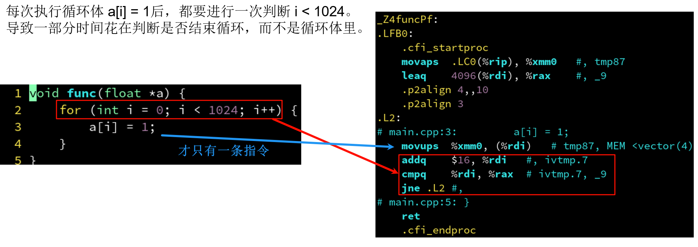|

### 4.5.13 编译器指令: 循环展开

| ##container## |
|:--:|
|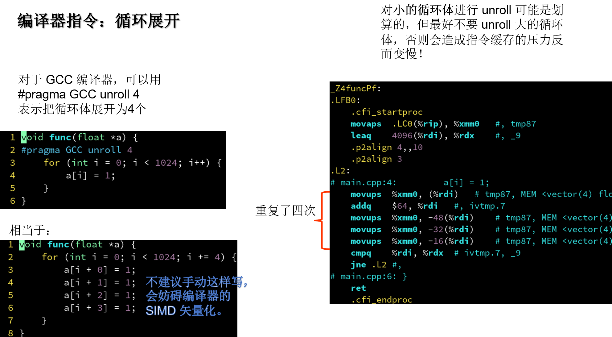|

## 4.6 第6章: 结构体
### 4.6.1 两个 float: 对齐到 8 字节

| ##container## |
|:--:|
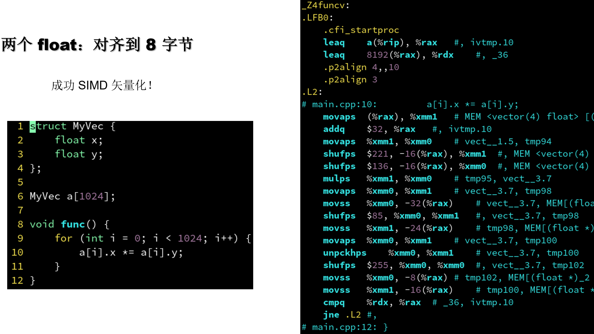

### 4.6.2 三个 float: 对齐到 12 字节

| ##container## |
|:--:|
|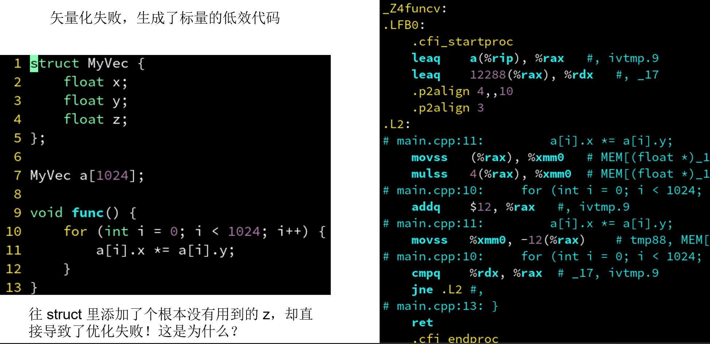|

### 4.6.3 添加一个辅助对齐的变量: 对齐到 16 字节

| ##container## |
|:--:|
|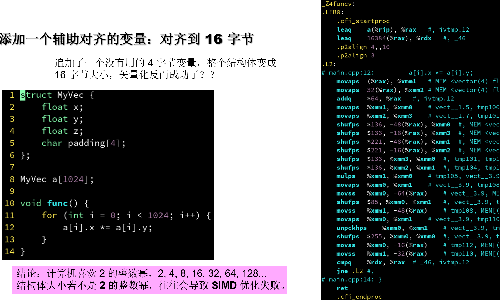|

### 4.6.4 C++11 新语法: alignas

| ##container## |
|:--:|
|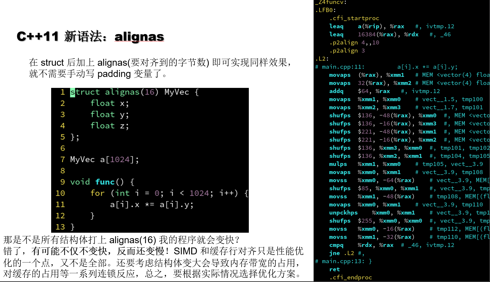|

### 4.6.5 结构体的内存布局: AOS 与 SOA
- AOS（Array of Struct）单个对象的属性紧挨着存
    - xyzxyzxyzxyz

- SOA（Struct of Array）属性分离存储在多个数组
    - xxxxyyyyzzzz

- AOS 必须对齐到 2 的幂才高效，SOA 就不需要。

AOS 符合直觉，不一定要存储在数组这种线性结构，而 SOA 可能无法保证多个数组大小一致。

SOA 不符合直觉，但通常是更高效的！

| ##container## |
|:--:|
|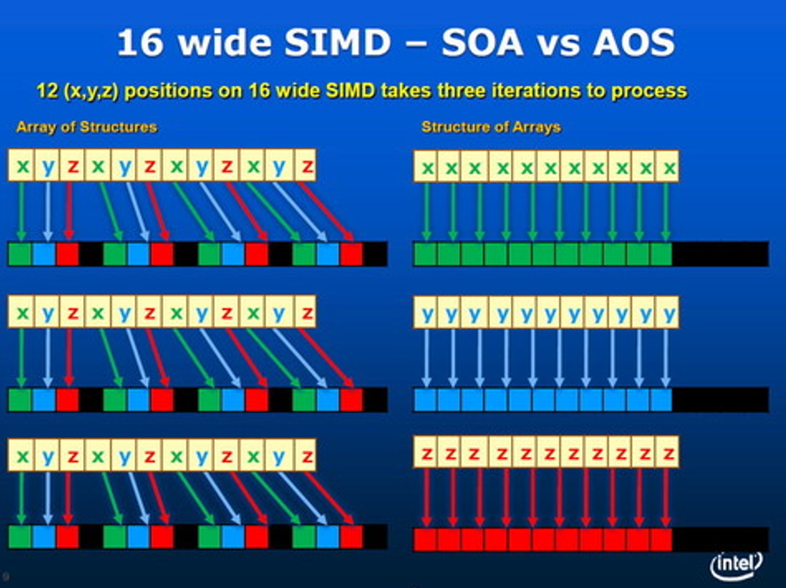|

### 4.6.6 AOS: 紧凑存储多个属性

| ##container## |
|:--:|
|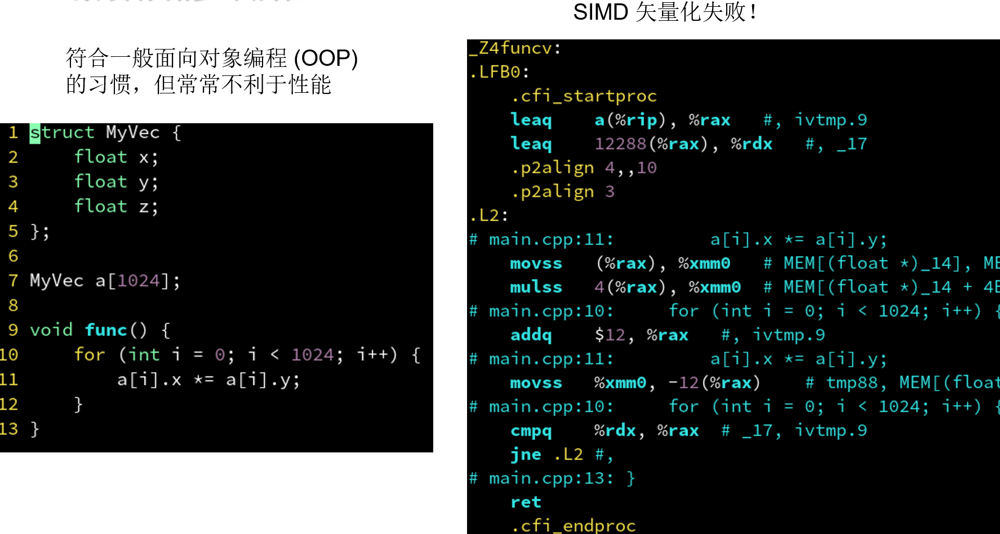|

### 4.6.7 SOA: 分离存储多个属性

| ##container## |
|:--:|
|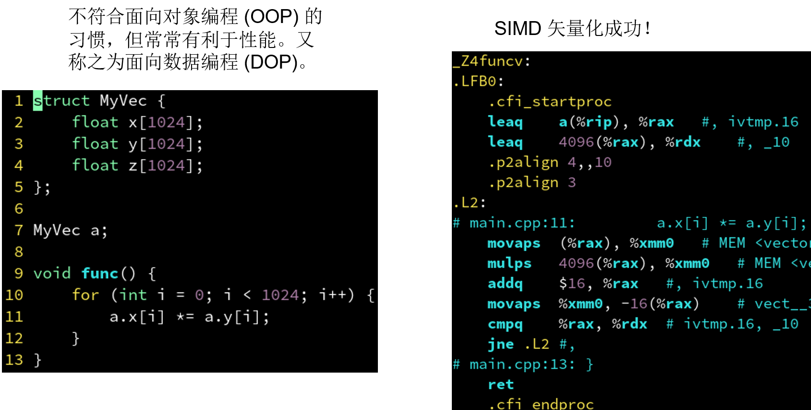|

### 4.6.8 AOSOA: 中间方案

| ##container## |
|:--:|
|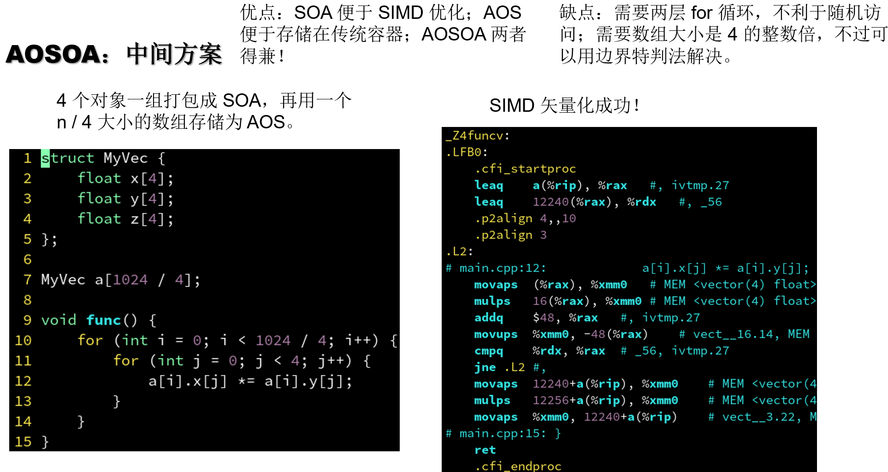|

## 4.7 第7章: STL容器
### 4.7.1 std::vector: 也有指针别名问题

| ##container## |
|:--:|
|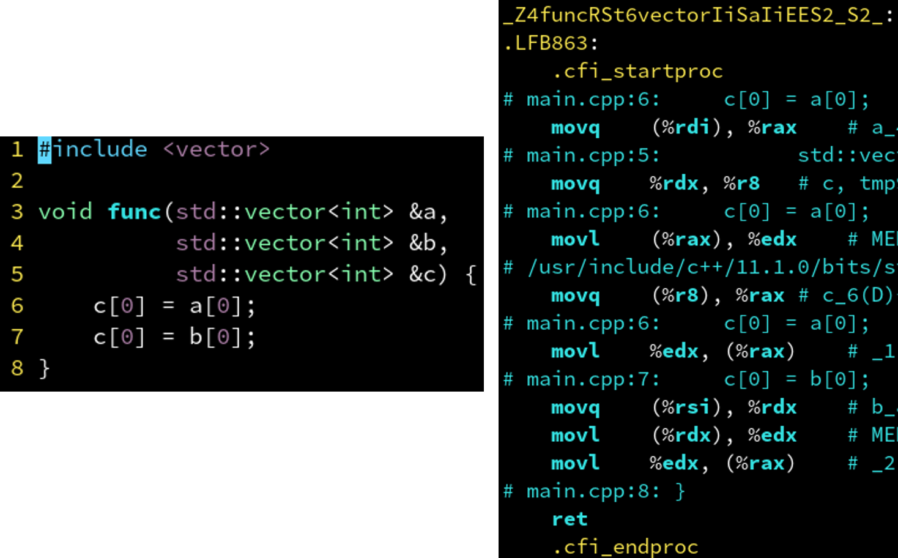|

> [!TIP]
> __restrict: 不能用于`std::vector`

### 4.7.2 解决方案: pragma omp simd 或 pragma GCC ivdep
C/C++ 的缺点：指针的自由度过高，允许多个 immutable reference 指向同一个对象，而 Rust 从语法层面禁止，从而让编译器放心大胆优化。

| ##container## |
|:--:|
|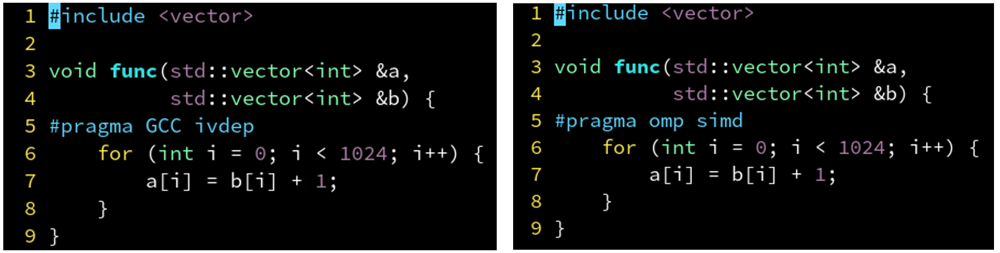|

~~为什么标准委员会不改进一下？因为一旦放弃兼容，就等于抛弃所有历史遗产的全新语言，就和 Rust 无异，从而没有任何理由再学习 C++。~~

### 4.7.3 std::vector: 也能实现 SOA

| ##container## |
|:--:|
|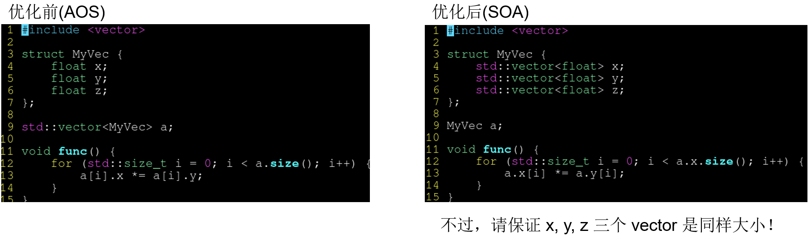|

## 4.8 第8章: 数学运算
### 4.8.1 数学优化: 除法变乘法

```C++
[] () -> float {
    return a / 2; // 等价于 a * 0.5f
};
```

### 4.8.2 编译器放弃的优化: 分离公共除数

- 为什么放弃优化？因为编译器害怕 b = 0。

```C++
[&] (float b) {
    for (int i = 0; i < 1024; ++i) {
        a[i] /= b; // 不会优化为 *= 1/b
    }
};
```

#### 4.8.2.1 解决方案1: 手动优化
乘法比除法更快！提前计算好 b 的倒数避免重复求除法。

```C++
[&] (float b) {
    float inv_b = 1 / b;
    for (int i = 0; i < 1024; ++i) {
        a[i] *= inv_b;
    }
};
```
#### 4.8.2.2 解决方案2: -ffast-math

```sh
gcc -ffast-math -O3
```

`-ffast-math`选项让 GCC 更大胆地尝试浮点运算的优化，有时能带来 2 倍左右的提升。作为代价，他对 NaN 和无穷大的处理，可能会和 IEEE 标准（腐朽的）规定的不一致。

如果你能保证，程序中永远不会出现`NaN`和`无穷大`，那么可以放心打开`-ffast-math`。

---

`-ffast-math`对于:

```C++
[&] (float b) {
    for (int i = 0; i < 1024; ++i) {
        a[i] = std::sqrt(a[i]);
    }
};
```

同样有用, 因为这样编译器就否定了`a[i] < 0`的情况, 可以大胆的优化了...

### 4.8.3 数学函数请加 std:: 前缀!
`abs(1.4f) = 1`，因为 abs 是个参数类型为 int 的函数。

为了避免这种麻烦，请用安全的`std::abs(1.4f) = 1.4f`
- sqrt 只接受 double
- sqrtf 只接受 float
- std::sqrt 重载了 double 和 float（推荐）
- abs 只接受 int
- fabs 只接受 double
- fabsf 只接受 float
- std::abs 重载了 int, double, float（推荐）

总之，请勿用全局的数学函数，他们是 C 语言的遗产。始终用`std::sin`,`std::pow`等。

### 4.8.4 嵌套循环: 直接累加，有指针别名问题

| ##container## |
|:--:|
|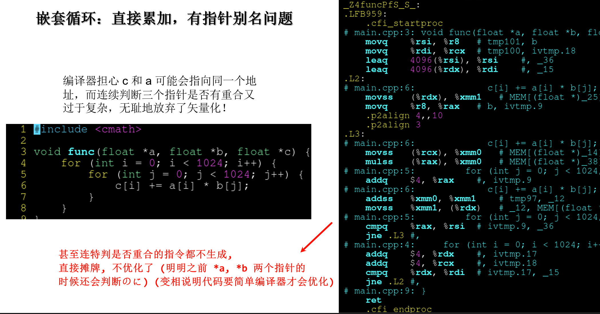|

#### 4.8.4.1 解决方案1: 先读到局部变量，累加完毕后，再写入

- 编译器认为不存在指针别名的问题，矢量化成功!

```C++
void func(float *a, float *b, float *c) {
    for (int i = 0; i < 1024; i++) {
        float tmp = c[i];
        for (int j = 0; j < 1024; j++) {
            tmp += a[i] * b[j];
        }
        c[i] = tmp;
    }
}
```

#### 4.8.4.2 解决方案2: 先累加到初始为 0 的局部变量，再累加到

- 也能矢量化成功！该解决方案比起前一种，由于加法顺序原因，算出来的浮点精度更高。(因为浮点数使用的是科学计数法存储, 所以可能`1e7 + 1e-3 = 1e7`了)

```C++
void func(float *a, float *b, float *c) {
    for (int i = 0; i < 1024; i++) {
        float tmp = 0;
        for (int j = 0; j < 1024; j++) {
            tmp += a[i] * b[j];
        }
        c[i] += tmp;
    }
}
```

## 4.9 优化手法总结
1. 函数尽量写在同一个文件内

2. 避免在 for 循环内调用外部函数

3. 非 const 指针加上`__restrict`修饰

3. 试着用 SOA 取代 AOS

3. 对齐到 16 或 64 字节

3. 简单的代码，不要复杂化

3. 试试看`#pragma omp simd`

3. 循环中不变的常量挪到外面来

3. 对小循环体用`#pragma unroll`

3. `-ffast-math`和`-march=native`

## 4.10 CMake 如何开启?

```CMake
set(CMAKE_BUILD_TYPE Release) # -O3

# CMake 中开启 -fopenmp
find_package(OpenMP REQUIRED)
target_link_libraries(testbench PUBLIC OpenMP::OpenMP_CXX)

# CMake 中开启 -ffast-math 和 -march=native
target_compile_options(testbench PUBLIC -ffast-math -march=native)
```

## 4.11 回家作业

### 评分规则

- 在你的电脑上加速了多少倍，就是多少分！请在 PR 描述中写明加速前后的用时数据。
- 最好详细解释一下为什么这样可以优化。会额外以乘法的形式加分。
- 比如你优化后加速了 50 倍，讲的很详细，所以分数乘 2，变成 100 分！
- 比如你优化后加速了 1000 倍，但是你的 PR 描述是空，所以分数乘 0，变成 0 分！

### 作业要求

利用这次课上所学知识，修改 main.cpp，优化其中的多体引力求解器：

- 不允许使用多线程并行
- 不允许做算法复杂度优化
- 可以针对编译器和平台优化，这次不要求跨平台
- 可以用 xmmintrin.h，如果你觉得编译器靠不住的话

```C++
#include <cstdio>
#include <cstdlib>
#include <vector>
#include <chrono>
#include <cmath>

float frand() {
    return (float)rand() / RAND_MAX * 2 - 1;
}

struct Star {
    float px, py, pz;
    float vx, vy, vz;
    float mass;
};

std::vector<Star> stars;

void init() {
    for (int i = 0; i < 48; i++) {
        stars.push_back({
            frand(), frand(), frand(),
            frand(), frand(), frand(),
            frand() + 1,
        });
    }
}

float G = 0.001;
float eps = 0.001;
float dt = 0.01;

void step() {
    for (auto &star: stars) {
        for (auto &other: stars) {
            float dx = other.px - star.px;
            float dy = other.py - star.py;
            float dz = other.pz - star.pz;
            float d2 = dx * dx + dy * dy + dz * dz + eps * eps;
            d2 *= sqrt(d2);
            star.vx += dx * other.mass * G * dt / d2;
            star.vy += dy * other.mass * G * dt / d2;
            star.vz += dz * other.mass * G * dt / d2;
        }
    }
    for (auto &star: stars) {
        star.px += star.vx * dt;
        star.py += star.vy * dt;
        star.pz += star.vz * dt;
    }
}

float calc() {
    float energy = 0;
    for (auto &star: stars) {
        float v2 = star.vx * star.vx + star.vy * star.vy + star.vz * star.vz;
        energy += star.mass * v2 / 2;
        for (auto &other: stars) {
            float dx = other.px - star.px;
            float dy = other.py - star.py;
            float dz = other.pz - star.pz;
            float d2 = dx * dx + dy * dy + dz * dz + eps * eps;
            energy -= other.mass * star.mass * G / sqrt(d2) / 2;
        }
    }
    return energy;
}

template <class Func>
long benchmark(Func const &func) {
    auto t0 = std::chrono::steady_clock::now();
    func();
    auto t1 = std::chrono::steady_clock::now();
    auto dt = std::chrono::duration_cast<std::chrono::milliseconds>(t1 - t0);
    return dt.count();
}

int main() {
    init();
    printf("Initial energy: %f\n", calc());
    auto dt = benchmark([&] {
        for (int i = 0; i < 100000; i++)
            step();
    });
    printf("Final energy: %f\n", calc());
    printf("Time elapsed: %ld ms\n", dt);
    return 0;
}
```

我的作答:

```C++
#include <cstdio>
#include <cstdlib>
#include <vector>
#include <chrono>
#include <cmath>

static float frand() {
    return (float)rand() / RAND_MAX * 2 - 1;
}

// 换成 SOA
struct Star {
    std::vector<float> px, py, pz, vx, vy, vz, mass;
};

Star stars;

void init() {
    for (std::size_t i = 0; i < 48; ++i) {
        stars.px.push_back(frand());
        stars.py.push_back(frand());
        stars.pz.push_back(frand());
        stars.vx.push_back(frand());
        stars.vy.push_back(frand());
        stars.vz.push_back(frand());
        stars.mass.push_back(frand() + 1);
    }
}

float G = 0.001;
float eps = 0.001;
float dt = 0.01;

void step() {
    for (std::size_t i = 0; i < 48; ++i) {
        for (std::size_t j = 0; j < 48; ++j) {
            float dx = stars.px[j] - stars.px[i];
            float dy = stars.py[j] - stars.py[i];
            float dz = stars.pz[j] - stars.pz[i];
            float mass = stars.mass[j];
            float d2 = dx * dx + dy * dy + dz * dz + eps * eps;
            d2 *= std::sqrt(d2);
            d2 = mass * G * dt / d2;
            stars.vx[i] += dx * d2;
            stars.vy[i] += dy * d2;
            stars.vz[i] += dz * d2;
        }
    }

    for (std::size_t i = 0; i < 48; ++i) {
        stars.px[i] += stars.vx[i] * dt;
        stars.py[i] += stars.vy[i] * dt;
        stars.pz[i] += stars.vz[i] * dt;
    }
}

float calc() {
    float energy = 0;
    for (std::size_t i = 0; i < 48; ++i) {
        float v2 = stars.vx[i] * stars.vx[i] + stars.vy[i] * stars.vy[i] + stars.vz[i] * stars.vz[i];
        energy += stars.mass[i] * v2 * 0.5f;
        for (std::size_t j = 0; j < 48; ++j) {
            float dx = stars.px[j] - stars.px[i];
            float dy = stars.py[j] - stars.py[i];
            float dz = stars.pz[j] - stars.pz[i];
            float d2 = dx * dx + dy * dy + dz * dz + eps * eps;
            energy -= stars.mass[j] * stars.mass[i] * G / std::sqrt(d2) * 0.5f;
        }
    }
    return energy;
}
/* 
 * Clion DEBUG 无优化
Initial energy: -13.414000
Final energy: -13.356842
Time elapsed: 78754 ms

 * 代码优化后
Initial energy: -13.414000
Final energy: -13.356842
Time elapsed: 39932 ms | 39853 ms

 * 再开 -O3 优化后
Initial energy: -13.414000
Final energy: -13.356842
Time elapsed: 900 ms | 909 ms | 902 ms
 * */
template <class Func>
long benchmark(Func const &func) {
    auto t0 = std::chrono::steady_clock::now();
    func();
    auto t1 = std::chrono::steady_clock::now();
    auto dt = std::chrono::duration_cast<std::chrono::milliseconds>(t1 - t0);
    return dt.count();
}

int main() {
    init();
    printf("Initial energy: %f\n", calc());
    auto dt = benchmark([&] {
        for (int i = 0; i < 100000; i++)
            step();
    });
    printf("Final energy: %f\n", calc());
    printf("Time elapsed: %ld ms\n", dt);
    return 0;
}
```
