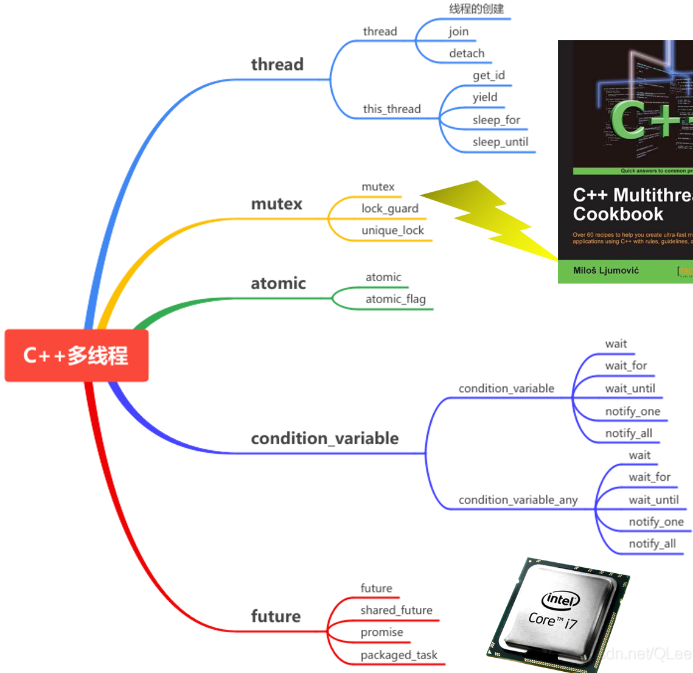
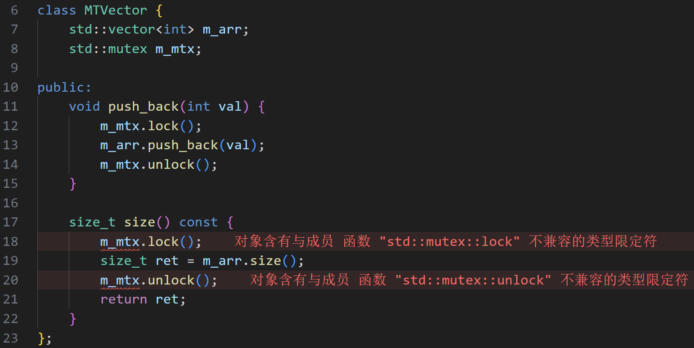

# 五、C++11开始的多线程编程

| ##container## |
|:--:|
||

~~虽然之前已经写过部分的笔记了, 但是这里的更好!甚至会综合设计模式!思维更连贯!~~

## 5.0 第0章: 时间
### 5.0.1 C 语言如何处理时间: time.h

```C
// Linux下 sleep的单位是秒!
long t0 = time(NULL); // 获取从1970年1月1日到当前时经过的秒数
sleep(3);             // 让程序休眠3秒
long t1 = t0 + 3;     // 当前时间的三秒后
usleep(3000000);      // 让程序休眠3000000微秒，也就是3秒
```

C 语言原始的 API，没有类型区分，导致很容易弄错单位，混淆时间点和时间段。

比如`t0 * 3`，乘法对时间点而言根本是个无意义的计算，然而 C 语言把他们看做一样的 long 类型，从而容易让程序员犯错。

### 5.0.2 C++11 引入的时间标准库: std::chrono
利用 C++ 强类型的特点，明确区分时间点与时间段，明确区分不同的时间单位。
- 时间点例子: 2022年1月8日 13点07分10秒
- 时间段例子: 1分30秒
- 时间点类型: `chrono::steady_clock::time_point`等
- 时间段类型: `chrono::milliseconds`，`chrono::seconds`，`chrono::minutes`等

方便的运算符重载：时间点+时间段=时间点，时间点-时间点=时间段

```C++
auto t0 = chrono::steady_clock::now(); // 获取当前时间点
auto t1 = t0 + chrono::seconds(30);    // 当前时间点的30秒后
auto dt = t1 - t0;                     // 获取两个时间点的差（时间段）
int64_t sec = chrono::duration_cast<chrono::seconds>(dt).count(); // 时间差的秒数
```

### 5.0.3 案例: 计算花费的时间

```C++
#include <iostream>
#include <thread>
#include <chrono>

int main() {
    auto t0 = std::chrono::steady_clock::now();
    for (volatile int i = 0; i < 10000000; i++)
        ;
    auto t1 = std::chrono::steady_clock::now();
    auto dt = t1 - t0;
    int64_t ms = std::chrono::duration_cast<std::chrono::milliseconds>(dt).count();
    std::cout << "time elapsed: " << ms << " ms" << std::endl;
    return 0;
}
```

### 5.0.4 时间段: 作为 double 类型

`duration_cast`可以在任意的`duration`类型之间转换

`duration<T, R>`表示用 T 类型表示，且时间单位是 R

- `R`省略不写就是秒，`std::milli`就是毫秒，`std::micro`就是微秒

    - seconds 是`duration<int64_t>`的类型别名
    - milliseconds 是`duration<int64_t, std::milli>`的类型别名

这里我们创建了`double_ms`作为`duration<double, std::milli>`的别名:

```C++
int main() {
    auto t0 = std::chrono::steady_clock::now();
    for (volatile int i = 0; i < 10000000; i++);
    auto t1 = std::chrono::steady_clock::now();
    auto dt = t1 - t0;
    using double_ms = std::chrono::duration<double, std::milli>;
    double ms = std::chrono::duration_cast<double_ms>(dt).count();
    std::cout << "time elapsed: " << ms << " ms" << std::endl;
    return 0;
}
```

### 5.0.5 跨平台的 sleep: std::this_thread::sleep_for
可以用`std::this_thread::sleep_for`替代 Unix 类操作系统专有的的 usleep。他可以让当前线程休眠一段时间，然后继续。

而且单位也可以自己指定，比如这里是 milliseconds 表示毫秒，也可以换成 microseconds 表示微秒，seconds 表示秒，chrono 的强类型让单位选择更自由。

```C++
int main() {
    std::this_thread::sleep_for(std::chrono::milliseconds(400));
    return 0;
}
```

### 5.0.6 睡到时间点: std::this_thread::sleep_until
除了接受一个时间段的`sleep_for`，还有接受一个时间点的`sleep_until`，表示**让当前线程休眠直到某个时间点**。

```C++
int main() {
    auto t = std::chrono::steady_clock::now() + std::chrono::milliseconds(400);
    std::this_thread::sleep_until(t);
    return 0;
}
```

## 5.1 第1章: 线程
### 5.1.1 进程与线程
- **进程**是一个应用程序被操作系统拉起来加载到内存之后从开始执行到执行结束的这样一个过程。简单来说，进程是程序（应用程序，可执行文件）的一次执行。比如双击打开一个桌面应用软件就是开启了一个进程。

- **线程**是进程中的一个实体，是被系统独立分配和调度的基本单位。也有说，线程是CPU可执行调度的最小单位。也就是说，进程本身并不能获取CPU时间，只有它的线程才可以。

从属关系: `进程 > 线程`。一个进程可以拥有多个线程。

- 每个线程共享同样的内存空间，开销比较小。
- 每个进程拥有独立的内存空间，因此开销更大。

对于高性能并行计算，更好的是多线程。

### 5.1.2 为什么需要多线程: 无阻塞多任务
我们的程序常常需要同时处理多个任务。

- 例如: 后台在执行一个很耗时的任务，比如下载一个文件，同时还要和用户交互。

这在 GUI 应用程序中很常见，比如浏览器在后台下载文件的同时，用户仍然可以用鼠标操作其 UI 界面。

```C++
#include <iostream>
#include <thread>
#include <string>

void download(std::string file) {
    for (int i = 0; i < 10; i++) {
        std::cout << "Downloading " << file
                  << " (" << i * 10 << "%)..." << std::endl;
        std::this_thread::sleep_for(std::chrono::milliseconds(400));
    }
    std::cout << "Download complete: " << file << std::endl;
}

void interact() {
    std::string name;
    std::cin >> name;
    std::cout << "Hi, " << name << std::endl;
}

int main() {
    download("hello.zip");
    interact();
    return 0;
}
```

### 5.1.3 没有多线程: 程序未响应
没有多线程的话，就**必须**等文件下载**完了**才能**继续**和用户交互。

下载完成前，整个界面都会处于“未响应”状态，用户想做别的事情就做不了。

### 5.1.4 现代 C++ 中的多线程: std::thread
C++11 开始，为多线程提供了语言级别的支持。他用`std::thread`这个类来表示线程。

`std::thread`构造函数的参数可以是任意 lambda 表达式。

当那个线程启动时，就会执行这个 lambda 里的内容。

这样就可以一边和用户交互，一边在另一个线程里慢吞吞下载文件了。

```C++
int main() {
    std::thread t1([&] {
        download("hello.zip");
    });
    interact();
    return 0;
}
```

### 5.1.5 错误: 找不到符号 pthread_create

但当我们直接尝试编译刚才的代码，却在链接时发生了错误。

- 原来`std::thread`的实现背后是基于 pthread 的。

解决: `CMakeLists.txt`里链接`Threads::Threads`即可:

```CMake
cmake_minimum_required(VERSION 3.10)

set(CMAKE_CXX_STANDARD 17)

project(cpptest LANGUAGES CXX)

add_executable(cpptest main.cpp)

# 跨平台的链接库, cmake将其封装成一个包
find_package(Threads REQUIRED)
target_link_libraries(cpptest PUBLIC Threads::Threads)
```

### 5.1.6 有了多线程: 异步处理请求
有了多线程的话，文件下载和用户交互分别在两个线程，同时独立运行。从而下载过程中也可以响应用户请求，提升了体验。

- 可是发现一个问题: 我输入完 pyb 以后，他的确及时地和我交互了。但是用户交互所在的主线程退出后，文件下载所在的子线程，因为从属于这个主线程，也被迫退出了。

### 5.1.7 主线程等待子线程结束: t1.join()
因此，我们想要让主线程不要急着退出，等子线程也结束了再退出。

可以用`std::thread`类的成员函数`join()`来等待该进程结束。

```C++
int main() {
    std::thread t1([&] {
        download("hello.zip");
    });
    interact();
    std::cout << "Waiting for child thread..." << std::endl;
    t1.join();
    std::cout << "Child thread exited!" << std::endl;
    return 0;
}
```

### 5.1.8 std::thread 的解构函数会销毁线程
作为一个 C++ 类，`std::thread`同样遵循 RAII 思想和三五法则:
- <span style="color:yellow">因为管理着资源，他自定义了解构函数，删除了拷贝构造/赋值函数，但是提供了移动构造/赋值函数。</span>

- 因此，当 t1 所在的函数退出时，就会调用`std::thread`的解构函数，这会销毁`t1`线程。

    所以，`download`函数才会出师未捷身先死——还没开始执行他的线程就被销毁了。

```C++
void myfunc() {
    std::thread t1([&] {
        download("hello.zip");
    });
    // 退出函数体时，会销毁 t1 线程的句柄！
}

int main() {
    myfunc();
    interact();
    return 0;
}
```

### 5.1.9 解构函数不再销毁线程: t1.detach()
解决方案: 调用成员函数`detach()`分离该线程.

- 意味着线程的生命周期不再由当前`std::thread`对象管理，而是在线程退出以后自动销毁自己。

不过这样还是会在**进程退出时候自动退出**。

```C++
void myfunc() {
    std::thread t1([&] {
        download("hello.zip");
    });
    t1.detach();
    // t1 所代表的线程被分离了，不再随 t1 对象销毁
}
```

### 5.1.10 解构函数不再销毁线程: 移动到全局线程池
但是 detach 的问题是进程退出时候不会等待所有子线程执行完毕。所以另一种解法是把 t1 对象移动到一个全局变量去，从而延长其生命周期到 myfunc 函数体外。

这样就可以等下载完再退出了。

```C++
std::vector<std::thread> pool;

void myfunc() {
    std::thread t1([&] {
        download("hello.zip");
    });
    // 移交控制权到全局的 pool 列表，以延长 t1 的生命周期
    pool.push_back(std::move(t1));
}

int main() {
    myfunc();
    interact();
    for (auto &t: pool) t.join();  // 等待池里的线程全部执行完毕
    return 0;
}
```

### 5.1.11 main 函数退出后自动 join 全部线程 (使用单例模式)
但是需要在 main 里面手动 join 全部线程还是有点麻烦，我们可以自定义一个类 ThreadPool，并用他创建一个全局变量，其解构函数会在 main 退出后自动调用。

```C++
class ThreadPool {
    std::vector<std::thread> m_pool;

public:
    void push_back(std::thread thr) {
        m_pool.push_back(std::move(thr));
    }

    ~ThreadPool() {                      // main 函数退出后会自动调用
        for (auto &t: m_pool) t.join();  // 等待池里的线程全部执行完毕
    }
};

ThreadPool tpool; // 构造函数在main函数前执行, 析构函数在main return 0后执行, 就是饿汉单例模式!

void myfunc() {
    std::thread t1([&] {
        download("hello.zip");
    });
    // 移交控制权到全局的 pool 列表，以延长 t1 的生命周期
    tpool.push_back(std::move(t1));
}

int main() {
    myfunc();
    interact();
    return 0;
}
```

### 5.1.12 std::jthread: 符合 RAII 思想，解构时自动 join()
C++20 引入了`std::jthread`类，和`std::thread`不同在于: 他的`解构函数`里会自动调用`join()`函数，从而保证 pool 解构时会**自动等待全部线程执行完毕**。

```C++
// ~jthread() 解构函数里会自动调用 join()，如果 joinable() 的话
std::vector<std::jthread> pool;

void myfunc() {
    std::jthread t1([&] {
        download("hello.zip");
    });
    // 移交控制权到全局的 pool 列表，以延长 t1 的生命周期
    pool.push_back(std::move(t1));
}

int main() {
    myfunc();
    interact();
    return 0;
}
```

```CMake
set(CMAKE_CXX_STANDARD 20)
```

---

~~小彭老师快乐吐槽时间~~

多线程、异步、无阻塞、并发，能提升程序响应速度，对现实世界中的软件工程至关重要。

反面教材: blender 在运行物理解算的时候，界面会卡住，算完一帧后窗口才能刷新一遍，导致解算过程中基本别想做事，这一定程度上归功于 opengl 原始的单线程设计。

正面教材: zeno 可以在解算过程中，随时拖动滑块看前几帧的结果，编辑场景图，修改节点间的连接，为下一次解算做准备，同时当前已经启动的物理解算还能在后台继续正常运行。虽然 zeno 也用了 opengl，但他用多进程成功在 opengl 的百般拖后腿下实现了并发。

## 5.2 第2章: 异步
### 5.2.1 异步好帮手: std::async
`std::async`接受一个**带返回值**的`lambda`，自身返回一个`std::future`对象。

- lambda 的函数体将在另一个线程里执行。

接下来你可以在 main 里面做一些别的事情，download 会持续在后台悄悄运行。

最后调用`future`的`get()`方法，如果此时 download 还没完成，会**等待** download 完成，并获取 download 的返回值。

```C++
#include <future> // 需要的头文件

int main() {
    std::future<int> fret = std::async([&] {
        return download("hello.zip"); // download 返回 404
    });
    interact();
    int ret = fret.get();
    std::cout << "Download result: " << ret << std::endl;
    return 0;
}
```

### 5.2.2 显示地等待: wait()
除了`get()`会等待线程执行完毕外，`wait()`也可以等待他执行完，但是**不会**返回其值。

```C++
int main() {
    std::future<int> fret = std::async([&] {
        return download("hello.zip"); 
    });
    interact();
    std::cout << "Waiting for download complete..." << std::endl;
    fret.wait();
    std::cout << "Wait returned!" << std::endl;
    int ret = fret.get();
    std::cout << "Download result: " << ret << std::endl;
    return 0;
}
```

### 5.2.3 等待一段时间: wait_for()
只要线程没有执行完，`wait()`会无限等下去。

而`wait_for()`则可以指定一个最长等待时间，用`chrono`里的类表示单位。他会返回一个`std::future_status`表示等待是否成功。

如果超过这个时间线程还没有执行完毕，则放弃等待，返回`future_status::timeout`。

如果线程在指定的时间内执行完毕，则认为等待成功，返回`future_status::ready`。

同理还有`wait_until()`其参数是一个时间点。

```C++
int main() {
    std::future<int> fret = std::async([&] {
        return download("hello.zip"); 
    });
    interact();
    while (true) {
        std::cout << "Waiting for download complete..." << std::endl;
        auto stat = fret.wait_for(std::chrono::milliseconds(1000));
        if (stat == std::future_status::ready) {
            std::cout << "Future is ready!!" << std::endl;
            break;
        } else {
            std::cout << "Future not ready!!" << std::endl;
        }
    }
    int ret = fret.get();
    std::cout << "Download result: " << ret << std::endl;
    return 0;
}
```

### 5.2.4 另一种用法: std::launch::deferred 做参数
`std::async`的第一个参数可以设为`std::launch::deferred`，这时不会创建一个线程来执行，他只会把`lambda`函数体内的运算推迟到`future`的`get()`被调用时。也就是 main 中的 interact 计算完毕后。

这种写法，download 的执行仍在主线程中，他只是函数式编程范式意义上的异步，而**不涉及到真正的多线程**。可以用这个实现 **惰性求值(lazy evaluation)** 之类。

```C++
void interact() {
    std::string name;
    std::cin >> name;
    std::cout << "Hi, " << name << std::endl;
}

int main() {
    std::future<int> fret = std::async(std::launch::deferred, [&] {
        return download("hello.zip"); 
    });
    interact(); // 输入后才开始下载 (输入是阻塞的)
    int ret = fret.get();
    std::cout << "Download result: " << ret << std::endl;
    return 0;
}
```

### 5.2.5 std::async 的底层实现: std::promise
如果不想让`std::async`帮你自动创建线程，想要手动创建线程，可以直接用`std::promise`。

然后在线程返回的时候，用`set_value()`设置返回值。在主线程里，用`get_future()`获取其`std::future`对象，进一步`get()`可以等待并获取线程返回值。

```C++
int main() {
    std::promise<int> pret;
    std::thread t1([&] {
        auto ret = download("hello.zip");
        pret.set_value(ret);
    });
    std::future<int> fret = pret.get_future();

    interact();
    int ret = fret.get();
    std::cout << "Download result: " << ret << std::endl;

    t1.join();
    return 0;
}
```

### 5.2.6 std::future 小贴士
future 为了三五法则，**删除了拷贝构造/赋值函数**。如果需要**浅拷贝**，实现**共享同一个`future`对象**，可以用`std::shared_future`。

如果不需要返回值，`std::async`里 lambda 的返回类型可以为`void`， 这时`future`对象的类型为`std::future<void>`。

同理有`std::promise<void>`，他的`set_value()`不接受参数，仅仅作为**同步用**，不传递任何实际的值。

```C++
int main() {
    std::shared_future<void> fret = std::async([&] {
        download("hello.zip"); 
    });
    auto fret2 = fret;
    auto fret3 = fret;
    interact();
    fret3.wait();
    std::cout << "Download completed" << std::endl;
    return 0;
}
```

## 5.3 第3章: 互斥量
### 5.3.1 多线程打架案例
两个线程试图往同一个数组里推数据。
- 奔溃了！为什么？

> [!TIP]
> vector 不是 **多线程安全(MT-safe)** 的容器。

多个线程同时访问同一个 vector 会出现 **数据竞争(data-race)** 现象。

```C++
int main() {
    std::vector<int> arr;
    std::thread t1([&] {
        for (int i = 0; i < 1000; i++) {
            arr.push_back(1);
        }
    });
    std::thread t2([&] {
        for (int i = 0; i < 1000; i++) {
            arr.push_back(2);
        }
    });
    t1.join();
    t2.join();
    return 0;
}
```

### 5.3.2 std::mutex: 上锁，防止多个线程同时进入某一代码段
通俗的说: `mutex`是个厕所，A 同学在用了，B 同学就不能进去，要等 A 同学用完了才能进去。

调用`std::mutex`的`lock()`时，会检测`mutex`是否已经上锁。
- 如果没有锁定，则对`mutex`进行上锁。
- 如果已经锁定，则陷入等待，直到`mutex`被另一个线程解锁后，才再次上锁。

而调用`unlock()`则会进行解锁操作。

这样，就可以保证`mtx.lock()`和`mtx.unlock()`之间的代码段，同一时间只有一个线程在执行，从而避免数据竞争。

```C++
#include <thread>
#include <vector>
#include <mutex>

int main() {
    std::vector<int> arr;
    std::mutex mtx;
    std::thread t1([&] {
        for (int i = 0; i < 1000; i++) {
            mtx.lock();
            arr.push_back(1);
            mtx.unlock();
        }
    });
    std::thread t2([&] {
        for (int i = 0; i < 1000; i++) {
            mtx.lock();
            arr.push_back(2);
            mtx.unlock();
        }
    });
    t1.join();
    t2.join();
    return 0;
}
```

### 5.3.3 std::lock_guard: 符合 RAII 思想的上锁和解锁
根据 RAII 思想，可将锁的持有视为资源，上锁视为锁的获取，解锁视为锁的释放。

`std::lock_guard`就是这样一个工具类，他的`构造函数`里会调用`mtx.lock()`，`解构函数`会调用`mtx.unlock()`。从而**退出函数作用域时能够自动解锁**，避免程序员粗心不小心忘记解锁(或者异常)。

```C++
#include <mutex>

int main() {
    std::vector<int> arr;
    std::mutex mtx;
    std::thread t1([&] {
        for (int i = 0; i < 1000; i++) {
            std::lock_guard grd(mtx);
            arr.push_back(1);
        }
    });
    std::thread t2([&] {
        for (int i = 0; i < 1000; i++) {
            std::lock_guard grd(mtx);
            arr.push_back(2);
        }
    });
    t1.join();
    t2.join();
    return 0;
}
```

### 5.3.4 std::unique_lock: 也符合 RAII 思想，但自由度更高
`std::lock_guard`严格在解构时`unlock()`，但是有时候我们会希望提前`unlock()`。这时可以用`std::unique_lock`，他额外存储了一个`flag`表示是否已经被释放。他会在解构检测这个`flag`，如果没有释放，则调用`unlock()`，否则不调用。

然后可以直接调用`unique_lock`的`unlock()`函数来提前解锁，但是即使忘记解锁也没关系，退出作用域时候他还会自动检查一遍要不要解锁。

```C++
std::thread t2([&] {
    for (int i = 0; i < 1000; i++) {
        std::unique_lock grd(mtx);
        arr.push_back(2);
        grd.unlock();
        printf("outside of lock\n");
        // grd.lock();  // 如果需要，还可以重新上锁
    }
});
```

### 5.3.5 std::unique_lock: 用 std::defer_lock 作为参数
`std::unique_lock`的构造函数还可以有一个额外参数，那就是`std::defer_lock`。

指定了这个参数的话，`std::unique_lock`**不会在构造函数中**调用`mtx.lock()`，需要之后再**手动调用**`grd.lock()`才能上锁。

好处依然是即使忘记`grd.unlock()`也能够自动调用`mtx.unlock()`。

> [!TIP]
> 可以看一下`std::defer_lock_t`，是个空的类，其实这种用一个空`tag`类来区分不同构造函数的思想在 C++ 中很常见，包括`std::inplace`, `std::piecewise_construct`等。
> 
> ```C++
> // Implementation details for std::condition_variable
> class __condvar {
>   /// Do not acquire ownership of the mutex.
>   struct defer_lock_t { explicit defer_lock_t() = default; };
> 
>   /// Tag used to prevent a scoped lock from acquiring ownership of a mutex.
>   _GLIBCXX17_INLINE constexpr defer_lock_t defer_lock { };
> };
> ```


```C++
std::thread t2([&] {
    for (int i = 0; i < 1000; i++) {
        std::unique_lock grd(mtx, std::defer_lock);
        printf("before the lock\n");
        grd.lock();
        arr.push_back(2);
        grd.unlock();
        printf("outside of lock\n");
    }
})
```

### 5.3.6 多个对象? 每个对象一个 mutex 即可
mtx1 用来锁定 arr1，mtx2 用来锁定 arr2。

不同的对象，各有一个`mutex`，独立地上锁，可以避免不必要的锁定，提升高并发时的性能。

还用了一个`{}`包住`std::lock_guard`，限制其变量的作用域，从而可以让他在`}`之前解构并调用`unlock()`，也避免了和下面一个`lock_guard`变量名冲突。

```C++
int main() {
    std::vector<int> arr1;
    std::mutex mtx1;

    std::vector<int> arr2;
    std::mutex mtx2;

    std::thread t1([&] {
        for (int i = 0; i < 1000; i++) {
            {
                std::lock_guard grd(mtx1);
                arr1.push_back(1);
            }

            {
                std::lock_guard grd(mtx2);
                arr2.push_back(1);
            }
        }
    });
    std::thread t2([&] {
        for (int i = 0; i < 1000; i++) {
            {
                std::lock_guard grd(mtx1);
                arr1.push_back(2);
            }

            {
                std::lock_guard grd(mtx2);
                arr2.push_back(2);
            }
        }
    });
    t1.join();
    t2.join();
    return 0;
}
```

### 5.3.7 如果上锁失败，不要等待: try_lock()
我们说过`lock()`如果发现`mutex`已经上锁的话，会等待他直到他解锁。

也可以用无阻塞的`try_lock()`，他在上锁失败时不会陷入等待，而是直接返回`false`；如果上锁成功，则会返回`true`。

比如右边这个例子，第一次上锁，因为还没有人上锁，所以成功了，返回`true`。

第二次上锁，由于自己已经上锁，所以失败了，返回`false`。

```C++
std::mutex mtx1;

int main() {
    if (mtx1.try_lock())
        printf("succeed\n");
    else
        printf("failed\n");

    if (mtx1.try_lock())
        printf("succeed\n");
    else
        printf("failed\n");

    mtx1.unlock();
    return 0;
}
```

### 5.3.8 只等待一段时间: try_lock_for()
`try_lock()`碰到已经上锁的情况，会立即返回`false`。

如果需要等待，但仅限一段时间，可以用`std::timed_mutex`的`try_lock_for()`函数，他的参数是最长等待时间，同样是由`chrono`指定时间单位。超过这个时间还没成功就会“不耐烦地”失败并返回`false`；如果这个时间内上锁成功则返回`true`。

同理还有接受时间点的`try_lock_until()`。

```C++
std::timed_mutex mtx1;

int main() {
    if (mtx1.try_lock_for(std::chrono::milliseconds(500)))
        printf("succeed\n");
    else
        printf("failed\n");

    if (mtx1.try_lock_for(std::chrono::milliseconds(500)))
        printf("succeed\n");
    else
        printf("failed\n");

    mtx1.unlock();
    return 0;
}
```

### 5.3.9 std::unique_lock: 用 std::try_to_lock 做参数
和无参数相比，他会调用`mtx1.try_lock()`而不是`mtx1.lock()`。之后，可以用`grd.owns_lock()`判断是否上锁成功。

```C++
std::mutex mtx;
std::thread t1([&] {
    std::unique_lock grd(mtx, std::try_to_lock);
    if (grd.owns_lock())
        printf("t1 success\n");
    else
        printf("t1 failed\n");
    std::this_thread::sleep_for(std::chrono::milliseconds(1000));
});
```

### 5.3.10 std::unique_lock: 用 std::adopt_lock 做参数
如果当前`mutex`已经上锁了，但是之后仍然希望用 RAII 思想在解构时候自动调用`unlock()`，可以用`std::adopt_lock`作为`std::unique_lock`或`std::lock_guard`的第二个参数，这时他们会默认 mtx 已经上锁。

```C++
std::mutex mtx;
std::thread t2([&] {
    mtx.lock();
    std::unique_lock grd(mtx, std::adopt_lock);
    printf("t2 owns the lock\n");
    std::this_thread::sleep_for(std::chrono::milliseconds(1000));
});
```

当然, 从源码上看, 也是很清晰的:

```C++
unique_lock() noexcept
: _M_device(0), _M_owns(false)
{ }

explicit unique_lock(mutex_type& __m) // 传入锁
: _M_device(std::__addressof(__m)), _M_owns(false) // 初始化
{
lock(); // 上锁: 如果已经锁了会报错
_M_owns = true; // 锁上
}

unique_lock(mutex_type& __m, defer_lock_t) noexcept
: _M_device(std::__addressof(__m)), _M_owns(false) // 初始化, 没有上锁
{ } // 不执行, 需要用户 手动调用grd.lock()

unique_lock(mutex_type& __m, try_to_lock_t)
: _M_device(std::__addressof(__m)), _M_owns(_M_device->try_lock()) // 尝试上锁, 返回值就是 锁是否锁上了
{ }

unique_lock(mutex_type& __m, adopt_lock_t) noexcept
: _M_device(std::__addressof(__m)), _M_owns(true) // 默认用户已经上锁, 不再 lock();
{
// XXX calling thread owns mutex
}
```

### 5.3.11 std::unique_lock 和 std::mutex 具有同样的接口
其实`std::unique_lock`具有`mutex`的所有成员函数: `lock()`,`unlock()`,`try_lock()`,`try_lock_for()`等。除了他会在解构时按需自动调用`unlock()`。

因为`std::lock_guard`无非是调用其构造参数名为`lock()`的成员函数，所以`std::unique_lock`也可以作为`std::lock_guard`的构造参数！

这种只要具有某些指定名字的成员函数，就判断一个类是否满足某些功能的思想，在 Python 称为`鸭子类型`，而 C++ 称为 **concept(概念)**。比起虚函数和动态多态的接口抽象，concept 使实现和接口更加`解耦合`且**没有性能损失**。

```C++
std::mutex mtx;
std::thread t1([&] {
    std::unique_lock grd(mtx, std::defer_lock);
    std::lock_guard grd2(grd);
    printf("t1 owns the lock\n");
    std::this_thread::sleep_for(std::chrono::milliseconds(1000));
});
```

## 5.4 第4章: 死锁
### 5.4.1 同时锁住多个 mutex: 死锁难题
由于同时执行的两个线程，他们中发生的指令不一定是同步的，因此有可能出现这种情况:
- t1 执行 mtx1.lock()。
- t2 执行 mtx2.lock()。
- t1 执行 mtx2.lock(): 失败，陷入等待
- t2 执行 mtx1.lock(): 失败，陷入等待

双方都在等着对方释放锁，但是因为等待而无法释放锁，从而要无限制等下去。

这种现象称为**死锁(dead-lock)**。

```C++
int main() {
    std::mutex mtx1;
    std::mutex mtx2;

    std::thread t1([&] {
        for (int i = 0; i < 1000; i++) {
            mtx1.lock();
            mtx2.lock();
            mtx2.unlock();
            mtx1.unlock();
        }
    });
    std::thread t2([&] {
        for (int i = 0; i < 1000; i++) {
            mtx2.lock();
            mtx1.lock();
            mtx1.unlock();
            mtx2.unlock();
        }
    });
    t1.join();
    t2.join();
    return 0;
}
```

### 5.4.2 解决1: 永远不要同时持有两个锁
最为简单的方法，就是**一个线程永远不要同时持有两个锁**(但是有时候可能会有这个需求)，分别上锁，这样也可以避免死锁。

因此这里双方都在`mtx1.unlock()`之后才`mtx2.lock()`，从而也不会出现一方等着对方的同时持有了对方等着的锁的情况。

```C++
std::thread t1([&] {
    for (int i = 0; i < 1000; i++) {
        mtx1.lock();
        mtx1.unlock();
        mtx2.lock();
        mtx2.unlock();
    }
});
std::thread t2([&] {
    for (int i = 0; i < 1000; i++) {
        mtx2.lock();
        mtx2.unlock();
        mtx1.lock();
        mtx1.unlock();
    }
});
```

### 5.4.3 解决2: 保证双方上锁顺序一致
其实，只需保证双方上锁的顺序一致，即可避免死锁。因此这里调整 t2 也变为先锁 mtx1，再锁 mtx2。

这时，无论实际执行顺序是怎样，都不会出现一方等着对方的同时持有了对方等着的锁的情况。

```C++
std::thread t1([&] {
    for (int i = 0; i < 1000; i++) {
        mtx1.lock();
        mtx2.lock();
        mtx2.unlock();
        mtx1.unlock();
    }
});
std::thread t2([&] {
    for (int i = 0; i < 1000; i++) {
        mtx1.lock();
        mtx2.lock();
        mtx2.unlock();
        mtx1.unlock();
    }
});
```

### 5.4.4 解决3: 用 std::lock 同时对多个上锁
如果没办法保证上锁顺序一致，可以用标准库的`std::lock(mtx1, mtx2, ...)`函数，一次性对多个 mutex 上锁。

他接受任意多个 mutex 作为参数，并且他保证在无论任意线程中调用的顺序是否相同，都不会产生死锁问题。

```C++
std::thread t1([&] {
    for (int i = 0; i < 1000; i++) {
        std::lock(mtx1, mtx2);
        mtx1.unlock();
        mtx2.unlock();
    }
});
std::thread t2([&] {
    for (int i = 0; i < 1000; i++) {
        std::lock(mtx2, mtx1);
        mtx2.unlock();
        mtx1.unlock();
    }
});
```

### 5.4.5 std::lock 的 RAII 版本: std::scoped_lock
和`std::lock_guard`相对应，`std::lock`也有 RAII 的版本`std::scoped_lock`。只不过他可以同时对多个 mutex 上锁。

```C++
int main() {
    std::mutex mtx1;
    std::mutex mtx2;

    std::thread t1([&] {
        for (int i = 0; i < 1000; i++) {
            std::scoped_lock grd(mtx1, mtx2);
            // do something
        }
    });
    std::thread t2([&] {
        for (int i = 0; i < 1000; i++) {
            std::scoped_lock grd(mtx2, mtx1);
            // do something
        }
    });
    t1.join();
    t2.join();
    return 0;
}
```

### 5.4.6 同一个线程重复调用 lock() 也会造成死锁
除了两个线程同时持有两个锁会造成死锁外，即使只有一个线程一个锁，如果`lock()`以后又调用`lock()`，也会造成死锁。

比如右边的`func`函数，上了锁之后，又调用了`other`函数，他也需要上锁。而`other`看到`mtx1`已经上锁，还以为是别的线程上的锁，于是陷入等待。殊不知是调用他的`func`上的锁，`other`陷入等待后`func`里的`unlock()`永远得不到调用。

```C++
std::mutex mtx1;

void other() {
    mtx1.lock();
    // do something
    mtx1.unlock();
}

void func() {
    mtx1.lock();
    other();
    mtx1.unlock();
}

int main() {
    func();
    return 0;
}
```

### 5.4.7 解决1: other 里不要再上锁
遇到这种情况最好是把`other`里的`lock()`去掉，并在其文档中说明: “other 不是线程安全的，调用本函数之前需要保证某 mutex 已经上锁。”

```C++
std::mutex mtx1;

/// NOTE: please lock mtx1 before calling other()
void other() {
    // do something
}

void func() {
    mtx1.lock();
    other();
    mtx1.unlock();
}
```

### 5.4.8 解决2: 改用 std::recursive_mutex
如果实在不能改的话，可以用`std::recursive_mutex`。他会自动判断是不是同一个线程`lock()`了多次同一个锁，如果是则让计数器加1，之后`unlock()`会让计数器减1，减到0时才真正解锁。但是相比普通的`std::mutex`**有一定性能损失**。

> [!TIP]
> 同理还有`std::recursive_timed_mutex`，如果你同时需要`try_lock_for()`的话。

```C++
std::recursive_mutex mtx1;

void other() {
    mtx1.lock();
    // do something
    mtx1.unlock();
}

void func() {
    mtx1.lock();
    other();
    mtx1.unlock();
}
```

## 5.5 第5章: 数据结构
### 5.5.1 案例: 多线程环境中使用 std::vector
刚才说了，vector 不是多线程安全的容器。

多个线程同时访问同一个 vector 会出现数据竞争（data-race）现象。

- 封装一个线程安全的 vector

因此，可以用一个类封装一下对 vector 的访问，使其访问都受到一个 mutex 的保护。

然而却出错了: 因为 size() 是 const 函数，而`mutex::lock()`却不是`const`的。

| ##container## |
|:--:|
||

### 5.5.2 逻辑上 const 而部分成员非 const: mutable
我们要为了支持 mutex 而放弃声明 size() 为 const 吗？

- 不必，size() 在逻辑上仍是 const 的。因此，为了让 this 为 const 时仅仅给 m_mtx 开后门，可以用 mutable 关键字修饰他，从而所有成员里只有他不是 const 的。

```C++
class MTVector {
    std::vector<int> m_arr;
    mutable std::mutex m_mtx; // mutable: 易变的, 性情不定的

public:
    void push_back(int val) {
        m_mtx.lock();
        m_arr.push_back(val);
        m_mtx.unlock();
    }

    size_t size() const { // 没有报错了
        m_mtx.lock();
        size_t ret = m_arr.size();
        m_mtx.unlock();
        return ret;
    }
};
```

### 5.5.3 为什么需要读写锁
- 刚才说过 mutex 就像厕所，同一时刻只有一个人能上。但是如果“上”有两种方式呢？
- 假设在平行世界，厕所不一定是用来拉的，还可能是用来喝的 ~~请勿尝试~~
- 喝厕所里的水时，可以多个人插着吸管一起喝。
- 而拉的时候，只能一个人独占厕所，不能多个人一起往里面拉。
- 喝水的人如果发现厕所里已经有人在拉，那他也不能去喝，否则会喝到“脏数据”。

结论: `读`可以共享，`写`必须独占，且`写`和`读`**不能共存**。

针对这种更具体的情况，又发明了**读写锁**，他允许的状态有:
- n个人读取，没有人写入。
- 1个人写入，没有人读取。
- 没有人读取，也没有人写入。

### 5.5.4 读写锁: shared_mutex
为此，标准库提供了`std::shared_mutex`。

上锁时，要`指定你的需求`是拉还是喝，负责调度的读写锁会帮你`判断要不要等待`。

这里`push_back()`需要修改数据，因需求此为拉，使用`lock()`和`unlock()`的组合。

而`size()`则只要读取数据，不修改数据，因此可以和别人共享一起喝，使用`lock_shared()`和`unlock_shared()`的组合。

```C++
#include <iostream>
#include <thread>
#include <vector>
#include <shared_mutex> // 需要这个头文件

class MTVector {
    std::vector<int> m_arr;
    mutable std::shared_mutex m_mtx;

public:
    void push_back(int val) {
        m_mtx.lock();
        m_arr.push_back(val);
        m_mtx.unlock();
    }

    size_t size() const {
        m_mtx.lock_shared();
        size_t ret = m_arr.size();
        m_mtx.unlock_shared();
        return ret;
    }
};

int main() {
    MTVector arr;

    std::thread t1([&] () {
        for (int i = 0; i < 1000; i++) {
            arr.push_back(i);
        }
    });

    std::thread t2([&] () {
        for (int i = 0; i < 1000; i++) {
            arr.push_back(1000 + i);
        }
    });

    t1.join();
    t2.join();

    std::cout << arr.size() << std::endl;

    return 0;
}
```

### 5.5.5 std::shared_lock: 符合 RAII 思想的 lock_shared()
正如`std::unique_lock`针对`lock()`，也可以用`std::shared_lock`针对`lock_shared()`。这样就可以在函数体退出时自动调用`unlock_shared()`，更加安全了。

> [!TIP]
> `shared_lock`同样支持`defer_lock`做参数，`owns_lock()`判断等，请自行研究...

```C++
#include <mutex> // unique_lock
#include <shared_mutex>

class MTVector {
    std::vector<int> m_arr;
    mutable std::shared_mutex m_mtx;

public:
    void push_back(int val) {
        std::unique_lock grd(m_mtx);
        m_arr.push_back(val);
    }

    size_t size() const {
        std::shared_lock grd(m_mtx);
        return m_arr.size();
    }
};
```

### 5.5.6 只需一次性上锁，且符合 RAII 思想: 访问者模式

OpenVDB 数据结构的访问，也是采用了 Accessor 的设计, 并且还有 ConstAccessor 和 Accessor 两种，分别对应于读和写.

```C++
#include <iostream>
#include <thread>
#include <vector>
#include <mutex>

class MTVector {
    std::vector<int> m_arr;
    std::mutex m_mtx;

public:
    class Accessor {
        MTVector &m_that;
        std::unique_lock<std::mutex> m_guard;

    public:
        Accessor(MTVector &that)
            : m_that(that), m_guard(that.m_mtx)
        {}

        void push_back(int val) const {
            return m_that.m_arr.push_back(val);
        }

        size_t size() const {
            return m_that.m_arr.size();
        }
    };

    Accessor access() {
        return {*this};
    }
};

int main() {
    MTVector arr;

    std::thread t1([&] () {
        auto axr = arr.access(); // 值得注意的是, axr 析构的时候才会解锁(析构 m_guard)
        for (int i = 0; i < 1000; i++) {
            axr.push_back(i);
        }
    });

    std::thread t2([&] () {
        auto axr = arr.access();
        for (int i = 0; i < 1000; i++) {
            axr.push_back(1000 + i);
        }
    });

    t1.join();
    t2.join();

    std::cout << arr.access().size() << std::endl;

    return 0;
}
```

如果这里的`m_mtx`改成读写锁，要如何实现`ConstAccessor access() const`?

## 5.6 第6章: 条件变量
### 5.6.1 条件变量: 等待被唤醒
`cv.wait(lck)`将会让当前线程陷入等待。

在其他线程中调用`cv.notify_one()`则会唤醒那个陷入等待的线程。

可以发现`std::condition_variable`必须和`std::unique_lock<std::mutex>`一起用，稍后会解释原因。

```C++
#include <iostream>
#include <thread>
#include <mutex>
#include <condition_variable>

int main() {
    std::condition_variable cv;
    std::mutex mtx;

    std::thread t1([&] {
        std::unique_lock lck(mtx);
        cv.wait(lck);

        std::cout << "t1 is awake" << std::endl;
    });

    std::this_thread::sleep_for(std::chrono::milliseconds(400));

    std::cout << "notifying..." << std::endl;
    cv.notify_one();  // will awake t1

    t1.join();

    return 0;
}
```

### 5.6.2 条件变量: 等待某一条件成真
还可以额外指定一个参数，变成`cv.wait(lck, expr)`的形式，其中`expr`是个`lambda`表达式，只有其返回值为`true`时才会真正唤醒，否则继续等待。

```C++
int main() {
    std::condition_variable cv;
    std::mutex mtx;
    bool ready = false;

    std::thread t1([&] {
        std::unique_lock lck(mtx);
        cv.wait(lck, [&] { return ready; });

        std::cout << "t1 is awake" << std::endl;
    });

    std::cout << "notifying not ready" << std::endl;
    cv.notify_one();  // useless now, since ready = false

    ready = true;
    std::cout << "notifying ready" << std::endl;
    cv.notify_one();  // awakening t1, since ready = true

    t1.join();

    return 0;
}
```

### 5.6.3 条件变量: 多个等待者
`cv.notify_one()`只会唤醒其中一个等待中的线程，而`cv.notify_all()`会唤醒全部。

这就是为什么`wait()`需要一个`unique_lock`作为参数，因为要保证多个线程被唤醒时，只有一个能够被启动。如果不需要，在`wait()`返回后调用`lck.unlock()`即可。

顺便一提，`wait()`的过程中会暂时`unlock()`这个锁。

```C++
#include <iostream>
#include <thread>
#include <vector>
#include <mutex>
#include <condition_variable>

int main() {
    std::condition_variable cv;
    std::mutex mtx;

    std::thread t1([&] {
        std::unique_lock lck(mtx);
        cv.wait(lck);
        std::cout << "t1 is awake" << std::endl;
    });

    std::thread t2([&] {
        std::unique_lock lck(mtx);
        cv.wait(lck);
        std::cout << "t2 is awake" << std::endl;
    });

    std::thread t3([&] {
        std::unique_lock lck(mtx);
        cv.wait(lck);
        std::cout << "t3 is awake" << std::endl;
    });

    std::this_thread::sleep_for(std::chrono::milliseconds(400));

    std::cout << "notifying one" << std::endl;
    cv.notify_one();  // awakening t1 only

    std::this_thread::sleep_for(std::chrono::milliseconds(400));

    std::cout << "notifying all" << std::endl;
    cv.notify_all();  // awakening t1 and t2

    t1.join();
    t2.join();
    t3.join();

    return 0;
}
```

### 5.6.4 案例: 实现生产者-消费者模式
类似于消息队列...

- 生产者: 厨师，往 foods 队列里推送食品，推送后会通知消费者来用餐。
- 消费者: 等待 foods 队列里有食品，没有食品则陷入等待，直到被通知。

```C++
#include <iostream>
#include <thread>
#include <vector>
#include <mutex>
#include <condition_variable>

int main() {
    std::condition_variable cv;
    std::mutex mtx;

    std::vector<int> foods;

    std::thread t1([&] {
        for (int i = 0; i < 2; i++) {
            std::unique_lock lck(mtx);
            cv.wait(lck, [&] {
                return foods.size() != 0;
            });
            auto food = foods.back();
            foods.pop_back();
            lck.unlock();

            std::cout << "t1 got food:" << food << std::endl;
        }
    });

    std::thread t2([&] {
        for (int i = 0; i < 2; i++) {
            std::unique_lock lck(mtx);
            cv.wait(lck, [&] {
                return foods.size() != 0;
            });
            auto food = foods.back();
            foods.pop_back();
            lck.unlock();

            std::cout << "t2 got food:" << food << std::endl;
        }
    });

    foods.push_back(42);
    foods.push_back(233);
    cv.notify_one();

    foods.push_back(666);
    foods.push_back(4399);
    cv.notify_all();

    t1.join();
    t2.join();

    return 0;
}
```

### 5.6.5 条件变量: 将 foods 队列封装成类

```C++
#include <iostream>
#include <thread>
#include <vector>
#include <mutex>
#include <condition_variable>

template <class T>
class MTQueue {
    std::condition_variable m_cv;
    std::mutex m_mtx;
    std::vector<T> m_arr;

public:
    T pop() {
        std::unique_lock lck(m_mtx);
        m_cv.wait(lck, [this] { return !m_arr.empty(); });
        T ret = std::move(m_arr.back());
        m_arr.pop_back();
        return ret;
    }

    auto pop_hold() {
        std::unique_lock lck(m_mtx);
        m_cv.wait(lck, [this] { return !m_arr.empty(); });
        T ret = std::move(m_arr.back());
        m_arr.pop_back();
        return std::pair(std::move(ret), std::move(lck));
    }

    void push(T val) {
        std::unique_lock lck(m_mtx);
        m_arr.push_back(std::move(val));
        m_cv.notify_one();
    }

    void push_many(std::initializer_list<T> vals) {
        std::unique_lock lck(m_mtx);
        std::copy(
                 std::move_iterator(vals.begin()),
                 std::move_iterator(vals.end()),
                 std::back_insert_iterator(m_arr));
        m_cv.notify_all();
    }
};

int main() {
    MTQueue<int> foods;

    std::thread t1([&] {
        for (int i = 0; i < 2; i++) {
            auto food = foods.pop();
            std::cout << "t1 got food:" << food << std::endl;
        }
    });

    std::thread t2([&] {
        for (int i = 0; i < 2; i++) {
            auto food = foods.pop();
            std::cout << "t2 got food:" << food << std::endl;
        }
    });

    foods.push(42);
    foods.push(233);
    foods.push_many({666, 4399});

    t1.join();
    t2.join();

    return 0;
}
```

### 5.6.6 std::condition_variable 小贴士
1. `std::condition_variable`仅仅支持`std::unique_lock<std::mutex>`作为`wait`的参数，如果需要用其他类型的`mutex`锁，可以用`std::condition_variable_any`。

2. 他还有`wait_for()`和`wait_until()`函数，分别接受`chrono`时间段和时间点作为参数。详见: [std::condition_variable::wait_for | cppreference.com](https://zh.cppreference.com/w/cpp/thread/condition_variable/wait_for)。

## 5.7 第7章: 原子操作
### 5.7.1 经典案例: 多个线程修改同一个计数器
多个线程同时往一个 int 变量里累加，这样肯定会出错，因为`counter += i`在 CPU 看来会变成三个指令:
- 读取 counter 变量到 rax 寄存器
- rax 寄存器的值加上 1
- 把 rax 写入到 counter 变量

即使编译器优化成`add [counter], 1`也没用，因为现代 CPU 为了高效，使用了大量奇技淫巧，比如他会把一条汇编指令拆分成很多**微指令 (micro-ops)**，三个甚至有点保守估计了。

```C++
int main() {
    int counter = 0;

    std::thread t1([&] {
        for (int i = 0; i < 10000; i++) {
            counter += 1;
        }
    });

    std::thread t2([&] {
        for (int i = 0; i < 10000; i++) {
            counter += 1;
        }
    });

    t1.join();
    t2.join();

    std::cout << counter << std::endl;

    return 0;
}
```
问题是，如果有多个线程同时运行，顺序是不确定的:
- t1: 读取 counter 变量，到 rax 寄存器
- t2: 读取 counter 变量，到 rax 寄存器
- t1: rax 寄存器的值加上 1
- t2: rax 寄存器的值加上 1
- t1: 把 rax 写入到 counter 变量
- t2: 把 rax 写入到 counter 变量

如果是这种顺序，最后 t1 的写入就被 t2 覆盖了，从而 counter 只增加了 1，而没有像预期的那样增加 2。

更不用说现代 CPU 还有高速缓存，乱序执行，指令级并行等优化策略，你根本不知道每条指令实际的先后顺序。

### 5.7.2 暴力解决: 用 mutex 上锁
这样的确可以防止多个线程同时修改`counter`变量，从而不会冲突。

问题: mutex 太过重量级，他会让线程被挂起，从而需要通过系统调用，进入内核层，调度到其他线程执行，有很大的开销。

可我们只是想要修改一个小小的 int 变量而已，用昂贵的 mutex 严重影响了效率。

```C++
std::mutex mtx;
int counter = 0;

std::thread t1([&] {
    for (int i = 0; i < 10000; i++) {
        mtx.lock();
        counter += 1;
        mtx.unlock();
    }
});

std::thread t2([&] {
    for (int i = 0; i < 10000; i++) {
        mtx.lock();
        counter += 1;
        mtx.unlock();
    }
});
```

### 5.7.3 建议用 atomic: 有专门的硬件指令加持

```汇编
lock xadd %eax, (%rdx)
```

因此可以用更轻量级的`atomic`，对他的`+=`等操作，会被编译器转换成专门的指令。

CPU 识别到该指令时，会锁住内存总线，放弃乱序执行等优化策略（将该指令视为一个同步点，强制同步掉之前所有的内存操作），从而向你保证该操作是原子 (atomic) 的（取其不可分割之意），不会加法加到一半另一个线程插一脚进来。

对于程序员，只需把 int 改成`atomic<int>`即可，也不必像 mutex 那样需要手动上锁解锁，因此用起来也更直观。

```C++
#include <atomic> // 这个是头文件

std::atomic<int> counter = 0;

std::thread t1([&] {
    for (int i = 0; i < 10000; i++) {
        counter += 1;
    }
});

std::thread t2([&] {
    for (int i = 0; i < 10000; i++) {
        counter += 1;
    }
});
```

### 5.7.4 注意: 请用 +=，不要让 + 和 = 分开
不过要注意了，这种写法:

```C++
counter = counter + 1; // 错，不能保证原子性
counter += 1;          // OK，能保证原子性
counter++;             // OK，能保证原子性
```

### 5.7.5 fetch_add: 和 += 等价
除了用方便的运算符重载之外，还可以直接调用相应的函数名，比如:
- fetch_add 对应于 +=
- store 对应于 =
- load 用于读取其中的 int 值

```C++
std::atomic<int> counter;
counter.store(0);

std::thread t1([&] {
    for (int i = 0; i < 10000; i++) {
        counter.fetch_add(1);
    }
});
```

### 5.7.6 fetch_add: 会返回其旧值
```C++
int old = atm.fetch_add(val)
```
除了会导致 atm 的值增加 val 外，还会返回 atm 增加前的值，存储到 old。

这个特点使得他可以用于并行地往一个列表里追加数据: 追加写入的索引就是`fetch_add`返回的旧值。

当然这里也可以`counter++`，不过要追加多个的话还是得用到`counter.fetch_add(n)`。

```C++
std::atomic<int> counter;
counter.store(0);

std::vector<int> data(20000);

std::thread t1([&] {
    for (int i = 0; i < 10000; i++) {
        int index = counter.fetch_add(1);
        data[index] = i;
    }
});
```

### 5.7.7 exchange: 读取的同时写入
exchange(val) 会把 val 写入原子变量，同时**返回其旧的值**。

```C++
int main() {
    std::atomic<int> counter;

    counter.store(0);

    int old = counter.exchange(3);
    std::cout << "old=" << old << std::endl;  // 0

    int now = counter.load();
    std::cout << "cnt=" << now << std::endl;  // 3

    return 0;
}
```

### 5.7.8 compare_exchange_strong: 读取，比较是否相等，相等则写入
`compare_exchange_strong(old, val)`会**读取原子变量的值，比较他是否和`old`相等**:
- 如果不相等，则把**原子变量**的值写入`old`。
- 如果相等，则把`val`写入**原子变量**。
- 返回一个`bool`值，表示**是否相等**。

注意`old`这里传的其实是一个**引用**，因此`compare_exchange_strong`可修改他的值。~~(还挺绕的...)~~

```C++
int main() {
    boolalpha(std::cout);
    std::atomic<int> counter;

    counter.store(2);

    int old = 1;
    bool equal = counter.compare_exchange_strong(old, 3);
    std::cout << "equal=" << equal << std::endl;  // false
    std::cout << "old=" << old << std::endl;  // 2

    int now = counter.load();
    std::cout << "cnt=" << now << std::endl;  // 2

    old = 2;
    equal = counter.compare_exchange_strong(old, 3);
    std::cout << "equal=" << equal << std::endl;  // true
    std::cout << "old=" << old << std::endl;  // 2

    now = counter.load();
    std::cout << "cnt=" << now << std::endl;  // 3

    return 0;
}
```

### 5.7.9 方便理解的伪代码
为了方便理解，可以假想 atomic 里面是这样实现的:

```C++
template <class T>
struct atomic {
    std::mutex mtx;
    int cnt;

    int store(int val) {
        std::lock_guard _(mtx);
        cnt = val;
    }

    int load() const {
        std::lock_guard _(mtx);
        return cnt;
    }

    int fetch_add(int val) {
        std::lock_guard _(mtx);
        int old = cnt;
        cnt += val;
        return old;
    }

    int exchange(int val) {
        std::lock_guard _(mtx);
        int old = cnt;
        cnt = val;
        return old;
    }

    bool compare_exchange_strong(int &old, int val) {
        std::lock_guard _(mtx);
        if (cnt == old) {
            cnt = val;
            return true;
        } else {
            old = cnt;
            return false;
        }
    }
};
```
可以看到其中`compare_exchange_strong`的逻辑最为复杂，一般简称 CAS (compare-and-swap)，他是并行编程最常用的原子操作之一。实际上任何 atomic 操作，包括`fetch_add`，都可以基于 CAS 来实现: 这就是 Taichi 实现浮点数`atomic_add`的方法。

## 5.8 回家作业
### 作业要求

修改 main.cpp，修复并改进其中的 HTTP 服务器：

- 把 `login`, `register` 等函数变成多线程安全的 - 10 分
- 把 `login` 的登录计时器改成基于 chrono 的 - 5 分
- 能利用 `shared_mutex` 区分读和写 - 10 分
- 用 `lock_guard` 系列符合 RAII 思想 - 5 分
- 让 ThreadPool::create 创建的线程保持后台运行不要退出 - 15 分
- 等待 tpool 中所有线程都结束后再退出 - 5 分

并通过 `main()` 函数中的基本测试。

### 关于内卷

如果你把 map 改成了自己实现的基于 hash 的，甚至是用了 CAS 的。
只要是在 **满足作业要求且不出错** 的基础上，这是件好事！
老师会酌情加分，视为“独特的创新点”，但最多不超过 20 分。

```C++
// 小彭老师作业05：假装是多线程 HTTP 服务器 - 富连网大厂面试官觉得很赞
#include <functional>
#include <iostream>
#include <sstream>
#include <cstdlib>
#include <string>
#include <thread>
#include <map>


struct User {
    std::string password;
    std::string school;
    std::string phone;
};

std::map<std::string, User> users;
std::map<std::string, long> has_login;  // 换成 std::chrono::seconds 之类的

// 作业要求1：把这些函数变成多线程安全的
// 提示：能正确利用 shared_mutex 加分，用 lock_guard 系列加分
std::string do_register(std::string username, std::string password, std::string school, std::string phone) {
    User user = {password, school, phone};
    if (users.emplace(username, user).second)
        return "注册成功";
    else
        return "用户名已被注册";
}

std::string do_login(std::string username, std::string password) {
    // 作业要求2：把这个登录计时器改成基于 chrono 的
    long now = time(NULL);   // C 语言当前时间
    if (has_login.find(username) != has_login.end()) {
        int sec = now - has_login.at(username);  // C 语言算时间差
        return std::to_string(sec) + "秒内登录过";
    }
    has_login[username] = now;

    if (users.find(username) == users.end())
        return "用户名错误";
    if (users.at(username).password != password)
        return "密码错误";
    return "登录成功";
}

std::string do_queryuser(std::string username) {
    auto &user = users.at(username);
    std::stringstream ss;
    ss << "用户名: " << username << std::endl;
    ss << "学校:" << user.school << std::endl;
    ss << "电话: " << user.phone << std::endl;
    return ss.str();
}


struct ThreadPool {
    void create(std::function<void()> start) {
        // 作业要求3：如何让这个线程保持在后台执行不要退出？
        // 提示：改成 async 和 future 且用法正确也可以加分
        std::thread thr(start);
    }
};

ThreadPool tpool;


namespace test {  // 测试用例？出水用力！
std::string username[] = {"张心欣", "王鑫磊", "彭于斌", "胡原名"};
std::string password[] = {"hellojob", "anti-job42", "cihou233", "reCihou_!"};
std::string school[] = {"九百八十五大鞋", "浙江大鞋", "剑桥大鞋", "麻绳理工鞋院"};
std::string phone[] = {"110", "119", "120", "12315"};
}

int main() {
    for (int i = 0; i < 262144; i++) {
        tpool.create([&] {
            std::cout << do_register(test::username[rand() % 4], test::password[rand() % 4], test::school[rand() % 4], test::phone[rand() % 4]) << std::endl;
        });
        tpool.create([&] {
            std::cout << do_login(test::username[rand() % 4], test::password[rand() % 4]) << std::endl;
        });
        tpool.create([&] {
            std::cout << do_queryuser(test::username[rand() % 4]) << std::endl;
        });
    }

    // 作业要求4：等待 tpool 中所有线程都结束后再退出
    return 0;
}
```

我的作业:

```C++
// 小彭老师作业05：假装是多线程 HTTP 服务器 - 富连网大厂面试官觉得很赞
#include <functional>
#include <iostream>
#include <sstream>
#include <cstdlib>
#include <string>
#include <thread>
#include <map>
#include <shared_mutex>
#include <mutex>

struct User {
    std::string password;
    std::string school;
    std::string phone;
};

// 线程安全的 Map
template<class K, class V>
class MTMap {
    std::map<K, V> m_map;
    mutable std::shared_mutex m_s_mtx;
public:
    MTMap() : m_map(), m_s_mtx()
    {}

    template<typename... Args>
    auto emplace(Args&&... args) {
        std::unique_lock _(m_s_mtx);
        return m_map.emplace(std::forward<Args>(args)...);
    }

    // std::size_t count(const K& key) const {
    //     m_s_mtx.lock_shared();
    //     size_t res = m_map.count(key);
    //     m_s_mtx.unlock_shared();
    //     return res;
    // }

    // const V& at(const K& key) const {
    //     m_s_mtx.lock_shared();
    //     const V& res = m_map.at(key);
    //     m_s_mtx.unlock_shared();
    //     return res;
    // }
    std::size_t count(const K& key) const {
        std::shared_lock _(m_s_mtx);
        return m_map.count(key);
    }

    decltype(auto) /*const V&*/ at(const K& key) const {
        std::shared_lock _(m_s_mtx);
        return m_map.at(key);
    }

    // V& operator[] (const K& key) {
    //     m_s_mtx.lock_shared();
    //     V& res = m_map[key];
    //     m_s_mtx.unlock_shared();
    //     return res;
    // }
    // 插入 [Key, Val], 如果已经存在则覆盖
    void insert (const K& key, const V& val) {
        std::unique_lock _(m_s_mtx);
        m_map[key] = val;
    }
};

MTMap<std::string, User> users;
MTMap<std::string, std::chrono::steady_clock::time_point> has_login;  // 换成 std::chrono::seconds 之类的

// 作业要求1：把这些函数变成多线程安全的
// 提示：能正确利用 shared_mutex 加分，用 lock_guard 系列加分
std::string do_register(
        const std::string& username,
        const std::string& password,
        const std::string& school,
        const std::string& phone) {
    User user = {password, school, phone};
    if (users.emplace(username, user).second)
        return "注册成功";
    else
        return "用户名已被注册";
}

std::string do_login(const std::string& username, const std::string& password) {
    // 作业要求2：把这个登录计时器改成基于 chrono 的
    auto now = std::chrono::steady_clock::now();  // 当前时间
    if (has_login.count(username)) {
        auto sec = now - has_login.at(username);  // 算时间差
        // has_login[username] = now;
        has_login.insert(username, now);
        return std::to_string(std::chrono::duration_cast<std::chrono::duration<double>>(sec).count()) + "秒内登录过";
    }

    // 有BUG吧? 这个函数
    if (!users.count(username))
        return "用户名错误";
    if (users.at(username).password != password)
        return "密码错误";
    return "登录成功";
}

std::string do_queryuser(const std::string& username) {
    if (!users.count(username))
        return "没人";
    auto &user = users.at(username);
    std::stringstream ss;
    ss << "用户名: " << username << std::endl;
    ss << "学校:" << user.school << std::endl;
    ss << "电话: " << user.phone << std::endl;
    return ss.str();
}

struct ThreadPool { // 最好是写一个线程池, 这里偷懒~ | 线程太多了, 不能总是创建
private:
    std::vector<std::thread> m_thread_arr;
public:
    ThreadPool() : m_thread_arr()
    {
        std::cout << "Start\n";
    }

    void create(std::function<void()> start) {
        // 作业要求3：如何让这个线程保持在后台执行不要退出？
        // 提示：改成 async 和 future 且用法正确也可以加分
        m_thread_arr.emplace_back(std::thread(start));
//        std::jthread thr(start);
    }

    ~ThreadPool() {
        std::cout << "Ending...\n";
        for (auto&& it : m_thread_arr)
            it.join();
        std::cout << "End\n";
    }
};

ThreadPool tpool;

namespace test {  // 测试用例？出水用力！
    std::string username[] = {"张心欣", "王鑫磊", "彭于斌", "胡原名"};
    std::string password[] = {"hellojob", "anti-job42", "cihou233", "reCihou_!"};
    std::string school[] = {"九百八十五大鞋", "浙江大鞋", "剑桥大鞋", "麻绳理工鞋院"};
    std::string phone[] = {"110", "119", "120", "12315"};
}

int main() {
    for (int i = 0; i < 262144; i++) {
        tpool.create([&] {
            std::cout << do_register(test::username[rand() % 4], test::password[rand() % 4], test::school[rand() % 4], test::phone[rand() % 4]) << std::endl;
        });
        tpool.create([&] {
            std::cout << do_login(test::username[rand() % 4], test::password[rand() % 4]) << std::endl;
        });
        tpool.create([&] {
            std::cout << do_queryuser(test::username[rand() % 4]) << std::endl;
        });
    }

    // 作业要求4：等待 tpool 中所有线程都结束后再退出

    return 0;
}
```
