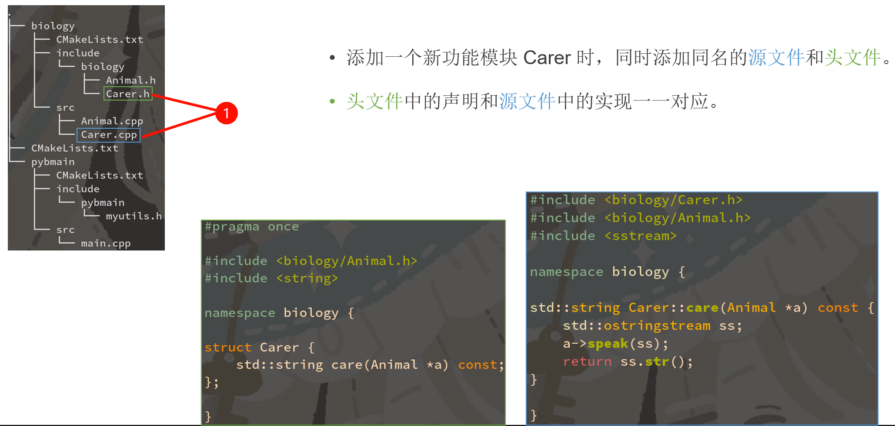
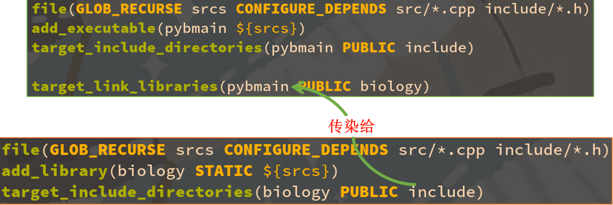

# 现代 CMake 模块化项目管理指南
## 一、第一章: 文件/目录组织规范
### 1.0 推荐的目录组织方式

目录组织格式:

```sh
项目名/include/项目名/模块名.h
项目名/src/模块名.cpp
```

CMakeLists.txt 中写

```C++
target_include_directories(项目名 PUBLIC include)
```

源码文件中写：

```cpp
#include <项目名/模块名.h>
项目名::函数名();
```

头文件(`项目名/include/项目名/模块名.h`)中写:

```h
#pragma once
namespace 项目名 {
void 函数名();
}
```

实现文件（项目名/src/模块名.cpp）中写：

```cpp
#include <项目名/模块名.h>
namespace 项目名 {
void 函数名() { 函数实现 }
}
```

示例:

```sh
./
│  CMakeLists.txt
│
├─biology # 子目录
│  │  CMakeLists.txt
│  │
│  ├─include
│  │  └─biology
│  │          Animal.h
│  │          Carer.h
│  │
│  └─src
│          Animal.cpp
│          Carer.cpp
│
└─pybmain # 子目录
    │  CMakeLists.txt
    │
    ├─include
    │  └─pybmain
    │          myutils.h
    │
    └─src
            main.cpp
```

### 1.1 划分子项目
大型的项目，往往会划分为几个子项目。

即使你只有一个子项目，也建议你先创建一个子目录，方便以后追加新的子项目。

上面的案例中，我们在根目录下，创建了两个子项目 biology 和 pybmain，他们分别在各自的目录下有自己的 CMakeLists.txt。

### 1.2 根项目的 CMakeLists.txt 配置
在根项目的 CMakeLists.txt 中，设置了默认的构建模式，设置了统一的 C++ 版本等各种选项。然后通过`project`命令初始化了根项目。

随后通过`add_subdirectory`把两个子项目 pybmain 和 biology 添加进来（顺序无关紧要），这会调用`pybmain/CMakeLists.txt`和`biology/CMakeLists.txt`。

```CMake
# 设置CMake的最低版本要求为3.18
cmake_minimum_required(VERSION 3.18)

# 如果没有定义CMAKE_BUILD_TYPE，则设置为Release
# 可以使用 cmake -DCMAKE_BUILD_TYPE=Debug .. 来指定
if (NOT CMAKE_BUILD_TYPE)
    set(CMAKE_BUILD_TYPE Release)
endif()

# 设置C++标准为C++20
set(CMAKE_CXX_STANDARD 20)
# 指定C++标准是必需的
set(CMAKE_CXX_STANDARD_REQUIRED ON)
# 禁用编译器的扩展
set(CMAKE_CXX_EXTENSIONS OFF)

# 设置CMake模块路径, 包含当前目录下的cmake文件夹以及之前的路径
set(CMAKE_MODULE_PATH "${CMAKE_CURRENT_LIST_DIR}/cmake;${CMAKE_MODULE_PATH}")

# 定义工程名称为CppCMakeDemo, 并指定语言为C++
project(CppCMakeDemo LANGUAGES CXX)

# 在camke .. 的时候会输出提示目录路径 (可选)
message (STATUS "Prefix dir is ${CMAKE_INSTALL_PREFIX}")
message (STATUS "Binary dir is ${PROJECT_BINARY_DIR}")
message (STATUS "Source dir is ${PROJECT_SOURCE_DIR}")

# 包含自定义的CMake模块MyUsefulFuncs
# include(MyUsefulFuncs)

# ===添加子模块===
add_subdirectory(pybmain)
add_subdirectory(biology)
```

### 1.3 子项目的 CMakeLists.txt 配置
子项目的 CMakeLists.txt 就干净许多，只是创建了 biology 这个静态库对象，并通过 GLOB_RECRUSE 为他批量添加了所有位于 src 和 include 下源码和头文件。

根项目的 CMakeLists.txt 负责处理全局有效的设定。而子项目的 CMakeLists.txt 则仅考虑该**子项目自身**的设定，比如他的头文件目录，要链接的库等等。

```CMake
# 递归查找src目录下的所有.cpp文件和include目录下的所有.h文件, 并将它们的路径存储在srcs变量中
file(GLOB_RECURSE srcs CONFIGURE_DEPENDS src/*.cpp include/*.h)

# 创建一个静态库biology，并将srcs变量中的所有文件添加到该库中
add_library(biology STATIC ${srcs})

# 将include目录添加到biology库的公共包含目录中
# 这样, 任何`链接`到biology库的目标都可以访问include目录中的头文件
target_include_directories(biology PUBLIC include)
```

### 1.4 子项目的头文件
这里我们给 biology 设置了头文件搜索路径 include。

因为子项目的 CMakeLists.txt 里指定的路径都是**相对路径**，所以这里指定 include 实际上是: `根/biology/include`。

注意我们用了 PUBLIC 修饰符，这是为了让链接 biology 的 pybmain 也能够共享 根/biology/include 这个头文件搜索路径。

### 1.5 子项目的源文件
这里我们给 biology 批量添加了 src/*.cpp 下的全部源码文件。

明明只有 *.cpp 需要编译，为什么还添加了`include/*.h`？为了头文件也能被纳入 VS 的项目资源浏览器，方便编辑。

因为子项目的 CMakeLists.txt 里指定的路径都是**相对路径**，所以这里指定 src 实际上是: `根/biology/src`。

### 1.6 复习: GLOB 和 GLOB_RECRUSE 的区别
```CMake
file (GLOB myvar CONFIGURE_DEPENDS src/*.cpp)
file (GLOB_RECURSE myvar CONFIGURE_DEPENDS src/*.cpp)
```

疑问1: 都是按照通配符批量匹配文件，有什么区别？
```CMake
GLOB：        src/main.cpp（√）    src/test/main.cpp（×）
GLOB_RECURSE：    src/main.cpp（√）    src/test/main.cpp（√）
```
区别在于`GLOB_RECURSE`允许 * 匹配嵌套的目录(即递归的搜索)。

疑问2: 加了`CONFIGURE_DEPENDS`这个选项有什么区别？

- 如果不加，在你创建新文件时，`myvar`不会自动更新，还是旧的那几个文件，可能出现`undefined symbol`，需要重新运行`cmake -B build`才能更新。

- 加了，则每次`cmake --build`时自动检测目录是否更新，如果目录有新文件了，CMake 会自动帮你重新运行`cmake -B build`更新`myvar`变量。

### 1.7 头文件和源文件的一一对应关系
通常每个`头文件`都有一个对应的`源文件`，两个文件名字应当相同（方便我们理解，也方便 IDE 跳转），只有后缀名不一样。

如果是一个类，则文件名应和类名相同，方便查找（Animal.cpp）。

`头文件`中包含函数和类的声明，`源文件`则包含他们的实现。

### 1.8 只有头文件，没有源文件的情况
有时我们会直接把实现直接写在头文件里(比如模版或者inline函数)，这时可以没有与之对应的源文件，只有一个头文件。

> [!TIP]
> <span style="color:red">注意: </span><span style="color:yellow">在头文件里直接实现函数时，要加`static`或`inline`关键字。</span>

### 1.9 每新增一个功能模块，需要创建两个文件

| ##container## |
|:--:|
||

### 1.10 一个模块依赖其他模块，则应导入他的头文件
如果新模块（Carer）中用到了其他模块（Animal）的类或函数，则需要在新模块（Carer）的头文件和源文件中都导入其他模块（Animal）的头文件。

注意不论是项目自己的头文件还是外部的系统的头文件，请全部统一采用`<项目名/模块名.h>`的格式。不要用`“模块名.h”`这种相对路径的格式，避免模块名和系统已有头文件名冲突。

### 1.11 依赖其他模块但不解引用，则可以只前向声明不导入头文件
如果模块 Carer 的头文件 Carer.h 虽然引用了其他模块中的 Animal 类，但是他里面并没有解引用 Animal，只有源文件 Carer.cpp 解引用了 Animal。

那么这个头文件是不需要导入`Animal.h`的，只需要一个前置声明`struct Animal`，只有实际调用了`Animal`成员函数的`源文件`需要导入`Animal.h`。

好处: 加快编译速度，防止循环引用。

### 1.12 以项目名为名字空间(namsepace)，避免符号冲突
**在声明和定义外面都套一层名字空间**，例如此处我的子项目名是`biology`，那我就`biology::Animal`。避免暴露全局的`Animal`。这是因为万一有个“不拘一格”的第三方库也暴露个全局的`Animal`，两个符号就会发生冲突，由于类符号都具有`weak`属性，链接器会**随机**选择一个覆盖掉，非常危险！


### 1.13 依赖另一个子项目，则需要链接他
让`pybmain`链接上 biology: `target_link_libraries(pybmain PUBLIC biology)`

由于`PUBLIC`属性具有传染性，`根/biology/include`现在也加入`pybmain`的头文件搜索路径了，因此`pybmain`里可以`#include`到`biology`的头文件。

同理如果又有一个`target_link_libraries(zxxpig PUBLIC pybmain)`那么`zxxpig`也有`pybmain`和`biology`的所有头文件搜索路径了。

| ##container## |
|:--:|
||

### 1.14 你知道吗? CMake 也有 include 功能
和 C/C++ 的`#include`一样，CMake 也有一个`include`命令。

你写`include(XXX)`，则他会在`CMAKE_MODULE_PATH`这个列表中的所有路径下查找`XXX.cmake`这个文件。

这样你可以在`XXX.cmake`里写一些你常用的函数，宏，变量等。

```CMake
# 包含自定义的CMake模块MyUsefulFuncs
# include(MyUsefulFuncs)
```

`根/cmake/MyUsefulFuncs.cmake`:
```CMake
macro (my_add_target name type)
    # 用法: my_add_target(pybmain EXECUTABLE)
    file(GLOB_RECURSE srcs CONFIGURE_DEPENDS src/*.cpp src/*.h)
    if ("${type}" MATCHES "EXECUTABLE")
        add_executable(${name} ${srcs})
    else()
        add_library(${name} ${type} ${srcs})
    endif()
    target_include_directories(${name} PUBLIC include)
endmacro()

set(SOME_USEFUL_GLOBAL_VAR    ON)
set(ANOTHER_USEFUL_GLOBAL_VAR OFF)
```

### 1.15 macro 和 function 的区别
macro 相当于直接把代码粘贴过去，直接访问调用者的作用域。这里写的相对路径 include 和 src，是基于调用者所在路径。

function 则是会创建一个闭包，优先访问定义者的作用域。这里写的相对路径 include 和 src，则是基于定义者所在路径。

> https://cmake.org/cmake/help/latest/command/function.html
>
> https://cmake.org/cmake/help/latest/command/macro.html

### 1.16 include 和 add_subdirectory 的区别
include 相当于直接把代码粘贴过去，直接访问调用者的作用域。这里创建的变量和外面共享，直接`set(key val)`则调用者也有`${key}`这个变量了。

function 中则是基于定义者所在路径，优先访问定义者的作用域。这里需要`set(key val PARENT_SCOPE)`才能修改到外面的变量。

## 二、第二章: 第三方库/依赖项配置
用 find_package 寻找系统中安装的第三方库并链接他们

### 2.1 find_package 命令
常用参数列表一览:

```CMake
find_package(<PackageName> [version] [EXACT] [QUIET] [CONFIG] [MODULE]
             [REQUIRED] [[COMPONENTS] [components...]]
             [OPTIONAL_COMPONENTS components...]
)
```

> https://cmake.org/cmake/help/latest/command/find_package.html

### 2.2 find_package 命令用法举例

```CMake
# 查找名为 OpenCV 的包，找不到不报错，事后可以通过 ${OpenCV_FOUND} 查询是否找到。
find_package(OpenCV)

# 查找名为 OpenCV 的包，找不到不报错，也不打印任何信息。
find_package(OpenCV QUIET)

# 查找名为 OpenCV 的包，找不到就报错（并终止 cmake 进程，不再继续往下执行）。
find_package(OpenCV REQUIRED) # 最常见用法

# 查找名为 OpenCV 的包，找不到就报错，且必须具有 OpenCV::core 和 OpenCV::videoio 这两个组件，
# 如果没有这两个组件也会报错。
find_package(OpenCV REQUIRED COMPONENTS core videoio)

# 查找名为 OpenCV 的包，找不到就报错，可具有 OpenCV::core 和 OpenCV::videoio 这两个组件，
# 没有这两组件不会报错，通过 ${OpenCV_core_FOUND} 查询是否找到 core 组件。
find_package(OpenCV REQUIRED OPTIONAL_COMPONENTS core videoio)
```

### 2.3 find_package 说是找“包”，到底是在找什么?
`find_package(OpenCV)`实际上是在找一个名为`OpenCVConfig.cmake`的文件。

注: 出于历史兼容性考虑，除了`OpenCVConfig.cmake`以外`OpenCV-config.cmake`这个文件名也会被 CMake 识别到。

同理，`find_package(Qt5)`则是会去找名为`Qt5Config.cmake`的文件。

这些形如`包名 + Config.cmake`的文件，我称之为**包配置文件**。

`Qt5Config.cmake`是你安装 Qt5 时，随`libQt5Core.so`等实际的库文件，一起装到你的系统中去的。以我的 Arch Linux 系统为例:
- 包配置文件位于`/usr/lib/cmake/Qt5/Qt5Config.cmake`。
- 实际的动态库文件位于`/usr/lib/libQt5Core.so`。

因此`find_package`并**不是**直接去找具体的动态库文件和头文件（例如`libQt5Core.so`）。

而是去找包配置文件（例如Qt5Config.cmake），这个配置文件里包含了包的具体信息，包括动态库文件的位置，头文件的目录，链接时需要开启的编译选项等等。而且某些库都具有多个子动态库，例如 Qt 就有 libQt5Core.so、libQt5Widgets.so、libQt5Network.so。因此 CMake 要求所有第三方库作者统一包装成一个`Qt5Config.cmake`文件包含所有相关信息（类似于 nodejs 的 package.json），比你单独的一个个去找动态库文件要灵活的多。

包配置文件由第三方库的作者（Qt的开发团队）提供，在这个库安装时（Qt的安装程序或apt install等）会自动放到`/usr/lib/cmake/XXX/XXXConfig.cmake`这个路径（其中XXX是包名），供 CMake 用户找到并了解该包的具体信息。

`/usr/lib/cmake`这个位置是 CMake 和第三方库作者约定俗成的，由第三方库的安装程序负责把包配置文件放到这里。如果第三方库的作者比较懒，没提供 CMake 支持（由安装程序提供XXXConfig.cmake），那么得用另外的一套方法（FindXXX.cmake），稍后细谈。

> 未完待续, 用到再说

# 附件: 快速构建脚本
## 一、根目录快速构建

## 二、快速构建子目录

```sh
#!/bin/bash

# 使用: sh ./newCodeDir 项目名称
# 定义一个函数来输出带颜色、下划线和闪烁效果的文本
print_colored_text() {
    local color=$1
    local text=$2
    local style="\033[${color}m"
    local reset="\033[0m"
    echo -e "${style}${text}${reset}"
}

# 定义一个函数来输出带时间和内容的固定格式
print_formatted_message() {
    local time_style=$1
    local content_style=$2
    local message=$3
    local nowTime=$(date "+%Y-%-m-%-d %H:%M:%S")
    
    local time_text="\033[${time_style}m[${nowTime}]\033[0m"
    local content_text="\033[${content_style}m${message}\033[0m"

    echo -e "${time_text}: ${content_text}"
}

# 定义颜色代码
RED="31"
GREEN="32"
YELLOW="33"
BLUE="34"
MAGENTA="35"
CYAN="36"
WHITE="37"
UNDERLINE="4"
BLINK="5"

# 检查是否提供了名称参数
if [ $# -eq 0 ]; then
    print_formatted_message "${RED}" "${YELLOW}" "请提供一个名称作为项目名称, 如果使用下划线, 则会以驼峰命名法命名类!"
    exit 1
fi

name=$1
nowTime=$(date "+%Y-%-m-%-d %H:%M:%S")

# 检查并转换为驼峰命名并确保首字母大写
if [[ "$name" =~ ^[a-zA-Z][a-zA-Z0-9]*$ ]]; then
    # 如果名称符合驼峰命名规则，则不做变换
    camelCaseName="$name"
else
    # 否则，假设名称是下划线分隔的，进行转换
    camelCaseName=$(echo "$name" | sed -r 's/(^|_)([a-zA-Z])/\U\2/g')
fi

# 创建目录结构
mkdir -p ./$name/include/$name
mkdir -p ./$name/src/$name

# 创建.h文件
cat > ./$name/include/$name/$name.h <<EOL
#pragma once
/*
 * Copyright Heng_Xin. All rights reserved.
 *
 * @Author: Heng_Xin
 * @Date: $nowTime
 *
 * Licensed under the Apache License, Version 2.0 (the "License");
 * you may not use this file except in compliance with the License.
 * You may obtain a copy of the License at
 *
 *      https://www.apache.org/licenses/LICENSE-2.0
 *
 * Unless required by applicable law or agreed to in writing, software
 * distributed under the License is distributed on an "AS IS" BASIS,
 * WITHOUT WARRANTIES OR CONDITIONS OF ANY KIND, either express or implied.
 * See the License for the specific language governing permissions and
 * limitations under the License.
 * */
#ifndef _HX_${name^^}_H_
#define _HX_${name^^}_H_

namespace $name {

class $camelCaseName {

};

} // namespace $name

#endif // _HX_${name^^}_H_
EOL

# 创建.cpp文件
cat > ./$name/src/$name/$name.cpp <<EOL
#include <$name/$name.h>

namespace $name {

} // namespace $name
EOL

# 创建CMakeLists.txt文件
cat > ./$name/CMakeLists.txt <<EOL
cmake_minimum_required(VERSION 3.10)

project($name LANGUAGES CXX)

# 递归查找
file(GLOB_RECURSE srcs CONFIGURE_DEPENDS src/*.cpp include/*.h)

# 创建静态库: $name
add_library($name STATIC \${srcs})

# 将include目录添加到$name库的公共包含目录中
target_include_directories($name PUBLIC include)
EOL

print_formatted_message "${GREEN}" "${YELLOW}" "项目 $name($camelCaseName) 创建完成! 请及时添加到根目录CMake!"
print_formatted_message "${GREEN}" "${BLUE};${UNDERLINE}" "add_subdirectory($name)\033[0m \033[5;32m# 添加这个"
```
