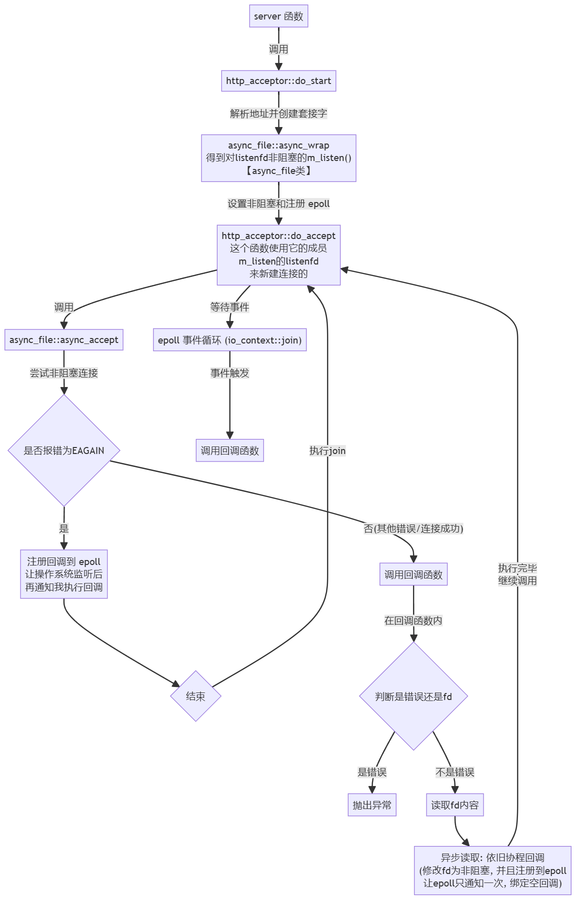

# 手搓Http 22万并发 epoll Linux C++17 服务器
> 学习: [【C++17】小彭老师陪你从零手搓HTTP服务器](https://www.bilibili.com/video/BV1Mz421i7Fm/)

采用: **单线程异步，又称事件循环**

## ゼロ、环境准备
- C++17 (+)
- GCC
- Linux
- 依赖库: [fmt](github.com/fmtlib/fmt) (比`printf`的打印效率还高!)

## 一、事前准备: 了解Linux函数的错误码
### 1.1 Error处理

Linux系统函数都是返回`-1`表示错误. 而具体什么错误, 我们却需要通过`errno`的值来查看, 而`errno`值代表什么意思, 又需要`strerror`查看:

```C++
// 建立socket套接字
if ((_serverFd = ::socket(AF_INET, SOCK_STREAM, 0)) < 0) {
  LOG_ERROR("socket Error: %s (errno: %d)", strerror(errno), errno);
}
```

每次都要检查, 有时候还需要排除某些错误码, 都这样写, 都这样打印, 那不烦也烦死啦

所以直接封装:

```C++
[[noreturn]] void _throw_system_error(const char *what) {
    auto ec = std::error_code(errno, std::system_category());
    fmt::println(stderr, "{}: {} ({}.{})", what, ec.message(), ec.category().name(), ec.value()); // 打印异常的位置和原因
    throw std::system_error(ec, what);
}

template <int Except = 0, class T>
T check_error(const char *what, T res) {
    if (res == -1) {
        if constexpr (Except != 0) {
            if (errno == Except) {
                return -1;
            }
        }
        _throw_system_error(what); // 直接抛出
    }
    return res;
}

#define SOURCE_INFO_IMPL_2(file, line) "In " file ":" #line ": "
#define SOURCE_INFO_IMPL(file, line) SOURCE_INFO_IMPL_2(file, line)
#define SOURCE_INFO(...) SOURCE_INFO_IMPL(__FILE__, __LINE__) __VA_ARGS__
#define CHECK_CALL_EXCEPT(except, func, ...) check_error<except>(SOURCE_INFO() #func, func(__VA_ARGS__))
#define CHECK_CALL(func, ...) check_error(SOURCE_INFO(#func), func(__VA_ARGS__))
```

使用:

```C++
// 原本写法
do {
    int flags = ::fcntl(fd, F_GETFL, 0);
    if (flags == -1) { // 获取文件描述符标志
        LOG_ERROR("设置fd为非阻塞时出错! %s (errno: %d)", strerror(errno), errno);
        ::close(fd);
        break;
    }
    flags |= O_NONBLOCK;
    if (::fcntl(fd, F_SETFL, flags) == -1) { // 设置文件状态标志为非阻塞
        LOG_ERROR("设置fd为非阻塞时出错! %s (errno: %d)", strerror(errno), errno);
        ::close(fd);
        break;
    }
    return;
} while(0);
// 其他错误处理...

// =-=-=-=-=-=-=-=-=-=-=-=

// 使用封装
int flags = CHECK_CALL(fcntl, fd, F_GETFL);
flags |= O_NONBLOCK;
CHECK_CALL(fcntl, fd, F_SETFL, flags);
```

### 1.2 查看Error
即便打印了错误原因, 但是还是看不懂思密达, 它是殷格利胥...

好在 [C 库函数 - setlocale()](https://www.runoob.com/cprogramming/c-function-setlocale.html) 中有`用于设置或查询程序的本地化信息`的库awa!

```C++
// C 标准库 - <locale.h>
setlocale(LC_ALL, "zh_CN.UTF-8");
```

这样, 它就说你看得懂的话了~

## 二、[V1.0] 正片开始
### 2.1 认识协程
- [【协程第一话】协程到底是怎样的存在？](https://www.bilibili.com/video/BV1b5411b7SD/)
- [【协程第二话】协程和IO多路复用更配哦~](https://www.bilibili.com/video/BV1a5411b7aZ/)

(拓展阅读: [[译] Linux 异步 I/O 框架 io_uring：基本原理、程序示例与性能压测（2020）](https://arthurchiao.art/blog/intro-to-io-uring-zh/), 结论: 几乎只提升5%)

### 2.2 为什么使用协程
我们为什么使用`epoll + 协程`的方式, 而不是 **多线程 + epoll** 呢?

首先, 网络请求它是一个I/O密集型任务, 它需要等待读写. 即便多线程, 也是会在`::recv`等地方, 等待数据. 如果是epoll LE + 非阻塞, 然后返回`-1`, 错误码是`请尝试`, 然后你就一种在此处尝试, 会有极大的性能浪费, 并且造成CPU空转. (频繁的内核和用户态的转换...), 总之就是不好, 并且线程数量有限, 不能全部都这样吧? 总会有连接成功的吧?

所以我们能不能换个思路? (假设现在只有一个线程:)

I/O密集, 我们在等待I/O的时候, 能不能不要直接切换到内核态? 而是直接去做哪些已经读取好的I/O的任务, 解析请求, 再发回响应. 而不是在这样干等, CPU空转...

说白了就是: 前台来了个老哥A, 我们只有一个服务员, 我们看到老哥A在这里边思考边说, 就等待老哥A说完先, 而在这个时候先去处理已经说完的老哥B的事情, 比如烧烤, 然后老哥A说完了我们再做它的事情, 这样就保证了我们手上一直有东西做...

像这样, 实现在用户态实现的类似操作系统的调度的, 我们就称作`协程`!

因此使用协程完成这个任务再合适不过啦~

那么, 新的问题又来了, 怎么实现呢? 好像很难啊? 协不会!

### 2.3 手撕协程
#### 2.3.1 回调函数的类模板
```C++
// 这个 `callback` 结构体模板是一种用于存储和调用可变参数回调函数的类模板。
// 它主要通过类型擦除和多态来实现这一点。
template <class ...Args>
struct callback {

    // 基础回调基类
    struct _callback_base {
        // 定义一个通用的 `_call` 方法。所有具体的回调实现都会继承自这个基类，并实现 `_call` 方法。
        virtual void _call(Args... args) = 0;
        virtual ~_callback_base() = default;
    };

    // 具体回调实现类模板
    template <class F>
    struct _callback_impl final : _callback_base {
        F m_func;

        template <class ...Ts, class = std::enable_if_t<std::is_constructible_v<F, Ts...>>>
        _callback_impl(Ts &&...ts) : m_func(std::forward<Ts>(ts)...) 
        {}

        // 这个类模板继承自 `_callback_base`，并实现了 `_call` 方法。
        // 它持有一个具体的函数对象 `m_func`，并在 `_call` 方法中调用该函数对象。
        void _call(Args... args) override {
            m_func(std::forward<Args>(args)...);
        }
    };

    // 基础回调基类 独享智能指针, 用于持有具体的回调实现。
    std::unique_ptr<_callback_base> m_base;

    // 构造函数
    // 通过模板参数和`std::enable_if`限制，确保传入的函数对象是可调用的，并且不是`callback`本身的类型。
    // 这个构造函数会创建一个`_callback_impl`实例，并将其存储在`m_base`中。
    template <class F, class = std::enable_if_t<std::is_invocable_v<F, Args...> && !std::is_same_v<std::decay_t<F>, callback>>>
    callback(F &&f) : m_base(std::make_unique<_callback_impl<std::decay_t<F>>>(std::forward<F>(f))) {}

/**
 * 注: std::is_invocable<F, Args...> 是一个类型特征模板，
 * 它会返回一个布尔值（std::true_type 或 std::false_type），表示可调用对象 F 是否能够接受参数 Args... 并成功调用。
 * std::is_invocable_v<F, Args...> 是 std::is_invocable<F, Args...>::value 的简写，直接提供布尔值。
 * 
 * std::decay_t<F> 是 C++11 中引入的类型特征，用于获取类型 F 的衍生类型（decayed type）。
 * 它会去掉类型的引用、const、volatile 修饰符，并将数组和函数类型转换为对应的指针类型。
 * 例如，std::decay_t<int&> 会是 int，std::decay_t<int[10]> 会是 int*。
 * 你可以通过 std::decay 来移除类型的引用和常量修饰符，并进行其他类型调整。
 * 此处, 保证 F 和 callback 不是相同类型及其衍生
 */
    callback() = default;

    // 不可拷贝
    callback(callback const &) = delete;
    callback &operator=(callback const &) = delete;

    // 可以移动
    callback(callback &&) = default;
    callback &operator=(callback &&) = default;

    // 调用存储的回调函数
    void operator()(Args... args) const {
        assert(m_base);
        return m_base->_call(std::forward<Args>(args)...);
    }

    // 获取存储的具体回调实现对象
    template <class F>
    F &target() const {
        assert(m_base);
        return static_cast<_callback_impl<F> &>(*m_base);
    }

    // 用于泄露和恢复回调对象的地址，主要用于某些需要手动管理内存的场景
    // 主动内存泄漏
    void *leak_address() {
        return static_cast<void *>(m_base.release());
    }

    // 恢复回调对象的地址
    static callback from_address(void *addr) {
        callback cb;
        cb.m_base = std::unique_ptr<_callback_base>(static_cast<_callback_base *>(addr));
        return cb;
    }
};
```

#### 2.3.2 使用: 以连接为例

- 节选出部分的代码逻辑, 以体验协程的书写方式: 请跟踪`acceptor->do_start("127.0.0.1", "8080");`的调用

```C++
void server() {
    io_context ctx; // 全局的epoll fd
    auto acceptor = http_acceptor::make();
    acceptor->do_start("127.0.0.1", "8080"); // init
    ctx.join();
}

// @brief 异步文件操作类
struct async_file {
    int m_fd = -1;

    async_file() = default;

    explicit async_file(int fd) : m_fd(fd) {}

    // @brief 静态工厂方法: 将fd设置为非阻塞, 注册epoll监听 (EPOLLET)
    static async_file async_wrap(int fd) {
        int flags = CHECK_CALL(fcntl, fd, F_GETFL);
        flags |= O_NONBLOCK;
        CHECK_CALL(fcntl, fd, F_SETFL, flags);

        struct epoll_event event;
        event.events = EPOLLET;   // 设置边沿触发模式, 监听读事件
        event.data.ptr = nullptr; // fd 对应 回调函数 (没有)
        CHECK_CALL(epoll_ctl, io_context::get().m_epfd, EPOLL_CTL_ADD, fd, &event);

        return async_file{fd};
    }

    // @brief 异步建立连接
    void async_accept(address_resolver::address &addr, callback<expected<int>> cb) { // 2
        auto ret = convert_error<int>(accept(m_fd, &addr.m_addr, &addr.m_addrlen)); // 3 进行连接 (非阻塞的)
        if (!ret.is_error(EAGAIN)) { // 如果不是 EAGAIN (可能是错误, 也可能是fd) 则进入 
                                     // {第一次启动那次必定是 跳过这个}
            // 基本上是连接成功了
            cb(ret); // 启用回调
            return;
        }

        // 如果是 EAGAIN, 那么就让操作系统通知我吧
        // 如果 accept 到请求了，请操作系统，调用，我这个回调
        callback<> resume = [this, &addr, cb = std::move(cb)] () mutable {
            return async_accept(addr, std::move(cb));
        };

        struct epoll_event event;
        /**
         * EPOLLIN: 当有数据可读时，`epoll` 会触发事件
         * EPOLLET: 设置边沿触发模式
         * EPOLLONESHOT: 表示事件只会触发一次。当一个文件描述符上的一个事件触发并被处理后，这个文件描述符会从 `epoll` 监控队列中移除。
         */
        event.events = EPOLLIN | EPOLLET | EPOLLONESHOT;
        event.data.ptr = resume.leak_address(); // 绑定这个回调函数 <并且这个回调函数的生命周期交给了它(只有epoll有这个指针)>
        CHECK_CALL(epoll_ctl, io_context::get().m_epfd, EPOLL_CTL_MOD, m_fd, &event); // 修改已注册的epoll
    }

    ~async_file() {
        if (m_fd == -1)
            return;
        close(m_fd);
        epoll_ctl(io_context::get().m_epfd, EPOLL_CTL_DEL, m_fd, nullptr);
    }
};

struct http_acceptor : std::enable_shared_from_this<http_acceptor> {
    async_file m_listen;
    address_resolver::address m_addr;
    
    void do_start(std::string name, std::string port) {
        address_resolver resolver;
        fmt::println("正在监听：{}:{}", name, port);
        auto entry = resolver.resolve(name, port);
        int listenfd = entry.create_socket_and_bind();

        m_listen = async_file::async_wrap(listenfd);
        return do_accept();
    }

    // @brief 进行连接 -> 调用异步的进行连接
    void do_accept() { // 1
        return m_listen.async_accept(m_addr, [self = shared_from_this()] (expected<int> ret) { // 3
            auto connfd = ret.expect("accept"); // 基本上是没有错误的, 因此得到的是套接字fd

            // fmt::println("接受了一个连接: {}", connfd);
            http_connection_handler::make()->do_start(connfd); // 直接开始读取
            return self->do_accept(); // 继续回调(如果没有就挂起, 就返回了)
        });
    }
};

/// 附带 struct io_context { # 节选逻辑
// ...
    void join() {
        std::array<struct epoll_event, 128> events;
        while (true) {
            int ret = epoll_wait(m_epfd, events.data(), events.size(), -1);
            if (ret < 0)
                throw;
            for (int i = 0; i < ret; ++i) {
                auto cb = callback<>::from_address(events[i].data.ptr); // 协程: 调用回调
                cb();
            }
        }
    }
// } ...
```

初次接触, 我就有疑惑: 它为什么不会在栈上无限相互递归?

| ##container## |
|:--:|
||
|以上是大致的流程图|

- 如果一直在`if (EAGAIN)`进入回调`cb()`里面, 不就可能存在一直在栈上堆栈`do_accept`->`async_accept`->回调函数->`do_accept`->... 了吗?

但是实际上绝对不会这样, 正确的执行是:

- 初次启动服务器, 不可能马上有超级大量的并发, 因此是`do_accept`->`async_accept`->false->注册epoll回调->join()

其宗旨就是: 有事情就做, 作完再尝试做, 没有得做就注册到epoll, 在有事情的时候让操作系统通知我, 我就调用回调, 进行执行. 做完了就看看能不能继续做, 不能做就又注册到epoll, 我继续回到`wath(-1)`阻塞等待

这就是`事件循环`(永远有一个连接监听回调在epoll)!, u1s1, 确实似乎比较烧脑啊艹!

> 好吧~ 我没有见识, 这个应该是使用回调函数实现的异步编程模型qwq?!

### 2.4 getaddrinfo
使用特点

1. **参数较多**:
   - `getaddrinfo`需要传递多个参数，包括主机名、服务名、提示信息(`hints`)，以及接收结果的指针(`result`)。
   - 参数类型和配置需要理解和正确设置，否则可能会导致解析错误。

2. **返回结果是链表**:
   - `getaddrinfo`返回一个包含多个`addrinfo`结构的链表，需要遍历链表以选择合适的地址。(一般直接使用第一个也没问题)
   - 需要手动释放链表内存，使用`freeaddrinfo`函数。

链表结构:
```cpp
struct addrinfo {
    int ai_flags;             // 标志
    int ai_family;            // 地址族: AF_INET（IPv4）或 AF_INET6（IPv6）
    int ai_socktype;          // 套接字类型: SOCK_STREAM（流）或 SOCK_DGRAM（数据报）
    int ai_protocol;          // 协议: 如 IPPROTO_TCP（TCP）或 IPPROTO_UDP（UDP）
    size_t ai_addrlen;        // 地址长度
    struct sockaddr *ai_addr; // 指向 sockaddr 结构体的指针
    char *ai_canonname;       // 规范化的主机名
    struct addrinfo *ai_next; // 指向下一个 addrinfo 结构体的指针
};
```

3. **支持多种协议**:
   - 支持 IPv4 和 IPv6，提供更多的兼容性和灵活性。
   - 可以根据`hints`参数指定希望返回的地址类型和套接字类型。

使用示例

一个典型的`getaddrinfo`使用示例如下：

```cpp
#include <sys/types.h>
#include <sys/socket.h>
#include <netdb.h>
#include <cstring>
#include <iostream>

void use_getaddrinfo(const char *hostname, const char *service) {
    struct addrinfo hints;
    struct addrinfo *result, *rp;

    // 初始化 hints 结构
    memset(&hints, 0, sizeof(struct addrinfo));
    hints.ai_family = AF_UNSPEC;    // 可以是 AF_INET 或 AF_INET6 或 AF_UNSPEC
    hints.ai_socktype = SOCK_STREAM; // SOCK_STREAM 表示 TCP, SOCK_DGRAM 表示 UDP

    // 调用 getaddrinfo 函数
    int s = getaddrinfo(hostname, service, &hints, &result);
    if (s != 0) {
        std::cerr << "getaddrinfo: " << gai_strerror(s) << std::endl;
        return;
    }

    // 遍历结果链表
    for (rp = result; rp != nullptr; rp = rp->ai_next) {
        int sockfd = socket(rp->ai_family, rp->ai_socktype, rp->ai_protocol);
        if (sockfd == -1)
            continue;

        if (connect(sockfd, rp->ai_addr, rp->ai_addrlen) != -1) {
            std::cout << "Connected!" << std::endl;
            break; // 成功连接
        }
        
        close(sockfd);
    }

    // 释放结果链表
    freeaddrinfo(result);
}
```

优点

1. **跨平台兼容性**:
   - 统一接口，兼容 IPv4 和 IPv6，适用于多种操作系统。
  
2. **灵活性**:
   - 支持通过 `hints` 参数配置不同的协议和套接字类型。
   - 可以解析主机名和服务名，支持域名解析和服务查找。

3. **多地址解析**:
   - 返回一个链表，包含多个可能的地址和端口组合，提供更多选择。