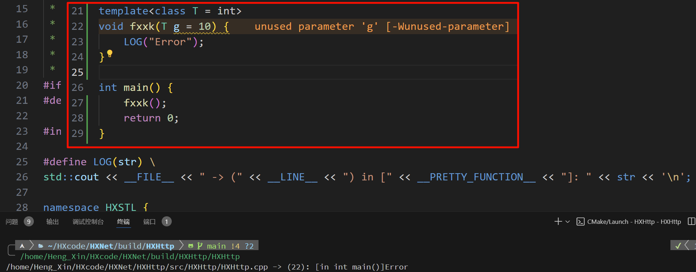

# C++黑科技`__PRETTY_FUNCTION__`非侵入式的编译期反射

> 让[magic_enum(魔术枚举 C++)](https://github.com/Neargye/magic_enum)不在是魔法, 我们今天就自己实现一个嗷!

## 一、认识编译器实现的宏

```C++
#define LOG(str) \
(std::cout << __FILE__ << " -> (" << __LINE__ << ") in [" << __PRETTY_FUNCTION__ << "]: " << str << '\n')
```

| ##container## |
|:--:|
||

- `__FILE__`: 获取当前文件的路径

- `__LINE__`: 获取当前行在代码文件的第几行

- `__PRETTY_FUNCTION__`: 获取当前所在函数的签名字符串 (注: 这个宏只有GCC和clang有; MSVC没有, 而是使用` __FUNCSIG__`(不过格式不一样))

## 二、解析`__PRETTY_FUNCTION__`得到我们需要的内容


```C++
template<class T, class V>
std::string getNameByPrettyFunc(double loli) {
    return __PRETTY_FUNCTION__;
}

int main() {
    std::cout << getNameByPrettyFunc<int, int32_t>(6.66);
    return 0;
}
```

输出:
```C++
std::string getNameByPrettyFunc(double) [with T = int; V = int; std::string = std::__cxx11::basic_string<char>]
```

可以发现以下规律:
1. 可以使用模版, 并且会输出模版实例化后的函数签名, 在`[]`中显示模版对应的变量
2. 得到的类型是基础类型, 比如 int32_t -> int, std::string -> std::__cxx11::basic_string<char>
3. ...

那么如果模版中使用的是常量整数呢?

```C++
template<class T, T N>
const char * getNameByPrettyFunc() {
    return __PRETTY_FUNCTION__;
}

int main() {
    enum class MyEnum {
        LoLi = 1,
        imouto = 2,
    };
    std::cout << getNameByPrettyFunc<MyEnum, (MyEnum)2>();
    return 0;
}
```

输出:
```C++
const char* getNameByPrettyFunc() [with T = main()::MyEnum; T N = main::MyEnum::imouto]
```

我们惊奇的发现, 它直接就映射到`MyEnum::imouto`!, 如果我们可以截取出来, 不就是所谓的`静态反射`了吗?!

比如:

```C++
template<class T, T N>
constexpr const char * _getNameByPrettyFunc() {
    return __PRETTY_FUNCTION__;
}

template<class T, T N>
constexpr std::string getEnumName() {
    std::string data = _getNameByPrettyFunc<T, N>();
    // const char* getNameByPrettyFunc() [with T = main()::MyEnum; T N = main::MyEnum::imouto]
    std::size_t pos = data.find("N = ");
    pos += 4;
    size_t pos2 = data.find_first_of(";]", pos);
    data = data.substr(pos, pos2 - pos);
    size_t pos3 = data.rfind(':');
    if (pos3 != data.npos)
        data = data.substr(pos3 + 1);
    return data;
}

int main() {
    enum class MyEnum {
        LoLi = 1,
        imouto = 2,
    };
    std::cout << getEnumName<MyEnum, (MyEnum)1>(); // LoLi
    return 0;
}
```

## 三、从字符串反射回enum

```C++
template<class T, T N>
constexpr const char * _getNameByPrettyFunc() {
    return __PRETTY_FUNCTION__;
}

template<bool C>
struct HXEnableIf {
};

template<>
struct HXEnableIf<true> {
    using type = void;
};

template<int Begin, int End, class F>
typename HXEnableIf<Begin == End>::type staticFor(const F& func) {
}

template<int Begin, int End, class F>
typename HXEnableIf<Begin != End>::type staticFor(const F& func) {
    func.template call<Begin>();
    staticFor<Begin + 1, End>(func);
}

template<class T>
struct getEnumNameFunctor {
    int _n;
    std::string& _str;

    getEnumNameFunctor(int n, std::string& str) : _n(n)
                                                , _str(str)
    {}

    template<int I>
    constexpr void call() const {
        if (_n == I)
            _str = _getNameByPrettyFunc<T, (T)I>();
    }
};

template<class T, int Begin, int End>
constexpr std::string getEnumName(T n) {
    std::string data;
    staticFor<Begin, End + 1>(getEnumNameFunctor<T>((int)n, data));
    if (data.empty())
        return "";
    std::size_t pos = data.find("N = ");
    pos += 4;
    size_t pos2 = data.find_first_of(";]", pos);
    data = data.substr(pos, pos2 - pos);
    size_t pos3 = data.rfind(':');
    if (pos3 != data.npos)
        data = data.substr(pos3 + 1);
    return data;
}

template<class T>
constexpr std::string getEnumName(T n) {
    return getEnumName<T, -128, 128>(n);
}

template<class T, T Begin, T End>
constexpr T nameFromEnum(const std::string& name) {
    for (int i = (int)Begin; i <= (int)End; ++i) {
        if (name == getEnumName<T>((T)i))
            return T(i);
    }
    throw;
}

template<class T>
constexpr T nameFromEnum(const std::string& name) {
    return nameFromEnum<T, (T)-128, (T)128>(name);
}

int main() {
    enum MyEnum {
        LoLi = 1,
        imouto = 20,
    };
    std::cout << getEnumName<MyEnum>(MyEnum::imouto) << '\n';
    std::cout << nameFromEnum<MyEnum>("imouto") << '\n';
    return 0;
}
```

难点是需要实现一个静态的for循环.