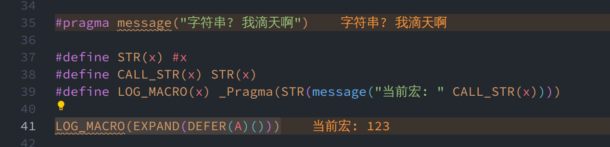

# 宏魔法
## 一、为什么需要学习宏

你知道. 现代 C++ 都有模板了, 为什么还需要这个破宏? 有什么是模板做不到的吗?

- 条件编译, 根据不同平台、编译器选择不同的代码. 这个就不说了

- 代码生成. 例如在 C++26 之前反射, 就是需要宏才可以反射私有成员...

## 二、宏使用
### 2.1 常见用法

```cpp [c1-简单声明]
#define THE_JJ(x, y) x##y
#define THE_J(x, y)  x#y
#define THE_(x, y)   x y
#define THE__(x, y)  xy   // 不合法, 因为 xy 被识别为 宏参数 或者文本

THE_JJ(1e, 2);      // 1e2  语法拼接 (预处理阶段)
THE_J("1", "2");    // "1""\"2\"", 等价于 "1\"2\"" 字符串拼接
THE_(1, 2);         // 1 2  正常转发文本内容
```

```cpp [c1-可变参数]
#define THE_ARG_JJ(x, ...) x##__VA_ARGS__
#define THE_ARG_J(x,  ...) x#__VA_ARGS__
#define THE_ARG_(x, ...)   x __VA_ARGS__

THE_ARG_(1, 2, 3)       // -> 1 2, 3 朴素转发可变参数, 注意可变参数是转发为 arg1, arg2, ... 的, 带逗号的
THE_ARG_J("1", 2, 3)    // -> "12, 3" 字符串
THE_ARG_JJ(1, 2, 3)     // -> 12, 3, 第一个是拼接token, 剩下的是 arg 展开
```

以及一些可变参数的拓展:

### 2.2 GUN 拓展: 逗号吞噬 (`##__VA_ARGS__`)

> 用于处理可变参数为空时, 避免多余逗号

> [!TIP]
> C++ 标准并不保证支持该用法，但大部分现代编译器都支持 (GCC/Clang/MSVC均支持)

```cpp
#define THE_ARG_JJ_CALL(...) 0, ##__VA_ARGS__

THE_ARG_JJ_CALL(1, 2, 3) // 0, 1, 2, 3
THE_ARG_JJ_CALL()        // 0
                         // 区别: 如果写为 0, __VA_ARGS__
                         // 则展开为 `0,`
```

### 2.3 C++20新增: `__VA_OPT__`宏

> [!TIP]
> 此功能, 如果是 MSVC 需要加入 `/Zc:preprocessor` 编译选项. 因为 MSVC 很菜, 默认使用是之前的垃圾解析器, 会导致很多不符合标准的事情. 极难兼容.
>
> 后来MSVC重新写了个宏编译器, 但是需要打开 `/Zc:preprocessor` 才会切换使用. 否则默认还是旧的...
>
> 这时候如果使用, 则会 [编译报错](https://github.com/HengXin666/HXLibs/actions/runs/16517998256/job/46713064878):
>
> - `warning C5109: __VA_OPT__ use in macro requires '/Zc:preprocessor'`
>
> - `error C3861: '__VA_OPT__': identifier not found`

其作用类似于 `逗号吞噬`, 但是更加高级, 作用是:

当 `__VA_ARGS__` 为 **无参数** 时候, 就会不显示 `__VA_OPT__()` 内的内容:

```cpp
#define __HX_REFL_GET_MEMBERS__(__ONE__, ...) \
t.__ONE__ __VA_OPT__(__HX_REFL_GET_MEMBER__(__VA_ARGS__))

// 当 `...` 为空的时候, 展开为 `t.__ONE__`

#define THE_OPT(...) \
int arr[] = {2233 __VA_OPT__(, __VA_ARGS__)}

THE_OPT(1, 2, 3);   // 展开为 int arr[] = {2233, 1, 2, 3}
THE_OPT();          // 展开为 int arr[] = {2233} 可以去掉 __VA_ARGS__ 之前的逗号.
```

### 2.4 宏定义展开顺序

```cpp
#define SX_1() SX_0()
#define SX_0() "1 -> 0"

SX_1(); // OK, 不会报错 SX_0()
```

你可能注意到, `SX_0` 明明是在 `SX_1` 之后声明的, 还妹有声明, 怎么可以使用呢?

> [!NOTE]
> 宏的定义和展开是 **两个阶段**:
> 1. 从上到下, 预处理器读取所有宏定义, 构建一个全局宏表
> 2. 在展开时, 根据名字从宏表里查找已有定义, 递归替换

因此, 此时 `SX_1` 和 `SX_0` 宏名称定义已经进入到`全局宏表`, 在 `SX_1` 使用的时候, 可以正确的从`全局宏表`找到`SX_0`.

因此没有问题 (类比模板的二阶段名称查找); 同理, 下面的就是错误的了:

```cpp
#define SX_ERR() SX_ERR_ON()

SX_ERR(); // A type specifier is required for all declaration -> SX_ERR_ON
          // 找不到 SX_ERR_ON 宏

#define SX_ERR_ON() "Err"
```

### 2.5 编译时print

```cpp [c3-预处理指令]
#pragma message("字符串? 我滴天啊")
```

```cpp [c3-封装为宏]
#define STR(x) #x
#define CALL_STR(x) STR(x)
#define LOG_MACRO(x) _Pragma(STR(message("当前宏: " CALL_STR(x))))

// 其中, _Pragma 是保留字, 等价于 `#pragma`, 以便在宏定义中使用
// 用它可以在编译的时候打印内容, 或者宏的结果:
LOG_MACRO(EXPAND(DEFER(A)()))
```

效果: (各个编译器: https://godbolt.org/z/oWrj76PxP)



## 三、宏魔法
### 3.1 `模式匹配`と`##展开抑制`

模式匹配, 比如`宏if`:

```cpp
#define THE_IF_THEN(val) THE_IF_THEN_ ## val
#define THE_IF_THEN_0(t, f) f
#define THE_IF_THEN_1(t, f) t
#define FUNC() 0

// 这正确地扩展为 true
auto res1 = THE_IF_THEN(1)(true, false);

// 但是, 这将扩展为 THE_IF_THEN_A()(true， false)
// 这是因为 A() 不会扩展到 1,
// 因为它被 ## 运算符抑制
auto res2 = IF_THEN(FUNC())(true, false); // ERR: 没有 THE_IF_THEN_A() 这个宏
```

这就是 `##` 抑制宏展开. (*理论上`#`也会. 但是使用场景得很少*)

解决方案也非常简单, 再套一层, 让它拼接好了再返回:

```cpp
#define ACTIVATION(x, y) x##y

#define IF_THEN(val) ACTIVATION(IF_THEN_, val) // 1. val = FUNC(), 被拓展为 0
#define IF_THEN_0(t, f) f                      // 2. 调用 ACTIVATION(IF_THEN_, 0)
#define IF_THEN_1(t, f) t                      // 3. 返回得到 IF_THEN_0, 是宏, 继续调用 -> f

auto res_1 = IF_THEN(1)(true, false);
auto res_2 = IF_THEN(FUNC())(true, false); // OK
```

```cpp
#define FUNC_(x) 0
#define LAZY_CODE(x) IF_THEN(FUNC_(x))(true, false)
auto res_3 = IF_THEN(FUNC_(0))(true, false); // OK
auto res_4 = LAZY_CODE(2233);                // OK

#define WDF(x) ACTIVATION(IF_THEN_, FUNC_(x))

auto res5 = WDF(2233); // Use of undeclared identifier 'IF_THEN_FUNC_'
// 如果试图再次展开, 那依旧是不合法的!
// In: ACTIVATION(IF_THEN_, FUNC_(x))
// 实际上和 IF_THEN(FUNC())(true, false) 的处境都是一样的
// 此层期望展开, 但是里面 "一层" 使用它作为 ##, 这样就被抑制了.
// 解决方案依旧是再套一层!
```

当然模式匹配还有很多, 比如 `not if`, `++`, `--` 这些. 我们只需要如法炮制, 编写对应的宏匹配即可.

> [!TIP]
> 但是我们做不到定义一个 `宏(num)` 然后它调用 `下一个宏(num - 1)` 这种, 因为宏只是文本替换, 不会进行计算;
>
> 所以如果期望计算, 就只能通过文本替换实现. (也可以抽象为一种 **映射**)

### 3.2 检测宏参数 (Detection)

借助可变参数数量不同, 进行参数类型检测. 或者说是否为我们期望的某些内容:

```cpp
#define CHECK_N(x, n, ...) n
#define CHECK(...) CHECK_N(__VA_ARGS__, 0,) // 要求只能传入一个参数
#define PROBE(x) x, 1,

/*
    CHECK(PROBE(~)) -> CHECK(~, 1,)
                    -> CHECK_N(~, 1, 0,)
                    -> 1
*/
auto res01 = CHECK(PROBE(~));  // Expands to 1

/*
    CHECK(xxx) -> CHECK(xxx)
               -> CHECK_N(xxx, 0,)
               -> 0
*/
auto res02 = CHECK(xxx);       // Expands to 0
auto hk_01 = CHECK(xxx, 2333); // Expands to 233
```

比如我们可以判断内容是否是`纯括号`:

```cpp
#define IS_PAREN_PROBE(...) PROBE(~)
#define IS_PAREN(x) CHECK(IS_PAREN_PROBE x)

/*
    IS_PAREN(()) -> CHECK(IS_PAREN_PROBE())
                 -> CHECK(PROBE(~)) -> 1
    否则, 等价于
                 -> CHECK(xxx) -> 0
*/
auto res03 = IS_PAREN(());      // Expands to 1
auto res04 = IS_PAREN(xxx);     // Expands to 0
auto hk_02 = IS_PAREN(((())));  // Expands to 1
```

这样我们就可以写一个完美的宏判断了:

```cpp
#define CHECK_N(x, n, ...) n
#define CHECK(...) CHECK_N(__VA_ARGS__, 0,) // 要求只能传入一个参数
#define PROBE(x) x, 1,

#define ACTIVATION(x, y) x##y
#define NOT_0 PROBE(~)
#define NOT(x) CHECK(ACTIVATION(NOT_, x))
#define BOOL(x) NOT(NOT(x)) // 把 数字转化为 bool

#define DO(...) __VA_ARGS__
#define NOT_DO(...)
#define IF_THEN(val) ACTIVATION(IF_THEN_, val)
#define IF_THEN_0(t, f) f
#define IF_THEN_1(t, f) t
#define IF(x) IF_THEN(BOOL(x))(DO, NOT_DO) // 期望是传参一个

auto _ = IF_THEN(0)(1, 0);
int res05[1000] = { IF(0)(2233, 2322) };   // false -> {}
int res06[1000] = { IF(666)(2233, 2322) }; // true  -> {2233, 2322}
```

### 3.3 递归

遗憾的是, 宏不能进行递归展开。当一个宏展开时, 它会被标记为“蓝色”(painted blue), 这会阻止它进一步展开。

但我们可以通过一些技巧来避免宏被标记为蓝色。

其次, 我们也可以检测一个宏是否已经被标记为蓝色(因为它无法再展开), 并利用这个状态展开为不同的宏。

> 此处建议观看: [宏定义黑魔法-从入门到奇技淫巧 (2) - object-like 宏的递归展开](https://zhuanlan.zhihu.com/p/26992559)
>
> 理解所谓`蓝色集合`的含义 (实际上也就是下文提到的`栈`)

### 3.4 延迟展开

延迟表达式是指一个需要多次扫描才能完全展开的表达式。下面是一个例子:

```cpp
#define EMPTY()
#define DEFER(id) id EMPTY()
#define OBSTRUCT(...) __VA_ARGS__ DEFER(EMPTY)()
#define EXPAND(...) __VA_ARGS__

#define CALL(x) x
#define A() 123

A()                 // 展开为 123
CALL(A)()           // 展开为 123
DEFER(A)()          // 展开为 A (), 因为它需要再扫描一次才能完全展开
EXPAND(DEFER(A)())  // 展开为 123, 因为 EXPAND 宏会强制多一次扫描
```

当一个宏正在被扫描和展开时, 它会产生一个“禁用上下文”(disabling context)。这个禁用上下文会导致指向当前正在展开的宏的标记被标记为蓝色。因此, 一旦被标记为蓝色, 宏就不会再次展开了。这就是宏不能递归展开的原因。

我们可以详细看看到底是怎么个事!

> [!NOTE]
> 核心: C 预处理器的展开方式并不是像常规编程语言那样尝试归约整个表达式树, 它实际上是在线性 `token` 流上工作, 并且有一个隐式的“光标”(cursor), 表示当前在这个 `token` 流中查找可以替换宏的位置。
>
> 在展开过程的任何一个“栈帧”(stack frame)中, **光标永远不会后退**, 一旦某个 `token` 被扫描过去, 它将 **不会** 被 **重新检查**。

例如上面的 `DEFER(A)()`:

```cpp [c2-第一层: 调用处]
DEFER(A)()    // 光标从序列头部开始
^             // 识别出 DEFER 宏调用 - 保存当前位置

DEFER( A )()  // 尝试展开参数 (A 无需处理)
       ^
```

```cpp [c2-第二层: 展开DEFER]
// 1.
A EMPTY() ()  // 弹出光标位置(已粘贴子序列的开头)
^             // 此时找不到 A 的展开, 跳过

// 2.
A EMPTY() ()  // 光标移动到下一个 token
  ^           // 识别 EMPTY() 可展开
A  ()         // 将 EMPTY() 替换为空
   ^          // 继续扫描...
A ()          // `(` 不是宏, 跳过
  ^
A ( )         // `)` 也不是宏, 跳过
    ^
A ()          // 到达序列尾部, 无更多可展开内容
     ^
```

同理:

```cpp vscode
/*
    下面是解析过程, ! 表示发现的宏, ~ 表示没有识别此为宏, ^ 表示解析器光标

    EXPAND(DEFER(A)())
    !      !         ^ 全部解析, 栈内有两个({EXPAND, DEFER})待展开的宏, 出栈一个:

    出栈, 展开
    EXPAND(A EMPTY()())
           ~ !        ^ 全部解析, 栈内有两个({EXPAND, EMPTY})待展开的宏, 出栈一个
    
    出栈, 展开, 注意: 此时光标在 A 后面, 没有包含 A, 因此没有展开 A
    EXPAND(A ())
             ^ 括号都不认识, 回退(栈内有一个({EXPAND})待展开的宏, 出栈一个)
    
    出栈, 展开, 此时光标已经回退到 开头 (EXPAND处)
    A()
    !  ^ 全部解析, 栈内有一个({A})待展开的宏, 出栈一个

    123 解析宏完毕
*/
EXPAND(DEFER(A)()) // 展开为 123, 因为 EXPAND 宏会强制多一次扫描
```

然而, 禁用上下文仅在一次扫描中存在, 所以通过延迟展开, 我们可以避免宏被标记为蓝色。我们只需要对表达式进行更多次扫描。我们可以使用如下的 `EVAL` 宏来实现多次扫描:

```cpp
#define EVAL(...)  EVAL1(EVAL1(EVAL1(__VA_ARGS__)))
#define EVAL1(...) EVAL2(EVAL2(EVAL2(__VA_ARGS__)))
#define EVAL2(...) EVAL3(EVAL3(EVAL3(__VA_ARGS__)))
#define EVAL3(...) EVAL4(EVAL4(EVAL4(__VA_ARGS__)))
#define EVAL4(...) EVAL5(EVAL5(EVAL5(__VA_ARGS__)))
#define EVAL5(...) __VA_ARGS__
```

我们使用 `REPEAT_INDIRECT` 宏来间接引用自身, 这样可以防止宏被标记为蓝色, 因为它将在另一次扫描中展开(并使用不同的禁用上下文)。我们在这里使用了 `OBSTRUCT`, 它会延迟两次展开。这是必要的, 因为条件宏 `WHEN` 已经会执行一次扫描。

```cpp
#define REPEAT(count, macro, ...) \
    WHEN(count) \
    ( \
        OBSTRUCT(REPEAT_INDIRECT) () \
        ( \
            DEC(count), macro, __VA_ARGS__ \
        ) \
        OBSTRUCT(macro) \
        ( \
            DEC(count), __VA_ARGS__ \
        ) \
    )
#define REPEAT_INDIRECT() REPEAT
```

完整代码:

```cpp
// 延迟展开 相关宏
#define EMPTY()
#define DEFER(id) id EMPTY()
#define OBSTRUCT(...) __VA_ARGS__ DEFER(EMPTY)()

#define EVAL(...)  EVAL1(EVAL1(EVAL1(__VA_ARGS__)))
#define EVAL1(...) EVAL2(EVAL2(EVAL2(__VA_ARGS__)))
#define EVAL2(...) EVAL3(EVAL3(EVAL3(__VA_ARGS__)))
#define EVAL3(...) EVAL4(EVAL4(EVAL4(__VA_ARGS__)))
#define EVAL4(...) EVAL5(EVAL5(EVAL5(__VA_ARGS__)))
#define EVAL5(...) __VA_ARGS__

// 之前实现的 if 宏
#define CHECK_N(x, n, ...) n
#define CHECK(...) CHECK_N(__VA_ARGS__, 0,)
#define PROBE(x) x, 1,
#define ACTIVATION(x, y) x##y
#define NOT_0 PROBE(~)
#define NOT(x) CHECK(ACTIVATION(NOT_, x))
#define BOOL(x) NOT(NOT(x))
#define DO(...) __VA_ARGS__
#define NOT_DO(...)
#define IF_THEN(val) ACTIVATION(IF_THEN_, val)
#define IF_THEN_0(t, f) f
#define IF_THEN_1(t, f) t
#define WHEN(x) IF_THEN(BOOL(x))(DO, NOT_DO)

// 使用 3.1 思想实现的 自减 宏
#define DEC(x) ACTIVATION(DEC_, x)
#define DEC_0 0
#define DEC_1 0
#define DEC_2 1
#define DEC_3 2
#define DEC_4 3
#define DEC_5 4
#define DEC_6 5
#define DEC_7 6
#define DEC_8 7

// 基于 延迟展开 的循环
#define REPEAT_INDIRECT() REPEAT_IMPL
#define REPEAT(count, macro, ...) EVAL(REPEAT_IMPL(count, macro, __VA_ARGS__))

#define REPEAT_IMPL(count, macro, ...) \
    WHEN(count) \
    ( \
        OBSTRUCT(REPEAT_INDIRECT) () \
        ( \
            DEC(count), macro, __VA_ARGS__ \
        ) \
        OBSTRUCT(macro) \
        ( \
            DEC(count), __VA_ARGS__ \
        ) \
    )

#define M(i, _) i,

int res[] = {
    REPEAT(8, M, ~) // 0, 1, 2, 3, 4, 5, 6, 7,
};
```

同理, 你也可以写一个 `while宏`:

```cpp
// pred 是判断宏, op 是操作宏, ... 是 前面两个宏的传入参数
#define WHILE(pred, op, ...) \
    IF(pred(__VA_ARGS__)) \
    ( \
        OBSTRUCT(WHILE_INDIRECT) () \
        ( \
            pred, op, op(__VA_ARGS__) \
        ), \
        __VA_ARGS__ \
    )
#define WHILE_INDIRECT() WHILE
```

### 3.5 比较

为了实现宏的比较, 我们可以通过连接宏形成新的宏, 然后展开它, 否则就只是普通的文本. 这个特性:

```cpp
// 预先定义的宏
#define COMPARE_foo(x) x
#define COMPARE_bar(x) x

// 3.2 实现的判断是否为括号
#define CHECK_N(x, n, ...) n
#define CHECK(...) CHECK_N(__VA_ARGS__, 0,) // 要求只能传入一个参数
#define PROBE(x) x, 1,

#define IS_PAREN_PROBE(...) PROBE(~)
#define IS_PAREN(x) CHECK(IS_PAREN_PROBE x)

// 比较宏, 如果真的被拼接为 COMPARE_foo(COMPARE_bar)(())
// 就会变为 COMPARE_bar()()
// 变为 ()
// 然后就判断是否是括号即可.
#define PRIMITIVE_COMPARE(x, y) IS_PAREN \
( \
COMPARE_ ## x ( COMPARE_ ## y) (())  \
)

auto res01 = PRIMITIVE_COMPARE(foo, bar); // Expands to 1
auto res02 = PRIMITIVE_COMPARE(foo, foo); // Expands to 0
```

但是还是有问题, 当宏的拼接结果没有事先定义, 它就不合法:

```cpp
// 需要定义 COMPARE_???, 否则实际上是报错的:
PRIMITIVE_COMPARE(foo, unfoo) // Err
```

但是我们可以完善一下:

```cpp
#define ACTIVATION(x, y) x##y
#define CALL_ACTIVATION(x, y) ACTIVATION(x, y)

#define IF_THEN(cb) ACTIVATION(IF_THEN_, cb)
#define IF_THEN_0(t, f) f
#define IF_THEN_1(t, f) t

#define IS_COMPARABLE(x) IS_PAREN( CALL_ACTIVATION(COMPARE_, x) (()) )

#define BITAND_0(y) 0
#define BITAND_1(y) y
#define BITAND(x) ACTIVATION(BITAND_, x)

#define EAT(...)
#define NOT_EQUAL(x, y) \
IF_THEN(BITAND(IS_COMPARABLE(x))(IS_COMPARABLE(y)) ) \
( \
   PRIMITIVE_COMPARE, \
   1 EAT \
)(x, y)

#define COMPL_0 1
#define COMPL_1 0
#define COMPL(b) ACTIVATION(COMPL_, b)

#define EQUAL(x, y) COMPL(NOT_EQUAL(x, y))

auto res03 = EQUAL(foo, bar); // 0
auto res04 = EQUAL(foo, foo); // 1
auto res05 = EQUAL(foo, abc); // 0 未定义 abc 也不会报错
```

> [!TIP]
> 个人认为这个的实用性可能没有那么大, 因为你需要定义比较的结果~

## 四、现成魔法

我们使用如下宏进行调试.

```cpp
#define STR(x) #x
#define LOG_MACRO(x) _Pragma(STR(message("当前宏: " STR(x))))
```

### 4.1 去掉所有逗号

```cpp [c41-简单粗暴]
// 直接加个括号就好
#define FK_ALL_DH(...) (__VA_ARGS__)

// test
#define GET_2(a, b) b

LOG_MACRO(GET_2(1, 2))               // 2
LOG_MACRO(GET_2(FK_ALL_DH(1, 2), 3)) // 3
```

```cpp [c41-基于延迟展开]
// 生成展开
#define EVAL(...)  EVAL1(EVAL1(EVAL1(__VA_ARGS__)))
#define EVAL1(...) EVAL2(EVAL2(EVAL2(__VA_ARGS__)))
#define EVAL2(...) EVAL3(EVAL3(EVAL3(__VA_ARGS__)))
#define EVAL3(...) EVAL4(EVAL4(EVAL4(__VA_ARGS__)))
#define EVAL4(...) EVAL5(EVAL5(EVAL5(__VA_ARGS__)))
#define EVAL5(...) __VA_ARGS__

// 延迟宏
#define EMPTY()
#define DELAY(code) code EMPTY()
#define NEXT_TIME(...) __VA_ARGS__ DELAY(EMPTY)()
#define SCAN_AGAIN(...) __VA_ARGS__

// 转发宏
#define FORWARD_IMPL(cb, ...) cb(__VA_ARGS__)
#define FORWARD(cb, ...) FORWARD_IMPL(cb, __VA_ARGS__)

// 拼接宏
#define ACTIVATION_IMPL_1(x, y) x##y
#define ACTIVATION(x, y) ACTIVATION_IMPL_1(x, y)

// 判断是否为空
#define CHECK_N(x, n, ...) n
#define CHECK(...) CHECK_N(__VA_ARGS__, 0, )
#define IS_EMPTY() ~, 1
#define IF_EMPTY(x) CHECK(ACTIVATION(IS_EMPTY, x)())

// 判断宏
#define IF_BOOL_0(t, f) f
#define IF_BOOL_1(t, f) t
#define IF_BOOL(val, t, f) ACTIVATION(IF_BOOL_, val)(t, f)

// 实现一个宏, 让 __VA_ARGS__ 合并为一个, 没有括号, 但是有空格
#define ACTIVATION_ALL_CALL_THIS() ACTIVATION_ALL_IMPL
#define ACTIVATION_ALL_0(x, ...) ACTIVATION(, x) DELAY(ACTIVATION_ALL_CALL_THIS)()(__VA_ARGS__)
#define ACTIVATION_ALL_1(x, ...)
#define ACTIVATION_ALL_IMPL(x, ...) \
        ACTIVATION(ACTIVATION_ALL_, IF_EMPTY(x))(x, __VA_ARGS__)
#define ACTIVATION_ALL(...) EVAL(ACTIVATION_ALL_IMPL(__VA_ARGS__)) // 需要定义一个宏, 来调用 EVAL, 不能原地 EVAL

// test
#define GET_2(a, b) b

LOG_MACRO(GET_2(1, 2))                    // 2
LOG_MACRO(GET_2(ACTIVATION_ALL(1, 2), 3)) // 3
```

> 似乎无法实现 `__VA_ARGS__` 所有参数进行链接为 token? 只能手动列出参数?

### 4.2 宏 IF

```cpp [c42-整数判断]
#define CHECK_N(x, n, ...) n
#define CHECK(...) CHECK_N(__VA_ARGS__, 0,)
#define PROBE(x) x, 1,
#define ACTIVATION(x, y) x##y
#define NOT_0 PROBE(~)
#define NOT(x) CHECK(ACTIVATION(NOT_, x))
#define BOOL(x) NOT(NOT(x))
#define DO(...) __VA_ARGS__
#define NOT_DO(...)
#define IF_THEN(val) ACTIVATION(IF_THEN_, val)
#define IF_THEN_0(t, f) f
#define IF_THEN_1(t, f) t

// 判断 val (整数), 为 true 则展开为宏 t, 否则 f
#define IF(val, t, f) IF_THEN(BOOL(val))(t, f)

// test
#define A(a) (a + 10)
#define B(b) (b + 100)
IF(2233, A, B)(123) // -> (123 + 10)
```

```cpp [c42-非空判断]
// 拼接宏
#define ACTIVATION_IMPL_1(x, y) x##y
#define ACTIVATION(x, y) ACTIVATION_IMPL_1(x, y)

// 判断是否为空
#define CHECK_N(x, n, ...) n
#define CHECK(...) CHECK_N(__VA_ARGS__, 0, )
#define IS_EMPTY() ~, 1
#define IF_EMPTY(x) CHECK(ACTIVATION(IS_EMPTY, x)())

// test 注意最多传参一个
LOG_MACRO(IF_EMPTY(2233)) // -> 0
LOG_MACRO(IF_EMPTY())     // -> 1
```

### 4.3 for宏

```cpp [c43-for宏]
// 展开宏
#define EVAL(...)  EVAL1(EVAL1(EVAL1(__VA_ARGS__)))
#define EVAL1(...) EVAL2(EVAL2(EVAL2(__VA_ARGS__)))
#define EVAL2(...) EVAL3(EVAL3(EVAL3(__VA_ARGS__)))
#define EVAL3(...) EVAL4(EVAL4(EVAL4(__VA_ARGS__)))
#define EVAL4(...) EVAL5(EVAL5(EVAL5(__VA_ARGS__)))
#define EVAL5(...) __VA_ARGS__

// 延迟展开宏
#define EMPTY()
#define DELAY(code) code EMPTY()

// 拼接宏
#define ACTIVATION_IMPL_1(x, y) x##y
#define ACTIVATION(x, y) ACTIVATION_IMPL_1(x, y)

// 判断是否为空
#define CHECK_N(x, n, ...) n
#define CHECK(...) CHECK_N(__VA_ARGS__, 0, )
#define IS_EMPTY() ~, 1
#define IF_EMPTY(x) CHECK(ACTIVATION(IS_EMPTY, x)())

// for
#define FOR_IMPL_CALL_THIS() FOR_IMPL
#define FOR_IMPL_0(macro, x, ...) macro(x) DELAY(FOR_IMPL_CALL_THIS)()(macro, __VA_ARGS__)
#define FOR_IMPL_1(...)
#define FOR_IMPL(macro, x, ...) ACTIVATION(FOR_IMPL_, IF_EMPTY(x))(macro, x, __VA_ARGS__)
#define FOR(macro, x, ...) EVAL(FOR_IMPL(macro, x, __VA_ARGS__))

// test
#define DECLARED_MEMBER(name) decltype(name) name;

struct A {
    void func() {
        struct __my_a__ {
            FOR(DECLARED_MEMBER, op, str) // -> decltype(op) op; decltype(str) str;
        };
    }

    int op;
    char* str;
};
```

## 附、参考链接

- [C Preprocessor tricks, tips, and idioms](https://github.com/pfultz2/Cloak/wiki/C-Preprocessor-tricks,-tips,-and-idioms) (宏魔法 `3.1 ~ 3.5`)

- [Understanding DEFER and OBSTRUCT macros](https://stackoverflow.com/questions/29962560/understanding-defer-and-obstruct-macros)

- [Removing last trailing comma from the arguments of a macro](https://stackoverflow.com/questions/72533711/removing-last-trailing-comma-from-the-arguments-of-a-macro)

- [宏定义黑魔法-从入门到奇技淫巧 (5) - 实现图灵完备的宏](https://zhuanlan.zhihu.com/p/27146532)