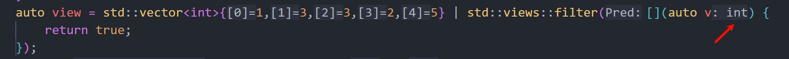
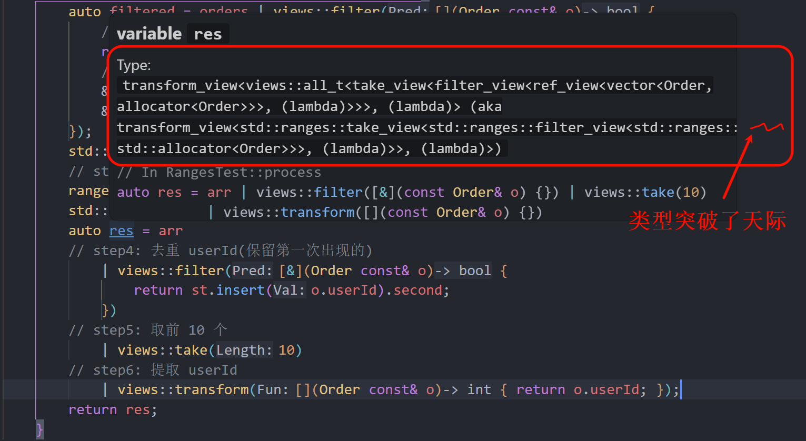
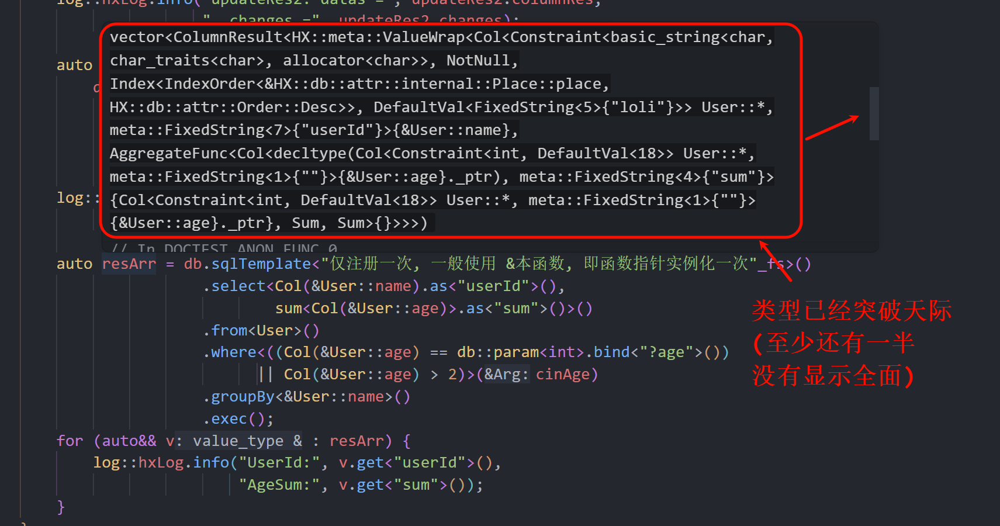

# 剖析 std::ranges / std::views 库的胖次

## 一、起因

最近打算学习一下 C++26 的 std::executor 库 (看看如何把 HXLibs 的接口对其兼容, 以及写一个该接口规范的线程池), 发现其一些内容实际上思想是和 std::ranges / std::views 库相关的, 所以决定先学习一下 std::ranges / std::views 库.

学习之后, 发现我对 std::ranges 这些认知都太浅了. 总觉得就仅仅是 记住这海量的 api 即可...

然后知道它是 范围的(begin/end 不用写了)、 管道符的、lazy 的、编译期的.

说实话有点抽象? 或者是根本无法适应使用

## 二、试试实践

我让 GPT 给我一个企业级别的实际意义的原始代码 (非ranges的), 然后我自己修改为 ranges 的代码. 看看仅以我的认知是否可以进行?

```cpp [ranges01-老登写法]
struct Order {
    int id;
    int userId;
    double price;
    bool valid;
    std::string tag;
};

struct NoRangesTest {
    std::vector<int> process(const std::vector<Order>& orders) {
        std::vector<int> result;
        // step1: 收集有效订单
        std::vector<Order> validOrders;
        for (size_t i = 0; i < orders.size(); ++i) {
            if (orders[i].valid == true) {
                validOrders.push_back(orders[i]);
            }
        }
        // step2: 过滤 price > 100 且 tag != "test"
        std::vector<Order> filtered;
        for (size_t i = 0; i < validOrders.size(); ++i) {
            if (validOrders[i].price > 100.0) {
                if (validOrders[i].tag != "test") {
                    filtered.push_back(validOrders[i]);
                }
            }
        }
        // step3: 按 price 排序(降序)
        std::sort(
            filtered.begin(), filtered.end(),
            [](const Order& a, const Order& b) { return a.price > b.price; }
        );
        // step4: 去重 userId(保留第一次出现的)
        std::unordered_set<int> seen;
        std::vector<Order> dedup;
        for (size_t i = 0; i < filtered.size(); ++i) {
            if (seen.find(filtered[i].userId) == seen.end()) {
                seen.insert(filtered[i].userId);
                dedup.push_back(filtered[i]);
            }
        }
        // step5: 取前 10 个
        std::vector<Order> top;
        for (size_t i = 0; i < dedup.size(); ++i) {
            if (i < 10) {
                top.push_back(dedup[i]);
            }
        }
        // step6: 提取 userId
        for (size_t i = 0; i < top.size(); ++i) {
            result.push_back(top[i].userId);
        }
        return result;
    }
};
```

```cpp [ranges01-现代写法]
struct RangesTest {
    auto process(std::vector<Order> const& orders) {
        auto filtered = orders | views::filter([](Order const& o) {
            // step1: 收集有效订单
            return o.valid
            // step2: 过滤 price > 100 且 tag != "test"
            && o.price > 100.0
            && o.tag != "test";
        });
        std::vector<Order> arr{filtered.begin(), filtered.end()};
        // step3: 按 price 排序(降序)
        ranges::sort(arr, std::greater<>{}, &Order::price);
        std::unordered_set<int> st;
        auto res = arr
        // step4: 去重 userId(保留第一次出现的)
            | views::filter([&](Order const& o) {
                return st.insert(o.userId).second;
            })
        // step5: 取前 10 个
            | views::take(10)
        // step6: 提取 userId
            | views::transform([](Order const& o) { return o.userId; });
        return res;
        // tip: 此次偷懒了, 因为 C++23 才有 ranges::to<std::vector<int>>, 所以我直接返回
    }
};
```

编写后, 我就深刻体会到, 实际上有时候我连 ranges 和 views 都分不清... 有的东西是不能直接使用管道符的.

这也激起我的兴趣. 所以我要手撕一个.

## 三、手撕 ranges / views
### 3.1 ranges

我们先从最基础的 FilterView 开始~

> [!TIP]
> 我们不手撕其迭代器, 因为它的概念太多了qwq...

看看它是如何被使用的:

```cpp
auto filter = std::ranges::filter_view{std::vector<int>{1,3,3,2,5}, [](auto) {
    return true;
}};

for (auto v : filter) {
    (void)v;   
}
```

也就是其是一个筛选器, 用于筛选出满足条件的元素. 传入的是一个 `容器Range` 和 `筛选函数`:

所以我们可以设计如下接口:

```cpp
// F = [](RangeType<R>) -> bool {}
template <Range R, Pred<RangeType<R>> P>
struct FilterView {
    FilterView() requires (std::default_initializable<R>
			      && std::default_initializable<P>)
	= default;

    constexpr FilterView(R range, P pred) 
        : _base{std::move(range)}
        , _pred{std::move(pred)}
    {}

    constexpr auto begin() {
        // @todo: cache 首次查找后可以缓存, 日后无需再查找
        return std::ranges::find_if(_base, _pred);
    }
    constexpr auto end() {
        return std::ranges::end(_base);
    }
private:
    R _base{};
    P _pred;
};
```

> 由于我们并不实现迭代器, 所以它实际上非常简单. 就是存储了 range, 以及 筛选函数. 在触发 `begin()` 时候, 才进行查找操作 (之后会缓存这个查找的结果(此处未实现))

其中, 一些细节需要约束:

1. `R` 必须是 range 概念
2. `P` 必须是函数对象, 并且传入是 `R` 元素类型参数, 并且返回值可以转换为 `bool`

故有:

```cpp
template <typename T>
concept Range = requires(T& t) {
    std::ranges::begin(t);
    std::ranges::end(t);
};

template <typename T>
using RangeType = decltype(*std::ranges::begin(std::declval<T&>())); // 注意必须是 左值引用

template <typename F, typename Arg>
concept Pred = requires(F&& func, Arg&& arg) {
    { std::forward<F>(func)(std::forward<Arg>(arg)) } -> std::convertible_to<bool>;
};
```

如果你观察了标准库, 实际上 `FilterView` 还需要实现一些接口. 比如: `size()`, `empty()`, `base()` 等等:

> [!TIP]
> 标准库是使用 CRTP 技术来实现这些接口的, 我们可以学习一下标准库是如何约束 CRTP 的.

```cpp [ranges02-ViewInterface]
template <typename Crtp>
    requires (std::is_object_v<Crtp> && std::same_as<Crtp, std::remove_cvref_t<Crtp>>)
struct ViewInterface {
    constexpr auto& base() noexcept {
        return derived()._base;
    }
    constexpr auto& base() const noexcept {
        return derived()._base;
    }
    constexpr auto data() noexcept {
        return std::to_address(std::ranges::begin(base()));
    }
    constexpr auto data() const noexcept {
        return std::to_address(std::ranges::begin(base()));
    }
    constexpr bool empty() const noexcept {
        return std::ranges::end(base()) - std::ranges::begin(base());
    }
    constexpr std::size_t size() const noexcept {
        return std::ranges::end(base()) - std::ranges::begin(base());
    }
private:
    constexpr Crtp& derived() noexcept {
        static_assert(std::derived_from<Crtp, ViewInterface>);
        return static_cast<Crtp&>(*this);
    }
    constexpr Crtp const& derived() const noexcept {
        static_assert(std::derived_from<Crtp, ViewInterface>);
        return static_cast<Crtp const&>(*this);
    }
};
```

```cpp [ranges02-完整代码]
namespace HX::ranges {

template <typename T>
concept Range = requires(T& t) {
    std::ranges::begin(t);
    std::ranges::end(t);
};

template <typename T>
using RangeType = decltype(*std::ranges::begin(std::declval<T&>())); // 注意必须是 左值引用

template <typename F, typename Arg>
concept Pred = requires(F&& func, Arg&& arg) {
    { std::forward<F>(func)(std::forward<Arg>(arg)) } -> std::convertible_to<bool>;
};

template <typename Crtp>
    requires (std::is_object_v<Crtp> && std::same_as<Crtp, std::remove_cvref_t<Crtp>>)
struct ViewInterface {
    constexpr auto& base() noexcept {
        return derived()._base;
    }
    constexpr auto& base() const noexcept {
        return derived()._base;
    }
    constexpr auto data() noexcept {
        return std::to_address(std::ranges::begin(base()));
    }
    constexpr auto data() const noexcept {
        return std::to_address(std::ranges::begin(base()));
    }
    constexpr bool empty() const noexcept {
        return std::ranges::end(base()) - std::ranges::begin(base());
    }
    constexpr std::size_t size() const noexcept {
        return std::ranges::end(base()) - std::ranges::begin(base());
    }
private:
    constexpr Crtp& derived() noexcept {
        static_assert(std::derived_from<Crtp, ViewInterface>);
        return static_cast<Crtp&>(*this);
    }
    constexpr Crtp const& derived() const noexcept {
        static_assert(std::derived_from<Crtp, ViewInterface>);
        return static_cast<Crtp const&>(*this);
    }
};

// F = [](RangeType<R>) -> bool {}
template <Range R, Pred<RangeType<R>> P>
struct FilterView : public ViewInterface<FilterView<R, P>> {
    FilterView() requires (std::default_initializable<R>
			      && std::default_initializable<P>)
	= default;

    constexpr FilterView(R range, P pred) 
        : _base{std::move(range)}
        , _pred{std::move(pred)}
    {}

    constexpr auto begin() {
        // @todo: cache 首次查找后可以缓存, 日后无需再查找
        return std::ranges::find_if(_base, _pred);
    }
    constexpr auto end() {
        return std::ranges::end(_base);
    }
private:
    R _base{};
    P _pred;
    friend ViewInterface<FilterView<R, P>>;
};

// 这里的推导指引非常重要!
template <Range R, Pred<RangeType<R>> P>
FilterView(R&&, P) -> FilterView<std::views::all_t<R>, P>;

} // namespace HX::ranges

int main() {
    std::vector<int> arr{1,3,3,2,5};
    auto all = std::views::all(arr);
    (void)all.base();
    auto filter = ranges::FilterView{arr, [](auto v) {
        log::hxLog.warning(v);
        return true;
    }};
    [[maybe_unused]] auto base = filter.base();
    for (auto v : filter) {
        log::hxLog.info(v);
    }
}
```

如果你直接编写完成. 那么实际上你的实现是错误的!, 你并不支持 `ranges::FilterView{std::vector<int>{}, [](auto v) { return true; }}` 这种传入 `右值` 的情况.

必须要使用推导指引:

```cpp
template <Range R, Pred<RangeType<R>> P>
FilterView(R&&, P) -> FilterView<std::views::all_t<R>, P>;
```

你可以简单理解成 `std::views::all_t<R>` 会把 **左值** 转换成 `ranges::ref_view{}`, 而 **右值** 则是 `ranges::owning_view{}` (确保其有所有权, 而不是 `dangling`)

### 3.2 views

views 是在 `std::ranges::views` 中, 提供了很多 **定制点对象**, 以及运算符重载:

```cpp
namespace std::ranges::views {

inline constexpr _Filter filter{}; // 定制点对象

} // namespace std::ranges::views
```

它可以方便的被如下使用:

```cpp
using views = std::ranges::views;
auto view = std::vector<int>{1,2,3} | views::filter([](auto v) { return true; });
```

或许你会下意识的以为, 其相当于:

```cpp
constexpr auto operator|(auto&& r, auto&& v) /* 省略了约束 */ {
    return FilterView{std::forward<decltype(r)>(r), std::forward<decltype(v)>(v)};
}
```

但是实际上它的求值顺序是 ~~(忽略 vector 的构造, 这谁都知道)~~:

1. 先是 `views::filter([](auto v) { return true; })` 这个对象被创建 (注意, 此处的 `filter` 不是类型, 是 **对象**, 调用的是 `filter` 的 `operator()` 运算符重载)
2. 然后才是对 arr 和 `1.` 的返回值 调用 `operator|` 运算符重载

但是, 注意, 我们在 `views::filter([](auto v) { return true; })` 处, 传入的是 `auto`, 但是编译器是可以推断其为 int 的:



这时候, 如果我们去看源码, 你只能看到:

> [!TIP]
> @todo 待补充 gcc libc 实现. MSVC 这个没有那么妙的感觉..

```cpp [stdcxx-MSVC]
struct _Filter_fn {
    template <viewable_range _Rng, class _Pr>
    _NODISCARD _STATIC_CALL_OPERATOR constexpr auto operator()(_Rng&& _Range, _Pr&& _Pred) _CONST_CALL_OPERATOR
        noexcept(noexcept(filter_view(_STD forward<_Rng>(_Range), _STD forward<_Pr>(_Pred))))
        requires requires { filter_view(static_cast<_Rng&&>(_Range), _STD forward<_Pr>(_Pred)); }
    {
        return filter_view(_STD forward<_Rng>(_Range), _STD forward<_Pr>(_Pred));
    }

    template <class _Pr>
        requires constructible_from<decay_t<_Pr>, _Pr>
    _NODISCARD _STATIC_CALL_OPERATOR constexpr auto operator()(_Pr&& _Pred) _CONST_CALL_OPERATOR
        noexcept(is_nothrow_constructible_v<decay_t<_Pr>, _Pr>) {
        return _Range_closure<_Filter_fn, decay_t<_Pr>>{_STD forward<_Pr>(_Pred)};
    }
};

_EXPORT_STD inline constexpr _Filter_fn filter;

_EXPORT_STD template <class _Left, class _Right>
    requires (_Range_adaptor_closure_object<_Right> && range<_Left>)
_NODISCARD constexpr decltype(auto) operator|(_Left&& __l, _Right&& __r)
    noexcept(noexcept(_STD forward<_Right>(__r)(_STD forward<_Left>(__l))))
    requires requires { static_cast<_Right&&>(__r)(static_cast<_Left&&>(__l)); }
{
    return _STD forward<_Right>(__r)(_STD forward<_Left>(__l));
}
```

其简单版本就是:

```cpp
namespace HX::ranges {

namespace views {

namespace internal {

template <typename Derived, typename... Args>
concept IsMemoOpCall = requires {
    std::declval<Derived>()(std::declval<Args>()...);
};

template <typename Derived, typename... Args>
struct MemoOp {
    std::tuple<Args...> _tp;
    
    template <typename... Ts>
    constexpr MemoOp(int, Ts&&... ts)
        : _tp{std::forward<Ts>(ts)...}
    {}

    template <Range R>
        requires (IsMemoOpCall<Derived, R, Args...>)
    constexpr auto operator()(R&& range) && noexcept {
        return std::apply([&range](auto&... args) {
            return Derived{}(std::forward<R>(range), std::move(args)...);
        }, _tp);
    }

    template <Range R>
        requires (IsMemoOpCall<Derived, R, Args const&...>)
    constexpr auto operator()(R&& range) const& noexcept {
        return std::apply([&range](auto const&... args) {
            return Derived{}(std::forward<R>(range), args...);
        }, _tp);
    }

    // 为了避免 std::move(const obj) 这种使用, 在编译期报出
    template <Range R>
    constexpr auto operator()(R&&) const&& noexcept = delete;
};

template <typename Derived, typename... Args>
concept IsOpMakeOp = Derived::_OpArgCnt > 1
    && Derived::_OpArgCnt - 1 == sizeof...(Args)
    && (std::constructible_from<std::decay_t<Args>, Args> && ...);

template <typename Derived>
struct OpMake {
    template <typename... Args>
        requires (IsOpMakeOp<Derived, Args...>)
    constexpr auto operator()(Args&&... args) const {
        return MemoOp<Derived, std::decay_t<Args>...>{0, std::forward<Args>(args)...};
    }
};

} // namespace internal

struct FilterOp : public internal::OpMake<FilterOp> {
    template <typename R, typename P>
        // @todo requires 是否可以被 FilterView 调用
    [[nodiscard]] constexpr auto operator()(R&& range, P&& pred) const {
        return FilterView{std::forward<R>(range), std::forward<P>(pred)};
    }

    using internal::OpMake<FilterOp>::operator();
    inline static constexpr int _OpArgCnt = 2;
};

inline constexpr FilterOp filter{};

template <Range R, typename Self>
    // @todo requires 是否可以被调用 && Self 的类型概念
constexpr auto operator|(R&& range, Self&& self) {
    return std::forward<Self>(self)(std::forward<R>(range));
}

} // namespace views

} // namespace HX::ranges
```

在 gcc 的实现中, 你只能在 Filter 类中, 看到其有一个运算符重载. 就是你之前的直觉:

```cpp
struct FilterOp : public internal::OpMake<FilterOp> {
    template <typename R, typename P>
        // @todo requires 是否可以被 FilterView 调用
    [[nodiscard]] constexpr auto operator()(R&& range, P&& pred) const {
        return FilterView{std::forward<R>(range), std::forward<P>(pred)};
    }
};
```

但是, 这两个参数的啊, 怎么被 `views::filter([](auto v) { return true; })` 调用?

其答案是, 使用一个基类 `OpMake`:

```cpp
template <typename Derived>
struct OpMake {
    template <typename... Args>
        requires (IsOpMakeOp<Derived, Args...>)
    constexpr auto operator()(Args&&... args) const {
        return MemoOp<Derived, std::decay_t<Args>...>{0, std::forward<Args>(args)...};
    }
};
```

此处实际上就是匹配 lambda 参数的. 然后生成一个临时对象 `MemoOp`:

```cpp
template <typename Derived, typename... Args>
struct MemoOp {
    std::tuple<Args...> _tp;
    
    template <typename... Ts>
    constexpr MemoOp(int, Ts&&... ts)  // 此处使用 int, 是为了不让它在 sizeof...(Ts) == 0 情况下,
        : _tp{std::forward<Ts>(ts)...} // 被作为 拷贝/移动 构造函数
    {}

    template <Range R>
        requires (IsMemoOpCall<Derived, R, Args...>)
    constexpr auto operator()(this auto&&, R&& range) noexcept { // C++23
        return std::apply([&range](auto&&... args) {
            return Derived{}(std::forward<R>(range), std::forward<decltype(args)>(args)...);
        }, _tp);
    }
};
```

而这个临时对象用于那个全局的 `operator|` 重载中, 用于被调用 `operator()`:

```cpp
template <Range R, typename Self>
    // @todo requires 是否可以被调用 && Self 的类型概念
constexpr auto operator|(R&& range, Self&& self) {
    return std::forward<Self>(self)(std::forward<R>(range));
}
```

从而其在内部调用到 原本 `filter` 定制点对象的 2 个参数的 `operator` 重载. 是不是非常妙?

不像 MSVC; gcc 这样写, 方便复用. 只需要继承一下就可以了~

> [!NOTE]
> 注意, 这里有个小细节, `OpMake<FilterOp>` 是模版类, 这样写是为了传递给 `MemoOp<FilterOp>`, 以便其构造出 `[Derived = FilterOp]` 的对象, 使用其 2 个参数的 `operator` 重载.

> [!TIP]
> 正因为 `filter` 是 **定制点对象**, 所以 `filter()` 和 `FilterOp{}()` 是完全等价的

### 3.3 曼妙的 Pipeline

此处仅展示了 views 的冰山一角. 其重点的 `lazy`, 还要更曼妙:



> [!TIP]
> 此处@todo, 暂时没有时间细看. 不过其原理和理论上和我的 HXLibs::db 模块异曲同工:
>
> 