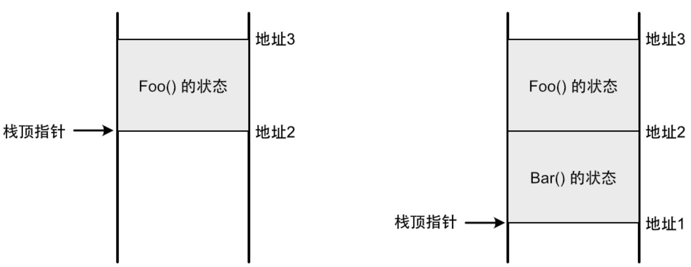
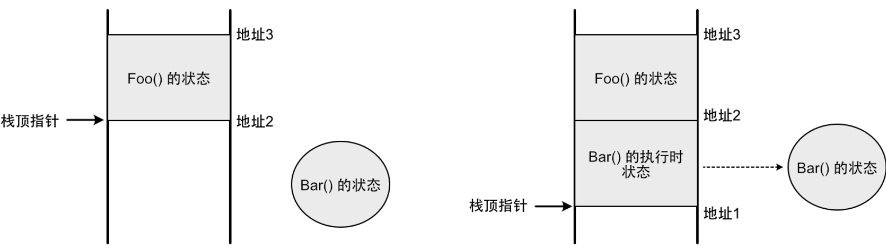
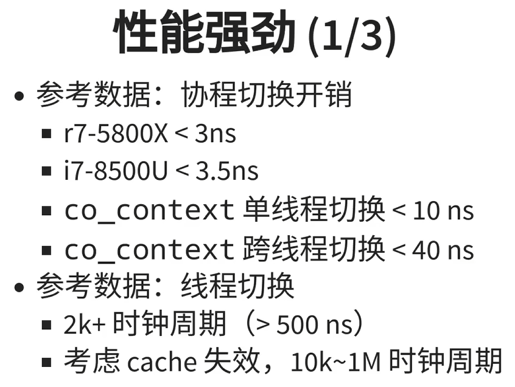
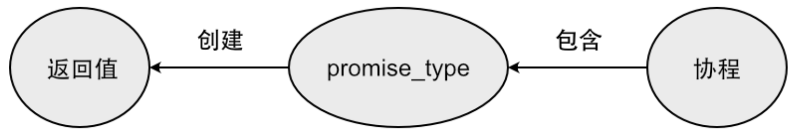
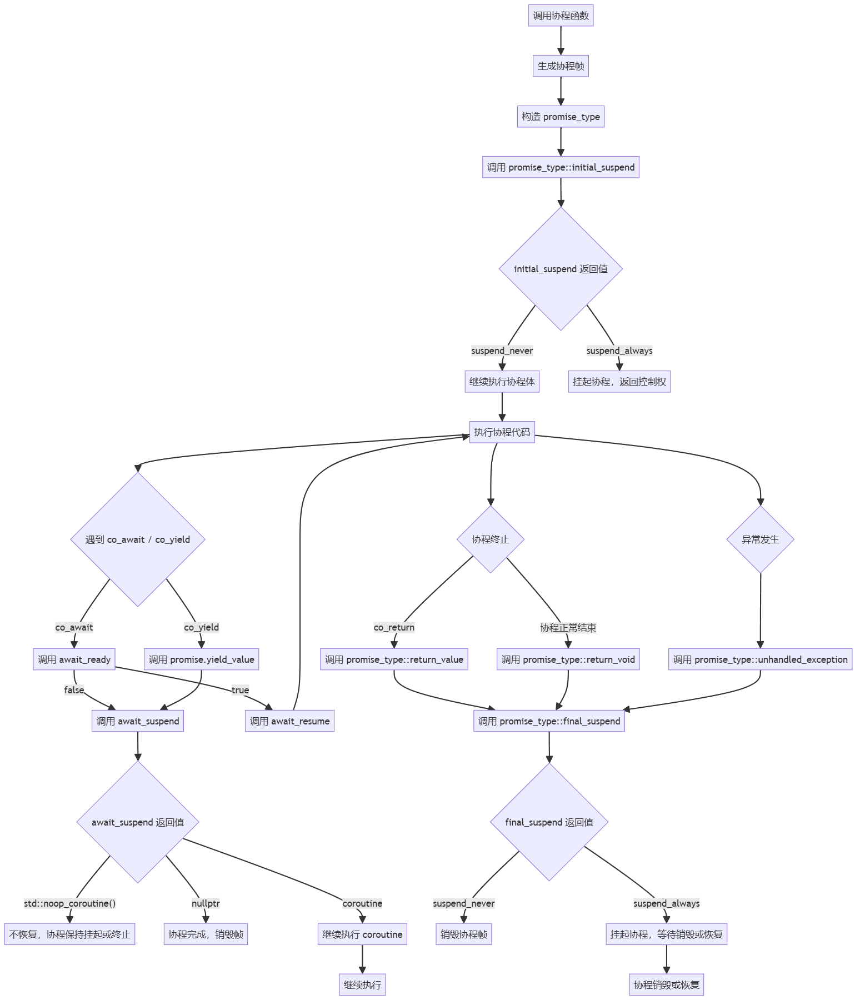
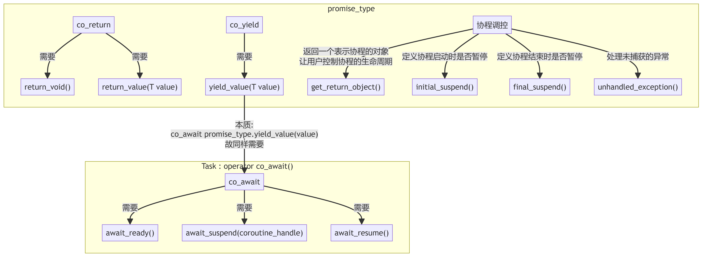

# 一、【C++20】从0开始自制协程库, 有手就行
学习参考:
- [Zplutor's C++20协程入门教程](https://zplutor.github.io/2022/03/25/cpp-coroutine-beginner/)
- [【C++20】从0开始自制协程库，有手就行（上）](https://www.bilibili.com/video/BV1Yz421Z7rZ/)
- [cppreference 协程](https://zh.cppreference.com/w/cpp/language/coroutines)

## 1.1 什么是协程?

> [!TIP]
> 定義: <span style="color:yellow">协程是一种可以暂停和恢复的函数.</span>

按照我们对普通函数的理解，函数暂停意味着线程停止运行了（就像命中了断点一样），那协程的不同之处在哪里呢？区别在于，普通函数是线程相关的，函数的状态跟线程紧密关联；而协程是线程无关的，它的状态与任何线程都没有关系。

这个解释比较抽象，为了更好地理解，我们先来回顾一下函数的调用机制。在调用一个函数的时候，线程的栈上会记录这个函数的状态（参数、局部变量等），这是通过移动栈顶指针来完成的。例如，函数`Foo()`调用`Bar()`的过程如下所示:

| ##container## |
|:--:|
||

首先，“地址3”到“地址2”这段空间，是分配给`Foo()`保存状态使用的，栈顶指针指向“地址2”；当调用`Bar()`的时候，栈顶指针移动到“地址1”，此时“地址2”到“地址1”这段空间是分配给`Bar()`保存状态使用的。当`Bar()`执行完毕，栈顶指针移动回“地址2”，`Bar()`的状态被销毁，内存空间被回收。

由此可见，函数状态的维护完全依赖于线程栈，脱离了线程，函数就不复存在，所以说函数是线程相关的。

而协程不一样，协程的状态是保存在堆内存上的。假设`Bar()`是一个协程，那么调用它的过程如下所示:

| ##container## |
|:--:|
||

首先，`Bar()`的状态所需的内存会在堆上分配，独立于线程栈而存在。传递给它的参数都会复制到这个状态中，而局部变量会直接在这个状态中创建。调用`Bar()`的时候，由于本质上还是一个函数调用，所以栈顶指针也会往下移动，在栈上给执行`Bar()`所需的状态分配空间，其中会有一个引用指向在堆上的状态，这样一来，`Bar()`就可以像一个普通函数那样执行了，线程也可以访问到位于堆上的状态。

如果协程需要暂停，那么当前执行到的代码位置会记录到堆的状态中。然后栈上的执行时状态被销毁，栈顶指针移动以回收空间，就像普通函数结束时那样。在下一次恢复执行时，堆状态中记录的暂停位置会读取出来，从这个位置接着执行。这样就实现了一个可暂停和恢复执行的函数。

由此可见，当协程执行的时候，它跟普通函数一样，也是需要依赖线程栈；但是，一旦它暂停了，它的状态就会独立保存在堆中，此时它跟任何线程都没有关系，调用它的线程可以继续去做其它事情而不会停止。在下一次恢复执行时，协程可以由上次执行的线程来执行，也可以由另外一个完全不同的线程来执行。所以说协程是线程无关的。

## 1.2 协程的优点

- 写法比基于回调函数的异步代码简单, 避免了回调地狱..; 写起协程就和普通的代码没有区别...

- 性能优于多线程, 切换开销极小:

| ##container## |
|:--:|
||
|来源: https://www.bilibili.com/video/BV1RV4y1L7ar/|

- 特别适用于I/O密集型任务

- ...

## 1.3 C++20中的协程

在C++中，只要在函数体内出现了`co_await`、`co_return`和`co_yield`这三个操作符中的其中一个，这个函数就成为了协程。

但是, C++定义了一个协议规范，只要我们的类型按照这个规范实现好，才可以使用`co_await`等。

### 1.3.1 co_await 和 Awaitable
我们先来关注一下`co_await`操作符。

这个规范称作`Awaitable`，它定义了若干个函数，传给`co_await`操作符的对象必须实现这些函数。这些函数包括:

- `await_ready()`: 返回类型是`bool`。协程在执行`co_await`的时候，会先调用`await_ready()`来询问“操作是否已完成”，如果函数返回了`true`，协程就**不会暂停**，而是继续往下执行。实现这个函数的原因是，异步调用的时序是不确定的，如果在执行`co_await`之前就已经启动了异步操作，那么在执行`co_await`的时候异步操作有可能已经完成了，在这种情况下就不需要暂停，通过`await_ready()`就可以到达到这个目的。

- `await_suspend()`: 有一个类型为`std::coroutine_handle<>`的参数，返回类型可以是`void`或者`bool`。如果`await_ready()`返回了`false`，意味着协程要**暂停**，那么紧接着会调用这个函数。该函数的目的是用来接收协程句柄（也就是`std::coroutine_handle<>`参数），并在异步操作完成的时候通过这个句柄让协程恢复执行。协程句柄类似于函数指针，它表示一个协程实例，调用句柄上的对应函数，可以让这个协程恢复执行。

- `await_suspend()`: 的返回类型一般为`void`，但也可以是`bool`，这时候的返回值用来控制协程是否真的要暂停，这里是第二次可以阻止协程暂停的机会。如果该函数返回了`false`，协程就**不会暂停**（注意返回值的含义跟`await_ready()`是相反的）。

- `await_resume()`: 返回类型可以是`void`，也可以是其它类型，它的返回值就是`co_await`操作符的返回值。当**协程恢复执行**，或者**不需要暂停**的时候，会调用这个函数。

```C++
class IntReader {
public:
    bool await_ready() { // 询问“操作是否已完成”
        return false;    // false: 暂停
    }

    void await_suspend(std::coroutine_handle<> handle) { // 协程句柄参数
        std::thread thread([this, handle]() { // 创建一个线程, 并且执行
            std::srand(static_cast<unsigned int>(std::time(nullptr)));
            value_ = std::rand(); // 生成随机数后 (作为返回值)
            handle.resume();      // 让协程继续执行
        });

        thread.detach(); // 分离线程, 不用join, 自己管理自己生命周期
    }

    int await_resume() { // 返回值: 当协程恢复执行，或者不需要暂停的时候，会调用这个函数。
        return value_;
    }

private:
    int value_{};
};

class MyTask { // 任务句柄
public:
    class promise_type {
    public:
        MyTask get_return_object() { return {}; }
        std::suspend_never initial_suspend() { return {}; }
        std::suspend_never final_suspend() noexcept { return {}; }
        void unhandled_exception() {}
        void return_void() {}
    };
};

MyTask PrintInt() { // 协程
    IntReader reader1;
    int total = co_await reader1;

    IntReader reader2;
    total += co_await reader2;

    IntReader reader3;
    total += co_await reader3;

    std::cout << total << std::endl;
}

int main() {
    PrintInt();
    HXTools::sleep(1s); // 暂停一秒
    return 0;
}
```

### 1.3.2 预定义的 Awaitable 类型
C++预定义了两个符合`Awaitable`规范的类型: `std::suspend_never`和`std::suspend_always`。顾名思义，这两个类型分别表示“不暂停”和“要暂停”，实际上它们的区别仅在于`await_ready()`函数的返回值，`std::suspend_never`会返回`true`，而`std::suspend_always`会返回`false`。除此之外，这两个类型的`await_supsend()`和`await_resume()`函数实现都是空的。

这两个类型是工具类，用来作为`promise_type`部分函数的返回类型，以控制协程在某些时机是否要暂停。下文会详细介绍`promise_type`。

### 1.3.3 协程的返回类型和 promise_type
现在我们把关注点聚焦在协程的返回类型上。C++对**协程的返回类型**只有一个要求: 

- 包含名为`promise_type`的内嵌类型。

跟上文介绍的`Awaitable`一样，`promise_type`需要符合C++规定的协议规范，也就是要定义几个特定的函数。`promise_type`是协程的一部分，当协程被调用，在堆上为其状态分配空间的时候，同时也会在其中创建一个对应的`promise_type`对象。通过在它上面定义的函数，我们可以与协程进行数据交互，以及控制协程的行为。

`promise_type`要实现的第一个函数是`get_return_object()`，用来**创建协程的返回值**。在协程内，我们不需要显式地创建返回值，这是由编译器隐式调用`get_return_object()`来创建并返回的。这个关系看起来比较怪异，`promise_type`是返回类型的内嵌类型，但编译器不会直接创建返回值，而是先创建一个`promise_type`对象，再通过这个对象来创建返回值。

| ##container## |
|:--:|
||

那么协程的返回值有什么用呢？这取决于协程的设计者的意图，取决于他想要以什么样的方式来使用协程。例如，在上文的示例中，`PrintInt()`这个协程只是输出一个整数，不需要与调用者有交互，所以它的返回值只是一个空壳。

假如我们想实现一个`GetInt()`协程，它会返回一个整数给调用者，由调用者来输出结果，那么就需要对协程的返回类型做一些修改了。

### 1.3.4 co_return
我们现在把`PrintInt()`修改成`GetInt()`。使用`co_return`操作符可以从协程中返回数据，如下所示:

```C++
MyTask GetInt() {
    IntReader reader1;
    int total = co_await reader1;

    IntReader reader2;
    total += co_await reader2;

    IntReader reader3;
    total += co_await reader3;

    co_return total;
}
```

`co_return total`这个表达式等价于`promise_type.return_value(total)`，也就是说，返回的数据会通过`return_value()`函数传递给`promise_type`对象，`promise_type`要实现这个函数才能接收到数据。除此之外，还要想办法让返回值`MyTask`能访问到这个数据。为了减少数据传递，我们可以在`promise_type`和`MyTask`之间共享同一份数据。修改之后的完整示例如下所示:

```C++
class IntReader {
public:
    bool await_ready() { // co_await 询问 操作是否已完成
        return false;    // false: 没有完成, 则调用 await_suspend
                         // true: 已完成, 直接返回
    }

    void await_suspend(std::coroutine_handle<> handle) { // 协程句柄参数
        std::thread thread([this, handle]() { // 创建一个线程, 并且执行
            std::srand(static_cast<unsigned int>(std::time(nullptr)));
            value_ = std::rand(); // 生成随机数后 (作为返回值)
            handle.resume();      // 让协程继续执行
        });

        thread.detach(); // 分离线程, 不用join, 自己管理自己生命周期
    }

    int await_resume() { // 返回值: 当协程恢复执行，或者不需要暂停的时候，会调用这个函数。
        return value_;
    }

private:
    int value_{};
};

class MyTask { // 任务句柄
public:
    class promise_type {
/**
 * 在C++协程中，当创建promise_type对象时，
 * 编译器会根据协程函数的声明和上下文选择合适的构造函数。
 * 如果promise_type有多个构造函数，那么编译器会根据以下规则选择最合适的构造函数：
 * 
 * 1. 无参构造函数:
 * 如果promise_type有一个无参构造函数，
 * 且该构造函数能够初始化所有成员变量，
 * 那么编译器会优先选择这个构造函数。
 * 
 * 2. 匹配参数的构造函数:
 * 如果协程函数传递了额外的参数，
 * 这些参数可以被传递给promise_type的构造函数来初始化其成员变量，
 * 那么编编译器会选择能匹配这些参数的构造函数。
 * 
 * 3. 编译器的选择:
 * 编译器根据构造函数的参数和初始化要求来选择最合适的构造函数。
 * 如果有多个匹配的构造函数且没有明显的最佳选择，则编译会失败，要求提供明确的构造函数选择。
 */
    public:
        promise_type() 
        : value_(std::make_shared<int>()) 
        {}

        MyTask get_return_object() { // 3. 构建返回对象
            return MyTask{ value_ };
        }

        void return_value(int value) { // 2. 保存返回值
            *value_ = value;
        }
        std::suspend_never initial_suspend() { return {}; }
        std::suspend_never final_suspend() noexcept { return {}; }
        void unhandled_exception() {}

   private:
        std::shared_ptr<int> value_;
    };

public:
    MyTask(const std::shared_ptr<int>& value) 
    : value_(value) 
    {}

    int GetValue() const {
        return *value_;
    }

private:
    std::shared_ptr<int> value_;
};

MyTask GetInt() {
    // 调用协程(第一次进入)的瞬间: 创建一个promise_type对象

    IntReader reader1;
    std::cout << "等待...\n";
    std::this_thread::sleep_for(0.5s); // 程序阻塞于此

    int total = co_await reader1; // 返回执行权限给 main (), get_return_object() 返回一个 MyTask
    std::cout << "OK!!!\n"; // 由 await_suspend 创建的线程, 唤醒 我这个协程继续执行, 下面同理
                            // 先调用 await_resume 恢复
    IntReader reader2;
    total += co_await reader2;

    IntReader reader3;
    total += co_await reader3;

    co_return total; // 1. 返回: 等价于 promise_type.return_value(total)
}


int main() {
    auto task = GetInt();
    std::cout << task.GetValue() << '\n'; // GetInt() 还在执行, 此处无值
    std::this_thread::sleep_for(1s);
    std::cout << task.GetValue() << '\n'; // GetInt() 执行完毕, 有值
    return 0;
}
```
在真实的使用场景中，协程的返回类型还需要提供各种同步机制才能给调用者使用，例如加上回调、通知等，就像普通的异步操作一样。由此可见，协程的优点体现在它内部的代码逻辑上，而不是对外的使用方式上。当然，我们也可以让协程的返回类型实现`Awaitable`规范，让它可以被另外一个协程更好地调用。这样一来，调用协程的也必须是协程，这样层层往上传递，直到遇到不能改成协程的函数为止，例如`main()`函数。从这个角度来说，协程也是具有传染性的。

最后，跟普通的`return`一样，`co_return`也可以不带任何参数，这时候协程以不带数据的方式返回，相当于调用了`promise_type.return_void()`，`promise_type`需要定义这个函数以支持不带数据的返回。如果我们在协程结束的时候没有调用任何`co_return`，那么编译器会隐式地加上一个不带参数的`co_return`调用。

### 1.3.5 co_yield
当协程调用了`co_return`，意味着协程结束了，就跟我们在普通函数中用`return`结束函数一样。这时候，与这个协程实例有关的内存都会被释放掉，它不能再执行了。如果需要在协程中多次返回数据而不结束协程的话，可以使用`co_yield`操作符。

`co_yield`的作用是: 返回一个数据，并且让协程暂停，然后等下一次机会恢复执行。 

- `co_yield value`这个表达式等价于`co_await promise_type.yield_value(value)`

`co_yield`的参数会传递给`promise_type`的`yield_value()`函数，再把这个函数的返回值传给`co_await`。上文提到，传给`co_await`的参数要符合`Awaitable`规范，所以`yield_value()`的返回类型也要满足这个规范。

在这里就可以使用预定义的`std::supsend_never`或`std::suspend_always`，通常会使用后者来让协程每次调用`co_yield`的时候都暂停。

```C++
class IntReader {
public:
    bool await_ready() {
        return false;
    }

    void await_suspend(std::coroutine_handle<> handle) {
        std::thread thread([this, handle]() {
            static int seed = 0;
            value_ = ++seed;
            handle.resume();
        });
        thread.detach();
    }

    int await_resume() {
        return value_;
    }

private:
    int value_{};
};

class MyTask {
public:
    class promise_type {
    public:
        MyTask get_return_object() { 
            // 这意味着 Task 需要拿到协程的句柄, 
            // 这是在 promise_type 的 get_return_object() 中通过以下方式传递过去的
            return MyTask{ std::coroutine_handle<promise_type>::from_promise(*this) };
        }

        // 在 promise_type 中定义了 yield_value() 函数来接收 co_yield 返回的数据。
        // 我们希望返回数据之后立即暂停协程, 所以返回类型定义成了 std::supsend_always
        std::suspend_always yield_value(int value) {
            value_ = value;
            return {};
        }

        void return_void() { }
        std::suspend_never initial_suspend() { return {}; }
        std::suspend_never final_suspend() noexcept { return {}; }
        void unhandled_exception() {}

        int GetValue() const {
            return value_;
        }

    private:
        int value_{};
    };

public:
    MyTask(std::coroutine_handle<promise_type> handle) 
    : coroutine_handle_(handle) 
    {}

    int GetValue() const {
        // std::coroutine_handle 的 from_promise() 函数可以通过 promise_type 对象获取与之关联的协程句柄, 
        // 反之, 协程句柄上也有一个 promise() 函数可以获取对应的 promise_type 对象, 他们是可以互相转换的。
        // 所以, 在 Task 和 promise_type 之间就不需要使用 std::shared_ptr<int> 来共享数据了, 
        // Task 通过协程句柄就能访问到 promise_type 对象, 像下面这样直接取数据就可以了
        return coroutine_handle_.promise().GetValue();
    }

    /// @brief 为了让使用者可以恢复协程执行, Task 增加了一个 Next() 函数, 
    /// 这个函数调用了作为成员变量的协程句柄来恢复执行
    void Next() {
        coroutine_handle_.resume();
    }

private:
/**
 * @warning 这里要注意一下协程句柄 std::coroutine_handle 的模板类型。
 * 在前面的例子中, 协程句柄的类型是 std::coroutine_handle<>, 不带模板参数; (如 await_suspend 的参数)
 * 而在这个例子中, 协程句柄的类型是 std::coroutine_handle<promise_type>,
 * 模板参数中填入了 promise_type 类型。它们的区别类似于指针 void* 和 promise_type* 的区别 ,
 * 前者是无类型的, 后者是强类型的。
 * 两种类型的协程句柄本质上是相同的东西, 它们可以有相同的值, 指向同一个协程实例 ,而且也都可以恢复协程执行。
 * 但只有强类型的 std::coroutine_handle<promise_type> 才能调用 from_promise() 获取到 promise_type 对象。
 */
    std::coroutine_handle<promise_type> coroutine_handle_;
};

MyTask GetInt() {
    while (true) {
        IntReader reader;
        int value = co_await reader; // 第一次进入: 等待处理(创新线程管理协程状态), 移交执行权给main, 并返回
        co_yield value;              // 线程执行完恢复协程, 就准备好返回值了
    }
}

int main() {
    auto task = GetInt();
    std::string line;
    while (std::cin >> line) { // 等待输入
        std::cout << task.GetValue() << std::endl;
        task.Next(); // 继续执行协程
    }
    return 0;
}
```

### 1.3.5 协程的生命周期
正如上文所说的，在一开始调用协程的时候，C++会在堆上为协程的状态分配内存，这块内存必须在适当的时机来释放，否则就会造成内存泄漏。释放协程的内存有两种方式：自动释放和手动释放。

当协程结束的时候，如果我们不做任何干预，那么协程的内存就会被自动释放。调用了`co_return`语句之后，协程就会结束，下面两个协程是自动释放的例子:

```C++
Task GetInt() {
    IntReader reader;
    int value = co_await reader;
    co_return value;
}

Task PrintInt() {
    IntReader reader1;
    int value = co_await reader;
    std::cout << value << std::endl;
}
```
> [!TIP]
> `PrintInt()`没有出现`co_return`语句，编译器会在末尾隐式地加上`co_return`。

自动释放的方式有时候并不是我们想要的，参考下面这个例子:

```C++
class MyTask {
public:
    class promise_type {
    public:
        MyTask get_return_object() {
            return MyTask{ std::coroutine_handle<promise_type>::from_promise(*this) };
        }

        void return_value(int value) {
            value_ = value;
        }

        int GetValue() const {
            return value_;
        }

        std::suspend_never initial_suspend() { return {}; }
        std::suspend_never final_suspend() noexcept { return {}; }
        void unhandled_exception() {}

    private:
        int value_{};
    };

public:
    MyTask(std::coroutine_handle<promise_type> handle)
    : coroutine_handle_(handle)
    {}

    int GetValue() const {
        return coroutine_handle_.promise().GetValue();
    }

private:
    std::coroutine_handle<promise_type> coroutine_handle_;
};

MyTask GetInt() {
    co_return 1024;
}

int main() {
    auto task = GetInt();
    std::string line;
    while (std::cin >> line) {
        std::cout << task.GetValue() << std::endl;
    }
    return 0;
}
```

在这个例子中，`GetInt()`协程通过`co_return`返回了`1024`给`promise_type`；协程返回值`MyTask`通过协程句柄访问`promise_type`，从中取出这个值。随着用户的输入，把这个值输出来。运行程序，我们会发现输出的值并不是`1024`，而是一个随机值；也有可能会出现地址访问错误的异常。

造成这个现象的原因是，协程在返回`1024`之后就被自动释放了，`promise_type`也跟着被一起释放了，此时在`MyTask`内部持有的协程句柄已经变成了野指针，指向一块已经被释放的内存。所以访问这个协程句柄的任何行为都会造成不确定的后果。

解决这个问题的方法是，修改`promise_type`中`final_supsend()`函数的返回类型，从`std::suspend_never`改成`std::suspend_always`。协程在结束的时候，会调用`final_suspend()`来决定是否暂停，如果这个函数返回了要暂停，那么协程不会自动释放，此时协程句柄还是有效的，可以安全访问它内部的数据。

不过，这时候释放协程就变成我们的责任了，我们必须在适当的时机调用协程句柄上的`destroy()`函数来手动释放这个协程。在这个例子中，可以在`MyTask`的析构函数中做这个事情:

```C++
// class promise_type 中:
std::suspend_always final_suspend() noexcept { return {}; }

// class MyTask 中:
~MyTask() {
    if (coroutine_handle_)
        coroutine_handle_.destroy();
}
```
只要协程处于暂停状态，就可以调用协程句柄的`destroy()`函数来释放它，不一定要求协程结束。对于通过无限循环来实现的协程，手动释放是必需的。

与`final_suspend()`相对应的是`initial_suspend()`，在协程刚开始执行的时候，会调用这个函数来决定是否暂停。我们可以将这个函数的返回类型改成`std::suspend_always`来让协程一执行即暂停。这对于一些需要延迟执行的场景是有用的，例如，我们想先获取一批协程句柄，像数据那样对它们进行管理，在稍后的时机再挑选合适的协程来执行。

### 1.3.6 异常处理
最后，我们看一下协程的异常处理。编译器生成的执行协程的伪代码大概如下所示:

```C++
try {
    co_await promise_type.initial_suspend();
    //协程函数体的代码...
}
catch (...) {
    promise_type.unhandled_exception();
}
co_await promise_type.final_suspend();
```
协程主要的执行代码都被`try - catch`包裹，假如抛出了未处理的异常，`promise_type`的`unhandled_exception()`函数会被调用，我们可以在这个函数里面做对应的异常处理。由于这个函数是在`catch`语句中调用的，我们可以在函数内调用`std::current_exception()`函数获取异常对象，也可以调用`throw`重新抛出异常。

调用了`unhandled_exception()`之后，协程就结束了，接下来会继续调用`final_suspend()`，与正常结束协程的流程一样。C++规定`final_suspend()`必须定义成`noexcept`，也就是说它不允许抛出任何异常。

总结:
- 协程在异常发生后通常不能继续恢复执行，因为异常处理阶段会终止协程的正常执行。

- `final_suspend`方法允许你定义协程在结束时的行为，无论是处理异常后的清理还是直接结束。

- 异常处理和恢复需要精心设计，以确保协程的资源能够正确释放，避免内存泄漏或其他资源泄露问题。

### 1.3.7 总结

- 调用关系 (注: `get_return_object`才是最先调用的(主要作用是返回一个可以表示协程的对象))

| ##container## |
|:--:|
||

- 必需の定义与定义位置

| ##container## |
|:--:|
||

### 1.3.8 未定义行为

- 如果协程A正在 co_await 协程 B, 此时如果再次 对协程A 进行.resume(), 则是非常危险的! 算是未定义行为!

## 1.4 协程实例
> 上面只是简单的介绍, 下面正式开始!

> [!TIP]
> 注: 如果是标准库的, 则使用下划线命名(也只能这样); 我们自己定义的, 则使用驼峰命名

### 1.4.1 初识

- 区分: `RepeatAwaiter`与`RepeatAwaitable`

- Task中不一定要内嵌`promise_type`类, 使用using也没问题!

- 使用class与struct都可以 (废话) (不就是class + public吗)

```C++
struct RepeatAwaiter { // awaiter(原始指针) / awaitable(operator->)
    bool await_ready() const noexcept { 
        return false;
    }

    /**
     * @brief 它的返回值决定了协程在挂起后是否以及如何恢复。这个返回值类型是灵活的!
     * @param coroutine 
     * @return 可以返回指向同一个协程、另一个协程、或 std::noop_coroutine() 的句柄。
     * 
     * std::noop_coroutine():
     * 返回这个特殊的协程句柄表示没有实际的工作需要做。
     * 这意味着当前协程被挂起后, 不需要恢复任何协程的执行。这通常用于表示协程已经完成了其目的, 没有后续操作。
     * 
     * std::coroutine_handle<>::from_address(nullptr) 或等效值:
     * 指示协程已完成, 其协程帧应该被销毁。这种情况下, 控制权返回给调度器或协程的调用者。
     * 
     * coroutine (传入的协程句柄):
     * 返回传入的协程句柄表示恢复执行这个协程。这通常用于协程之间的切换或控制流的转移。
     */
    std::coroutine_handle<> await_suspend(std::coroutine_handle<> coroutine) const noexcept {
        // (每次co_yield)停止执行
        // return std::noop_coroutine();

        // 如果 coroutine 可以执行就继续执行
        if (coroutine.done())
            return std::noop_coroutine();
        else
            return coroutine; // 继续执行本协程
    }

    void await_resume() const noexcept {}
};

struct RepeatAwaitable { // awaitable(operator->)
    RepeatAwaiter operator co_await() {
        return RepeatAwaiter(); // 类型转换
    }
};

struct Promise {
    auto initial_suspend() {
        return std::suspend_always(); // 返回协程控制权
    }

    auto final_suspend() noexcept {
        return std::suspend_always();
    }

    void unhandled_exception() {
        throw;
    }

    auto yield_value(int ret) {
        mRetValue = ret;
        return RepeatAwaiter(); // 必须满足所谓的规范
    }

    void return_void() {
        mRetValue = 0;
    }

    std::coroutine_handle<Promise> get_return_object() {
        return std::coroutine_handle<Promise>::from_promise(*this);
    }

    int mRetValue;
};

/// @brief 定义协程任务句柄
struct Task {
    using promise_type = Promise; // 协程任务 必需要包含 promise_type

    Task(std::coroutine_handle<promise_type> coroutine) // 会自行选择合适的构造函数 (可以理解成 [](){} 的捕获)
        : mCoroutine(coroutine) {}

    std::coroutine_handle<promise_type> mCoroutine; // 协程句柄
};

Task hello() {
    debug(), "hello 42";
    co_yield 42;
    debug(), "hello 12";
    co_yield 12;
    debug(), "hello 6";
    co_yield 6;
    debug(), "hello 结束";
    co_return;
}

int main() {
    debug(), "main即将调用hello";
    Task t = hello();
    debug(), "main调用完了hello";
    // 实际上上面什么也没有做(并没有调用hello) 
    // 因为 initial_suspend 是 return std::suspend_always(); // 返回协程控制权

    while (!t.mCoroutine.done()) {
        t.mCoroutine.resume();
        debug(), "main得到hello结果为",
            t.mCoroutine.promise().mRetValue;
    }
    return 0;
}
```

执行输出:

```C++
step1.cpp:97:    main即将调用hello
step1.cpp:99:    main调用完了hello
step1.cpp:86:    hello 42
step1.cpp:88:    hello 12
step1.cpp:90:    hello 6
step1.cpp:92:    hello 结束
step1.cpp:104:   main得到hello结果为 0
```

### 1.4.2 协程中等待协程

```C++
#include <chrono>
#include <coroutine>
#include "debug.hpp"

struct PreviousAwaiter {
    std::coroutine_handle<> mPrevious;

    bool await_ready() const noexcept { return false; }

    std::coroutine_handle<> await_suspend(std::coroutine_handle<> coroutine) const noexcept {
        if (mPrevious) // 如果 Task 协程可以继续执行, 则执行
            return mPrevious;
        else
            return std::noop_coroutine(); // 挂起
    }

    void await_resume() const noexcept {}
};

struct Promise {
    auto initial_suspend() {
        return std::suspend_always();
    }

    auto final_suspend() noexcept {
        return PreviousAwaiter(mPrevious);
    }

    void unhandled_exception() {
        throw;
    }

    auto yield_value(int ret) {
        mRetValue = ret;
        return std::suspend_always();
    }

    void return_void() {
        mRetValue = 0;
    }

    std::coroutine_handle<Promise> get_return_object() {
        return std::coroutine_handle<Promise>::from_promise(*this);
    }

    int mRetValue;
    std::coroutine_handle<> mPrevious = nullptr;
};

struct Task {
    using promise_type = Promise;

    Task(std::coroutine_handle<promise_type> coroutine)
        : mCoroutine(coroutine) {}

    Task(Task &&) = delete;

    ~Task() {
        mCoroutine.destroy();
    }

    std::coroutine_handle<promise_type> mCoroutine;
};

struct WorldTask {
    using promise_type = Promise;

    WorldTask(std::coroutine_handle<promise_type> coroutine)
        : mCoroutine(coroutine) {}

    WorldTask(WorldTask &&) = delete;

    ~WorldTask() {
        mCoroutine.destroy();
    }

    struct WorldAwaiter {
        bool await_ready() const noexcept { return false; }

        std::coroutine_handle<> await_suspend(std::coroutine_handle<> coroutine) const noexcept {
            mCoroutine.promise().mPrevious = coroutine; // 保存这个协程的上下文句柄(调用者Task)
            return mCoroutine;
        }

        void await_resume() const noexcept {}

        std::coroutine_handle<promise_type> mCoroutine;
    };

    auto operator co_await() {
        return WorldAwaiter(mCoroutine);
    }

    std::coroutine_handle<promise_type> mCoroutine;
};

WorldTask world() {
    debug(), "world";
    co_yield 422;
    co_yield 444;
    co_return;
}

Task hello() {
    debug(), "hello 正在构建worldTask";
    WorldTask worldTask = world();
    debug(), "hello 构建完了worldTask, 开始等待world";
    co_await worldTask; // 等待 worldTask, worldTask OK后, 回来这里, 立马又移交执行权限给上下文(main), 然后再恢复才执行下面:
    debug(), "hello得到world返回", worldTask.mCoroutine.promise().mRetValue;
    co_await worldTask;
    debug(), "hello得到world返回", worldTask.mCoroutine.promise().mRetValue;
    debug(), "hello 42";
    co_yield 42;
    debug(), "hello 12";
    co_yield 12;
    debug(), "hello 6";
    co_yield 6;
    debug(), "hello 结束";
    co_return;
}

int main() {
    debug(), "main即将调用hello";
    Task t = hello();
    debug(), "main调用完了hello"; // 其实只创建了task对象，并没有真正开始执行
    while (!t.mCoroutine.done()) {
        t.mCoroutine.resume();
        debug(), "main得到hello结果为",
            t.mCoroutine.promise().mRetValue;
    }
    return 0;
}
```

输出:
```C++
step2.cpp:123:   main即将调用hello
step2.cpp:125:   main调用完了hello
step2.cpp:105:   hello 正在构建worldTask
step2.cpp:107:   hello 构建完了worldTask, 开始等待world
step2.cpp:98:    world                     【A】
step2.cpp:128:   main得到hello结果为 0       【B】
step2.cpp:109:   hello得到world返回 422     【C】
step2.cpp:128:   main得到hello结果为 0
step2.cpp:111:   hello得到world返回 444
step2.cpp:112:   hello 42
step2.cpp:128:   main得到hello结果为 42
step2.cpp:114:   hello 12
step2.cpp:128:   main得到hello结果为 12
step2.cpp:116:   hello 6
step2.cpp:128:   main得到hello结果为 6
step2.cpp:118:   hello 结束
step2.cpp:128:   main得到hello结果为 0
```
注意上面的[ABC]处

### 1.4.3 比 1.4.2 更简单的示例

```C++
#include <chrono>
#include <coroutine>
#include "debug.hpp"

struct RepeatAwaiter {
    bool await_ready() const noexcept { return false; }

    std::coroutine_handle<> await_suspend(std::coroutine_handle<> coroutine) const noexcept {
        if (coroutine.done())
            return std::noop_coroutine();
        else
            return coroutine;
    }

    void await_resume() const noexcept {}
};

struct PreviousAwaiter {
    std::coroutine_handle<> mPrevious;

    bool await_ready() const noexcept { return false; }

    std::coroutine_handle<> await_suspend(std::coroutine_handle<> coroutine) const noexcept {
        if (mPrevious)
            return mPrevious;
        else
            return std::noop_coroutine();
    }

    void await_resume() const noexcept {}
};

struct Promise {
    auto initial_suspend() {
        return std::suspend_always();
    }

    auto final_suspend() noexcept {
        return PreviousAwaiter(mPrevious);
    }

    void unhandled_exception() {
        throw;
    }

    auto yield_value(int ret) {
        mRetValue = ret;
        return std::suspend_always();
    }

    void return_value(int ret) {
        mRetValue = ret;
    }

    std::coroutine_handle<Promise> get_return_object() {
        return std::coroutine_handle<Promise>::from_promise(*this);
    }

    int mRetValue;
    std::coroutine_handle<> mPrevious = nullptr;
};

struct Task {
    using promise_type = Promise;

    Task(std::coroutine_handle<promise_type> coroutine)
        : mCoroutine(coroutine) {}

    Task(Task &&) = delete;

    ~Task() {
        mCoroutine.destroy();
    }

    struct Awaiter {
        bool await_ready() const { return false; }

        std::coroutine_handle<> await_suspend(std::coroutine_handle<> coroutine) const {
            mCoroutine.promise().mPrevious = coroutine;
            return mCoroutine;
        }

        auto await_resume() const { return mCoroutine.promise().mRetValue; }

        std::coroutine_handle<promise_type> mCoroutine;
    };

    auto operator co_await() const {
        return Awaiter(mCoroutine);
    }

    std::coroutine_handle<promise_type> mCoroutine;
};

Task world() {
    debug(), "world";
    co_return 41;
}

Task hello() {
    int i = co_await world();
    debug(), "hello得到world结果为", i;
    co_return i + 1;
}

int main() {
    debug(), "main即将调用hello";
    Task t = hello();
    debug(), "main调用完了hello"; // 其实只创建了task对象, 并没有真正开始执行
    while (!t.mCoroutine.done()) {
        t.mCoroutine.resume();
        debug(), "main得到hello结果为",
            t.mCoroutine.promise().mRetValue;
    }
    return 0;
}
```

输出:

```C++
step3.cpp:108:   main即将调用hello
step3.cpp:110:   main调用完了hello
step3.cpp:97:    world
step3.cpp:103:   hello得到world结果为 41
step3.cpp:113:   main得到hello结果为 42
```

### 1.4.4 模版Task与异常处理

```C++
struct RepeatAwaiter {
    bool await_ready() const noexcept { return false; }

    std::coroutine_handle<> await_suspend(std::coroutine_handle<> coroutine) const noexcept {
        if (coroutine.done())
            return std::noop_coroutine();
        else
            return coroutine;
    }

    void await_resume() const noexcept {}
};

struct PreviousAwaiter {
    std::coroutine_handle<> mPrevious;

    bool await_ready() const noexcept { return false; }

    std::coroutine_handle<> await_suspend(std::coroutine_handle<> coroutine) const noexcept {
        if (mPrevious)
            return mPrevious;
        else
            return std::noop_coroutine();
    }

    void await_resume() const noexcept {}
};

template <class T>
struct Promise {
    auto initial_suspend() noexcept {
        return std::suspend_always();
    }

    auto final_suspend() noexcept {
        return PreviousAwaiter(mPrevious);
    }

    void unhandled_exception() noexcept {
        mException = std::current_exception(); // 保存异常信息
    }

    auto yield_value(T ret) noexcept {
        new (&mResult) T(std::move(ret));
        return std::suspend_always();
    }

    void return_value(T ret) noexcept {
        new (&mResult) T(std::move(ret));
    }

    T result() {
        if (mException) [[unlikely]] { // unlikely 是告诉编译器 if内 为冷代码 (很少为true)
            std::rethrow_exception(mException);
        }
        T ret = std::move(mResult);
        mResult.~T();
        return ret;
    }

    std::coroutine_handle<Promise> get_return_object() {
        return std::coroutine_handle<Promise>::from_promise(*this);
    }

    std::coroutine_handle<> mPrevious{};
    std::exception_ptr mException{};
    union { // 使用 union 可以避免初始化
        T mResult;
    };

    Promise() noexcept {}
    Promise(Promise &&) = delete;
    ~Promise() {}
};

template <>
struct Promise<void> { // 模版特化
    auto initial_suspend() noexcept {
        return std::suspend_always();
    }

    auto final_suspend() noexcept {
        return PreviousAwaiter(mPrevious);
    }

    void unhandled_exception() noexcept {
        mException = std::current_exception();
    }

    void return_void() noexcept {
    }

    void result() {
        if (mException) [[unlikely]] {
            std::rethrow_exception(mException);
        }
    }

    std::coroutine_handle<Promise> get_return_object() {
        return std::coroutine_handle<Promise>::from_promise(*this);
    }

    std::coroutine_handle<> mPrevious{};
    std::exception_ptr mException{};

    Promise() = default;
    Promise(Promise &&) = delete;
    ~Promise() = default;
};

template <class T>
struct Task {
    using promise_type = Promise<T>;

    Task(std::coroutine_handle<promise_type> coroutine) noexcept
        : mCoroutine(coroutine) {}

    Task(Task &&) = delete;

    ~Task() {
        mCoroutine.destroy();
    }

    struct Awaiter {
        bool await_ready() const noexcept { return false; }

        std::coroutine_handle<promise_type> await_suspend(std::coroutine_handle<> coroutine) const noexcept {
            mCoroutine.promise().mPrevious = coroutine;
            return mCoroutine;
        }

        T await_resume() const {
            return mCoroutine.promise().result();
        }

        std::coroutine_handle<promise_type> mCoroutine;
    };

    auto operator co_await() const noexcept {
        return Awaiter(mCoroutine);
    }

    std::coroutine_handle<promise_type> mCoroutine;
};

Task<std::string> baby() {
    debug(), "baby";
    co_return "aaa\n";
}

Task<double> world() {
    debug(), "world";
    co_return 3.14;
}

Task<int> hello() {
    auto ret = co_await baby();
    debug(), ret;
    int i = (int)co_await world();
    debug(), "hello得到world结果为", i;
    co_return i + 1;
}

int main() {
    debug(), "main即将调用hello";
    auto t = hello();
    debug(), "main调用完了hello"; // 其实只创建了task对象，并没有真正开始执行
    while (!t.mCoroutine.done()) {
        t.mCoroutine.resume();
        debug(), "main得到hello结果为",
            t.mCoroutine.promise().result();
    }
    return 0;
}
```

### 1.4.5 基于堆的协程计时器

```C++
/**
 * @brief 协程模式: 不暂停
 */
struct RepeatAwaiter {
    bool await_ready() const noexcept { return false; }

    std::coroutine_handle<> await_suspend(std::coroutine_handle<> coroutine) const noexcept {
        if (coroutine.done())
            return std::noop_coroutine();
        else
            return coroutine;
    }

    void await_resume() const noexcept {}
};

/**
 * @brief 协程模式: 暂停, 会运行之前的协程
 */
struct PreviousAwaiter {
    std::coroutine_handle<> mPrevious;

    bool await_ready() const noexcept { return false; }

    std::coroutine_handle<> await_suspend(std::coroutine_handle<> coroutine) const noexcept {
        if (mPrevious)
            return mPrevious;
        else
            return std::noop_coroutine();
    }

    void await_resume() const noexcept {}
};

/**
 * @brief 主模版
 */
template <class T>
struct Promise {
    auto initial_suspend() noexcept {
        return std::suspend_always();
    }

    auto final_suspend() noexcept {
        return PreviousAwaiter(mPrevious);
    }

    void unhandled_exception() noexcept {
        mException = std::current_exception();
    }

    auto yield_value(T ret) noexcept {
        new (&mResult) T(std::move(ret)); // 生成协程的中间结果
        return std::suspend_always();     // 挂起协程
    }

    void return_value(T ret) noexcept {
        new (&mResult) T(std::move(ret)); // 设置协程的返回值
    }

    T result() {
        if (mException) [[unlikely]] {
            std::rethrow_exception(mException);
        }
        T ret = std::move(mResult);
        mResult.~T();
        return ret;
    }

    std::coroutine_handle<Promise> get_return_object() {
        return std::coroutine_handle<Promise>::from_promise(*this); // 获取协程句柄
    }

    std::coroutine_handle<> mPrevious{}; // 上一个协程句柄
    std::exception_ptr mException{};
    union {
        T mResult;
    };

    Promise() noexcept {}
    Promise(Promise &&) = delete;
    ~Promise() {}
};

template <>
struct Promise<void> {
    auto initial_suspend() noexcept {
        return std::suspend_always();
    }

    auto final_suspend() noexcept {
        return PreviousAwaiter(mPrevious); // 协程结束时使用 PreviousAwaiter 进行处理
    }

    void unhandled_exception() noexcept {
        mException = std::current_exception();
    }

    void return_void() noexcept {
    }

    void result() {
        if (mException) [[unlikely]] {
            std::rethrow_exception(mException); // 重新抛出异常
        }
    }

    std::coroutine_handle<Promise> get_return_object() {
        return std::coroutine_handle<Promise>::from_promise(*this);
    }

    std::coroutine_handle<> mPrevious{}; // 上一个协程句柄
    std::exception_ptr mException{};

    Promise() = default;
    Promise(Promise &&) = delete;
    ~Promise() = default;
};

template <class T = void>
struct Task {
    using promise_type = Promise<T>;

    Task(std::coroutine_handle<promise_type> coroutine) noexcept
        : mCoroutine(coroutine) {}

    Task(Task &&) = delete;

    ~Task() {
        mCoroutine.destroy();
    }

    struct Awaiter {
        bool await_ready() const noexcept { return false; }

        std::coroutine_handle<promise_type> await_suspend(std::coroutine_handle<> coroutine) const noexcept {
            mCoroutine.promise().mPrevious = coroutine;
            return mCoroutine;
        }

        T await_resume() const {
            return mCoroutine.promise().result();
        }

        std::coroutine_handle<promise_type> mCoroutine;
    };

    auto operator co_await() const noexcept {
        return Awaiter(mCoroutine);
    }

    operator std::coroutine_handle<>() const noexcept {
        return mCoroutine;
    }

    std::coroutine_handle<promise_type> mCoroutine;
};

/**
 * @brief 基于小根堆的计时器系统
 */
struct Loop {
    /// @brief 协程句柄队列
    std::deque<std::coroutine_handle<>> mReadyQueue;

    /// @brief 计时器块
    struct TimerEntry {
        std::chrono::system_clock::time_point expireTime; // 结束时间点
        std::coroutine_handle<> coroutine; // 协程句柄

        bool operator<(TimerEntry const &that) const noexcept {
            return expireTime > that.expireTime;
        }
    };

    // 堆
    std::priority_queue<TimerEntry> mTimerHeap;

    /**
     * @brief 添加任务
     * @param coroutine 
     */
    void addTask(std::coroutine_handle<> coroutine) {
        mReadyQueue.push_front(coroutine);
    }

    /**
     * @brief 添加计时器
     * @param expireTime 
     * @param coroutine 
     */
    void addTimer(std::chrono::system_clock::time_point expireTime, std::coroutine_handle<> coroutine) {
        mTimerHeap.push({expireTime, coroutine});
    }

    void runAll() { // 协程调度器?
        while (!mTimerHeap.empty() || !mReadyQueue.empty()) {
            while (!mReadyQueue.empty()) {
                auto coroutine = mReadyQueue.front();
                mReadyQueue.pop_front();
                coroutine.resume();
            }
            if (!mTimerHeap.empty()) {
                auto nowTime = std::chrono::system_clock::now();
                auto timer = std::move(mTimerHeap.top());
                if (timer.expireTime < nowTime) {
                    mTimerHeap.pop();
                    timer.coroutine.resume();
                } else {
                    std::this_thread::sleep_until(timer.expireTime); // 继续等待
                }
            }
        }
    }

    Loop &operator=(Loop &&) = delete;
};

/**
 * @brief 全局懒汉单例
 * @return Loop& 
 */
Loop &getLoop() {
    static Loop loop;
    return loop;
}

struct SleepAwaiter {
    bool await_ready() const noexcept {
        return false;
    }

    void await_suspend(std::coroutine_handle<> coroutine) const {
        getLoop().addTimer(mExpireTime, coroutine);
    }

    void await_resume() const noexcept {
    }

    std::chrono::system_clock::time_point mExpireTime; // 过期时间
};

// 这个才是更加底层的东西
Task<void> sleep_until(std::chrono::system_clock::time_point expireTime) {
    co_await SleepAwaiter(expireTime);
    co_return;
}

// 值得注意的是 sleep_for 实际上是基于 sleep_until 实现的
Task<void> sleep_for(std::chrono::system_clock::duration duration) {
    co_await SleepAwaiter(std::chrono::system_clock::now() + duration);
    co_return;
}

Task<int> hello1() {
    debug(), "hello1开始睡1秒";
    co_await sleep_for(1s); // 1s 等价于 std::chrono::seconds(1)
    debug(), "hello1睡醒了";
    co_return 1;
}

Task<int> hello2() {
    debug(), "hello2开始睡2秒";
    co_await sleep_for(2s); // 2s 等价于 std::chrono::seconds(2)
    debug(), "hello2睡醒了";
    co_return 2;
}

int main() {
    auto t1 = hello1();
    auto t2 = hello2();
    getLoop().addTask(t1);
    getLoop().addTask(t2);
    getLoop().runAll();
    // 单线程这样玩, 会休眠 sum(1, 2) 秒,
    // 而协程定时器, 会休眠 max(1, 2) 秒.
    debug(), "主函数中得到hello1结果:", t1.mCoroutine.promise().result();
    debug(), "主函数中得到hello2结果:", t2.mCoroutine.promise().result();
    return 0;
}
```

### 1.4.6 基于红黑树的计时器(只要最先完成的)

```C++
#include "rbtree.hpp"

template <class T = void> struct NonVoidHelper {
    using Type = T;
};

template <> struct NonVoidHelper<void> {
    using Type = NonVoidHelper;

    explicit NonVoidHelper() = default;
};

template <class T> struct Uninitialized {
    union {
        T mValue;
    };

    Uninitialized() noexcept {}
    Uninitialized(Uninitialized &&) = delete;
    ~Uninitialized() noexcept {}

    T moveValue() {
        T ret(std::move(mValue));
        mValue.~T();
        return ret;
    }

    template <class... Ts> void putValue(Ts &&...args) {
        new (std::addressof(mValue)) T(std::forward<Ts>(args)...);
    }
};

template <> struct Uninitialized<void> {
    auto moveValue() {
        return NonVoidHelper<>{};
    }

    void putValue(NonVoidHelper<>) {}
};

template <class T> struct Uninitialized<T const> : Uninitialized<T> {};

template <class T>
struct Uninitialized<T &> : Uninitialized<std::reference_wrapper<T>> {};

template <class T> struct Uninitialized<T &&> : Uninitialized<T> {};

template <class A>
concept Awaiter = requires(A a, std::coroutine_handle<> h) {
    { a.await_ready() };
    { a.await_suspend(h) };
    { a.await_resume() };
};

template <class A>
concept Awaitable = Awaiter<A> || requires(A a) {
    { a.operator co_await() } -> Awaiter;
};

template <class A> struct AwaitableTraits;

template <Awaiter A> struct AwaitableTraits<A> {
    using RetType = decltype(std::declval<A>().await_resume());
    using NonVoidRetType = NonVoidHelper<RetType>::Type;
};

template <class A>
    requires(!Awaiter<A> && Awaitable<A>)
struct AwaitableTraits<A>
    : AwaitableTraits<decltype(std::declval<A>().operator co_await())> {};

template <class To, std::derived_from<To> P>
constexpr std::coroutine_handle<To> staticHandleCast(std::coroutine_handle<P> coroutine) {
    return std::coroutine_handle<To>::from_address(coroutine.address());
}

struct RepeatAwaiter {
    bool await_ready() const noexcept {
        return false;
    }

    std::coroutine_handle<>
    await_suspend(std::coroutine_handle<> coroutine) const noexcept {
        if (coroutine.done())
            return std::noop_coroutine();
        else
            return coroutine;
    }

    void await_resume() const noexcept {}
};

struct PreviousAwaiter {
    std::coroutine_handle<> mPrevious;

    bool await_ready() const noexcept {
        return false;
    }

    std::coroutine_handle<>
    await_suspend(std::coroutine_handle<> coroutine) const noexcept {
        if (mPrevious)
            return mPrevious;
        else
            return std::noop_coroutine();
    }

    void await_resume() const noexcept {}
};

template <class T> struct Promise {
    auto initial_suspend() noexcept {
        return std::suspend_always();
    }

    auto final_suspend() noexcept {
        return PreviousAwaiter(mPrevious);
    }

    void unhandled_exception() noexcept {
        mException = std::current_exception();
    }

    void return_value(T &&ret) {
        mResult.putValue(std::move(ret));
    }

    void return_value(T const &ret) {
        mResult.putValue(ret);
    }

    T result() {
        if (mException) [[unlikely]] {
            std::rethrow_exception(mException);
        }
        return mResult.moveValue();
    }

    auto get_return_object() {
        return std::coroutine_handle<Promise>::from_promise(*this);
    }

    std::coroutine_handle<> mPrevious{};
    std::exception_ptr mException{};
    Uninitialized<T> mResult;

    Promise &operator=(Promise &&) = delete;
};

template <> struct Promise<void> {
    auto initial_suspend() noexcept {
        return std::suspend_always();
    }

    auto final_suspend() noexcept {
        return PreviousAwaiter(mPrevious);
    }

    void unhandled_exception() noexcept {
        mException = std::current_exception();
    }

    void return_void() noexcept {}

    void result() {
        if (mException) [[unlikely]] {
            std::rethrow_exception(mException);
        }
    }

    auto get_return_object() {
        return std::coroutine_handle<Promise>::from_promise(*this);
    }

    std::coroutine_handle<> mPrevious{};
    std::exception_ptr mException{};

    Promise &operator=(Promise &&) = delete;
};

template <class T = void, class P = Promise<T>> struct Task {
    using promise_type = P;

    Task(std::coroutine_handle<promise_type> coroutine) noexcept
        : mCoroutine(coroutine) {}

    Task(Task &&) = delete;

    ~Task() {
        mCoroutine.destroy();
    }

    struct Awaiter {
        bool await_ready() const noexcept {
            return false;
        }

        std::coroutine_handle<promise_type>
        await_suspend(std::coroutine_handle<> coroutine) const noexcept {
            mCoroutine.promise().mPrevious = coroutine;
            return mCoroutine;
        }

        T await_resume() const {
            return mCoroutine.promise().result();
        }

        std::coroutine_handle<promise_type> mCoroutine;
    };

    auto operator co_await() const noexcept {
        return Awaiter(mCoroutine);
    }

    operator std::coroutine_handle<>() const noexcept {
        return mCoroutine;
    }

    std::coroutine_handle<promise_type> mCoroutine;
};

struct SleepUntilPromise : RbTree<SleepUntilPromise>::RbNode, Promise<void> {
    std::chrono::system_clock::time_point mExpireTime;

    auto get_return_object() {
        return std::coroutine_handle<SleepUntilPromise>::from_promise(*this);
    }

    SleepUntilPromise &operator=(SleepUntilPromise &&) = delete;

    friend bool operator<(SleepUntilPromise const &lhs, SleepUntilPromise const &rhs) noexcept {
        return lhs.mExpireTime < rhs.mExpireTime;
    }
};

struct Loop {
    RbTree<SleepUntilPromise> mRbTimer{};

    void addTimer(SleepUntilPromise &promise) {
        mRbTimer.insert(promise);
    }

    void run(std::coroutine_handle<> coroutine) {
        while (!coroutine.done()) {
            coroutine.resume();
            while (!mRbTimer.empty()) {
                if (!mRbTimer.empty()) {
                    auto nowTime = std::chrono::system_clock::now();
                    auto &promise = mRbTimer.front();
                    if (promise.mExpireTime < nowTime) {
                        mRbTimer.erase(promise);
                        std::coroutine_handle<SleepUntilPromise>::from_promise(promise).resume();
                    } else {
                        std::this_thread::sleep_until(promise.mExpireTime);
                    }
                }
            }
        }
    }

    Loop &operator=(Loop &&) = delete;
};

Loop &getLoop() {
    static Loop loop;
    return loop;
}

struct SleepAwaiter {
    bool await_ready() const noexcept {
        return false;
    }

    void await_suspend(std::coroutine_handle<SleepUntilPromise> coroutine) const {
        auto &promise = coroutine.promise();
        promise.mExpireTime = mExpireTime;
        loop.addTimer(promise);
    }

    void await_resume() const noexcept {}

    Loop &loop;
    std::chrono::system_clock::time_point mExpireTime;
};

Task<void, SleepUntilPromise> sleep_until(std::chrono::system_clock::time_point expireTime) {
    auto &loop = getLoop();
    co_await SleepAwaiter(loop, expireTime);
}

Task<void, SleepUntilPromise> sleep_for(std::chrono::system_clock::duration duration) {
    auto &loop = getLoop();
    co_await SleepAwaiter(loop, std::chrono::system_clock::now() + duration);
}

struct CurrentCoroutineAwaiter {
    bool await_ready() const noexcept {
        return false;
    }

    std::coroutine_handle<>
    await_suspend(std::coroutine_handle<> coroutine) noexcept {
        mCurrent = coroutine;
        return coroutine;
    }

    auto await_resume() const noexcept {
        return mCurrent;
    }

    std::coroutine_handle<> mCurrent;
};

struct ReturnPreviousPromise {
    auto initial_suspend() noexcept {
        return std::suspend_always();
    }

    auto final_suspend() noexcept {
        return PreviousAwaiter(mPrevious);
    }

    void unhandled_exception() {
        throw;
    }

    void return_value(std::coroutine_handle<> previous) noexcept {
        mPrevious = previous;
    }

    auto get_return_object() {
        return std::coroutine_handle<ReturnPreviousPromise>::from_promise(
            *this);
    }

    std::coroutine_handle<> mPrevious{};

    ReturnPreviousPromise &operator=(ReturnPreviousPromise &&) = delete;
};

struct ReturnPreviousTask {
    using promise_type = ReturnPreviousPromise;

    ReturnPreviousTask(std::coroutine_handle<promise_type> coroutine) noexcept
        : mCoroutine(coroutine) {}

    ReturnPreviousTask(ReturnPreviousTask &&) = delete;

    ~ReturnPreviousTask() {
        mCoroutine.destroy();
    }

    std::coroutine_handle<promise_type> mCoroutine;
};

struct WhenAllCtlBlock {
    std::size_t mCount;
    std::coroutine_handle<> mPrevious{};
    std::exception_ptr mException{};
};

struct WhenAllAwaiter {
    bool await_ready() const noexcept {
        return false;
    }

    std::coroutine_handle<>
    await_suspend(std::coroutine_handle<> coroutine) const {
        if (mTasks.empty()) return coroutine;
        mControl.mPrevious = coroutine;
        for (auto const &t: mTasks.subspan(0, mTasks.size() - 1))
            t.mCoroutine.resume();
        return mTasks.back().mCoroutine;
    }

    void await_resume() const {
        if (mControl.mException) [[unlikely]] {
            std::rethrow_exception(mControl.mException);
        }
    }

    WhenAllCtlBlock &mControl;
    std::span<ReturnPreviousTask const> mTasks;
};

template <class T>
ReturnPreviousTask whenAllHelper(auto const &t, WhenAllCtlBlock &control,
                                 Uninitialized<T> &result) {
    try {
        result.putValue(co_await t);
    } catch (...) {
        control.mException = std::current_exception();
        co_return control.mPrevious;
    }
    --control.mCount;
    if (control.mCount == 0) {
        co_return control.mPrevious;
    }
    co_return nullptr;
}

template <std::size_t... Is, class... Ts>
Task<std::tuple<typename AwaitableTraits<Ts>::NonVoidRetType...>>
whenAllImpl(std::index_sequence<Is...>, Ts &&...ts) {
    WhenAllCtlBlock control{sizeof...(Ts)};
    std::tuple<Uninitialized<typename AwaitableTraits<Ts>::RetType>...> result;
    ReturnPreviousTask taskArray[]{whenAllHelper(ts, control, std::get<Is>(result))...};
    co_await WhenAllAwaiter(control, taskArray);
    co_return std::tuple<typename AwaitableTraits<Ts>::NonVoidRetType...>(
        std::get<Is>(result).moveValue()...);
}

template <Awaitable... Ts>
    requires(sizeof...(Ts) != 0)
auto when_all(Ts &&...ts) {
    return whenAllImpl(std::make_index_sequence<sizeof...(Ts)>{},
                       std::forward<Ts>(ts)...);
}

struct WhenAnyCtlBlock {
    static constexpr std::size_t kNullIndex = std::size_t(-1);

    std::size_t mIndex{kNullIndex};
    std::coroutine_handle<> mPrevious{};
    std::exception_ptr mException{};
};

struct WhenAnyAwaiter {
    bool await_ready() const noexcept {
        return false;
    }

    std::coroutine_handle<>
    await_suspend(std::coroutine_handle<> coroutine) const {
        if (mTasks.empty()) return coroutine;
        mControl.mPrevious = coroutine;
        for (auto const &t: mTasks.subspan(0, mTasks.size() - 1))
            t.mCoroutine.resume();
        return mTasks.back().mCoroutine;
    }

    void await_resume() const {
        if (mControl.mException) [[unlikely]] {
            std::rethrow_exception(mControl.mException);
        }
    }

    WhenAnyCtlBlock &mControl;
    std::span<ReturnPreviousTask const> mTasks;
};

template <class T>
ReturnPreviousTask whenAnyHelper(auto const &t, WhenAnyCtlBlock &control,
                                 Uninitialized<T> &result, std::size_t index) {
    try {
        result.putValue(co_await t);
    } catch (...) {
        control.mException = std::current_exception();
        co_return control.mPrevious;
    }
    --control.mIndex = index;
    co_return control.mPrevious;
}

template <std::size_t... Is, class... Ts>
Task<std::variant<typename AwaitableTraits<Ts>::NonVoidRetType...>>
whenAnyImpl(std::index_sequence<Is...>, Ts &&...ts) {
    WhenAnyCtlBlock control{};
    std::tuple<Uninitialized<typename AwaitableTraits<Ts>::RetType>...> result;
    ReturnPreviousTask taskArray[]{whenAnyHelper(ts, control, std::get<Is>(result), Is)...};
    co_await WhenAnyAwaiter(control, taskArray);
    Uninitialized<std::variant<typename AwaitableTraits<Ts>::NonVoidRetType...>> varResult;
    ((control.mIndex == Is && (varResult.putValue(
        std::in_place_index<Is>, std::get<Is>(result).moveValue()), 0)), ...);
    co_return varResult.moveValue();
}

template <Awaitable... Ts>
    requires(sizeof...(Ts) != 0)
auto when_any(Ts &&...ts) {
    return whenAnyImpl(std::make_index_sequence<sizeof...(Ts)>{},
                       std::forward<Ts>(ts)...);
}

Task<int> hello1() {
    debug(), "hello1开始睡1秒";
    co_await sleep_for(1s); // 1s 等价于 std::chrono::seconds(1)
    debug(), "hello1睡醒了";
    co_return 1;
}

Task<int> hello2() {
    debug(), "hello2开始睡2秒";
    co_await sleep_for(2s); // 2s 等价于 std::chrono::seconds(2)
    debug(), "hello2睡醒了";
    co_return 2;
}

Task<int> hello() {
    debug(), "hello开始等1和2";
    auto v = co_await when_any(hello1(), hello2());
    /* co_await hello1(); */
    /* co_await hello2(); */
    debug(), "hello看到", (int)v.index() + 1, "睡醒了";
    co_return std::get<0>(v);
}

int main() {
    auto t = hello();
    getLoop().run(t);
    debug(), "主函数中得到hello结果:", t.mCoroutine.promise().result();
    return 0;
}
```

输出:

```C++
step7.cpp:509:   hello开始等1和2
step7.cpp:495:   hello1开始睡1秒
step7.cpp:502:   hello2开始睡2秒
step7.cpp:497:   hello1睡醒了
step7.cpp:513:   hello看到 1 睡醒了
step7.cpp:520:   主函数中得到hello结果: 1
```

### 1.4.7 修复 1.4.5 的段错误

```C++
#include <iostream>
#include <map>
#include <chrono>
#include <coroutine>
#include <queue>
#include <string>
#include <thread>

/**
 * @brief 协程模式: 不暂停
 */
struct RepeatAwaiter {
    bool await_ready() const noexcept { return false; }

    std::coroutine_handle<> await_suspend(std::coroutine_handle<> coroutine) const noexcept {
        if (coroutine.done())
            return std::noop_coroutine();
        else
            return coroutine;
    }

    void await_resume() const noexcept {}
};

/**
 * @brief 协程模式: 暂停, 会运行之前的协程
 */
struct PreviousAwaiter {
    bool await_ready() const noexcept {
        return false;
    }

    std::coroutine_handle<> await_suspend(std::coroutine_handle<> coroutine) const noexcept {
        if (_previous)
            return _previous;
        else
            return std::noop_coroutine();
    }

    void await_resume() const noexcept {}

    std::coroutine_handle<> _previous; // 之前的协程
};

template <class T>
struct Promise {
    auto initial_suspend() { 
        return std::suspend_always(); // 第一次创建, 直接挂起
    }

    auto final_suspend() noexcept {
        return PreviousAwaiter(_previous); // 这里执行完了后, 就 段错误..., 原来是 _res 没有赋值上..
    }

    void unhandled_exception() noexcept {}

    void return_value(T res) {
    /**
    在这段代码中，new (&_previous) T(std::move(res)); 
    不是语法糖，而是使用了一个名为"placement new"的语法来在已经分配的内存区域上构造对象。
    这里有几个重要的概念和操作:

    1.  Placement New: 通常情况下，new 关键字分配内存并调用构造函数。
        但在 "placement new" 中，new 后面跟着的地址（如 & _previous），
        表示在这个特定的地址上调用构造函数，而不会分配新的内存。
        这个操作允许在指定的内存地址上重新构造对象。

    2.  Move 构造函数: T(std::move(res)) 调用了类型 T 的移动构造函数，
        将临时对象 res 的所有权转移到 _previous。
        std::move 用来显式地转换 res 为右值引用，使得 T 的移动构造函数可以被调用。

    3.  _previous: 这是一个已经分配了内存的对象或内存位置，
        placement new 会在这个内存位置上重新构造 T 类型的对象。
        可能 _previous 是一个联合（union），
        或者是一个尚未构造的存储区域（如 std::aligned_storage）。

    示例解释
        假设 _previous 是一个联合中的成员，并且之前没有构造对象，
        现在想在这个联合中构造一个类型为 T 的对象并赋值为 res。
        那么，使用 new (&_previous) T(std::move(res)); 这样的语法可以达到这个目的。
    这种技术通常在高性能代码中使用，避免了不必要的内存分配和复制。
    **/
        _res = res;
        // new (&_previous) T(std::move(res)); // 设置协程的返回值
    }

    auto yield_value(T res) {
        _res = res;
        // new (&_previous) T(std::move(res)); // 设置协程的返回值
        return std::suspend_always();       // 挂起协程
    }

    T result() {
        T res = std::move(_res);
        _res.~T();
        return res;
    }

    std::coroutine_handle<Promise> get_return_object() {
        return std::coroutine_handle<Promise>::from_promise(*this);
    }

    Promise &operator=(Promise &&) = delete;

    // 注: 不写 命名, 且不实例化为变量, 则默认已经实例化, 并且作用域是 class 内, 即可 this->_res
    union {
        T _res;
    };
    
    std::coroutine_handle<> _previous {}; // 上一个协程句柄
};

template <>
struct Promise<void> {
    auto initial_suspend() { 
        return std::suspend_always();
    }

    auto final_suspend() noexcept {
        return PreviousAwaiter(_previous);
    }

    void unhandled_exception() noexcept {}

    void return_void() noexcept {
    }

    void result() {
    }

    std::coroutine_handle<Promise> get_return_object() {
        return std::coroutine_handle<Promise>::from_promise(*this);
    }

    Promise &operator=(Promise &&) = delete;
    
    std::coroutine_handle<> _previous {}; // 上一个协程句柄
};

template <class T = void>
struct Task {
    using promise_type = Promise<T>;

    Task(std::coroutine_handle<promise_type> coroutine) noexcept
        : _coroutine(coroutine) {}

    Task(Task &&) = delete;

    ~Task() {
        if (_coroutine)
            _coroutine.destroy();
    }

    struct Awaiter {
        bool await_ready() const noexcept { return false; }

        std::coroutine_handle<promise_type> await_suspend(
            std::coroutine_handle<> coroutine
        ) const noexcept {
            _coroutine.promise()._previous = coroutine;
            return _coroutine;
        }

        T await_resume() const {
            return _coroutine.promise().result();
        }

        std::coroutine_handle<promise_type> _coroutine;
    };

    auto operator co_await() const noexcept {
        return Awaiter(_coroutine);
    }

    operator std::coroutine_handle<>() const noexcept {
        return _coroutine;
    }

    std::coroutine_handle<promise_type> _coroutine; // 当前协程句柄
};

struct Loop {
    void addTask(std::coroutine_handle<> coroutine) {
        _taskQueue.emplace(coroutine);
    }

    void addTimer(
        std::chrono::system_clock::time_point expireTime, 
        std::coroutine_handle<> coroutine
    ) {
        _timer.insert({expireTime, coroutine});
    }

    void runAll() {
        while (_timer.size() || _taskQueue.size()) {
            while (_taskQueue.size()) {
                auto task = std::move(_taskQueue.front());
                _taskQueue.pop();
                task.resume();
            }

            if (_timer.size()) {
                auto now = std::chrono::system_clock::now();
                auto it = _timer.begin();
                if (now >= it->first) {
                    do {
                        it->second.resume();
                        _timer.erase(it);
                        if (_timer.empty())
                            break;
                        it = _timer.begin();
                    } while (now >= it->first);
                } else {
                    std::this_thread::sleep_until(it->first);
                }
            }
        }
    }

    static Loop& getLoop() {
        static Loop loop;
        return loop;
    }

private:
    explicit Loop() : _timer()
                    , _taskQueue()
    {}

    Loop& operator=(Loop&&) = delete;

    /// @brief 计时器红黑树
    std::multimap<std::chrono::system_clock::time_point, std::coroutine_handle<>> _timer;

    /// @brief 任务队列
    std::queue<std::coroutine_handle<>> _taskQueue;
};

/**
 * @brief 暂停者
 */
struct SleepAwaiter { // 使用 co_await 则需要定义这 3 个固定函数
    bool await_ready() const noexcept {
        return false;
    }

    void await_suspend(std::coroutine_handle<> coroutine) const {
        Loop::getLoop().addTimer(_expireTime, coroutine);
    }

    void await_resume() const noexcept {
    }

    std::chrono::system_clock::time_point _expireTime; // 过期时间
};

/**
 * @brief 暂停指定时间点
 * @param expireTime 时间点, 如 2024-8-4 22:12:23
 */
Task<void> sleep_until(std::chrono::system_clock::time_point expireTime) {
    co_await SleepAwaiter(expireTime);
}

/**
 * @brief 暂停一段时间
 * @param duration 比如 3s
 */
Task<void> sleep_for(std::chrono::system_clock::duration  duration) {
    co_await SleepAwaiter(std::chrono::system_clock::now() + duration);
}

using namespace std::chrono;

Task<int> taskFun01() {
    std::cout << "hello1开始睡1秒\n";
    co_await sleep_for(1s); // 1s 等价于 std::chrono::seconds(1);
    std::cout << "hello1睡醒了\n";
    std::cout << "hello1继续睡1秒\n";
    co_await sleep_for(1s); // 1s 等价于 std::chrono::seconds(1);
    std::cout << "hello1睡醒了\n";
    co_return 1;
}

Task<double> taskFun02() {
    std::cout << "hello2开始睡2秒\n";
    co_await sleep_for(2s); // 1s 等价于 std::chrono::seconds(1);
    std::cout << "hello2睡醒了\n";
    co_return 11.4514;
}

int main() {
    /**
     * @brief 计划: 制作一个协程定时器
     *        功能: 比如暂停 1s 和 2s, 最终只会暂停 min(1s, 2s)
     *        目的: 深入理解协程
     */
    auto task_01 = taskFun01();
    auto task_02 = taskFun02();
    Loop::getLoop().addTask(task_01);
    Loop::getLoop().addTask(task_02);
    Loop::getLoop().runAll();
    std::cout << "看看01: " << task_01._coroutine.promise().result() << '\n';
    std::cout << "看看02: " << task_02._coroutine.promise().result() << '\n';
    return 0;
}
```
