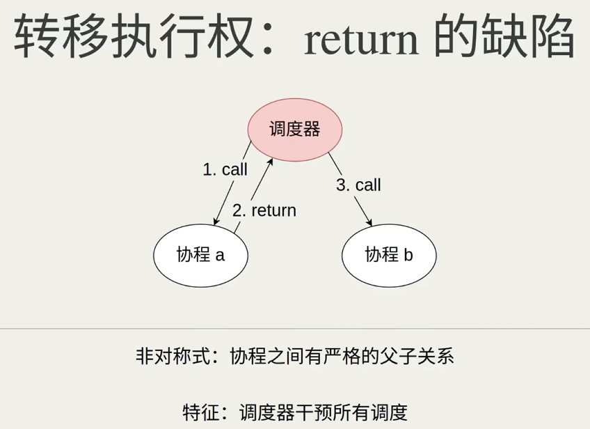
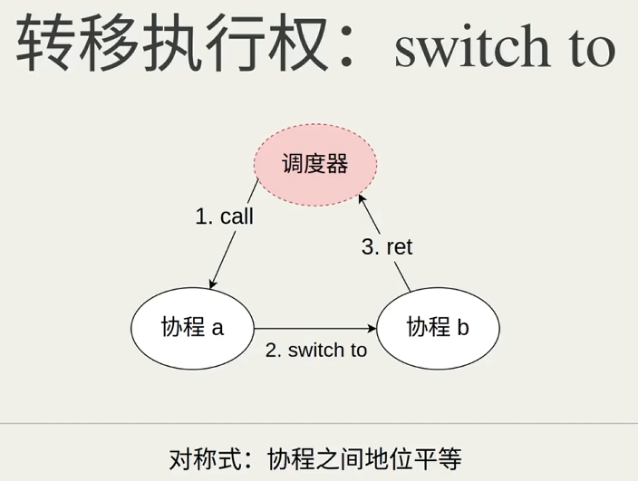
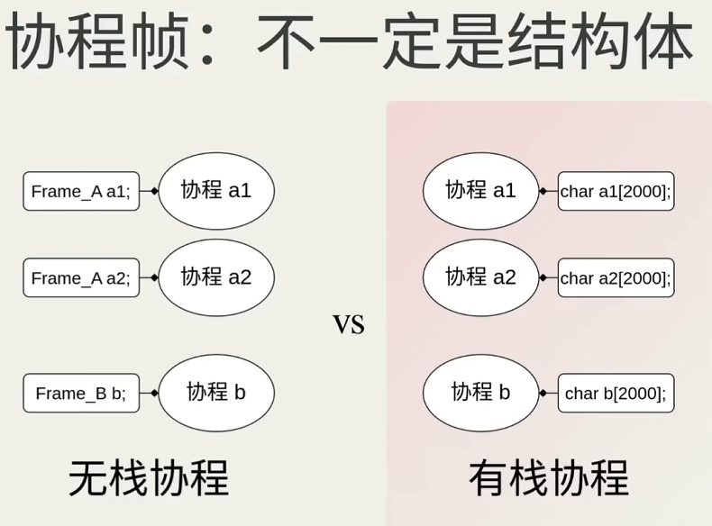

# 区分有栈或无栈协程
## 1.1 看看C++20的协程, 并实现一个斐波那契数列生成器

```C++
#include <coroutine>

struct RepeatAwaiter {
    bool await_ready() const noexcept { 
        return false;
    }

    std::coroutine_handle<> await_suspend(std::coroutine_handle<> coroutine) const noexcept {
        return std::noop_coroutine();
    }

    void await_resume() const noexcept {}
};

template<class T>
struct Promise {
    auto initial_suspend() {
        return std::suspend_always();
    }

    auto final_suspend() noexcept {
        return std::suspend_always();
    }

    void unhandled_exception() {
        throw;
    }

    auto yield_value(T ret) {
        mRetValue = ret;
        return RepeatAwaiter();
    }

    void return_void() {
        mRetValue = 0;
    }

    std::coroutine_handle<Promise> get_return_object() {
        return std::coroutine_handle<Promise>::from_promise(*this);
    }

    T mRetValue;
};

template<class T>
struct Task {
    using promise_type = Promise<T>;

    Task(std::coroutine_handle<promise_type> coroutine)
        : mCoroutine(coroutine) {}

    std::coroutine_handle<promise_type> mCoroutine;
};

template<class T>
Task<T> fib() { // 斐波那契数列生成器协程
    T a = 1, b = 1;
    co_yield a;
    co_yield b;
    while (1) {
        T c = a + b;
        co_yield c;
        a = b;
        b = c;
    }
}

int main() {
    // 实现一个 生成器
    using ll = long long;
    auto task = fib<ll>();
    while (1) {
        task.mCoroutine.resume();
        std::cout << task.mCoroutine.promise().mRetValue << '\n';
        getchar();
    }
    return 0;
}
```

我们如果想要手撕一个上面的实现怎么办?

## 1.2 转换为手撕

如果我们暴力的把`co_yield`替换为`return`显然是不行的.

因为我们每次进入`fib`是又从第一句开始, 而不是从`return`的地方继续:

```C++
#include <cstdio>

using ll = long long; // 为了突出重点, 就不使用模版了qwq

ll fib() {
    ll a = 1, b = 1;
    return a;
    return b;

    while (1) {
        ll c = a + b;
        return c;
        b = a;
        a = c;
    }
}
```

因此我们需要保存一下状态, 比如放到一个结构体里面:

```C++
using ll = long long; // 为了突出重点, 就不使用模版了qwq

struct FibTask {
    int state = 0;
    ll a, b, c;
};


ll fib(FibTask& f) {
    switch (f.state) {
    case 0: // 第一次进入
        f.a = f.b = 1;
        f.state = 1;
        goto st_01;
    case 1: // 第二次进入
        f.state = 2;
        goto st_02;
    case 2: // 第三次进入
        f.state = 3;
        goto st_03;
    case 3: // 第4次及其以后的进入
        goto st_04;
    }

st_01:
    return f.a;
st_02:
    return f.b;
st_03:
    while (1) {
        f.c = f.a + f.b; // 我们不能使用局部变量作为 c, 因为 c 是在恢复的时候还用到的
        return f.c;
    st_04: // 通过上面写的经验也可以知道: 每个return后面都有一个goto的标识, 用于恢复.
        f.b = f.a;
        f.a = f.c;
    }
}

int main() {
    FibTask f;
    while (1) {
        std::cout << fib(f) << '\n';
        getchar();
    }
    return 0;
}
```

至于为什么不使用`static`静态变量/或者全局变量, 你思考一下: fib只能调用一次吗(可重入)? fib是线程安全的吗(虽然上面的也不是很安全)

总而言之, 我们已经手撕一个超简单的协程了 (?)

而为了更加符合某些思想, 我们可以封装一下:

```C++
struct FibTask {
    int state = 0;
    ll a, b, c;

    ll fib() {
        switch (state) {
        case 0: // 第一次进入
            a = b = 1;
            state = 1;
            goto st_01;
        case 1: // 第二次进入
            state = 2;
            goto st_02;
        case 2: // 第三次进入
            state = 3;
            goto st_03;
        case 3: // 第4次及其以后的进入
            goto st_04;
        }

    st_01:
        return a;
    st_02:
        return b;
    st_03:
        while (1) {
            c = a + b; // 我们不能使用局部变量作为 c, 因为 c 是在恢复的时候还用到的
            return c;
        st_04:
            b = a;
            a = c;
        }
    }
};

int main() {
    FibTask f;
    while (1) {
        std::cout << f.fib() << '\n';
        getchar();
    }
    return 0;
}
```

这样它的逻辑就很完善了..

### 1.2.1 什么是有栈/无栈协程

综上所述, 这个实际上就是一个`无栈协程`, 即把形参/局部变量放到一个结构体里面..

与此相对的, 直接预先分配比如 2000 个字节这种, 就是`有栈协程`

### 1.2.2 协程の核心原理

- 暂停/恢复执行权 (return)

- 恢复／保存状态 (协程帧, switch-goto)

这里我们用一个结构体实现了协程帧配合switch-goto来完成了协程的恢复

### 1.2.3 转移所有权

非对称协程: (如: GO语言)

| ##container## |
|:--:|
||

对称协程

| ##container## |
|:--:|
||

这种方法调度器是毫不知情的, 这种更快更灵活; 如果不使用switch to, 那么只是会退化为 非对称协程 .

### 1.2.4 协程帧

| ##container## |
|:--:|
||

我们之前写的代码就是无栈协程,, 它用一个结构体来存放参数, 局部变量和状态等等东西, 不同的协程会对应着不同的结构体, 而有栈协程呢, 它不管你要存什么东西, 通通给你2000个字节, 你想塞什么就塞什么啦, 反正容量管够, 更进一步, 这2000字节会被直接当作栈内存来使用, 你想申请局部变量是吧, 你想递归, 直接在这2000个字节的栈上面做就可以了, 你会发现这时候有栈协程和普通函数几乎没有区别, 只不过普通函数是在线程栈上工作, 有栈协程呢 是在指定的2000个字节上面工作罢了, 我们会看到这两种设计在代码风格上的巨大差别.. 具体可看看: https://www.bilibili.com/video/BV1dv4y127YT/

## 1.3 看看编译器干了啥子

```C++
/*************************************************************************************
 * NOTE: The coroutine transformation you've enabled is a hand coded transformation! *
 *       Most of it is _not_ present in the AST. What you see is an approximation.   *
 *************************************************************************************/
#include <coroutine>
#include <iostream>

struct RepeatAwaiter
{
  inline bool await_ready() const noexcept
  {
    return false;
  }
  
  inline std::coroutine_handle<void> await_suspend(std::coroutine_handle<void> coroutine) const noexcept
  {
    return std::noop_coroutine().operator std::coroutine_handle<void>();
  }
  
  inline void await_resume() const noexcept
  {
  }
  
};


template<class T>
struct Promise
{
  inline auto initial_suspend()
  {
    return std::suspend_always();
  }
  
  inline auto final_suspend() noexcept
  {
    return std::suspend_always();
  }
  
  inline void unhandled_exception()
  {
    throw ;
  }
  
  inline auto yield_value(T ret)
  {
    this->mRetValue = ret;
    return RepeatAwaiter();
  }
  
  inline void return_void()
  {
    this->mRetValue = 0;
  }
  
  inline std::coroutine_handle<Promise<T> > get_return_object()
  {
    return std::coroutine_handle<Promise<T> >::from_promise(*this);
  }
  
  T mRetValue;
};

/* First instantiated from: insights.cpp:75 */
#ifdef INSIGHTS_USE_TEMPLATE
template<>
struct Promise<long long>
{
  inline std::suspend_always initial_suspend()
  {
    return std::suspend_always();
  }
  
  inline std::suspend_always final_suspend() noexcept
  {
    return std::suspend_always();
  }
  
  inline void unhandled_exception()
  {
    throw ;
  }
  
  inline RepeatAwaiter yield_value(long long ret)
  {
    this->mRetValue = ret;
    return RepeatAwaiter();
  }
  
  inline void return_void()
  {
    this->mRetValue = 0;
  }
  
  inline std::coroutine_handle<Promise<long long> > get_return_object()
  {
    return std::coroutine_handle<Promise<long long> >::from_promise(*this);
  }
  
  long long mRetValue;
  // inline constexpr Promise() noexcept = default;
};

#endif

template<class T>
struct Task
{
  using promise_type = Promise<T>;
  inline Task(std::coroutine_handle<promise_type> coroutine)
  : mCoroutine(coroutine)
  {
  }
  
  std::coroutine_handle<promise_type> mCoroutine;
};

/* First instantiated from: insights.cpp:72 */
#ifdef INSIGHTS_USE_TEMPLATE
template<>
struct Task<long long>
{
  using promise_type = Promise<long long>;
  inline Task(std::coroutine_handle<Promise<long long> > coroutine)
  : mCoroutine{std::coroutine_handle<Promise<long long> >(coroutine)}
  {
  }
  
  std::coroutine_handle<Promise<long long> > mCoroutine;
};

#endif

template<class T>
Task<T> fib()
{
  T a = 1;
  T b = 1;
  co_yield a;
  co_yield b;
  while(1) {
    T c = a + b;
    co_yield c;
    a = b;
    b = c;
  }
  
}

struct __fib_longlongFrame
{
  void (*resume_fn)(__fib_longlongFrame *);
  void (*destroy_fn)(__fib_longlongFrame *);
  Promise<long long> __promise;
  int __suspend_index;
  bool __initial_await_suspend_called;
  long long a;
  long long b;
  long long c;
  std::suspend_always __suspend_57_9;
  RepeatAwaiter __suspend_59_5;
  RepeatAwaiter __suspend_60_5;
  RepeatAwaiter __suspend_63_9;
  std::suspend_always __suspend_57_9_1;
};

/* First instantiated from: insights.cpp:72 */
#ifdef INSIGHTS_USE_TEMPLATE
template<>
Task<long long> fib<long long>()
{
  /* Allocate the frame including the promise */
  /* Note: The actual parameter new is __builtin_coro_size */
  __fib_longlongFrame * __f = reinterpret_cast<__fib_longlongFrame *>(operator new(sizeof(__fib_longlongFrame)));
  __f->__suspend_index = 0;
  __f->__initial_await_suspend_called = false;
  
  /* Construct the promise. */
  new (&__f->__promise)Promise<long long>{};
  
  /* Forward declare the resume and destroy function. */
  void __fib_longlongResume(__fib_longlongFrame * __f);
  void __fib_longlongDestroy(__fib_longlongFrame * __f);
  
  /* Assign the resume and destroy function pointers. */
  __f->resume_fn = &__fib_longlongResume;
  __f->destroy_fn = &__fib_longlongDestroy;
  
  /* Call the made up function with the coroutine body for initial suspend.
     This function will be called subsequently by coroutine_handle<>::resume()
     which calls __builtin_coro_resume(__handle_) */
  __fib_longlongResume(__f);
  
  
  return Task<long long>(std::coroutine_handle<Promise<long long> >(static_cast<std::coroutine_handle<Promise<long long> > &&>(__coro_gro)));
}

/* This function invoked by coroutine_handle<>::resume() */
void __fib_longlongResume(__fib_longlongFrame * __f)
{
  try 
  {
    /* Create a switch to get to the correct resume point */
    switch(__f->__suspend_index) {
      case 0: break;
      case 1: goto __resume_fib_longlong_1;
      case 2: goto __resume_fib_longlong_2;
      case 3: goto __resume_fib_longlong_3;
      case 4: goto __resume_fib_longlong_4;
    }
    
    /* co_await insights.cpp:57 */
    __f->__suspend_57_9 = __f->__promise.initial_suspend();
    if(!__f->__suspend_57_9.await_ready()) {
      __f->__suspend_57_9.await_suspend(std::coroutine_handle<Promise<long long> >::from_address(static_cast<void *>(__f)).operator std::coroutine_handle<void>());
      __f->__suspend_index = 1;
      __f->__initial_await_suspend_called = true;
      return;
    } 
    
    __resume_fib_longlong_1:
    __f->__suspend_57_9.await_resume();
    __f->a = 1;
    __f->b = 1;
    
    /* co_yield insights.cpp:59 */
    __f->__suspend_59_5 = __f->__promise.yield_value(__f->a);
    if(!__f->__suspend_59_5.await_ready()) {
      __builtin_coro_resume(__f->__suspend_59_5.await_suspend(std::coroutine_handle<Promise<long long> >::from_address(static_cast<void *>(__f)).operator std::coroutine_handle<void>()).address());
      __f->__suspend_index = 2;
      return;
    } 
    
    __resume_fib_longlong_2:
    __f->__suspend_59_5.await_resume();
    
    /* co_yield insights.cpp:60 */
    __f->__suspend_60_5 = __f->__promise.yield_value(__f->b);
    if(!__f->__suspend_60_5.await_ready()) {
      __builtin_coro_resume(__f->__suspend_60_5.await_suspend(std::coroutine_handle<Promise<long long> >::from_address(static_cast<void *>(__f)).operator std::coroutine_handle<void>()).address());
      __f->__suspend_index = 3;
      return;
    } 
    
    __resume_fib_longlong_3:
    __f->__suspend_60_5.await_resume();
    while(1) {
      __f->c = (__f->a + __f->b);
      
      /* co_yield insights.cpp:63 */
      __f->__suspend_63_9 = __f->__promise.yield_value(__f->c);
      if(!__f->__suspend_63_9.await_ready()) {
        __builtin_coro_resume(__f->__suspend_63_9.await_suspend(std::coroutine_handle<Promise<long long> >::from_address(static_cast<void *>(__f)).operator std::coroutine_handle<void>()).address());
        __f->__suspend_index = 4;
        return;
      } 
      
      __resume_fib_longlong_4:
      __f->__suspend_63_9.await_resume();
      __f->a = __f->b;
      __f->b = __f->c;
    }
    
    goto __final_suspend;
  } catch(...) {
    if(!__f->__initial_await_suspend_called) {
      throw ;
    } 
    
    __f->__promise.unhandled_exception();
  }
  
  __final_suspend:
  
  /* co_await insights.cpp:57 */
  __f->__suspend_57_9_1 = __f->__promise.final_suspend();
  if(!__f->__suspend_57_9_1.await_ready()) {
    __f->__suspend_57_9_1.await_suspend(std::coroutine_handle<Promise<long long> >::from_address(static_cast<void *>(__f)).operator std::coroutine_handle<void>());
    return;
  } 
  
  __f->destroy_fn(__f);
}

/* This function invoked by coroutine_handle<>::destroy() */
void __fib_longlongDestroy(__fib_longlongFrame * __f)
{
  /* destroy all variables with dtors */
  __f->~__fib_longlongFrame();
  /* Deallocating the coroutine frame */
  /* Note: The actual argument to delete is __builtin_coro_frame with the promise as parameter */
  operator delete(static_cast<void *>(__f));
}

#endif


int main()
{
  using ll = long long;
  Task<long long> task = fib<ll>();
  while(1) {
    task.mCoroutine.resume();
    std::operator<<(std::cout.operator<<(task.mCoroutine.promise().mRetValue), '\n');
    getchar();
  }
  
  return 0;
}
```

来自于: 1.1 的代码 to: cppinsights.io

可以看到, 协程的异常处理实际上就是往整个执行区域套了一个`try-catch`, 并且使用`unhandled_exception`把异常给存储起来