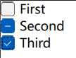
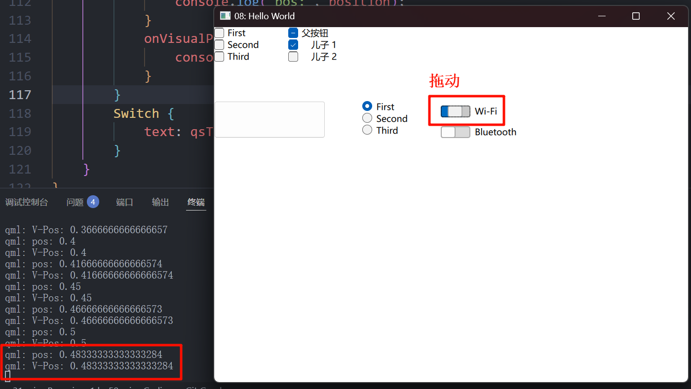

# 更多的按钮

实际上, qml除了 [Button](../006-Button/index.md) 还有很多其他的按钮, 和 widget 一样. 今天就来学习一下~

## 1. 多选框 (CheckBox)
### 1.1 简单示例

CheckBox 也同 Button 一样, 继承自 `AbstractButton`.

```qml
import QtQuick
import QtQuick.Controls

Window {
    width: 640
    height: 480
    visible: true
    title: qsTr("08: Hello World")

    Column { // Column 是一个垂直布局, 我们之后再细说
        CheckBox {
            checked: true
            text: qsTr("First")
        }
        CheckBox {
            text: qsTr("Second")
        }
        CheckBox {
            checked: true
            text: qsTr("Third")
        }
    }
}
```

### 1.2 三态模式 (tristate)



```qml
Column {
    CheckBox {
        text: qsTr("First")
    }
    CheckBox {
        tristate: true; // 开启三态
        text: qsTr("Second")
    }
    CheckBox {
        text: qsTr("Third")
    }
}
```

### 1.3 自动排他 (ButtonGroup)

- `autoExclusive: true` 无法使得 `CheckBox` 为自动排他.

这时候我们就只能用到 `ButtonGroup` 这个容器来控制, 其有两种方法

> [!TIP]
> 往后项目中, 我们也大多都是使用 `ButtonGroup` 来控制 `排他`, 所以请好好学习~, 这种方案的自由度更高. 而且也不难.

#### 1.3.1 方法一: 设置 ButtonGroup.buttons

咱们指定一个 `列表[]` (也就是 `column.children`), 表示在他们之间排他.

```qml
ButtonGroup {
    id: bg
    exclusive: true // 是否排他 (默认为 true)
    buttons: column.children
}

Column {
    id: column
    CheckBox {
        text: qsTr("First")
    }
    CheckBox {
        text: qsTr("Second")
    }
    CheckBox {
        text: qsTr("Third")
    }
}
```

#### 1.3.2 方法二: 设置 `ButtonGroup.group: id`

```qml
ButtonGroup {
    id: bg
}

Column {
    id: column
    CheckBox {
        text: qsTr("First")
        ButtonGroup.group: bg
    }
    CheckBox {
        text: qsTr("Second")
        ButtonGroup.group: bg
    }
    CheckBox {
        text: qsTr("Third")
        ButtonGroup.group: bg
    }
}
```

### 1.4 树形多选 (checkState 与 ButtonGroup)

```qml
Column {
    ButtonGroup {
        id: childGroup
        exclusive: false                    // 不排他
        checkState: parentBox.checkState    // 指定复选的状态作用是 `parentBox.checkState`
                                            // 如果只开这个, 那么两个按钮全选后, parentBox 不会打钩
                                            // 但是打钩 `父按钮`, 会影响子按钮
    }

    CheckBox {
        id: parentBox
        text: qsTr("父按钮")
        tristate: true
        checkState: childGroup.checkState // 指定状态是根据 ButtonGroup 的
                                          // 如果只开这个, 那么打钩`父按钮`, 不会影响子按钮
                                          // 但是子按钮, 会影响父按钮
    }

    CheckBox {
        checked: true
        text: qsTr("儿子 1")
        leftPadding: indicator.width
        ButtonGroup.group: childGroup // 指定 ButtonGroup
    }

    CheckBox {
        text: qsTr("儿子 2")
        leftPadding: indicator.width
        ButtonGroup.group: childGroup // 指定 ButtonGroup
    }
}
```

### 1.5 自定义切换状态机 (nextCheckState)

对于默认的三态, 其是 `未选中`->`部分选中`->`完全选中`->`未选中`

通过重写 `nextCheckState`, 我们可以将他们自定义为 `未选中`->`完全选中`->`部分选中`->`未选中`:

```qml
CheckBox {
    id: parentBox
    text: qsTr("父按钮")
    tristate: true
    checkState: childGroup.checkState
    nextCheckState: () => {
        switch (parentBox.checkState) {
        case Qt.Unchecked:          // 未选中
            return Qt.Checked;
        case Qt.PartiallyChecked:   // 部分选中
            return Qt.Unchecked;
        case Qt.Checked:            // 完全选中
            return Qt.PartiallyChecked;
        }
        return Qt.Unchecked; // [[unlikely]]
    }
}
```

## 2. 延时按钮 (DelayButton)

长按这个按钮 `delay` 时间, 才会触发 `onActivated`.

```qml
DelayButton {
    width: 150
    height: 50

    delay: 3000 // 延迟的时间 (ms)

    // 进度条
    onProgressChanged: {
        console.log("ProgressChanged", progress); // 进度 0.0 ~ 1.0
    }

    // 达到 1.0 时候会触发这个
    onActivated: {
        console.log("点击完成!");
    }
}
```

```bilibili ##BV1RG411q7sx##
延时按钮示例
```

## 3. 单选按钮 (RadioButton)

这种情况下, 按钮是自动排他的. (只要放在同一个父控件中)

```qml
Column {
    RadioButton {
        checked: true
        text: qsTr("First")
    }
    RadioButton {
        text: qsTr("Second")
    }
    RadioButton {
        text: qsTr("Third")
    }
}
```

## 4. 开关 (Switch)
### 4.1 简单示例 & 排他说明

> 它和 `CheckBox` 一样, `autoExclusive: true` 也无法使得 `Switch` 为自动排他.
>
> 因此我们还是需要 `ButtonGroup` 来实现自动排他.

```qml
Column {
    Switch {
        text: qsTr("Wi-Fi")
    }
    Switch {
        text: qsTr("Bluetooth")
    }
}
```

### 4.2 拖动开关事件



我们可以像上图一样拖动开关, 它会触发两个事件:

```qml
Column {
    Switch {
        text: qsTr("Wi-Fi")
        onPositionChanged: {
            console.log("pos:", position);
        }
        onVisualPositionChanged: {
            console.log("V-Pos:", visualPosition);
        }
    }
    Switch {
        text: qsTr("Bluetooth")
    }
}
```

但我们发现, 他们的值是一样的, 那实际上他们有什么区别呢?

#### 4.2.1 镜像属性


```qml
Switch {
    text: qsTr("Wi-Fi")
    LayoutMirroring.enabled: true // 镜像
    onPositionChanged: {
        console.log("pos:", position);
    }
    onVisualPositionChanged: {
        console.log("V-Pos:", visualPosition);
    }
}
```

## 5. TabButton

```qml
TabBar {
    id: bar
    width: 200
    TabButton {
        text: qsTr("Home")
    }
    TabButton {
        text: qsTr("Discover")
    }
    TabButton {
        text: qsTr("Activity")
    }
}
```

就是专门用来切换界面的那种按钮.

## 6. 圆角按钮 (RoundButton)

```qml
RoundButton {
    text: "圆角按钮"
    radius: 45 // 就是多了这个属性, 从 `background` 中提出来的
}
```

## 7. ToolBar

[ToolBar](https://doc.qt.io/qt-6/zh/qml-qtquick-controls-toolbar.html)

这个也比较少用, 的说.

## 8. 自定义按钮 (重绘)
### 8.1 background

之前讲过, 不重复. 但是它并不支持对 `text` 进行重绘.

### 8.2 contentItem

```qml
Button {
    id: btn
    width: 100; height: 50;
    text: "文本"
    contentItem: Rectangle {
        color: "transparent"
        Text {
            id: txt
            text: btn.text
            anchors.verticalCenter: parent.verticalCenter
            font.family: "黑体"
        }
        Image {
            id: img
            anchors.left: txt.right
            anchors.leftMargin: 10
            anchors.verticalCenter: parent.verticalCenter
            source: "qrc:/img/misaka.png"
            width: 50; height: 50;
        }
    }
}
```

### 8.3 适用场景

| 项目 | 用途 | 适用场景 |
| :-: | - | - |
| **`background`**  | 主要用来设置按钮的背景, 例如底色、边框、阴影等 | 适用于需要背景样式自定义的场景, 如按钮的颜色、阴影、渐变等 |
| **`contentItem`** | 用来放置按钮的内容(文本、图标等), 负责排版与显示 | 适用于定制按钮内部的文本、图标、布局等内容 |