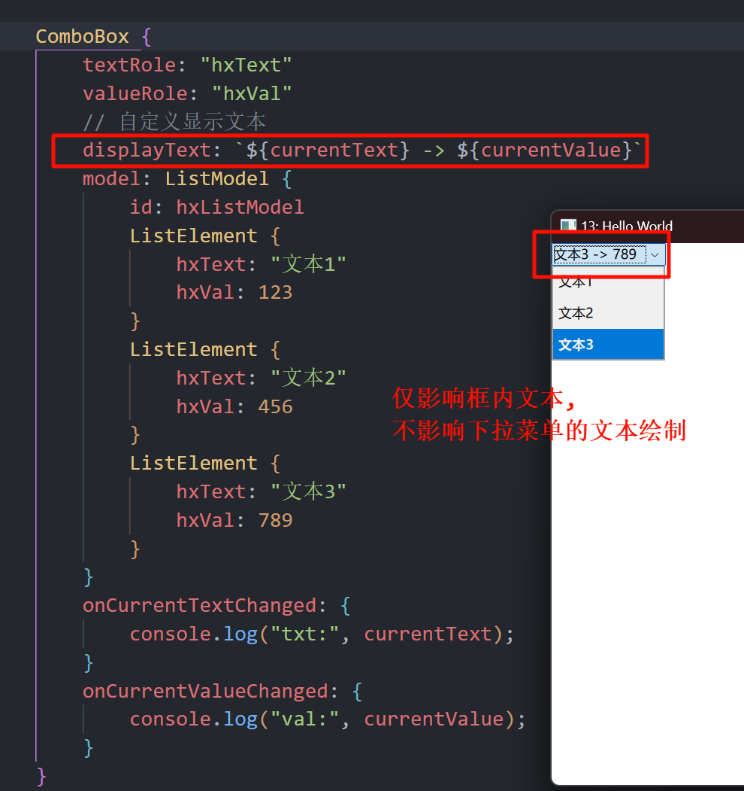

# ComboBox 下拉框

## 1. 基础
### 1.1 基础代码

```qml
import QtQuick
import QtQuick.Controls

Window {
    width: 640
    height: 480
    visible: true
    title: qsTr("13: Hello World")

    ComboBox {
        model: ["选项1", "选项2", "选项3"]
        Component.onCompleted: {
            console.log("cnt:", count); // 项的个数
        }
    }
}
```

### 1.2 支持用户输入

```qml
ComboBox {
    editable: true // 支持用户输入
    model: ListModel {
        id: model
        ListElement {
            text: "选项1"
        }
        ListElement {
            text: "选项2"
        }
        ListElement {
            text: "选项3"
        }
    }
    Component.onCompleted: {
        console.log("cnt:", count);
    }
    onAccepted: { // 选中后, 如果不存在, 那么添加进List
        if (find(editText) === -1) {
            model.append({text: editText});
        }
    }
}
```

### 1.3 自定义绘制文本



```qml
ComboBox {
    textRole: "hxText" // 作为文本的变量名称 (ListElement 中)
    valueRole: "hxVal" // 作为值的变量名称
    // 自定义显示文本
    displayText: `${currentText} -> ${currentValue}`
    model: ListModel {
        id: hxListModel
        ListElement {
            hxText: "文本1"
            hxVal: 123
        }
        ListElement {
            hxText: "文本2"
            hxVal: 456
        }
        ListElement {
            hxText: "文本3"
            hxVal: 789
        }
    }
    onCurrentTextChanged: { // 当前选择的项对应的文本
        console.log("txt:", currentText);
    }
    onCurrentValueChanged: { // 当前选择的项对应的值
        console.log("val:", currentValue);
    }
}
```

### 1.4 正则表达式限制输入内容

```qml
ComboBox {
    editable: true
    // validator: IntValidator { // 匹配数字, 不怎么好用
    //     top: 100
    //     bottom: 0
    // }
    validator: RegularExpressionValidator { // 仅可输入正则表达式: (16进制数)
        regularExpression: /0x[0-9A-F]+/
    }
    onAcceptableInputChanged: { // 匹配状态改变时候触发
        console.log("匹配状态:", acceptableInput);
    }
}
```

## 2. 自定义绘制

```qml
pragma ComponentBehavior: Bound

ComboBox {
    y: 200
    id: control
    model: ["选项1", "选项2", "选项3"]

    // 自定义绘制 框项
    contentItem: Text {
        leftPadding: 0
        rightPadding: control.indicator.width + control.spacing

        text: control.displayText
        font: control.font
        color: control.pressed ? "red" : "blue" // 是否鼠标按下它, 而改变颜色
        verticalAlignment: Text.AlignVCenter
        elide: Text.ElideRight
    }

    // 自定义下拉箭头指示器 (你也可以放图片)
    // indicator: Canvas {
    //     id: arrow
    //     width: 20
    //     height: 20
    //     contextType: "2d"
    //     onPaint: {
    //         var ctx = getContext("2d")
    //         ctx.clearRect(0, 0, width, height)
    //         ctx.fillStyle = "black"
    //         ctx.beginPath()
    //         ctx.moveTo(5, 7)
    //         ctx.lineTo(15, 7)
    //         ctx.lineTo(10, 13)
    //         ctx.closePath()
    //         ctx.fill()
    //     }
    // }

    // 自定义每一项是如何绘制的
    delegate: ItemDelegate {
        id: itDg
        required property int index;
        required property string modelData;

        width: control.width
        contentItem: Text {
            text: `${itDg.index} - ${itDg.modelData}`
            color: itDg.index % 2 ? "#990099" : "#f49ff4"
            font: control.font
            elide: Text.ElideRight
            verticalAlignment: Text.AlignVCenter
        }
        highlighted: control.highlightedIndex === index
    }

    // 自定义下拉菜单框
    popup: Popup {
        y: control.height - 1 // 距离 `contentItem` 的距离 (可以调整, 使其在上面)
        width: control.width
        implicitHeight: contentItem.implicitHeight
        contentItem: ListView {
            clip: true                                                  // 超出子项, 会被裁剪
            implicitHeight: contentHeight                               // 默认高度为其内容的总高度
            model: control.popup.visible ? control.delegateModel : null // 节约性能吧, 关闭后释放内容资源
            currentIndex: control.highlightedIndex
            highlight: Rectangle {
                color: "#aaddff"
                radius: 4
            }

            // 使用默认的拖动条
            ScrollBar.vertical: ScrollBar {

            }
        }

        background: Rectangle {
            color: "#ffffff"
            border.width: 1
            border.color: "red"
            radius: 4
        }
    }

    // 自定义边框、背景 (项的)
    background: Rectangle {
        radius: 4
        border.color: "#99cc99"
        border.width: 1
    }
}
```

## 3. ScrollBar 简单介绍

我们可以直接通过`policy`属性, 让它始终显示拖动条.

```qml
ScrollBar.vertical: ScrollBar {
    policy: ScrollBar.AlwaysOn // 上面代码加上这个
}
```

## 4. ListView 的回弹属性

因为 `ListView` 是继承 `Flickable` 的, 而 `Flickable` 提供的是一个可以 "轻弹" 的表面.

因此有如下属性:

```qml
contentItem: ListView {
    boundsBehavior: Flickable.StopAtBounds  // 可以拖动, 但没有边界回弹
    interactive: false                      // 禁止鼠标拖动这种项
}
```

## 5. 阴影 (DropShadow)

```qml
import Qt5Compat.GraphicalEffects // 需要导入这个 (QT6)

// 自定义下拉菜单框
popup: Popup {
    background: Rectangle {
        color: "#ffffff"
        border.width: 1
        border.color: "red"
        radius: 4
        // 开启图层, 并添加阴影效果
        layer.enabled: true
        layer.effect: DropShadow {
            horizontalOffset: 3 // 横向偏移
            verticalOffset: 3   // 纵向偏移
            radius: 8.0         // 阴影模糊半径 (越大越柔和)
            samples: 17         // 采样点数量 (越高越平滑，但越耗性能)
            color: "#9e990099"  // 阴影颜色
        }
    }
}
```