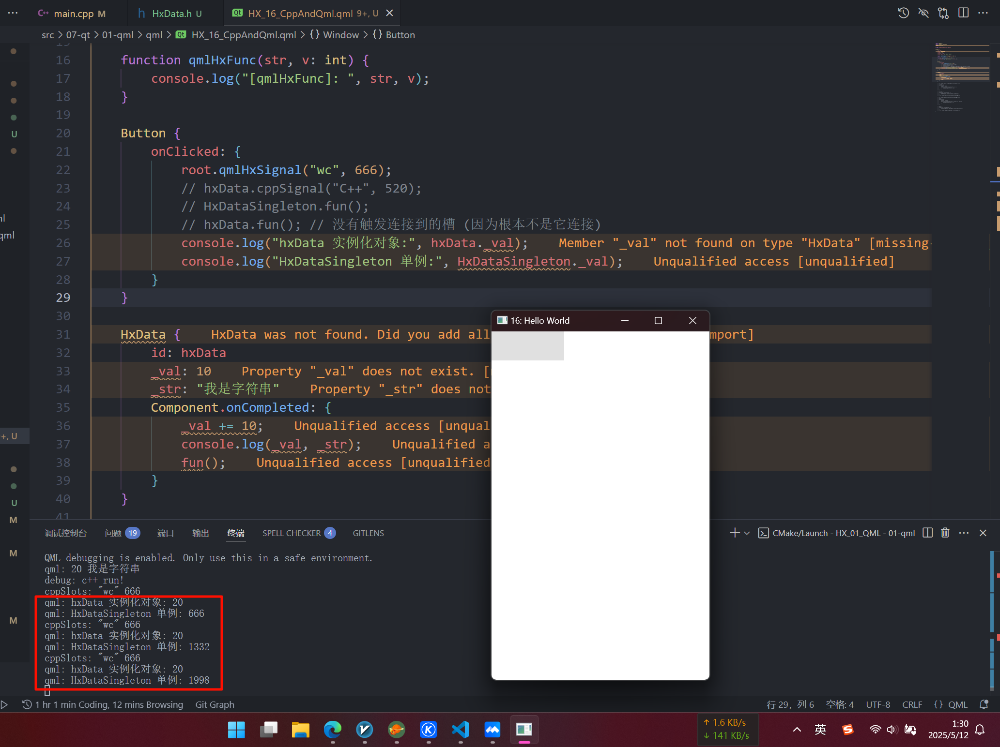

# QML与C++交互
## 1. C++中设置全局qml上下文对象

```cpp
#include <QGuiApplication>
#include <QQmlApplicationEngine>
#include <QQuickStyle>
#include <QQmlContext> // 需要的头文件

int main(int argc, char *argv[]) {
    QGuiApplication app(argc, argv);
    // 强制使用 Basic 样式
    QQuickStyle::setStyle("Basic");
    QQmlApplicationEngine engine;

    // === 设置自定义的全局的qml的上下文对象 === {
    QQmlContext* cp = engine.rootContext();
    cp->setContextProperty("hx_width", 300);
    // } === 设置自定义的全局的qml的上下文对象 ===

    QObject::connect(
        &engine,
        &QQmlApplicationEngine::objectCreationFailed,
        &app,
        []() { QCoreApplication::exit(-1); },
        Qt::QueuedConnection
    );
    // 应该使用 _ 和 [0-9a-Z], 不能使用`-`
    engine.loadFromModule("HX_01_QML", "HX_16_CppAndQml");

    return app.exec();
}
```

然后就可以直接在qml中使用了:

```qml
import QtQuick

Window {
    width: hx_width // 直接使用
    height: 480
    visible: true
    title: qsTr("16: Hello World")
}
```

## 2. 私有化控件成员

对于一般的自定义组件, 可能 `_topMargin` 和 `_bottomMargin` 我们不希望被外界访问:

```qml
import QtQuick

Rectangle {
    id: borderRect
    property int _topMargin: 10
    property int _bottomMargin: 10

    color: "#000000"
    Rectangle {
        id: innerRect
        color: "#990099"
        anchors.fill: parent
        anchors.topMargin: borderRect._topMargin
        anchors.bottomMargin: borderRect._bottomMargin
        anchors.leftMargin: 0
        anchors.rightMargin: 0
    }
}
```

那就可以使用 `QtObject` 来包装:

```qml
import QtQuick

Rectangle {
    id: borderRect
    QtObject {
        id: obj
        property int _topMargin: 10
        property int _bottomMargin: 10
    }

    color: "#000000"
    Rectangle {
        id: innerRect
        color: "#990099"
        anchors.fill: parent
        anchors.topMargin: obj._topMargin
        anchors.bottomMargin: obj._bottomMargin
        anchors.leftMargin: 0
        anchors.rightMargin: 0
    }
}
```

这样内部还可以通过`id`访问, 而外部就是不可见了.

并且 `QtObject` 是很轻量的, 它并不涉及界面, 只承担逻辑职责, 你可以把它当做是命名空间...

> 那我们如何实现 `QtObject` 是从 `C++` 中提供的, 而不是 QML 提供的呢?

## 3. 自定义C++类到QML中 (以包的方式)
### 3.1 以实例化对象方式调用c++自定义对象
考虑以下代码:

```cpp
#pragma once
#ifndef _HX_HX_DATA_H_
#define _HX_HX_DATA_H_

#include <QObject>
#include <QDebug>

class HxData : public QObject {
    Q_OBJECT
public:
    explicit HxData(QObject* parnt = nullptr)
        : QObject(parnt)
    {}

    void fun() {
        qDebug() << "debug: c++ run!";
    }

    // 单例演示
    static HxData* get() {
        static HxData res;
        return &res;
    }

    int getVal() const { return _val; }
    QString getStr() const { return _str; }

    void setVal(int val) { _val = val; }
    void setStr(QString const& str) { _str = str; }

Q_SIGNALS:
    void valChanged();

private:
    QString _str;
    int _val;

    Q_PROPERTY(
        int _val 
        READ getVal 
        WRITE setVal 
        NOTIFY valChanged
    );
};

#endif // !_HX_HX_DATA_H_
```

然后:

```cpp
// 设置自定义的全局的qml的上下文对象
QQmlContext* cp = engine.rootContext();
cp->setContextProperty("HxData", HxData::get());
```

你会发现, 在C++这里是没问题的, 可是 QML 运行时会报错: `qrc:/HX_01_QML/qml/HX_16_CppAndQml.qml:13:5: HxData 不是一种类型`

这要怎么办呢?

就要:

```cpp
#include <qml/HxData.h>

int main() {
    // ...
    qmlRegisterType<HxData>(
        "HXDataObj",    // 导入时候的名称 (import Xxx) (注意得是大写开头)
        1, 0,           // 主版本号 与 次版本号
        "HxData"        // qml中使用的组件名称 (注意得是大写开头)
    );
    // ... 在 loadFromModule 之前
}
```

然后就可以使用了:

```qml
import QtQuick
import QtQuick.Controls
import HXDataObj 1.0

pragma ComponentBehavior: Bound

Window {
    id: root
    width: hx_width
    height: 480
    visible: true
    title: qsTr("16: Hello World")

    HxData {
        _val: 10
        _str: "我是字符串"
        Component.onCompleted: {
            _val += 10;
            console.log(_val, _str);
            fun();
        }
    }
}
```

(但是这个破vscode, 全是警告)

> [!TIP]
> 使用这个有什么好处呢?
>
> 默认的 `setContextProperty` 是注册在全局的, 这会污染; 而且qml如果有同名变量, 就会被覆盖.

实际上这里仅是以实例化对象的方式使用: (即必需是写了这个 HxData 组件, 才可以以 `id.属性` 的方式调用; 而且如果没有实例化, 那么就根本没有id)

```qml
HxData {
    id: hxData
    _val: 10
    _str: "我是字符串"
}

Component.onCompleted: {
    hxData.fun();
}
```

### 3.2 qml使用c++的函数

> 自定义函数:

```cpp
class HxData : public QObject {
    Q_OBJECT
public:
    // 使用 Q_INVOKABLE 宏修饰的方法才可以在 QML 中被调用
    Q_INVOKABLE void fun() {
        qDebug() << "debug: c++ run!";
    }
};
```

### 3.3 从qml中将c++槽绑定到qml自定义信号

```cpp
// 类中编写一个槽
public Q_SLOTS:
    void cppSlots(QString const& str, int x) {
        qDebug() << "cppSlots:" << str << x;
    }
```

```qml
import QtQuick
import QtQuick.Controls
import HXDataObj 1.0

Window {
    id: root
    width: hx_width
    height: 480
    visible: true
    title: qsTr("16: Hello World")

    signal qmlHxSignal(string str, int v); // [1] qml中, 定义信号

    Button {
        onClicked: {
            root.qmlHxSignal("wc", 666); // [2] qml中, 触发信号
        }
    }

    HxData { // [3] 实例化 C++自定义对象
        id: hxData
    }

    // [4] 将信号绑定到槽
    // 方法一:
    Connections {
        target: root
        function onQmlHxSignal(str, x) {
            hxData.cppSlots(str, x);
        }
    }

    // 方法二:
    Component.onCompleted: {
        qmlHxSignal.connect(hxData.cppSlots);
    }
}
```

### 3.4 从C++中将c++槽绑定到qml自定义信号

> 个人是不推荐使用这个, 因为它不太好做动态绑定, 而且还只能写 `SIGNAL`、`SLOT` 的这种写法, 感觉有点旧

```cpp
engine.loadFromModule("HX_01_QML", "HX_16_CppAndQml");

{
    // engine load 加载后, 从C++中将槽绑定到qml自定义信号
    auto list = engine.rootObjects();
    auto window = list.first();
    QObject::connect(window, SIGNAL(qmlHxSignal(QString, int)), 
                     HxData::get(), SLOT(cppSlots(QString, int)));
}
```

### 3.5 从qml中将qml槽绑定到c++自定义信号

```cpp
// 类中编写一个信号
Q_SIGNALS:
    void cppSignal(QString str, int x);
```

```qml
import QtQuick
import QtQuick.Controls
import HXDataObj 1.0

pragma ComponentBehavior: Bound

Window {
    id: root
    width: hx_width
    height: 480
    visible: true
    title: qsTr("16: Hello World")

    signal qmlHxSignal(string str, int v);

    // qml 的槽函数
    function qmlHxFunc(str: string, v: int) {
        console.log("[qmlHxFunc]: ", str, v);
    }

    Button {
        onClicked: {
            // root.qmlHxSignal("wc", 666);
            hxData.cppSignal("C++", 520);   // 此处改为发送 cpp 的信号, 而不是 qml 的信号 (信号总得用人发吧~)
        }
    }

    HxData {
        id: hxData
    }

    // 方法一:
    Connections {
        // 监听的是 C++ hxData 对象了哦!
        target: hxData
        // 绑定 C++ 的信号
        function onCppSignal(str: string, x: int) {
            root.qmlHxFunc(str, x);
        }
    }

    // 方法二:
    Component.onCompleted: {
        hxData.cppSignal.connect(qmlHxFunc);
    }
}
```

> [!TIP]
> 特别的, 如果你认为 `Button` 直接发送C++的信号, 这不好. 实际上也是正常的, 因为这里只是演示嘛~
>
> 更加实际的应该是, qml 调用了 C++ 的一个函数 或者 C++本身的某些事件触发, 从而从 C++ 端运行时候, 才发送的 C++ 的信号:
>
> ```cpp
> // 使用 Q_INVOKABLE 宏修饰的方法才可以在 QML 中被调用
> Q_INVOKABLE void fun() {
>     emit cppSignal("C++ 真人出场!", 233); // 比如是这里, 一个C++函数内部触发的信号
>                                          // 现实使用中, 可能是发送到一个信号总线上, 
>                                          // 然后传给其他qml中, 而不是自己类内!
>     qDebug() << "debug: c++ run!";
> }
> ```
>
> 然后将其按钮事件改为:
>
> ```qml
> Button {
>     onClicked: {
>         // root.qmlHxSignal("wc", 666);
>         // hxData.cppSignal("C++", 520);
>         hxData.fun(); // 仅仅是调用一个 C++ 函数, 使用者可能都不知道里面触发了 C++ 信号 (
>     }
> }
> ```

> 在说明 `从C++中将qml槽绑定到c++自定义信号` 之前, 我们还需要讲解一种方法:

### 3.6 以单例的方式调用c++自定义对象

```cpp
// 注册一个C++单例到 qml 中 (直接通过 组件名称.属性 即可使用)
qmlRegisterSingletonInstance(
    "HXDataObj",        // 导入时候的名称 (import Xxx) (注意得是大写开头)
    1, 0,               // 主版本号 与 次版本号
    "HxDataSingleton",  // qml中使用的组件名称 (注意得是大写开头)
    HxData::get()       // 单例对象指针
);
```

此时就可以直接在qml中使用了 (注意, 这里的 `组件名称` **不能** 和之前的有重复! 否则应该是 $UB$ )

```qml
// 注: 此处直接把 3.5 从qml中将qml槽绑定到c++自定义信号 的代码修改了!
// 特别的, 如果你还保留之前的 HxData 实例化对象 -> [!]

Button {
    onClicked: {
        HxDataSingleton.fun();
        // hxData.fun(); // [!] 这里发送的信号是不会传递到 `qmlHxFunc` 中的
                         // 因为他们是不同的对象 (一个是单例对象, 一个是实例化的普通对象)
                         // 就像是我让 单例.val = 1
                         // 难道我普通的 对象.val 会跟着变吗?
                         // 一样的道理~
    }
}

Component.onCompleted: {
    HxDataSingleton.cppSignal.connect(qmlHxFunc);
}
```

### 3.7 从C++中将qml槽绑定到c++自定义信号

> [!TIP]
> 小改动, 我暂时把信号槽改为下面这种: (原因后面会说)

```cpp
// 信号修改签名为:
Q_SIGNALS:
    void cppSignal(QVariant str, int x);
```

```qml
// 槽修改签名为:
function qmlHxFunc(str, v: int) {
    console.log("[qmlHxFunc]: ", str, v);
}
```

然后我们C++绑定的时候, 需要这样写: (否则报错: 不知道对应的槽)

```cpp
auto list = engine.rootObjects();
auto window = list.first();
QObject::connect(HxData::get(), SIGNAL(cppSignal(QVariant, int)), 
                 window, SLOT(qmlHxFunc(QVariant, int)));
```

> [!NOTE]
> 想必你也已经发觉了, 实际上就是因为破烂 js, 它是动态类型的, 特别是懒虫不规定类型的时候, 比如 `function qmlHxFunc(str, v: int)` 的 `str`, 高贵的强类型安全的C++就只能使用 `QVariant` 来兼容了...
>
> 所以什么时候出 `qtml` ? t 是 `ts` 的 t.

以及, 你应该发现, 它此时监听的对象是 `HxData::get()` 单例对象的信号 (*并且此处只能使用单例的组件, 而不是实例化的组件id*), 故:

```qml
Button {
    onClicked: {
        HxDataSingleton.fun();
        // hxData.fun(); // 没有触发连接到的槽 (因为根本不是它连接)
    }
}
```

> [!TIP]
> 疑问: 为什么之前的 [3.4 从C++中将c++槽绑定到qml自定义信号](#34-从c中将c槽绑定到qml自定义信号) 却绑定是单例的槽, 却是可行的呢?

我猜测, 实际上他们也是不同的, 只是传参没有体现出来罢了!

我们修改一下它的代码: (请回到 `3.4` 节的代码~)

```cpp
public Q_SLOTS:
    void cppSlots(QString const& str, int x) {
        _val += x; // 让它有所修改
        qDebug() << "cppSlots:" << str << x;
    }

private:
    int _val = 0;
```

```qml
Button {
    onClicked: {
        root.qmlHxSignal("wc", 666);
        console.log("hxData 实例化对象:", hxData._val);
        console.log("HxDataSingleton 单例:", HxDataSingleton._val);
    }
}
```

此时是, 通过C++连接qml的信号的 (3.4节的, 我原封不动的搬过来):

```cpp
engine.loadFromModule("HX_01_QML", "HX_16_CppAndQml");

{
    // engine load 加载后, 从C++中将槽绑定到qml自定义信号
    auto list = engine.rootObjects();
    auto window = list.first();
    QObject::connect(window, SIGNAL(qmlHxSignal(QString, int)), 
                     HxData::get(), SLOT(cppSlots(QString, int)));
}
```

> [!TIP]
> 因为它是链接到 `单例的槽`, 所以期望应该是单例的变量会被 `+= 666`



事实也和期望的一样~

> [!NOTE]
> 故可以得出结论: 项目中更多的会使用单例的C++自定义对象, 因为:
> - 它更灵活 (支持C++处进行绑定 (即便我们可能用不上)); 
> - 此外它还很简洁, 不需要我们显式实例化组件, 然后使用id;
> - 并且不会产生很多个对象, 避免了内存的浪费, 使得资源共享 (享元模式); (当然请根据实际情况架构!)

### 3.8 C++使用qml的函数

实验的qml函数: (注意, 如果有指定类型, 那么就应该使用这个类型, 而 **不能** 是 `QVariant`)

```qml
function qmlHxMyFunc(str, v: int): int {
    console.log("[qmlHxMyFunc]: ", str, v);
    return v % 10;
}
```

```cpp
// engine load 加载后, C++ 中使用qml的自定义函数
auto list = engine.rootObjects();
auto window = list.first();
int res, arg_2 = 114514;
QVariant arg_1 = "C++ 调用 Qml Func";
QMetaObject::invokeMethod(
    window, "qmlHxMyFunc",
    Q_RETURN_ARG(int, res),
    Q_ARG(QVariant, arg_1),
    Q_ARG(int, arg_2)
);
qDebug() << res;
```