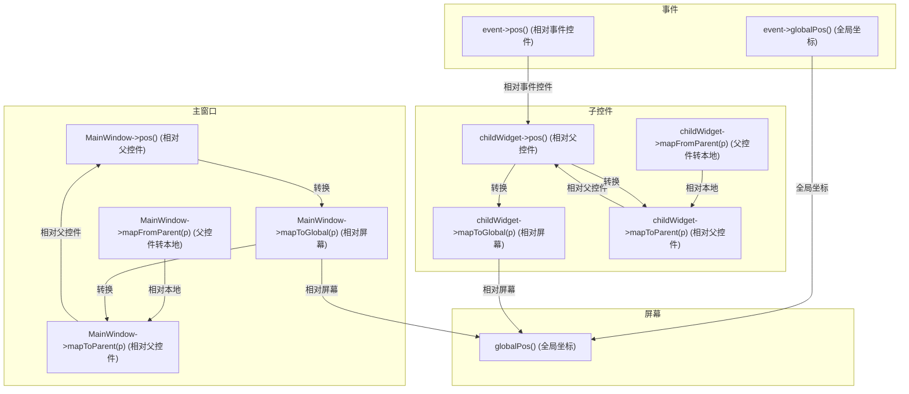

# 坐标系小抄

Qt 中获取坐标的方法有很多，除了 `event->pos()` 和 `event->globalPos()`，还有 **各种映射坐标的方法**，可以用于不同控件之间的坐标转换。  

---

## **1. Qt 坐标系统核心方法**
下面是常见的坐标获取和转换方法：

| **方法** | **作用** | **返回的坐标** | **适用场景** |
|----------|---------|--------------|-------------|
| `event->pos()` | 获取事件发生时的局部坐标 | **相对事件控件的坐标** | 鼠标、键盘事件 |
| `event->globalPos()` | 获取事件发生时的全局坐标 | **相对屏幕的坐标** | 全局鼠标位置 |
| `widget->pos()` | 获取控件的 **父控件** 内的坐标 | **相对父控件的坐标** | 窗口内的子控件 |
| `widget->mapToGlobal(QPoint p)` | 将 `p` 从 **控件局部坐标** 转换为 **全局坐标** | **相对屏幕的坐标** | 获取控件在屏幕上的位置 |
| `widget->mapFromGlobal(QPoint p)` | 将 `p` 从 **全局坐标** 转换为 **控件局部坐标** | **相对控件的坐标** | 计算鼠标点击的局部位置 |
| `widget->mapToParent(QPoint p)` | 将 `p` 从 **控件局部坐标** 转换为 **父控件坐标** | **相对父控件的坐标** | 计算子控件在父窗口中的位置 |
| `widget->mapFromParent(QPoint p)` | 将 `p` 从 **父控件坐标** 转换为 **局部坐标** | **相对自身的坐标** | 计算父窗口给子控件的坐标 |
| `widget->mapTo(QWidget* target, QPoint p)` | 把 `p` 转换为 `target` 的坐标 | **相对目标控件的坐标** | 在不同控件间转换坐标 |
| `widget->mapFrom(QWidget* source, QPoint p)` | 把 `source` 的 `p` 转换为自身坐标 | **相对自身的坐标** | 多窗口交互时转换 |

---

## **2. Mermaid 图表：完整 Qt 坐标体系**
下面是一个完整的 **Qt 坐标体系网络**，展示了不同的 **坐标获取方式** 以及 **控件、事件的关系**。



---

## **3. 说明**
1. **事件的 `event->pos()` 是相对触发事件的控件的**，但 `event->globalPos()` **是相对整个屏幕的**。
2. **`widget->pos()` 是相对其父控件的坐标**，如果它是主窗口，则相对于桌面。
3. **`mapToGlobal()` 和 `mapFromGlobal()` 用于全局坐标转换**：
   - `mapToGlobal(p)`：把 `p` **从控件内部坐标转换到屏幕坐标**。
   - `mapFromGlobal(p)`：把 `p` **从屏幕坐标转换到控件内部坐标**。
4. **`mapToParent()` 和 `mapFromParent()` 用于父子控件间坐标转换**。
5. **`mapTo(QWidget* target, QPoint p)` 用于在两个不同控件间转换坐标**。

---

## **4. 代码示例**
**示例 1：将 `QPushButton` 位置从相对 `MainWindow` 变为全局坐标**
```cpp
QPoint globalPos = button->mapToGlobal(button->pos());
qDebug() << "Button 全局坐标：" << globalPos;
```

**示例 2：将全局鼠标位置转换为 `MainWindow` 坐标**
```cpp
QPoint localPos = mainWindow->mapFromGlobal(QCursor::pos());
qDebug() << "鼠标相对 MainWindow 的位置：" << localPos;
```

**示例 3：两个控件之间转换坐标**
```cpp
QPoint buttonInAnotherWidget = button->mapTo(anotherWidget, QPoint(0, 0));
qDebug() << "Button 相对 anotherWidget 的位置：" << buttonInAnotherWidget;
```

---

## **5. 总结**
1. **事件坐标**
   - `event->pos()`：相对当前事件控件
   - `event->globalPos()`：相对屏幕
2. **控件坐标**
   - `widget->pos()`：相对 **父控件**
   - `widget->mapToGlobal(QPoint p)`：转成 **全局坐标**
   - `widget->mapFromGlobal(QPoint p)`：从 **全局坐标转成本地坐标**
   - `widget->mapToParent(QPoint p)`：转成 **父控件坐标**
   - `widget->mapFromParent(QPoint p)`：从 **父控件坐标转成本地坐标**
   - `widget->mapTo(QWidget* target, QPoint p)`：转换成 **目标控件坐标**
   - `widget->mapFrom(QWidget* source, QPoint p)`：从 **其他控件坐标转成本地坐标**

---

有了这张 **Mermaid 图表** 和 **详细方法列表**，你可以清楚地知道如何处理 **事件坐标、控件坐标、全局坐标**，以及如何 **正确转换坐标**。🚀 (by gpt)