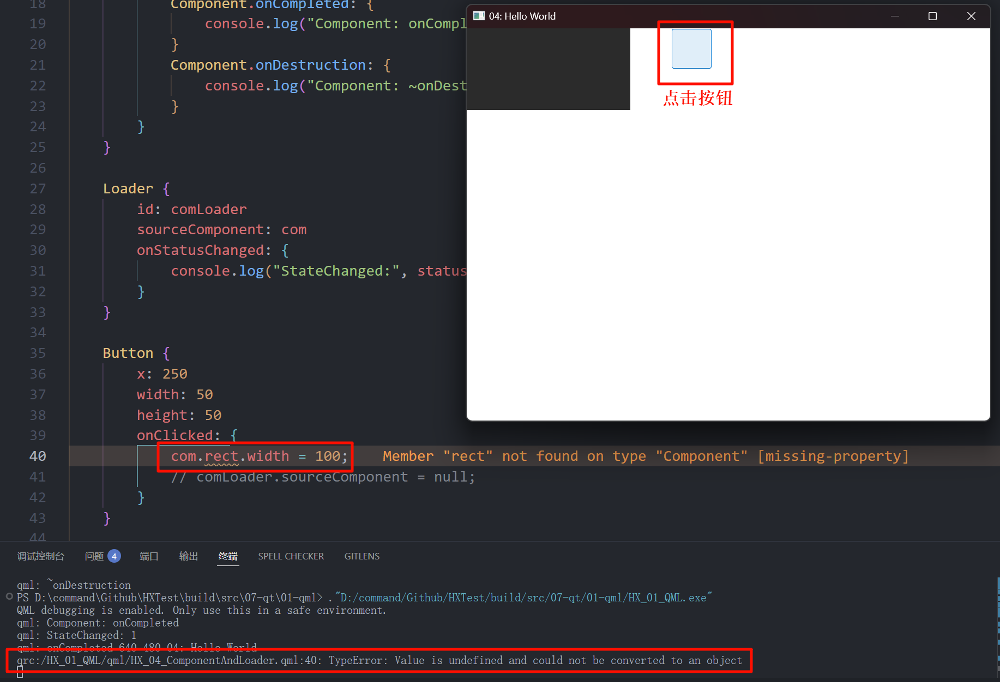

# Component与Loader
## 1. Component
### 1.1 生命周期 (onCompleted & onDestruction)

这个是生命周期钩子, 也就是回调函数, 是在对应动作完成后, 才调用的. **不是** 和对应动作一起调用的, 即 **不等价** 构造 & 析构 函数.

```qml
import QtQuick

Window {
    width: 640
    height: 480
    visible: true
    title: qsTr("04: Hello World")

    Component.onCompleted: { // 组件生命周期回调函数
                             // onCompleted 会在创建完成后, 调用
        console.log("onCompleted", width, height, title);
    }
    Component.onDestruction: { // onDestruction 会在销毁完成后, 调用
        console.log("~onDestruction");
    }
}
```

### 1.2 自定义组件 (Component)

```qml
import QtQuick

Window {
    width: 640
    height: 480
    visible: true
    title: qsTr("04: Hello World")

    // 自定义组件
    Component {
        id: com
        Rectangle {
            width: 200
            height: 100
            color: "#2b2b2b"
        }
    }
}
```

我们发现, 直接这样写, 但这个组件却没有加载...

这时候就需要用到 Loader 了!

## 2. Loader
### 2.1 Loader, 从URL加载 (source)

- source 属性, 指定从某路径加载.

```qml
import QtQuick

Window {
    width: 640
    height: 480
    visible: true
    title: qsTr("04: Hello World")

    Loader {
        // 从相对路径 ./ui/MyRectangle.qml 查找
        // 特别的, 如果是 /ui/MyRectangle.qml 那么是从 qrc 路径中查找
        source: "ui/MyRectangle.qml"
        width: 100
        height: 100
    }
}
```

### 2.2 加载组件 (sourceComponent)

- sourceComponent 属性, 指定加载的 `组件id`

```qml
import QtQuick

Window {
    width: 640
    height: 480
    visible: true
    title: qsTr("04: Hello World")

    // 自定义组件
    Component {
        id: com
        Rectangle {
            width: 200
            height: 100
            color: "#2b2b2b"
        }
    }

    Loader {
        sourceComponent: com
    }
}
```

### 2.3 加载状态 (Loader.status)

QML 加载的状态. 它可以是:
- `Loader.Null` - 加载器处于非活动状态或未设置 QML 源
- `Loader.Ready` - QML 源已加载
- `Loader.Loading` - 当前正在加载 QML 源
- `Loader.Error` - 加载 QML 源时发生错误

```qml [z1-代码]
import QtQuick
import QtQuick.Controls

Window {
    width: 640
    height: 480
    visible: true
    title: qsTr("04: Hello World")

    // 自定义组件
    Component {
        id: com
        Rectangle {
            width: 200
            height: 100
            color: "#2b2b2b"
            Component.onCompleted: {
                console.log("Component: onCompleted");
            }
            Component.onDestruction: {
                console.log("Component: ~onDestruction");
            }
        }
    }

    Loader {
        id: comLoader
        sourceComponent: com
        onStatusChanged: {
            console.log("StateChanged:", status);
        }
    }

    Button {
        x: 250
        width: 50
        height: 50
        onClicked: {
            comLoader.sourceComponent = null;
        }
    }
}
```

```shell [z1-输出]
QML debugging is enabled. Only use this in a safe environment.
qml: Component: onCompleted
qml: StateChanged: 1

# 此时点击按钮, 相当于释放了 该组件
qml: Component: ~onDestruction
qml: StateChanged: 0
```

### 2.4 修改加载的组件的属性 (LoaderId.item)



我们发现, 像上图那样修改, 是会直接报错的, 因为QML似乎找不到这个元素.

我们应该使用 `item` 属性来访问 当前加载的 **顶层对象**:

```qml
Button {
    x: 250
    width: 50
    height: 50
    onClicked: {
        // com.rect.width = 100; // 报错
        comLoader.item.width = 50;
    }
}
```

> [!TIP]
> 注意, 是使用 id.item 而不是 Loader.item 哦! 也就是说, 可以有多个 Loader 它们分别对应一个 item.

### 2.5 加载状态 实例: (Error)

```qml
Loader {
    source: "../img/misaka.png"
    onStatusChanged: {
        console.log("StateChanged:", status);
    }
}
```

我们 **不能** 直接加载图片, 上面的代码是错误的, 会输出 `qml: StateChanged: 3`.

### 2.6 加载状态 实例: (Loading)

- Loading 实际上就是指异步加载中...

异步加载就是为了防止卡住ui线程, 让界面先提供 `加载中的动画` 这样...

```qml [z2-代码]
Loader {
    id: comLoader
    sourceComponent: com
    asynchronous: true // 加上这个, 就是异步加载了
    onStatusChanged: {
        console.log("StateChanged:", status);
    }
}
```

```shell [z2-输出]
# 组件: 异步加载
qml: StateChanged: 2

# 主窗口加载完成
qml: onCompleted 640 480 04: Hello World

# 组件: 加载完成-调用: 生命周期钩子
qml: Component: onCompleted

# 组件: 加载完成
qml: StateChanged: 1
```

### 2.7 Component + Image 与 Loader 简单使用

```qml
// 核心代码: (注: 你需要配置qrc! 很难使用裸的相对路径和绝对路径!
//               但是, cmake不需要动, 似乎qt内部会处理好)
Component {
    id: imgCom
    Image {
        id: img
        source: "qrc:/img/misaka.png"
        // 或者写为 source: "/img/misaka.png", 反正都是从 qrc 中找...
    }
}

Loader {
    id: comLoader
    sourceComponent: imgCom
    asynchronous: true
    onStatusChanged: {
        console.log("StateChanged:", status);
    }
}
```

而对于 `.gif` 的动图, 它还是加载为静态的, 这时候我们就需要:

### 2.8 Component + AnimatedImage 与 Loader 简单使用

AnimatedImage 是 Image 的子类, 拓展支持一些动图的属性, 下面是使用示例:

```qml
Component {
    id: imgCom
    AnimatedImage {
        id: gif
        source: "qrc:/img/maye.gif"
        width: 100
        height: 100
    }
}

Loader {
    id: comLoader
    sourceComponent: imgCom
    asynchronous: true
    onStatusChanged: {
        console.log("StateChanged:", status);
    }
}

Button {
    x: 250
    width: 50
    height: 50
    onClicked: {
        // 控制 动图 是否暂停
        comLoader.item.paused = !comLoader.item.paused;
    }
}
```