# 学习图形学从 OpenGL 学起

> [!TIP]
> 本课内容, 基本上是概念复制粘贴, 代码自己实验, += 体会, == 笔记

## ゼロ、前言介绍
### 0.1 原作者

本笔记学习自 [【公开课】现代OpenGL保姆级课程, 从零开始打造3D游戏引擎(第一集, 持续更新中)](https://www.bilibili.com/video/BV1Na4y1c7tP/), 仅为个人笔记~

```bilibili ##BV1Na4y1c7tP##
BV1Na4y1c7tP
```

含金量:

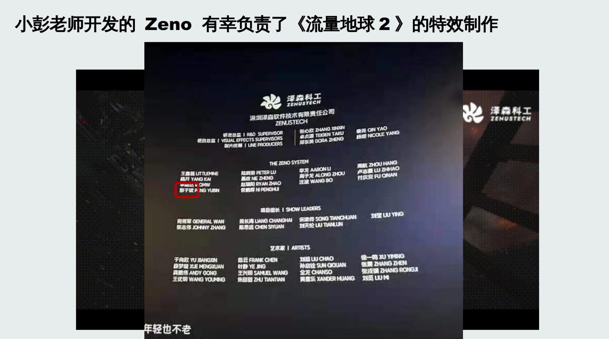

优点(其中一点):

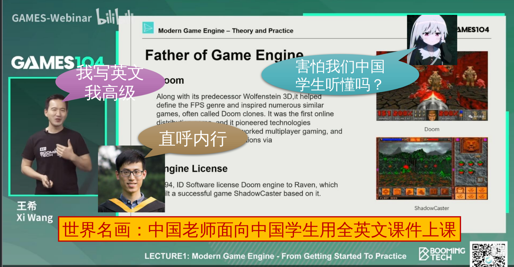


### 0.2 课程参考资源

- Learn OpenGL 网站(非常适合初学者):  https://learnopengl.com
- 红宝书: 《OpenGL Programming Guide》或称《OpenGL编程指南》
- 蓝宝书: 《OpenGL Superbible: Comprehensive Tutorial and Reference》
- 着色器: 《OpenGL 4.0 Shading Language Cookbook》
- GPU Gems 系列: https://developer.nvidia.com/gpugems/gpugems3/foreword
- OpenGL 官方主页: http://www.opengl.org/
- Khronos(OpenGL 的维护团队)主页: http://www.khronos.org/
- GAMES104(不能尬黑, 还是很精彩的课程): https://games104.boomingtech.com/

## 一、什么是渲染
### 1.1 计算机图形学

> 计算机图形学是研究计算机在硬件和软件的帮助下创建计算机图形的科学学科, 是计算机科学的一个分支领域, 主要关注数字合成与操作视觉的图形内容。虽然这个词通常被认为是指三维图形, 事实上同时包括了二维图形以及影像处理。
>
> - 我们的课程将会从实时渲染开始入手


### 1.2 什么是渲染

> **渲染(rendering)** 是指将计算机图形学中的场景描述, 以图像形式呈现出来的过程。在计算机图形学中, 场景是由一些基本图形元素(如点、线、面)组成的, 这些元素可以通过计算机程序进行操作和变换, 形成各种各样的场景。渲染的过程就是将这些场景元素进行处理, 生成最终的图像。渲染还可以分为实时渲染和离线渲染两种方式, **实时渲染**用于实时交互式应用程序(如游戏), **离线渲染**用于制作影视动画等非实时应用。

简单来说就是根据图形的 **三维的模型数据**, 生成 **二维的画面**。

### 1.3 一切皆三角形

#### 1.3.1 二维

渲染的任务是绘制图形, 先别提绘制, 首当其冲的问题是: 如何表示图形?

> $\text{\color{#ff33ff}{所有的复杂图形, 都可以由三角形构成。}}$


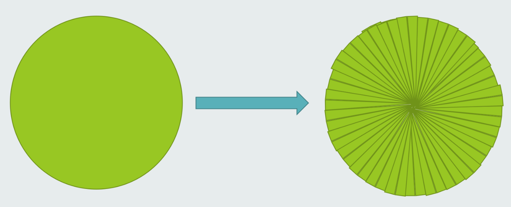

> (圆也是可以逼近的 (积分思想))

计算机图形学经典名言: **看起来是对的, 那他就是对的。**

毕竟计算机图形学渲染出来的东西是给人看的, 不论用什么方法, 能够让人信服, 就是最大的胜利。即使用多边形近似.

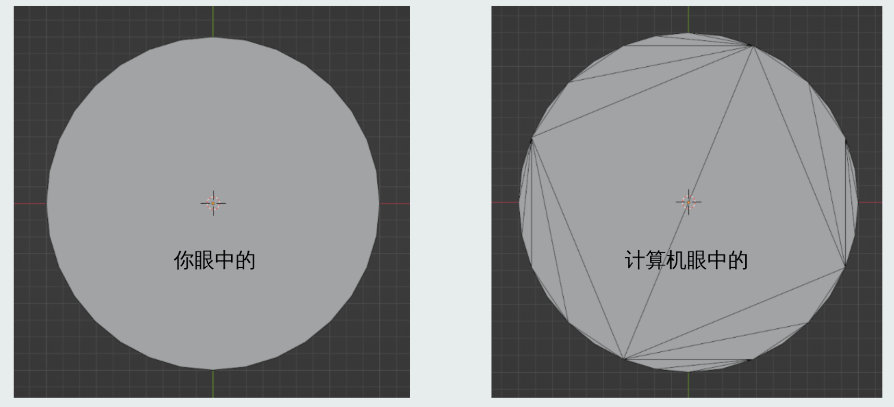

#### 1.3.2 三维

如果是三维空间中的实心物体呢? 因为我们屏幕实际上是二维的, 因此我们只需要表示表面就可以了!

计算机图形学: **画皮**

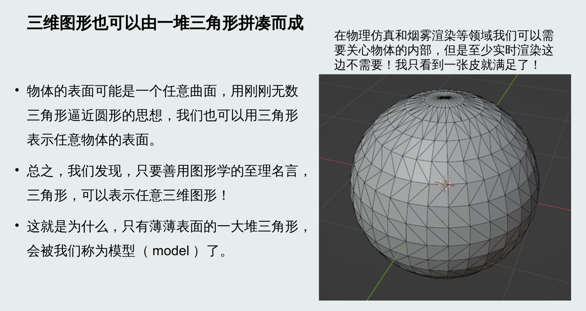

### 1.4 高模 vs 低模

当然, 为了保证高质量, 需要三角形足够密集, 让人看不出这是多边形拼凑出来的, 让人信以为真这是一条光滑的曲面。因此有了高模和低模的区分。

一般建模师都会先在低模上进行操作, 完成后再通过 **网格细分算法(subdivision)** 把低模自动转换为平滑的高模, 然后由雕刻师在高模上完成细节刻画。

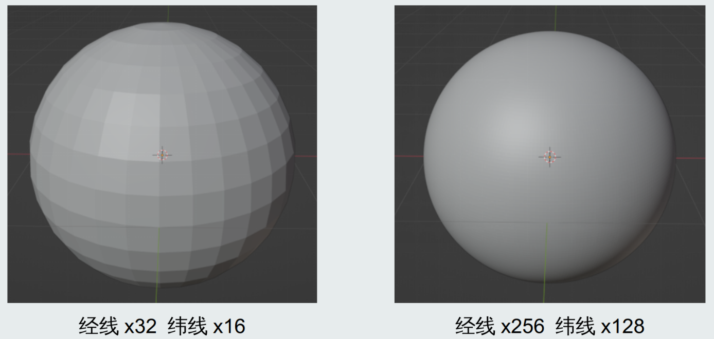

### 1.5 渲染的本质
#### 1.5.1 如何用一系列坐标表示一个方块? 

> 顶点坐标+顶点之间的连接关系

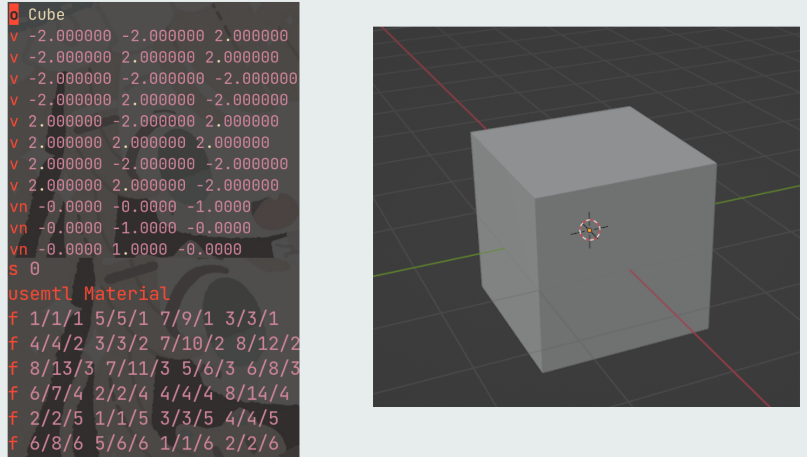

#### 1.5.2 渲染的本质

你要输入的是一张纸, 上面写着字:

> (0, 0)(0, 1)(1, 0)

这就是三维模型数据。

你把写着这 6 个神秘数字的纸条塞进了一个叫“显卡”的机器里。

“显卡”缓缓(不到 1/60 秒)打印出一张字符画: 

```text
1 0 0 0 0 0
1 1 0 0 0 0
1 1 1 0 0 0
1 1 1 1 0 0
1 1 1 1 1 0
1 1 1 1 1 1
```

这就是二维画面。

#### 1.5.3 人们对渲染的错误理解

在B站搜索“什么是渲染”会看到很多这样的封面。似乎渲染就是给灰色的模型“上色”?

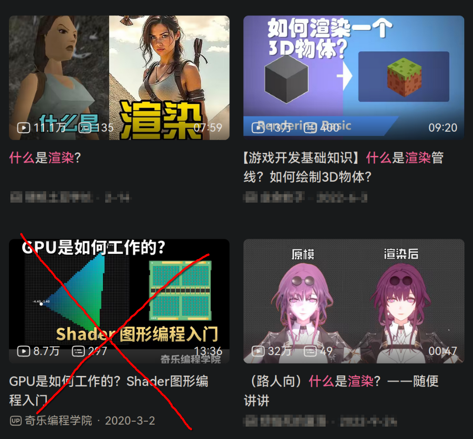

> 请忽略左下角

实际上, 即使是左边的图像, 也是渲染过的结果, 只不过是低配版的渲染。

渲染并不是给灰色的模型“上色”, 模型本身不存在灰色不灰色, 灰色的是显示在屏幕上的模型的二维投影, <b style="color: gold">真正的模型是内存中的一堆三维顶点坐标, 渲染是把这一堆三维坐标根据指定的视角、灯光、材质等信息, 投影成二维图像</b>, 即使你指定的材质刚好是灰色的。

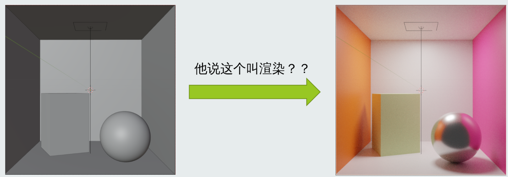

你在 Blender 建模窗口里看到的, 之所以是灰模, 不是因为没有渲染, 而是因为他为了让你能为了让你能快速预览模型的大致形状而不用风扇狂转, 采用了**最低配的渲染模式**。

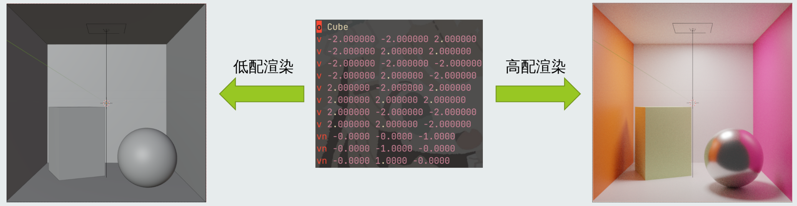

### 1.6 实时渲染 vs 离线渲染

渲染又可以分为两派人, **实时渲染(real-time rendering)** 和 **离线渲染(offline rendering)**。

**实时渲染** 要求在 1/60 秒内完成整个画面的绘制, 通常游戏行业会有这样的要求。

如果不能在 1/60 秒内完成, 就会影响游戏体验, 即使画面再好, 也不会有人能忍受 PPT。

而 **离线渲染** 不注重画面渲染的实时性和速度, 但非常重视画面的质量, 通常是电影行业。

因为电影只需动画公司渲染完成品后, 在影院播放即可, 渲染过程的快慢不影响实际播放。

两个领域看似各玩各的, 其实之间也有许多相互交叉, 相互借鉴的地方。

实时渲染一般会使用`光栅化+GPU加速`。

而离线渲染会选择更慢但更准确的`路径追踪+蒙特卡罗积分`。

也有例外的情况, 例如 NVIDIA 实时光线追踪和使用 Unreal 游戏引擎做动画电影的小作坊。

本课程主要介绍的是**实时渲染技术**。

#### 1.6.1 离线渲染 - 康奈尔箱

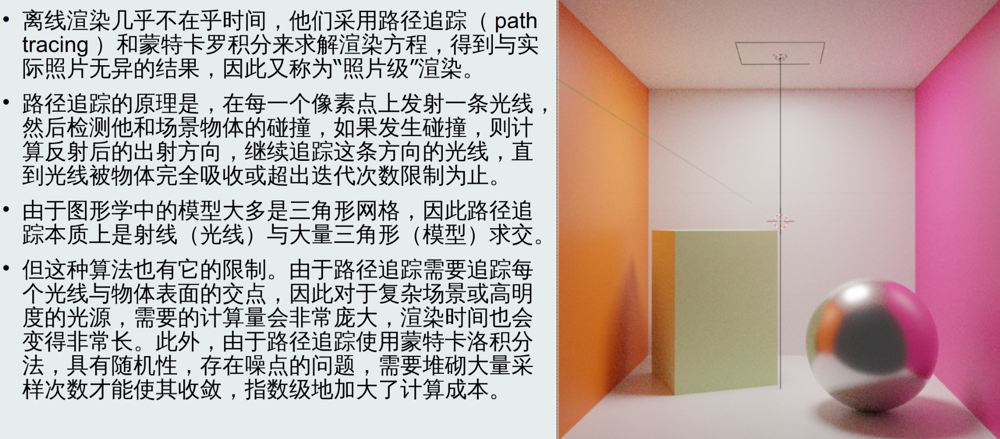

路径追踪 - 照片级真实感, 但是代价呢?

> 相传迪士尼的《疯狂动物城》, 需要 10000 个“核时”才能渲染出一帧。什么概念呢? 就是说单核心 CPU, 需要工作 10000 小时, 才能渲染出你看到的一帧, 如果是 100 核 CPU 则只要 100 小时就能出一帧。而电影一般每秒有 24 帧, 考虑到整部电影有一小时多...

#### 1.6.2 第二条道路 - 光栅化

有没有比路径追踪更高效的渲染方案呢? 那就是 `光栅化(rasterization)`。

他使用遍历的方法, 绘制每个三角形时都检测出中心点包含在三角形内部的像素点, 并填充上颜色, 如下图所示。

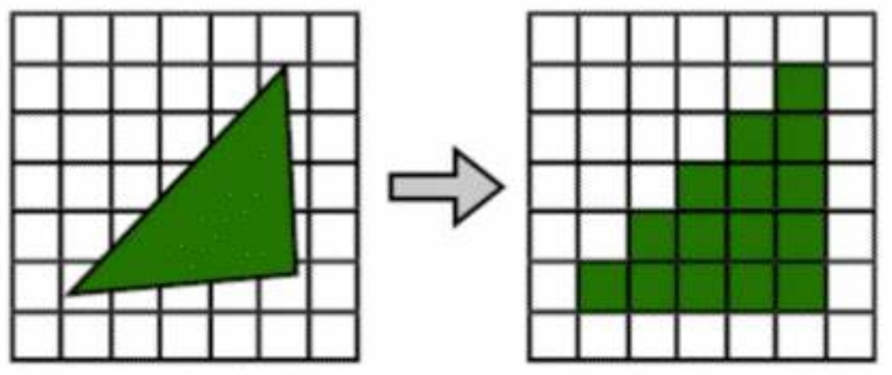

三角形的**光栅化**, 比路径追踪的**射线与三角形求交**要高效得多, 且通常不需要多次采样。

> [!TIP]
> **光栅化是一个可以并行的算法**, 可以在 CPU 上编写软件代码实现, 但效率较低。考虑到光栅化是绘制图形最高效的算法, 人们发明了 GPU, 把光栅化做成硬件电路, 不必软件编程, 软件只需要向 GPU 发出指令, 就可以调用 GPU 的光栅化电路, 并绘制图像。

#### 1.6.3 着色: 使物体明暗分明

如果只是光栅化, 那么我们看到的图形就都是黑白的二值图像, 根本不会有立体感。

为了让图形看起来立体, 真实, 我们需要像离线渲染的路径追踪一样, 计算物体的光照情况, 给不同的位置上不同的颜色, 这个操作称为 `着色(shade)`。

确定这个点要绘制后, 就会调用所谓的 `着色器(shader)`。着色器会根据三角形每一个像素点的位置, 结合物体材质反射率、颜色、该点三维坐标与光源、摄像机的角度位置关系等信息, 在相应的像素点填充上符合`光学规律`的颜色, 区分出亮部暗部, 让他看起来立体。

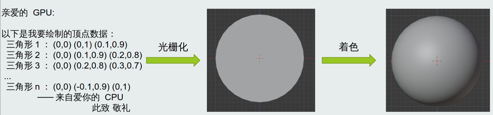

### 1.7 CPU vs GPU

众所周知, CPU 适合处理一些通用任务, 而 GPU 则更适合处理需要大量计算能力的图形图像和视频任务。

#### 1.7.1 GPU 为实时渲染而生

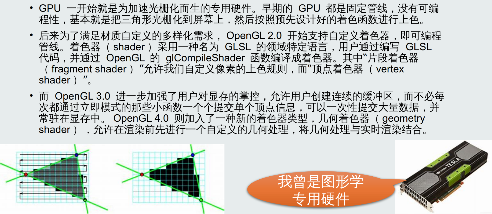

#### 1.7.2 实时渲染 - 质量堪忧

硬件加速的光栅化虽然高效, 但由于光栅化只能计算光线的第一次反射, 实时渲染在全局光照方面令人堪忧, 为了实时性不得不牺牲了渲染结果的准确性。

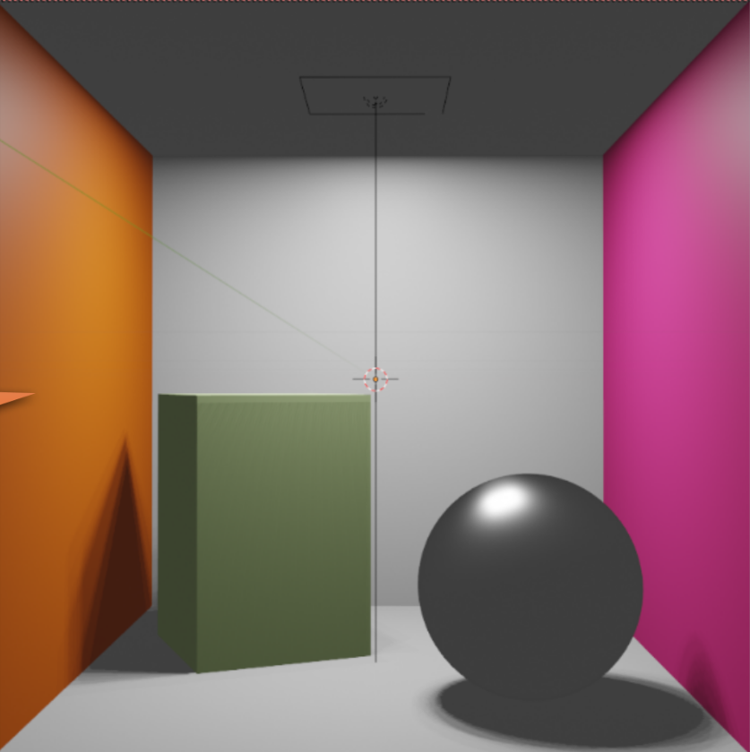

#### 1.7.3 实时渲染的进步

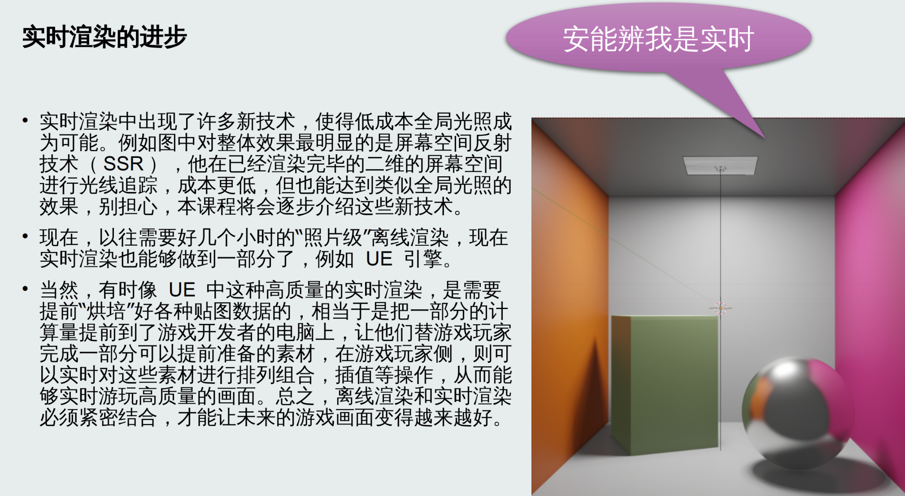

### 1.8 从 GPU 到 GPGPU

> 后来, 着色器能够并行运算的特点被发掘, 用于图形渲染以外的通用并行计算工具, 后来OpenGL 4.3 也推出了更适合通用计算任务的“计算着色器(compute shader)”, 这种着色器的语法限制更加宽松, 首次加入了对 block 和 thread 的控制能力, 用途上显然早已和“着色”没什么关联了, 只有并行的优点被保留, GPU 逐渐演变成通用的并行计算硬件。
>
> GPU 强大的并行运算能力和延迟隐藏能力, 对于需要同时处理大量数据的应用场景, 比如物理仿真、音视频处理和人工智能等, GPU 也能发挥更强大的计算能力, 大幅提高吞吐量。

这种具备通用并行计算能力的 GPU 也被称作 **GPGPU(General Purposed GPU)**。

#### 1.8.1 GPU 也开始支持光线追踪

> - 屏幕空间反射(SSR)和屏幕空间全局光照(SSGI)虽然高效, 但是只能在二维的已经渲染完毕的屏幕上去做光线追踪。
> 
> - 随着硬件的不断加速升级, 光线追踪变得有希望在 1/60 秒内完成。为了让 1080p 分辨率下的光线追踪变成实时(小于 1/60 秒), 后来部分显卡厂商支持起了硬件加速的光线追踪, 称为实时光线追踪(real-time ray-tracing, RTX), 解决了之前 CPU 软件光线追踪太慢, GPU 软件光线追踪差一点就实时的痛点。
> 
> - 就像当年光栅化差一点就能实时了, NVIDIA 发明 GPU 用硬件加速**光栅化**一样, 他们现在又发明了硬件加速的**光线追踪**, 同样集成到了 GPU 里, 于是现在的淫威大 GPU 由光线追踪+光栅化+流处理器三个模块组成, 后来还引入了伺候 DLSS 和 AI 降噪的张量计算模块。
> 
> - 要注意并不是说 RTX 等于光追, RTX 只是“硬件加速”的光追。正如硬件加速的光栅化一样。我们用 OpenGL 计算着色器, CUDA, OpenCL, 一样可以在任何没有硬件光线追踪功能的 GPU 上进行软件光线追踪, 只不过会比较慢, 难以达到实时而已。
>
> - 虽然硬件光追只加速了 2.4 倍左右, 但是由于实时渲染的特殊性, **同等画质下提升 2.4 倍速度, 就等于同等 1/60 秒的情况下提升了 2.4 倍画质**, 帧率不降提升画质, 是质的飞跃, 这也是为什么在实时领域硬件加速(不论是光栅化还是光线追踪)都显得格外重要。

#### 1.8.2 最终效果比较

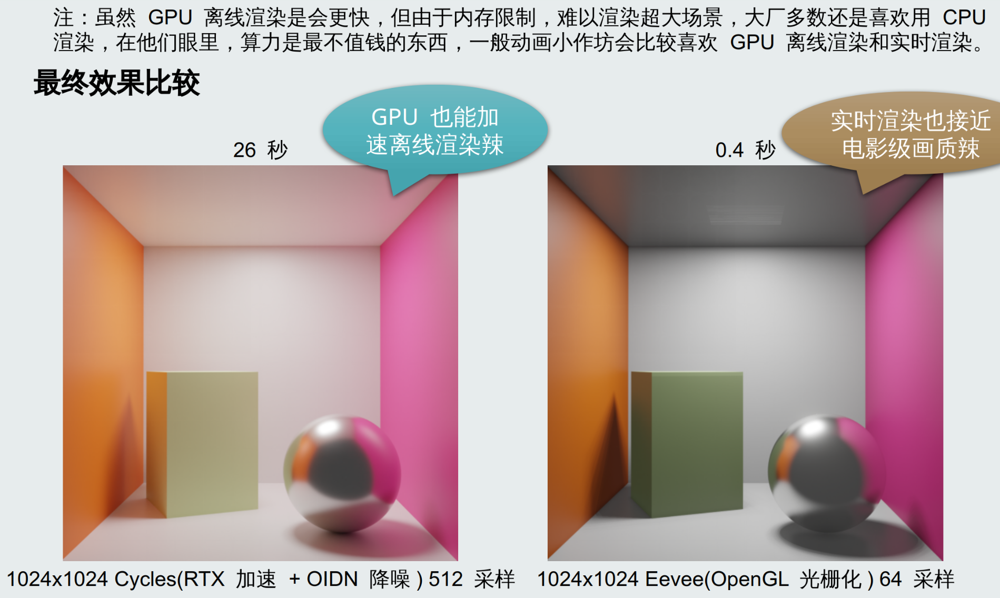

### 1.9 GPU 渲染一个物体所需的全部流程一览

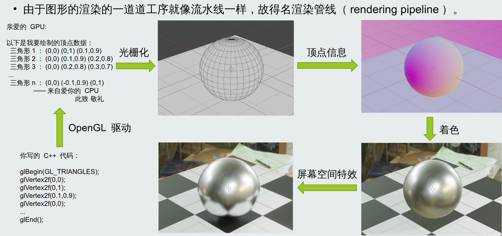

### 1.10 题外话: GPU 也可以渲染二维图形

> GPU(图形处理器)在渲染三维图形方面几乎是不可替代的, 但是它们也可以用于渲染二维图形(包括文字和图标), 例如我们平时看到的图形用户界面(GUI)、浏览器(Web)等, 都有 GPU 的功劳。GPU 的渲染能力非常高, 它可以同时渲染许多图形, 还可以使图像处理速度(例如拍照后加美颜滤镜)更快。GPU 可以处理的图形元素包括点、线、矩形、多边形、文本等。它还可以使用多种不同的技术和效果, 如图形加速、抗锯齿和透明度, 以提高图形界面的质量和性能。所以, GPU的用途不仅限于游戏和 3D 应用程序, 它们也可以帮助我们更快更好地渲染的图形用户界面。包括 2D 平面游戏的精灵(Sprite)绘制, 也离不开 GPU 忙碌的身影。

## 二、初识 OpenGL
### 2.1 什么是 OpenGL

为了调用 GPU 硬件进行高效的光栅化渲染，绘制图形，我们需要使用一些接口，来命令 GPU 帮助我们进行各种图形的绘制操作。

> 与 CPU 的 x86 指令集一家独大不同，GPU 不能说是百家争鸣吧，至少也可以说是各自为政了。有时同一家厂商不同型号的 GPU，其汇编指令也会大不相同。为了减轻程序员的负担，急需一个跨平台，跨硬件的通用接口，只要使用这套接口的 GPU，就能被所有图形程序使用；反之，所有图形程序只要使用这套通用接口，就可以在所有支持该接口的 GPU 上运行。
>
> 然而无独有偶，和硬件的百家争鸣一样，接口也在百家争鸣。这样的“通用接口”有很多，我们今天要介绍的 OpenGL 就是其中之一。

OpenGL（英语：Open Graphics Library，译名：开放图形库或者“开放式图形库”）是用于渲染2D、3D矢量图形的跨语言、跨平台的应用程序编程接口（API）。这个接口由近350个不同的函数调用组成，用来从简单的二维图形绘制复杂的三维景象。

### 2.2 OpenGL 的版本与驱动支持

> 就和 C++ 语言一样，OpenGL 的 API 是有许多版本的，每个版本 API 的制定，是由一个名叫 Khronos 的组织发布的。和 C++ 的 ISOCpp 一个尿性，他们只负责制定 API，不负责实现，由各大硬件厂商的驱动来实现。
> 
> API 版本每年更新个一两次，硬件厂商看到了，就会更新他们的驱动版本，在新驱动中支持开始新版本的 API。
>
> 不能使用最新版本的 API，有时是受制于软件（驱动）版本，有时受制于硬件（显卡）架构。如果我们同学没有最新的硬件，至少可以先更新驱动。
> 
> 新驱动不仅更新了 API 版本，支持了新特性，还可能优化了性能。

你可以在 Khronos，KHR，或者说可汗，的官方网站查看不同版本 gl 函数的 API 文档:

https://registry.khronos.org/OpenGL-Refpages/gl4/html/glRenderbufferStorage.xhtml

> [!TIP]
> 一般来说新版本都会尽量保留老的函数，但是 OpenGL 2.0 到 3.0 的跳跃是个例外，废除了大量立即模式专用的亿些过于迂腐的老函数，那些在引入新函数的同时依然兼容 2.0 老函数的称为兼容配置（compatible profile），而只保留 3.0 中那些现代 API 函数的则称为核心配置（core profile），意思是只保留核心功能。

### 2.3 OpenGL 版本历史变迁

- OpenGL 1.0 固定管线 **立即模式**
- OpenGL 2.0 可编程管线 **立即模式**
- OpenGL 3.0 可编程管线 **现代模式**
- OpenGL 4.0 可编程管线 **现代模式** 计算着色器等新特性

> 注：本课程最高会用到 OpenGL 4.3 版本，前两课会从较为简单的 OpenGL 2.0 开始介绍。

### 2.4 GLSL 版本与 OpenGL 版本对照

```text
GLSL            OpenGL
1.10              2.0
1.20              2.1
1.30              3.0
1.40              3.1
1.50              3.2
3.30              3.3
4.00              4.0
4.10              4.1
4.20              4.2
4.30              4.3
4.40              4.4
4.50              4.5
```

OpenGL 2.0 的可编程管线，为了可编程，引入了着色器

其中片段着色器（fragment shader）允许用户自定义的每个像素的颜色计算公式（故得名着色器），这个公式后来被人们称作 BRDF；而顶点着色器（vertex shader）允许用户自定义的每个顶点的矩阵投影方式，修改顶点属性等

比如我们课程是 OpenGL 3.3，对应的 GLSL 是 3.30，因此在着色器里写 `#version 330`

### 2.5 古代 OpenGL

OpenGL 的接口（API）是有许多版本的。

OpenGL 2.0 及以前的版本，称之为古代 OpenGL，例如:

```C++
glBegin(GL_POINTS);
glVertex3f(0.0f, 0.5f, 0.0f);
glVertex3f(0.5f, 0.0f, 0.0f);
glEnd();
```

由于我们是一个一个函数调用来传入顶点的坐标，颜色等信息，这种模式下的 OpenGL 又被称为 **立即模式（intermediate mode）**，**立即模式** 是古代 OpenGL 特有的，<span style="color: red">效率较低，且灵活性差，难以自定义新的属性</span>。

`glMatrixMode`、`glPushMatrix` 和 `glOrtho` 等函数也是立即模式的 API 之一，如果你在一个 OpenGL 教程中看到这样的函数，那么他就是古代的教程。

> 在第一课和第二课的前半段中，处于教学目的，我们将简单介绍古代 OpenGL 的立即模式。

### 2.6 现代 OpenGL

OpenGL 的接口（API）是有许多版本的。
OpenGL 3.0 及以后的版本，称之为现代 OpenGL，例如:

```c++
glGenVertexArrays(1, &vao);
glBindVertexArrays(vao);
```

特点是有非常多的各种 VAO，VBO，FBO，各种对象及其绑定（bind）操作。

初学者可能对此心生畏惧，不要担心，在小彭老师的答辩比喻法介绍下，没有什么花里胡哨概念是难理解的，他会告诉你哪些是需要注意的，哪些是次要的，帮你拎出重点，排除掉亿些不重要的干扰项，熟练使用 C++ RAII 思想封装，了却 OpenGL 状态机模型的痛苦。

> 从第二课的后半段开始，我们将由古代 OpenGL 转向现代 OpenGL 的各种花里胡哨。

### 2.7 OpenGL 实现与不同的 API

> OpenGL 是一个开放的 API 标准，有许多不同的实现，通常是由显卡（GPU）硬件厂商实现的。由于很多跨平台软件都会用 OpenGL API 实现图形化，因此显卡厂商们都会争先恐后地支持 OpenGL。
>
> 同理还有 DirectX 系列 API，他也有非常多的版本，但他是比尔盖子提出的 Wendous 独占 API，比尔盖子为了维护微软帝国统治，特意在 Wendous 平台上不负优化了 OpenGL，以迫使追求性能的用户多多使用他垄断的 DirectX，而一旦你的软件使用了 DirectX，那么就没法再移植到其他平台（比如 Linux，MaikeOS）了。
> 
> 乔布斯也不甘落后，在他的 MaikeOS 上推出了 Metal 系列 API，并宣布 OpenGL 版本停止更新（比盖子还要狠），永远停止在了 OpenGL 4.1，导致 MaikeOS 无法使用 OpenGL 4.3 引入的 compute shader 等一系列实用新特性。
> 
> 为了让没有显卡的用户也能使用图形化程序，有一个叫做 mesa 的特殊 OpenGL 实现，他完全在 CPU 上运行，使用软光栅渲染，使用 LLVM 编译 shader，不需要显卡也可以运行。但效率比显卡硬件加速的光栅化（rasterization，渲染三维图形的关键）低得多。还有一个 OSMesa（off-screen mesa），用于在没有显示器的情况下（例如服务器）进行离屏渲染。

### 2.8 OpenGL 扩展

OpenGL 提供的函数都是通用的，几乎每个正经的 GPU 都支持的功能。

而有时，硬件厂商不满足于只提供大锅菜，还会开小灶，这就是 OpenGL 扩展，扩展官方提供的一种添加额外 API 的手段，用户可以检测当前 OpenGL 实现是否具有某扩展，如果有，则可以使用这些函数，如果没有，则必须想办法绕道（walk around），用比较低效的通用 API 实现那个只有 NVIDIA 显卡才具有的扩展，或者宣布放弃支持非 NVIDIA 显卡。

例如这是一个 NVIDIA 从 Turing 架构开始支持的一个 OpenGL 扩展，扩展的名字格式如下:

GL_NV_compute_shader_derivatives

Khronos 官方有一个页面来维护这些扩展的描述文档：

https://registry.khronos.org/OpenGL/extensions/NV/NV_compute_shader_derivatives.txt

> 这些扩展需要驱动和硬件本身的支持，老的显卡不一定具有，往往只有特定品牌，足够高型号的显卡才具有，为了照顾没有最新显卡的同学，小彭老师在实验源码中完全不使用扩展，如果要使用，则也会加入分支检测不到扩展时的“绕道”方案。

### 2.9 OpenGL 与 Vulkan - 我该学习哪个?

Vulkan 是比 OpenGL 更新的跨平台 API，也是由 Khronos 推出的，所谓“未来替代品”。

Vulkan 函数接口究极无敌复杂，还都是 C 风格的，参数爆多，一个个指针传来传去，本来一个简单的需求需要拆分成好几个函数调用才能解决，例如他画一个三角形要一千行代码，类推可知画一个正方形要两千行（不是）。OpenGL 帮你掩盖了一部分实现细节，简化了思考，而 Vulkan 中这些全部需要你自己去伺候，虽然提升了上限，但也对初学者极不友好。

OpenGL 历史悠久，有许多硬件厂商支持 OpenGL，而 Vulkan 比较新，老的显卡可能不支持 Vulkan，需要通过“翻译层”，把你的 Vulkan API 调用“翻译”成 OpenGL 或 DirectX才能使用，导致你辛苦写花里胡哨 Vulkan 半天，还不如直接使用 OpenGL 高效。

Vulkan 太新了，他的教程非常少，有些教程还存在错误，而网络上关于 Vulkan 资源的稀缺又让你无法验证真伪。同时，Vulkan 很容易报各种莫名其妙的错误信息，由于过于新鲜导致网上难以找到每个报错对应的解决方案。而 OpenGL 就有着充足的教程资源和错误解决方案，例如最经典的 learnopengl.com。

总之，Vulkan 过于陡峭的学习曲线决定了学习他的基本都是已经熟练掌握过其他图形 API（例如 OpenGL，DirectX）的专家，而且由于过于新鲜导致没有多少企业在用，也没有多少硬件主动支持他，因此我强烈建议初学者先学习 OpenGL 作为敲门砖，图形 API 都是有共通点的，一旦理解原理后再学习其他 API 也不难，不用担心未来被“取代”之类。

### 2.10 OpenGL ES - 嵌入式特供版

OpenGL 设计的接口规范，对于硬件的要求有些过于高了，对于低性能平台不友好。

因此后来又推出了 OpenGL ES 接口规范，就像勺子还分大人勺子和儿童专用勺一样。

OpenGL 多用于电脑端，因为他们完全跑得起高性能显卡。而 OpenGL ES 多用于移动端，他是为了伺候手机芯片上低功耗低性能的嵌入式 GPU 的阉割版。

本课程不会教你 OpenGL ES，但 OpenGL ES 的接口和 OpenGL 非常相似，学会了 OpenGL 也很容易学会 OpenGL ES，正如学会 OpenGL 也很容易学会 DirectX 一样

### 2.11 OpenGL 的软光栅实现

为了让没有显卡的用户也能使用图形化程序，有一个叫做 mesa 的特殊 OpenGL 实现，他完全在 CPU 上运行，使用软光栅渲染，使用 LLVM 编译 shader，不需要显卡也可以运行。但效率比显卡硬件加速的光栅化（rasterization，渲染三维图形的关键）低得多。

Mesa 支持的 OpenGL 版本为 3.3，据称 Mesa 12 将会支持 OpenGL 4.2。

Mesa 也提供了 Vulkan 的实现，可以在 https://mesamatrix.net/ 上查看 Mesa 的更多信息。

一些 Intel 集成显卡（内置在 CPU 同一个芯片上的“阉割版”小 GPU）的驱动也会基于 Mesa 实现，这是因为他们的软件工程师人手不足，而 Mesa 是一个现成的 OpenGL 实现框架，所以他们会在 Mesa 基础上进行修改，实现自己 Intel 集成显卡的 OpenGL 驱动。

一些有钱有势的显卡大厂（如 NVIDIA）则会自己投资自己从零开始自己实现整个 OpenGL，好处是 NVIDIA 员工最熟悉 NVIDIA 自己的硬件，让硬件厂商完全把关整个 OpenGL 驱动实现，能够最大化利用硬件的性能，缺点是有时会出现实现得有 BUG，不符合标准的地方。

> 建议只在没有显卡或显卡版本过老，不支持本课程所需的 OpenGL 3.3 时才使用。

### 2.12 OpenGL 的驱动支持

驱动都是向前兼容的，再新的驱动都会兼容老的 API 版本，而老的驱动却会不支持新的 API 版本。不论是 OpenGL、DirectX、Metal 还是 Vulkan。

如果你的程序希望兼容特别老的显卡，或者需要在虚拟机环境中运行，并且不在乎性能：

那就得使用古代 OpenGL 2.0 及以下，使用最沙雕的立即模式。

如果你的程序不需要兼容特别老的显卡，并且对性能有所追求，或者要用到一些新特性：

那就得使用古代 OpenGL 3.0 及以上，使用 VAO、VBO 那一套。

驱动越新，支持的 OpenGL 版本越高。显卡越新，支持的 OpenGL 版本越高。

能够支持的 `OpenGL 版本 = min(驱动支持的版本，显卡支持的版本)`

### 2.13 Linux 安装 OpenGL

Arch Linux:

```shell
sudo pacman -S freeglut glu libglvnd mesa glfw glm
```

### 2.14 安装显卡驱动

刚刚说了，光有 OpenGL 运行时没用，还要有实际的显卡驱动才行。
- 请看 https://www.khronos.org/opengl/wiki/Getting_Started#Windows
- 按摩店驱动：http://support.amd.com/en-us/download
- 英特尔驱动：https://downloadcenter.intel.com/
- 淫威大驱动：http://www.nvidia.com/Download/index.aspx

没有显卡或搞不定显卡的同学可选择 Mesa 软光栅：下载 opengl32sw.dll 覆盖 opengl32.dll。

不过如果你玩游戏的话，通常来说 OpenGL 驱动早已经在你的电脑里了，这个东西一般是和 Direct3D 一起安装的，用 dxdiag 或 CPU-Z 工具也可以检测到 OpenGL 安装的版本。

### 2.15 OpenGL 头文件?

古代 OpenGL 往往用这个系统自带的头文件:

```cpp
#include <GL/gl.h>
```

这里面包含的都是些 OpenGL 2.0 以前版本的老函数，而不具有现代 OpenGL 3.0 以上的新函数，如果我们想要用现代 OpenGL，就不能用这个头文件。

现代 OpenGL 没有头文件，而是必须使用 LoadLibraryA 手动去 OpenGL 的 DLL 里一个个加载那些函数，如果我们每用一个函数就得手动加载一下函数，那该有多痛苦啊！

因此，有了 glad 和 glew 这样的第三方库，他们会在启动时加载所有的 OpenGL 函数，放到全局函数指针中去，这样当你使用时，就好像在调用一个普通的函数一样，没有痛苦。

因此为了现代 OpenGL，我们必须选择一个 API 加载器，本课程选用了 glad，当你需要 OpenGL 函数时，不是去导入那个落伍的 `<GL/gl.h>`，而是导入 `<glad/glad.h>` 作为代替:

```cpp
#include <glad/glad.h>
```

glad 坑点注意:

如果你用了 glad.h，就不要再导入那个古代的 gl.h 头文件了:

```cpp
#include <GL/gl.h>      // x 不要导入这坨古代垃圾，会和 glad 冲突！
#include <glad/glad.h>  // v 只需导入这个现代的即可！
```

此外还要记住 glad 头文件必须在其他 gl 相关库的前面，虽说 C++ Guidelines 都要求头文件的顺序理应不影响结果，但毕竟 glad 是个特殊玩意，还是得照顾他一下的。

例如 glad 必须放在 glfw 头文件的前面:

```cpp
#include <glad/glad.h>
#include <GLFW/glfw3.h>
```

建议自己的 glcommon.h 头文件里写这两行，然后用 gl 和 glfw 就导入这个 glcommon.h，这样就能保证顺序不乱。如果用到其他的 gl 相关库也可以往 glcommon.h 里追加。

### 2.16 glad 其实是让我们自己生成的

glad 实际上是一个 python 包，他所做的是根据你指定的版本，生成加载 OpenGL 全部函数的 glad.c 和头文件 glad.h

例如本项目的 glad.c 和 glad.h 是用以下命令生成的:

```bash
python -m pip install glad
python -m glad --out-path . --generator c --api gl=4.6 --profile compatibility
```

### 2.17 glfw - 跨平台的 OpenGL 窗体管理库

https://github.com/glfw/glfw

GLFW 是配合 OpenGL 使用的轻量级工具程序库，缩写自 Graphics Library Framework（图形库框架）。GLFW 的主要功能是创建并管理窗口和 OpenGL 上下文，同时还提供了处理手柄、键盘、鼠标输入的功能。

> 注：他实际上也支持创建 OpenGL ES 和 Vulkan 上下文。

### 2.18 glm - 仿 glsl 语法的数学矢量库

https://github.com/g-truc/glm

glm 和 glsl 的语法如出一辙，学会了 glsl 等于学会了 glm，反之亦然。

选择这款最接近 glsl 语法的矢量库将会大大节省我们的重复学习成本。

> 此外，glm 还支持 SIMD，支持 CUDA，虽然本课程用不到。

### 2.19 OpenGL 系列术语全家桶总结


- API：opengl（个人电脑）、opengl es（嵌入式平台）、vulkan、metal、directx
- OpenGL 模式：compatible（为兼容性保留老功能），core（仅保留最新功能）
- 上下文创建：wgl（Wendous）、glx（Linux）、egl（嵌入式平台）
- 窗口创建：glfw、glut
- API 加载器：glad、glew
- 数学矢量库：glm
- 着色器语言：glsl

```text
API：为方便实验，采用容易上手，兼容性强的 opengl
OpenGL 模式：我们用 core，直接上手现代 API，避开古代 OpenGL 的又臭又长
上下文创建：不需要我们程序员考虑，已经被跨平台的 glfw 或 glut 全权接管
窗口创建：我推荐 glfw，因为他比较新，而且用的人比较多
API 加载器：如果需要现代 OpenGL（2.0 以上）就必须用一款加载器，我们选择 glad
数学矢量库：glm 在 C++ 中模仿 glsl 中的 vec3 语法，减少重复学习的成本
着色器语言：glsl，opengl 专属着色器语言，可以通过玩 shadertoy 来学习
```

### 2.20 CMake 链接现代 OpenGL 所需第三方库

```CMake
add_subdirectory(glm)
target_link_libraries(main PUBLIC glm)
add_subdirectory(glfw)
target_link_libraries(main PUBLIC glfw)
add_subdirectory(glad)
target_link_libraries(main PUBLIC glad)
```

## 三、配置开发环境
### 3.1 CMake

https://github.com/HengXin666/HXTest/tree/main/src/08-OpenGL

参考其 CMake:

```CMake
# 函数: 禁用所有的警告即错误 (因为本地开启了最严格的编译检查, 不去掉检查, 下面的库都不能编译...)
function(disable_warnings_if_target_exists target)
    if (TARGET ${target})
        if (CMAKE_C_COMPILER_ID MATCHES "Clang|GNU")
            target_compile_options(${target} PRIVATE -w)
        elseif (MSVC)
            target_compile_options(${target} PRIVATE /w)
        endif()
    endif()
endfunction()

# 添加依赖(从子模块)
add_subdirectory(lib/glm)
add_subdirectory(lib/glfw)
add_subdirectory(lib/glad)

# 针对 C 库 target 禁用警告
disable_warnings_if_target_exists(glfw)
disable_warnings_if_target_exists(glad)

# 链接库
target_link_libraries(${TEST_NAME} PUBLIC glm)
target_link_libraries(${TEST_NAME} PUBLIC glfw)
target_link_libraries(${TEST_NAME} PUBLIC glad)
```

### 3.2 代码

然后是一个测试程序, 判断您是否配置好了:

```cpp [z1-测试OpenGL]
#include <check/OpenGL.hpp> // 包括 glad/glad.h
#include <GLFW/glfw3.h>     // 必须放在 glad/glad.h 后面
#include <iostream>
#include <cstring>
#include <cstdlib>

static void render() {
    glBegin(GL_TRIANGLES);
    glColor3f(1.0f, 0.0f, 0.0f);
    glVertex3f(0.0f, 0.5f, 0.0f);
    glColor3f(0.0f, 1.0f, 0.0f);
    glVertex3f(-0.5f, -0.5f, 0.0f);
    glColor3f(0.0f, 0.0f, 1.0f);
    glVertex3f(0.5f, -0.5f, 0.0f);
    CHECK_GL(glEnd());
}

int main() {
    if (!glfwInit()) {
        const char *errmsg;
        glfwGetError(&errmsg);
        if (!errmsg) errmsg = "(no error)";
        std::cerr << "failed to initialize GLFW: " << errmsg << '\n';
        return -1;
    }

    // 提示所需的版本：OpenGL 2.0
    constexpr int version = 20;
    glfwWindowHint(GLFW_OPENGL_API, GLFW_OPENGL_API);
    glfwWindowHint(GLFW_CONTEXT_VERSION_MAJOR, version / 10);
    glfwWindowHint(GLFW_CONTEXT_VERSION_MINOR, version % 10);
    if (version >= 33) {
        glfwWindowHint(GLFW_OPENGL_PROFILE, GLFW_OPENGL_CORE_PROFILE);
#ifdef __APPLE__
        glfwWindowHint(GLFW_OPENGL_FORWARD_COMPAT, GL_TRUE);
#endif
    }

    // Create window （创建窗口）
    GLFWwindow *window = glfwCreateWindow(640, 640, "Example", NULL, NULL);
    if (!window) {
        const char *errmsg;
        glfwGetError(&errmsg);
        if (!errmsg) errmsg = "(no error)";
        std::cerr << "GLFW failed to create window: " << errmsg << '\n';
        std::cerr << "==============================================\n";
        if (!strcmp(errmsg, "X11: The DISPLAY environment variable is missing")) {
            std::cerr << "You seems not running with graphic display\n";
        } else if (!strcmp(errmsg, "WGL: The driver does not appear to support OpenGL")) {
            std::cerr << "Please consider install an OpenGL driver, or use the mesa driver\n";
        } else if (!strcmp(errmsg, "WGL: Failed to create OpenGL context")) {
            std::cerr << "Your driver seems not supporting the required OpenGL version\n";
        }
        std::cerr << "- If you have a physical graphic card (e.g. NVIDIA), install it from your graphic card vendor official website: http://www.nvidia.com/Download/index.aspx\n";
        std::cerr << "- If you are using Windows, download opengl32.dll from https://pan.baidu.com/s/1TZ6nVJC7DZIuUarZrGJYow?pwd=opgl and place it into the same directory as this executable file (alternatively you may download opengl32sw.dll from Internet and rename it to opengl32.dll to place into the same directory as this executable file)\n";
        std::cerr << "- If you are using Linux or WSL1, install the mesa driver: https://ubuntuhandbook.org/index.php/2021/07/install-latest-mesa-ubuntu-20-04-21-04/";
        std::cerr << "- If you use WSL2, install WSLg: https://learn.microsoft.com/zh-cn/windows/wsl/tutorials/gui-apps\n";
        std::cerr << "- If you are using SSH remote server, try connect it using ssh -X <ip address>\n";
        std::cerr << "- If you are using MacOS, you probably want to use Windows or Linux instead for better OpenGL support\n";
        std::cerr << "- If you are using a Laptop with dual-cards, make sure you have switch to dedicated card (NVIDIA) instead of the integrated card (Intel)\n";
        std::cerr << "==============================================\n";
#ifdef _WIN32
        std::system("pause");
#endif
        glfwTerminate();
        return -1;
    }
    glfwMakeContextCurrent(window);

    // 加载 glXXX 函数指针
    if (!gladLoadGLLoader((GLADloadproc)glfwGetProcAddress)) {
        glfwTerminate();
        std::cerr << "GLAD failed to load GL functions\n";
        return -1;
    }
    std::cerr << "OpenGL version: " << glGetString(GL_VERSION) << '\n';

    CHECK_GL(glEnable(GL_POINT_SMOOTH));
    CHECK_GL(glEnable(GL_BLEND));
    CHECK_GL(glBlendFunc(GL_SRC_ALPHA, GL_ONE_MINUS_SRC_ALPHA));
    CHECK_GL(glPointSize(64.0f));

    // 开始主游戏循环
    while (!glfwWindowShouldClose(window)) {
        // 渲染图形
        CHECK_GL(glClear(GL_COLOR_BUFFER_BIT));
        render();
        // 刷新屏幕
        glfwSwapBuffers(window);
        glfwPollEvents();
    }

    glfwTerminate();
    return 0;
}
```

```cpp [z1-需要的头文件]
#pragma once
// <check/OpenGL.hpp> 文件内容
#ifndef _HX_OPENGL_H_
#define _HX_OPENGL_H_

#include <glad/glad.h>

#include <HXprint/print.h>

namespace HX {

inline void checkOpenGLError(const char* fileName, std::size_t line, const char* code) {
    auto err = glGetError();
    if (err != GL_NO_ERROR) {
        HX::print::println(fileName, ": ", line, ": ", 
            code, " failed: ", [&]{
            switch (err) {
#define PER_GL_ERROR(x) case GL_##x: return #x;
            PER_GL_ERROR(NO_ERROR)
            PER_GL_ERROR(INVALID_ENUM)
            PER_GL_ERROR(INVALID_VALUE)
            PER_GL_ERROR(INVALID_OPERATION)
            PER_GL_ERROR(STACK_OVERFLOW)
            PER_GL_ERROR(STACK_UNDERFLOW)
            PER_GL_ERROR(OUT_OF_MEMORY)
#undef PER_GL_ERROR
            }
            return "unknown error";
        }());
    }
}

} // namespace HX

#define CHECK_GL(CODE) do {                             \
    (CODE);                                             \
    HX::checkOpenGLError(__FILE__,  __LINE__, #CODE);   \
} while (0)

#endif // !_HX_OPENGL_H_
```

如果运行显示下面文章, 并且出现窗口还渲染了渐进色三角形, 那么你成功了!

> OpenGL version: 4.6.0 NVIDIA 570.153.02

## 四、OpenGL 样板代码
### 4.1 第一个 OpenGL 程序 - 从初始化 GLFW 开始

在开始画图之前, 需要先初始化 GLFW 这个库:

```cpp
#include <GLFW/glfw3.h>

glfwInit(); // 初始化 GLFW 库
```

加上错误处理这个次要干扰项:

```cpp
if (!glfwInit()) {
    throw std::runtime_error("failed to initialize GLFW");
}
```

> 诸如 `glfwInit` 这样的 C 语言函数都约定，返回非 0 值表示出错，如果我们不去判断他的返回值，那么一旦出错将不会有任何提示，继续执行后面的代码！不好意思，gl 家族都是纯 C 语言的函数，他们没有办法使用 C++ 的异常，而出了一个小错就直接把整个进程 `exit(-1)` 掉又过于武断，所以只好用返回值告诉调用者“我是不是出错了，出了什么错”的信息。

> [!TIP]
> 本课程使用 C++ 编程，为了在这种传统的 C 语言风格错误处理和 C++ 方便调试的异常之间转换，我们需要检测每一个 gl 家族的 C 语言函数返回值，检测到出错时，就立刻抛出 C++ 异常。而一般的调试器或 IDE 都会在抛出异常时断点，大大方便了我们调试!

### 4.2 使用 GLFW 创建一个窗口

```cpp
// 创建一个宽 640 像素，长 480 像素，标题为“Example”的窗口。
auto window = glfwCreateWindow(640, 480, "Example");
```

创建完窗口后，我们就要在其上绘制图案了。如何让 gl 函数知道我们要在哪一个窗口上画图呢？OpenGL 有一个概念叫做上下文，大致意思是:

- 你让我画一个方块，但是在哪里画呢? 你得先告诉我一个上下文语境啊!

要把刚刚创建的窗口设为接下来 gl 函数的上下文:

```cpp
glfwMakeContextCurrent(window);
```

加入一些无关紧要的干扰项后, 就是完整的代码了:

```cpp
GLFWwindow* window = glfwCreateWindow(640, 480, "Example", NULL, NULL);
if (!window) {
    glfwTerminate();
    throw std::runtime_error("GLFW failed to create window");
}
glfwMakeContextCurrent(window);
```

> 现在你应该看懂了吧~

> [!TIP]
> 你可以把上下文想象成一个全局变量。而 `glfwMakeContextCurrent` 则是会初始化那个变量，使其中的“屏幕”指针指向你创建的窗口 window。
>
> 当你调用 gl 函数时，这个函数会去读取这个全局的“单例”，并修改其中的状态。

### 4.3 初始化 GLAD
有了上下文以后，就可以初始化 GLAD 这个库了。

```cpp
gladLoadGL(); // 初始化 GLAD, 加载函数指针
```

> [!WARNING]
> 由于我们使用 `glad/glad.h` 而不是 `GL/gl.h`，必须先 `gladLoadGL` 后才能正常使用 `gl 函数`，如果不先 `gladLoadGL` 的话，`gl 函数`就还是空指针，试图调用他们就会直接崩溃。

> 注意: `gladLoadGL` 必须在 `glfwMakeContextCurrent` 之后，因为 GLAD 的初始化也是需要调用 gl 函数的，**需要一个 OpenGL 上下文**。

加上错误处理这个次要干扰项:

```cpp [z2-加上干扰项]
if (!gladLoadGL()) {
    glfwTerminate();  // 由于 glfwInit 在前, 理论上是需要配套的 glfwTerminate 防止泄漏
    throw std::runtime_error("GLAD failed to load GL functions");
}
HX::print::println("OpenGL version: ", glGetString(GL_VERSION)); // 初始化完毕, 打印一下版本号
```

```cpp [z2-完整代码]
#include <check/OpenGL.hpp> // 包括 glad/glad.h
#include <GLFW/glfw3.h>     // 必须放在 glad/glad.h 后面

int main() {
    if (!glfwInit()) {
        throw std::runtime_error("failed to initialize GLFW");
    }
    auto* window = glfwCreateWindow(640, 480, "Example", NULL, NULL);
    if (!window) {
        glfwTerminate();
        throw std::runtime_error("GLFW failed to create window");
    }
    glfwMakeContextCurrent(window);
    if (!gladLoadGL()) {
        glfwTerminate();  // 由于 glfwInit 在前, 理论上是需要配套的 glfwTerminate 防止泄漏
        throw std::runtime_error("GLAD failed to load GL functions");
    }
    HX::print::println("OpenGL version: ", glGetString(GL_VERSION)); // 初始化完毕, 打印一下版本号
    return 0;
}
```

> [!NOTE]
> 由于我们使用 `glad/glad.h` 而不是 `GL/gl.h`，必须先 `gladLoadGL` 后才能正常使用 `gl 函数`，如果不先 `gladLoadGL` 的话，`gl 函数`就还是 **空指针**，试图调用他们就会直接崩溃。

### 4.4 终于可以开始画图了吗?

在 `glfwMakeContextCurrent` 确定了绘图的上下文，`gladLoadGL` 加载了 `gl 函数`后，我们终于可以开始调用 gl 函数进行绘图了！我们的整个程序看起来像这样:

1. `glfwInit();`
2. `glfwMakeContextCurrent(window);`
3. `gladLoadGL();`
4. 画图;

但是这样的话我们只画了一次图就退出了，窗口会在屏幕上一闪而过（只停留1帧）。

为了让窗口持续存在，我们需要用一个死循环卡住窗口，不让他直接退出。

把上面的 `4.` 更正为: `while (true) { 画图; }`

### 4.5 检测窗口是否已经关闭

但是 `while (true)` 死循环又卡的太死了，我们点击窗口右上角的`关闭按钮 x`，他也不退出!

所以加上 `glfwWindowShouldClose(window)` 判断当前窗口是不是被点击了关闭按钮:

```cpp
glfwInit();
glfwMakeContextCurrent(window);
gladLoadGL();
while (!glfwWindowShouldClose(window)) {
    画图;
}
```

如果点击了 window 上的关闭按钮，`glfwWindowShouldClose` 就会返回 `true`，再加上 `!` 运算符就变成 `false` 了，使得循环在点击关闭按钮时退出!

### 4.6 拉取"最新事件" - glfwPollEvents

很可惜，加上了 `glfwWindowShouldClose` 判断也 **不会** 在点击关闭按钮时退出，因为 glfw 窗口有一个事件（event）系统，事件是从操作系统队列中取得的，如果不去主动获取，那么就不会知道有一个“点击关闭按钮”的事件发生，因此我们必须在每次循环结束后使用 glfwPollEvents 从操作系统那里获取“最新事件”，才能让 `glfwWindowShouldClose` 生效。

```cpp
while (!glfwWindowShouldClose(window)) {
    画图;
    glfwPollEvents();
}
```

> [!TIP]
> 你因为看到外面下雨了，就决定把自己关在家里不出去，但是你既不看天气预报，也不看窗外，怎么知道外面雨停了没呢？你就会一直等下去。而 `glfwPollEvents` 就是你看新闻的动作。

### 4.7 把我的画图指令提交 - glFlush

等一下，我们画的图没有在窗口中显示出来！原来，gl 的画图函数为了高效，是有一个命令队列的，只有在调用 glFlush 时，才会把命令提交到驱动中去，并在窗口中显示。

```cpp
while (!glfwWindowShouldClose(window)) {
    画图;
    glFlush();
    glfwPollEvents();
}
```

> [!TIP]
> 你是一个小说家，你写了许多小说，但是你很困惑，为什么没有人喜欢我的小说。原来，你根本就没有把写好的小说投稿到出版社，那确实不可能有人看得到你的小说了。

### 4.8 双缓冲专用提交函数 - glfwSwapBuffers

> 以前的窗口都是单缓冲的，由于时代的进步，现在的 glfw 创建窗口默认都会创建双缓冲的窗口，需要调用 `glfwSwapBuffers` 代替 `glFlush`。

```cpp
while (!glfwWindowShouldClose(window)) {
    画图;
    glfwSwapBuffers(window);
    glfwPollEvents();
}
```

### 4.9 双缓冲原理 - 小说家的寓言故事

$$
《单缓冲》
$$

想象一个纸资源非常稀缺的世界，地球上只有一张纸，好消息是这张纸可以无限擦写。

你给读者写小说时，就在这纸上写一篇，然后把纸寄给读者。但是这是地球上唯一一张纸，读者拿去看了，你就没有纸了，你没法写小说了！你现在必须干等着读者看完纸上的小说，寄回来，才能把纸擦掉重新写第二篇小说。而当你写第二篇小说的时候，读者也只能干等着你写完，把那地球上唯一的一张纸寄过来，你们两个都恨透了这无聊的等待。

$$
《双缓冲》
$$

后来科学家在地球上发现了第二张纸，他立马把这张纸送给了地球上最杰出的小说家——你了。有了第二张纸，你开发了一种新打法，可以让作者始终有活干，读者始终有小说读。

设两张纸编号为 A 和 B，你首先在 A 纸上写小说，把 A 纸寄给读者后，读者拿起 A 纸开始阅读你的 A 小说。此时你不用干等着读者读完你的 A 小说，寄完后你可以继续在 B 上写新的小说。等读者读完了 A 小说，把 A 寄回你家后，你的 B 小说也写完了，寄给读者。读者开始阅读 B 小说，与此同时你也回收了 A 小说的纸，写起新的小说来，大家都不用干等了。

> 实际上就是, 有两个缓冲区, `我写的`和`你看的`
>
> 当我写好了, 就可以直接和你看的交换
>
> 这样你看的就又是全新的, 我也可以继续写了

### 4.10 真的可以开始画图啦~

```cpp
int main() {
    glfwInit();
    glfwMakeContextCurrent(window);
    gladLoadGL();
    while (!glfwWindowShouldClose(window)) {
        render(); // 我们决定把画图的部分统一封装在另一个 render 函数里
        glfwSwapBuffers(window);
        glfwPollEvents();
    }
}
```