# 三维模型的加载与相机控制
## 一、回顾三角形大作
### 1.1 三角形大作存在的问题

之前(第一章)的三角形大作, 顶点信息是写死在代码上的, 如果我们要新增一个点, 就需要重新调用一遍 `glVertex3f`, 非常的不方便! 而且还要重新编译!

```cpp
glBegin(GL_TRIANGLES);
glVertex3f(0.0f, 0.5f, 0.0f);
glVertex3f(-0.5f, -0.5f, 0.0f);
glVertex3f(0.5f, -0.5f, 0.0f);
glEnd();
```

> 如何另数据与程序解耦呢?

### 1.2 动态存储

我们可以把顶点信息存储在 `std::vector` 中, 这样绘制的时候, 就支持动态数量个顶点啦:

```cpp [c12-顶点存储]
struct Vertex {
    float x, y, z;
};

std::vector<Vertex> vertices;
```

```cpp [c12-顶点绘制]
glBegin(GL_TRIANGLES);
for (auto const& v : vertices)
    glVertex3f(v.x, v.y, v.z);
glEnd();
```

这样我们可以实现点击屏幕, 选择3个点, 然后画三角形:

```cpp
#include <check/OpenGL.hpp> // 包括 glad/glad.h
#include <GLFW/glfw3.h>     // 必须放在 glad/glad.h 后面

#include <vector>

struct Vertex {
    float x, y, z;
};

std::vector<Vertex> vertices;

void show() {
    glBegin(GL_TRIANGLES);
    for (auto const& v : vertices)
        glVertex3f(v.x, v.y, v.z);
    CHECK_GL(glEnd());
}

void mouseBtnCb(GLFWwindow* win, int btn, int action, [[maybe_unused]] int mods) {
    // 判断是鼠标 && 左键按下
    if (btn == GLFW_MOUSE_BUTTON_LEFT && action == GLFW_PRESS) {
        double xpos, ypos;
        int width, height;
        // 获取鼠标坐标
        glfwGetCursorPos(win, &xpos, &ypos);
        // 获取窗口大小
        glfwGetWindowSize(win,  &width, &height);

        // 映射到 [-1, 1], 除以对应的宽、高, 以保证宽高比
        auto x = static_cast<float>(2 * xpos / width - 1);
        // 注意因为窗口坐标是左上原点, y 正轴向下, 所以 转换需要 height - ypos
        auto y = static_cast<float>(2 * (height - ypos) / height - 1);
        // 比如 xpos / width 是把 [0, width] -> [0, 1]
        // *2 - 1 是把 [0, 1] -> [-1, 1]
        vertices.push_back({x, y, 0});
    }
}

int main() {
    if (!glfwInit()) {
        throw std::runtime_error("failed to initialize GLFW");
    }
    auto* window = glfwCreateWindow(960, 720, "Example", NULL, NULL);
    if (!window) {
        glfwTerminate();
        throw std::runtime_error("GLFW failed to create window");
    }
    glfwMakeContextCurrent(window);
    if (!gladLoadGL()) {
        glfwTerminate();  // 由于 glfwInit 在前, 理论上是需要配套的 glfwTerminate 防止泄漏
        throw std::runtime_error("GLAD failed to load GL functions");
    }
    log::hxLog.debug("OpenGL version: ", glGetString(GL_VERSION)); // 初始化完毕, 打印一下版本号

    CHECK_GL(glEnable(GL_POINT_SMOOTH));
    CHECK_GL(glEnable(GL_BLEND));
    CHECK_GL(glBlendFunc(GL_SRC_ALPHA, GL_ONE_MINUS_SRC_ALPHA));
    CHECK_GL(glPointSize(64.0f));

    glfwSetMouseButtonCallback(window, mouseBtnCb); // 设置鼠标事件回调
    while (!glfwWindowShouldClose(window)) {
        show();
        glfwSwapBuffers(window); // 双缓冲
        glfwPollEvents();
    }
    return 0;
}
```

### 1.3 由点到面: 从顶点数组到任意三角形面的数组

```cpp [c13-三角形数组]
struct Vertex {
    float x, y, z;
};

struct Triangle {
    Vertex a, b, c;
};

// 两个三角形组成的正方形
std::vector<Triangle> triangles = {
    {
        {0.5, 0.5, 0},
        {0.5, -0.5, 0},
        {-0.5, 0.5, 0},
    },
    {
        {-0.5, -0.5, 0},
        {-0.5, 0.5, 0},
        {0.5, -0.5, 0},
    },
};
```

```cpp [c13-变动其中一个点]
#include <check/OpenGL.hpp> // 包括 glad/glad.h

#include <vector>

struct Vertex {
    float x, y, z;
};

struct Triangle {
    Vertex a, b, c;
};

std::vector<Triangle> triangles = {
    {
        {0.5, 0.5, 0},
        {0.5, -0.5, 0},
        {-0.5, 0.5, 0},
    },
    {
        {-0.5, -0.5, 0},
        {-0.5, 0.5, 0},
        {0.5, -0.5, 0},
    },
};

void show() {
    glBegin(GL_TRIANGLES);
    for (auto const& v : triangles) {
        glVertex3f(v.a.x, v.a.y, v.a.z);
        glVertex3f(v.b.x, v.b.y, v.b.z);
        glVertex3f(v.c.x, v.c.y, v.c.z);
    }
    CHECK_GL(glEnd());
}

void mouseBtnCb(GLFWwindow* win, int btn, int action, [[maybe_unused]] int mods) {
    // 判断是鼠标 && 左键按下
    if (btn == GLFW_MOUSE_BUTTON_LEFT && action == GLFW_PRESS) {
        double xpos, ypos;
        int width, height;
        glfwGetCursorPos(win, &xpos, &ypos);
        glfwGetWindowSize(win,  &width, &height);

        auto x = static_cast<float>(2 * xpos / width - 1);
        auto y = static_cast<float>(2 * (height - ypos) / height - 1);
        triangles[0].c = {x, y, 0}; // 重新设置其中一个点
    }
}

int main() {
    auto* window = initOpenGL();
    log::hxLog.debug("OpenGL version: ", glGetString(GL_VERSION));

    CHECK_GL(glEnable(GL_POINT_SMOOTH));
    CHECK_GL(glEnable(GL_BLEND));
    CHECK_GL(glBlendFunc(GL_SRC_ALPHA, GL_ONE_MINUS_SRC_ALPHA));
    CHECK_GL(glPointSize(64.0f));

    glfwSetMouseButtonCallback(window, mouseBtnCb); // 设置鼠标事件回调
    while (!glfwWindowShouldClose(window)) {
        CHECK_GL(glClear(GL_COLOR_BUFFER_BIT)); // 清空画布
        show();
        glfwSwapBuffers(window); // 双缓冲
        glfwPollEvents();
    }
    return 0;
}
```

我们变动其中一个点, 发现:

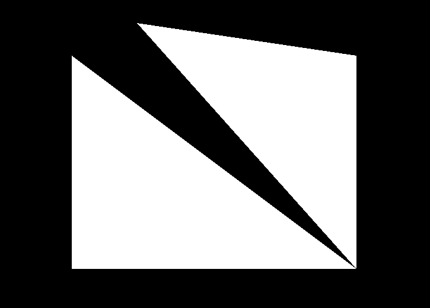

正方形直接裂开了!, 这可不对, 我们期望的是这两个三角形的顶点都一起动~

### 1.4 优化: 不存储点坐标, 存储点索引

我们希望修改一个点, 然后所有人看到的这个点都修改了. 基于`引用`的思想.

我们可以分别存储`点和三角形`, 三角形的顶点是点数组的 **索引**. 这样改一个点数组的元素, 其关联的三角形的所有点都跟着变啦~

```cpp [c14-数据结构]
struct Vertex {
    float x, y, z;
};

std::vector<Vertex> vertices = {
    {0.5, 0.5, 0},
    {0.5, -0.5, 0},
    {-0.5, 0.5, 0},
    {-0.5, -0.5, 0},
};

struct Triangle {
    std::size_t a, b, c;
};

std::vector<Triangle> triangles = {
    {0, 1, 2},
    {3, 2, 1},
};
```

```cpp [c14-完整代码]
#include <check/OpenGL.hpp> // 包括 glad/glad.h

#include <vector>

struct Vertex {
    float x, y, z;
};

std::vector<Vertex> vertices = {
    {0.5, 0.5, 0},
    {0.5, -0.5, 0},
    {-0.5, 0.5, 0},
    {-0.5, -0.5, 0},
};

struct Triangle {
    std::size_t a, b, c;
};

std::vector<Triangle> triangles = {
    {0, 1, 2},
    {3, 2, 1},
};

void show() {
    glBegin(GL_TRIANGLES);
    for (auto const& v : triangles) {
        glVertex3f(vertices[v.a].x, vertices[v.a].y, vertices[v.a].z);
        glVertex3f(vertices[v.b].x, vertices[v.b].y, vertices[v.b].z);
        glVertex3f(vertices[v.c].x, vertices[v.c].y, vertices[v.c].z);
    }
    CHECK_GL(glEnd());
}

void mouseBtnCb(GLFWwindow* win, int btn, int action, [[maybe_unused]] int mods) {
    // 判断是鼠标 && 左键按下
    if (btn == GLFW_MOUSE_BUTTON_LEFT && action == GLFW_PRESS) {
        double xpos, ypos;
        int width, height;
        glfwGetCursorPos(win, &xpos, &ypos);
        glfwGetWindowSize(win,  &width, &height);

        auto x = static_cast<float>(2 * xpos / width - 1);
        auto y = static_cast<float>(2 * (height - ypos) / height - 1);
        vertices[2] = {x, y, 0};
    }
}

int main() {
    auto* window = initOpenGL();
    log::hxLog.debug("OpenGL version: ", glGetString(GL_VERSION));

    CHECK_GL(glEnable(GL_POINT_SMOOTH));
    CHECK_GL(glEnable(GL_BLEND));
    CHECK_GL(glBlendFunc(GL_SRC_ALPHA, GL_ONE_MINUS_SRC_ALPHA));
    CHECK_GL(glPointSize(64.0f));

    glfwSetMouseButtonCallback(window, mouseBtnCb); // 设置鼠标事件回调
    while (!glfwWindowShouldClose(window)) {
        CHECK_GL(glClear(GL_COLOR_BUFFER_BIT)); // 清空画布
        show();
        glfwSwapBuffers(window); // 双缓冲
        glfwPollEvents();
    }
    return 0;
}
```

```cpp [c14-小偷懒]
void show() {
    glBegin(GL_TRIANGLES);
    for (auto const& v : triangles) {
        // 从三个参数的 glVertex3f 改成一个指针参数的 glVertex3fv. 少写点代码
        // glVertex3fv 接受一个 float * 指针作为参数, 会加载指针所指向的内存中连续的三个 float
        glVertex3fv(&vertices[v.a].x);
        glVertex3fv(&vertices[v.b].x);
        glVertex3fv(&vertices[v.c].x);
    }
    CHECK_GL(glEnd());
}
```

效果:

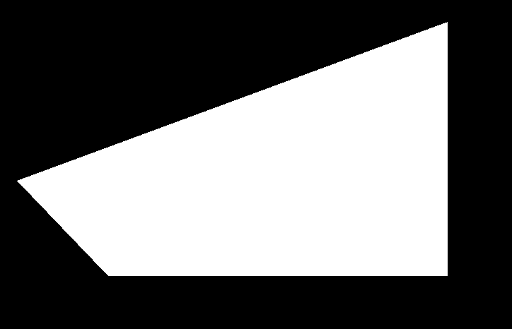

> [!NOTE]
> "不是保留顶点本身而是保留顶点的索引"--保留了索引, 就维持住了网格的 **拓扑结构**, 不同面的相邻顶点之间就不是一盘散沙, 而是紧密连接在一起~

## 二、OBJ 格式三维模型的加载与绘制
### 2.1 OBJ 是什么?

**OBJ 是一种基于纯文本的 3D 模型存储格式**

> OBJ是一种基于纯文本的3D模型存储格式, 用于存储3D模型的点、面、法线等数据。它的优点是它是一种可读性好的格式, 可以直接被文本编辑器打开和编辑, 也被多种3D软件所支持读取和写入。OBJ格式还支持引用外部MTL文件, 从而支持多种材质和纹理映射。他的文件格式相对简单, 容易读取和导出, 即使是 C 语言初学者也很容易写出他的读取器和导出器。
>
> 然而, OBJ格式的缺点是它不适合存储复杂的3D数据, 因为纯文本格式不能以最小化的方式表示这些数据, 这使得OBJ格式不适合存储需要高精度和超高面数的3D模型。此外, OBJ格式对于大型3D模型的存储也会变得非常慢和低效, 因为它需要读取和写入大量的文本数据。

### 2.2 认识 OBJ 文件格式: 顶点数据

> OBJ 文件包含很多行, 每一行都包含一个 **指令**。指令由英文字母开始, 后面跟着几个数字或字符串作为数据, 典型的是 `v 指令`, 他代表一个顶点, 后面跟着的数据是用空格分割的三个浮点数, 分别代表着顶点的 **x、y、z 坐标**。此外还有 o 指令用于指定当前对象名称, 以 # 开头行的是可选的注释, 注释不会被读取和解析。

```sh
# Blender 3.5.0
# www.blender.org
o Cube
v 1.000000 1.000000 -1.000000
v 1.000000 -1.000000 -1.000000
v 1.000000 1.000000 1.000000
```

### 2.3 顶点解析器

```cpp [c23-顶点解析器]
struct Vertex {
    float x, y, z;
};

struct Triangle {
    std::size_t a, b, c;
};

struct ObjParser {
    void parser(std::string_view path) {
        std::ifstream file{{path.data(), path.size()}};
        if (!file.is_open()) [[unlikely]] {
            log::hxLog.error("打开文件:", path, "失败!");
            throw std::runtime_error{path.data()};
        }
        std::string line;
        while (std::getline(file, line)) {
            if (line.substr(0, 2) == "v ") {
                std::istringstream s{line.substr(2)};
                Vertex v;
                s >> v.x >> v.y >> v.z;
                _vertices.push_back(std::move(v));
            }
        }

        file.close();
        log::hxLog.info("加载:", path, "完成!");
    }

private:
    std::vector<Vertex> _vertices;
};
```

```cpp [c23-完整代码]
#include <check/OpenGL.hpp>

#include <fstream>
#include <stdexcept>
#include <vector>

auto __init__ = []{
    setlocale(LC_ALL, "zh_CN.UTF-8");
    try {
        auto cwd = std::filesystem::current_path();
        log::hxLog.debug("当前工作路径是:", cwd);
        std::filesystem::current_path("../../../src/08-OpenGL");
        log::hxLog.debug("切换到路径:", std::filesystem::current_path());
    } catch (const std::filesystem::filesystem_error& e) {
        log::hxLog.error("Error:", e.what());
    }
    return 0;
}();

namespace HX {

struct Vertex {
    float x, y, z;
};

struct Triangle {
    std::size_t a, b, c;
};

struct ObjParser {
    void parser(std::string_view path) {
        std::ifstream file{{path.data(), path.size()}};
        if (!file.is_open()) [[unlikely]] {
            log::hxLog.error("打开文件:", path, "失败!");
            throw std::runtime_error{path.data()};
        }
        std::string line;
        while (std::getline(file, line)) {
            if (line.substr(0, 2) == "v ") {
                std::istringstream s{line.substr(2)};
                Vertex v;
                s >> v.x >> v.y >> v.z;
                _vertices.push_back(std::move(v));
            }
        }

        file.close();
        log::hxLog.info("加载:", path, "完成!");
    }

    auto& getVertices() const noexcept {
        return _vertices;
    }

private:
    std::vector<Vertex> _vertices;
};

} // namespace HX

void show() {
    glBegin(GL_TRIANGLES);
    static auto vertices = [] {
        ObjParser res;
        res.parser("./obj/monkey.obj");
        return res;
    }();
    for (auto const& v : vertices.getVertices())
        glVertex3f(v.x, v.y, v.z);
    CHECK_GL(glEnd());
}

int main() {
    auto* window = initOpenGL();
    log::hxLog.debug("OpenGL version: ", glGetString(GL_VERSION));

    CHECK_GL(glEnable(GL_POINT_SMOOTH));
    CHECK_GL(glEnable(GL_BLEND));
    CHECK_GL(glBlendFunc(GL_SRC_ALPHA, GL_ONE_MINUS_SRC_ALPHA));
    CHECK_GL(glPointSize(64.0f));

    while (!glfwWindowShouldClose(window)) {
        CHECK_GL(glClear(GL_COLOR_BUFFER_BIT)); // 清空画布
        show();
        glfwSwapBuffers(window); // 双缓冲
        glfwPollEvents();
    }
    return 0;
}
```

非常简单, 读取一整行(`std::getline`), 然后看看是否有 `v ` 顶点数据, 有就直接流式解析~

### 2.4 认识 OBJ 文件格式: 面数据

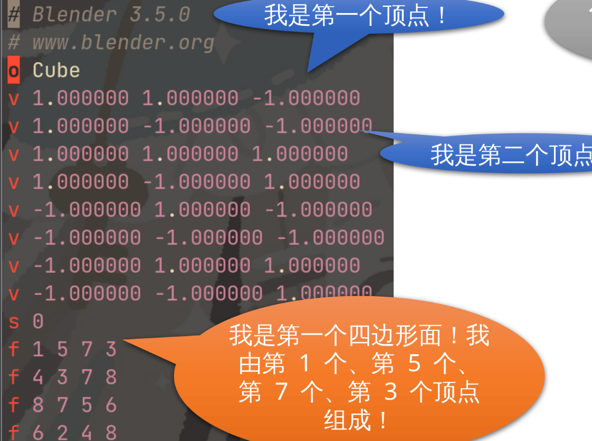

### 2.5 从 OBJ 文件格式, 看多边形网格数据结构

- vertices 是 `vector<array<float, 3>>`, 每个顶点有三个 float, 分别为 x, y, z 表示顶点坐标。

```sh
v -1.000000 1.000000 1.000000
v -1.000000 -1.000000 1.000000
v 1.000000 -1.000000 1.000000
v 1.000000 1.000000 1.000000
```

- faces 是 `vector<vector<int>>`, 每个 n 边形面, 由 n 个顶点的下标(int)构成。

```cpp
f 1 2 3 4   // 由 1、2、3、4 号顶点构成一个四边形面
f 1 2 3     // 由 1、2、3 号顶点构成一个三角形面
f 1 3 4     // 由 1、3、4 号顶点构成一个三角形面
f 1 3       // 由 1 号 和 3 号顶点连成一条线段
```

### 2.6 OBJ 格式的其他数据

OBJ 格式有时候还会包含 `法线(vn)` 和 `纹理坐标(vt)`

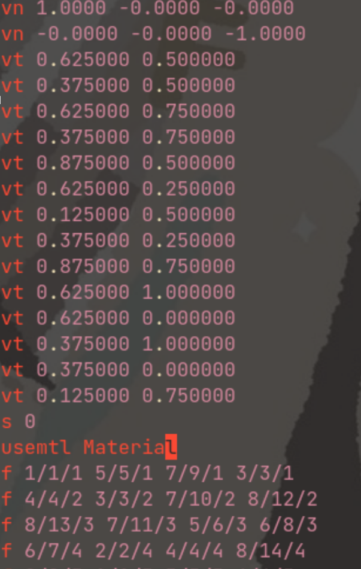

虽说我们不去解析 vn 和 vt 就可以...但可恶的是 f 指令会因此产生变化:

- 原本只有一个整数(v 编号), 会变成由斜杠分割的三个整数(分别为 v、vn、vt 的编号)

> 由于我们只想要 v 的部分, 只需要斜杠分割的第一个数就行, 例如 6/7/4 我们只需要其中的 6

```cpp [c26-解析面]
void parser(std::string_view path) {
    std::ifstream file{{path.data(), path.size()}};
    if (!file.is_open()) [[unlikely]] {
        log::hxLog.error("打开文件:", path, "失败!");
        throw std::runtime_error{path.data()};
    }
    std::string line;
    while (std::getline(file, line)) {
        auto head = line.substr(0, 2);
        if (head == "v ") {
            // 解析顶点
            std::istringstream s{line.substr(2)};
            Vertex v;
            s >> v.x >> v.y >> v.z;
            _vertices.push_back(std::move(v));
        } else if (head == "f ") {
            // 解析面
            std::istringstream s{line.substr(2)};
            std::string a, b, c; // 从 1/2/3 1/2/3 1/2/3 中, 解析出 1, 1, 1
            s >> a >> b >> c;
            Triangle t;
            std::istringstream{a} >> t.a;
            std::istringstream{b} >> t.b;
            std::istringstream{c} >> t.c;
            --t.a, --t.b, --t.c; // obj 索引是从 1 开始的, 换算到 0 开始.
            _trinales.push_back(std::move(t));
        }
    }

    file.close();
    log::hxLog.info("加载:", path, "完成!");
}
```

读取到:

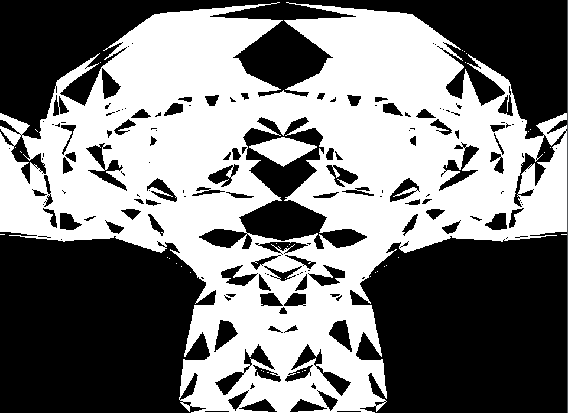

> [!TIP]
> 小彭老师说: 这个 OBJ 模型中存在四边形...而我们刚刚的代码只读取了四边形的前三个顶点, 导致显示出来的只是其中一半的三角形
>
> 由于 OpenGL 只支持渲染三角形, 不支持四边形, 我们需要在 load_obj 函数中, 检测读到的面片是否为四边形, 如果是则需要把他拆分成两个三角形。

### 2.7 任意多边形拆分成三角形的原理

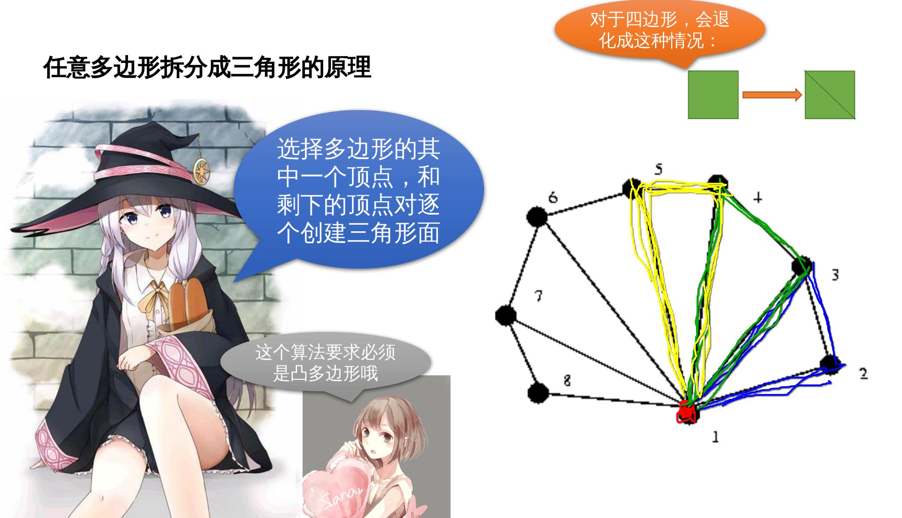

```cpp [c27-拆分任意多边形]
std::string line;
while (std::getline(file, line)) {
    auto head = line.substr(0, 2);
    if (head == "v ") {
        // 解析顶点
        std::istringstream s{line.substr(2)};
        Vertex v;
        s >> v.x >> v.y >> v.z;
        _vertices.push_back(std::move(v));
    } else if (head == "f ") {
        // 解析面
        std::istringstream s{line.substr(2)};
        std::vector<std::size_t> idx;
        while (std::getline(s, head, ' ')) {
            std::size_t i;
            std::istringstream{head} >> i;
            idx.push_back(i - 1);
        }
        for (std::size_t i = 2; i < idx.size(); ++i)
            _trinales.push_back({idx[0], idx[i], idx[i - 1]}); // 数据应该保证点之间是有顺序的
    }
}
```

效果:

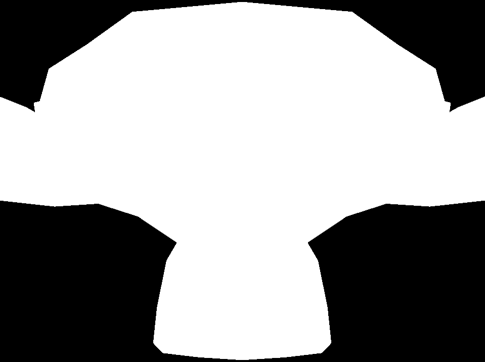

### 2.8 使用 glm 封装好的矢量代替自定义的点面类

```cpp [c28-自定义数据]
struct Vertex {
    float x, y, z;
};

struct Triangle {
    std::size_t a, b, c;
};

std::vector<Vertex> _vertices;
std::vector<Triangle> _trinales;
```

```cpp [c28-glm 封装]
#include <glm/vec3.hpp>         // vec3
#include <glm/gtc/type_ptr.hpp> // glm::value_ptr

std::vector<glm::vec3> _vertices;
std::vector<glm::uvec3> _trinales;

// 内部定义, 节选, 可以任意混用 xyz / rgb / zbp, 都是一个东西, 类似于别名:
template<typename T, qualifier Q>
struct vec<3, T, Q> {
    union { T x, r, s; };
    union { T y, g, t; };
    union { T z, b, p; };
};

// 使用 glm::value_ptr 获取指向首个元素的指针
auto& vertices = obj.getVertices();
for (auto const& v : obj.getTriangles()) {
    // glVertex3fv(&vertices[v.x].x);
    // glVertex3fv(&vertices[v.y].x);
    // glVertex3fv(&vertices[v.z].x);
    glVertex3fv(glm::value_ptr(vertices[v.x]));
    glVertex3fv(glm::value_ptr(vertices[v.y]));
    glVertex3fv(glm::value_ptr(vertices[v.z]));
}
```

### 2.9 glm 矢量库中的预定义类型一览

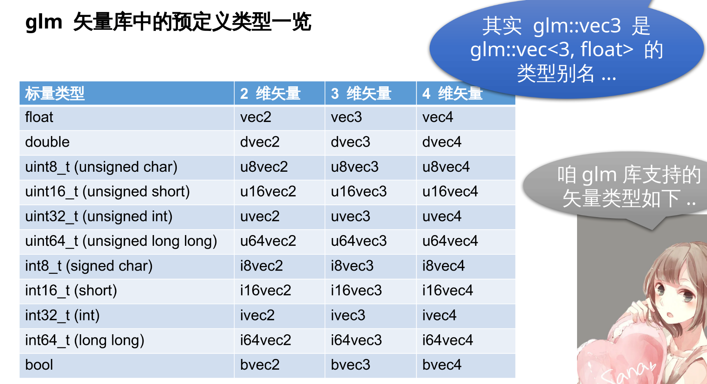

常用头文件:

```cpp vscode
#include <glm/glm.hpp>                  // 基础类型 vec/mat
#include <glm/gtc/matrix_transform.hpp> // 矩阵变换
#include <glm/gtc/type_ptr.hpp>         // value_ptr
#include <glm/gtx/quaternion.hpp>       // 四元数
```

## 三、复习 OpenGL 中的坐标系和矩阵
对象空间 ➡ 世界矩阵 ➡ 世界空间 ➡ 视角矩阵 ➡ 视角空间 ➡ 投影矩阵 ➡ 裁剪空间 ➡ 光栅化 ➡ 窗口空间

### 3.1 local to world(又称 Model 矩阵)

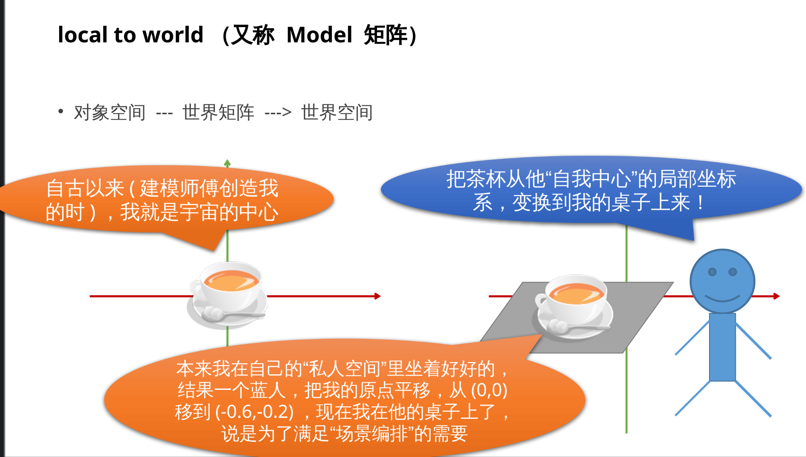

### 3.2 world to view(又称 View 矩阵)

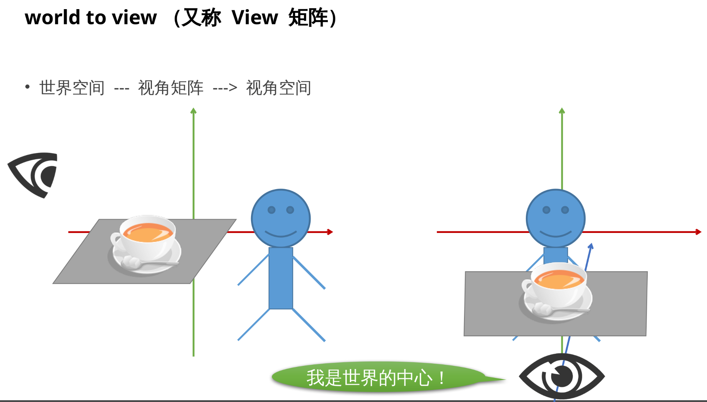

### 3.3 view to clip(又称 Projection 矩阵)

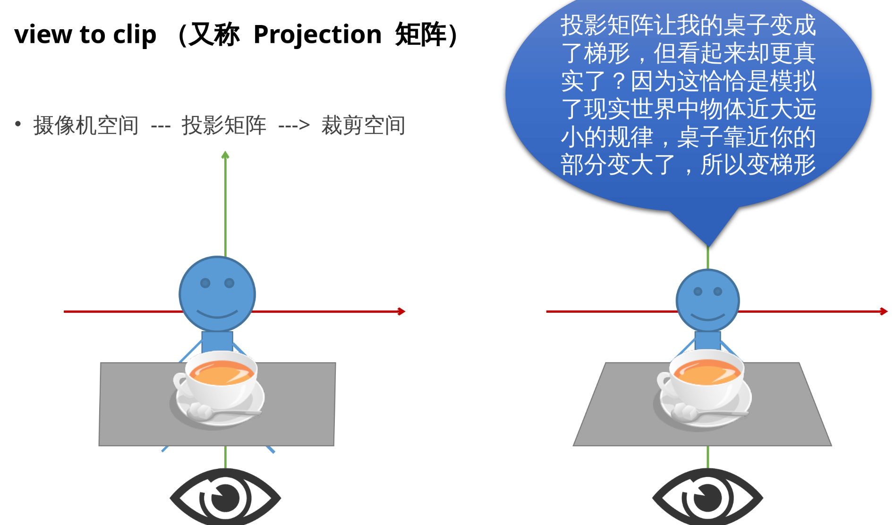

### 3.4 OpenGL 进行裁剪(clip)操作

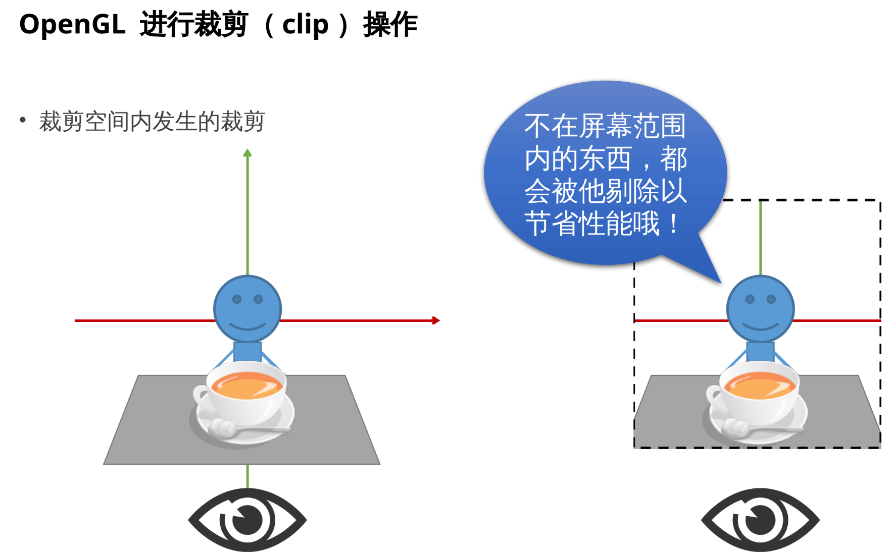

### 3.5 NDC to window

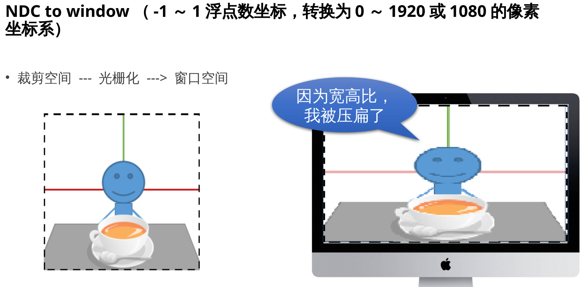

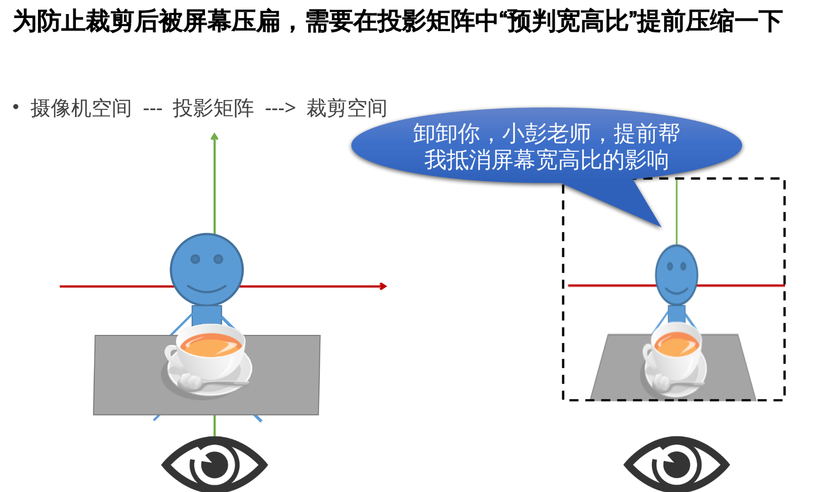

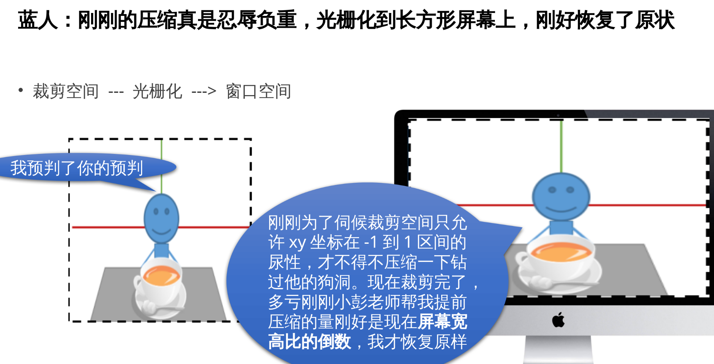

### 3.6 总结: 我们需要考虑的有 Model、View、Projection 矩阵

- **Model** 矩阵负责从对象局域坐标系(物体建模时采用的)转换到世界坐标系(场景布置)。

- **View** 矩阵负责把世界坐标系转换到摄像机为中心, 摄像机方向为 z 轴负方向的视角坐标系。

- **Projection** 矩阵负责把视角坐标系的三维坐标, 转换到带有 w 分量的齐次空间, 同时还对 z 轴进行了翻转(变左手系), 得到的四维坐标存入 OpenGL 内置的特殊变量: gl_Position。

- 最终由 OpenGL 内部取出 gl_Position 执行"Perspective Divide"操作: 将 x、y、z 分量同除以 w。此时如果刚才 Projection 矩阵把 w 设为 z, 就会产生"近大远小"的透视效果。

- 随后由 OpenGL 内部取出 x、y 坐标用于确定屏幕上像素点的位置, z 坐标用于深度测试, 并利用硬件加速的光栅化在屏幕上绘制立体图案。

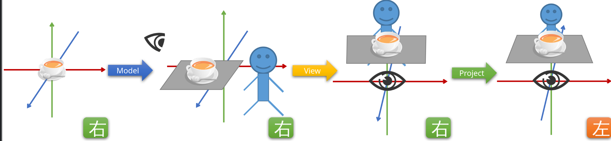

### 3.7 Model 矩阵 - 物体局部坐标系到世界坐标系

- OBJ 中的 x、y、z 坐标, 是物体局部坐标系。

- 而多个物体可能包含相同的 x、y、z 坐标, 为了让他们不要叠在一起, 每个物体都有一个 Model 矩阵, 负责把该物体的局部坐标转换为世界坐标。

- Model 矩阵通常包含: 缩放、旋转、平移三部分, 乘法时顺序相反: $M = TRS$。

- `平移`部分 $T$ 控制着物体的`位置`, 可以由 `glm::translate(glm::vec3(x, y, z))` 创建;

- `旋转`部分 $R$ 控制着物体的`朝向`, 可以由 `glm::rotate(angle_radians, axis)` 创建;

- `缩放`部分 $S$ 控制着物体的`大小`, 可以由 `glm::scale(glm::vec3(sx, sy, sz))` 创建。

- Model 矩阵是一个**协变矩阵**, 负责把三维坐标从局部坐标系转换到世界坐标系。

- Model 矩阵是 4x4 的齐次矩阵, 其 $w$ 分量用于乘以平移的偏移量, 当需要把 Model 矩阵作用于绝对矢量(**位置**)时, 请令 $w$ 为 1; 当作用于相对矢量(例如**速度**)时, $w$ 应为 0。

- 当作用于法线时, 需要乘以的不是 Model 而是 Model 中 3x3 部分的逆转置: $(M^{-1})^T$。

- 对于附着在物体上与空间无关的属性, 如**纹理 UV**, 则不用乘 Model 矩阵, 保持不变即可。

### 3.8 `glm::translate` 这些函数的一个坑点

实际上他们不支持 `glm::translate(glm::vec3(x, y, z))` 这样写。

要 `glm::translate(glm::mat4x4(1), glm::vec3(x, y, z))` 这样写。

因为 glm 的作者为了所谓的"便民", 给 `glm::translate` 强制加上了第一个参数。

然后 `glm::translate` 不是直接返回他得到的平移矩阵, 而是返回这个平移矩阵从左边乘以那该死的第一个参数后的结果, 他们就觉得这样很"便民",

例如:

```cpp
model = model * glm::translate(glm::vec3(x, y, z));
model = glm::translate(model, glm::vec3(x, y, z));
```

以上两种写法等价。

### 3.9 Blender 直观演示

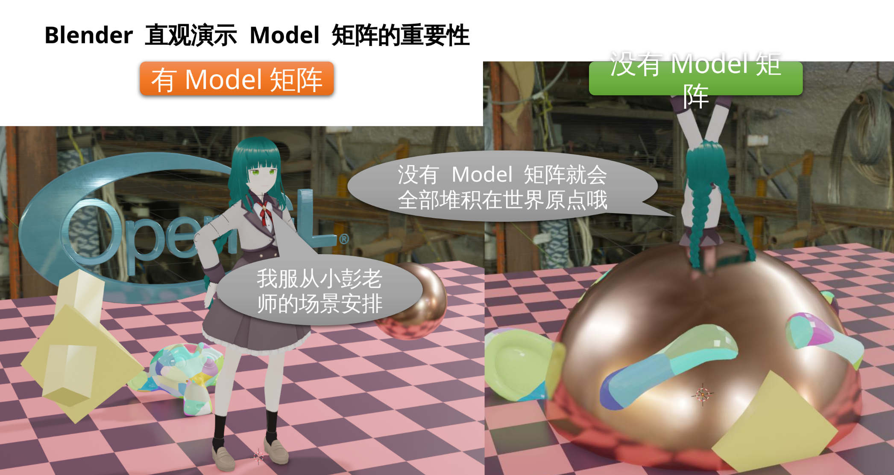

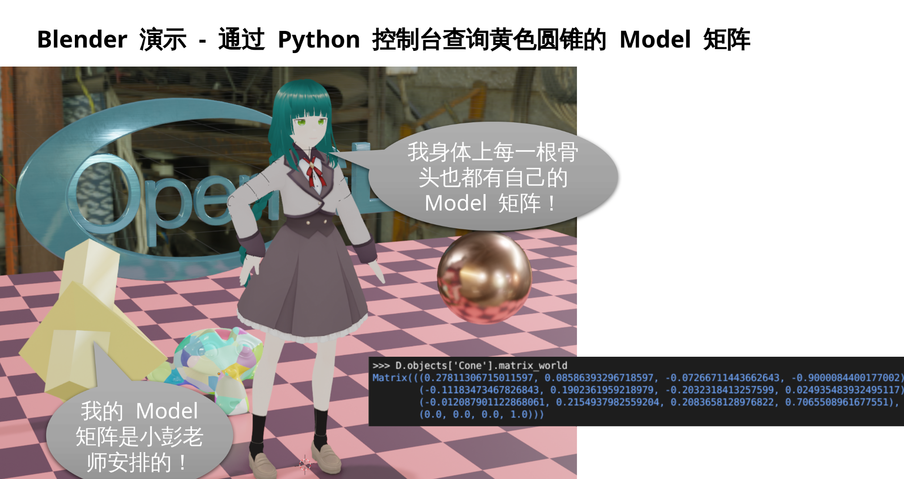

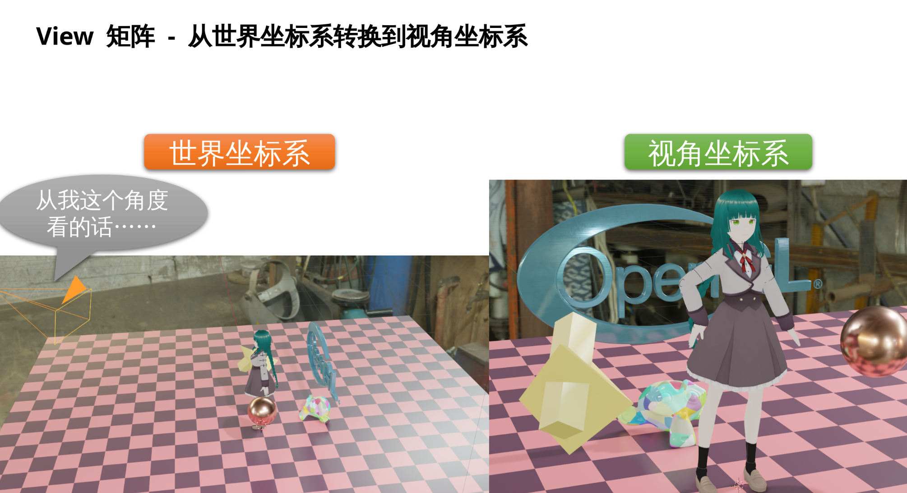

### 3.10 View 矩阵 - 使用 `glm::lookAt` 函数创建

`glm::lookAt(eye, center, up)`

接受三个矢量作为参数:
- `eye` - 眼睛所在位置(绝对点)
- `center` - 所观察物体位置(绝对点)通常为 `(0, 0, 0)`
- `up` - 上方向(相对方向)通常为 `(0, 1, 0)`
- 返回 `glm::mat4x4` 表示 View 矩阵

View 矩阵实际上是眼睛本身 Model 矩阵的逆:
- View 矩阵 - 世界到眼睛
- 眼睛本身的 Model 矩阵 - 眼睛到世界

当场景中已经有个眼睛的模型时, 就可用他的 Model 矩阵求逆得到 View

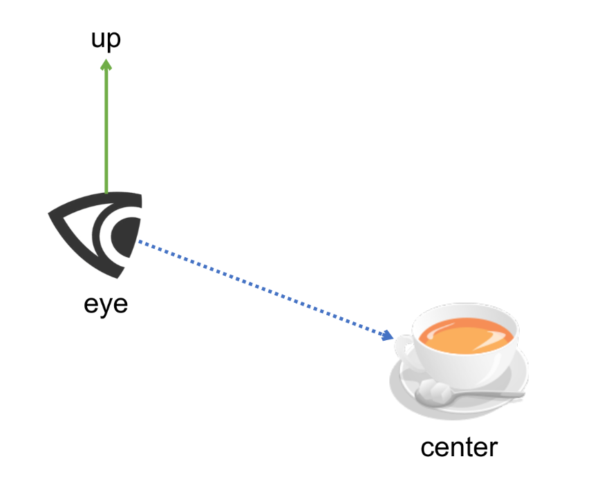

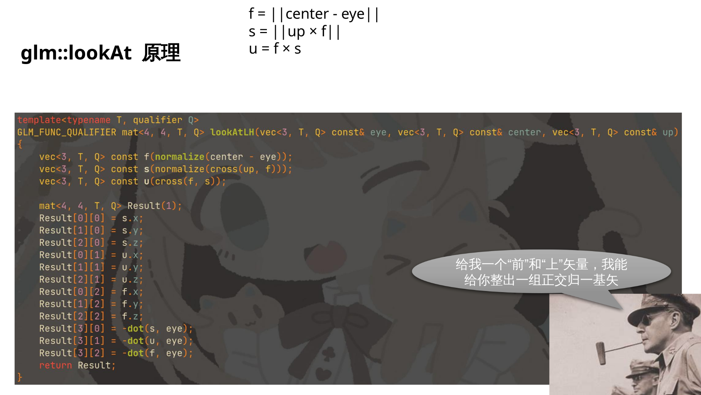

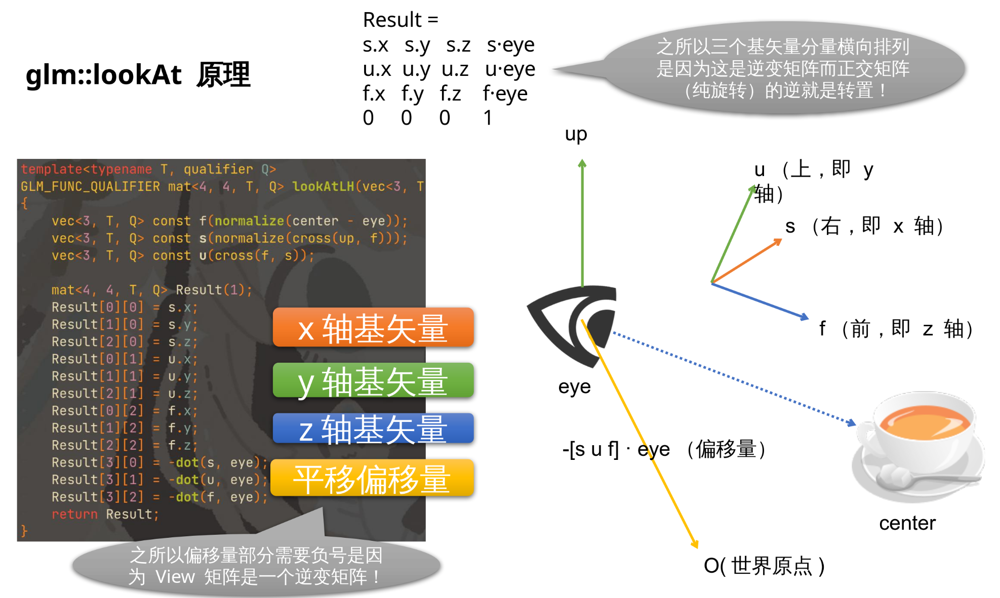

`glm::lookAt` 用法:

```cpp
auto eye = glm::vec3(0, 0, 5);            // 眼睛位于 z 轴正方向 5 米处
auto center = glm::vec3(0, 0, 0);         // 眼睛所看着的目标物体位于原点
auto up = glm::vec3(0, 1, 0);             // 头顶朝向为 y 轴正方向
auto view = glm::lookAt(eye, center, up); // 创建 View 矩阵
```

> [!TIP]
> 这就是从世界坐标系转换到我视角坐标系的 View 矩阵哦

## 四、投影矩阵与透视原理
### 4.1 Projection 矩阵 - 调用 `glm::ortho` 函数创建正交投影

`glm::ortho(left, right, bottom, top, zNear, zFar)`

> 构造一个长方体, 长方体内为可视空间, 长方体外的物体会被 OpenGL 裁剪掉。
>
> 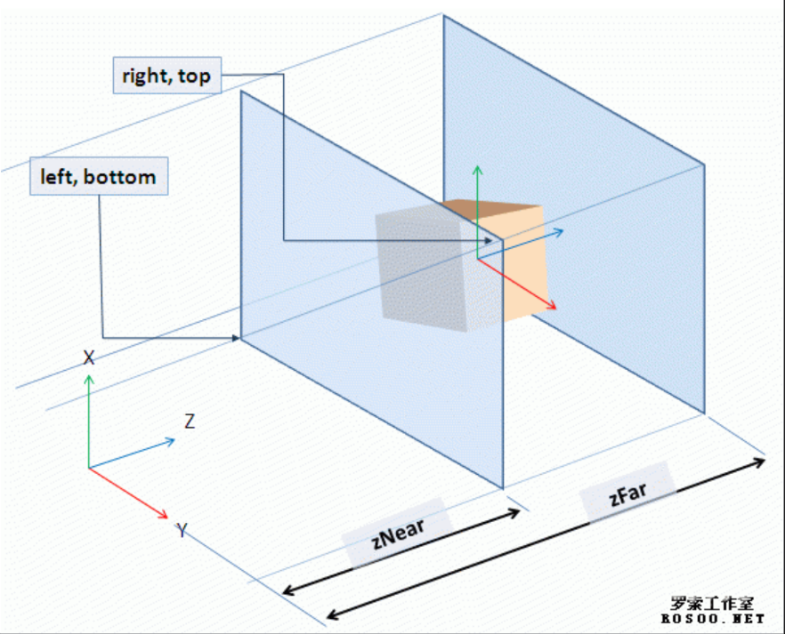
>
> 接受六个浮点数作为参数:
> - `left` - 立方体左侧面的 x 坐标, 视角坐标系
> - `right` - 立方体右侧面的 x 坐标, 视角坐标系
> - `bottom` - 立方体底面的 y 坐标, 视角坐标系
> - `top` - 立方体顶面的 y 坐标, 视角坐标系
> - `zNear` - 立方体最近处离人眼的距离, 即前侧面 z 坐标
> - `zFar` - 立方体最远处离人眼的距离, 即后侧面 z 坐标
>
> 用法举例:
> `glm::ortho(-2.0f, 2.0f, -2.0f, 2.0f, 0.0f, 100.0f);`

### 4.2 正交投影的优缺点

正交投影是指将三维空间中的物体投影到一个二维平面上, 使得投影结果保持物体在空间中的形状和尺寸的一种投影方式。

优点:
- 保持物体形状和尺寸: 正交投影不会产生透视效果, 因此可以保持物体在空间中的形状和尺寸, 更适用于需要准确展示物体的尺寸和比例的情况, 原来是正方形的在屏幕上还是正方形, 原来相等的边也是相等的, 例如制图和工业软件中就常用正交投影。
- 简单直观: 正交投影是一种简单直观的投影方式, 将物体垂直投影到平面上, 可以清晰展示物体的外形和结构, 便于观察和分析。
- 易于计算和绘制: 正交投影的计算相对简单, 只需通过平行投影将三维物体的顶点坐标投影到二维平面即可, 对于在 z 方向上的投影, 则取出 x、y 坐标分量只需要即可。同时, 绘制投影图形也比较容易, 只需绘制投影线即可。

缺点:
- 缺乏透视感: 由于正交投影不考虑透视效果, 所以在投影结果中没有远近的区别, 缺乏立体感和深度感, 不适用于需要展示物体远近距离关系的情况。
- 信息损失: 由于正交投影将三维物体投影到二维平面上, 会导致一些信息的损失。例如, 物体的侧面和遮挡部分在投影中通常不可见, 只有物体的外轮廓可见, 这可能导致一些细节的丢失。
- 不适用于特定应用场景: 正交投影适用于一些需要准确展示物体形状和尺寸的场景, 但对于需要展示物体的透视效果或者真实感的场景, 正交投影就不是很合适。例如绘画、建筑设计、室内设计、电影、游戏等领域通常需要使用透视投影来更好地表达三维空间与物体的关系。

现实中没有摄像机能达到真正的正交投影(否则你可以用他来看清月球表面的一只蚊子)。

包括人眼在内, 都服从透视投影, 正交投影的画面会非常难以理解, 他仿佛是从无限远处观察的。

### 4.3 透视投影的规则: 近大远小

透视投影是一种艺术技巧, 旨在通过模拟真实视觉效果, 使物体在画面中看起来有深度和立体感。其中的一个重要规则是 **近大远小**。

> 近大远小是指在透视投影中, 离观察者较近的物体看起来较大, 而离观察者较远的物体则看起来较小。这是因为在真实世界中, 当物体离我们更远时, 它们的视角会变小, 表现为物体在视场中的大小缩小。这种现象在透视投影中被模拟出来, 以使画面更加真实。
>
> 在绘画或设计中, 近大远小的运用可以使画面更加有深度和逼真感。通过正确地运用透视规则, 绘画师可以使观众感受到画面中物体的远近关系, 增强观看体验。为了实现近大远小的效果, 画家需要根据物体在透视中的位置和距离, 合理地调整它们的大小。
>
> 除此之外, 近大远小的规则还适用于建筑设计和摄影等领域。在建筑设计中, 远处的建筑物可以更小, 而近处的建筑物可以更大, 以真实地再现空间的深度。在摄影中, 通过调整焦距和光圈大小等参数, 可以模拟出近大远小的效果。
>
> 总之, 透视投影的规则之一是近大远小。通过正确运用这一规则, 艺术家可以创造出逼真的视觉效果, 使观众能够感受到画面中物体的远近关系, 增强观赏体验。

### 4.4 Blender 演示 - 正交投影 vs 透视投影

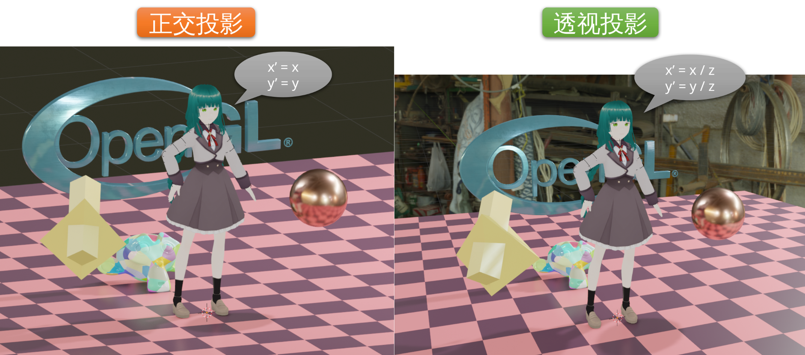

### 4.5 Projection 矩阵 - 调用 `glm::frustum` 函数创建透视投影

`glm::frustum(left, right, bottom, top, zNear, zFar)`

> 构造一个锥台(梯形), 锥台内为可视空间, 锥台外的物体会被 OpenGL 裁剪掉。
>
> 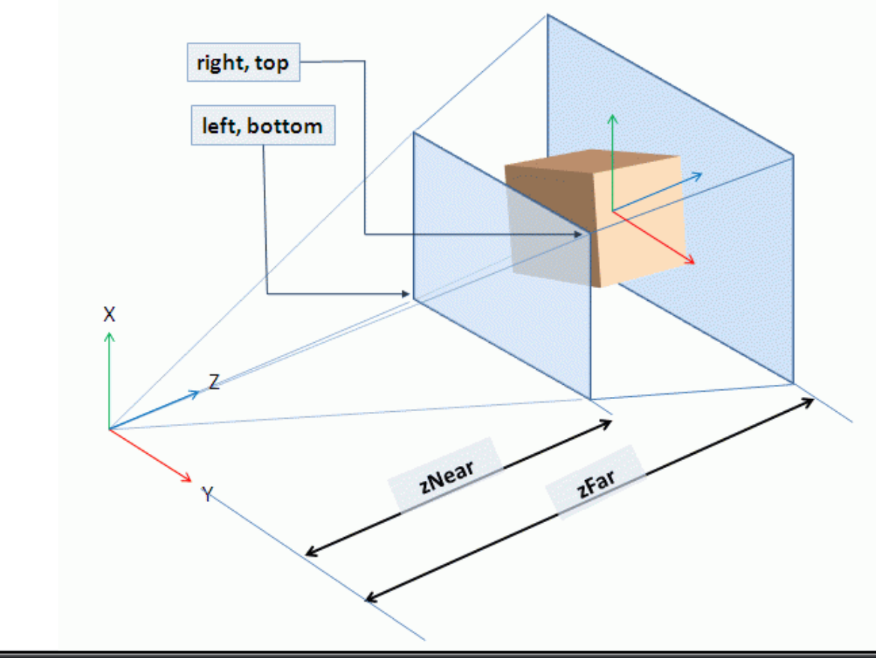
>
> 接受六个浮点数作为参数:
> - `left` - 锥台前侧面左边的 x 坐标, 视角坐标系
> - `right` - 锥台前侧面右边的 x 坐标, 视角坐标系
> - `bottom` - 锥台前侧面底边的 y 坐标, 视角坐标系
> - `top` - 锥台前侧面顶边的 y 坐标, 视角坐标系
> - `zNear` - 锥台最近处离人眼的距离, 即前侧面 z 坐标
> - `zFar` - 锥台最远处离人眼的距离, 即后侧面 z 坐标
>
> 用法举例:
>
> `glm::frustum(-0.005f, 0.005f, -0.005f, 0.005f, 0.01f, 100.0f);`

> [!TIP]
> 锥台(frustum)又称平截头体, 是梯形的三维版本

### 4.6 锥台形的可视空间为什么就能产生"近大远小"的透视效果?


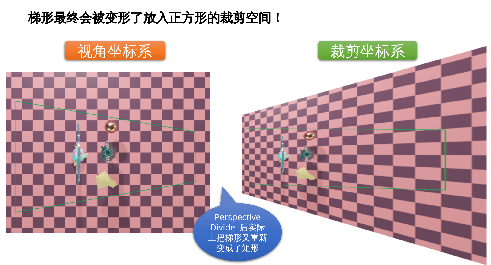

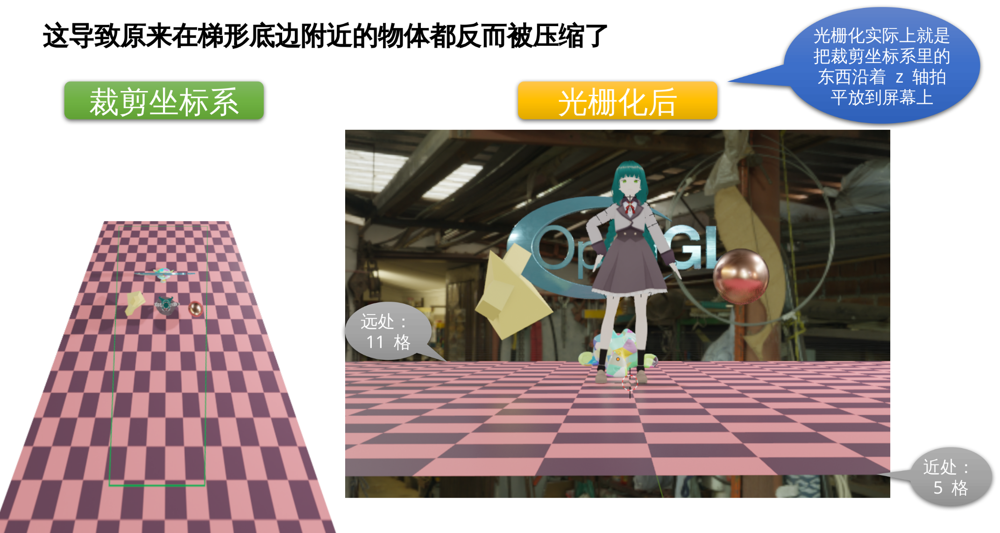

### 4.7 FoV(Field of View, 视野角)

将 `glm::frustum` 得到的梯形可视空间, 两边延伸, 相交的点就是我们的眼睛。这两条直线所交成的夹角, 就是`视野角`。

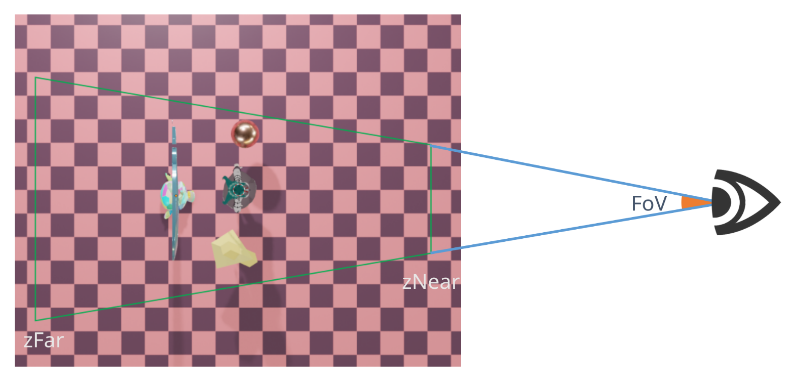

视野角越大, 说明视角越开阔, 一个屏幕里能容纳的景物就越多, 单个物体显得越小, 透视效果就越明显。视野角为 0 度时, 透视投影将退化为正交投影。

望远镜就是通过缩小视野角, 增加了小景物的视大小; 猫眼就是通过放大视野角, 压缩景物, 增加了你能看到的视野范围。

### 4.8 横向视野角(FoVx)与纵向视野角(FoVy)

由于屏幕往往不是正方形的, 因此说视野角时, 需要说明是横向(x轴方向)的还是纵向(y轴方向)的视野角。

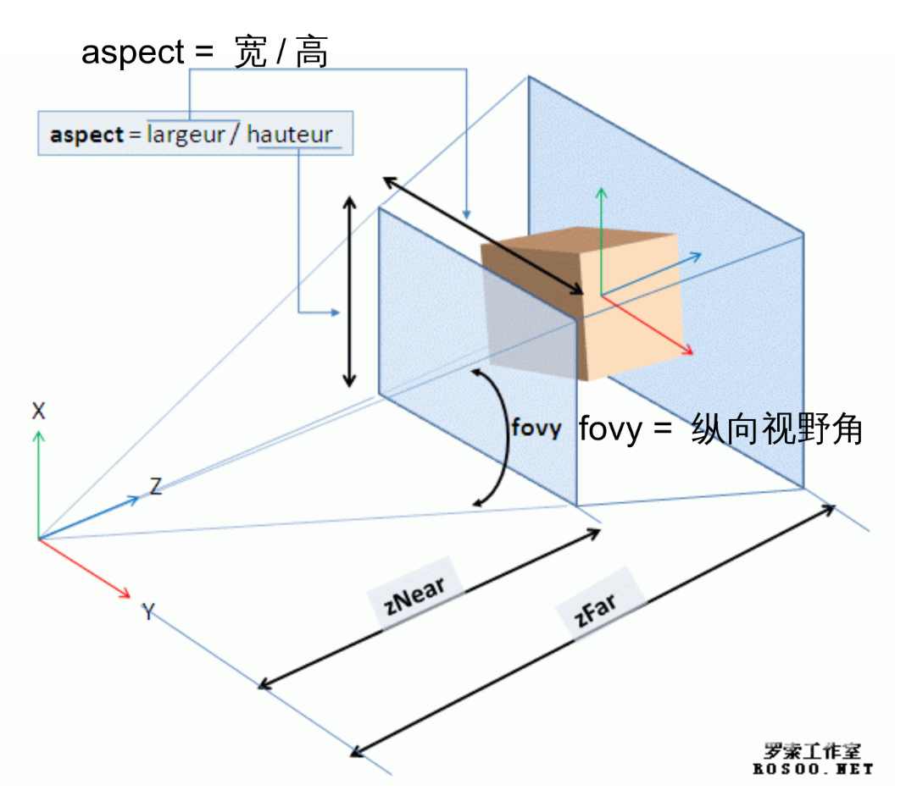

> 例如对于常见的宽大于高的屏幕, 其横向视野角就会比纵向视野角大一些, 例如对于 16: 9 的屏幕而言, 会大 16 / 9 倍。

### 4.9 FoV 的计算公式

如何确定对人眼舒适的视野角? 虽然人眼能看到 180 度, 但你不可能眼睛贴在屏幕上看。为了让显示器显示出来图形的透视, 和你实际感受到的透视匹配, 我们需要根据你眼睛离显示器的距离 $d$ 和显示器高度 $h$ 来计算。

$$
FoV_y = 2 \arctan{\frac{h}{2 \times d}}
$$

如果人眼观察距离与计算机中渲染所用的视野角不匹配, 那么就会看起来不舒服, 透视显得不真实(过度透视或缺少透视).

> 例如小彭老师显示器宽 60 厘米, 高 33.75 厘米。小彭老师眼睛到显示器距离为 50 厘米, 那么他所需的视野角是:
>
> $FoV_y = 2 \arctan \frac{33.75}{2 \times 50} = 37 度$
>
> 反之如果你所玩游戏的 FoV 是固定不让改的, 那么你可以用这个公式从纵向视野角反推你离屏幕所需的舒适距离:
>
> $d = \frac{h}{2 \times \tan \frac{FoV_y}{2}}$
>
> 例如代入纵向视野角为 40 度时, 我要离屏幕 46.4 厘米远。

### 4.10 常见的 FoVy 取值是 30～40 度

由于不同设备的宽高比不一, 纵向视野和横向视野角度会有所不同, 图形学中常用纵向视野角来表示视野大小。综合考虑一般人的用眼习惯, 游戏中的摄影机纵向视野角都会选择在 35 度左右。

然后横向视野角(FoVx)等于把纵向视野角(FoVy)乘以宽高比(aspect):

$$
FoV_x = FoV_y \times aspect
$$

宽高比就是屏幕宽度除以高度的比值:

$$
aspect = \frac{w}{h}
$$

电脑显示屏常见的宽高比都是 16 / 9 = 1.7777。

### 4.11 Projection 矩阵 - 调用 `glm::perspective` 函数创建透视投影

由于 `glm::frustum` 的六个参数计算比较困难且不直观, 因此又提供了 `glm::perspective` 这个更加直观易懂的函数, 他是对 `glm::frustum` 的封装, 基于视野角和宽高比来求得透视矩阵而不是不直观的顶面矩形 x、y 坐标。

`glm::perspective(fovy, aspect, zNear, zFar);`

> 构造一个锥台(梯形), 锥台内为可视空间, 锥台外的物体会被 OpenGL 裁剪掉。
>
> 接受四个浮点数参数:
> - `fovy` - 纵向视野角
> - `aspect` - 宽高比 = 显示器的宽 / 显示器的高
> - `zNear` - 锥台最近处离人眼的距离, 即前侧面 z 坐标
> - `zFar` - 锥台最远处离人眼的距离, 即后侧面 z 坐标
>
> 注: `zNear` 和 `zFar` 必须均为正数

代码示例:

```cpp
int width, height;
glfwGetWindowSize(window, &width, &height);
// 40 度是我们的纵向视野角 FoVy, 为了转换成 glm 函数高贵的弧度制, 需要调用 glm::radians 转换
glm::perspective(glm::radians(40.0f), (float)width / height, 0.01f, 100.0f);
// 0.01f 和 100.0f 分别是 zNear 和 zFar 参数, 表示最靠近能看到的物体和最远能看到的物体!
```

> [!NOTE]
> zNear 不可以为 0, zFar 也不可以一味调大
>
> zNear 到 zFar 之间有很多级, 每一级都是等比例划分的, 近处的分级更密集, 精度更高, 远处的精度就会变差一些。如果两个物体落在同一级上的话 OpenGL 就无法分清他们的前后顺序, 就会发生 Z-fighting 现象。
>
> 如果 zNear 和 zFar 的数量级相差太大, 那么深度缓冲的精度就会受损, 导致 Z-fighting 现象更容易发生。
>
> 通常来说我们可以用 $\log(zFar / zNear)$ 来判断深度缓冲的精度, 这个数值越大说明精度越差。

### 4.12 深度缓冲精度示意图

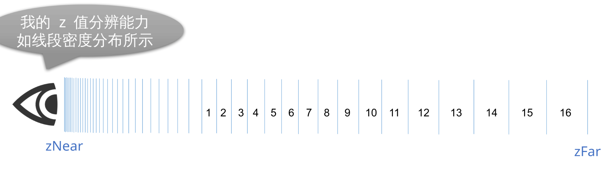

> 每两个线段之间为一档, 每档对应一个 int24 的整数值

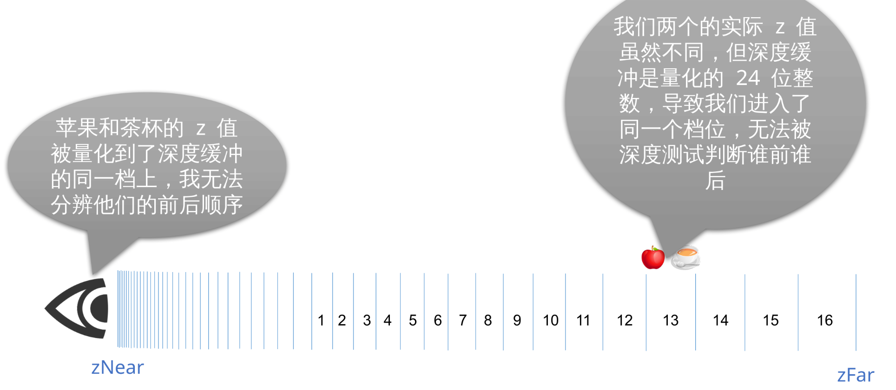

### 4.13 Z-fighting 实例图

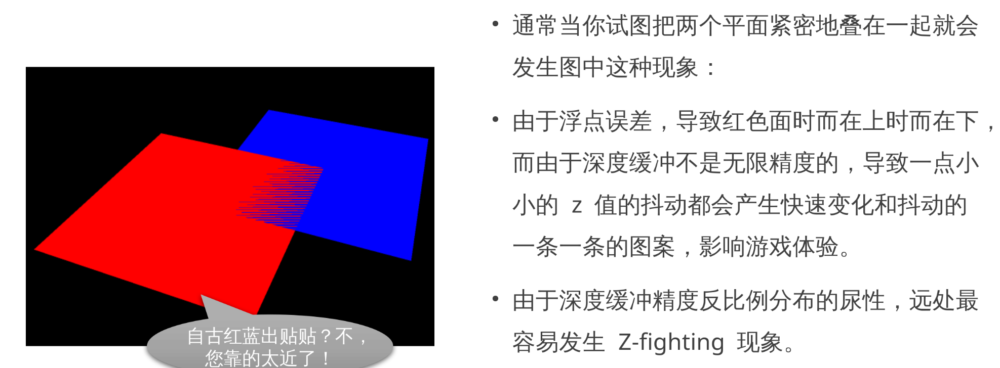

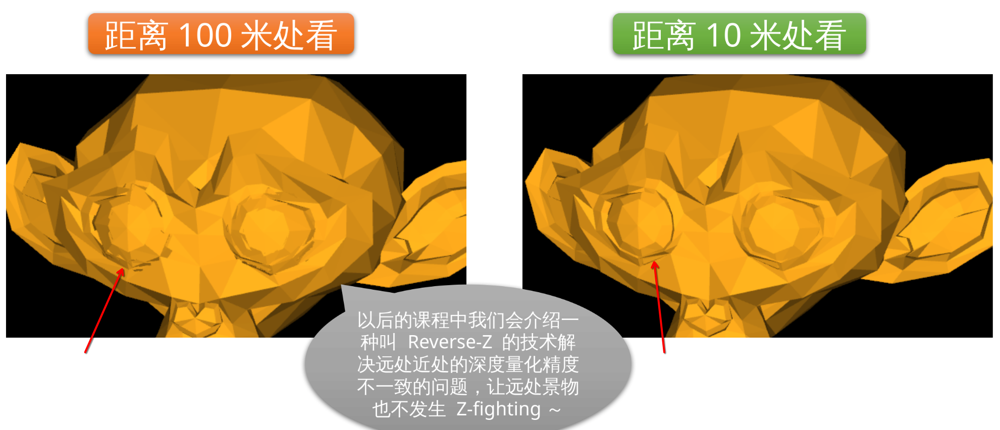

### 4.14 矩阵实现透视投影的原理: 除以 w 大法好

回顾上一课, 矩阵为什么要 4x4?

为什么针对三维矢量的变换, 矩阵却是四维的呢?
- 原因之一就是为了伺候平移, 普通的 3x3 矩阵无法实现坐标原点的平移。
- 当要变换的三维矢量是绝对矢量时, 加上 w 分量, 为 1, 就可以让绝对矢量叠加上平移量。
- 当要变换的三维矢量是相对矢量时, 加上 w 分量, 为 0, 就可以让相对矢量不受平移影响。

对于透视投影, w 有了额外的作用。
- 规定所有绝对矢量, 从四维空间转换回三维空间时, 需要把他的所有 x、y、z 坐标除以 w 分量, 得到三维坐标。这就是 Perspective Divide(透视除法)。
- 新坐标: (x / w, y / w, z / w)
- 对于 w 为 1 的情况, 则无事发生, x、y、z 原封不动保留了。
- 如果令 w 为 z 呢?
- 新坐标: (x / z, y / z, 1)
- 他的 z 坐标, 因为 z / z 变成 1 了! 这可不行, 我们还指望着 z 分量用于深度测试呢! z 值全部变成 1 了, 就没法分清物体前后顺序了。

通过塞偏移量修复 z 轴的退化

```bash
1 0 0 0
0 1 0 0
0 0 1 1 # <-- 这里
0 0 1 0
```

所以为了防止 z 轴退化, 需要在令 w 为 z 的同时, 令新 z 加上一个偏移量:
- 新坐标: (x / z, y / z, (z + 1) / z)
- 化简后: (x / z, y / z, 1 / z + 1)

但是这样最终新坐标 z’ 的值域变成 1 到无穷大了。

而 24 位有符号整数量化的深度缓冲, 只能接受 z 值为 -1 到 1 的区间, 才能正确地处理前后关系, 超出这个区间就会被 OpenGL 裁剪而不显示。

所以需要"精心"调节 zz、zw 和 wz 这三个参数才能使得规定的 zNear 到 zFar 刚好满满当当映射到整个 -1 到 1 区间。

现实中调用 `glm::perspective(near, far, fovy, aspect)` 会得到的矩阵:

以下就是 glm 作者"精心"调整后的结果:

```latex
P =
\begin{bmatrix}
\frac{1}{\mathrm{aspect}\cdot \tan(\mathrm{fovy}/2)} & 0 & 0 & 0\\
0 & \frac{1}{\tan(\mathrm{fovy}/2)} & 0 & 0\\
0 & 0 & -\frac{\,\mathrm{far}+\mathrm{near}\,}{\,\mathrm{far}-\mathrm{near}\,} & -1\\
0 & 0 & -\frac{2\,\mathrm{far}\,\mathrm{near}}{\,\mathrm{far}-\mathrm{near}\,} & 0
\end{bmatrix}
```

加上这么一堆系数后, 就可以保证 `z = near` 会被映射到 `z’ = -1`; `z = far` 会被映射到 `z’ = 1`。然后又由于深度缓冲是 24 位的整数, 所以浮点的裁剪空间 z 值 -1 量化后变成 $-2^{23}$, 1 量化变成 $2^{23}-1$。

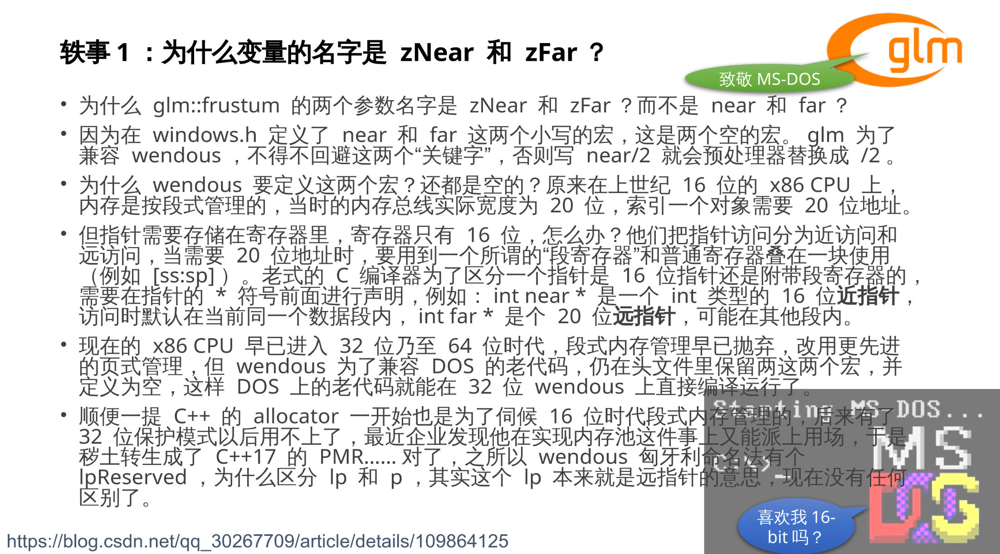

### 4.15 焦距与FoV

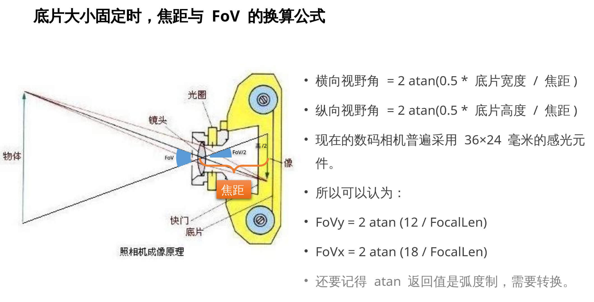

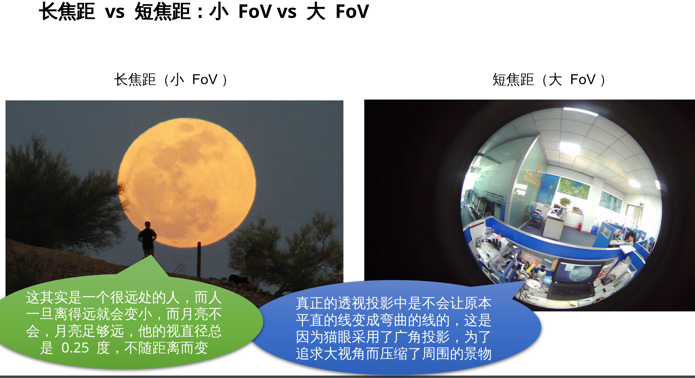

### 4.16 变焦应用经典案例: 希区柯克变焦

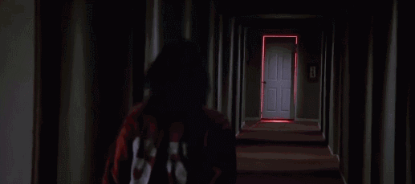

缩小焦距, 这会增大 FoV, 让拍摄目标看起来变得更小。

同时缩小离要拍摄目标的距离, 这会让拍摄目标看起来变得更大。

如果距离和焦距缩小的速度相等, 就会相互抵消, 让拍摄目标视大小不变的情况下, 让周围景物的透视强度发生快速变化, 产生悬疑, 惊悚, 或是强调拍摄目标的效果。

## 五、矩阵与法线在固定管线中的使用
### 5.1 第四节的代码实现

```cpp
// Perspective Divide - 除以 w 的实现
glm::vec3 perspective_divide(glm::vec4 pos) {
    return {pos.x / pos.w, pos.y / pos.w, pos.z / pos.w};
}

void show(GLFWwindow* window) {
    glBegin(GL_TRIANGLES);
    static auto obj = [] {
        ObjParser res;
        res.parser("./obj/monkey.obj");
        return res;
    }();
    int w, h;
    glfwGetWindowSize(window, &w, &h);
    // 透视投影矩阵
    glm::mat4x4 perspective = glm::perspective(glm::radians(40.0f), (float)w / (float)h, 0.01f, 100.f);

    // 视角 (相机位置、目标、上方向)
    glm::vec3 eye{0, 0, 5};
    glm::vec3 center{0, 0, 0};
    glm::vec3 up{0, 1, 0};
    // 视角矩阵
    glm::mat4x4 view = glm::lookAt(eye, center, up);

    // 世界矩阵 (这里是单位变换)
    glm::mat4x4 model{1};

    // MVP 组合: 局部顶点 -> 世界 -> 相机 -> 裁剪空间
    glm::mat4x4 mvp = perspective * view * model;

    auto& vertices = obj.getVertices();
    for (auto const& v : obj.getTriangles()) {
        auto a = vertices[v.x], b = vertices[v.y], c = vertices[v.z];
        // 计算裁剪空间坐标后做透视除法得到 NDC, 再送给固定管线绘制
        glVertex3fv(glm::value_ptr(
            perspective_divide(mvp * glm::vec4(a, 1))));
        glVertex3fv(glm::value_ptr(
            perspective_divide(mvp * glm::vec4(b, 1))));
        glVertex3fv(glm::value_ptr(
            perspective_divide(mvp * glm::vec4(c, 1))));
    }
    CHECK_GL(glEnd());
}
```

运行效果:

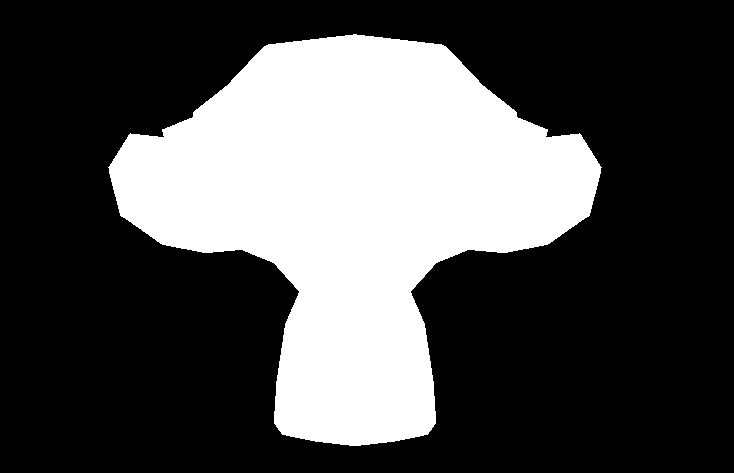

### 5.2 升级我们的数据结构 - 支持法线和纹理坐标(暂时只用到法线)

```cpp [c52-之前的数据结构]
std::vector<glm::vec3> _vertices;  // 点
std::vector<glm::uvec3> _trinales; // 三角形 -> 点索引
```

```cpp [c52-新的数据结构]
std::vector<glm::vec3> _vertices; // 点
std::vector<glm::vec2> _uvs;      // 纹理
std::vector<glm::vec3> _normals;  // 法线
std::vector<glm::umat3x3> _faces; // 面
```

同时也要修改解析代码:

```cpp [c522-解析代码]
#include <glm/vec3.hpp>
#include <glm/matrix.hpp>
#include <glm/ext/matrix_uint3x3.hpp>
#include <glm/gtc/type_ptr.hpp>

struct ObjParser {
    void parser(std::string_view path) {
        std::ifstream file{{path.data(), path.size()}};
        if (!file.is_open()) [[unlikely]] {
            log::hxLog.error("打开文件:", path, "失败!");
            throw std::runtime_error{path.data()};
        }
        std::string line;
        while (std::getline(file, line)) {
            if (line.substr(0, 2) == "v ") {
                // 解析顶点
                std::istringstream s{line.substr(2)};
                glm::vec3 v;
                s >> v.x >> v.y >> v.z;
                _vertices.push_back(std::move(v));
            } else if (line.substr(0, 3) == "vt ") { // 纹理
                std::istringstream s{line.substr(3)};
                glm::vec2 v;
                s >> v.x >> v.y;
                _uvs.push_back(std::move(v));
            } else if (line.substr(0, 3) == "vn ") { // 法线
                std::istringstream s{line.substr(3)};
                glm::vec3 v;
                s >> v.x >> v.y >> v.z;
                _normals.push_back(glm::normalize(v));
            } else if (line.substr(0, 2) == "f ") {
                // 解析面
                std::istringstream s{line.substr(2)};
                std::vector<glm::uvec3> idxArr;
                std::string tmp;
                while (std::getline(s, tmp, ' ')) {
                    std::string numStream;
                    std::istringstream ss{std::move(tmp)};
                    glm::uvec3 idx{1};
                    int i = 0;
                    while (std::getline(ss, numStream, '/') && i < 3) {
                        std::istringstream{numStream} >> idx[i++];
                    }
                    idxArr.push_back(idx - 1u);
                }
                for (std::size_t i = 2; i < idxArr.size(); ++i)
                    _faces.push_back({idxArr[0], idxArr[i], idxArr[i - 1]});
            }
        }

        file.close();
        log::hxLog.info("加载:", path, "完成!");
    }
private:
    std::vector<glm::vec3> _vertices; // 点
    std::vector<glm::vec2> _uvs;      // 纹理
    std::vector<glm::vec3> _normals;  // 法线
    std::vector<glm::umat3x3> _faces; // 面
};
```

```cpp [c522-渲染代码]
glm::vec3 perspective_divide(glm::vec4 pos) {
    return {pos.x / pos.w, pos.y / pos.w, pos.z / pos.w};
}

void show(GLFWwindow* window) {
    glBegin(GL_TRIANGLES);
    static auto obj = [] {
        ObjParser res;
        res.parser("./obj/monkey.obj");
        return res;
    }();
    int w, h;
    glfwGetWindowSize(window, &w, &h);
    glm::mat4x4 perspective = glm::perspective(glm::radians(40.0f), (float)w / (float)h, 0.01f, 100.f);

    // 视角
    glm::vec3 eye{0, 0, 5};
    glm::vec3 center{0, 0, 0};
    glm::vec3 up{0, 1, 0};
    glm::mat4x4 view = glm::lookAt(eye, center, up);

    glm::mat4x4 model{1};

    auto& vertices = obj.getVertices();
    auto& uvs = obj.getUvs();
    auto& normals = obj.getNormals();
    for (auto const& v : obj.getFaces()) {
        auto v_x = vertices[v[0][0]],
             v_y = vertices[v[1][0]],
             v_z = vertices[v[2][0]];
        [[maybe_unused]] auto vt_x = uvs[v[0][1]],
             vt_y = uvs[v[1][1]],
             vt_z = uvs[v[2][1]];
        [[maybe_unused]] auto vn_x = normals[v[0][2]],
             vn_y = normals[v[1][2]],
             vn_z = normals[v[2][2]];
        glNormal3fv(glm::value_ptr(glm::transpose(glm::inverse(glm::mat3x3{view * model})) * vn_x));
        glVertex3fv(glm::value_ptr(
            perspective_divide(perspective * view * model * glm::vec4(v_x, 1))));
        glTexCoord2fv(glm::value_ptr(vt_x));
        glVertex3fv(glm::value_ptr(
            perspective_divide(perspective * view * model * glm::vec4(v_y, 1))));
        glTexCoord2fv(glm::value_ptr(vt_y));
        glVertex3fv(glm::value_ptr(
            perspective_divide(perspective * view * model * glm::vec4(v_z, 1))));
        glTexCoord2fv(glm::value_ptr(vt_z));
    }
    CHECK_GL(glEnd());
}
```

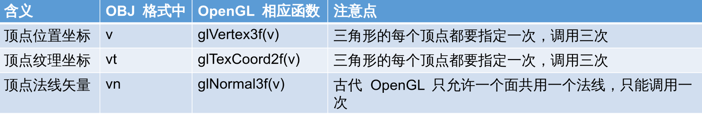

### 5.3 什么是法线

要理解面的法线, 就要从直线的方向向量说起:

要确定一条直线的朝向很容易。在直线上任意两点之间连成一条矢量, 这条矢量称为直线的 **方向向量**, 可以唯一确定一条直线, 通常用符号 $d$ 来表示。

但也存在问题: 方向矢量的方向表示了直线的方向, 那么这条矢量可长可短呀? 为了统一起见, 我们规定所有方向向量必须`归一化(normalize)`, 也就是把矢量长度强制设为 1。

但还是存在可上可下的问题, 例如 $d$ 和 $-d$ 同样都是归一化的、和直线平行的方向向量。

所以通常认为方向向量表示的是一条射线, 而不是直线。

直线的方向, 可以用一根与 **直线平行的方向向量** 来唯一确定。

那么如何确定一个面的朝向? 向量是一维的, 怎么来表示二维的面的朝向?

为了方便, 我们可以用一条`垂直于平面的直线`, 称为法线, 来唯一地表示一个平面。

法线是平面的固有属性, 所以我们可以用法线的方向向量来表示平面, 称为平面的法向向量。

法向向量, 我通常直接简称法线, 定义就是"一个垂直于面的单位矢量", 同样为了避免歧义这个矢量长度必须为 1, 即需要归一化(normalize)。

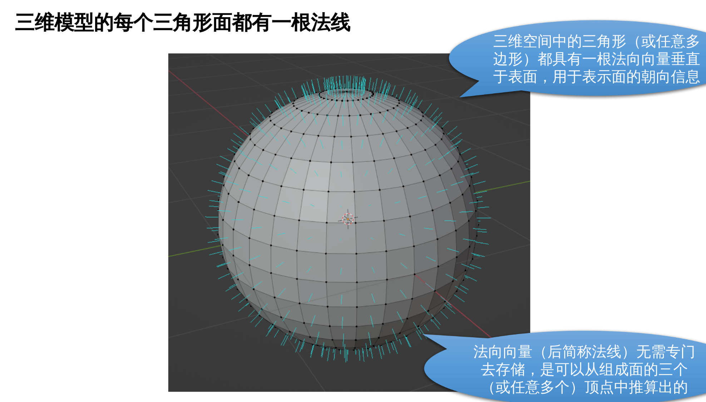

### 5.4 像素点亮度的计算就是基于法线的
空间中的三角形面也具有法线。OpenGL 要想计算光照, 就需要用到法线, 这根单位矢量。

光照模型具有很多种, 其中一种 Lambert 模型是这样规定的:

反射出来被我们看到的颜色 = 物体固有颜色 * 法线与入射光线方向的点积

$$
color = basecolor \times dot(N, -I)
$$

对于太阳光这种平行光源, 入射光方向是固定的, 但是物体表面不同地方的三角形面片, 法线是不同的, 例如图中的求, 这样就会产生的明暗变化的效果。

### 5.5 知识点: 顶点法线 vs 面法线

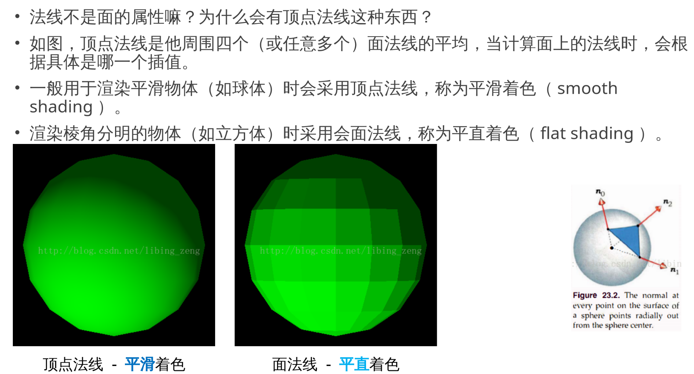

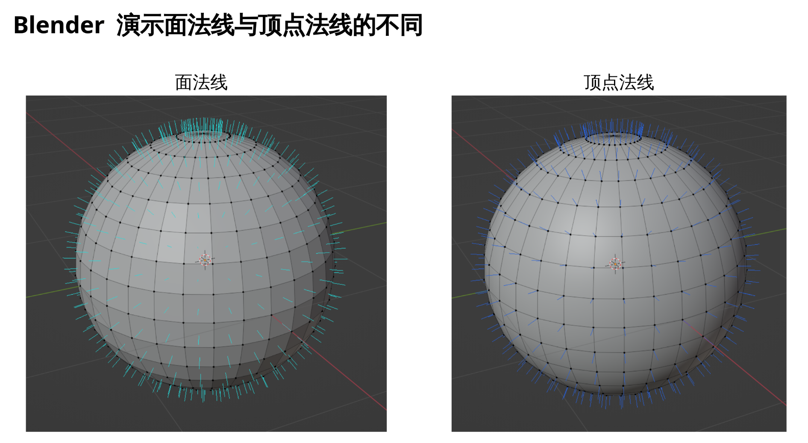

从面法线到顶点法线, 计算方法就是求邻居面法线的平均值(使用 scatter 法)

```cpp
struct Face {
    unsigned int vert_index;
    glm::vec3 face_normal;
};
struct Vertex {
    glm::vec3 position;
    glm::vec3 vert_normal;
};
vector<Face> faces;
vector<Vertex> vertices;

for (auto& vert : vertices)
    vert.vert_normal = glm::vec3(0);
for (auto& face : faces)
    vertices[faces.vert_index].vert_normal += face.face_normal;
for (auto& vert : vertices)
    vert.vert_normal = glm::normalize(vert.vert_normal);
```

更准确的计算顶点法线需要用面的 asin 系数加权平均

```cpp
vector3D triangleNormalFromVertex(int face_id, int vertex_id) {
    // This assumes that A->B->C is a counter-clockwise ordering
    vector3D A = mesh.face[face_id].vertex[vertex_id];
    vector3D B = mesh.face[face_id].vertex[(vertex_id + 1) % 3];
    vector3D C = mesh.face[face_id].vertex[(vertex_id + 2) % 3];
    vector3D N = cross(B - A, C - A);
    float sin_alpha = length(N) / (length(B - A) * length(C - A) );
    return normalize(N) * asin(sin_alpha); // 加权系数和三角形的"狭长程度"有关
}   // 如果是三角形一个很小的锐角, 那么这个三角形面法线对顶点法线的贡献就减小
    // 可以理解为贡献大小与这个面邻居所占 360 度角度中的多少角正比

void computeNormals() {
    for (vertex v in mesh) {
        vector3D N (0, 0, 0);
        for (int i = 0; i < NumOfTriangles; ++i) {
            if (mesh.face[i].contains(v)) { // 他没用 scatter 法, 复杂度变成 O(n^2) 了嘿嘿
                int VertexID = index_of_v_in_triangle(i, v); // Can be 0,1 or 2
                N = N + triangleNormalFromVertex(i, VertexID);
            }
        }
        N = normalize(N);
        add_N_to_normals_for_vertex_v(N, v);
    }
}
```

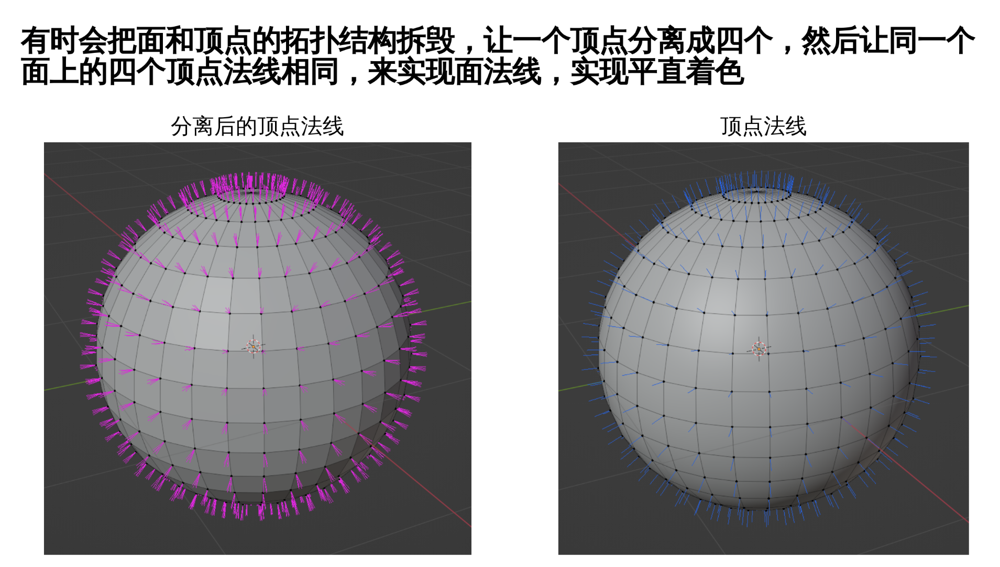

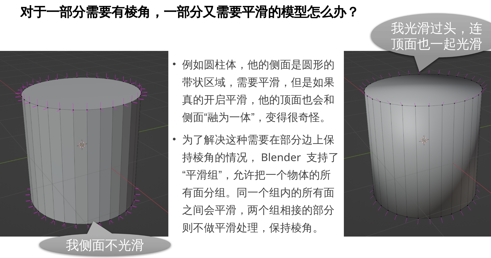

### 5.6 OBJ 中的法线

OBJ 中的法线是按照"顶点索引大法好"来的, 两种都能兼容

OBJ 既支持顶点法线也支持面法线。为了同时兼容两种情况, 法线是按照面上指定的编号(每组斜杠分割的三个数字的最后一个数)去索引 vn 数组得出的。

例如下面中一个面的四个角落, 都索引了 vn 数组相同的 1 号位置的法线。所以这就是一个面法线的模型, 如果你发现一个 OBJ 模型同一个 f 的四个角落最后的 vn 部分索引和最前面的 v 部分索引相同, 例如:

```obj
f 1/1/1 2/2/2 3/3/3 4/4/4
```

那说明这个模型采用的是顶点法线, 他可能是想表现一些非常光滑的东西比如球体。

### 5.7 法线之殇: 对于带有不均匀缩放的变换矩阵, 直接与其相乘会得到错误结果

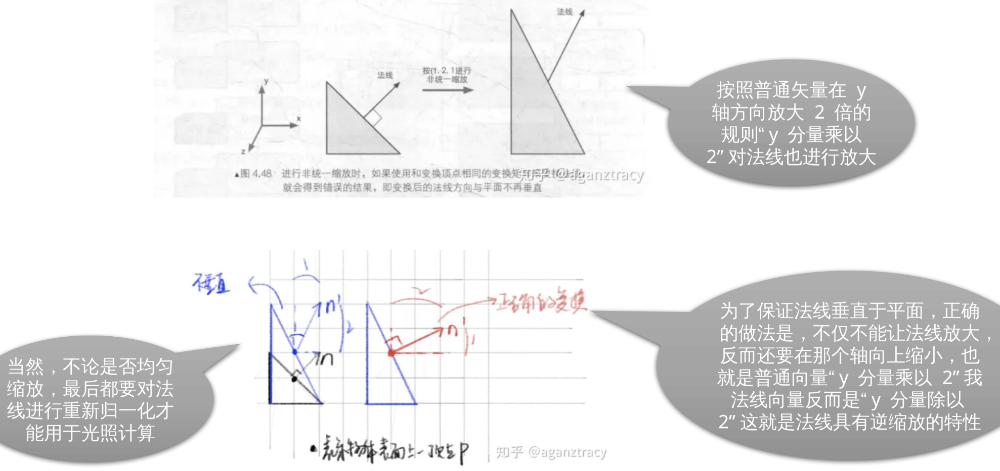

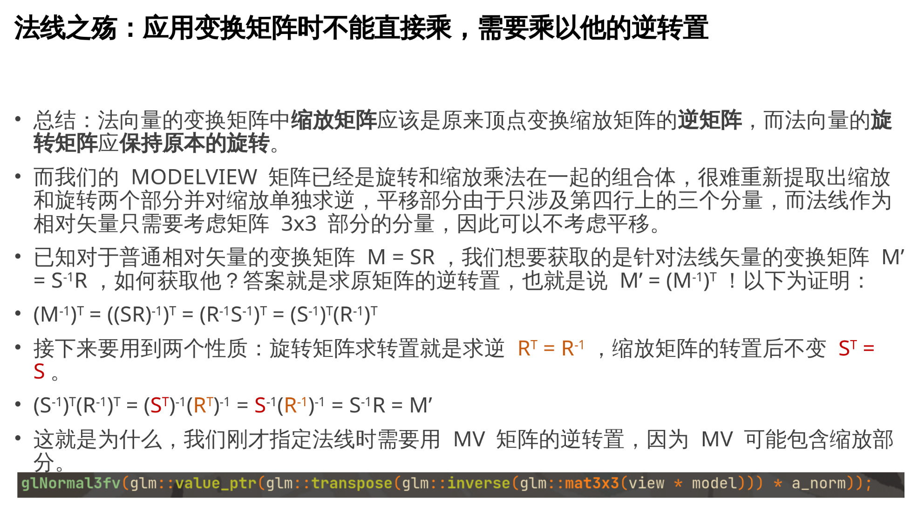

### 5.8 启用一大坨 OpenGL 高级功能

```cpp
CHECK_GL(glEnable(GL_DEPTH_TEST));       // 深度测试, 防止前后物体不分
CHECK_GL(glEnable(GL_MULTISAMPLE));      // 多重采样抗锯齿 (MSAA)
CHECK_GL(glEnable(GL_BLEND));            // 启用 Alpha 通道 (透明度)
CHECK_GL(glBlendFunc(GL_SRC_ALPHA, GL_ONE_MINUS_SRC_ALPHA)); // 标准 Alpha 混合: src*alpha + dst*(1-alpha)
CHECK_GL(glEnable(GL_LIGHTING));         // 启用固定管线光照 (古代特性)
CHECK_GL(glEnable(GL_LIGHT0));           // 启用 0 号光源 (古代特性)
CHECK_GL(glEnable(GL_COLOR_MATERIAL));   // 启用材质颜色追踪 (古代特性)
```

### 5.9 GL_BLEND 特性介绍

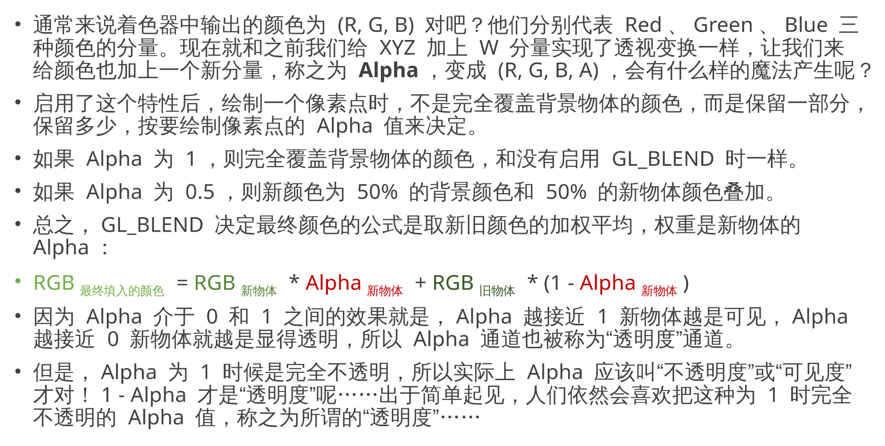

### 5.10 glBlendFunc 可以自定义混合公式

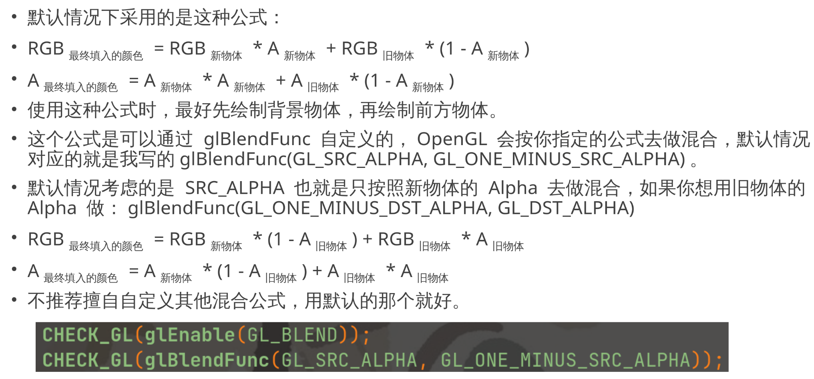

### 5.11 MSAA 的原理: 不是非黑即白, 而是在三角形边缘添加适当透明度

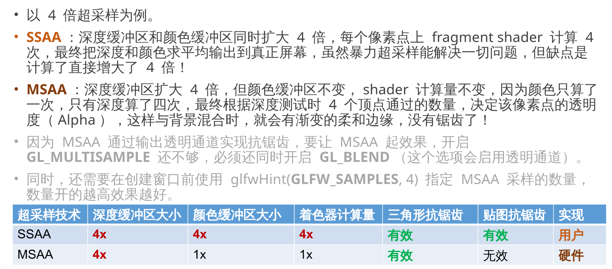

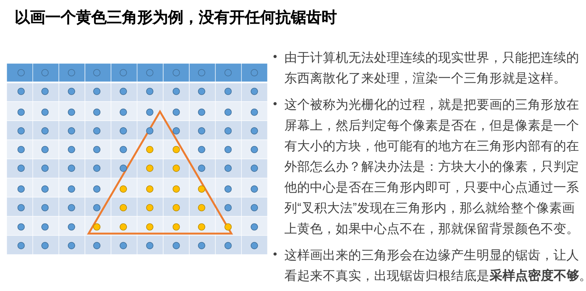

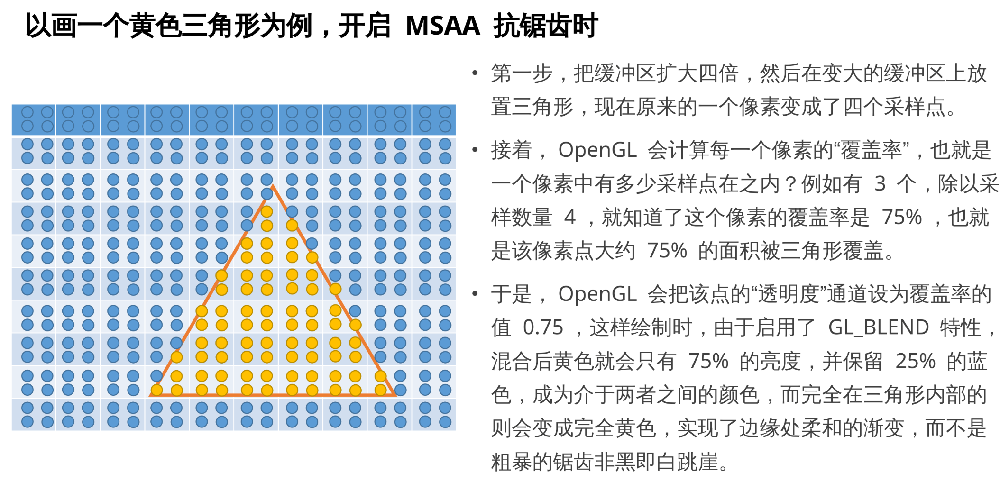

### 5.12 SSAA 和 MSAA 的区别

之前说过 OpenGL 的渲染管线, 分为光栅化和着色两步。

光栅化包括三角形的边缘判定和深度测试, 负责确定三角形在屏幕中的位置。

着色会调用着色器并行计算每个像素点的颜色, 以符合光学规律实现立体感效果。

SSAA 不仅光栅化会采样 4 次(效果是让三角形的边缘不会锯齿), 还会对物体的颜色采样 4 次(效果是当贴图具有高频细节时, 让贴图上的细节不会锯齿或摩尔纹), 调用 4 次着色器, 开销非常大。

而 MSAA 只会让光栅化采样 4 次, 不会让着色器计算 4 次, 因此相对高效很多。但代价是只能让三角形边缘不锯齿, 而着色器如果会产生非常密的纹理, 那就没法规避锯齿和摩尔纹。

不过因为纹理贴图的摩尔纹问题现在已经可以通过 GPU 内置的 mipmap 技术解决了(后面课程会讲), 所以 MSAA 抗锯齿还是非常实用的。

- mipmap + MSAA: 我俩是散装 SSAA!

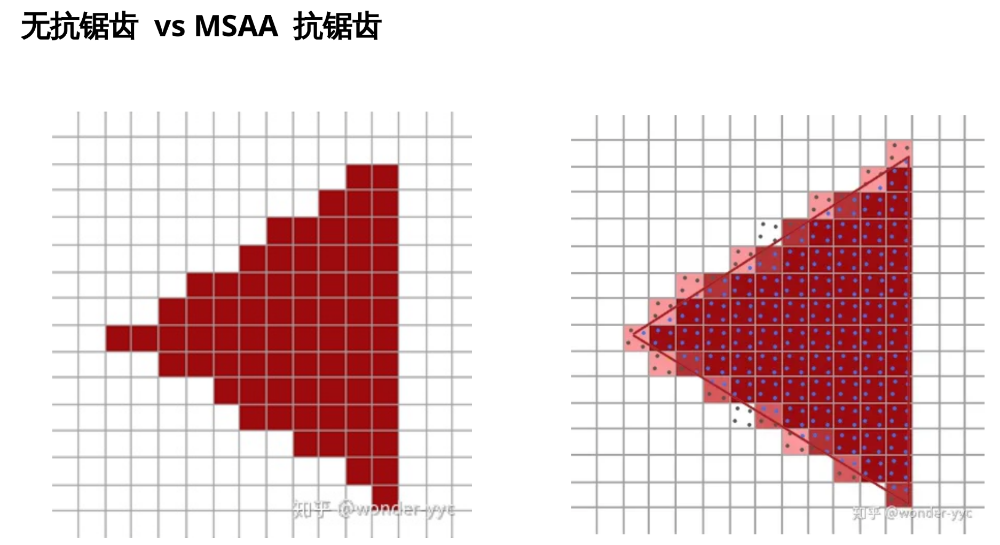

### 5.13 运行

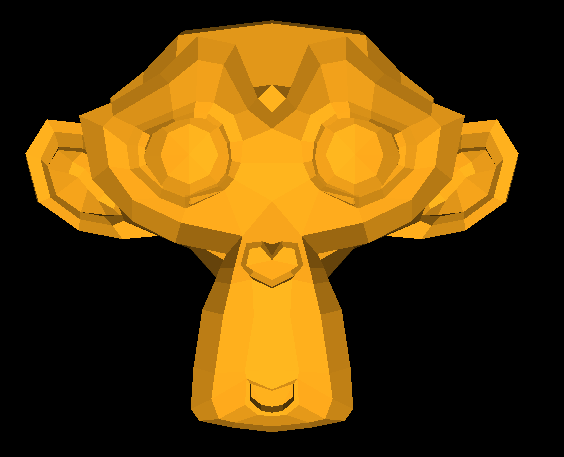

对比: 禁用深度缓冲

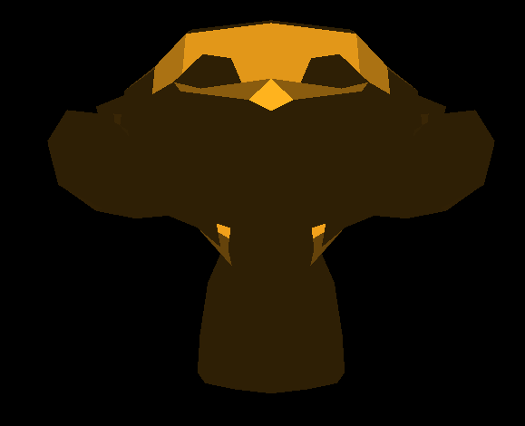

### 5.14 GL_MULTISAMPLE 的作用


### 5.15 glEnable 系列函数

```cpp
void glEnable(GLenum cap);
void glDisable(GLenum cap);
GLboolean glIsEnabled(GLenum cap);
```

用法举例:
```cpp
glDisable(GL_DEPTH_TEST); // 暂时关闭深度测试
assert(!glIsEnabled(GL_DEPTH_TEST));
.. // 绘制游戏 HUD 界面, 不参与深度测试 (比如物品栏/血量条)
glEnable(GL_DEPTH_TEST); // 重新恢复深度测试
assert(glIsEnabled(GL_DEPTH_TEST));
```

### 5.16 对古代OpenGL中是MVP部分进行优化

注意到, 我们之前的代码:

```cpp
void show(GLFWwindow* window) {
    glBegin(GL_TRIANGLES);
    static auto obj = [] {
        ObjParser res;
        res.parser("./obj/monkey.obj");
        return res;
    }();
    int w, h;
    glfwGetWindowSize(window, &w, &h);
    glm::mat4x4 perspective = glm::perspective(glm::radians(40.0f), (float)w / (float)h, 0.01f, 100.f);

    // 视角
    glm::vec3 eye{0, 0, 5};
    glm::vec3 center{0, 0, 0};
    glm::vec3 up{0, 1, 0};
    glm::mat4x4 view = glm::lookAt(eye, center, up);

    glm::mat4x4 model{1};

    auto& vertices = obj.getVertices();
    auto& uvs = obj.getUvs();
    auto& normals = obj.getNormals();
    for (auto const& v : obj.getFaces()) {
        auto v_x = vertices[v[0][0]],
             v_y = vertices[v[1][0]],
             v_z = vertices[v[2][0]];
        [[maybe_unused]] auto vt_x = uvs[v[0][1]],
             vt_y = uvs[v[1][1]],
             vt_z = uvs[v[2][1]];
        [[maybe_unused]] auto vn_x = normals[v[0][2]],
             vn_y = normals[v[1][2]],
             vn_z = normals[v[2][2]];
        glNormal3fv(glm::value_ptr(glm::transpose(glm::inverse(glm::mat3x3{view * model})) * vn_x));
        glTexCoord2fv(glm::value_ptr(vt_x));
        glVertex3fv(glm::value_ptr(
            perspective_divide(perspective * view * model * glm::vec4(v_x, 1))));
        glTexCoord2fv(glm::value_ptr(vt_y));
        glVertex3fv(glm::value_ptr(
            perspective_divide(perspective * view * model * glm::vec4(v_y, 1))));
        glTexCoord2fv(glm::value_ptr(vt_z));
        glVertex3fv(glm::value_ptr(
            perspective_divide(perspective * view * model * glm::vec4(v_z, 1))));
    }
    CHECK_GL(glEnd());
}
```

`view * model`被重复计算太多次了, 并且 VM 总是出现在一起.

所以我们其实不必提供单独的 view 和 model 矩阵, 可以把他们两个提前乘起来。

- 提供 `MODELVIEW` 矩阵 - `view * model`
- 提供 `PROJECTION` 矩阵 - `projection`

- 对于法线矢量, 会应用 `MODELVIEW` 的 3x3 部分的逆转置。
- 对于位置坐标, 会应用 `MODELVIEW` 然后 PROJECTION, 然后做 Perspective Divide。

> [!TIP]
> 为什么名为 modelview, 实际乘法顺序却是 $view \times model$?
>
> 和上一期的 SRT 一样, model、view、projection 也是一个固定的应用顺序, 简称 MVP。
>
> 但是由于 OpenGL 用的是列矢量。矢量元素纵向排列, 矢量需要在矩阵的右边做乘法。
>
> $$
> projection \times view \times model \times pos
> $$
>
> 就导致虽然我想要的应用顺序是 MVP, 但我却需要从右往左写, $P \times V \times M$。
>
> 所以 MV 部分自然就是需要 $V \times M$ 这个相反的顺序了。
>
> > 相反地, DirectX 用的是行矢量。矢量元素横向排列, 矢量需要在矩阵的左边做乘法, 那么 DirectX 的用户就要以正顺序写 $M \times V \times P$。

优化后:

```cpp
void show(GLFWwindow* window) {
    static auto obj = [] {
        ObjParser res;
        res.parser("./obj/monkey.obj");
        return res;
    }();

    int w, h;
    glfwGetWindowSize(window, &w, &h);

    // 构造矩阵
    glm::mat4x4 perspective = glm::perspective(glm::radians(40.0f), (float)w / (float)h, 0.01f, 100.f);
    glm::vec3 eye{0, 0, 5};
    glm::vec3 center{0, 0, 0};
    glm::vec3 up{0, 1, 0};
    glm::mat4x4 view = glm::lookAt(eye, center, up);
    glm::mat4x4 model{1};
    glm::mat4x4 viewModel = view * model; // ModelView

    // 加载投影矩阵
    glMatrixMode(GL_PROJECTION);
    glLoadMatrixf(glm::value_ptr(perspective)); // 其后续计算不需要写 perspective
                                                // OpenGL内部会自动补上这个计算
                                                // ps: glm 矩阵内部的存储方式就是列主序, 和 glLoadMatrixf 所要求的相同
    // 加载模型视图矩阵
    glMatrixMode(GL_MODELVIEW);
    glLoadMatrixf(glm::value_ptr(viewModel));

    // 法线变换矩阵(只需算一次)
    [[maybe_unused]] glm::mat3 normalMatrix = glm::transpose(glm::inverse(glm::mat3{viewModel}));

    // 开始绘制
    glBegin(GL_TRIANGLES);
    auto& vertices = obj.getVertices();
    auto& uvs = obj.getUvs();
    auto& normals = obj.getNormals();
    for (auto const& v : obj.getFaces()) {
        auto v_x = vertices[v[0][0]];
        auto v_y = vertices[v[1][0]];
        auto v_z = vertices[v[2][0]];

        auto vt_x = uvs[v[0][1]];
        auto vt_y = uvs[v[1][1]];
        auto vt_z = uvs[v[2][1]];

        [[maybe_unused]] auto vn_x = normals[v[0][2]];
        [[maybe_unused]] auto vn_y = normals[v[1][2]];
        [[maybe_unused]] auto vn_z = normals[v[2][2]];

        // 第一个顶点
        glNormal3fv(glm::value_ptr(normalMatrix * vn_x));
        glTexCoord2fv(glm::value_ptr(vt_x));
        glVertex3fv(glm::value_ptr(v_x));

        // 第二个顶点
        // glNormal3fv(glm::value_ptr(normalMatrix * vn_y));
        glTexCoord2fv(glm::value_ptr(vt_y));
        glVertex3fv(glm::value_ptr(v_y));

        // 第三个顶点
        // glNormal3fv(glm::value_ptr(normalMatrix * vn_z));
        glTexCoord2fv(glm::value_ptr(vt_z));
        glVertex3fv(glm::value_ptr(v_z));
    }
    glEnd();
}
```

### 5.17 手动计算法线

小问题: 如果 OBJ 模型没有提供法线信息怎么办?

没有法线就无法实现光照和立体效果; 我们可以手动计算法线: $n_{ABC_{平面}} = \vec{AB} \times \vec{AC}$

```cpp [c517-法线计算]
// 手动计算法线
glm::vec3 compute_normal(glm::vec3 a, glm::vec3 b, glm::vec3 c) noexcept {
    auto ab = b - a;
    auto ac = c - a;
    // 外积, 然后归一化
    return glm::normalize(glm::cross(ac, ab));
}
```

```cpp [c517-完整代码]
#include <check/OpenGL.hpp>
#include <glm/vec3.hpp>
#include <glm/gtc/type_ptr.hpp>

#include <fstream>
#include <stdexcept>
#include <vector>

auto __init__ = []{
    setlocale(LC_ALL, "zh_CN.UTF-8");
    try {
        auto cwd = std::filesystem::current_path();
        log::hxLog.debug("当前工作路径是:", cwd);
        std::filesystem::current_path("../../../src/08-OpenGL");
        log::hxLog.debug("切换到路径:", std::filesystem::current_path());
    } catch (const std::filesystem::filesystem_error& e) {
        log::hxLog.error("Error:", e.what());
    }
    return 0;
}();

namespace HX {

struct Vertex {
    float x, y, z;
};

struct Triangle {
    std::size_t a, b, c;
};

struct ObjParser {
    void parser(std::string_view path) {
        std::ifstream file{{path.data(), path.size()}};
        if (!file.is_open()) [[unlikely]] {
            log::hxLog.error("打开文件:", path, "失败!");
            throw std::runtime_error{path.data()};
        }
        std::string line;
        while (std::getline(file, line)) {
            auto head = line.substr(0, 2);
            if (head == "v ") {
                // 解析顶点
                std::istringstream s{line.substr(2)};
                glm::vec3 v;
                s >> v.x >> v.y >> v.z;
                _vertices.push_back(std::move(v));
            } else if (head == "f ") {
                // 解析面
                std::istringstream s{line.substr(2)};
                std::vector<std::size_t> idx;
                while (std::getline(s, head, ' ')) {
                    std::size_t i;
                    std::istringstream{head} >> i;
                    idx.push_back(i - 1);
                }
                for (std::size_t i = 2; i < idx.size(); ++i)
                    _trinales.push_back({idx[0], idx[i], idx[i - 1]});
            }
        }

        file.close();
        log::hxLog.info("加载:", path, "完成!");
    }

    auto& getVertices() const noexcept {
        return _vertices;
    }

    auto& getFaces() const noexcept {
        return _trinales;
    }

private:
    std::vector<glm::vec3> _vertices;
    std::vector<glm::uvec3> _trinales;
};

} // namespace HX

glm::vec3 perspective_divide(glm::vec4 pos) {
    return {pos.x / pos.w, pos.y / pos.w, pos.z / pos.w};
}

// 手动计算法线
glm::vec3 compute_normal(glm::vec3 a, glm::vec3 b, glm::vec3 c) noexcept {
    auto ab = b - a;
    auto ac = c - a;
    return glm::normalize(glm::cross(ac, ab));
}

void show(GLFWwindow* window) {
    static auto obj = [] {
        ObjParser res;
        res.parser("./obj/monkey.obj");
        return res;
    }();
    int w, h;
    glfwGetWindowSize(window, &w, &h);
    glm::mat4x4 perspective = glm::perspective(glm::radians(40.0f), (float)w / (float)h, 0.01f, 100.f);

    // 视角
    glm::vec3 eye{0, 0, 5};
    glm::vec3 center{0, 0, 0};
    glm::vec3 up{0, 1, 0};
    glm::mat4x4 view = glm::lookAt(eye, center, up);

    glm::mat4x4 model{1};

    glm::mat4x4 viewModel = view * model; // ModelView

    // 加载投影矩阵
    glMatrixMode(GL_PROJECTION);
    glLoadMatrixf(glm::value_ptr(perspective));

    // 加载模型视图矩阵
    glMatrixMode(GL_MODELVIEW);
    glLoadMatrixf(glm::value_ptr(viewModel));

    glBegin(GL_TRIANGLES);
    auto& vertices = obj.getVertices();
    for (auto const& v : obj.getFaces()) {
        auto a = vertices[v.x],
             b = vertices[v.y],
             c = vertices[v.z];
        auto normal = compute_normal(a, b, c);
        glNormal3fv(glm::value_ptr(normal));
        glVertex3fv(glm::value_ptr(a));
        glVertex3fv(glm::value_ptr(b));
        glVertex3fv(glm::value_ptr(c));
    }
    CHECK_GL(glEnd());
}

int main() {
    auto* window = initOpenGL();
    log::hxLog.debug("OpenGL version: ", glGetString(GL_VERSION));

    CHECK_GL(glEnable(GL_POINT_SMOOTH));
    CHECK_GL(glPointSize(64.0f));

    CHECK_GL(glEnable(GL_DEPTH_TEST));       // 深度测试, 防止前后物体不分
    CHECK_GL(glEnable(GL_MULTISAMPLE));      // 多重采样抗锯齿 (MSAA)
    CHECK_GL(glEnable(GL_BLEND));            // 启用 Alpha 通道 (透明度)
    CHECK_GL(glBlendFunc(GL_SRC_ALPHA, GL_ONE_MINUS_SRC_ALPHA)); // 标准 Alpha 混合: src*alpha + dst*(1-alpha)
    CHECK_GL(glEnable(GL_LIGHTING));         // 启用固定管线光照 (古代特性)
    CHECK_GL(glEnable(GL_LIGHT0));           // 启用 0 号光源 (古代特性)
    CHECK_GL(glEnable(GL_COLOR_MATERIAL));   // 启用材质颜色追踪 (古代特性)

    glColor3f(0.9f, 0.6f, 0.1f);
    while (!glfwWindowShouldClose(window)) {
        CHECK_GL(glClear(GL_COLOR_BUFFER_BIT | GL_DEPTH_BUFFER_BIT)); // 清空画布
        show(window);
        glfwSwapBuffers(window); // 双缓冲
        glfwPollEvents();
    }
    return 0;
}
```

你可能注意到, 为什么有时候显示全是灰色的呢? (尝试给法线加上负号. 然后运行观察)

### 5.18 法线方向的问题: 我们有必要人为规定面的"正方向"

之前在法线的定义那里我们说过, 同一个平面, 可能有两个法线! 为了去除这种模棱两可, 对于一个三角形, 我们必须规定哪一面是朝外的哪一面是朝里的!

回顾刚刚的三角形法线计算公式: $n = ||AB×AC||$

观察下方这两个三角形, 他们其实是完全一样的, 只是顶点的顺序有所不同。

```cpp
    A             A
   / \           / \
  B - C         C - B
```

但是, 按照我们的法线计算公式, 就会发现这两个仅仅只是顶点顺序发生变化的三角形, 法线居然是相反的!

为了光照的计算结果正确, 我们要求法线必须是朝向摄像头一面的。如果法线背对着我们, 算出来的颜色就会变成一片漆黑! 如果一个物体的表面都像下面蓝色的那个三角形, 法线算出来是背对着摄像头的, 那么物体就一片漆黑, 没有符合光学规律的立体感了。

**规定: 逆时针方向为面的正方向**

> 因此一个三角形, 只有一面是能够看的, 另一面的光照计算会是完全错误的。你可能在想, 有没有一种办法, 例如在着色器里自动检测法线是否反了, 让他自动翻转, 这样一个三角形的两面都能正常渲染, 不会漆黑?
>
> 不过我们第一课就说过了, 图形学是画皮的艺术, 所谓的三维模型只有一张皮! 这张皮的内外是很明确的, 不可能有人站在这个猴子的内部从内往外看(否则就叫穿模)。
>
> 所以不妨在建模的时候, 就始终保证三角形"能看的"那一面朝外, 称之为三角形面的"正方向"。一个封闭内部的"实心"模型, 他朝外的部分是很明确的, 建模工具中创建的物体都会满足这个规范, 导出为 OBJ 时, 其 f 命令后跟的顶点顺序, 也是保证"正方向"朝外的。
>
> 总之, 图形学界都不约而同达成了一个约定:
>
> "在摄像头方向看去, 三个顶点顺序呈逆时针方向排布的, 为面的正方向。所有三维软件都应该保证模型朝外的面是逆时针顶点顺序, 否则可能导致打开模型后颜色不正常。"

### 5.19 面剔除功能: GL_CULL_FACE

既然逆时针(Counter-clockwise)面为正面, 那么顺时针(Clockwise)就是背面, 反正法线和光照模型永远算不对, 破罐子破摔, 又深居在模型内部, 永远不需要出头露面了。

尽管只有逆时针的面, 光照计算是正确的, 但绘制时 OpenGL 却不管不顾, 都会一股脑给你绘制上。这给深度测试带来了不必要的负担: 同一个物体的正面和背面都会被绘制, 背面由于深度值(Z)更高, 又一定会被深度测试剔除。哎, 可恶的顺时针面, 明明永远在模型内部摸鱼, 永远不会被绘制出来, 却白白占用了我们宝贵的深度测试算力。

有没有一种办法, 能让 OpenGL 自动忽视所有在当前摄像机方向看起来是顺时针的面来节省性能? 这就需要启用 GL_CULL_FACE 这个称为面剔除的特性。

```cpp
// 开启面剔除
CHECK_GL(glEnable(GL_CULL_FACE));
CHECK_GL(glCullFace(GL_BACK));
CHECK_GL(glFrontFace(GL_CCW));
```

> [!TIP]
> 注意: 剔除的条件只看顶点的顺逆时针, 和法线无关, 法线是你自己计算的

要注意, `GL_CULL_FACE` 的作用是剔除"三个顶点顺序为顺时针"的面, 而和法线无关, 如果你加载了某个无良模型师傅做的"顺时针为正面"的模型, 那么你在我们刚刚的函数 `compute_normal` 里加个负号并无济于事! 要把"顺时针模型"转换成图形学界通用的"逆时针模型", 你需要做的只是把面数组中 B 和 C 顶点的"索引"翻一下:

```cpp
// 在 load_obj 中, 如果你加载的是约定"顺时针为正面"的模型, 就需要翻转 b 和 c 变量
if (isFackingClockwiseAuthor)
    faces.push_back(glm::uvec3(a, c, b));  // 无良模型师傅
else
    faces.push_back(glm::uvec3(a, b, c));  // 正常模型师傅
```

另外, 如果你的圈子都是喜欢顺时针的无良模型师傅, 那么也可以 `glFrontFace(GL_CW)`, 告诉 OpenGL 顺时针才是你想保留的正面, 默认状态是 `GL_CCW`, 逆时针为正面。

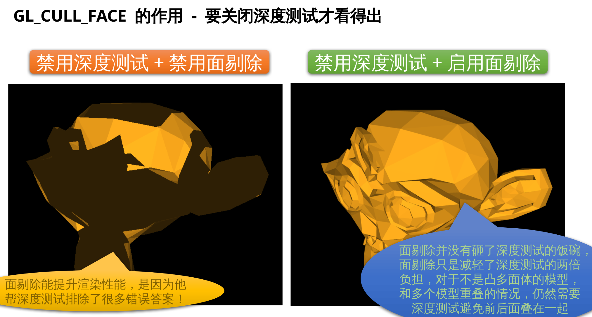

## 六、法线进阶之平滑渲染
### 6.1 古代 OpenGL 启用平滑渲染模式

```cpp
glShadeModel(GL_SMOOTH); // 切换到平滑渲染模式
glShadeModel(GL_FLAT);   // 切换到平直渲染模式
```

默认状态为平直模式 `GL_FLAT`。

绘制三角形时:
- 若为 `GL_SMOOTH` `模式, glNormal3f` 可以指定三次, 每个顶点都可以有独立的顶点法线。
- 若为 `GL_FLAT` `模式, glNormal3f` 每个三角形只能指定一次, 含义为面法线。

### 6.2 平直渲染(GL_FLAT)vs 平滑渲染(GL_SMOOTH)


左边是平直, 右边是平滑.

```cpp [c62-平滑渲染法线]
// 手动计算法线 asin 系数
glm::vec3 compute_normal_biased(glm::vec3 a, glm::vec3 b, glm::vec3 c) noexcept {
    auto ab = b - a;
    auto ac = c - a;
    auto n = glm::cross(ac, ab);
    auto nLen = glm::length(n);
    if (nLen != 0) {
        n *= glm::asin(nLen / (glm::length(ab) * glm::length(ac))) / nLen;
    }
    return n;
}
```

```cpp [c62-完整代码(绘制两个)]
#include <check/OpenGL.hpp>
#include <glm/vec3.hpp>
#include <glm/gtc/type_ptr.hpp>

#include <fstream>
#include <stdexcept>
#include <vector>

#include <HXTest.hpp>

auto __init__ = []{
    setlocale(LC_ALL, "zh_CN.UTF-8");
    try {
        auto cwd = std::filesystem::current_path();
        log::hxLog.debug("当前工作路径是:", cwd);
        std::filesystem::current_path("../../../src/08-OpenGL");
        log::hxLog.debug("切换到路径:", std::filesystem::current_path());
    } catch (const std::filesystem::filesystem_error& e) {
        log::hxLog.error("Error:", e.what());
    }
    return 0;
}();

namespace HX {

struct ObjParser {
    void parser(std::string_view path) {
        std::ifstream file{{path.data(), path.size()}};
        if (!file.is_open()) [[unlikely]] {
            log::hxLog.error("打开文件:", path, "失败!");
            throw std::runtime_error{path.data()};
        }
        std::string line;
        while (std::getline(file, line)) {
            auto head = line.substr(0, 2);
            if (head == "v ") {
                // 解析顶点
                std::istringstream s{line.substr(2)};
                glm::vec3 v;
                s >> v.x >> v.y >> v.z;
                _vertices.push_back(std::move(v));
            } else if (head == "f ") {
                // 解析面
                std::istringstream s{line.substr(2)};
                std::vector<std::size_t> idx;
                while (std::getline(s, head, ' ')) {
                    std::size_t i;
                    std::istringstream{head} >> i;
                    idx.push_back(i - 1);
                }
                for (std::size_t i = 2; i < idx.size(); ++i)
                    _trinales.push_back({idx[0], idx[i], idx[i - 1]});
            }
        }

        file.close();
        log::hxLog.info("加载:", path, "完成!");
    }

    auto& getVertices() const noexcept {
        return _vertices;
    }

    auto& getFaces() const noexcept {
        return _trinales;
    }

private:
    std::vector<glm::vec3> _vertices;
    std::vector<glm::uvec3> _trinales;
};

} // namespace HX

glm::vec3 perspective_divide(glm::vec4 pos) {
    return {pos.x / pos.w, pos.y / pos.w, pos.z / pos.w};
}

// 手动计算法线
glm::vec3 compute_normal(glm::vec3 a, glm::vec3 b, glm::vec3 c) noexcept {
    auto ab = b - a;
    auto ac = c - a;
    return glm::normalize(glm::cross(ac, ab));
}

// 手动计算法线 asin 系数
glm::vec3 compute_normal_biased(glm::vec3 a, glm::vec3 b, glm::vec3 c) noexcept {
    auto ab = b - a;
    auto ac = c - a;
    auto n = glm::cross(ac, ab);
    auto nLen = glm::length(n);
    if (nLen != 0) {
        n *= glm::asin(nLen / (glm::length(ab) * glm::length(ac))) / nLen;
    }
    return n;
}

template <bool IsSmooth = false> // 是否为平滑模式
void show(GLFWwindow* window) {
    static auto obj = [] {
        ObjParser res;
        res.parser("./obj/monkey.obj");
        return res;
    }();
    int w, h;
    glfwGetWindowSize(window, &w, &h);
    glm::mat4x4 perspective = glm::perspective(glm::radians(40.0f), (float)w / (float)h, 0.01f, 100.f);

    auto& vertices = obj.getVertices();
    static auto normals = [&] {
        std::vector<glm::vec3> res;
        if constexpr (IsSmooth) {
            auto& faces = obj.getFaces();
            res.resize(faces.size());
            for (auto const& v : faces) {
                auto a = vertices[v[0]],
                     b = vertices[v[1]],
                     c = vertices[v[2]];
                HX_NO_WARNINGS_BEGIN
                for (std::size_t i = 0; i < 3; ++i)
                    res[v[i]] += compute_normal_biased(a, b, c);
                HX_NO_WARNINGS_END
            }
            for (auto& it : res)
                it = glm::normalize(it);
        } else {
            for (auto const& v : obj.getFaces()) {
                auto a = vertices[v.x],
                     b = vertices[v.y],
                     c = vertices[v.z];
                res.push_back(compute_normal(a, b, c));
            }
        }
        return res;
    }();

    // 视角
    glm::vec3 eye{0, 0, 5};
    glm::vec3 center{0, 0, 0};
    glm::vec3 up{0, 1, 0};
    glm::mat4x4 view = glm::lookAt(eye, center, up);

    glm::mat4x4 model = glm::mat4x4{1.f};
    model = glm::scale(model, glm::vec3(0.7f)); // 缩小 0.7 倍
    model = IsSmooth
        ? glm::translate(glm::mat4x4(1), 1.5f * glm::vec3(0.8f, 0, 0)) * model   // 平移位置
        : glm::translate(glm::mat4x4(1), -1.5f * glm::vec3(0.8f, 0, 0)) * model;

    glm::mat4x4 viewModel = view * model; // ModelView

    // 加载投影矩阵
    glMatrixMode(GL_PROJECTION);
    glLoadMatrixf(glm::value_ptr(perspective));

    // 加载模型视图矩阵
    glMatrixMode(GL_MODELVIEW);
    glLoadMatrixf(glm::value_ptr(viewModel));

    glBegin(GL_TRIANGLES);
    for (std::size_t i = 0; auto const& v : obj.getFaces()) {
        auto a = vertices[v.x],
             b = vertices[v.y],
             c = vertices[v.z];
        if constexpr (IsSmooth) {
            glNormal3fv(glm::value_ptr(normals[v[0]]));
            glVertex3fv(glm::value_ptr(a));
            glNormal3fv(glm::value_ptr(normals[v[1]]));
            glVertex3fv(glm::value_ptr(b));
            glNormal3fv(glm::value_ptr(normals[v[2]]));
            glVertex3fv(glm::value_ptr(c));
        } else {
            glNormal3fv(glm::value_ptr(normals[i]));
            glVertex3fv(glm::value_ptr(a));
            glVertex3fv(glm::value_ptr(b));
            glVertex3fv(glm::value_ptr(c));
        }
        ++i;
    }
    CHECK_GL(glEnd());
}

int main() {
    auto* window = initOpenGL();
    log::hxLog.debug("OpenGL version: ", glGetString(GL_VERSION));

    CHECK_GL(glEnable(GL_POINT_SMOOTH));
    CHECK_GL(glPointSize(64.0f));

    CHECK_GL(glEnable(GL_DEPTH_TEST));       // 深度测试, 防止前后物体不分
    CHECK_GL(glEnable(GL_MULTISAMPLE));      // 多重采样抗锯齿 (MSAA)
    CHECK_GL(glEnable(GL_BLEND));            // 启用 Alpha 通道 (透明度)
    CHECK_GL(glBlendFunc(GL_SRC_ALPHA, GL_ONE_MINUS_SRC_ALPHA)); // 标准 Alpha 混合: src*alpha + dst*(1-alpha)
    CHECK_GL(glEnable(GL_LIGHTING));         // 启用固定管线光照 (古代特性)
    CHECK_GL(glEnable(GL_LIGHT0));           // 启用 0 号光源 (古代特性)
    CHECK_GL(glEnable(GL_COLOR_MATERIAL));   // 启用材质颜色追踪 (古代特性)

    glColor3f(0.9f, 0.6f, 0.1f);
    while (!glfwWindowShouldClose(window)) {
        CHECK_GL(glClear(GL_COLOR_BUFFER_BIT | GL_DEPTH_BUFFER_BIT)); // 清空画布
        show<true>(window);
        show<false>(window);
        glfwSwapBuffers(window); // 双缓冲
        glfwPollEvents();
    }
    return 0;
}
```

桥豆麻袋! 这个亮度是不是不对?

### 6.3 MV 矩阵含有缩放时, 需要开启 GL_NORMALIZE

因为 OpenGL 会傻乎乎的给模型的法线乘以 MV 矩阵的逆转置, 但是乘了以后忘记归一化!

我们刚刚的 Model 矩阵部分有缩小至 0.7 倍, 因此 Model 的逆转置是放大至 1.42 倍。

这导致我们的法线被傻乎乎的 OpenGL 乘以逆转置后长度由正常的 1 变成 1.42 了!

从而计算光照时, 由于光照计算公式中有 dot(N, -I) 项, 这个公式算出来亮度正确的前提是 N 必须是已经归一化的, 然而我们恰恰不是归一化的, 所以变成 dot(1.42 N, -I) 导致算出来亮度高了 1.42 倍!

因此我们可以开启 `GL_NORMALIZE`(古代特供)这个开关, 让 OpenGL 对乘以了 MV 逆转置后的法线进行一个归一化操作, 保证进入固定管线的 N 总是归一化的。

```cpp
glEnable(GL_NORMALIZE);
```

这样, 成功在同一个窗口中正确显示两个不同上色模式的猴子头~

## 七、GLFW 鼠标事件回调实现相机角度控制

~~回调函数大家都知道是什么东西, 这里就不介绍了~~

### 7.1 设置鼠标点击回调函数

```cpp
void mouse_button_callback(GLFWwindow *window, int button, int action, int mods);
```

然后在主函数里使用 `glfwSetMouseButtonCallback` 注册这个回调函数:

```cpp
glfwSetMouseButtonCallback(window, mouse_button_callback);
```

以后每当用户在窗口 window 中点击了鼠标, GLFW 就会自动帮你调用你注册的这个 `mouse_button_callback` 函数, 并且往他的参数中传递了一些关于鼠标的信息:
- `button` 用户按下了鼠标上哪一个键, 例如 `GLFW_MOUSE_BUTTON_LEFT` 表示鼠标左键。
- `action` 会告诉你鼠标这个按键是被按下(`GLFW_PRESS`)还是抬起(`GLFW_RELEASE`)。
- `mods` 点击时的键盘"修饰符", 例如 Ctrl、Shift、Alt 等, 可以实现 Ctrl+鼠标点击。
- `window` 告诉你事件发生在哪个窗口上, 反正我们只有一个主窗口所以不用考虑。

本期所有用到的函数:

```cpp
/**
 * @brief 鼠标移动回调
 * @param window GLFW 窗口指针
 * @param xpos 鼠标当前的 X 坐标
 * @param ypos 鼠标当前的 Y 坐标
 */
void cursor_pos_callback(GLFWwindow* window, double xpos, double ypos);

/**
 * @brief 鼠标按键回调
 * @param window GLFW 窗口指针
 * @param button 鼠标按键(如 GLFW_MOUSE_BUTTON_LEFT)
 * @param action 按键动作(GLFW_PRESS 或 GLFW_RELEASE)
 * @param mods   修饰键(如 GLFW_MOD_SHIFT)
 */
void mouse_button_callback(GLFWwindow* window, int button, int action, int mods);

/**
 * @brief 鼠标滚轮回调
 * @param window GLFW 窗口指针
 * @param xoffset 滚轮水平方向偏移
 * @param yoffset 滚轮垂直方向偏移
 */
void scroll_callback(GLFWwindow* window, double xoffset, double yoffset);

/**
 * @brief 键盘按键回调
 * @param window GLFW 窗口指针
 * @param key 按键代码(如 GLFW_KEY_A)
 * @param scancode 系统扫描码
 * @param action 按键动作(GLFW_PRESS 或 GLFW_RELEASE)
 * @param mods   修饰键(如 GLFW_MOD_CONTROL)
 */
void key_callback(GLFWwindow* window, int key, int scancode, int action, int mods);

/**
 * @brief 窗口大小改变回调
 * @param window GLFW 窗口指针
 * @param width 新窗口宽度
 * @param height 新窗口高度
 */
void framebuffer_size_callback(GLFWwindow* window, int width, int height);
```

### 7.2 GLFW 是在什么地方调用回调?

> [!TIP]
> 有些同学可能担心"回调函数"会不会是在另一个线程里异步的调用的, 那在回调函数里修改相机参数岂不是很危险?
>
> 不会! GLFW 保证回调函数总是在主线程, 并且不会在 `render` 进行到一半的时候调用

所有你设置的 `Callback` 函数都是在这个 `glfwPollEvents` 里面被调用的! 所以都是在主线程调用的, 没有任何问题

```cpp
while (!glfwWindowShouldClose(window)) {
    CHECK_GL(glClear(GL_COLOR_BUFFER_BIT | GL_DEPTH_BUFFER_BIT)); // 清空画布
    show<true>(window);
    show<false>(window);
    glfwSwapBuffers(window); // 双缓冲
    glfwPollEvents();        // <-- 轮询事件中, 调用回调
}
```

### 7.3 介绍摄像头控制的五种模式

1. orbit(环绕模式)
2. drift(转头模式)
3. pan(平移模式)
4. zoom(缩放模式)
5. hitchcock(变焦模式)

