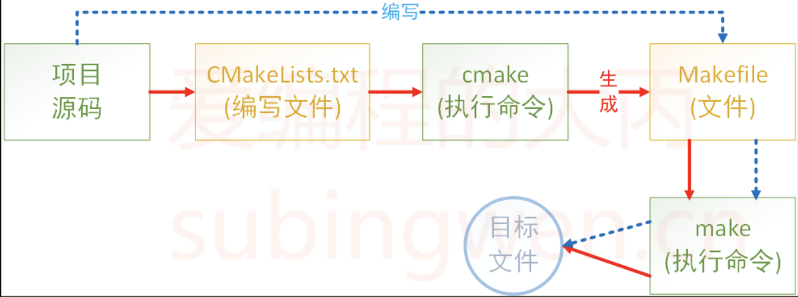

# CMake概述
**CMake** 是一个项目构建工具，并且是跨平台的。关于项目构建我们所熟知的还有Makefile（通过 make 命令进行项目的构建），大多是IDE软件都集成了make，比如：VS 的 nmake、linux 下的 GNU make、Qt 的 qmake等，如果自己动手写 makefile，会发现，makefile 通常依赖于当前的编译平台，而且编写 makefile 的工作量比较大，解决依赖关系时也容易出错。

而 **CMake** 恰好能解决上述问题， 其允许开发者指定整个工程的编译流程，在根据编译平台，自动生成本地化的 Makefile 和工程文件，最后用户只需`make`编译即可，所以可以把 **CMake** 看成一款自动生成 Makefile 的工具，其编译流程如下图：

| ##container## |
|:--:|
||

- *蓝色虚线表示使用`makefile`构建项目的过程*
- *红色实线表示使用`cmake`构建项目的过程*

## 优点

介绍完 **CMake** 的作用之后，再来总结一下它的优点：

- 跨平台
- 能够管理大型项目
- 简化编译构建过程和编译过程
- 可扩展：可以为 cmake 编写特定功能的模块，扩充 cmake 功能

# CMake下载与安装
## Linux
一般都默认自带的[?], (某些系统)

查看是否已经安装
```bash
[root@localhost cmake_test]# cmake --version
cmake version 3.20.2

CMake suite maintained and supported by Kitware (kitware.com/cmake).
```

如果没有, 请百度安装教程

## Windows
请自行百度, 可以搭配 vcpkg 使用, 轻松管理动态库!


# CMake的使用
**CMake** 支持大写、小写、混合大小写的命令。如果在编写`CMakeLists.txt`文件时使用的工具有对应的命令提示，那么大小写随缘即可，不要太过在意。

## 注释
### 单行注释

```CMake
# 这是一个 CMakeLists.txt 文件
cmake_minimum_required(VERSION 3.0.0)
```

### 多行注释

```CMake
#[[ 这是一个 CMakeLists.txt 文件。
这是一个 CMakeLists.txt 文件
这是一个 CMakeLists.txt 文件]]
cmake_minimum_required(VERSION 3.0.0)
```

## 第一个项目
### 事前准备

```bash
[root@localhost cmake_test]# cat main.cpp 
#include <cstdio>
#include "test.h"

int main() {
    printf("%d + %d = %d\n", 1, 2, add(1, 2));
    return 0;
}
[root@localhost cmake_test]# cat test.h 
#ifndef _TEST_H_
#define _TEST_H_

int add(int a, int b);

#endif
[root@localhost cmake_test]# cat add.cpp 
#include "test.h"

int add(int a, int b) {
    return a + b;
}
```

### 没有CMake的编译做法

```C++
[root@localhost cmake_test]# g++ main.cpp add.cpp -o app
[root@localhost cmake_test]# ll
总用量 32
-rw-r--r-- 1 root root    60 4月  13 21:56 add.cpp
-rwxr-xr-x 1 root root 18104 4月  13 21:58 app
-rw-r--r-- 1 root root   107 4月  13 21:52 main.cpp
-rw-r--r-- 1 root root    66 4月  13 21:55 test.h
[root@localhost cmake_test]# ./app
1 + 2 = 3
```

如果项目文件很多, 并且可能还需要链接库, 这样每次编译都需要 g++ 命令跟一大堆东西, 人会疯的, 特别是多人项目, 你可能都不知道别人什么时候又新建了一个文件.

- 因此, 我们就需要使用`CMake`来管理了 ! ! !

### 使用 CMake 来管理
1. 创建一个 `CMakeLists.txt`:

```bash
[root@localhost cmake_test]# vim CMakeLists.txt
```

(此时的目录结构为)

```bash
.
├── add.cpp
├── app
├── CMakeLists.txt
├── main.cpp
└── test.h
```

2. 在`CMakeLists.txt`编写以下内容: 
```CMake
cmake_minimum_required(VERSION 3.0)
project(Test)
add_executable(app main.cpp add.cpp)
```
其意思分别是:
#### cmake_minimum_required 指定最低的CMake版本

```CMake
cmake_minimum_required(VERSION 3.0)
```

- 可选，非必须，如果不加可能会有警告

#### project 定义工程名称 可编写工程描述
- 定义工程名称，并可指定工程的版本、工程描述、web主页地址、支持的语言（默认情况支持所有语言），如果不需要这些都是可以忽略的，只需要指定出工程名字即可。

```CMake
# PROJECT 指令的语法是：
project(<PROJECT-NAME> [<language-name>...])
project(<PROJECT-NAME>
       [VERSION <major>[.<minor>[.<patch>[.<tweak>]]]]
       [DESCRIPTION <project-description-string>]
       [HOMEPAGE_URL <url-string>]
       [LANGUAGES <language-name>...])
```

#### add_executable 定义工程会生成一个可执行程序

```CMake
add_executable(可执行程序名 源文件名称)
```

这里的可执行程序名和`project`中的项目名**没有**任何关系

源文件名可以是一个也可以是多个，如有多个可用`空格`或`;`间隔

```CMake
# 样式1
add_executable(app add.c div.c main.c mult.c sub.c)
# 样式2
add_executable(app add.c;div.c;main.c;mult.c;sub.c)
```

3. 执行 CMake 命令
 
```shell
# cmake 命令原型
$ cmake CMakeLists.txt文件所在路径
```

例如:

```bash
[root@localhost cmake_test]# cmake .
-- The C compiler identification is GNU 8.5.0
-- The CXX compiler identification is GNU 8.5.0
-- Detecting C compiler ABI info
-- Detecting C compiler ABI info - done
-- Check for working C compiler: /usr/bin/cc - skipped
-- Detecting C compile features
-- Detecting C compile features - done
-- Detecting CXX compiler ABI info
-- Detecting CXX compiler ABI info - done
-- Check for working CXX compiler: /usr/bin/c++ - skipped
-- Detecting CXX compile features
-- Detecting CXX compile features - done
-- Configuring done
-- Generating done
-- Build files have been written to: /root/dev/cmake_test
```

这样就生成了一些新的文件:
```bash
[root@localhost cmake_test]# ll
总用量 64
-rw-r--r-- 1 root root    60 4月  13 21:56 add.cpp
-rwxr-xr-x 1 root root 18104 4月  13 21:58 app
-rw-r--r-- 1 root root 13722 4月  13 22:20 CMakeCache.txt # 新文件
drwxr-xr-x 5 root root   228 4月  13 22:20 CMakeFiles # 新文件夹
-rw-r--r-- 1 root root  1610 4月  13 22:20 cmake_install.cmake # 新文件
-rw-r--r-- 1 root root    86 4月  13 22:15 CMakeLists.txt
-rw-r--r-- 1 root root   107 4月  13 21:52 main.cpp
-rw-r--r-- 1 root root  5612 4月  13 22:20 Makefile # 新文件
-rw-r--r-- 1 root root    66 4月  13 21:55 test.h
```

此时只需要在执行一下`make`命令, CMake就会调用编译命令:

```bash
[root@localhost cmake_test]# make
[ 33%] Building CXX object CMakeFiles/app.dir/main.cpp.o
[ 66%] Building CXX object CMakeFiles/app.dir/add.cpp.o
[100%] Linking CXX executable app
[100%] Built target app
```

### 使用CMake但是VIP包间
通过上面的例子可以看出，如果在`CMakeLists.txt`文件所在目录执行了`cmake`命令之后就会生成一些目录和文件（包括 makefile 文件），如果再基于`makefile`文件执行`make`命令，程序在编译过程中还会生成一些中间文件和一个可执行文件，这样会导致整个项目目录看起来很混乱，不太容易管理和维护，此时我们就可以把生成的这些与项目源码无关的文件统一放到一个对应的目录里边，比如将这个目录命名为`build`:

```bash
[root@localhost cmake_test]# mkdir build
[root@localhost cmake_test]# cd build/
[root@localhost build]# cmake ..
-- The C compiler identification is GNU 8.5.0
-- The CXX compiler identification is GNU 8.5.0
-- Detecting C compiler ABI info
-- Detecting C compiler ABI info - done
-- Check for working C compiler: /usr/bin/cc - skipped
-- Detecting C compile features
-- Detecting C compile features - done
-- Detecting CXX compiler ABI info
-- Detecting CXX compiler ABI info - done
-- Check for working CXX compiler: /usr/bin/c++ - skipped
-- Detecting CXX compile features
-- Detecting CXX compile features - done
-- Configuring done
-- Generating done
-- Build files have been written to: /root/dev/cmake_test/build
```

现在`cmake`命令是在`build`目录中执行的，但是`CMakeLists.txt`文件是`build`目录的上一级目录中，所以`cmake`命令后指定的路径为`..`，即当前目录的上一级目录。

当命令执行完毕之后，在`build`目录中会生成一个`makefile`文件

```bash
[root@localhost cmake_test]# tree build -L 1
build
├── CMakeCache.txt
├── CMakeFiles
├── cmake_install.cmake
└── Makefile
```
这样就可以在`build`目录**中**执行`make`命令编译项目，生成的相关文件自然也就被存储到`build`目录中了。这样通过`cmake`和`make`生成的所有文件就全部和项目源文件隔离开了，各回各家，各找各妈。

如:
```bash
[root@localhost cmake_test]# cd build/
[root@localhost build]# make
[ 33%] Building CXX object CMakeFiles/app.dir/main.cpp.o
[ 66%] Building CXX object CMakeFiles/app.dir/add.cpp.o
[100%] Linking CXX executable app
[100%] Built target app
[root@localhost build]# ./app
1 + 2 = 3
```

## 参考链接
### [1]
[爱编程的大丙-CMake 保姆级教程（上）](https://subingwen.cn/cmake/CMake-primer/)