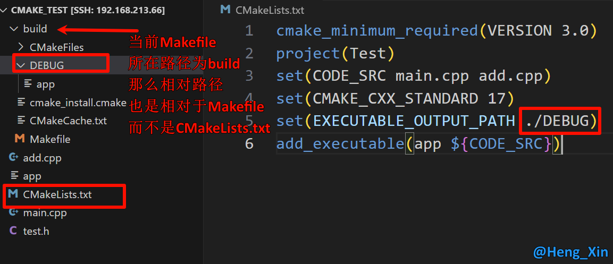

# CMake 的使用
## set 变量

在之前的例子中, 我们用到了两个.cpp文件, 如果在大型项目中, 我们每次运行都需要编写这么多文件名, 那和直接g++编译有什么区别?

```CMake
cmake_minimum_required(VERSION 3.0)
project(Test)
add_executable(app main.cpp add.cpp)
```

因此我们可以使用一个变量, 把表示文件名的内容当做<span style="color:red">字符串</span>存储起来, 此时用到的就是`set`

```CMake
# SET 指令的语法是：
# [] 中的参数为可选项, 如不需要可以不写
SET(VAR [VALUE] [CACHE TYPE DOCSTRING [FORCE]])
```

- **VAR**: 变量名, 区分大小写
- **VALUE**: 变量值

示例:

```CMake
# 方式1: 各个源文件之间使用空格间隔
# set(SRC_LIST add.c  div.c  main.c  mult.c  sub.c)

# 方式2: 各个源文件之间使用分号 ; 间隔
set(SRC_LIST add.c;div.c;main.c;mult.c;sub.c)
add_executable(app  ${SRC_LIST})
```

使用的时候为`${变量名}`, 表示使用变量

## 宏
### CMAKE_CXX_STANDARD 指定使用的C++标准
在编写C++程序的时候，可能会用到C++11、C++14、C++17、C++20等新特性，那么就需要在编译的时候在编译命令中制定出要使用哪个标准:

```cmd
g++ *.cpp -std=c++11 -o app
```

上面的例子中通过参数`-std=c++11`指定出要使用`c++11`标准编译程序，C++标准对应有一宏叫做`DCMAKE_CXX_STANDARD`。在CMake中想要指定C++标准有两种方式:

<span style="color:red"> 1. 在 CMakeLists.txt 中通过 set 命令指定</span>

```CMake
# 增加-std=c++11
set(CMAKE_CXX_STANDARD 11)
# 增加-std=c++14
set(CMAKE_CXX_STANDARD 14)
# 增加-std=c++17
set(CMAKE_CXX_STANDARD 17)
```

2. 在执行 cmake 命令的时候指定出这个宏的值

```bash
# 增加-std=c++11
cmake CMakeLists.txt文件路径 -DCMAKE_CXX_STANDARD=11
# 增加-std=c++14
cmake CMakeLists.txt文件路径 -DCMAKE_CXX_STANDARD=14
# 增加-std=c++17
cmake CMakeLists.txt文件路径 -DCMAKE_CXX_STANDARD=17
```

### EXECUTABLE_OUTPUT_PATH 指定输出的路径
在CMake中指定可执行程序输出的路径，也对应一个宏，叫做`EXECUTABLE_OUTPUT_PATH`，它的值还是通过set命令进行设置:

```CMake
set(HOME /home/robin/Linux/Sort)
set(EXECUTABLE_OUTPUT_PATH ${HOME}/bin)
```
- 第一行: 定义一个变量用于存储一个绝对路径
- 第二行: 将拼接好的路径值设置给`EXECUTABLE_OUTPUT_PATH`宏
    - 如果这个路径中的子目录不存在，会自动生成，无需自己手动创建

<b style="color:red">由于可执行程序是基于`cmake`命令生成的`makefile`文件然后再执行`make`命令得到的，所以如果此处指定可执行程序生成路径的时候使用的是相对路径`./xxx/xxx`，那么这个路径中的`./`对应的就是`makefile`文件所在的那个目录。</b>

### 其他的宏
不可能毫无逻辑的全部列举于此, 所以在接下来的教程中, 用到了, 再会进行讲解...

### 常用宏

| 宏 | 功能 |
| --- | --- |
| PROJECT_SOURCE_DIR | 使用cmake命令后紧跟的目录，一般是工程的根目录 |
| PROJECT_BINARY_DIR | 执行cmake命令的目录 |
| CMAKE_CURRENT_SOURCE_DIR | 当前处理的CMakeLists.txt所在的路径 |
| CMAKE_CURRENT_BINARY_DIR | target 编译目录 |
| EXECUTABLE_OUTPUT_PATH | 重新定义目标二进制可执行文件的存放位置 |
| LIBRARY_OUTPUT_PATH | 重新定义目标链接库文件的存放位置 |
| PROJECT_NAME | 返回通过PROJECT指令定义的项目名称 |
| CMAKE_BINARY_DIR | 项目实际构建路径，假设在build目录进行的构建，那么得到的就是这个目录的路径 |

## 整体示例
| ##container## |
|:--:|
||

## 参考链接
### [1]
[爱编程的大丙-CMake 保姆级教程（上）](https://subingwen.cn/cmake/CMake-primer/)