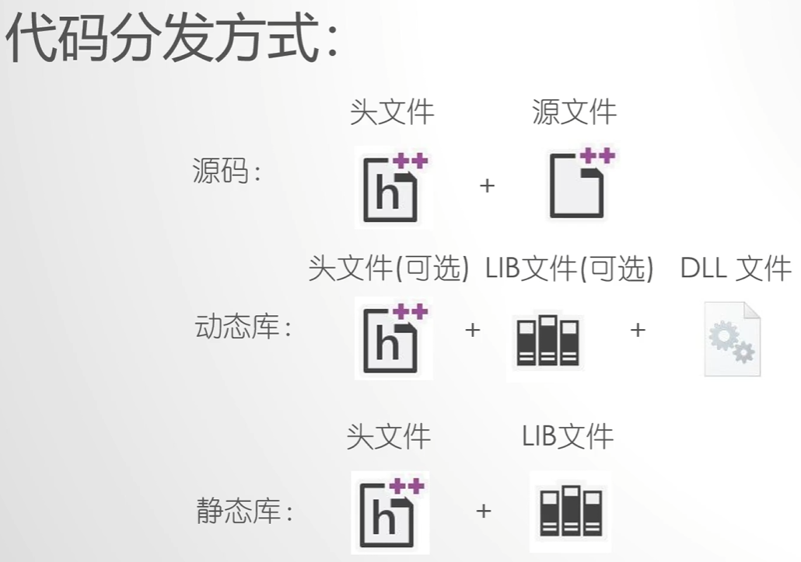
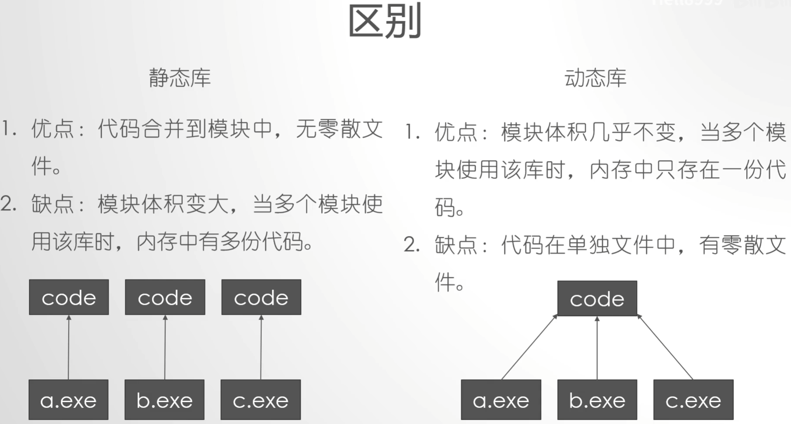
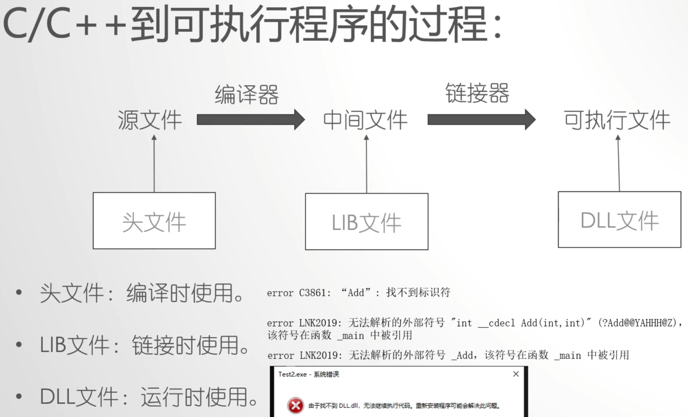

# 什么是库
库是写好的现有的，成熟的，可以复用的代码。现实中每个程序都要依赖很多基础的底层库，不可能每个人的代码都从零开始，因此库的存在意义非同寻常。

本质上来说库是一种可执行代码的二进制形式，可以被操作系统载入内存执行。库有两种：`静态库（.a、.lib）`和`动态库（.so、.dll）`。

所谓静态、动态是指**链接**.

| ##container## |
|:--:|
||
||
||

## 注解
### [1] 参考链接
1. [菜鸟教程-C++静态库与动态库](https://www.runoob.com/w3cnote/cpp-static-library-and-dynamic-library.html)
2. [B站: 动态库与静态库讲解](https://www.bilibili.com/video/BV1XE411k7PN/)