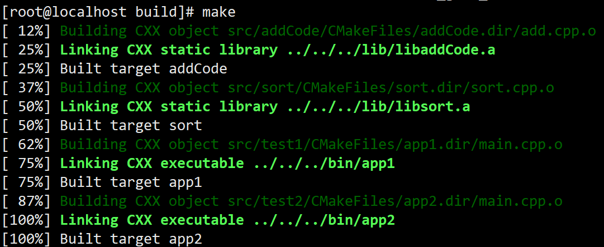

# CMake 的使用
## 嵌套的CMake
如果项目很大，或者项目中有很多的源码目录，在通过 CMake 管理项目的时候如果只使用一个`CMakeLists.txt`，那么这个文件相对会比较复杂，有一种化繁为简的方式就是给每个源码目录都添加一个`CMakeLists.txt`文件（头文件目录不需要），这样每个文件都不会太复杂，而且更灵活，更容易维护。

现在假装我们有一个大型项目:
```bash
.
├── CMakeLists.txt
├── include
│   ├── addCode.h
│   └── sort.h
└── src
    ├── addCode
    │   └── add.cpp
    ├── sort
    │   └── sort.cpp
    ├── test1
    │   └── main.cpp
    └── test2
        └── main.cpp
```
`addCode.h` 实现了一个加法, `sort.h`实现了一个冒泡排序.

并且分别在`test1.cpp`与`test2.cpp`中进行测试...

如果你学过[maven分模块开发与设计](../../../002-Java/005-Maven/007-maven分模块开发与设计/index.md), 应该就知道分模块开发的好处, 堪比金坷垃!

虽然看起来项目结构的变得复杂了, 但是职责更清晰了, 反正不能没有它~

现在让我们来改造它吧!

### 节点关系
众所周知，Linux的目录是树状结构，所以嵌套的 CMake 也是一个树状结构，最顶层的`CMakeLists.txt`是根节点，其次都是子节点。因此，我们需要了解一些关于`CMakeLists.txt`文件变量作用域的一些信息：

- 根节点`CMakeLists.txt`中的变量全局有效
- 父节点`CMakeLists.txt`中的变量可以在子节点中使用
- 子节点`CMakeLists.txt`中的变量只能在当前节点中使用

### 添加子目录
接下来我们还需要知道在 CMake 中父子节点之间的关系是如何建立的，这里需要用到一个 CMake 命令:

```CMake
add_subdirectory(source_dir [binary_dir] [EXCLUDE_FROM_ALL])
```
- `source_dir`: 指定了`CMakeLists.txt`源文件和代码文件的位置，其实就是指定子目录
- `binary_dir`: 指定了输出文件的路径，一般不需要指定，忽略即可。
- `EXCLUDE_FROM_ALL`: 在子路径下的目标默认不会被包含到父路径的ALL目标里，并且也会被排除在IDE工程文件之外。用户必须显式构建在子路径下的目标。

通过这种方式`CMakeLists.txt`文件之间的父子关系就被构建出来了。

### 示例
#### 根 cmake

根目录中的`CMakeLists.txt`文件内容如下:
```CMake
cmake_minimum_required(VERSION 3.15)
project(demo_root)

# 定义变量
set(LIB_PATH ${PROJECT_SOURCE_DIR}/lib)      # 定义生成的库的存放目录
set(EXEC_PATH ${PROJECT_SOURCE_DIR}/bin)     # 定义生成的测试程序的存放目录
set(HEAD_PATH ${PROJECT_SOURCE_DIR}/include) # 定义头文件目录

# 定义静态库的名字
set(ADD_CODE_LIB addCode)
set(SORT_LIB sort)

# 定义可执行程序的名字
set(APP_NAME_1 app1)
set(APP_NAME_2 app2)

# 添加子目录
add_subdirectory(src/addCode)
add_subdirectory(src/sort)
add_subdirectory(src/test1)
add_subdirectory(src/test2)
```

在根节点对应的文件中主要做了两件事情: `定义全局变量`和`添加子目录`。
- 定义的全局变量主要是给子节点使用，目的是为了提高子节点中的`CMakeLists.txt`文件的可读性和可维护性，避免冗余并降低出差的概率。
- 一共添加了四个子目录，每个子目录中都有一个`CMakeLists.txt`文件，这样它们的父子关系就被确定下来了。

#### addCode

```CMake
cmake_minimum_required(VERSION 3.15)
project(demo_add)

aux_source_directory(./ SRC)         # 搜索当前目录所有源文件
include_directories(${HEAD_PATH})    # 包含头文件
set(LIBRARY_OUTPUT_PATH ${LIB_PATH}) # 设置静态库输出路径
add_library(${ADD_CODE_LIB} STATIC ${SRC}) # 生成静态库文件
```

#### sort

```CMake
cmake_minimum_required(VERSION 3.15)
project(demo_sort)

aux_source_directory(./ SRC)         # 搜索当前目录所有源文件
include_directories(${HEAD_PATH})    # 包含头文件
set(LIBRARY_OUTPUT_PATH ${LIB_PATH}) # 设置静态库输出路径
add_library(${SORT_LIB} STATIC ${SRC}) # 生成静态库文件
```

#### test1

```CMake
cmake_minimum_required(VERSION 3.15)
project(demo_test1)

aux_source_directory(./ SRC)         # 搜索当前目录所有源文件
include_directories(${HEAD_PATH})    # 包含头文件
set(EXECUTABLE_OUTPUT_PATH ${EXEC_PATH}) # 设置可执行程序输出路径
link_directories(${LIB_PATH})        # 设置库目录(因为是自定义的库, 所以需要指出路径)
link_libraries(${ADD_CODE_LIB})      # 链接需要的库
add_executable(${APP_NAME_1} ${SRC}) # 生成
```

#### test2

```CMake
cmake_minimum_required(VERSION 3.15)
project(demo_test2)

aux_source_directory(./ SRC)         # 搜索当前目录所有源文件
include_directories(${HEAD_PATH})    # 包含头文件
set(EXECUTABLE_OUTPUT_PATH ${EXEC_PATH}) # 设置可执行程序输出路径
link_directories(${LIB_PATH})        # 设置库目录(因为是自定义的库, 所以需要指出路径)
link_libraries(${SORT_LIB})          # 链接需要的库
add_executable(${APP_NAME_2} ${SRC}) # 生成
```

##### 启动

| ##container## |
|:--:|
||

> [!TIP]
> 注: 至于什么时候使用动态库, 什么时候使用静态库, 实际上是看库的大小的, 如果你觉得库很大, 那么就用动态库吧; 反正都是可以的, 只是可执行程序的大小问题而已.

## 注解
### [1]
参考链接: [CMake 保姆级教程（下）](https://subingwen.cn/cmake/CMake-advanced/)