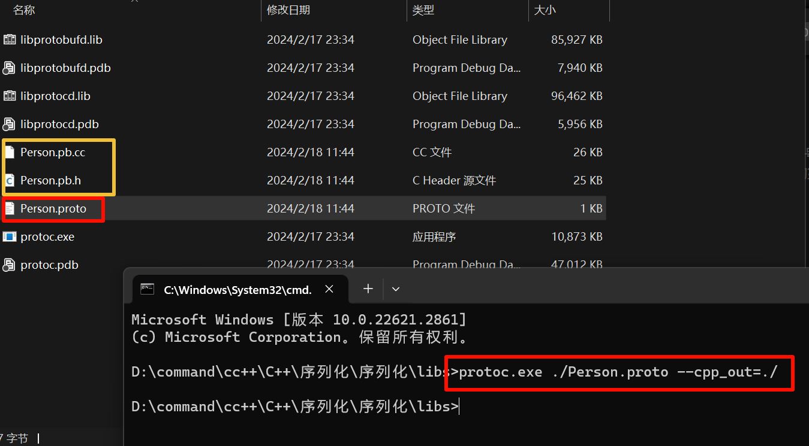

# Portobuf使用
## 使用过程
1. 编写 .proto 文件
2. 创建一个新的文件, 文件名随意指定, 文件后缀为 .proto
3. 根据protobuf的语法, 编辑.proto文件
4. 使用 protoc 命令将 .proto 文件转化为相应的 C++ 文件
    - 源文件: xxx.pb.cc –> xxx对应的名字和 .proto文件名相同
    - 头文件: xxx.pb.h –> xxx对应的名字和 .proto文件名相同
5. 需要将生成的c++文件添加到项目中, 通过文件中提供的类 API 实现数据的序列化/反序列化

## 数据类型对照表
protobuf中的数据类型 和 C++ 数据类型对照表:

| Protobuf类型 | C++ 类型 | 备注 |
| --- | --- | --- |
| double | double | 64位浮点数 |
| float | float | 32位浮点数 |
| int32 | int | 32位整数 |
| int64 | long | 64位整数 |
| uint32 | unsigned int | 32位无符号整数 |
| uint64 | unsigned long | 64位无符号整数 |
| sint32 | signed int | 32位整数，处理负数效率比int32更高 |
| sint64 | signed long | 64位整数，处理负数效率比int64更高 |
| fixed32 | unsigned int(32位) | 总是4个字节。如果数值总是比总是比228大的话，这个类型会比uint32高效。 |
| fixed64 | unsigned long(64位) | 总是8个字节。如果数值总是比总是比256大的话，这个类型会比uint64高效。 |
| sfixed32 | int (32位) | 总是4个字节 |
| sfixed64 | long (64位) | 总是8个字节 |
| bool | bool | 布尔类型 |
| string | string | 一个字符串必须是UTF-8编码或者7-bit ASCII编码的文本 |
| bytes | string | 处理多字节的语言字符、如中文, 建议protobuf中字符型类型使用 bytes |
| enum | enum | 枚举 |
| message | object of class | 自定义的消息类型 |

## Protobuf 语法
### 基础语法

需要格式化的内容

```C++
enum CatType {
    WhiteCat,  // 白猫
    BlackCat,  // 黑猫
    CalicoCat, // 三色猫
    Dragon_Li, // 狸花猫
    GrassCat,  // 草猫
};

struct Person {
    int id;
    string name;
    string sex;    // man woman
    int age;
    struct CatData {
        string catName;
        CatType catType;
        int catId;
    } *cat;    // 可以有多只猫
};
```

接下来，我们需要新建一个文件，给它起个名字，后缀指定为`.proto`，在文件的第一行需要指定Protobuf的版本号，有两个版本Protobuf 2 和 Protobuf 3，此处我们使用的是版本3。

```Protobuf
syntax="proto3";
```

接着需要定义一个消息体，其格式如下：

```Protobuf
message 名字    
{   // message后面的名字就是生成的类的名字，自己指定一个合适的名字即可
    // 类中的成员, 格式
    数据类型 成员名字 = 1; // 数字是序号, 为唯一标识, 不能重复
    数据类型 成员名字 = 2; // 可以跳增, 不建议出现递减 如 8, 4, 7
    数据类型 成员名字 = 3;
       ......     
       ......
}
```

基于上面的语法，上面结构体对应的`.proto`文件的内容可以写成这样:

```Protobuf
syntax="proto3";

enum CatType
{
    // [注意]: 枚举元素之间使用分号间隔 ;
    // 并且需要注意一点proto3中的第一个枚举值必须为 0，第一个元素以外的元素值可以随意指定。
    WhiteCat = 0;  // 白猫
    BlackCat = 1;  // 黑猫
    CalicoCat = 2; // 三色猫
    Dragon_Li = 3; // 狸花猫
    GrassCat = 6;  // 草猫
}

message CatData
{
    bytes catName = 1;
    int32 catId = 2;
    CatType catType = 3;
}

message Person
{
    int32 id = 1;
    bytes name = 2;
    bytes sex = 3;
    int32 age = 4;
    // 在使用Protocol Buffers（Protobuf）中，可以使用repeated关键字作为限定修饰符来表示一个字段可以有多个值，即重复出现的字段。
    // repeated关键字可以用于以下数据类型：基本数据类型、枚举类型和自定义消息类型。
    repeated CatData cats = 5;
    // 当然还有其他规则:
    // 字段规则：required -> 字段只能也必须出现 1 次
    // 字段规则：optional -> 字段可出现 0 次或1次
    // 字段规则：repeated -> 字段可出现任意多次（包括 0）
}
```

### 多文件的使用
实际上很简单, 我不多赘述

```Protobuf
syntax = "proto3"; // 本文件命名为 cat.proto

enum CatType
{
    WhiteCat = 0;  // 白猫
    BlackCat = 1;  // 黑猫
    CalicoCat = 2; // 三色猫
    Dragon_Li = 3; // 狸花猫
    GrassCat = 6;  // 草猫
}

message CatData
{
    bytes catName = 1;
    int32 catId = 2;
    CatType catType = 3;
}
```

```Protobuf
syntax = "proto3";
import "cat.proto"

message Person
{
    int32 id = 1;
    bytes name = 2;
    bytes sex = 3;
    int32 age = 4;
    repeated CatData cats = 5;
}
```

- import语句中指定的文件路径可以是相对路径或绝对路径。如果文件在相同的目录中，只需指定文件名即可。
- 导入的文件将会在编译时与当前文件一起被编译。
- 导入的文件也可以继续导入其他文件，形成一个文件依赖的层次结构。

### 包的使用
应用场景: 如果员工a已经命名了一个cat`message`, 那么如果我们再命名一个, 显然就会发生冲突. 在C++中, 我们可以使用命名空间来避免, 一样的Protobuf中我们就需要用到包来区分

还是非常的简单

在一个`.proto`文件中，可以通过在顶层使用`package`关键字来定义包:
```Protobuf
syntax = "proto3"; // 本文件命名为 cat.proto
package MyCatPackage;

enum CatType
{
    WhiteCat = 0;  // 白猫
    BlackCat = 1;  // 黑猫
    CalicoCat = 2; // 三色猫
    Dragon_Li = 3; // 狸花猫
    GrassCat = 6;  // 草猫
}

message CatData
{
    bytes catName = 1;
    int32 catId = 2;
    CatType catType = 3;
}
```

```Protobuf
syntax = "proto3";
import "cat.proto"
package MyPersonPackage;

message Person
{
    int32 id = 1;
    bytes name = 2;
    bytes sex = 3;
    int32 age = 4;
    repeated MyCatPackage.CatData cats = 5; // 使用 包名.自定义类型名即可(enum/message)
}
```

## 编译
我们把代码写到`Person.proto`(使用单文件并且不分包), 然后编译(*来源按照[protobuf安装](../001-protobuf安装/index.md)中`神`那个连接来编译CMake得到的exe, 并且默认已经配置好VS2022*):

| ##container## |
|:--:|
||


## 序列化和反序列化
### 序列化
其使用为`类.方法`
```C++
// 头文件目录: google\protobuf\message_lite.h
// --- 将序列化的数据 数据保存到内存中
// 将类对象中的数据序列化为字符串, c++ 风格的字符串, 参数是一个传出参数
bool SerializeToString(std::string* output) const;
// 将类对象中的数据序列化为字符串, c 风格的字符串, 参数 data 是一个传出参数
bool SerializeToArray(void* data, int size) const;

// ------ 写磁盘文件, 只需要调用这个函数, 数据自动被写入到磁盘文件中
// -- 需要提供流对象/文件描述符关联一个磁盘文件
// 将数据序列化写入到磁盘文件中, c++ 风格
// ostream 子类 ofstream -> 写文件
bool SerializeToOstream(std::ostream* output) const;
// 将数据序列化写入到磁盘文件中, c 风格
bool SerializeToFileDescriptor(int file_descriptor) const;
```

### 反序列化

```C++
// 头文件目录: google\protobuf\message_lite.h
bool ParseFromString(const std::string& data) ;
bool ParseFromArray(const void* data, int size);

// istream -> 子类 ifstream -> 读操作
// wo ri
// w->写 o: ofstream , r->读 i: ifstream
bool ParseFromIstream(std::istream* input);
bool ParseFromFileDescriptor(int file_descriptor);
```

## 示例代码

```C++
#include <iostream>
#include <cstdio>
#include "Person.pb.h" // 假设你已经生成了这个了

using namespace std;

int main(void)
{
    Person p;
    p.set_id(6);
    p.set_age(27);
    p.set_name(std::string("张三"));
    p.set_sex("男");

    // 每次调用add_cats()函数后, 都会返回一个指向新添加的CatData对象, 故可以通过返回值进行设置
    // 创建第一只猫的CatData对象
    CatData* cat1 = p.add_cats();
    //cat1->set_catname(std::wstring(L"猫一")); // 不支持 w_char ?!
    cat1->set_catname(std::string("猫一"));
    cat1->set_catid(1);
    cat1->set_cattype(WhiteCat);

    // 创建第二只猫的CatData对象
    CatData* cat2 = p.add_cats();
    cat2->set_catname("猫二");
    cat2->set_catid(2);
    cat2->set_cattype(BlackCat);

    // 序列化
    std::string pData;
    p.SerializeToString(&pData);

    // --- 解析数据 --
    // 反序列化
    Person pp;
    pp.ParseFromString(pData); // 反序列化后, 数据存放于 pp 类的成员变量中

    printf("id: %d, 名称: %s, 性别: %s, 年龄: %d, 养的猫: %d 只\n", pp.id(), pp.name().c_str(), pp.sex().c_str(), pp.age(), pp.cats_size());

    for (int i = 0; i < pp.cats_size(); ++i) {
        auto it = pp.cats(i);
        printf("id: %d, 猫名: %s, Type = %d\n", it.catid(), it.catname().c_str(), it.cattype());
    }

    return 0;
}
```


### 过度封装的情况

考虑以下数据(节选)

```Protobuf
// 坐标
message Position {
    float x = 1;
    float y = 2;
}

// <子弹> 移动属性(用于碰撞判定)
message MobileProperties {
    Position unit_vector = 1;   // 单位方向向量
    float moving_distance = 2;  // 移动距离
    float max_range = 3;        // 射程(最远的移动距离)
    float movement_speed = 4;   // 移速(单次移动的距离)
    int32 tag = 5;              // 标识 <敌/我/均会>
    int32 move_type = 6;        // 移动方式 <根据向量/跟踪>
}

// 子弹实体
message Bullet {
    BulletAttributes bullet_Attributes = 1;
    Position position = 2;
    uint32 id = 3;
}

// 玩家实体
message Player {
    BulletAttributes bullet_Attributes = 1;    // 子弹属性
    BiologicalProperties properties = 2;    // 生物属性
    Position position = 3;                  // 坐标
    uint32 money = 4;                       // 金币
    uint32 star = 5;                        // 更加宝贵的货币
    bytes name = 6;                         // 玩家名称
}

// 传输使用的包
message NetPack {
    NetPackType msg_type = 1;      // 消息类型
    // 同步使用
    repeated Bullet bullet_Arr = 2;         // 子弹实体
    repeated Player player_Arr = 3;         // 玩家实体
    // 怪物的...
    repeated PlayerMove playerMove = 4;     // 玩家移动
    repeated PlayerRename playerRename = 5; // 玩家改名
    uint32 givePlayerId = 6;                // 给于玩家id
    uint32 giveBulletId = 7;                // 给于子弹id
}
```

会使用起来非常繁琐, (但是要封装肯定得这样了qwq)
```C++
// --- 同步 ---
gameNetData::NetPack netPack;
std::string str_data;

game::GlobalGameData::getGlobalGameDataPtr()->getPlayerVectorPtr()->push_back(game::Player(game::max_player_num));

// 同步当前的所有信息
// 玩家数组信息
netPack.set_msg_type(gameNetData::NetPackType::PlayerJoinRoomMsg);
for (auto& it : *game::GlobalGameData::getGlobalGameDataPtr()->getPlayerVectorPtr()) {
    gameNetData::Player* player = netPack.add_player_arr();
    player->set_name(HX::tools::to_byte_string(it.getName()));
    player->set_money(it.getMoney());
    player->set_star(it.getStar());
  
    // --- 生物通用属性 ---
    game::BiologicalProperties* propertiesPtr = it.getBiologicalProperties();
    gameNetData::BiologicalProperties* propertiesData = new gameNetData::BiologicalProperties;
    propertiesData->set_bullet_fork(propertiesPtr->bullet_fork);
    propertiesData->set_dropped_money(propertiesPtr->dropped_money);
    propertiesData->set_firing_interval(propertiesPtr->firing_interval);
    propertiesData->set_fork_angle(propertiesPtr->fork_angle);
    propertiesData->set_hp(propertiesPtr->HP);
    propertiesData->set_id(propertiesPtr->id);
    propertiesData->set_movement_speed(propertiesPtr->movement_speed);
    player->set_allocated_properties(propertiesData);
  
    // --- 子弹属性 ---
    game::BulletAttributes* bulletPtr = it.getBulletAttributes();
    gameNetData::BulletAttributes* bulletData = new gameNetData::BulletAttributes;
    gameNetData::MobileProperties* b_moveData = new gameNetData::MobileProperties;
    gameNetData::BulletDamage* b_damageData = new gameNetData::BulletDamage;
    gameNetData::Position* b_unitVector = new gameNetData::Position;
  
    // --- 子弹方向向量 ---
    b_unitVector->set_x(bulletPtr->move_properties.unit_vector.x);
    b_unitVector->set_y(bulletPtr->move_properties.unit_vector.y);
  
    // --- 子弹移动属性 ---
    b_moveData->set_allocated_unit_vector(b_unitVector);
    b_moveData->set_max_range(bulletPtr->move_properties.max_range);
    b_moveData->set_movement_speed(bulletPtr->move_properties.movement_speed);
    b_moveData->set_move_type(bulletPtr->move_properties.move_type);
    b_moveData->set_moving_distance(bulletPtr->move_properties.moving_distance);
    b_moveData->set_tag(bulletPtr->move_properties.tag);
  
    // --- 子弹伤害计算属性 ---
    b_damageData->set_blast_radius(bulletPtr->damage.blast_radius);
    b_damageData->set_bullet_radius(bulletPtr->damage.bullet_radius);
    b_damageData->set_damage(bulletPtr->damage.damage);
    b_damageData->set_moderate(bulletPtr->damage.moderate);
    b_damageData->set_penetrate(bulletPtr->damage.penetrate);
  
    bulletData->set_allocated_damage(b_damageData);
    bulletData->set_allocated_move_properties(b_moveData);
    bulletData->set_playerappearanceptrtype(game::BulletAppearanceTag::PlayerBullet); // 子弹外观设置
  
    // 整合到
    player->set_allocated_bullet_attributes(bulletData);
}
```
## 值得注意的是
### new 不会内存泄漏
值得注意的是, 他这里`new`的对象指针传入实体后, 内存会自动释放, 我们不需要理会!
如: (节选)

反倒是临时变量的取地址会导致野指针的出现(被提前被释放了(出了临时变量的生命周期)), 使用智能指针也会可能导致bug, 所以放心`new`

```C++
gameNetData::BulletAttributes* bulletData = new gameNetData::BulletAttributes;
gameNetData::MobileProperties* b_moveData = new gameNetData::MobileProperties;
gameNetData::BulletDamage* b_damageData = new gameNetData::BulletDamage;

bulletData->set_allocated_damage(b_damageData);
bulletData->set_allocated_move_properties(b_moveData);

// 整合到
player->set_allocated_bullet_attributes(bulletData);
```

### 序列化/反序列化需要完整的长度

反序列化的size应该是`有效数据`的长度, 而不是数组的最大长度, 以防止数据过度解析!

*(实际上序列化后的二进制里面应该会包含实际的长度信息, 但是为了不要浪费计算机资源(?)还是使用`有效长度`更好)*

```C++
// 节选一
char str_data[STR_MAX_SIZE];
gameNetData::NetPack netPack;

while (game::game_playing && this->clientPtr) {
    memset(str_data, 0, sizeof(str_data));
    int len = ::recv(this->clientPtr->getSerSocket(), str_data, STR_MAX_SIZE, 0);
    if (len <= 0)
        break; // 错误处理 - 断开连接
    netPack.ParseFromArray(str_data, len);
}
```

### 使用更高效的方式 mutable_fieldname

- mutable_fieldname:
    - `mutable_fieldname()`用于获取指向可变消息字段的指针，允许开发者直接修改此字段。

```C++
// 同步当前的所有信息
// 玩家数组信息
netPack.set_msg_type(gameNetData::NetPackType::PlayerJoinRoomMsg);
for (auto& it : *game::GlobalGameData::getGlobalGameDataPtr()->getPlayerVectorPtr()) {
    gameNetData::Player* player = netPack.add_player_arr();
    player->set_name(HX::tools::to_byte_string(it.getName()));
    player->set_money(it.getMoney());
    player->set_star(it.getStar());

    // --- 生物通用属性 ---
    game::BiologicalProperties* propertiesPtr = it.getBiologicalProperties();
    gameNetData::BiologicalProperties* propertiesData = player->mutable_properties();
    propertiesData->set_bullet_fork(propertiesPtr->bullet_fork);
    propertiesData->set_dropped_money(propertiesPtr->dropped_money);
    propertiesData->set_firing_interval(propertiesPtr->firing_interval);
    propertiesData->set_fork_angle(propertiesPtr->fork_angle);
    propertiesData->set_hp(propertiesPtr->HP);
    propertiesData->set_id(propertiesPtr->id);
    propertiesData->set_movement_speed(propertiesPtr->movement_speed);

    // --- 坐标信息 ---
    gameNetData::Position* posPtr = player->mutable_position();
    posPtr->set_x(it.getPosition().x);
    posPtr->set_y(it.getPosition().y);

    // --- 子弹属性 ---
    game::BulletAttributes* bulletPtr = it.getBulletAttributes();
    gameNetData::BulletAttributes* bulletData = player->mutable_bullet_attributes();
    gameNetData::MobileProperties* b_moveData = bulletData->mutable_move_properties();
    gameNetData::BulletDamage* b_damageData = bulletData->mutable_damage();
    gameNetData::Position b_unitVector;

    // --- 子弹方向向量 ---
    b_unitVector.set_x(bulletPtr->move_properties.unit_vector.x);
    b_unitVector.set_y(bulletPtr->move_properties.unit_vector.y);

    // --- 子弹移动属性 ---
    b_moveData->mutable_unit_vector()->CopyFrom(b_unitVector);
    b_moveData->set_max_range(bulletPtr->move_properties.max_range);
    b_moveData->set_movement_speed(bulletPtr->move_properties.movement_speed);
    b_moveData->set_move_type(bulletPtr->move_properties.move_type);
    b_moveData->set_moving_distance(bulletPtr->move_properties.moving_distance);
    b_moveData->set_tag(bulletPtr->move_properties.tag);

    // --- 子弹伤害计算属性 ---
    b_damageData->set_blast_radius(bulletPtr->damage.blast_radius);
    b_damageData->set_bullet_radius(bulletPtr->damage.bullet_radius);
    b_damageData->set_damage(bulletPtr->damage.damage);
    b_damageData->set_moderate(bulletPtr->damage.moderate);
    b_damageData->set_penetrate(bulletPtr->damage.penetrate);

    bulletData->set_playerappearanceptrtype(game::BulletAppearanceTag::PlayerBullet); // 子弹外观设置
}
```
