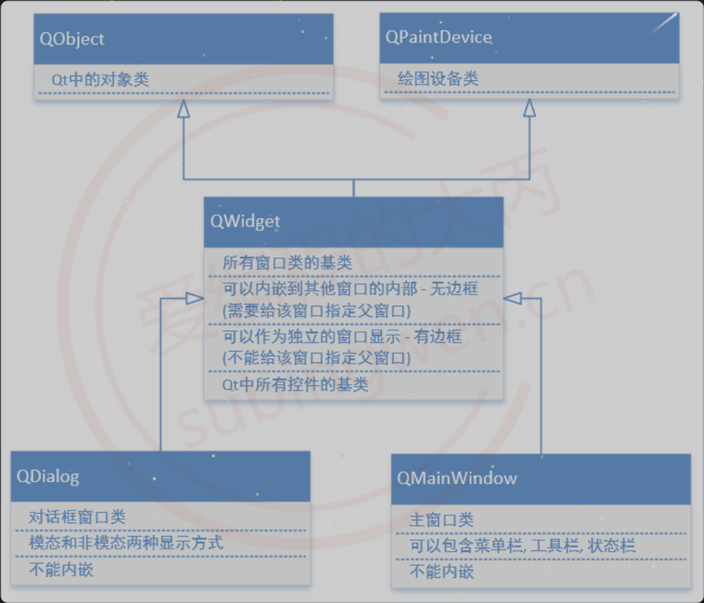
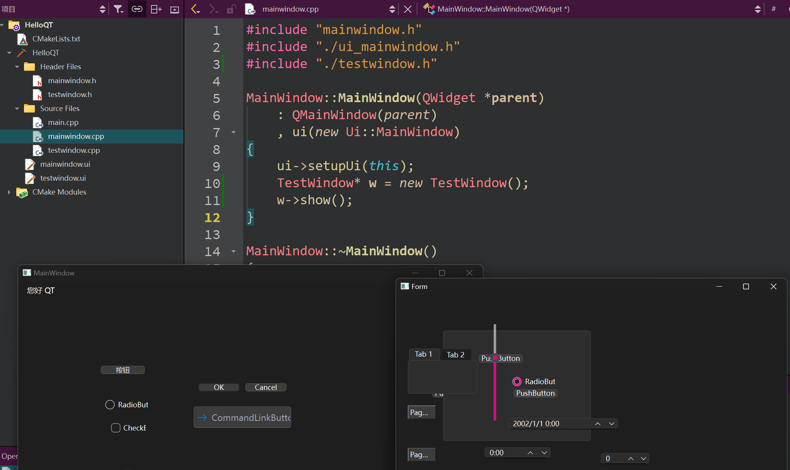
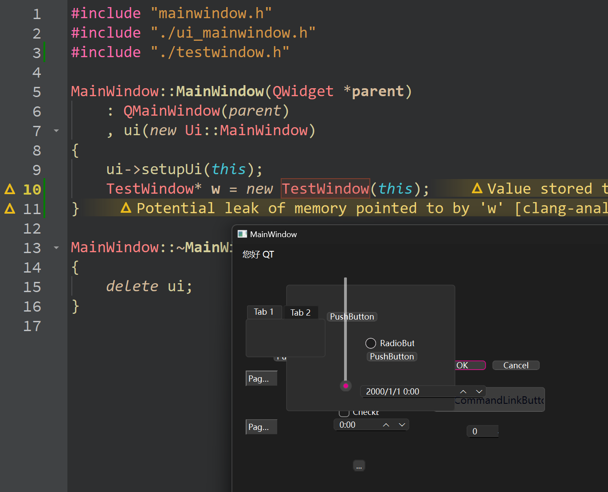
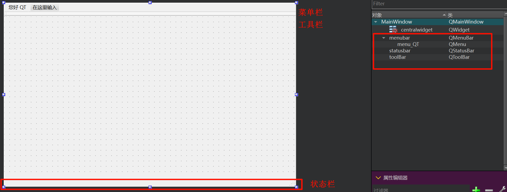

# 二、QT中的窗口类
我们在通过Qt向导窗口基于窗口的应用程序的项目过程中倒数第二步让我们选择跟随项目创建的第一个窗口的基类, 下拉菜单中有三个选项, 分别为: QMainWindow、QDialog、QWidget如下图:

| ##container## |
|:--:|
||

## 2.1 Qwidget

| ##container## |
|:--:|
||

如上代码, 如果我们直接这样, 创建出来的是两个独立的窗口, TestWindow窗口必需要`->show`才可以显示; 并且和窗口MainWindo无关.

而: TestWindow默认生成的构造函数, 可以传入一个`QWidget`指针, 作为父窗口

```C++
// 如果创建一个窗口对象的时候给其指定了父对象, 这个窗口就不是一个独立窗口
// 这样的话当前父窗口显示的时候, 子窗口就一并被显示出来了
// 这时候子窗口是没有边框的
explicit TestWindow(QWidget *parent = nullptr);
```

得到的界面就是这样:

| ##container## |
|:--:|
||

原本的子窗口内嵌到父窗口里面了

## 2.2 窗口的显示
- 内嵌窗口
    - 依附于某一个大的窗口, 作为了大窗口的一部分
    - 大窗口就是这个内嵌窗口的父窗口
    - 父窗口显示的时候, 内嵌的窗口也就被显示出来了
- 不内嵌窗口
    - 这类窗口有边框, 有标题栏
    - 需要调用函数才可以显示

## 2.3 QDialog类型的窗口特点

```C++
MainWindow::MainWindow(QWidget *parent)
    : QMainWindow(parent)
    , ui(new Ui::MainWindow)
{
    ui->setupUi(this);

    TestWindow* w = new TestWindow(); // 创建子窗口
    w->show(); // 非模态

    TestDialog* td = new TestDialog(this); // 创建 QDialog 窗口
    td->exec(); // 模态的 (会阻塞, 并且执行操作只能执行当前窗口内的)

    td->show(); // 即便这样(指定了this), 也不是内嵌在父窗口的, 是独立的小窗口
}
```

## 2.4 QMainWindow类型的窗口的特点

我们创建项目的默认的窗口就是继承QMainWindow的
```C++
class MainWindow : public QMainWindow {};
```

特点, 它具有菜单栏、工具栏(可以有多个)、状态栏

| ##container## |
|:--:|
||

(可以在右边右键增加/删除)

## 附. 参考链接
- [QT入门](https://subingwen.cn/qt/qt-primer/#4-Qt%E4%B8%AD%E7%9A%84%E7%AA%97%E5%8F%A3%E7%B1%BB)