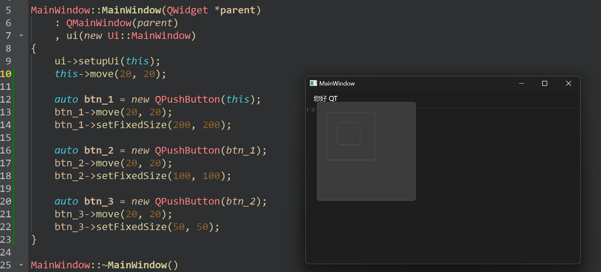

# 三、坐标体系
在Qt关于窗口的显示是需要指定位置的，这个位置是通过坐标来确定的，所有坐标的选取又都是基于坐标原点来确定的;

## 3.1 窗口的坐标原点
所有坐标的确定都需要先找到坐标原点, Qt的坐标原点在窗口的左上角
- x轴向右递增
- y轴向下递增

```C++
+------------------> x
| 原点
|
|
|
|
V
y
```

## 3.2 窗口的相对坐标
在一个Qt窗口中一般都有很多子窗口内嵌到这个父窗口中，其中每个窗口都有自己的坐标原点，子窗口的位置也就是其使用的坐标点就是它的父窗口坐标体系中的坐标点。

| ##container## |
|:--:|
||

```C++
MainWindow::MainWindow(QWidget *parent)
    : QMainWindow(parent)
    , ui(new Ui::MainWindow)
{
    ui->setupUi(this);
    this->move(20, 20); // 这个位移计算相对于屏幕的了

    auto btn_1 = new QPushButton(this); // 设置父窗口
    btn_1->move(20, 20); // 相对于父窗口的原点 移动
    btn_1->setFixedSize(200, 200); // 设置 btn_1 的大小

    auto btn_2 = new QPushButton(btn_1);
    btn_2->move(20, 20);
    btn_2->setFixedSize(100, 100);

    auto btn_3 = new QPushButton(btn_2);
    btn_3->move(20, 20);
    btn_3->setFixedSize(50, 50);
}
```

```C++
// 所有窗口类的基类: QWidget
// QWidget中提供了移动窗口的 API函数/方法
// 参数 x, y是要移动的窗口的左上角的点, 窗口的左上角移动到这个坐标点
void QWidget::move(int x, int y);
void QWidget::move(const QPoint &);
```
