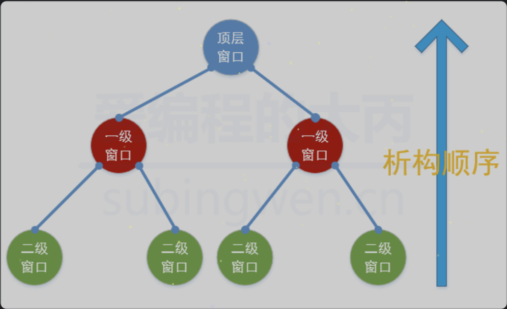

# 四、QT中的内存回收机制
在Qt中创建对象的时候会提供一个 **Parent对象指针**（可以查看类的构造函数），下面来解释这个parent到底是干什么的。

<span style="color:red">当你创建一个`QObject`对象时，会看到`QObject`的构造函数接收一个`QObject`指针作为参数，这个参数就是 parent，也就是父对象指针。</span>这相当于，在创建`QObject`对象时，可以提供一个其父对象，我们创建的这个`QObject`对象会自动添加到其父对象的`children()`列表。当父对象析构的时候，这个列表中的所有对象也会被析构。（注意，<span style="color:red">这里的父对象并不是继承意义上的父类！</span>）

QWidget是能够在屏幕上显示的一切组件的父类。QWidget继承自`QObject`，因此也继承了这种对象树关系。一个孩子自动地成为父组件的一个子组件。因此，它会显示在父组件的坐标系统中，被父组件的边界剪裁。例如，当用户关闭一个对话框的时候，应用程序将其删除，那么，我们希望属于这个对话框的按钮、图标等应该一起被删除。事实就是如此，因为这些都是对话框的子组件。

Qt 引入对象树的概念，在一定程度上解决了内存问题。

- 当一个`QObject`对象在堆上创建的时候，Qt 会同时为其创建一个对象树。不过，对象树中对象的顺序是没有定义的。这意味着，销毁这些对象的顺序也是未定义的。

- 任何对象树中的 `QObject`对象 delete 的时候，如果这个对象有 parent，则自动将其从 parent 的`children()`列表中删除；如果有孩子，则自动 delete 每一个孩子。Qt 保证没有`QObject`会被 delete 两次，这是由析构顺序决定的。

| ##container## |
|:--:|
||
|对象树|

综上所述, 我们可以得到一个结论: Qt中有内存回收机制, 但是不是所有被new出的对象被自动回收, 满足条件才可以回收, 如果想要在Qt中实现内存的自动回收, 需要满足以下两个条件:

- 创建的对象必须是QObject类的子类(间接子类也可以)
    - QObject类是没有父类的, Qt中有很大一部分类都是从这个类派生出去的
        - Qt中使用频率很高的窗口类和控件都是 QObject 的直接或间接的子类
        - 其他的类可以自己查阅Qt帮助文档

- 创建出的类对象, 必须要指定其父对象是谁, 一般情况下有两种操作方式:

```C++
// 方式1: 通过构造函数
// parent: 当前窗口的父对象, 找构造函数中的 parent 参数即可
QWidget::QWidget(QWidget *parent = Q_NULLPTR, Qt::WindowFlags f = Qt::WindowFlags());
QTimer::QTimer(QObject *parent = nullptr);

// 方式2: 通过setParent()方法
// 假设这个控件没有在构造的时候指定符对象, 可以调用QWidget的api指定父窗口对象
void QWidget::setParent(QWidget *parent);
void QObject::setParent(QObject *parent);
```

## 4.1 代码示例


```C++
MainWindow::MainWindow(QWidget *parent)
    : QMainWindow(parent)
    , ui(new Ui::MainWindow)
{
    ui->setupUi(this);
    this->move(200, 200);

    TestWindow* w = new TestWindow(this); // this析构的时候会调用 w 的析构
    w->move(0, 0);

    // 注: 假设 w 是一个独立出来的窗口(比如 Dialog 窗口), 
    // 那么关闭它的时候, 它并不会析构, 而等到 this 窗口关闭, w 才会析构
}
```

```C++
#include <QDebug>

TestWindow::~TestWindow() {
    delete ui;
    qDebug() << "我被析构啦~";
}
```
