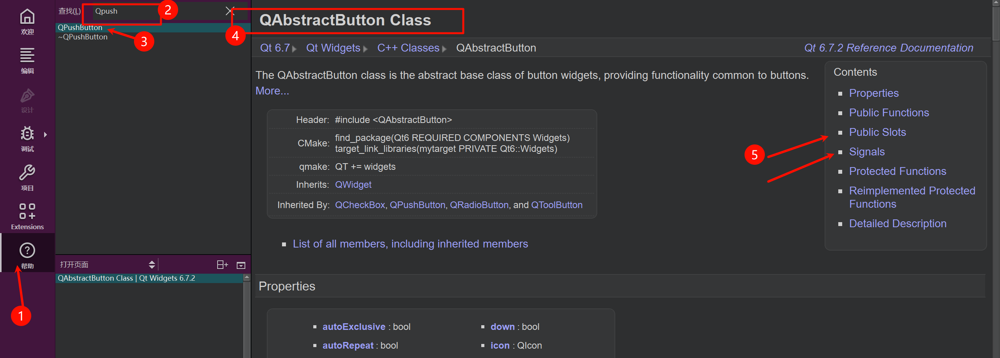
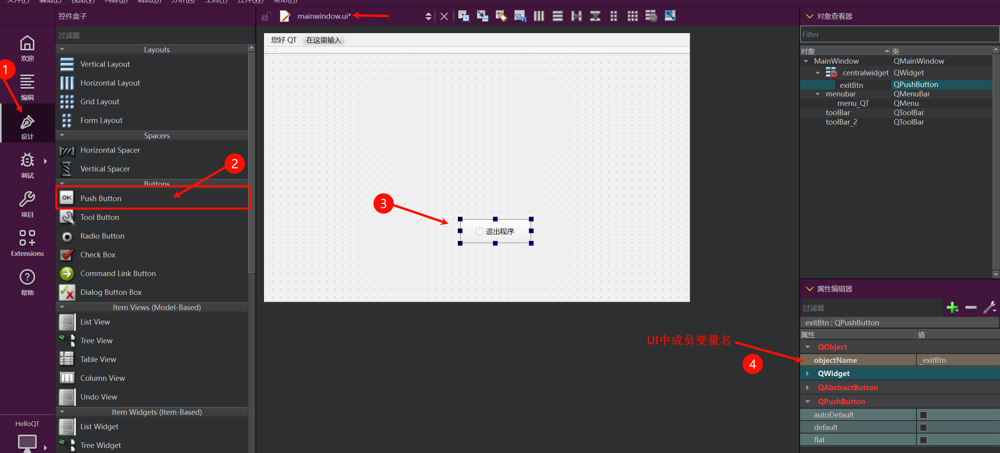
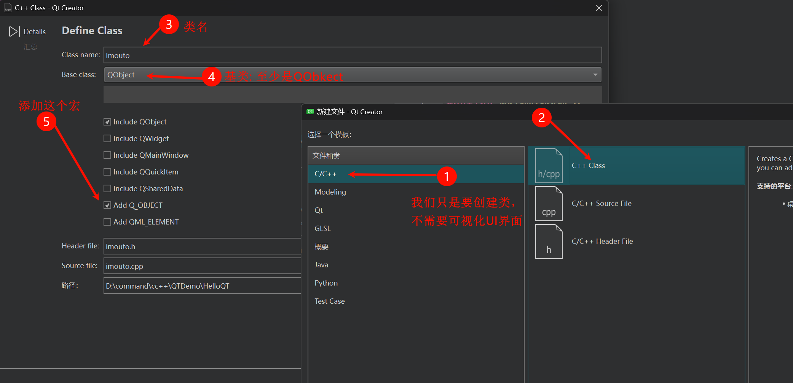

# 一、Qt中的信号槽
## 1.1 信号和槽概述
> 信号槽是 Qt 框架引以为豪的机制之一。所谓信号槽，实际就是[观察者模式](../../../../../../../001-计佬常識/002-设计模式/009-行为型模式/007-观察者模式/index.md)(发布-订阅模式)。当某个`事件`发生之后，比如，按钮检测到自己被点击了一下，它就会发出一个信号（signal）。这种发出是没有目的的，类似广播。如果有对象对这个信号感兴趣，它就会使用连接（connect）函数，意思是，将想要处理的信号和自己的一个函数（称为槽（slot））绑定来处理这个信号。也就是说，当信号发出时，被连接的槽函数会自动被回调。这就类似观察者模式：当发生了感兴趣的事件，某一个操作就会被自动触发。

### 1.1.1 信号的本质
> 信号是由于用户对窗口或控件进行了某些操作，导致窗口或控件产生了某个特定事件，这时候Qt对应的窗口类会发出某个信号，以此对用户的挑选做出反应。

因此根据上述的描述我们得到一个结论 -- `信号的本质就是事件`，比如:
- 按钮单击、双击
- 窗口刷新
- 鼠标移动、鼠标按下、鼠标释放
- 键盘输入

那么在Qt中信号是通过什么形式呈现给使用者的呢?

- 我们对哪个窗口进行操作, 哪个窗口就可以捕捉到这些被触发的事件。

- 对于使用者来说触发了一个事件我们就可以得到Qt框架给我们发出的某个特定信号。

- 信号的呈现形式就是函数， 也就是说某个事件产生了， Qt框架就会调用某个对应的信号函数， 通知使用者。

`在QT中信号的发出者是某个实例化的类对象，对象内部可以进行相关事件的检测。`

### 1.1.2 槽的本质
在Qt中槽函数是一类特殊的功能的函数，在编码过程中也可以作为类的普通成员函数来使用。之所以称之为槽函数是因为它们还有一个职责就是对Qt框架中产生的信号进行处理。

```text
举个简单的例子：

    女朋友说：“我肚子饿了！”，于是我带她去吃饭。
```

上边例子中相当于女朋友发出了一个信号， 我收到了信号并其将其处理掉了。

| 实例对象 | 角色 | 描述 |
| --- | --- | --- |
| 女朋友 | 信号发出者 | 信号携带的信息: `我饿了` |
| 我 | 信号接收者 | 处理女朋友发射的信号: `带他去吃饭` |

`在Qt中槽函数的所有者也是某个类的实例对象。`

### 1.1.3 信号和槽的关系
在Qt中信号和槽函数都是独立的个体，本身没有任何联系，但是由于某种特性需求我们可以将二者连接到一起，好比牛郎和织女想要相会必须要有喜鹊为他们搭桥一样。在Qt中我们需要使用`QOjbect类`中的`connect函数`进二者的关联。

> 连接信号和槽的`connect()`函数原型如下, 其中`PointerToMemberFunction`是一个指向函数地址的指针

```C++
QMetaObject::Connection QObject::connect(
        const QObject *sender, PointerToMemberFunction signal, 
        const QObject *receiver, PointerToMemberFunction method, 
        Qt::ConnectionType type = Qt::AutoConnection);
/* 参数:
  - sender:   发出信号的对象
  - signal:   属于sender对象, 信号是一个函数, 这个参数的类型是函数
              指针, 信号函数地址
  - receiver: 信号接收者
  - method:   属于receiver对象, 当检测到sender发出了signal信号, 
              receiver对象调用method方法，信号发出之后的处理动作 */
 
//  参数 signal 和 method 都是函数地址, 因此简化之后的 connect() 如下:
connect(const QObject *sender, &QObject::signal, 
        const QObject *receiver, &QObject::method);
```

<span style="color:red">

使用`connect()`进行信号槽连接的注意事项:

- connect函数相对于做了信号处理动作的注册

- 调用`conenct`函数的`sender`对象的信号并没有产生, 因此`receiver`对象的`method`也不会被调用

- `method`槽函数本质是一个回调函数, 调用的时机是信号产生之后, 调用是Qt框架来执行的

- `connect`中的`sender`和`recever`两个指针必须被实例化了, 否则`conenct`不会成功

</span>

## 1.2 标准信号槽使用
### 1.2.1 标准信号/槽
> 在Qt提供的很多标准类中都可以对用户触发的某些特定事件进行检测, 因此当用户做了这些操作之后, 事件被触发类的内部就会产生对应的信号, 这些信号都是Qt类内部自带的, 因此称之为标准信号。
>
> 同样的，在Qt的很多类内部为我了提供了很多功能函数，并且这些函数也可以作为触发的信号的处理动作，有这类特性的函数在Qt中称之为标准槽函数。
>
> 系统自带的信号和槽通常如何查找呢，这个就需要利用帮助文档了，比如在帮助文档中查询按钮的点击信号，那么需要在帮助文档中输入`QPushButton`

> 首先我们可以在`Contents`中寻找关键字`signals`，信号的意思，但是我们发现并没有找到，这时候我们应该看当前类从父类继承下来了哪些信号

因此我们去他的父类`QAbstractButton`中就可以找到该关键字，点击`signals`索引到系统自带的信号有如下几个:

| ##container## |
|:--:|
||

### 1.2.2 使用
掌握标准信号、槽的查找方式之后以及`connect()`函数的作用之后, 下面通过一个简单的例子给大家讲解一下他们的使用方式。

```text
功能实现： 点击窗口上的按钮, 关闭窗口
功能分析:
    - 按钮: 信号发出者          -> QPushButton 类型
    - 窗口: 信号的接收者和处理者  -> QWidget 类型
```

需要使用的标准信号槽函数:

```C++
// 单击按钮发出的信号
[signal] void QAbstractButton::clicked(bool checked = false)
// 关闭窗口的槽函数
[slot] bool QWidget::close();
```

准备一个按钮:

| ##container## |
|:--:|
||

然后就是:

```C++
MainWindow::MainWindow(QWidget *parent)
    : QMainWindow(parent)
    , ui(new Ui::MainWindow)
{
    ui->setupUi(this);
    // 单击按钮关闭窗口
    connect(
        ui->_exitBtn,           // (信号发出者) 按钮指针
        &QPushButton::clicked,  // 注册监测: 发出的信号
        this,                   // (信号接收者) 窗口指针
        &MainWindow::close      // 处理信号的方法 (回调函数)
    );
}
```

> [!TIP]
> <span style="color:yellow">`connect()`操作一般写在窗口的构造函数中, 相当于在事件产生之前在qt框架中先进行注册, 这样在程序运行过程中假设产生了按钮的点击事件, 框架就会调用信号接收者对象对应的槽函数了, 如果信号不产生, 槽函数也就一直不会被调用。</span>

## 1.3 自定义信号槽使用
> Qt框架提供的信号槽在某些特定场景下是无法满足我们的项目需求的，因此我们还设计自己需要的的信号和槽，同样还是使用`connect()`对自定义的信号槽进行连接。

如果想要在QT类中自定义信号槽, 需要满足一些条件, 并且有些事项也需要注意:

- <span style="color:gold">要编写新的类并且让其继承Qt的某些标准类</span>
- <span style="color:yellow">这个新的子类必须从`QObject`类或者是`QObject`子类进行派生</span>
- <span style="color:red">在定义类的头文件中加入 Q_OBJECT 宏</span>

```C++
// 在头文件派生类的时候, 首先像下面那样引入Q_OBJECT宏：
class MyMainWindow : public QWidget {
    Q_OBJECT
    ......
}
```

### 1.3.1 自定义信号
> 在Qt中信号的本质是事件, 但是在框架中也是以函数的形式存在的, 只不过信号对应的函数只有声明, 没有定义。如果Qt中的标准信号不能满足我们的需求，可以在程序中进行信号的自定义，当自定义信号对应的事件产生之后，认为的将这个信号发射出去即可（其实就是调用一下这个信号函数）。

下边给大家阐述一下, 自定义信号的要求和注意事项:
- 信号是类的成员函数
- 返回值必须是`void`类型
- 信号的名字可以根据实际情况进行指定
- 参数可以随意指定, 信号也支持重载
- 信号需要使用`signals`关键字进行声明, 使用方法类似于`public`等关键字
- <span style="color:gold">信号函数只需要声明, 不需要定义(没有函数体实现)</span>
- 在程序中发射自定义信号: 发送信号的本质就是调用信号函数
    - 习惯性在信号函数前加关键字: `emit`, 但是可以省略不写
    - `emit`只是显示的声明一下信号要被发射了, 没有特殊含义
    - 底层`emit == #define emit`

```C++
// 举例: 信号重载
// Qt中的类想要使用信号槽机制必须要从QObject类派生(直接或间接派生都可以)
class Test : public QObject {
    Q_OBJECT
signals:
    void testsignal();
    // 参数的作用是数据传递, 谁调用信号函数谁就指定实参
    // 实参最终会被传递给槽函数
    void testsignal(int a);
};
```

### 1.3.2 自定义槽
> 槽函数就是信号的处理动作，在Qt中槽函数可以作为普通的成员函数来使用。如果标准槽函数提供的功能满足不了需求，可以自己定义槽函数进行某些特殊功能的实现。自定义槽函数和自定义的普通函数写法是一样的。

下边给大家阐述一下, 自定义槽的要求和注意事项:

- 返回值必须是 void 类型

- 槽也是函数, 因此也支持重载

- 槽函数需要指定多少个参数, 需要看连接的信号的参数个数

- 槽函数的参数是用来接收信号传递的数据的, 信号传递的数据就是信号的参数

    - 举例:
        - 信号函数: void testsig(int a, double b);
        - 槽函数: void testslot(int a, double b);
    - 总结:
        - 槽函数的参数应该和对应的信号的参数个数, 从左到右类型依次对应
        - 信号的参数可以大于等于槽函数的参数个数 == 信号传递的数据被忽略了
            - 信号函数: void testsig(int a, double b);
            - 槽函数: void testslot(int a);

- Qt中槽函数的类型是多样的

Qt中的槽函数可以是类的成员函数、全局函数、静态函数、Lambda表达式（匿名函数）

- 槽函数可以使用关键字进行声明: slots (Qt5中slots可以省略不写)
    - public slots:
    - private slots: –> 这样的槽函数不能在类外部被调用
    - protected slots: –> 这样的槽函数不能在类外部被调用

```C++
// 槽函数书写格式举例
// 类中的这三个函数都可以作为槽函数来使用
class Test : public QObject {
public:
    void testSlot();
    static void testFunc();

public slots:
    void testSlot(int id);
};
```

### 1.3.3 案例

```C++
还是上边的场景:       
      女朋友说：“我肚子饿了！”，于是我带她去吃饭。
```

| ##container## |
|:--:|
||

新建两个类, 这边我自己取名字: Imouto 和 Watasi, 并且定义信号和槽函数:

```C++
// Imouto.h
class Imouto : public QObject {
    Q_OBJECT
public:
    explicit Imouto(QObject *parent = nullptr);

signals:
    /**
     * @brief onakasuita(お腹すいた) 信号
     */
    void onakasuita();

    /**
     * @brief onakasuita
     * @param tabetaiimono たべたい物
     */
    void onakasuita(const QString& tabetaiimono); // 可以重载
};

// Watasi.h
class Watasi : public QObject {
    Q_OBJECT
public:
    explicit Watasi(QObject *parent = nullptr);

public slots:
    /**
     * @brief giveTabemono 给 食べ物
     */
    void giveTabemono();

    void giveTabemono(const QString& mono); // 可以重载
};

// Watasi.cpp
void Watasi::giveTabemono() {
    qDebug() << "给点东西吃..";
}

void Watasi::giveTabemono(const QString &mono) {
    qDebug() << "给点" << mono << "你吃..";
}
```

然后在窗口中写下:

```C++
class MainWindow : public QMainWindow {
    Q_OBJECT

public:
    MainWindow(QWidget *parent = nullptr);
    ~MainWindow();

private:
    void fun(); // 一个按钮的槽函数, 用于发出 imoto 的信号

    Ui::MainWindow *ui;
    Imouto* imouto; // connect 依赖一个实例对象! 此处聚合一个
    Watasi* watasi; // 同上
};
```

```C++
MainWindow::MainWindow(QWidget *parent)
    : QMainWindow(parent)
    , ui(new Ui::MainWindow)
    , imouto(new Imouto)
    , watasi(new Watasi)
{
    ui->setupUi(this);
    this->move(200, 200);

    connect(
        ui->_exitBtn,           // (信号发出者) 按钮指针
        &QPushButton::clicked,  // 注册监测: 发出的信号
        this,                   // (信号接收者) 窗口指针
        &MainWindow::close      // 处理信号的方法 (回调函数)
    );

    // 绑定一个按钮, 让他发出我们自定义的信号
    connect(ui->_onakasuitaBtn, &QPushButton::clicked, this, &MainWindow::fun);

    void (Imouto::* ptr)(const QString&) = &Imouto::onakasuita; // 因为有重载, 单纯&地址, 无法区分, 因此可以这样

    connect(
        imouto,
        ptr,
        watasi,
        QOverload<const QString&>::of(&Watasi::giveTabemono) // 也可以这样, (因为函数重载!); 
                                                             // 此处也可以去掉参数, 以调用无参的槽函数
    ); // 因为 QT 允许 信号参数个数 >= 槽函数参数个数 (有默认参数的不算~)
}

MainWindow::~MainWindow() {
    delete ui;
    delete imouto;
    delete watasi;
}

void MainWindow::fun() {
    // 发送信号
    emit imouto->onakasuita("憨八嘎");
}
```

结束..

## 1.4 信号槽拓展
### 1.4.1 信号槽使用拓展
- 一个信号可以连接多个槽函数, 发送一个信号有多个处理动作
    - 需要写多个`connect()`连接
    - 槽函数的执行顺序是随机的, 和`connect`函数的调用顺序没有关系
    - 信号的接收者可以是一个对象, 也可以是多个对象

- 一个槽函数可以连接多个信号, 多个不同的信号, 处理动作是相同的
    - 需要写多个`connect()`连接

- 信号可以连接信号

> 信号接收者可以不处理接收的信号, 而是继续发射新的信号，这相当于传递了数据, 并没有对数据进行处理

```C++
// 类似于责任链模式, 可以链式传递
connect(const QObject *sender, &QObject::signal, 
        const QObject *receiver, &QObject::siganl); // 注意第四个参数 == 第二个参数类型 (都是信号)
```

- 信号槽是可以断开的 (一般很少用)

```C++
disconnect(const QObject *sender, &QObject::signal, 
        const QObject *receiver, &QObject::method);

// 你可以试试在之前案例 fun 中写上这个, 解绑imouto的信号, 那么按钮的 cout 就变成一次性的了~
```

### 1.4.2 信号槽的连接方式
- Qt5的连接方式

```C++
// 语法:
QMetaObject::Connection QObject::connect(
        const QObject *sender, PointerToMemberFunction signal, 
        const QObject *receiver, PointerToMemberFunction method, 
        Qt::ConnectionType type = Qt::AutoConnection);

// 信号和槽函数也就是第2,4个参数传递的是地址, 编译器在编译过程中会对数据的正确性进行检测
connect(const QObject *sender, &QObject::signal, 
        const QObject *receiver, &QObject::method);
```

- Qt4的连接方式
> 这种旧的信号槽连接方式在Qt5中是支持的, 但是不推荐使用, 因为这种方式在进行信号槽连接的时候, 信号槽函数通过宏`SIGNAL`和`SLOT`转换为字符串类型。
>
> 因为信号槽函数的转换是通过宏来进行转换的，因此传递到宏函数内部的数据不会被进行检测， 如果使用者传错了数据，编译器也不会报错，但实际上信号槽的连接已经不对了，只有在程序运行起来之后才能发现问题，而且问题不容易被定位。

```C++
// Qt4的信号槽连接方式 (看古代QT项目可能可以考古到)
[static] QMetaObject::Connection QObject::connect(
    const QObject *sender, const char *signal, 
    const QObject *receiver, const char *method, 
    Qt::ConnectionType type = Qt::AutoConnection);

connect(const QObject *sender,SIGNAL(信号函数名(参数1, 参数2, ...)),
        const QObject *receiver,SLOT(槽函数名(参数1, 参数2, ...)));
```
注: Qt4中声明槽函数必须要使用`slots`关键字, 不能省略。

(但是函数重载就不要这么麻烦的写.., 感觉还是一样, 都要写参数..)

总结

- Qt4的信号槽连接方式因为使用了宏函数, 宏函数对用户传递的信号槽不会做错误检测, 容易出bug
- Qt5的信号槽连接方式, 传递的是信号槽函数的地址, 编译器会做错误检测, 减少了bug的产生
- 当信号槽函数被重载之后, Qt4的信号槽连接方式不受影响
- 当信号槽函数被重载之后, Qt5中需要给被重载的信号或者槽定义函数指针/或者`QOverload<Args...>`

## 1.5 Lambda作为槽函数

- QT5 可以这样:
 
```C++
// 对于上面的例子, 按钮的槽函数可以改成这样:
connect(ui->_onakasuitaBtn, &QPushButton::clicked, [=]{ // Pass a context object as 3rd connect parameter [clazy-connect-3arg-lambda]
    emit imouto->onakasuita("三明治");
});
```

注: [警告]: Pass a context object as 3rd connect parameter [clazy-connect-3arg-lambda]

- [README-connect-3arg-lambda.md](https://github.com/KDE/clazy/blob/master/docs/checks/README-connect-3arg-lambda.md) (一句话就是别用三参数的重载、用四参数的那个) (因为可能会用到第五个参数, 和可能的上下文对象失效)

即使用:

```C++
connect(ui->_onakasuitaBtn, &QPushButton::clicked, this, [=]{ // OK
    emit imouto->onakasuita("三明治");
});
```
