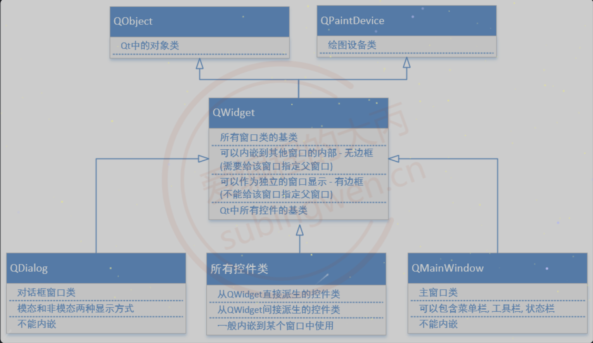
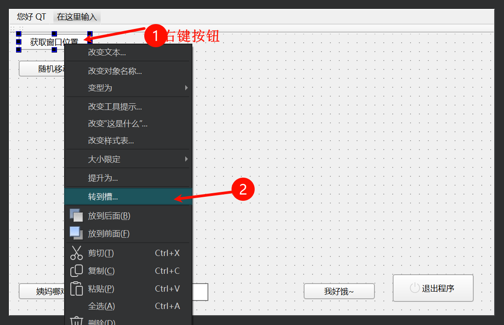

# 一、QWidget
> QWidget类是所有窗口类的父类(控件类是也属于窗口类), 并且QWidget类的父类的QObject, 也就意味着所有的窗口类对象只要指定了父对象, 都可以实现内存资源的自动回收。
>
> 我们在[二、Qt中的窗口类](../../001-QT入门/002-二、Qt中的窗口类/index.md)中有粗略了解过QWidget类, 此处我们接着深入了解...

| ##container## |
|:--:|
||

控件也算是一个窗口(比如按钮); 但是使用的时候如果指定了父窗口, 那么就会内嵌到父窗口内, 随着父窗口的显示而显示, 生命周期也由父窗口管理.

## 1.1 设置父对象

```C++
// 构造函数
QWidget::QWidget(QWidget *parent = nullptr, Qt::WindowFlags f = Qt::WindowFlags());

// 公共成员函数
// 给当前窗口设置父对象
void QWidget::setParent(QWidget *parent);
void QWidget::setParent(QWidget *parent, Qt::WindowFlags f);
// 获取当前窗口的父对象, 没有父对象返回 nullptr
QWidget *QWidget::parentWidget() const;
```

## 1.2 窗口位置

```C++
//------------- 窗口位置 -------------
// 得到相对于当前窗口父窗口的几何信息, 边框也被计算在内
QRect QWidget::frameGeometry() const;
// 得到相对于当前窗口父窗口的几何信息, 不包括边框
const QRect &geometry() const;
// 设置当前窗口的几何信息(位置和尺寸信息), 不包括边框
void setGeometry(int x, int y, int w, int h);
void setGeometry(const QRect &);
    
// 移动窗口, 重新设置窗口的位置
void move(int x, int y);
void move(const QPoint &);
```

## 1.3 窗口信息

```C++
//------------- 窗口尺寸 -------------
// 获取当前窗口的尺寸信息
QSize size() const
// 重新设置窗口的尺寸信息
void resize(int w, int h);
void resize(const QSize &);
// 获取当前窗口的最大尺寸信息
QSize maximumSize() const;
// 获取当前窗口的最小尺寸信息
QSize minimumSize() const;
// 设置当前窗口固定的尺寸信息
void QWidget::setFixedSize(const QSize &s);
void QWidget::setFixedSize(int w, int h);
// 设置当前窗口的最大尺寸信息
void setMaximumSize(const QSize &);
void setMaximumSize(int maxw, int maxh);
// 设置当前窗口的最小尺寸信息
void setMinimumSize(const QSize &);
void setMinimumSize(int minw, int minh);


// 获取当前窗口的高度    
int height() const;
// 获取当前窗口的最小高度
int minimumHeight() const;
// 获取当前窗口的最大高度
int maximumHeight() const;
// 给窗口设置固定的高度
void QWidget::setFixedHeight(int h);
// 给窗口设置最大高度
void setMaximumHeight(int maxh);
// 给窗口设置最小高度
void setMinimumHeight(int minh);

// 获取当前窗口的宽度
int width() const;
// 获取当前窗口的最小宽度
int minimumWidth() const;
// 获取当前窗口的最大宽度
int maximumWidth() const;
// 给窗口设置固定宽度
void QWidget::setFixedWidth(int w);
// 给窗口设置最大宽度
void setMaximumWidth(int maxw);
// 给窗口设置最小宽度
void setMinimumWidth(int minw);
```

## 1.4 窗口标题和图标

```C++
//------------- 窗口图标 -------------
// 得到当前窗口的图标
QIcon windowIcon() const;
// 构造图标对象, 参数为图片的路径
QIcon::QIcon(const QString &fileName);
// 设置当前窗口的图标
void setWindowIcon(const QIcon &icon);

//------------- 窗口标题 -------------
// 得到当前窗口的标题
QString windowTitle() const;
// 设置当前窗口的标题
void setWindowTitle(const QString &);
```

## 1.5 信号

```C++
// QWidget::setContextMenuPolicy(Qt::ContextMenuPolicy policy);
// 窗口的右键菜单策略 contextMenuPolicy() 参数设置为 Qt::CustomContextMenu, 按下鼠标右键发射该信号
[signal] void QWidget::customContextMenuRequested(const QPoint &pos);
// 窗口图标发生变化, 发射此信号
[signal] void QWidget::windowIconChanged(const QIcon &icon);
// 窗口标题发生变化, 发射此信号
[signal] void QWidget::windowTitleChanged(const QString &title);
```

> 基于窗口策略实现右键菜单具体操作请参考: [在Qt窗口中添加右键菜单](../006-六、在Qt窗口中添加右键菜单/index.md)

## 1.6 槽函数

```C++
//------------- 窗口显示 -------------
// 关闭当前窗口
[slot] bool QWidget::close();
// 隐藏当前窗口
[slot] void QWidget::hide();
// 显示当前创建以及其子窗口
[slot] void QWidget::show();
// 全屏显示当前窗口
[slot] void QWidget::showFullScreen();
// 窗口最大化显示
[slot] void QWidget::showMaximized();
// 窗口最小化显示
[slot] void QWidget::showMinimized();
// 将窗口回复为最大化/最小化之前的状态
[slot] void QWidget::showNormal();

//------------- 窗口状态 -------------
// 判断窗口是否可用
bool QWidget::isEnabled() const; // 非槽函数
// 设置窗口是否可用, 不可用窗口无法接收和处理窗口事件
// 参数true->可用, false->不可用
[slot] void QWidget::setEnabled(bool);
// 设置窗口是否可用, 不可用窗口无法接收和处理窗口事件
// 参数true->不可用, false->可用
[slot] void QWidget::setDisabled(bool disable);
// 设置窗口是否可见, 参数为true->可见, false->不可见
[slot] virtual void QWidget::setVisible(bool visible);
```

## 1.7 示例

- UI设计界面, 放置按钮, 重命名, 然后:

| ##container## |
|:--:|
||

选择`clicked`槽函数即可..

然后直接: 在生成的槽函数里面写就可以了, 用户不用注册绑定

```C++
void MainWindow::on__getWindowXYBtn_clicked() {
    qDebug() << frameGeometry();
}


void MainWindow::on__moveWinodwByRand_clicked() {
    auto wz = frameGeometry().topLeft();
    move(wz.x() + rand() % 500, wz.y() + rand() % 500);
}
```
