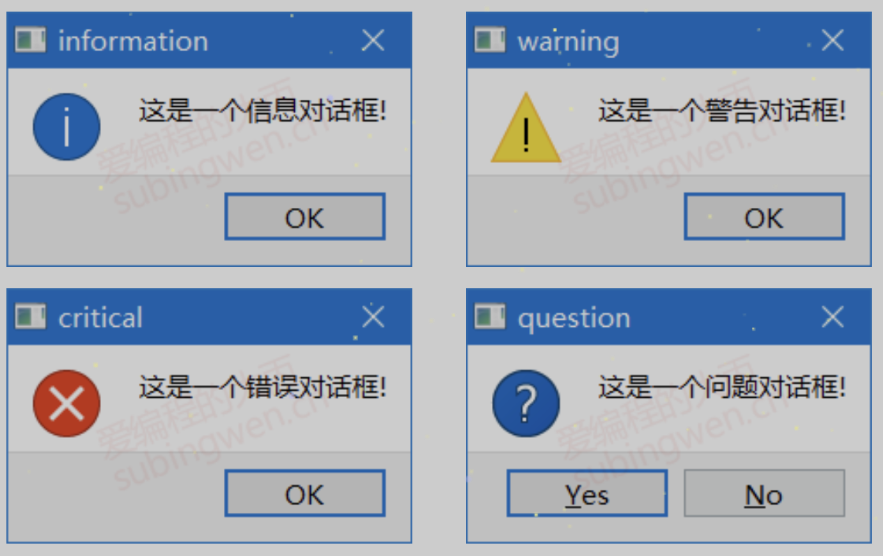

# 三。QDialog的子类
## 3.1 QMessageBox
> QMessageBox 对话框类是 QDialog 类的子类, 通过这个类可以显示一些简单的提示框, 用于展示警告、错误、问题等信息。关于这个类我们只需要掌握一些静态方法的使用就可以了。

### 3.1.1 API - 静态函数

```C++
// 显示一个模态对话框, 将参数 text 的信息展示到窗口中
[static] void QMessageBox::about(QWidget *parent, const QString &title, const QString &text);

/*
参数:
- parent: 对话框窗口的父窗口
- title: 对话框窗口的标题
- text: 对话框窗口中显示的提示信息
- buttons: 对话框窗口中显示的按钮(一个或多个)
- defaultButton
    1. defaultButton指定按下Enter键时使用的按钮。
    2. defaultButton必须引用在参数 buttons 中给定的按钮。
    3. 如果defaultButton是QMessageBox::NoButton, QMessageBox会自动选择一个合适的默认值。
*/
// 显示一个信息模态对话框
[static] QMessageBox::StandardButton QMessageBox::information(
           QWidget *parent, const QString &title, 
           const QString &text, 
           QMessageBox::StandardButtons buttons = Ok,
           QMessageBox::StandardButton defaultButton = NoButton);

// 显示一个错误模态对话框
[static] QMessageBox::StandardButton QMessageBox::critical(
           QWidget *parent, const QString &title, 
           const QString &text, 
           QMessageBox::StandardButtons buttons = Ok,
           QMessageBox::StandardButton defaultButton = NoButton);

// 显示一个问题模态对话框
[static] QMessageBox::StandardButton QMessageBox::question(
           QWidget *parent, const QString &title, 
           const QString &text, 
           QMessageBox::StandardButtons buttons = StandardButtons(Yes | No), 
           QMessageBox::StandardButton defaultButton = NoButton);

// 显示一个警告模态对话框
[static] QMessageBox::StandardButton QMessageBox::warning(
           QWidget *parent, const QString &title, 
           const QString &text, 
           QMessageBox::StandardButtons buttons = Ok,
           QMessageBox::StandardButton defaultButton = NoButton);
```

- 如果有图标, 则沿用父窗口的图标.

| ##container## |
|:--:|
||

- about的图标 == about显示的图片

### 3.1.2 示例

```C++
void MainWindow::on__showErrorMsgWinodwBnt_clicked() {
    QMessageBox::critical(this, "critical", "这是一个错误对话框-critical...");
}


void MainWindow::on__showInfoWinodwBnt_clicked() {
    QMessageBox::about(this, "about",  "这是一个简单的消息提示框!!!");

    int ret = QMessageBox::question(this, "question",
                                    "你要保存修改的文件内容吗???",
                                    QMessageBox::Save|QMessageBox::Cancel,
                                    QMessageBox::Cancel);
    if(ret == QMessageBox::Save) {
        QMessageBox::information(this, "information", "恭喜你保存成功了, o(*￣︶￣*)o!!!");
    } else if(ret == QMessageBox::Cancel) {
        QMessageBox::warning(this, "warning", "你放弃了保存, ┭┮﹏┭┮ !!!");
    }
}
```

## 3.2 QFileDialog
> QFileDialog 对话框类是 QDialog 类的子类, 通过这个类可以选择要打开/保存的文件或者目录。关于这个类我们只需要掌握一些静态方法的使用就可以了。

### 3.2.1 API - 静态函数

```C++
/*
通用参数:
  - parent: 当前对话框窗口的父对象也就是父窗口
  - caption: 当前对话框窗口的标题
  - dir: 当前对话框窗口打开的默认目录
  - options: 当前对话框窗口的一些可选项,枚举类型, 一般不需要进行设置, 使用默认值即可
  - filter: 过滤器, 在对话框中只显示满足条件的文件, 可以指定多个过滤器, 使用 ;; 分隔
    - 样式举例: 
    - Images (*.png *.jpg)
    - Images (*.png *.jpg);;Text files (*.txt)
  - selectedFilter: 如果指定了多个过滤器, 通过该参数指定默认使用哪一个, 不指定默认使用第一个过滤器
*/
// 打开一个目录, 得到这个目录的绝对路径
[static] QString QFileDialog::getExistingDirectory(
              QWidget *parent = nullptr, 
              const QString &caption = QString(), 
              const QString &dir = QString(), 
              QFileDialog::Options options = ShowDirsOnly);

// 打开一个文件, 得到这个文件的绝对路径
[static] QString QFileDialog::getOpenFileName(
              QWidget *parent = nullptr, 
              const QString &caption = QString(), 
              const QString &dir = QString(), 
              const QString &filter = QString(), 
              QString *selectedFilter = nullptr, 
              QFileDialog::Options options = Options());

// 打开多个文件, 得到这多个文件的绝对路径
[static] QStringList QFileDialog::getOpenFileNames(
              QWidget *parent = nullptr, 
              const QString &caption = QString(), 
              const QString &dir = QString(), 
              const QString &filter = QString(), 
              QString *selectedFilter = nullptr, 
              QFileDialog::Options options = Options());

// 打开一个目录, 使用这个目录来保存指定的文件
[static] QString QFileDialog::getSaveFileName(
              QWidget *parent = nullptr, 
              const QString &caption = QString(), 
              const QString &dir = QString(), 
              const QString &filter = QString(), 
              QString *selectedFilter = nullptr, 
              QFileDialog::Options options = Options());
```

### 3.2.2 示例

```C++
void MainWindow::on__openOneFileBtn_clicked() {
    QString arg("Text files (*.txt)"); // 文件过滤器
    QString fileName = QFileDialog::getOpenFileName(
        this,           // 父窗口
        "Open File",    // 标题
        "E:\\",         // 默认路径
        "Images (*.png *.jpg);;Text files (*.txt)", // 文件过滤器
        &arg            // 默认选择的文件过滤器
    );
    QMessageBox::information(this, "打开文件", "您选择的文件是: " + fileName);
}


void MainWindow::on__openFilesBtn_clicked() {
    auto fileNameList = QFileDialog::getOpenFileNames(
        this,           // 父窗口
        "Open File",    // 标题
        "E:\\",         // 默认路径
        "Images (*.png *.jpg);;Text files (*.txt)" // 文件过滤器
    );
    QString fileName = "";
    for (auto& it : fileNameList)
        fileName += it + '\n';
    QMessageBox::information(this, "打开文件", "您选择的文件是: " + fileName);
}


void MainWindow::on__saveFileToPathBtn_clicked() {
    // 如果没有这个文件, 并不会直接创建, (它并不负责创建), 只是会得到一个这个文件的url路径
    QString fileName = QFileDialog::getSaveFileName(this, "保存文件", "E:\\");
    QMessageBox::information(this, "保存文件", "您指定的保存数据的文件是: " + fileName);
}
```

## 3.3 QFontDialog
> QFontDialog类是QDialog的子类, 通过这个类我们可以得到一个进行字体属性设置的对话框窗口, 和前边介绍的对话框类一样, 我们只需要调用这个类的静态成员函数就可以得到想要的窗口了。

### 3.3.1 QFont 字体类
> 关于字体的属性信息, 在QT框架中被封装到了一个叫QFont的类中, 下边为大家介绍一下这个类的API, 了解一下关于这个类的使用。

```C++
// 构造函数
QFont::QFont();
/*
参数:
  - family: 本地字库中的字体名, 通过 office 等文件软件可以查看
  - pointSize: 字体的字号
  - weight: 字体的粗细, 有效范围为 0 ~ 99
  - italic: 字体是否倾斜显示, 默认不倾斜
*/
QFont::QFont(const QString &family, int pointSize = -1, int weight = -1, bool italic = false);

// 设置字体
void QFont::setFamily(const QString &family);
// 根据字号设置字体大小
void QFont::setPointSize(int pointSize);
// 根据像素设置字体大小
void QFont::setPixelSize(int pixelSize);
// 设置字体的粗细程度, 有效范围: 0 ~ 99
void QFont::setWeight(int weight);
// 设置字体是否加粗显示
void QFont::setBold(bool enable);
// 设置字体是否要倾斜显示
void QFont::setItalic(bool enable);

// 获取字体相关属性(一般规律: 去掉设置函数的 set 就是获取相关属性对应的函数名)
QString QFont::family() const;
bool QFont::italic() const;
int QFont::pixelSize() const;
int QFont::pointSize() const;
bool QFont::bold() const;
int QFont::weight() const;
```

> 如果一个QFont对象被创建, 并且进行了初始化, 我们可以将这个属性设置给某个窗口, 或者设置给当前应用程序对象。

```C++
// QWidget 类
// 得到当前窗口使用的字体
const QWidget::QFont& font() const;
// 给当前窗口设置字体, 只对当前窗口类生效
void QWidget::setFont(const QFont &);

// QApplication 类
// 得到当前应用程序对象使用的字体
[static] QFont QApplication::font();
// 给当前应用程序对象设置字体, 作用于当前应用程序的所有窗口
[static] void QApplication::setFont(const QFont &font, const char *className = nullptr);
```

### 3.3.2 QFontDialog类的静态API

```C++
/*
参数:
  - ok: 传出参数, 用于判断是否获得了有效字体信息, 指定一个布尔类型变量地址
  - initial: 字体对话框中默认选中并显示该字体信息, 用于对话框的初始化
  - parent: 字体对话框窗口的父对象
  - title: 字体对话框的窗口标题
  - options: 字体对话框选项, 使用默认属性即可, 一般不设置
*/
[static] QFont QFontDialog::getFont(
      bool *ok, const QFont &initial, 
      QWidget *parent = nullptr, const QString &title = QString(), 
      QFontDialog::FontDialogOptions options = FontDialogOptions());

[static] QFont QFontDialog::getFont(bool *ok, QWidget *parent = nullptr);
```

### 3.3.3 测试代码
> 通过字体对话框选择字体, 并将选择的字体设置给当前窗口

```C++
void MainWindow::on__setZiTiBtn_clicked() {
#if 1
    // 方式1 (指定默认选择字体)
    bool ok;
    QFont ft = QFontDialog::getFont(
        &ok, QFont("黑体", 12, QFont::Bold), this, "选择字体");
    qDebug() << "ok value is: " << ok;
#else
    // 方式2
    QFont ft = QFontDialog::getFont(NULL);
#endif
    // 单独设置字体
    ui->_text820->setFont(ft);
    // 将选择的字体设置给当前窗口对象 (不会影响单独设置字体的控件)
    this->setFont(QFont("黑体", 12, QFont::Bold));
}
```

## 3.4 QColorDialog
> QColorDialog类是QDialog的子类, 通过这个类我们可以得到一个选择颜色的对话框窗口, 和前边介绍的对话框类一样, 我们只需要调用这个类的静态成员函数就可以得到想要的窗口了。

### 3.4.1 颜色类 QColor
> 关于颜色的属性信息, 在QT框架中被封装到了一个叫QColor的类中, 下边为大家介绍一下这个类的API, 了解一下关于这个类的使用。
>
> 各种颜色都是基于红, 绿, 蓝这三种颜色调配而成的, 并且颜色还可以进行透明度设置, 默认是不透明的。

```C++
// 构造函数
QColor::QColor(Qt::GlobalColor color);
QColor::QColor(int r, int g, int b, int a = ...);
QColor::QColor();

// 参数设置 red, green, blue, alpha, 取值范围都是 0-255
void QColor::setRed(int red);       // 红色
void QColor::setGreen(int green);   // 绿色
void QColor::setBlue(int blue);        // 蓝色
void QColor::setAlpha(int alpha);   // 透明度, 默认不透明(255)
void QColor::setRgb(int r, int g, int b, int a = 255);

int QColor::red() const;
int QColor::green() const;
int QColor::blue() const;
int QColor::alpha() const;
void QColor::getRgb(int *r, int *g, int *b, int *a = nullptr) const;
```

### 3.4.2 静态API函数

```C++
// 弹出颜色选择对话框, 并返回选中的颜色信息
/*
参数:
    - initial: 对话框中默认选中的颜色, 用于窗口初始化
    - parent: 给对话框窗口指定父对象
    - title: 对话框窗口的标题
    - options: 颜色对话框窗口选项, 使用默认属性即可, 一般不需要设置
*/
[static] QColor QColorDialog::getColor(
      const QColor &initial = Qt::white, 
      QWidget *parent = nullptr, const QString &title = QString(), 
      QColorDialog::ColorDialogOptions options = ColorDialogOptions());
```

### 3.4.3 测试代码

```C++
void MainWindow::on__setTest820ColorBtn_clicked() {
    QColor color = QColorDialog::getColor();
    ui->_textBrowser820->setTextColor(color);
    ui->_textBrowser820->setText(color.name()
        + QString(" red: %1, green: %2, blue: %3, 透明度: %4")
        .arg(color.red()).arg(color.green()).arg(color.blue()).arg(color.alpha()));
}
```

## 3.5 QInputDialog
> QInputDialog类是QDialog的子类, 通过这个类我们可以得到一个输入对话框窗口, 根据实际需求我们可以在这个输入窗口中输入整形, 浮点型, 字符串类型的数据, 并且还可以显示下拉菜单供使用者选择。
>
> 和前边介绍的对话框类一样, 我们只需要调用这个类的静态成员函数就可以得到想要的窗口了。

### 3.5.1 API - 静态函数

```C++
// 得到一个可以输入浮点数的对话框窗口, 返回对话框窗口中输入的浮点数
/*
参数:
  - parent: 对话框窗口的父窗口
  - title: 对话框窗口显示的标题信息
  - label: 对话框窗口中显示的文本信息(用于描述对话框的功能)
  - value: 对话框窗口中显示的浮点值, 默认为 0
  - min: 对话框窗口支持显示的最小数值
  - max: 对话框窗口支持显示的最大数值
  - decimals: 浮点数的精度, 默认保留小数点以后1位
  - ok: 传出参数, 用于判断是否得到了有效数据, 一般不会使用该参数
  - flags: 对话框窗口的窗口属性, 使用默认值即可
*/
[static] double QInputDialog::getDouble(
      QWidget *parent, const QString &title, 
      const QString &label, double value = 0, 
      double min = -2147483647, double max = 2147483647, 
      int decimals = 1, bool *ok = nullptr, 
      Qt::WindowFlags flags = Qt::WindowFlags());

// 得到一个可以输入整形数的对话框窗口, 返回对话框窗口中输入的整形数
/*
参数:
  - parent: 对话框窗口的父窗口
  - title: 对话框窗口显示的标题信息
  - label: 对话框窗口中显示的文本信息(用于描述对话框的功能)
  - value: 对话框窗口中显示的整形值, 默认为 0
  - min: 对话框窗口支持显示的最小数值
  - max: 对话框窗口支持显示的最大数值
  - step: 步长, 通过对话框提供的按钮调节数值每次增长/递减的量
  - ok: 传出参数, 用于判断是否得到了有效数据, 一般不会使用该参数
  - flags: 对话框窗口的窗口属性, 使用默认值即可
*/
[static] int QInputDialog::getInt(
      QWidget *parent, const QString &title, 
      const QString &label, int value = 0, 
      int min = -2147483647, int max = 2147483647, 
      int step = 1, bool *ok = nullptr, 
      Qt::WindowFlags flags = Qt::WindowFlags());

// 得到一个带下来菜单的对话框窗口, 返回选择的菜单项上边的文本信息
/*
参数:
  - parent: 对话框窗口的父窗口
  - title: 对话框窗口显示的标题信息
  - label: 对话框窗口中显示的文本信息(用于描述对话框的功能)
  - items: 字符串列表, 用于初始化窗口中的下拉菜单, 每个字符串对应一个菜单项
  - current: 通过菜单项的索引指定显示下拉菜单中的哪个菜单项, 默认显示第一个(编号为0)
  - editable: 设置菜单项上的文本信息是否可以进行编辑, 默认为true, 即可以编辑
  - ok: 传出参数, 用于判断是否得到了有效数据, 一般不会使用该参数
  - flags: 对话框窗口的窗口属性, 使用默认值即可
  - inputMethodHints: 设置显示模式, 默认没有指定任何特殊显示格式, 显示普通文本字符串
    - 如果有特殊需求, 可以参数帮助文档进行相关设置
*/
[static] QString QInputDialog::getItem(
      QWidget *parent, const QString &title, 
      const QString &label, const QStringList &items, 
      int current = 0, bool editable = true, bool *ok = nullptr, 
      Qt::WindowFlags flags = Qt::WindowFlags(), 
      Qt::InputMethodHints inputMethodHints = Qt::ImhNone);

// 得到一个可以输入多行数据的对话框窗口, 返回用户在窗口中输入的文本信息
/*
参数:
  - parent: 对话框窗口的父窗口
  - title: 对话框窗口显示的标题信息
  - label: 对话框窗口中显示的文本信息(用于描述对话框的功能)
  - text: 指定显示到多行输入框中的文本信息, 默认是空字符串
  - ok: 传出参数, 用于判断是否得到了有效数据, 一般不会使用该参数
  - flags: 对话框窗口的窗口属性, 使用默认值即可
  - inputMethodHints: 设置显示模式, 默认没有指定任何特殊显示格式, 显示普通文本字符串
    - 如果有特殊需求, 可以参数帮助文档进行相关设置
*/
[static] QString QInputDialog::getMultiLineText(
      QWidget *parent, const QString &title, const QString &label, 
      const QString &text = QString(), bool *ok = nullptr, 
      Qt::WindowFlags flags = Qt::WindowFlags(), 
      Qt::InputMethodHints inputMethodHints = Qt::ImhNone);

// 得到一个可以输入单行信息的对话框窗口, 返回用户在窗口中输入的文本信息
/*
参数:
  - parent: 对话框窗口的父窗口 
  - title: 对话框窗口显示的标题信息
  - label: 对话框窗口中显示的文本信息(用于描述对话框的功能)
  - mode: 指定单行编辑框中数据的反馈模式, 是一个 QLineEdit::EchoMode 类型的枚举值
    - QLineEdit::Normal: 显示输入的字符。这是默认值
    - QLineEdit::NoEcho: 不要展示任何东西。这可能适用于连密码长度都应该保密的密码。
    - QLineEdit::Password: 显示与平台相关的密码掩码字符，而不是实际输入的字符。
    - QLineEdit::PasswordEchoOnEdit: 在编辑时按输入显示字符，否则按密码显示字符。
  - text: 指定显示到单行输入框中的文本信息, 默认是空字符串
  - ok: 传出参数, 用于判断是否得到了有效数据, 一般不会使用该参数
  - flags: 对话框窗口的窗口属性, 使用默认值即可
  - inputMethodHints: 设置显示模式, 默认没有指定任何特殊显示格式, 显示普通文本字符串
     - 如果有特殊需求, 可以参数帮助文档进行相关设置
*/
[static] QString QInputDialog::getText(
      QWidget *parent, const QString &title, const QString &label,
      QLineEdit::EchoMode mode = QLineEdit::Normal, 
      const QString &text = QString(), bool *ok = nullptr, 
      Qt::WindowFlags flags = Qt::WindowFlags(), 
      Qt::InputMethodHints inputMethodHints = Qt::ImhNone);
```

### 3.5.2 测试代码

```C++
void MainWindow::on__getNianLinBtn_clicked() {
    QMessageBox::information(
        this,
        "我知道你的年龄!",
        "你的年龄是: " + QString(std::to_string(QInputDialog::getInt(this, "年龄", "请问您几岁?", 13, 0, 120, 1)).c_str()) + "岁"
    );
}

void MainWindow::on__getGongZiBtn_clicked() {
    QMessageBox::information(
        this,
        "我知道你的工资!",
        "你的工资是: " + QString(std::to_string(QInputDialog::getDouble(this, "调查", "请问您工资多少?", 1300, 0, 1e6, 2)).c_str()) + "元"
    );
}

void MainWindow::on__getSayDataBtn_clicked() {
    QMessageBox::information(
        this,
        "我知道你的在说话!",
        "你的说得是: " + QInputDialog::getMultiLineText(this, "你小猫可以说话", "请喵giao!:", "喵喵, 喵喵喵~, 嗷哟呦!")
    );
}

void MainWindow::on__getFoodBtn_clicked() {
    QStringList items;
    items << "苹果" << "橙子" << "橘子" << "葡萄" << "香蕉" << "哈密瓜";
    QMessageBox::information(
        this,
        "鸡汤来喽~",
        "お客様、今回のお料理は: " + QInputDialog::getItem(this, "自助餐", "请喵吃:", items, 0, false)
    );
}

void MainWindow::on__getGinkoMiMaBtn_clicked() {
    // 不同的枚举代表不同的输入样式
    QString text = QInputDialog::getText(this, "密码", "请输入你的银行卡密码", QLineEdit::Password, "helloworld");
    QMessageBox::information(this, "密码", "您的银行卡密码是: " + text);
}
```

## 3.6 QProgressDialog (进度条)
> QProgressDialog类是QDialog的子类, 通过这个类我们可以得到一个带进度条的对话框窗口, 这种类型的对话框窗口一般常用于文件拷贝、数据传输等实时交互的场景中。

### 3.6.1 常用API

```C++
// 构造函数
/*
参数:
  - labelText: 对话框中显示的提示信息
  - cancelButtonText: 取消按钮上显示的文本信息
  - minimum: 进度条最小值
  - maximum: 进度条最大值
  - parent: 当前窗口的父对象
  - f: 当前进度窗口的flag属性, 使用默认属性即可, 无需设置
*/
QProgressDialog::QProgressDialog(
    QWidget *parent = nullptr, 
    Qt::WindowFlags f = Qt::WindowFlags());

QProgressDialog::QProgressDialog(
    const QString &labelText, const QString &cancelButtonText, 
    int minimum, int maximum, QWidget *parent = nullptr,
    Qt::WindowFlags f = Qt::WindowFlags());


// 设置取消按钮显示的文本信息
[slot] void QProgressDialog::setCancelButtonText(const QString &cancelButtonText);

// 公共成员函数和槽函数
QString QProgressDialog::labelText() const;
void QProgressDialog::setLabelText(const QString &text);

// 得到进度条最小值
int QProgressDialog::minimum() const;
// 设置进度条最小值
void QProgressDialog::setMinimum(int minimum);

// 得到进度条最大值
int QProgressDialog::maximum() const;
// 设置进度条最大值
void QProgressDialog::setMaximum(int maximum);

// 设置进度条范围(最大和最小值)
[slot] void QProgressDialog::setRange(int minimum, int maximum);

// 得到进度条当前的值
int QProgressDialog::value() const;
// 设置进度条当前的值
void QProgressDialog::setValue(int progress);


bool QProgressDialog::autoReset() const;
// 当value() = maximum()时，进程对话框是否调用reset()，此属性默认为true。
void QProgressDialog::setAutoReset(bool reset);


bool QProgressDialog::autoClose() const;
// 当value() = maximum()时，进程对话框是否调用reset()并且隐藏，此属性默认为true。
void QProgressDialog::setAutoClose(bool close);

// 判断用户是否按下了取消键, 按下了返回true, 否则返回false
bool wasCanceled() const;


// 重置进度条
// 重置进度对话框。wascancelled()变为true，直到进程对话框被重置。进度对话框被隐藏。
[slot] void QProgressDialog::cancel();
// 重置进度对话框。如果autoClose()为真，进程对话框将隐藏。
[slot] void QProgressDialog::reset();   

// 信号
// 当单击cancel按钮时，将发出此信号。默认情况下，它连接到cancel()槽。
[signal] void QProgressDialog::canceled();

// 设置窗口的显示状态(模态, 非模态)
/*
参数:
    Qt::NonModal  -> 非模态
    Qt::WindowModal    -> 模态, 阻塞父窗口
    Qt::ApplicationModal -> 模态, 阻塞应用程序中的所有窗口
*/
void QWidget::setWindowModality(Qt::WindowModality windowModality);
```

### 3.6.2 示例

```C++
场景描述:
    1. 基于定时器模拟文件拷贝的场景
    2. 点击窗口按钮, 进度条窗口显示, 同时启动定时器
    3. 通过定时器信号, 按照固定频率更新对话框窗口进度条
    4. 当进度条当前值 == 最大值, 关闭定时器, 关闭并析构进度对话框
```

```C++
void MainWindow::on__xiaZaiHWKBtn_clicked() {
    // 1. 创建进度条对话框窗口对象
    QProgressDialog *progress = new QProgressDialog(
        "正在下载: [黑悟空: 神话]", "取消下载", 0, 100, this);
    // 2. 初始化并显示进度条窗口
    progress->setWindowTitle("请稍后");
    progress->setWindowModality(Qt::WindowModal);
    progress->show();

    // 3. 更新进度条
    static int value = 0;
    QTimer *timer = new QTimer; // 定时器

    connect(timer, &QTimer::timeout, this, [=]() {
        progress->setValue(value);
        value++;
        // 当 value > 最大值的时候
        if(value > progress->maximum()) {
            timer->stop();
            value = 0;
            delete progress;
            delete timer;
        }
    });

    connect(progress, &QProgressDialog::canceled, this, [=]() { // 取消
        timer->stop();
        value = 0;
        delete progress;
        delete timer;
    });

    timer->start(25);
}
```
