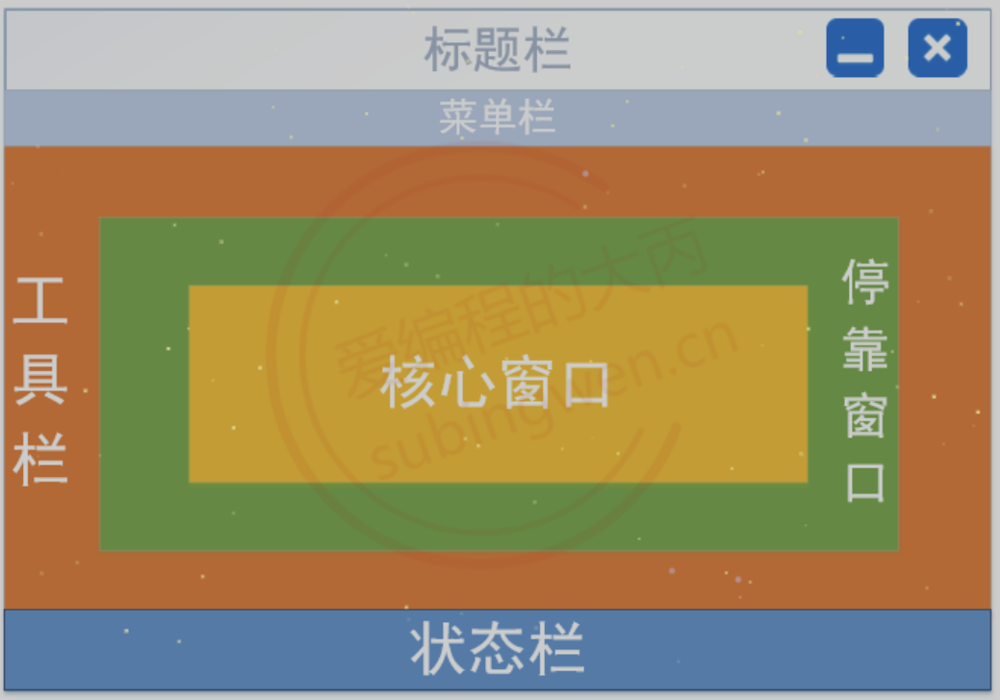
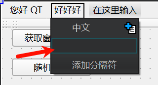
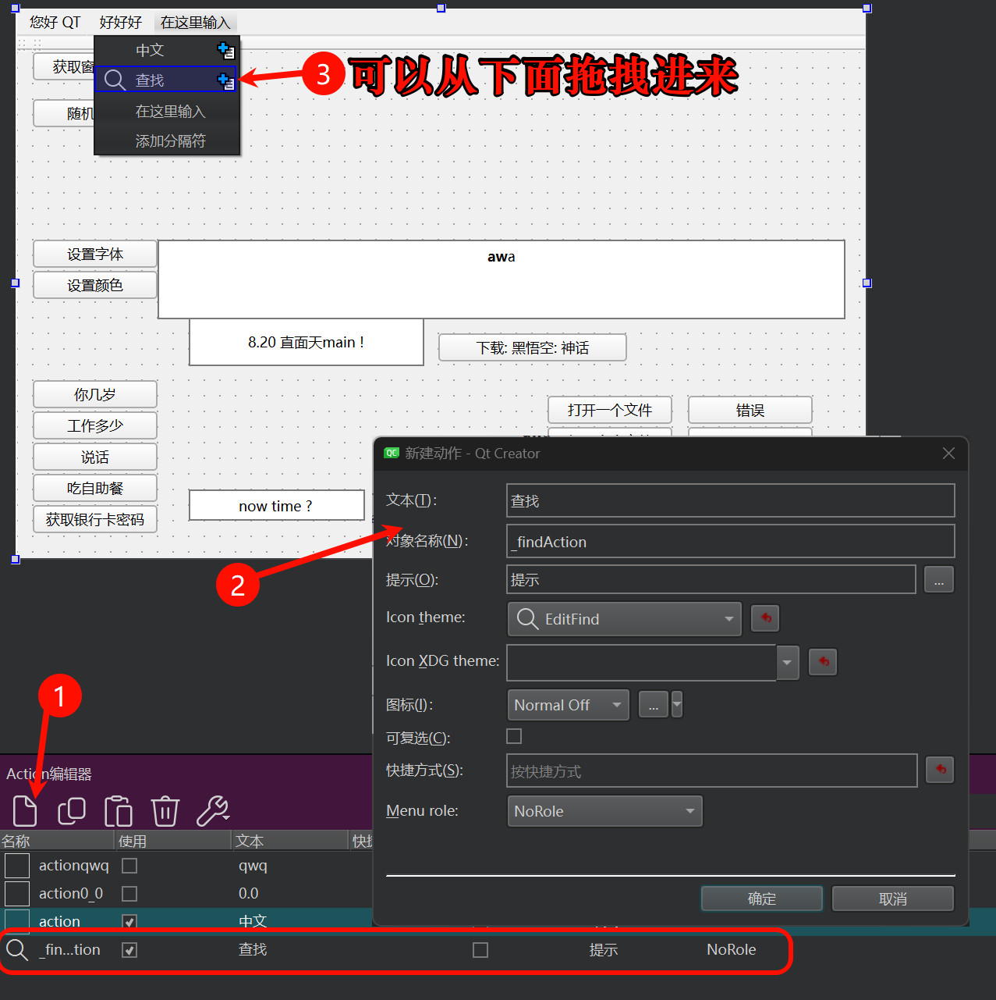
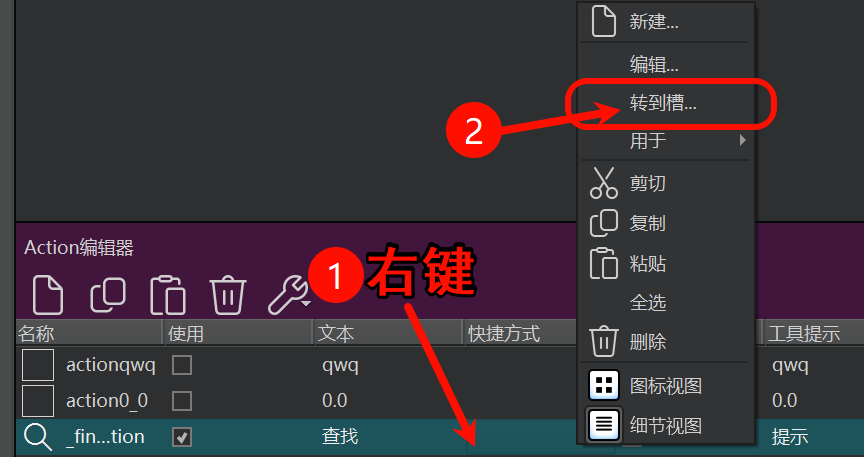
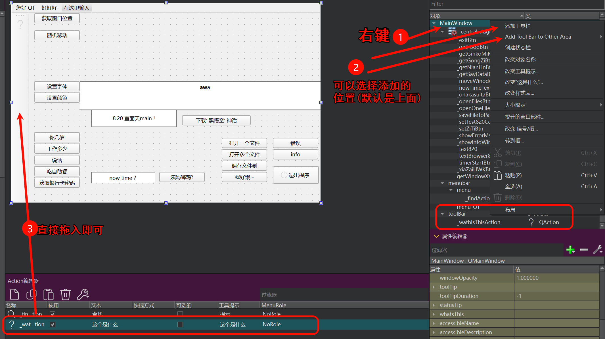
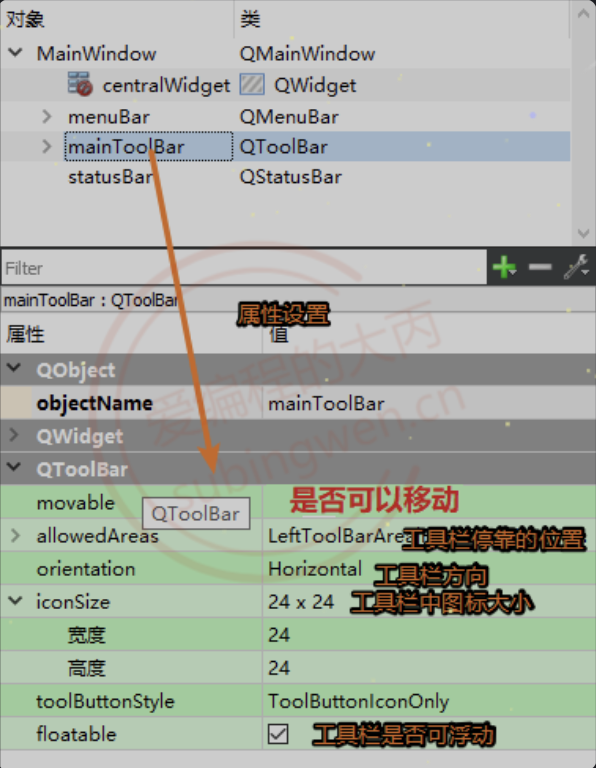
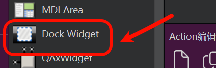
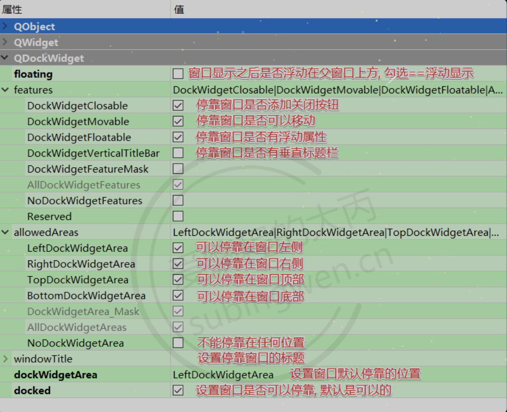

# 四、QMainWindow
> QMainWindow是标准基础窗口中结构最复杂的窗口, 其组成如下:
> 
> - 提供了菜单栏, 工具栏, 状态栏, 停靠窗口
> - 菜单栏: 只能有一个, 位于窗口的最上方
> - 工具栏: 可以有多个, 默认提供了一个, 窗口的上下左右都可以停靠
> - 状态栏: 只能有一个, 位于窗口最下方
> - 停靠窗口: 可以有多个, 默认没有提供, 窗口的上下左右都可以停靠 (就是类似于VS2022的那种窗口可以用鼠标拖拽的)
>
> | ##container## |
> |:--:|
> ||

## 4.1 菜单栏
- 添加菜单项
> 关于顶级菜单可以直接在UI窗口中双击, 直接输入文本信息即可, 对应子菜单项也可以通过先双击在输入的方式完成添加, 但是这种方式不支持中文的输入(可以复制粘贴进来)。

| ##container## |
|:--:|
||

- 常用的添加方式
> 一般情况下, 我们都是先在外面创建出QAction对象, 然后再将其拖拽到某个菜单下边, 这样子菜单项的添加就完成了。
> | ##container## |
|:--:|
||
>
> > [!TIP]
> > QAction是菜单(QMenu)的菜单项对象

- 通过代码的方式添加菜单或者菜单项

```C++
// 给菜单栏添加菜单
QAction *QMenuBar::addMenu(QMenu *menu);
QMenu *QMenuBar::addMenu(const QString &title);
QMenu *QMenuBar::addMenu(const QIcon &icon, const QString &title);

// 给菜单对象添加菜单项(QAction)
QAction *QMenu::addAction(const QString &text);
QAction *QMenu::addAction(const QIcon &icon, const QString &text);

// 添加分割线
QAction *QMenu::addSeparator();
```

- 菜单项 QAction 事件的处理
> 单击菜单项, 该对象会发出一个信号

```C++
// 点击QAction对象发出该信号
[signal] void QAction::triggered(bool checked = false);
```

- 示例代码

```C++
// 菜单项信号绑定槽函数
connect(ui->_findAction, &QAction::triggered, this, [=]() {
    qDebug() << "搜索中...";
});
```

当然, 也可以直接在ui设计界面`跳转到槽函数`:

| ##container## |
|:--:|
||

## 4.2 工具栏
### 4.2.1 添加工具按钮
- 方式1: 先创建QAction对象, 然后拖拽到工具栏中, 和添加菜单项的方式相同

| ##container## |
|:--:|
||

> [!TIP]
> 值得注意的是: 下面这个Action栏的对象是可以复用的, 即你可以既放置在菜单栏又放置在工具栏, 实际上它只有一个QAction实例, 并且绑定的槽函数都在. (类似于[中介者模式](../../../../../../../001-计佬常識/002-设计模式/009-行为型模式/005-中介者模式/index.md))

- 方式2: 如果不通过UI界面直接操作，那么就需要调用相关的API函数了

```C++
// 在QMainWindow窗口中添加工具栏
void QMainWindow::addToolBar(Qt::ToolBarArea area, QToolBar *toolbar);
void QMainWindow::addToolBar(QToolBar *toolbar);
QToolBar *QMainWindow::addToolBar(const QString &title);

// 将Qt控件放到工具栏中
// 工具栏类: QToolBar
// 添加的对象只要是QWidget或者启子类都可以被添加
QAction *QToolBar::addWidget(QWidget *widget);

// 添加QAction对象
QAction *QToolBar::addAction(const QString &text);
QAction *QToolBar::addAction(const QIcon &icon, const QString &text);

// 添加分隔线
QAction *QToolBar::addSeparator()
```

通过代码的方式对工具栏进行操作(示例):

```C++
MainWindow::MainWindow(QWidget *parent)
    : QMainWindow(parent)
    , ui(new Ui::MainWindow)
{
    ui->setupUi(this);

    // 添加第二个工具栏
    QToolBar* toolbar = new QToolBar("toolbar");
    this->addToolBar(Qt::LeftToolBarArea, toolbar);

    // 给工具栏添加按钮和单行输入框
    ui->toolBar->addWidget(new QPushButton("搜索"));
    QLineEdit* edit = new QLineEdit;
    edit->setMaximumWidth(200);
    edit->setFixedWidth(100);
    ui->toolBar->addWidget(edit);
    // 添加QAction类型的菜单项
    ui->toolBar->addAction(QIcon(":/er-dog"), "二狗子");
}
```

### 4.2.2 工具栏的属性设置
> 在UI窗口的树状列表中, 找到工具栏节点, 就可以到的工具栏的属性设置面板了, 这样就可以根据个人需求对工具栏的属性进行设置和修改了。

| ##container## |
|:--:|
||

在Qt控件的属性窗口中对应了一些属性, 这些属性大部分都应了一个设置函数

- 在对应的类中函数名叫什么?
    - 规律: set+属性名 == 函数名
- 某些属性没有对应的函数, 只能在属性窗口中设置

## 4.3 状态栏
> 一般情况下, 需要在状态栏中添加某些控件, 显示某些属性, 使用最多的就是添加标签`QLabel`

```C++
// 类型: QStatusBar
void QStatusBar::addWidget(QWidget *widget, int stretch = 0);

[slot] void QStatusBar::clearMessage();

// 第二个参数是毫秒显示时间，可以通过设置以后，Qt会显示指定时间后自动删除当前消息内容。若不设置，将会一直显示知道clear，或者当下一次调用show。
[slot] void QStatusBar::showMessage(const QString &message, int timeout = 0);
```

```C++
MainWindow::MainWindow(QWidget *parent)
    : QMainWindow(parent)
    , ui(new Ui::MainWindow)
{
    ui->setupUi(this);

    // 状态栏添加子控件
    // 按钮
    QPushButton* button = new QPushButton("按钮");
    ui->statusBar->addWidget(button);
    // 标签
    QLabel* label = new QLabel("hello,world");
    ui->statusBar->addWidget(label);
}
```

## 4.4 停靠窗口
> 停靠窗口可以通过鼠标拖动停靠到窗口的上、下、左、右，或者浮动在窗口上方。<span style="color:red">如果需要这种类型的窗口必须手动添加，如果在非`QMainWindow`类型的窗口中添加了停靠窗口, 那么这个窗口是不能移动和浮动的。</span>
>
> 浮动窗口在工具栏中， 直接将其拖拽到UI界面上即可。

| ##container## |
|:--:|
||
|停靠窗口控件|

停靠窗口也有一个属性面板, 我们可以在其对应属性面板中直接进行设置和修改相关属性。

| ##container## |
|:--:|
||
