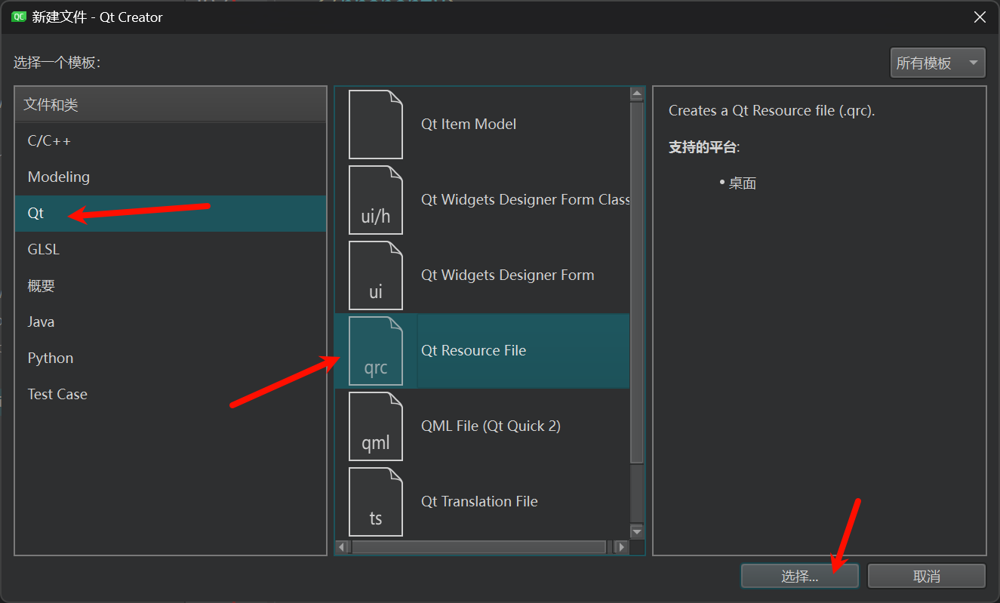
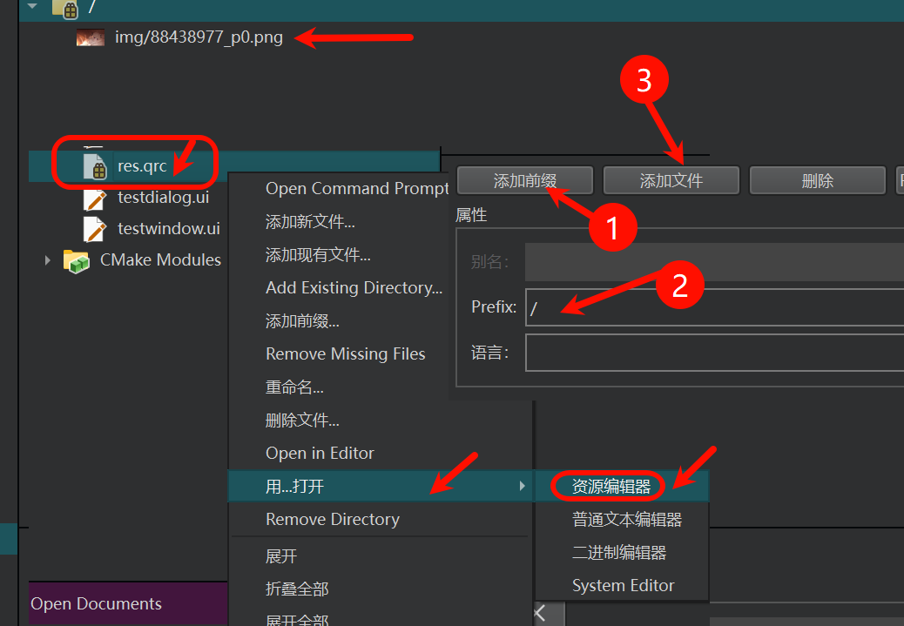
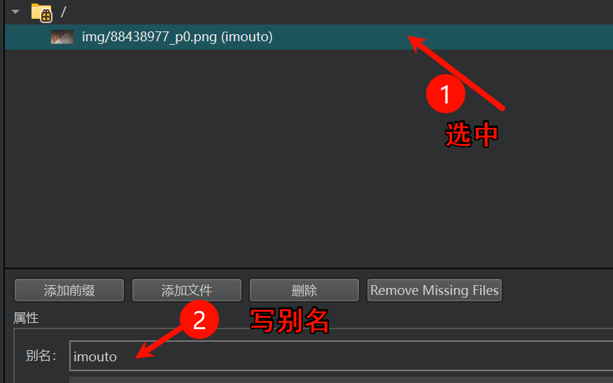
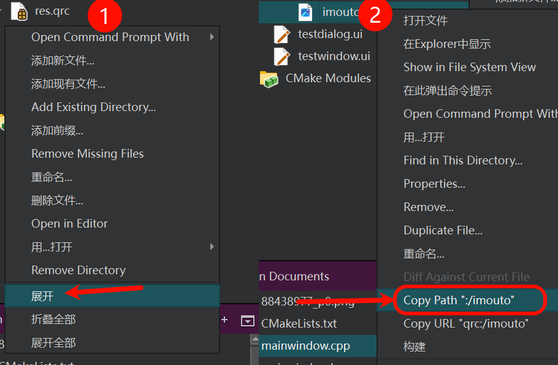

# 五、资源文件 .qrc
资源文件顾名思义就是一个存储资源的文件，在Qt中引入资源文件好处在于他能提高应用程序的部署效率并且减少一些错误的发生。

<span style="color:gold">在程序编译过程中， 添加到资源文件中的文件也会以二进制的形式被打包到可执行程序中，这样这些资源就永远和可执行程序捆绑到一起了，不会出现加载资源却找不到的问题。</span>

虽然资源文件优势很明显，但是它也不是万能的，资源文件中一般添加的都是比较小的资源，比如: 图片，配置文件，MP3 等，如果是类似视频这类比较大的文件就不适合放到资源文件中了。

比如我们需要给某个窗口设置图标, 代码如下:

```C++
// 创建图标对象
QIcon::QIcon(const QString &fileName);
// QWidget类的 公共成员函数
void setWindowIcon(const QIcon &icon);

// 给窗口设置图标
// 弊端: 发布的 exe 必须要加载 d:\\pic\\1.ico 如果当前主机对应的目录中没有图片, 图标就无法被加载
// 发布 exe 需要额外发布图片, 将其部署到某个目录中
setWindowIcon(QIcon("d:\\pic\\1.ico"));
```

我们可以使用资源文件解决上述的弊端, 这样发布应用程序的时候直接发布exe就可以, 不需要再额外提供图片了。

下面介绍一下关于资源文件的创建步骤:

| ##container## |
|:--:|


资源文件添加完毕之后, 继续给大家介绍资源文件的使用:

| ##container## |
|:--:|
||

一般前缀就是`/`, 然后在工程目录(准确的说应该是相对于`res.qrc`文件), 此时的文件只能放在其同等级或更深层的目录

可以给添加的资源文件设置别名, 设置别名之后原来的名字就不能使用了

```C++
温馨提示:
     1. 在高版本的QtCreator中, 资源文件名字或者别名不支持中文
     2. 如果设置了中文会出现编译会报错
     3. 在此只是演示, 使用过程中需要额外注意该问题
```

| ##container## |
|:--:|
||

如何在程序中使用资源文件中的图片?

| ##container## |
|:--:|
||

得到路径

然后直接使用即可

```C++
ui->centralwidget->setStyleSheet("border-image:url(:/imouto)"); // 设置窗口背景
```
