# Qt窗口布局
## 1. 布局的样式
> Qt窗口布局是指将多个子窗口按照某种排列方式将其全部展示到对应的父窗口中的一种处理方式。在Qt中常用的布局样式有三种，分别是:

| 布局样式 | 描述 | 行数 | 列数 |
| --- | --- | --- | --- |
| 水平布局 | 布局中的所有的控件水平排列 | 1行 | N列（N>=1） |
| 垂直布局 | 布局中的所有的控件垂直排列 | N行(N>=1） | 1列 |
| 网格（栅格）布局 | 布局中的所有的控件垂直+水平排列 | N行 | N列 (N>=1） |

```C++
有问有答:
    1. 控件的位置可以通过坐标指定, 为什么还要使用布局?
        - 坐标指定的位置是固定的, 当窗口大小发生改变, 子窗口位置不会变化
        - 使用坐标指定子窗口位置, 这个控件可能会被其他控件覆盖导致无法显示出来
        - 使用布局的方式可以完美解决以上的问题
        - 一般在制作窗口的过程中都是给子控件进行布局, 而不是指定固定坐标位置
    2. 布局有局限性吗, 窗口结构复杂如何解决呢?
        - 没有局限性, 并且布局的使用是非常灵活的
        - 各种布局是可以无限嵌套使用的, 这样就可以制作成非常复杂的窗口了
        - 思路是这样的: 给窗口设置布局, 在布局中添加窗口, 子窗口中再设置布局, 
          在子窗口布局中再次添加窗口, ......(无限循环)
```

## 2. 在UI窗口中设置布局
在UI窗口中进行布局的设置一共有两种处理方式
### 2.1 方式1
> 第一种方式是使用Qt提供的布局, 从工具箱中找到相关的布局, 然后将其拖拽到UI窗口中

| ##container## |
|:--:|
|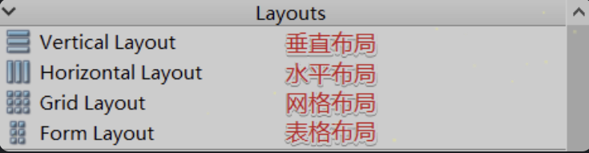|

将相应的控件放入到布局对应的红色框内部, 这些控件就按照布局的样式自动排列到一起了，是不是很方便，赶紧自己操作起来感受一下吧。

| ##container## |
|:--:|
|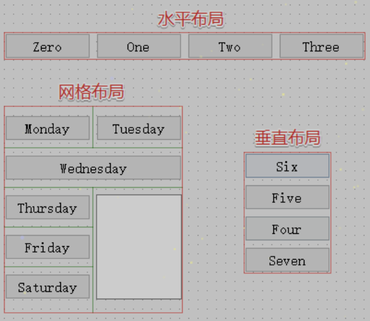|

除此之外, 我们也可以修改当前布局, 需要先选中当前布局, 然后鼠标右键, 在右键菜单中找`布局`在其子菜单项中选择其他布局即可:

| ##container## |
|:--:|
|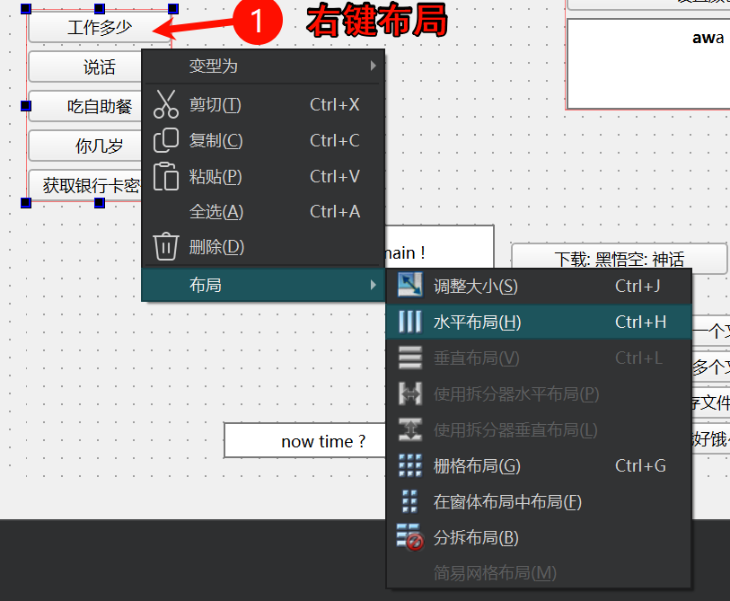|

### 2.2 方式2
> 第二种方式是直接在父窗口中对子部件进行布局, 如果窗口结构很复杂需要嵌套, 那么就需要先将这些子部件放到一个容器类型的窗口中, 然后再对这个容器类型的窗口进行布局操作

1. 首先需要从工具栏中拖拽一个容器类型的窗口到UI界面上

一般首选`QWidget`原因是简单, 并且窗口显示之后看不到任何痕迹

2. 将要布局的子控件放到这个`QWidget`中

| ##container## |
|:--:|
|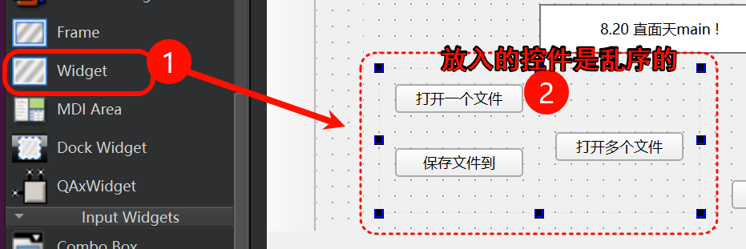|

3. 对这个QWidget进行布局

> 首选选中这个存储子部件的父容器窗口, 然后鼠标右键, 在右键菜单中找布局, 通过其子菜单就可以选择需要的布局方式了。布局之后所有的子部件就能够按照对应样式排列了(如果是网格布局, 有时候需要使用鼠标调节一下)

| ##container## |
|:--:|
|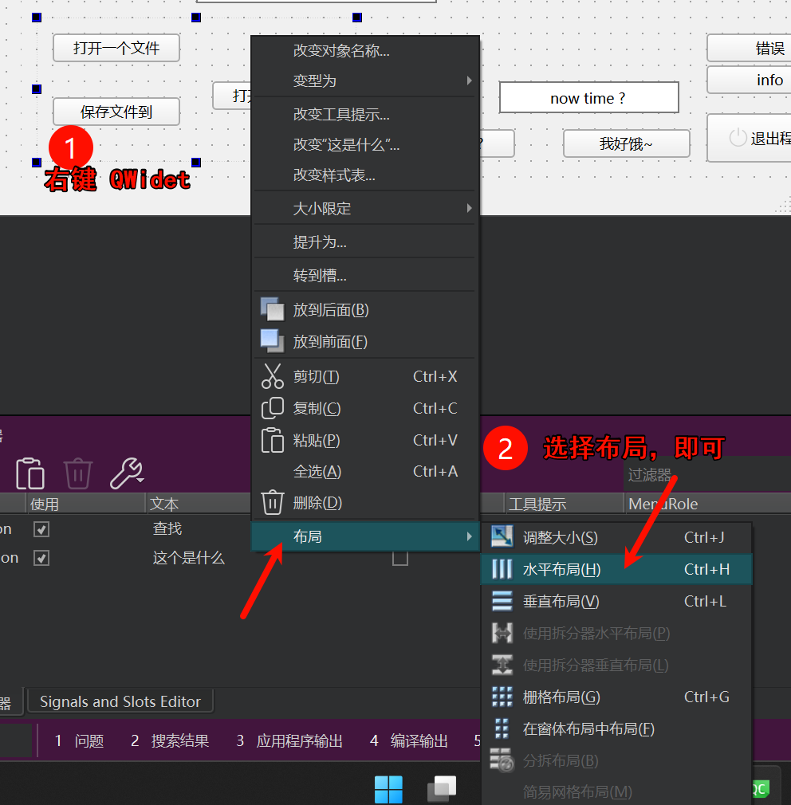|

也可以通过窗口上方工具栏提供的布局按钮进行窗口布局

| ##container## |
|:--:|
|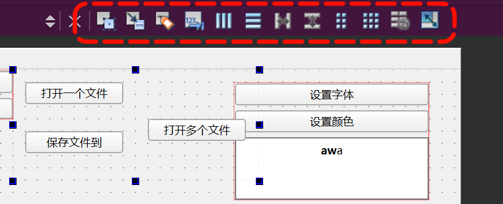|

#### 附: 如何看是否有布局

> [!TIP]
> 通过UI编辑窗口的树状列表我们可以对所有窗口的布局进行检查, 如果发现某个窗口没有布局, 一定要对其进行设置, 如果某个窗口没有进行布局, 那么当这个窗口显示出来之后里边的子部件就可能无法被显示出来, 尤其是初学者一定要注意这个问题。

UI设计界面右边的对象查看器:

| ##container## |
|:--:|
|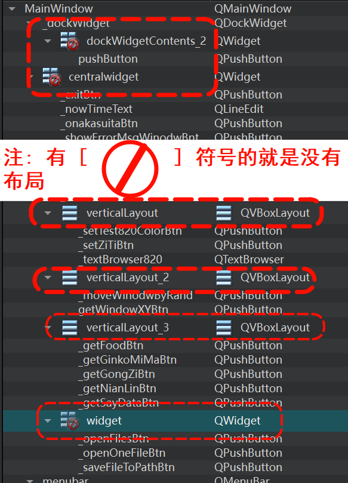|

### 2.3 弹簧的使用
在进行窗口布局的时候为了让界面看起来更加美观, 需要调整控件的位置, 比如: 靠左, 靠右, 居中, 又或者我们需要调节两个控件之间的距离, 以上这些需求使用弹簧都是可以实现的。

弹簧的样式有两种:
- 水平弹簧: 在水平方向起作用
- 垂直弹簧: 在垂直方向起作用

| ##container## |
|:--:|
|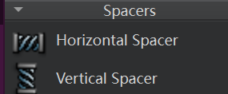|

弹簧也有对应的属性可以设置, 具体属性如下图所示:

| ##container## |
|:--:|
|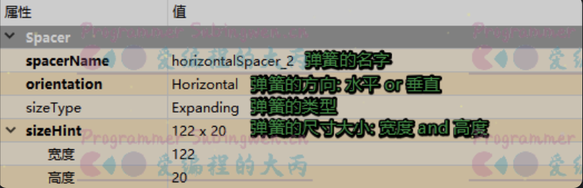|

关于弹簧的`sizeType`属性, 有很多选项, 一般常用的只有两个:
- Fixed: 得到一个固定大小的弹簧
- Expanding: 得到一个可伸缩的弹簧, 默认弹簧撑到最大

| ##container## |
|:--:|
|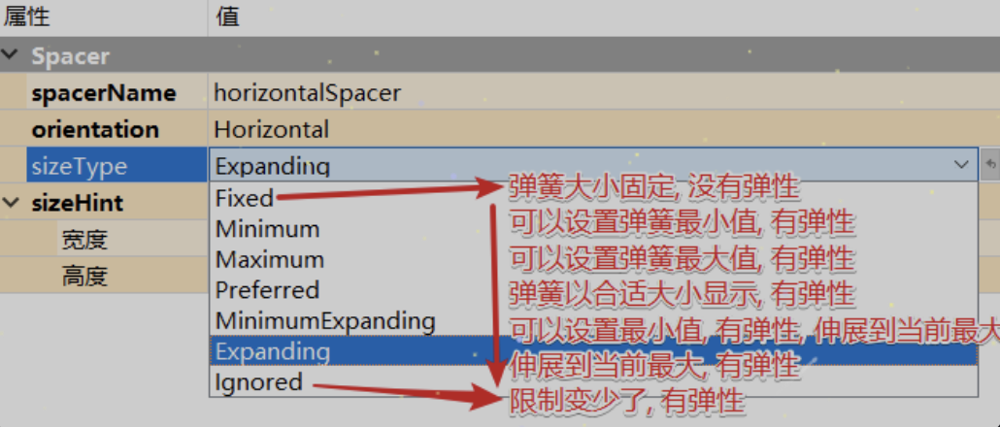|

### 2.4 布局属性设置
当我们给窗口设置了布局之后, 选中当前窗口, 就可以看到在其对应的属性窗口中除了有窗口属性, 还有一个布局属性, 下面给大家介绍一下这些属性:

| ##container## |
|:--:|
|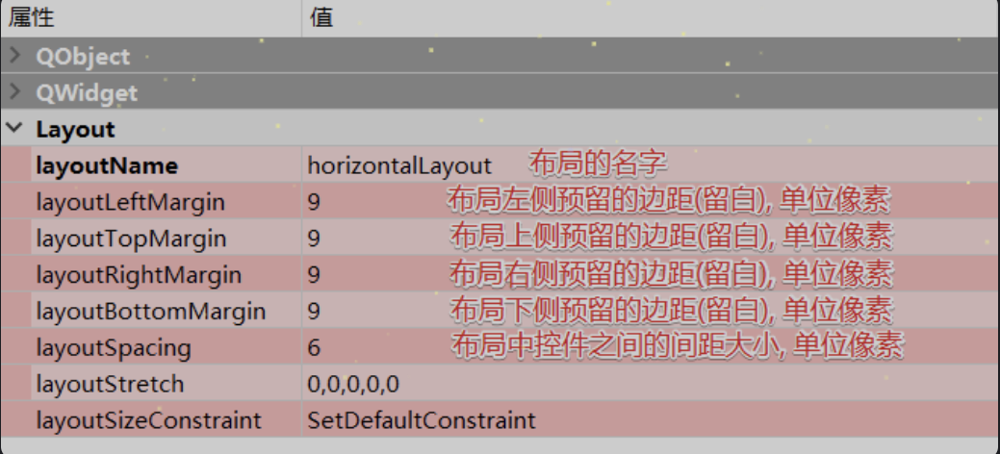|

我们通过设置布局上下左右的边距, 或者是控件之间的距离也可以使界面看起来更加美观。

比如:

| ##container## |
|:--:|
|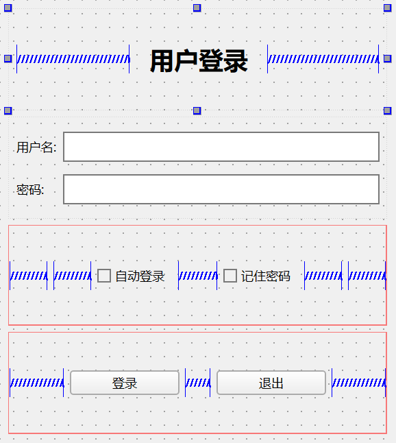|

## 3. 通过API设置布局
在QT中, 布局也有对应的类, 布局类之间的关系如下:

| ##container## |
|:--:|
|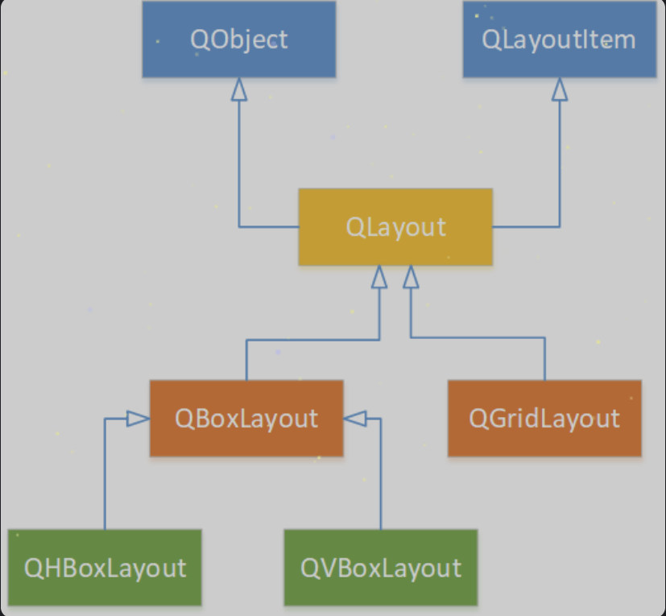|

在上图中的布局类虽然很多, 常用的布局类有三个, 就前边给大家介绍的三种布局, 对应关系如下:

| 布局样式 | 类名 |
| --- | --- |
| 水平布局 | QHBoxLayout |
| 垂直布局 | QVBoxLayout |
| 网格（栅格）布局 | QGridLayout |

> 虽然一般我们不使用这些布局类对窗口进行布局, 但是在这里还是给大家介绍一下这些类中常用的一些API函数

### 3.1 QLayout

```C++
// 在布局最后面添加一个窗口
void QLayout::addWidget(QWidget *w);
// 将某个窗口对象从布局中移除, 窗口对象如果不再使用需要自己析构
void QLayout::removeWidget(QWidget *widget);
// 设置布局的四个边界大小, 即: 左、上、右和下的边距。
void QLayout::setContentsMargins(int left, int top, int right, int bottom);
// 设置布局中各个窗口之间的间隙大小
void setSpacing(int);
```

### 3.2 QHBoxLayout
这个类中的常用API都是从基类继承过来的, 关于其使用, 实例代码如下:

```C++
// 创建符窗口对象
QWidget *window = new QWidget;
// 创建若干个子窗口对象
QPushButton *button1 = new QPushButton("One");
QPushButton *button2 = new QPushButton("Two");
QPushButton *button3 = new QPushButton("Three");
QPushButton *button4 = new QPushButton("Four");
QPushButton *button5 = new QPushButton("Five");

// 创建水平布局对象
QHBoxLayout *layout = new QHBoxLayout;
// 将子窗口添加到布局中
layout->addWidget(button1);
layout->addWidget(button2);
layout->addWidget(button3);
layout->addWidget(button4);
layout->addWidget(button5);

// 将水平布局设置给父窗口对象
window->setLayout(layout);
// 显示父窗口
window->show();
```

代码效果展示:

| ##container## |
|:--:|
||

### 3.3 QVBoxLayout
这个类中的常用API都是从基类继承过来的, 关于其使用, 实例代码如下:

```C++
// 创建符窗口对象
QWidget *window = new QWidget;
// 创建若干个子窗口对象
QPushButton *button1 = new QPushButton("One");
QPushButton *button2 = new QPushButton("Two");
QPushButton *button3 = new QPushButton("Three");
QPushButton *button4 = new QPushButton("Four");
QPushButton *button5 = new QPushButton("Five");

// 创建垂直布局对象
QVBoxLayout *layout = new QVBoxLayout;
// 将子窗口添加到布局中
layout->addWidget(button1);
layout->addWidget(button2);
layout->addWidget(button3);
layout->addWidget(button4);
layout->addWidget(button5);

// 将水平布局设置给父窗口对象
window->setLayout(layout);
// 显示父窗口
window->show();
```

代码效果展示:

| ##container## |
|:--:|
|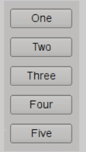|

### 3.4 QGridLayout

```C++
// 构造函数
QGridLayout::QGridLayout();
QGridLayout::QGridLayout(QWidget *parent);

// 添加窗口对象到网格布局中
/*
参数:
  - widget: 添加到布局中的窗口对象
  - row: 添加到布局中的窗口对象位于第几行 (从0开始)
  - column: 添加到布局中的窗口对象位于第几列 (从0开始)
  - alignment: 窗口在布局中的对齐方式, 没有特殊需求使用默认值即可
*/
void QGridLayout::addWidget(
    QWidget *widget, int row, int column, 
Qt::Alignment alignment = Qt::Alignment());

/*
参数:
  - widget: 添加到布局中的窗口对象
  - fromRow: 添加到布局中的窗口对象位于第几行 (从0开始)
  - fromColumn: 添加到布局中的窗口对象位于第几列 (从0开始)
  - rowSpan: 添加的窗口从 fromRow 行开始跨越的行数
  - columnSpan: 添加的窗口从 fromColumn 列开始跨越的列数
  - alignment: 窗口在布局中的对齐方式, 没有特殊需求使用默认值即可
*/
void QGridLayout::addWidget(
QWidget *widget, int fromRow, int fromColumn, 
int rowSpan, int columnSpan, 
Qt::Alignment alignment = Qt::Alignment());

// 设置 column 对应的列的最新宽度, 单位: 像素
void QGridLayout::setColumnMinimumWidth(int column, int minSize);

// 设置布局中水平方向窗口之间间隔的宽度
void QGridLayout::setHorizontalSpacing(int spacing);

// 设置布局中垂直方向窗口之间间隔的宽度
void QGridLayout::setVerticalSpacing(int spacing);
```

测试代码如下:

```C++
// 创建父窗口对象
QWidget* window = new QWidget;
// 创建子窗口对象
QPushButton *button1 = new QPushButton("One");
QPushButton *button2 = new QPushButton("Two");
QPushButton *button3 = new QPushButton("Three");
QPushButton *button4 = new QPushButton("Four");
QPushButton *button5 = new QPushButton("Five");
QPushButton *button6 = new QPushButton("Six");
// 多行文本编辑框
QTextEdit* txedit = new QTextEdit;
txedit->setText("我占用了两行两列的空间哦。");

QGridLayout* layout = new QGridLayout;
// 按钮起始位置: 第1行, 第1列, 该按钮占用空间情况为1行1列
layout->addWidget(button1, 0, 0);
// 按钮起始位置: 第1行, 第2列, 该按钮占用空间情况为1行1列
layout->addWidget(button2, 0, 1);
// 按钮起始位置: 第1行, 第3列, 该按钮占用空间情况为1行1列
layout->addWidget(button3, 0, 2);
// 编辑框起始位置: 第2行, 第1列, 该按钮占用空间情况为2行2列
layout->addWidget(txedit, 1, 0, 2, 2);
// 按钮起始位置: 第2行, 第3列, 该按钮占用空间情况为1行1列
layout->addWidget(button4, 1, 2);
// 按钮起始位置: 第3行, 第3列, 该按钮占用空间情况为1行1列
layout->addWidget(button5, 2, 2);
// 按钮起始位置: 第4行, 第1列, 该按钮占用空间情况为1行3列
layout->addWidget(button6, 3, 0, 1, 3);

// 网格布局设置给父窗口对象
window->setLayout(layout);
// 显示父窗口
window->show();
```

测试代码效果展示:

| ##container## |
|:--:|
|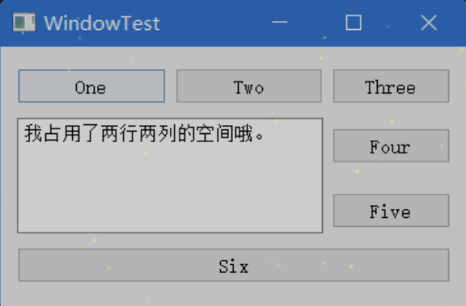|
