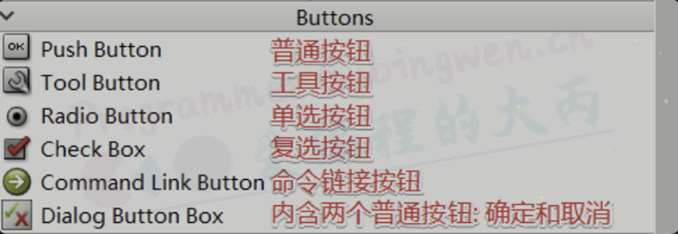
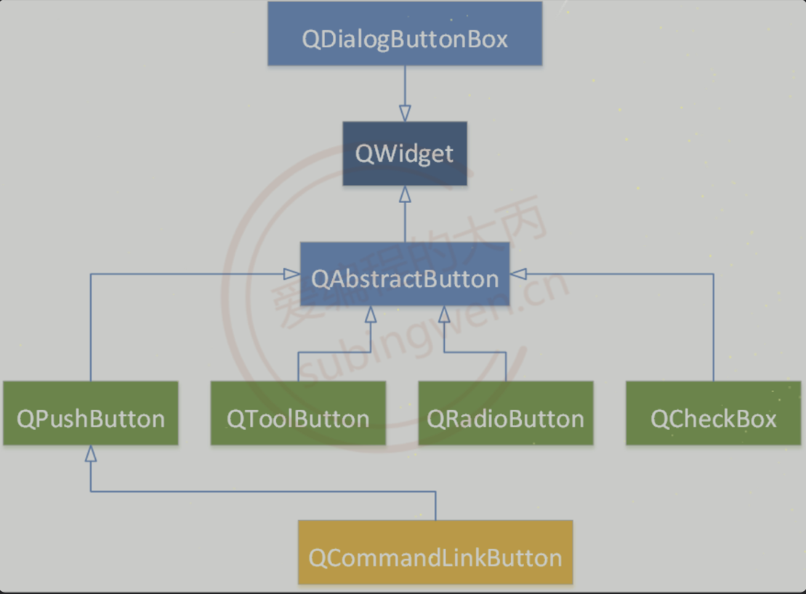
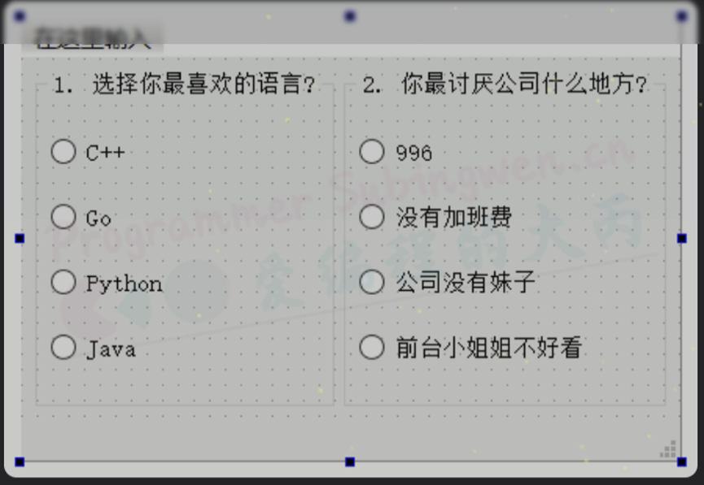
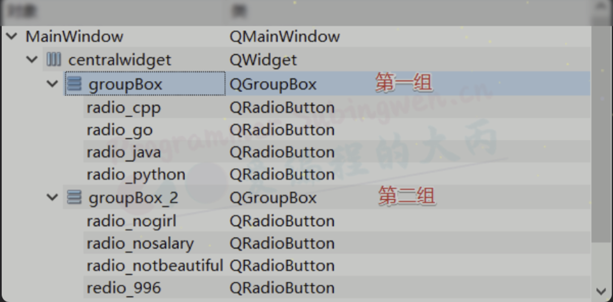
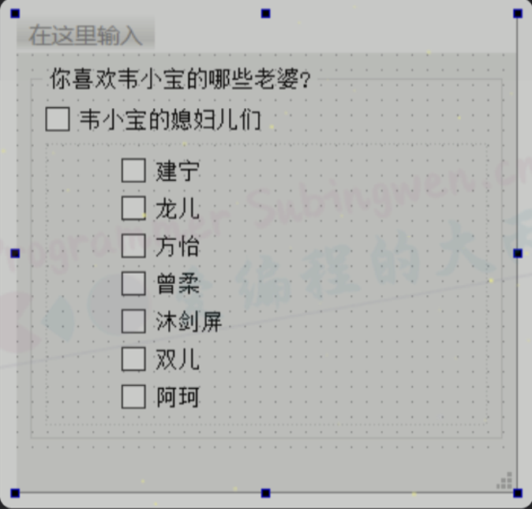
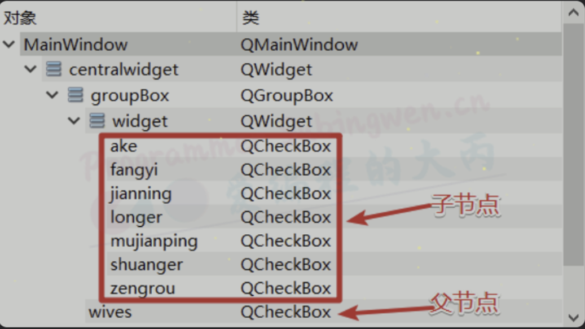
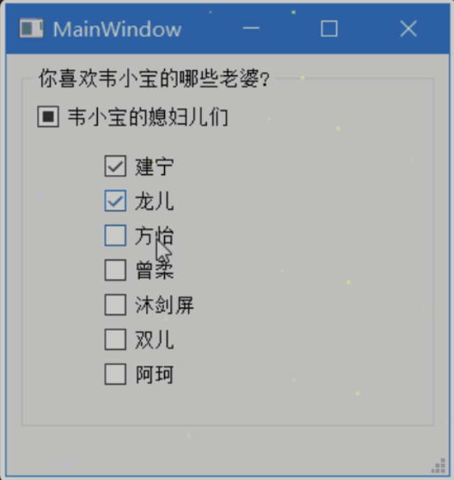

# Qt中按钮类型的控件
## 1. 按钮基类 QAbstractButton
在QT中为我们提供了可以直接使用的按钮控件, 如下图。这些按钮种类虽然繁多， 但是它们都拥有相同的父类`QAbstractButton`。这些子类按钮的大部分属性都是从这个基类继承的，因此搞明白这个类为我们提供的相关功能还是非常重要的。

其中`Dialog Button Box`比较特殊不是一个单一控件, 它是两个`QPushButton`的组合并且水平排列, 这个不能作为一个新控件来研究。

| ##container## |
|:--:|
||

继承关系如下:

| ##container## |
|:--:|
||

下边从功能的视角, 给大家介绍一下`QAbstractButton`中的一些常用API

### 1.1 标题和图标

```C++
// 参数text的内容显示到按钮上
void QAbstractButton::setText(const QString &text);
// 得到按钮上显示的文本内容, 函数的返回就是
QString QAbstractButton::text() const;

// 得到按钮设置的图标
QIcon icon() const;
// 给按钮设置图标
void setIcon(const QIcon &icon);

// 得到按钮图标大小
QSize iconSize() const
// 设置按钮图标的大小
[slot]void setIconSize(const QSize &size);
```

### 1.2 按钮的 Check 属性

对应按钮来说, 一般有三种常见状态, 分别为: Normal, Hover, Pressed。

- **Normal**: 普通状态, 没有和鼠标做任何接触
- **Hover**: 悬停状态, 鼠标位于按钮之上, 但是并未按下
- **Pressed**: 按压状态, 鼠标键在按钮上处于按下状态

默认情况下, 鼠标在按钮上按下, 按钮从 Normal 切换到 Pressed状态, 鼠标释放, 按钮从 Pressed恢复到Normal状态。

当我们给按钮设置了 check 属性之后，情况就有所不同了，在按钮上释放鼠标键，按钮依然会处在 Pressed 状态, 再次点击按钮, 按钮才能恢复到 Normal 状态。具有check属性的按钮就相当于一个开关, 每点击一次才能实现一次状态的切换。

```C++
// 判断按钮是否设置了checkable属性, 如果设置了点击按钮, 按钮一直处于选中状态
// 默认这个属性是关闭的, not checkable
bool QAbstractButton::isCheckable() const;
// 设置按钮的checkable属性
// 参数为true: 点击按钮, 按钮被选中, 松开鼠标, 按钮不弹起
// 参数为false: 点击按钮, 按钮被选中, 松开鼠标, 按钮弹起
void QAbstractButton::setCheckable(bool);

    
// 判断按钮是不是被按下的选中状态
bool QAbstractButton::isChecked() const;
// 设置按钮的选中状态: true-选中, false-没选中
// 设置该属性前, 必须先进行 checkable属性的设置
void QAbstractButton::setChecked(bool);
```

### 1.3 信号
这些信号都按钮被点击之后发射出来的, 只是在细节上有细微的区别, 其中最常用的是`clicked()`, 通过鼠标的不同瞬间状态可以发射出`pressed()`和`released()`信号, 如果鼠标设置了`check`属性, 一般通过`toggled()`信号判断当前按钮是选中状态还是非选中状态。

```C++
/*
当按钮被激活时(即，当鼠标光标在按钮内时按下然后释放)，当键入快捷键时，或者当click()或animateClick()被调用时，这个信号被发出。
值得注意的是，如果调用setDown()、setChecked()或toggle()，则不会触发此信号。
*/
[signal] void QAbstractButton::clicked(bool checked = false);
// 在按下按钮的时候发射这个信号
[signal] void QAbstractButton::pressed();
// 在释放这个按钮的时候发射直观信号
[signal] void QAbstractButton::released();
// 每当可检查按钮改变其状态时，就会发出此信号。checked在选中按钮时为true，在未选中按钮时为false。
[signal] void QAbstractButton::toggled(bool checked);
```

### 1.4 槽函数

```C++
// 执行一个动画点击:按钮被立即按下，并在毫秒后释放(默认是100毫秒)。
[slot] void QAbstractButton::animateClick(int msec = 100);
// 执行一次按钮点击, 相当于使用鼠标点击了按钮
[slot] void QAbstractButton::click();

// 参考 1.2 中的函数介绍
[slot] void QAbstractButton::setChecked(bool);
// 设置按钮上图标大小
[slot]void setIconSize(const QSize &size);
// 切换可检查按钮的状态。 checked <==> unchecked
[slot] void QAbstractButton::toggle();
```

了解了基类提供的功能之后, 下边着重给大家介绍一下按钮组中常用的几这个按钮控件： QPushButton, QToolButton, QRadioButton, QCheckBox。

## 2. QPushButton
### 2.1 常用API
这种类型的按钮是Qt按钮中使用频率最高的一个, 对这个类进行操作, 大部分时候都需要使用它从父类继承过来的那些 API。

在QPushButton类中, 比较常用的一些API函数如下:

```C++
// 构造函数
/*
参数:
    - icon: 按钮上显示的图标
    - text: 按钮上显示的标题
    - parent: 按钮的父对象, 可以不指定
*/
QPushButton::QPushButton(const QIcon &icon, const QString &text, QWidget *parent = nullptr);
QPushButton::QPushButton(const QString &text, QWidget *parent = nullptr);
QPushButton::QPushButton(QWidget *parent = nullptr);

// 判断按钮是不是默认按钮
bool isDefault() const;
// 一般在对话框窗口中使用, 将按钮设置为默认按钮, 自动关联 Enter 键 
void setDefault(bool);

/*
将弹出菜单菜单与此按钮关联起来。这将把按钮变成一个菜单按钮，
在某些样式中会在按钮文本的右边产生一个小三角形。
*/
void QPushButton::setMenu(QMenu *menu);

/*
显示(弹出)相关的弹出菜单。如果没有这样的菜单，这个函数什么也不做。
这个函数直到弹出菜单被用户关闭后才返回。
*/
[slot] void QPushButton::showMenu();
```

### 2.2 按钮的使用
通过API的介绍, 我们可以知道, 使用QPushButton这种类型的按钮, 有三种使用方式:

- 作为普通按钮, 可以显示文本信息和图标
- 设置check属性, 使其可以处于持续的被选中状态
- 关联一个菜单, 点击按钮菜单弹出

具体操作可以参考如下代码:

```C++
MainWindow::MainWindow(QWidget *parent)
    : QMainWindow(parent)
    , ui(new Ui::MainWindow)
{
    ui->setupUi(this);

    // 普通按钮, 没有checked属性
    ui->normalBtn->setText("我是小猪佩奇");
    ui->normalBtn->setIcon(QIcon(":/Peppa-Pig.png"));
    ui->normalBtn->setIconSize(QSize(30, 30));
    connect(ui->normalBtn, &QPushButton::clicked, this, [=]() {
         qDebug() << "我是一个普通按钮, 图标是小猪佩奇...";
    });

    // 有checked属性的按钮
    ui->checkedBtn->setCheckable(true);
    connect(ui->checkedBtn, &QPushButton::toggled, this, [=](bool bl) {
         qDebug() << "我是一个checked按钮, 当前状态为:" << bl;
    });

    // 关联菜单
    ui->menuBtn->setText("你喜欢哪种美女?");
    QMenu* menu = new QMenu;
    QAction* act = menu->addAction("可爱的");
    menu->addAction("粘人的");
    menu->addAction("胸大的");
    menu->addAction("屁股翘的");
    ui->menuBtn->setMenu(menu);
    connect(act, &QAction::triggered, this, [=] {
        qDebug() << "我是一个可爱的女人, 今晚约吗?";
    });
}
```

## 3. QToolButton
### 3.1 常用API
这个类也是一个常用按钮类, 使用方法和功能跟`QPushButton`基本一致, 只不过在对于关联菜单这个功能点上, `QToolButton`类可以设置弹出的菜单的属性, 以及在显示图标的时候可以设置更多的样式, 可以理解为是一个增强版的`QPushButton`。

和`QPushButton`类相同的是, 操作这个按钮使用的大部分函数都是从父类`QAbstractButton`继承过来的。

```C++
///////////////////////////// 构造函数 /////////////////////////////
QToolButton::QToolButton(QWidget *parent = nullptr);

/////////////////////////// 公共成员函数 ///////////////////////////
/*
    1. 将给定的菜单与此工具按钮相关联。
    2. 菜单将根据按钮的弹出模式显示。
    3. 菜单的所有权没有转移到“工具”按钮(不能建立父子关系)
*/
void QToolButton::setMenu(QMenu *menu);
// 返回关联的菜单，如果没有定义菜单，则返回nullptr。
QMenu *QToolButton::menu() const;

/*
弹出菜单的弹出模式是一个枚举类型: QToolButton::ToolButtonPopupMode, 取值如下:
    - QToolButton::DelayedPopup: 
        - 延时弹出, 按压工具按钮一段时间后才能弹出, 比如:浏览器的返回按钮
        - 长按按钮菜单弹出, 但是按钮的 clicked 信号不会被发射
    - QToolButton::MenuButtonPopup: 
        - 在这种模式下，工具按钮会显示一个特殊的箭头，表示有菜单。
    - 当按下按钮的箭头部分时，将显示菜单。按下按钮部分发射 clicked 信号
    - QToolButton::InstantPopup: 
        - 当按下工具按钮时，菜单立即显示出来。
        - 在这种模式下，按钮本身的动作不会被触发(不会发射clicked信号
*/
// 设置弹出菜单的弹出方式
void setPopupMode(QToolButton::ToolButtonPopupMode mode);
// 获取弹出菜单的弹出方式
QToolButton::ToolButtonPopupMode popupMode() const;

/*
QToolButton可以帮助我们在按钮上绘制箭头图标, 是一个枚举类型, 取值如下: 
    - Qt::NoArrow: 没有箭头
    - Qt::UpArrow: 箭头向上
    - Qt::DownArrow: 箭头向下
    - Qt::LeftArrow: 箭头向左
    - Qt::RightArrow: 箭头向右
*/
// 显示一个箭头作为QToolButton的图标。默认情况下，这个属性被设置为Qt::NoArrow。
void setArrowType(Qt::ArrowType type);
// 获取工具按钮上显示的箭头图标样式
Qt::ArrowType arrowType() const;

///////////////////////////// 槽函数 /////////////////////////////
// 给按钮关联一个QAction对象, 主要目的是美化按钮
[slot] void QToolButton::setDefaultAction(QAction *action);
// 返回给按钮设置的QAction对象
QAction *QToolButton::defaultAction() const;

/*
图标的显示样式是一个枚举类型->Qt::ToolButtonStyle, 取值如下:
    - Qt::ToolButtonIconOnly: 只有图标, 不显示文本信息
    - Qt::ToolButtonTextOnly: 不显示图标, 只显示文本信息
    - Qt::ToolButtonTextBesideIcon: 文本信息在图标的后边显示
    - Qt::ToolButtonTextUnderIcon: 文本信息在图标的下边显示
    - Qt::ToolButtonFollowStyle: 跟随默认样式(只显示图标)
*/
// 设置的这个属性决定工具按钮是只显示一个图标、只显示文本，还是在图标旁边/下面显示文本。
[slot] void QToolButton::setToolButtonStyle(Qt::ToolButtonStyle style);
// 返回工具按钮设置的图标显示模式
Qt::ToolButtonStyle toolButtonStyle() const;


// 显示相关的弹出菜单。如果没有这样的菜单，这个函数将什么也不做。这个函数直到弹出菜单被用户关闭才会返回。
[slot] void QToolButton::showMenu();
```

### 3.2 按钮的使用

通过API的介绍, 我们可以知道, 使用`QToolButton`这种类型的按钮, 有三种使用方式:

1. 作为普通按钮, 可以显示文本信息和图标
2. 按钮的图标可以使用不同的方式设置, 并且制定图标和文本信息的显示模式
3. 设置check属性, 使其可以处于持续的被选中状态
4. 关联一个菜单, 点击按钮菜单弹出, 并且可以设置菜单的弹出方式

具体操作可以参考如下代码:

```C++
MainWindow::MainWindow(QWidget *parent)
    : QMainWindow(parent)
    , ui(new Ui::MainWindow)
{
    ui->setupUi(this);

    // 普通按钮, 没有checked属性
    ui->normalBtn->setText("我是个屌丝");
    ui->normalBtn->setIconSize(QSize(50, 50));
    ui->normalBtn->setIcon(QIcon(":/mario.png"));
    connect(ui->normalBtn, &QToolButton::clicked, this, [=]() {
         qDebug() << "我是一个普通按钮, 是一个屌丝...";
    });
    // 设置图标和文本的显示模式
    ui->normalBtn->setToolButtonStyle(Qt::ToolButtonTextBesideIcon);
    // 基于QAction的方式给按钮设置图标和文本信息
    QAction* actBtn = new QAction(QIcon(":/mushroom_life.png"), "奥利给");
    ui->actionBtn->setDefaultAction(actBtn);
    connect(ui->actionBtn, &QToolButton::triggered, this, [=](QAction* act) {
        act->setText("我是修改之后的马里奥...");
        act->setIcon(QIcon(":/mario.png"));
    });
    // 设置图标和文本的显示模式
    ui->actionBtn->setToolButtonStyle(Qt::ToolButtonTextUnderIcon);
    
    // 基于自带样式, 给按钮设置箭头图标
    ui->arrowBtn->setArrowType(Qt::UpArrow);
    ui->arrowBtn->setText("向上");
    // 设置图标和文本的显示模式
    ui->arrowBtn->setToolButtonStyle(Qt::ToolButtonTextUnderIcon);


    // 有checked属性的按钮
    ui->checkedBtn->setCheckable(true);
    connect(ui->checkedBtn, &QToolButton::toggled, this, [=](bool bl) {
         qDebug() << "我是一个checked按钮, 当前状态为:" << bl;
    });

    // 关联菜单
    ui->menuBtn->setText("你喜欢哪种美女?");
    QMenu* menu = new QMenu;
    QAction* act = menu->addAction("可爱的");
    menu->addAction("粘人的");
    menu->addAction("胸大的");
    menu->addAction("屁股翘的");
    ui->menuBtn->setMenu(menu);
    connect(act, &QAction::triggered, this, [=] {
        qDebug() << "我是一个可爱的女人, 今晚约吗?";
    });

    ui->popmenu->setMenu(menu);
    /*
    弹出菜单的弹出模式是一个枚举类型: QToolButton::ToolButtonPopupMode, 取值如下:
      - QToolButton::DelayedPopup: 
          - 延时弹出, 按压工具按钮一段时间后才能弹出, 比如:浏览器的返回按钮
          - 长按按钮菜单弹出, 但是按钮的 clicked 信号不会被发射
      - QToolButton::MenuButtonPopup: 
          - 在这种模式下，工具按钮会显示一个特殊的箭头，表示有菜单。
      - 当按下按钮的箭头部分时，将显示菜单。按下按钮部分发射 clicked 信号
      - QToolButton::InstantPopup: 
          - 当按下工具按钮时，菜单立即显示出来。
          - 在这种模式下，按钮本身的动作不会被触发(不会发射clicked信号
    */
    ui->popmenu->setPopupMode(QToolButton::MenuButtonPopup);
    // 测试关联了菜单的按钮是否会发射clicked信号
    connect(ui->popmenu, &QToolButton::clicked, this, [=]() {
        qDebug() << "我是popMenu按钮, 好痒呀...";
    });
}
```

## 4. QRadioButton
`QRadioButton`是Qt提供的单选按钮, 一般都是以组的方式来使用(多个按钮中同时只能选中其中一个)。操作这个按钮使用的大部分函数都是从父类继承过来的, 它的父类是`QAbstractButton`。

关于单选按钮的使用我们还需要注意一点, 如果单选按钮被选中, 再次点击这个按钮选中状态是不能被取消的。

### 4.1 常用API
这个类混的很失败, 一直生活在父类的阴影之下, 也没有什么作为, 在官方的帮助文档中, 处理构造函数就没有再提供其他可用的 API 了:

```C++
// 构造函数
/*
参数:
    - text: 按钮上显示的标题
    - parent: 按钮的父对象
*/
QRadioButton::QRadioButton(const QString &text, QWidget *parent = nullptr);
QRadioButton::QRadioButton(QWidget *parent = nullptr);
```
### 4.2 按钮的使用
单选按钮一般是以组的形式来使用的, 如果在一个窗口中需要有多个单选按钮组, 应该如何处理呢?

在同一窗口中, Qt会认为所有的单选按钮都属于同一组, 如果需要多个单选按钮组, 应该将他们放到不同的子窗口中。

| ##container## |
|:--:|
||

通过上图可以看到有两个单选按钮组, 在制作的时候分别将单选按钮放到了不同的容器窗口（组框）中，这样就被人为分隔为两组了。

| ##container## |
|:--:|
||

如果我们使用鼠标点击了某个单选按钮, 按钮还是会发射出`clicked()`信号, 简单的按钮测试代码如下所示:

```C++
void MainWindow::on_redio_996_clicked() {
    qDebug() << "996";
}

void MainWindow::on_radio_nosalary_clicked() {
    qDebug() << "没有加班费";
}

void MainWindow::on_radio_nogirl_clicked() {
    qDebug() << "公司没有妹子...";
}

// clicked 信号传递的参数可以接收, 也可以不接收 
// 这个参数对应这中类型的按钮没啥用
void MainWindow::on_radio_notbeautiful_clicked(bool checked) {
    qDebug() << "前台小姐姐不好看!!!";
}
```

## 5. QCheckBox
`QCheckBox`是Qt中的复选框按钮, 可以单独使用, 也可以以组的方式使用(同一组可以同时选中多个), 当复选按钮被选中, 再次点击之后可以取消选中状态, 这一点和单选按钮是不同的。

操作这个按钮使用的大部分函数都是从父类继承过来的, 它的父类是`QAbstractButton`。

### 5.1 常用API
我们对复选框按钮操作的时候, 可以设置选中和未选中状态, 并且还可以设置半选中状态, 这种半选中状态一般需要当前复选框按钮下还有子节点, 类似一树状结构。

- 公共成员函数

```C++
// 构造函数
/*
参数:
    - text: 按钮上显示的文本信息
    - parent: 按钮的父对象
*/
QCheckBox::QCheckBox(const QString &text, QWidget *parent = nullptr);
QCheckBox::QCheckBox(QWidget *parent = nullptr);

// 判断当前复选框是否为三态复选框, 默认情况下为两种状态: 未选中, 选中
bool isTristate() const;
// 设置当前复选框为三态复选框: 未选中, 选中, 半选中
void setTristate(bool y = true);

/*
参数 state, 枚举类型 Qt::CheckState:
    - Qt::Unchecked          --> 当前复选框没有被选中
    - Qt::PartiallyChecked    --> 当前复选框处于半选中状态, 部分被选中(三态复选框)
    - Qt::Checked          --> 当前复选框处于选中状态
*/
// 设置复选框按钮的状态
void QCheckBox::setCheckState(Qt::CheckState state);
// 获取当前复选框的状态
Qt::CheckState QCheckBox::checkState() const;
```

- 信号

```C++
// 当复选框的状态改变时，即当用户选中或取消选中复选框时，他的信号就会发出。
// 参数 state 表示的是复选框的三种状态中某一种, 可参考 Qt::CheckState
[signal] void QCheckBox::stateChanged(int state);
```
### 5.2 按钮的使用
下面针对于复选框按钮的三种状态, 为大家展示一下对应的操作流程, 首先第一步搭建一个有树状关系的界面:

| ##container## |
|:--:|
||

这些复选框按钮的关系以及`objectName`如下:

| ##container## |
|:--:|
||

第二步, 在窗口类的头文件中添加槽函数, 槽函数处理复选框按钮的状态变化

```C++
// mainwindow.h
QT_BEGIN_NAMESPACE
namespace Ui { class MainWindow; }
QT_END_NAMESPACE

class MainWindow : public QMainWindow {
    Q_OBJECT

public:
    MainWindow(QWidget *parent = nullptr);
    ~MainWindow();

private slots:
    // 添加槽函数, 处理复选框按钮状态变化
    void statusChanged(int state);

private:
    Ui::MainWindow *ui;
    int m_number = 0;    // 添加一个计数器, 记录有几个子节点被选中了
};
```

第三步, 在源文件中添加处理逻辑

```C++
// mainwindow.cpp
// 窗口的构造函数
MainWindow::MainWindow(QWidget *parent)
    : QMainWindow(parent)
    , ui(new Ui::MainWindow)
{
    ui->setupUi(this);

    // 设置根节点的三态属性
    ui->wives->setTristate(true);
    // 处理根节点的鼠标点击事件
    connect(ui->wives, &QCheckBox::clicked, this, [=](bool bl) {
        if(bl) {
            // 子节点全部设置为选中状态
            ui->jianning->setChecked(true);
            ui->fangyi->setChecked(true);
            ui->longer->setChecked(true);
            ui->zengrou->setChecked(true);
            ui->mujianping->setChecked(true);
            ui->shuanger->setChecked(true);
            ui->ake->setChecked(true);
        } else {
            // 子节点全部设置为非选中状态
            ui->jianning->setChecked(false);
            ui->fangyi->setChecked(false);
            ui->longer->setChecked(false);
            ui->zengrou->setChecked(false);
            ui->mujianping->setChecked(false);
            ui->shuanger->setChecked(false);
            ui->ake->setChecked(false);
        }
    });

    // 处理子节点的状态变化, 对应的槽函数相同
    connect(ui->jianning, &QCheckBox::stateChanged, this, &MainWindow::statusChanged);
    connect(ui->fangyi, &QCheckBox::stateChanged, this, &MainWindow::statusChanged);
    connect(ui->longer, &QCheckBox::stateChanged, this, &MainWindow::statusChanged);
    connect(ui->zengrou, &QCheckBox::stateChanged, this, &MainWindow::statusChanged);
    connect(ui->mujianping, &QCheckBox::stateChanged, this, &MainWindow::statusChanged);
    connect(ui->shuanger, &QCheckBox::stateChanged, this, &MainWindow::statusChanged);
    connect(ui->ake, &QCheckBox::stateChanged, this, &MainWindow::statusChanged);
}

// 槽函数
void MainWindow::statusChanged(int state) {
    if(state == Qt::Checked) {
        m_number ++;    // 选中一个子节点, 计数器加1
    } else {
        m_number --;   // 取消选中一个子节点, 计数器减1
    }

    // 根据计数器值判断根节点是否需要做状态的更新
    if(m_number == 7) {
        ui->wives->setCheckState(Qt::Checked);
    } else if(m_number == 0) {
        ui->wives->setCheckState(Qt::Unchecked);
    } else {
        ui->wives->setCheckState(Qt::PartiallyChecked);
    }
}
```

最终效果

| ##container## |
|:--:|
||
