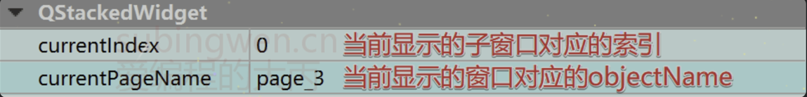

# Qt中容器类型的控件
## 1. QWidget
关于QWidget在前面的章节中([一、QWidget](../../002-QT基础/005-Qt中的基础窗口类/001-一、QWidget/index.md))已经介绍过了, 这个类是所有窗口类的父类, 可以作为独立窗口使用, 也可以内嵌到其它窗口中使用。

Qt中的所有控件都属于窗口类， 因此这个类也是所有控件类的基类。

如果一个窗口中还有子窗口， 为了让子窗口有序排列， 这时候我们可以选择一个`QWidget`类型的容器, 将子窗口放到里边, 然后再给这个`QWidget`类型窗口进行布局操作([Qt窗口布局](../../002-QT基础/006-Qt窗口布局/index.md))。

在这里给大家介绍一下关于这个类的一些属性，因为这个类是所有窗口类的基类，因此相关属性比较多，详细讲解可以观看视频 -> https://www.bilibili.com/video/BV1Ai4y1c7Di/?p=2

| ##container## |
|:--:|
||

关于这些属性大部分都有对应的API函数, 在属性名前加`set`即可, 大家可以自己从`QWidget`这个类里边搜索，并仔细阅读关于这些函数的参数介绍。

在Qt中我们除了使用QWidget类型窗口作为容器使用, 也可以根据实际需求选择其他类型的容器, 下面看看具体都有哪些。

| ##container## |
|:--:|
||

上述容器中， 后边着重为大家介绍一些常用的， 比如: Group Box, Scroll Area, Tool Box, Tab Widget, Stacked Widget, Frame, 关于 Dock Widget 在前边的章节([四、QMainWindow](../../002-QT基础/005-Qt中的基础窗口类/004-四、QMainWindow/index.md) - 停靠窗口)中已经介绍过了, 因此不在赘述。

## 2. Frame
`QFrame`就是一个升级版的`QWidget`, 它继承了`QWidget`的属性, 并且做了拓展, 这种类型的容器窗口可以提供边框, 并且可以设置边框的样式、宽度以及边框的阴影。

### 2.1 相关API
关于这个类的API, 一般是不在程序中调用的, 但是还是给大家介绍一下

```C++
/*
边框形状为布尔类型, 可选项为:
    - QFrame::NoFrame: 没有边框
    - QFrame::Box: 绘制一个框
    - QFrame::Panel: 绘制一个面板，使内容显示为凸起或凹陷
    - QFrame::StyledPanel: 绘制一个外观取决于当前GUI样式的矩形面板。它可以上升也可以下沉。
    - QFrame::HLine: 画一条没有边框的水平线(用作分隔符)
    - QFrame::VLine: 画一条没有边框的垂直线(用作分隔符)
    - QFrame::WinPanel: 绘制一个矩形面板，可以像Windows 2000那样向上或向下移动。
                        指定此形状将线宽设置为2像素。WinPanel是为了兼容而提供的。
                        对于GUI风格的独立性，我们建议使用StyledPanel代替。
*/
// 获取边框形状
Shape frameShape() const;
// 设置边框形状
void setFrameShape(Shape);


/*
Qt中关于边框的阴影(QFrame::Shadow)提供了3种样式, 分别为: 
    - QFrame::Plain: 简单的,朴素的, 框架和内容与周围环境显得水平;
                     使用调色板绘制QPalette::WindowText颜色(没有任何3D效果)
    - QFrame::Raised: 框架和内容出现凸起;使用当前颜色组的明暗颜色绘制3D凸起线
    - QFrame::Sunken: 框架及内容物凹陷;使用当前颜色组的明暗颜色绘制3D凹线
*/
// 获取边框阴影样式
Shadow frameShadow() const;
// 设置边框阴影样式
void setFrameShadow(Shadow);

// 得到边框线宽度
int lineWidth() const;
// 设置边框线宽度, 默认值为1
void setLineWidth(int);

// 得到中线的宽度
int midLineWidth() const;
// 设置中线宽度, 默认值为0, 这条线会影响边框阴影的显示
void setMidLineWidth(int);
```

### 2.2 属性设置
这个类的属性并不多, 都是关于边框的设置的。

| ##container## |
|:--:|
||

这个表格显示了一些边框样式和线宽以及阴影的组合:

| ##container## |
|:--:|
||

## 3. Group Box
QGroupBox类的基类是QWidget, 在这种类型的窗口中可以绘制边框、给窗口指定标题, 并且还支持显示复选框。

### 3.1 相关API
关于这个类的API不常用, 下面给大家介绍一下在编码过程中可能会用到的一些:

```C++
// 构造函数
QGroupBox::QGroupBox(QWidget *parent = Q_NULLPTR);
QGroupBox::QGroupBox(const QString &title, QWidget *parent = Q_NULLPTR);

// 公共成员函数
bool QGroupBox::isCheckable() const;
// 设置是否在组框中显示一个复选框
void QGroupBox::setCheckable(bool checkable);

/*
关于对齐方式需要使用枚举类型 Qt::Alignment, 其可选项为:
    - Qt::AlignLeft: 左对齐(水平方向)
    - Qt::AlignRight: 右对齐(水平方向)
    - Qt::AlignHCenter: 水平居中
    - Qt::AlignJustify: 在可用的空间内调整文本(水平方向)
    
    - Qt::AlignTop: 上对齐(垂直方向)
    - Qt::AlignBottom: 下对齐(垂直方向)
    - Qt::AlignVCenter: 垂直居中
*/
Qt::Alignment QGroupBox::alignment() const;
// 设置组框标题的对其方式
void QGroupBox::setAlignment(int alignment);

QString QGroupBox::title() const;
// 设置组框的标题
void QGroupBox::setTitle(const QString &title);

bool QGroupBox::isChecked() const;
// 设置组框中复选框的选中状态
[slot] void QGroupBox::setChecked(bool checked);
```

### 3.2 属性设置

关于组框的属性对应的就是上边介绍的那几个API函数, 属性窗口如下:

| ##container## |
|:--:|
||

组框中的`flat`属性没有对应的API函数, 只能在属性窗口中设置, 它控制的是窗口边框的绘制方式, 如果打开该属性, 组框的边框就消失了, 效果如下:

| ##container## |
|:--:|
||

## 4. Scroll Area
`QScrollArea`这种类型的容器, 里边可以放置一些窗口控件, 当放置的窗口控件大于当前区域导致无法全部显示的时候, 滚动区域容器会自动添加相应的滚动条(水平方向或者垂直方向), 保证放置到该区域中的所有窗口内容都可以正常显示出来。对于使用者不需要做太多事情, 只需要把需要显示的窗口放到滚动区域中就行了。

### 4.1 相关API
在某些特定环境下, 我们需要动态的往滚动区域内部添加要显示的窗口, 或者动态的将显示的窗口移除, 这时候就必须要调用对应的API函数来完成这部分操作了。主要API有两个 添加 -`setWidget()`, 移除 -`takeWidget()`

```C++
// 构造函数
QScrollArea::QScrollArea(QWidget *parent = Q_NULLPTR);

// 公共成员函数
// 给滚动区域设置要显示的子窗口widget
void QScrollArea::setWidget(QWidget *widget);
// 删除滚动区域中的子窗口, 并返回被删除的子窗口对象
QWidget *QScrollArea::takeWidget();

/*
关于显示位置的设定, 是一个枚举类型, 可选项为:
    - Qt::AlignLeft: 左对齐
    - Qt::AlignHCenter: 水平居中
    - Qt::AlignRight: 右对齐
    - Qt::AlignTop: 顶部对齐
    - Qt::AlignVCenter: 垂直对其
    - Qt::AlignBottom: 底部对其
*/
// 获取子窗口在滚动区域中的显示位置
Qt::Alignment alignment() const;
// 设置滚动区域中子窗口的对其方式, 默认显示的位置是右上
void setAlignment(Qt::Alignment);

// 判断滚动区域是否有自动调节小部件大小的属性
bool widgetResizable() const;
/*
1. 设置滚动区域是否应该调整视图小部件的大小, 该属性默认为false, 滚动区域按照小部件的默认大小进行显示。
2. 如果该属性设置为true，滚动区域将自动调整小部件的大小，避免滚动条出现在本可以避免的地方，
   或者利用额外的空间。
3. 不管这个属性是什么，我们都可以使用widget()->resize()以编程方式调整小部件的大小，
   滚动区域将自动调整自己以适应新的大小。
*/
void setWidgetResizable(bool resizable);
```

### 4.2 属性设置
关于滚动区域, 其属性窗口提供的属性一般不需要设置, 因为一般情况下即便是设置了也看不到效果， 即便如此， 还是看一下吧。至于具体原因在视频中有详细的说明，感兴趣的可以去看一下。

| ##container## |
|:--:|
||

### 4.3 窗口的动态添加和删除
关于窗口的滚动区域对象创建有两种方式, 第一种比较简单在编辑页面直接拖拽一个控件到UI界面, 然后布局即可。第二种方式是在程序中通过new操作创建一个实例对象, 然后通过通过代码的方式将其添加到窗口的某个布局中, 相对来说要麻烦一点。

下面通过第一种方式，演示一下如果往滚动区域中添加多个子窗口。

```C++
MainWindow::MainWindow(QWidget *parent)
    : QMainWindow(parent)
    , ui(new Ui::MainWindow)
{
    ui->setupUi(this);

    // 创建一个垂直布局对象
    QVBoxLayout* vlayout = new QVBoxLayout;

    for(int i = 0; i < 11; ++i) {
        // 创建标签对象
        QLabel* pic = new QLabel;
        // 拼接图片在资源文件中的路径
        QString name = QString(":/images/%1.png").arg(i+1);
        // 给标签对象设置显示的图片
        pic->setPixmap(QPixmap(name));
        // 设置图片在便签内部的对其方式
        pic->setAlignment(Qt::AlignHCenter);
        // 将标签添加到垂直布局中
        vlayout->addWidget(pic);
    }

    // 创建一个窗口对象
    QWidget* wg = new QWidget;
    // 将垂直布局设置给窗口对象
    wg->setLayout(vlayout);
    // 将带有垂直布局的窗口设置到滚动区域中
    ui->scrollArea->setWidget(wg);
}
```

关于以上代码做以下说明, 调用`setWidget(wg)`之后, wg会自动平铺填充满整个滚动区域, 因此:

- 在程序中调用`void setWidgetResizable(bool resizable);`不会有明显效果
- 在程序中调用`void setAlignment(Qt::Alignment);`不会看到任何效果
- 如果要设置显示的图片的对其方式要设置图片的载体对象即 标签签对象
- 如果要动态移除滚动区域中的窗口, 直接使用滚动区域对象调用`takeWidget()`即可

滚动区域中只能通过`setWidget(wg)`添加一个子窗口, 如果要添加多个可使用布局的方式来实现

## 5. Tool Box
`QToolBox`工具箱控件, 可以存储多个子窗口, 该控件可以实现类似QQ的抽屉效果, 每一个抽屉都可以设置图标和标题, 并且对应一个子窗口, 通过抽屉按钮就可以实现各个子窗口显示的切换。

### 5.1 相关API
这个类对应的API函数相对较多, 一部分是控件属性对应的属性设置函数, 一部分是编程过程中可能会用的到的, 怎么说呢, 理解为主吧, 知道有这么函数即可。

```C++
// 构造函数
QToolBox::QToolBox(QWidget *parent = Q_NULLPTR, Qt::WindowFlags f = Qt::WindowFlags());

// 公共成员
/*
addItem(), insertItem()函数相关参数:
    - widget: 添加到工具箱中的选项卡对应的子窗口对象
    - icon: 工具箱新的选项卡上显示的图标
    - text: 工具箱新的选项卡上显示的标题
    - index: 指定在工具箱中插入的新的选项卡的位置
*/
// 给工具箱尾部添加一个选项卡, 每个选项卡在工具箱中就是一个子窗口, 即参数widget
int QToolBox::addItem(QWidget *widget, const QString &text);
int QToolBox::addItem(QWidget *widget, const QIcon &icon, const QString &text);
// 在工具箱的指定位置添加一个选项卡, 即添加一个子窗口
int QToolBox::insertItem(int index, QWidget *widget, const QString &text);
int QToolBox::insertItem(int index, QWidget *widget, const QIcon &icon, 
                         const QString &text);
// 移除工具箱中索引index位置对应的选项卡, 注意: 只是移除对应的窗口对象并没有被销毁
void QToolBox::removeItem(int index);

// 设置索引index位置的选项卡是否可用, 参数 enabled=true为可用, enabled=false为禁用
void QToolBox::setItemEnabled(int index, bool enabled);
// 设置工具箱中index位置选项卡的图标
void QToolBox::setItemIcon(int index, const QIcon &icon);
// 设置工具箱中index位置选项卡的标题
void QToolBox::setItemText(int index, const QString &text);
// 设置工具箱中index位置选项卡的提示信息(需要鼠标在选项卡上悬停一定时长才能显示)
void QToolBox::setItemToolTip(int index, const QString &toolTip);

// 如果位置索引的项已启用，则返回true;否则返回false。
bool QToolBox::isItemEnabled(int index) const;
// 返回位置索引处项目的图标，如果索引超出范围，则返回空图标。
QIcon QToolBox::itemIcon(int index) const;
// 返回位于位置索引处的项的文本，如果索引超出范围，则返回空字符串。
QString QToolBox::itemText(int index) const;
// 返回位于位置索引处的项的工具提示，如果索引超出范围，则返回空字符串。
QString QToolBox::itemToolTip(int index) const;

// 得到当前工具箱中显示的选项卡对应的索引
int QToolBox::currentIndex() const;
// 返回指向当前选项卡对应的子窗口的指针，如果没有这样的项，则返回0。
QWidget *QToolBox::currentWidget() const;
// 返回工具箱中子窗口的索引，如果widget对象不存在，则返回-1
int QToolBox::indexOf(QWidget *widget) const;
// 返回工具箱中包含的项的数量。
int QToolBox::count() const;

// 信号
// 工具箱中当前显示的选项卡发生变化, 该信号被发射, index为当前显示的新的选项卡的对应的索引
[signal] void QToolBox::currentChanged(int index);

// 槽函数
// 通过工具箱中选项卡对应的索引设置当前要显示哪一个选项卡中的子窗口
[slot] void QToolBox::setCurrentIndex(int index);
// 通过工具箱中选项卡对应的子窗口对象设置当前要显示哪一个选项卡中的子窗口
[slot] void QToolBox::setCurrentWidget(QWidget *widget);
```

### 5.2 属性设置
关于这个容器控件的属性远比上边介绍的API要少, 来看一看吧

| ##container## |
|:--:|
||

## 6. Tab Widget
QTabWidget的一种带标签页的窗口，在这种类型的窗口中可以存储多个子窗口，每个子窗口的显示可以通过对应的标签进行切换。

### 6.1 相关API
介绍的这些API大部分是进行属性设置的, 因此我们可以完全不在程序中使用这些函数, 通属性窗口进行设置, 但是API操作比较灵活, 可以动态的设置相关属性。先来看公共成员函数:

```C++
// 构造函数
QTabWidget::QTabWidget(QWidget *parent = Q_NULLPTR);

// 公共成员函数
/*
添加选项卡addTab()或者插入选项卡insertTab()函数相关的参数如下:
    - page: 添加或者插入的选项卡对应的窗口实例对象
    - label: 添加或者插入的选项卡的标题
    - icon: 添加或者插入的选项卡的图标
    - index: 将新的选项卡插入到索引index的位置上
*/
int QTabWidget::addTab(QWidget *page, const QString &label);
int QTabWidget::addTab(QWidget *page, const QIcon &icon, const QString &label);
int QTabWidget::insertTab(int index, QWidget *page, const QString &label);
int QTabWidget::insertTab(int index, QWidget *page, 
                          const QIcon &icon, const QString &label);
// 删除index位置的选项卡
void QTabWidget::removeTab(int index);

// 得到选项卡栏中的选项卡的数量
int count() const;
// 从窗口中移除所有页面，但不删除它们。调用这个函数相当于调用removeTab()，直到选项卡小部件为空为止。
void QTabWidget::clear();
// 获取当前选项卡对应的索引
int QTabWidget::currentIndex() const;
// 获取当前选项卡对应的窗口对象地址
QWidget *QTabWidget::currentWidget() const;
// 返回索引位置为index的选项卡页，如果索引超出范围则返回0。
QWidget *QTabWidget::widget(int index) const;

/*
标签上显示的文本样式为枚举类型 Qt::TextElideMode, 可选项为:
    - Qt::ElideLeft: 省略号应出现在课文的开头，例如：.....是的,我很帅。
    - Qt::ElideRight: 省略号应出现在文本的末尾，例如：我帅吗.....。
    - Qt::ElideMiddle: 省略号应出现在文本的中间，例如：我帅.....很帅。
    - Qt::ElideNone: 省略号不应出现在文本中
*/
// 获取标签上显示的文本模式
Qt::TextElideMode QTabWidget::elideMode() const;
// 如何省略标签栏中的文本, 此属性控制在给定的选项卡栏大小没有足够的空间显示项时如何省略项。
void QTabWidget::setElideMode(Qt::TextElideMode);
    
// 得到选项卡上图标的尺寸信息
QSize QTabWidget::iconSize() const
// 设置选项卡上显示的图标大小
void QTabWidget::setIconSize(const QSize &size)

// 判断用户是否可以在选项卡区域内移动选项卡, 可以返回true, 否则返回false
bool QTabWidget::isMovable() const;
// 此属性用于设置用户是否可以在选项卡区域内移动选项卡。默认情况下，此属性为false;
void QTabWidget::setMovable(bool movable);

// 判断选项卡是否可以自动隐藏, 如果可以自动隐藏返回true, 否则返回false
bool QTabWidget::tabBarAutoHide() const;
// 如果为true，则当选项卡栏包含少于2个选项卡时，它将自动隐藏。默认情况下，此属性为false。
void QTabWidget::setTabBarAutoHide(bool enabled);

// 判断index对应的选项卡是否是被启用的, 如果是被启用的返回true, 否则返回false
bool QTabWidget::isTabEnabled(int index) const;
// 如果enable为true，则在索引位置的页面是启用的;否则，在位置索引处的页面将被禁用。
void QTabWidget::setTabEnabled(int index, bool enable);

// 得到index位置的标签对应的图标
QIcon QTabWidget::tabIcon(int index) const;
// 在位置索引处设置标签的图标。
void QTabWidget::setTabIcon(int index, const QIcon &icon);

/*
选项卡标签的位置通过枚举值进行指定, 可使用的选项如下:
    - QTabWidget::North: 北(上), 默认
    - QTabWidget::South: 南(下)
    - QTabWidget::West:     西(左)
    - QTabWidget::East:  东(右)
*/
// 得到选项卡中显示的标签的位置, 即: 东, 西, 南, 北
TabPosition QTabWidget::tabPosition() const;
// 设置选项卡中标签显示的位置, 默认情况下，此属性设置为North。
void QTabWidget::setTabPosition(TabPosition);

/*
选项卡标签的形状通过枚举值进行指定, 可使用的选项如下:
    - QTabWidget::Rounded: 标签以圆形的外观绘制。这是默认形状
    - QTabWidget::Triangular: 选项卡以三角形外观绘制。
*/
// 获得选项卡标签的形状
TabShape QTabWidget::tabShape() const;
// 设置选项卡标签的形状
void QTabWidget::setTabShape(TabShape s);

// 得到index位置的标签的标题
QString QTabWidget::tabText(int index) const;
// 设置选项卡index位置的标签的标题
void QTabWidget::setTabText(int index, const QString &label);


// 获取index对应的标签页上设置的提示信息
QString QTabWidget::tabToolTip(int index) const;
// 设置选项卡index位置的标签的提示信息(鼠标需要悬停在标签上一定时长才能显示)
void QTabWidget::setTabToolTip(int index, const QString &tip);


// 判断选项卡标签也上是否有关闭按钮, 如果有返回true, 否则返回false
bool QTabWidget::tabsClosable() const;
// 设置选项卡的标签页上是否显示关闭按钮, 该属性默认情况下为false
void QTabWidget::setTabsClosable(bool closeable);


// 判断选项卡栏中是否有滚动按钮, 如果有返回true, 否则返回false
bool QTabWidget::usesScrollButtons() const;
// 设置选项卡栏有许多标签时，它是否应该使用按钮来滚动标签。
// 当一个选项卡栏有太多的标签时，选项卡栏可以选择扩大它的大小，或者添加按钮，让标签在选项卡栏中滚动。
void QTabWidget::setUsesScrollButtons(bool useButtons);

// 判断窗口是否设置了文档模式, 如果设置了返回true, 否则返回false
bool QTabWidget::documentMode() const;
// 此属性保存选项卡小部件是否以适合文档页面的模式呈现。这与macOS上的文档模式相同。
// 不设置该属性, QTabWidget窗口是带边框的, 如果设置了该属性边框就没有了。
void QTabWidget::setDocumentMode(bool set);
```

- 信号
 
```C++
// 每当当前页索引改变时，就会发出这个信号。参数是新的当前页索引位置，如果没有新的索引位置，则为-1
[signal] void QTabWidget::currentChanged(int index);
// 当用户单击索引处的选项卡时，就会发出这个信号。index指所单击的选项卡，如果光标下没有选项卡，则为-1。
[signal] void QTabWidget::tabBarClicked(int index)
// 当用户双击索引上的一个选项卡时，就会发出这个信号。
// index是单击的选项卡的索引，如果光标下没有选项卡，则为-1。
[signal] void QTabWidget::tabBarDoubleClicked(int index);
// 此信号在单击选项卡上的close按钮时发出。索引是应该被删除的索引。     
[signal] void QTabWidget::tabCloseRequested(int index);
```

- 槽函数

```C++
// 设置当前窗口中显示选项卡index位置对应的标签页内容
[slot] void QTabWidget::setCurrentIndex(int index);
// 设置当前窗口中显示选项卡中子窗口widget中的内容
[slot] void QTabWidget::setCurrentWidget(QWidget *widget);
```

### 6.2 属性设置
容器类型的控件其大多数情况下都是直接在属性窗口中直接设置, 因为这些属性设置完毕之后, 就无需再做修改了, 程序运行过程中无需做任何变化。下图为大家标注了每个属性对应的功能。

| ##container## |
|:--:|
||

### 6.3 控件使用
关于这个控件的使用, 主要是通过代码的方式演示一下相关信号发射的时机, 再有就是当标签页添加了关闭按钮并点击了该按钮, 如果移除该标签页已经如何将其再次添加到窗口中。

第一步, 在头文件中添加存储已关闭的标签对应的窗口对象和标签标题的容器

```C++
// mainwindow.h
QT_BEGIN_NAMESPACE
namespace Ui { class MainWindow; }
QT_END_NAMESPACE

class MainWindow : public QMainWindow {
    Q_OBJECT

public:
    MainWindow(QWidget *parent = nullptr);
    ~MainWindow();

private:
    Ui::MainWindow *ui;
    QQueue<QWidget*> m_widgets;    // 存储标签对应的窗口对象
    QQueue<QString> m_names;    // 存储标签标题
};
```

第二步在源文件中添加处理动作

```C++
// mainwindow.cpp
MainWindow::MainWindow(QWidget *parent)
    : QMainWindow(parent)
    , ui(new Ui::MainWindow)
{
    ui->setupUi(this);

    // 点击了标签上的关闭按钮
    connect(ui->tabWidget, &QTabWidget::tabCloseRequested, this, [=](int index) {
        // 保存信息
        QWidget* wg = ui->tabWidget->widget(index);
        QString title = ui->tabWidget->tabText(index);
        m_widgets.enqueue(wg);
        m_names.enqueue(title);
        // 移除tab页
        ui->tabWidget->removeTab(index);
        ui->addBtn->setEnabled(true);
    });

    // 当标签被点击了之后的处理动作
    connect(ui->tabWidget, &QTabWidget::tabBarClicked, this, [=](int index) {
        qDebug() << "我被点击了一下, 我的标题是: " << ui->tabWidget->tabText(index);
    });

    // 切换标签之后的处理动作
    connect(ui->tabWidget, &QTabWidget::currentChanged, this, [=](int index) {
        qDebug() << "当前显示的tab页, 我的标题是: " << ui->tabWidget->tabText(index);
    });

    // 点击添加标签按钮点击之后的处理动作
    connect(ui->addBtn, &QPushButton::clicked, this, [=]() {
        // 将被删除的标签页添加到窗口中
        // 1. 知道窗口对象, 窗口的标题
        // 2. 知道添加函数
        ui->tabWidget->addTab(m_widgets.dequeue(), m_names.dequeue());
        if(m_widgets.empty()) {
            ui->addBtn->setDisabled(true);
        }
    });
}
```

测试代码效果演示: 略

## 7. Stacked Widget
`QStackedWidget`栈类型窗口, 在这种类型的窗口中可以存储多个子窗口, 但是只有其中某一个可以被显示出来, 至于是哪个子窗口被显示, 需要在程序中进行控制，在这种类型的窗口中没有直接切换子窗口的按钮或者标签。

### 7.1 相关API
先来了解一些这个类为我们提供的API, 在这些函数中最常用的就是它的槽函数, 并且名字和`QToolBox`, `QTabWidget`两个类提供的槽函数名字相同 分别为`setCurrentIndex(int)`, `setCurrentWidget(QWidget*)`用来设置当前显示的窗口。

```C++
// 构造函数
QStackedWidget::QStackedWidget(QWidget *parent = Q_NULLPTR);

// 公共成员函数
// 在栈窗口中后边添加一个子窗口, 返回这个子窗口在栈窗口中的索引值(从0开始计数)
int QStackedWidget::addWidget(QWidget *widget);
// 将子窗口widget插入到栈窗口的index位置
int QStackedWidget::insertWidget(int index, QWidget *widget);
// 将子窗口widget从栈窗口中删除
void QStackedWidget::removeWidget(QWidget *widget);

// 返回栈容器窗口中存储的子窗口的个数
int QStackedWidget::count() const;
// 得到当前栈窗口中显示的子窗口的索引
int QStackedWidget::currentIndex() const;
// 得到当前栈窗口中显示的子窗口的指针(窗口地址)
QWidget *QStackedWidget::currentWidget() const;
// 基于索引index得到栈窗口中对应的子窗口的指针
QWidget *QStackedWidget::widget(int index) const;
// 基于子窗口的指针(实例地址)得到其在栈窗口中的索引
int QStackedWidget::indexOf(QWidget *widget) const;

// 信号
// 切换栈窗口中显示子窗口, 该信息被发射出来, index为新的当前窗口对应的索引值
[signal] void QStackedWidget::currentChanged(int index);
// 当栈窗口的子窗口被删除, 该信号被发射出来, index为被删除的窗口对应的索引值
[signal] void QStackedWidget::widgetRemoved(int index);

// 槽函数
// 基于子窗口的index索引指定当前栈窗口中显示哪一个子窗口
[slot] void QStackedWidget::setCurrentIndex(int index);
[slot] void QStackedWidget::setCurrentWidget(QWidget *widget);
```

### 7.2 属性设置

因为栈类型的窗口容器很简单, 所以对应的属性页很少, 只有两个:

| ##container## |
|:--:|
||

### 7.3 控件使用
这里主要给大家演示一下QStackedWidget类型的容器中的子窗口如何切换, 如下图所示, 我们在一个栈窗口容器中添加了两个子窗口, 通过两个按钮对这两个窗口进行切换:

| ##container## |
|:--:|
||

关于窗口的切换调用这个类的槽函数就可以了, 代码如下:

```C++
MainWindow::MainWindow(QWidget *parent)
    : QMainWindow(parent)
    , ui(new Ui::MainWindow)
{
    ui->setupUi(this);
    // 设置默认显示的窗口
    ui->stackedWidget->setCurrentWidget(ui->window1);

    connect(ui->showWin1, &QPushButton::clicked, this, [=]() {
    // 切换显示第一个子窗口
        ui->stackedWidget->setCurrentIndex(0);
    });

    connect(ui->showWin2, &QPushButton::clicked, this, [=]() {
        // 切换显示第二个子窗口, 调用这两个槽函数中的任何一个都可以
        ui->stackedWidget->setCurrentWidget(ui->window2);
    });
}
```
